cola Report for Consensus Partitioning
==================

**Date**: 2019-12-04 00:42:43 CET, **cola version**: 1.3.2

----------------------------------------------------------------

<style type='text/css'>

body, td, th {
   font-family: Arial,Helvetica,sans-serif;
   background-color: white;
   font-size: 13px;
  max-width: 800px;
  margin: auto;
  margin-left:210px;
  padding: 0px 10px 0px 10px;
  border-left: 1px solid #EEEEEE;
  line-height: 150%;
}

tt, code, pre {
   font-family: 'DejaVu Sans Mono', 'Droid Sans Mono', 'Lucida Console', Consolas, Monaco, 

monospace;
}

h1 {
   font-size:2.2em;
}

h2 {
   font-size:1.8em;
}

h3 {
   font-size:1.4em;
}

h4 {
   font-size:1.0em;
}

h5 {
   font-size:0.9em;
}

h6 {
   font-size:0.8em;
}

a {
  text-decoration: none;
  color: #0366d6;
}

a:hover {
  text-decoration: underline;
}

a:visited {
   color: #0366d6;
}

pre, img {
  max-width: 100%;
}
pre {
  overflow-x: auto;
}
pre code {
   display: block; padding: 0.5em;
}

code {
  font-size: 92%;
  border: 1px solid #ccc;
}

code[class] {
  background-color: #F8F8F8;
}

table, td, th {
  border: 1px solid #ccc;
}

blockquote {
   color:#666666;
   margin:0;
   padding-left: 1em;
   border-left: 0.5em #EEE solid;
}

hr {
   height: 0px;
   border-bottom: none;
   border-top-width: thin;
   border-top-style: dotted;
   border-top-color: #999999;
}

@media print {
   * {
      background: transparent !important;
      color: black !important;
      filter:none !important;
      -ms-filter: none !important;
   }

   body {
      font-size:12pt;
      max-width:100%;
   }

   a, a:visited {
      text-decoration: underline;
   }

   hr {
      visibility: hidden;
      page-break-before: always;
   }

   pre, blockquote {
      padding-right: 1em;
      page-break-inside: avoid;
   }

   tr, img {
      page-break-inside: avoid;
   }

   img {
      max-width: 100% !important;
   }

   @page :left {
      margin: 15mm 20mm 15mm 10mm;
   }

   @page :right {
      margin: 15mm 10mm 15mm 20mm;
   }

   p, h2, h3 {
      orphans: 3; widows: 3;
   }

   h2, h3 {
      page-break-after: avoid;
   }
}
</style>


## Summary


All available functions which can be applied to this `res_list` object:


```r
res_list
```

```
#> A 'ConsensusPartitionList' object with 24 methods.
#>   On a matrix with 51941 rows and 84 columns.
#>   Top rows are extracted by 'SD, CV, MAD, ATC' methods.
#>   Subgroups are detected by 'hclust, kmeans, skmeans, pam, mclust, NMF' method.
#>   Number of partitions are tried for k = 2, 3, 4, 5, 6.
#>   Performed in total 30000 partitions by row resampling.
#> 
#> Following methods can be applied to this 'ConsensusPartitionList' object:
#>  [1] "cola_report"           "collect_classes"       "collect_plots"         "collect_stats"        
#>  [5] "colnames"              "functional_enrichment" "get_anno_col"          "get_anno"             
#>  [9] "get_classes"           "get_matrix"            "get_membership"        "get_stats"            
#> [13] "is_best_k"             "is_stable_k"           "ncol"                  "nrow"                 
#> [17] "rownames"              "show"                  "suggest_best_k"        "test_to_known_factors"
#> [21] "top_rows_heatmap"      "top_rows_overlap"     
#> 
#> You can get result for a single method by, e.g. object["SD", "hclust"] or object["SD:hclust"]
#> or a subset of methods by object[c("SD", "CV")], c("hclust", "kmeans")]
```

The call of `run_all_consensus_partition_methods()` was:


```
#> run_all_consensus_partition_methods(data = mat, mc.cores = 4, anno = anno)
```

Dimension of the input matrix:


```r
mat = get_matrix(res_list)
dim(mat)
```

```
#> [1] 51941    84
```

### Density distribution

The density distribution for each sample is visualized as in one column in the
following heatmap. The clustering is based on the distance which is the
Kolmogorov-Smirnov statistic between two distributions.


```r
library(ComplexHeatmap)
densityHeatmap(mat, top_annotation = HeatmapAnnotation(df = get_anno(res_list), 
    col = get_anno_col(res_list)), ylab = "value", cluster_columns = TRUE, show_column_names = FALSE,
    mc.cores = 4)
```


### Suggest the best k


Folowing table shows the best `k` (number of partitions) for each combination
of top-value methods and partition methods. Clicking on the method name in
the table goes to the section for a single combination of methods.

[The cola vignette](http://bioconductor.org/packages/devel/bioc/vignettes/cola/inst/doc/cola.html#toc_13)
explains the definition of the metrics used for determining the best
number of partitions.


```r
suggest_best_k(res_list)
```


|                            | The best k| 1-PAC| Mean silhouette| Concordance|   |Optional k |
|:---------------------------|----------:|-----:|---------------:|-----------:|:--|:----------|
|[ATC:skmeans](#ATC-skmeans) |          3| 1.000|           0.983|       0.993|** |2          |
|[CV:NMF](#CV-NMF)           |          2| 0.998|           0.974|       0.983|** |           |
|[CV:mclust](#CV-mclust)     |          2| 0.985|           0.982|       0.968|** |           |
|[ATC:NMF](#ATC-NMF)         |          2| 0.950|           0.937|       0.974|** |           |
|[ATC:mclust](#ATC-mclust)   |          2| 0.925|           0.942|       0.974|*  |           |
|[ATC:kmeans](#ATC-kmeans)   |          2| 0.901|           0.911|       0.960|*  |           |
|[ATC:pam](#ATC-pam)         |          3| 0.780|           0.800|       0.921|   |           |
|[CV:kmeans](#CV-kmeans)     |          2| 0.543|           0.927|       0.924|   |           |
|[ATC:hclust](#ATC-hclust)   |          4| 0.486|           0.595|       0.756|   |           |
|[MAD:kmeans](#MAD-kmeans)   |          2| 0.360|           0.844|       0.863|   |           |
|[SD:mclust](#SD-mclust)     |          3| 0.265|           0.795|       0.819|   |           |
|[SD:kmeans](#SD-kmeans)     |          3| 0.242|           0.495|       0.695|   |           |
|[SD:NMF](#SD-NMF)           |          2| 0.218|           0.563|       0.806|   |           |
|[MAD:NMF](#MAD-NMF)         |          2| 0.204|           0.667|       0.815|   |           |
|[SD:pam](#SD-pam)           |          3| 0.167|           0.449|       0.707|   |           |
|[SD:hclust](#SD-hclust)     |          3| 0.157|           0.441|       0.641|   |           |
|[CV:pam](#CV-pam)           |          2| 0.136|           0.623|       0.809|   |           |
|[MAD:mclust](#MAD-mclust)   |          3| 0.080|           0.638|       0.706|   |           |
|[MAD:hclust](#MAD-hclust)   |          3| 0.018|           0.454|       0.595|   |           |
|[MAD:pam](#MAD-pam)         |          2| 0.014|           0.399|       0.700|   |           |
|[CV:hclust](#CV-hclust)     |          3| 0.011|           0.669|       0.670|   |           |
|[SD:skmeans](#SD-skmeans)   |          2| 0.007|           0.307|       0.653|   |           |
|[CV:skmeans](#CV-skmeans)   |          2| 0.000|           0.819|       0.780|   |           |
|[MAD:skmeans](#MAD-skmeans) |          2| 0.000|           0.637|       0.713|   |           |

\*\*: 1-PAC > 0.95, \*: 1-PAC > 0.9


### CDF of consensus matrices

Cumulative distribution function curves of consensus matrix for all methods.


```r
collect_plots(res_list, fun = plot_ecdf)
```


### Consensus heatmap

Consensus heatmaps for all methods. ([What is a consensus heatmap?](http://bioconductor.org/packages/devel/bioc/vignettes/cola/inst/doc/cola.html#toc_9))


<style type='text/css'>


.ui-helper-hidden {
	display: none;
}
.ui-helper-hidden-accessible {
	border: 0;
	clip: rect(0 0 0 0);
	height: 1px;
	margin: -1px;
	overflow: hidden;
	padding: 0;
	position: absolute;
	width: 1px;
}
.ui-helper-reset {
	margin: 0;
	padding: 0;
	border: 0;
	outline: 0;
	line-height: 1.3;
	text-decoration: none;
	font-size: 100%;
	list-style: none;
}
.ui-helper-clearfix:before,
.ui-helper-clearfix:after {
	content: "";
	display: table;
	border-collapse: collapse;
}
.ui-helper-clearfix:after {
	clear: both;
}
.ui-helper-zfix {
	width: 100%;
	height: 100%;
	top: 0;
	left: 0;
	position: absolute;
	opacity: 0;
	filter:Alpha(Opacity=0); 
}

.ui-front {
	z-index: 100;
}


.ui-state-disabled {
	cursor: default !important;
	pointer-events: none;
}


.ui-icon {
	display: inline-block;
	vertical-align: middle;
	margin-top: -.25em;
	position: relative;
	text-indent: -99999px;
	overflow: hidden;
	background-repeat: no-repeat;
}

.ui-widget-icon-block {
	left: 50%;
	margin-left: -8px;
	display: block;
}


.ui-widget-overlay {
	position: fixed;
	top: 0;
	left: 0;
	width: 100%;
	height: 100%;
}
.ui-accordion .ui-accordion-header {
	display: block;
	cursor: pointer;
	position: relative;
	margin: 2px 0 0 0;
	padding: .5em .5em .5em .7em;
	font-size: 100%;
}
.ui-accordion .ui-accordion-content {
	padding: 1em 2.2em;
	border-top: 0;
	overflow: auto;
}
.ui-autocomplete {
	position: absolute;
	top: 0;
	left: 0;
	cursor: default;
}
.ui-menu {
	list-style: none;
	padding: 0;
	margin: 0;
	display: block;
	outline: 0;
}
.ui-menu .ui-menu {
	position: absolute;
}
.ui-menu .ui-menu-item {
	margin: 0;
	cursor: pointer;
	
	list-style-image: url("data:image/gif;base64,R0lGODlhAQABAIAAAAAAAP///yH5BAEAAAAALAAAAAABAAEAAAIBRAA7");
}
.ui-menu .ui-menu-item-wrapper {
	position: relative;
	padding: 3px 1em 3px .4em;
}
.ui-menu .ui-menu-divider {
	margin: 5px 0;
	height: 0;
	font-size: 0;
	line-height: 0;
	border-width: 1px 0 0 0;
}
.ui-menu .ui-state-focus,
.ui-menu .ui-state-active {
	margin: -1px;
}


.ui-menu-icons {
	position: relative;
}
.ui-menu-icons .ui-menu-item-wrapper {
	padding-left: 2em;
}


.ui-menu .ui-icon {
	position: absolute;
	top: 0;
	bottom: 0;
	left: .2em;
	margin: auto 0;
}


.ui-menu .ui-menu-icon {
	left: auto;
	right: 0;
}
.ui-button {
	padding: .4em 1em;
	display: inline-block;
	position: relative;
	line-height: normal;
	margin-right: .1em;
	cursor: pointer;
	vertical-align: middle;
	text-align: center;
	-webkit-user-select: none;
	-moz-user-select: none;
	-ms-user-select: none;
	user-select: none;

	
	overflow: visible;
}

.ui-button,
.ui-button:link,
.ui-button:visited,
.ui-button:hover,
.ui-button:active {
	text-decoration: none;
}


.ui-button-icon-only {
	width: 2em;
	box-sizing: border-box;
	text-indent: -9999px;
	white-space: nowrap;
}


input.ui-button.ui-button-icon-only {
	text-indent: 0;
}


.ui-button-icon-only .ui-icon {
	position: absolute;
	top: 50%;
	left: 50%;
	margin-top: -8px;
	margin-left: -8px;
}

.ui-button.ui-icon-notext .ui-icon {
	padding: 0;
	width: 2.1em;
	height: 2.1em;
	text-indent: -9999px;
	white-space: nowrap;

}

input.ui-button.ui-icon-notext .ui-icon {
	width: auto;
	height: auto;
	text-indent: 0;
	white-space: normal;
	padding: .4em 1em;
}


input.ui-button::-moz-focus-inner,
button.ui-button::-moz-focus-inner {
	border: 0;
	padding: 0;
}
.ui-controlgroup {
	vertical-align: middle;
	display: inline-block;
}
.ui-controlgroup > .ui-controlgroup-item {
	float: left;
	margin-left: 0;
	margin-right: 0;
}
.ui-controlgroup > .ui-controlgroup-item:focus,
.ui-controlgroup > .ui-controlgroup-item.ui-visual-focus {
	z-index: 9999;
}
.ui-controlgroup-vertical > .ui-controlgroup-item {
	display: block;
	float: none;
	width: 100%;
	margin-top: 0;
	margin-bottom: 0;
	text-align: left;
}
.ui-controlgroup-vertical .ui-controlgroup-item {
	box-sizing: border-box;
}
.ui-controlgroup .ui-controlgroup-label {
	padding: .4em 1em;
}
.ui-controlgroup .ui-controlgroup-label span {
	font-size: 80%;
}
.ui-controlgroup-horizontal .ui-controlgroup-label + .ui-controlgroup-item {
	border-left: none;
}
.ui-controlgroup-vertical .ui-controlgroup-label + .ui-controlgroup-item {
	border-top: none;
}
.ui-controlgroup-horizontal .ui-controlgroup-label.ui-widget-content {
	border-right: none;
}
.ui-controlgroup-vertical .ui-controlgroup-label.ui-widget-content {
	border-bottom: none;
}


.ui-controlgroup-vertical .ui-spinner-input {

	
	width: 75%;
	width: calc( 100% - 2.4em );
}
.ui-controlgroup-vertical .ui-spinner .ui-spinner-up {
	border-top-style: solid;
}

.ui-checkboxradio-label .ui-icon-background {
	box-shadow: inset 1px 1px 1px #ccc;
	border-radius: .12em;
	border: none;
}
.ui-checkboxradio-radio-label .ui-icon-background {
	width: 16px;
	height: 16px;
	border-radius: 1em;
	overflow: visible;
	border: none;
}
.ui-checkboxradio-radio-label.ui-checkboxradio-checked .ui-icon,
.ui-checkboxradio-radio-label.ui-checkboxradio-checked:hover .ui-icon {
	background-image: none;
	width: 8px;
	height: 8px;
	border-width: 4px;
	border-style: solid;
}
.ui-checkboxradio-disabled {
	pointer-events: none;
}
.ui-datepicker {
	width: 17em;
	padding: .2em .2em 0;
	display: none;
}
.ui-datepicker .ui-datepicker-header {
	position: relative;
	padding: .2em 0;
}
.ui-datepicker .ui-datepicker-prev,
.ui-datepicker .ui-datepicker-next {
	position: absolute;
	top: 2px;
	width: 1.8em;
	height: 1.8em;
}
.ui-datepicker .ui-datepicker-prev-hover,
.ui-datepicker .ui-datepicker-next-hover {
	top: 1px;
}
.ui-datepicker .ui-datepicker-prev {
	left: 2px;
}
.ui-datepicker .ui-datepicker-next {
	right: 2px;
}
.ui-datepicker .ui-datepicker-prev-hover {
	left: 1px;
}
.ui-datepicker .ui-datepicker-next-hover {
	right: 1px;
}
.ui-datepicker .ui-datepicker-prev span,
.ui-datepicker .ui-datepicker-next span {
	display: block;
	position: absolute;
	left: 50%;
	margin-left: -8px;
	top: 50%;
	margin-top: -8px;
}
.ui-datepicker .ui-datepicker-title {
	margin: 0 2.3em;
	line-height: 1.8em;
	text-align: center;
}
.ui-datepicker .ui-datepicker-title select {
	font-size: 1em;
	margin: 1px 0;
}
.ui-datepicker select.ui-datepicker-month,
.ui-datepicker select.ui-datepicker-year {
	width: 45%;
}
.ui-datepicker table {
	width: 100%;
	font-size: .9em;
	border-collapse: collapse;
	margin: 0 0 .4em;
}
.ui-datepicker th {
	padding: .7em .3em;
	text-align: center;
	font-weight: bold;
	border: 0;
}
.ui-datepicker td {
	border: 0;
	padding: 1px;
}
.ui-datepicker td span,
.ui-datepicker td a {
	display: block;
	padding: .2em;
	text-align: right;
	text-decoration: none;
}
.ui-datepicker .ui-datepicker-buttonpane {
	background-image: none;
	margin: .7em 0 0 0;
	padding: 0 .2em;
	border-left: 0;
	border-right: 0;
	border-bottom: 0;
}
.ui-datepicker .ui-datepicker-buttonpane button {
	float: right;
	margin: .5em .2em .4em;
	cursor: pointer;
	padding: .2em .6em .3em .6em;
	width: auto;
	overflow: visible;
}
.ui-datepicker .ui-datepicker-buttonpane button.ui-datepicker-current {
	float: left;
}


.ui-datepicker.ui-datepicker-multi {
	width: auto;
}
.ui-datepicker-multi .ui-datepicker-group {
	float: left;
}
.ui-datepicker-multi .ui-datepicker-group table {
	width: 95%;
	margin: 0 auto .4em;
}
.ui-datepicker-multi-2 .ui-datepicker-group {
	width: 50%;
}
.ui-datepicker-multi-3 .ui-datepicker-group {
	width: 33.3%;
}
.ui-datepicker-multi-4 .ui-datepicker-group {
	width: 25%;
}
.ui-datepicker-multi .ui-datepicker-group-last .ui-datepicker-header,
.ui-datepicker-multi .ui-datepicker-group-middle .ui-datepicker-header {
	border-left-width: 0;
}
.ui-datepicker-multi .ui-datepicker-buttonpane {
	clear: left;
}
.ui-datepicker-row-break {
	clear: both;
	width: 100%;
	font-size: 0;
}


.ui-datepicker-rtl {
	direction: rtl;
}
.ui-datepicker-rtl .ui-datepicker-prev {
	right: 2px;
	left: auto;
}
.ui-datepicker-rtl .ui-datepicker-next {
	left: 2px;
	right: auto;
}
.ui-datepicker-rtl .ui-datepicker-prev:hover {
	right: 1px;
	left: auto;
}
.ui-datepicker-rtl .ui-datepicker-next:hover {
	left: 1px;
	right: auto;
}
.ui-datepicker-rtl .ui-datepicker-buttonpane {
	clear: right;
}
.ui-datepicker-rtl .ui-datepicker-buttonpane button {
	float: left;
}
.ui-datepicker-rtl .ui-datepicker-buttonpane button.ui-datepicker-current,
.ui-datepicker-rtl .ui-datepicker-group {
	float: right;
}
.ui-datepicker-rtl .ui-datepicker-group-last .ui-datepicker-header,
.ui-datepicker-rtl .ui-datepicker-group-middle .ui-datepicker-header {
	border-right-width: 0;
	border-left-width: 1px;
}


.ui-datepicker .ui-icon {
	display: block;
	text-indent: -99999px;
	overflow: hidden;
	background-repeat: no-repeat;
	left: .5em;
	top: .3em;
}
.ui-dialog {
	position: absolute;
	top: 0;
	left: 0;
	padding: .2em;
	outline: 0;
}
.ui-dialog .ui-dialog-titlebar {
	padding: .4em 1em;
	position: relative;
}
.ui-dialog .ui-dialog-title {
	float: left;
	margin: .1em 0;
	white-space: nowrap;
	width: 90%;
	overflow: hidden;
	text-overflow: ellipsis;
}
.ui-dialog .ui-dialog-titlebar-close {
	position: absolute;
	right: .3em;
	top: 50%;
	width: 20px;
	margin: -10px 0 0 0;
	padding: 1px;
	height: 20px;
}
.ui-dialog .ui-dialog-content {
	position: relative;
	border: 0;
	padding: .5em 1em;
	background: none;
	overflow: auto;
}
.ui-dialog .ui-dialog-buttonpane {
	text-align: left;
	border-width: 1px 0 0 0;
	background-image: none;
	margin-top: .5em;
	padding: .3em 1em .5em .4em;
}
.ui-dialog .ui-dialog-buttonpane .ui-dialog-buttonset {
	float: right;
}
.ui-dialog .ui-dialog-buttonpane button {
	margin: .5em .4em .5em 0;
	cursor: pointer;
}
.ui-dialog .ui-resizable-n {
	height: 2px;
	top: 0;
}
.ui-dialog .ui-resizable-e {
	width: 2px;
	right: 0;
}
.ui-dialog .ui-resizable-s {
	height: 2px;
	bottom: 0;
}
.ui-dialog .ui-resizable-w {
	width: 2px;
	left: 0;
}
.ui-dialog .ui-resizable-se,
.ui-dialog .ui-resizable-sw,
.ui-dialog .ui-resizable-ne,
.ui-dialog .ui-resizable-nw {
	width: 7px;
	height: 7px;
}
.ui-dialog .ui-resizable-se {
	right: 0;
	bottom: 0;
}
.ui-dialog .ui-resizable-sw {
	left: 0;
	bottom: 0;
}
.ui-dialog .ui-resizable-ne {
	right: 0;
	top: 0;
}
.ui-dialog .ui-resizable-nw {
	left: 0;
	top: 0;
}
.ui-draggable .ui-dialog-titlebar {
	cursor: move;
}
.ui-draggable-handle {
	-ms-touch-action: none;
	touch-action: none;
}
.ui-resizable {
	position: relative;
}
.ui-resizable-handle {
	position: absolute;
	font-size: 0.1px;
	display: block;
	-ms-touch-action: none;
	touch-action: none;
}
.ui-resizable-disabled .ui-resizable-handle,
.ui-resizable-autohide .ui-resizable-handle {
	display: none;
}
.ui-resizable-n {
	cursor: n-resize;
	height: 7px;
	width: 100%;
	top: -5px;
	left: 0;
}
.ui-resizable-s {
	cursor: s-resize;
	height: 7px;
	width: 100%;
	bottom: -5px;
	left: 0;
}
.ui-resizable-e {
	cursor: e-resize;
	width: 7px;
	right: -5px;
	top: 0;
	height: 100%;
}
.ui-resizable-w {
	cursor: w-resize;
	width: 7px;
	left: -5px;
	top: 0;
	height: 100%;
}
.ui-resizable-se {
	cursor: se-resize;
	width: 12px;
	height: 12px;
	right: 1px;
	bottom: 1px;
}
.ui-resizable-sw {
	cursor: sw-resize;
	width: 9px;
	height: 9px;
	left: -5px;
	bottom: -5px;
}
.ui-resizable-nw {
	cursor: nw-resize;
	width: 9px;
	height: 9px;
	left: -5px;
	top: -5px;
}
.ui-resizable-ne {
	cursor: ne-resize;
	width: 9px;
	height: 9px;
	right: -5px;
	top: -5px;
}
.ui-progressbar {
	height: 2em;
	text-align: left;
	overflow: hidden;
}
.ui-progressbar .ui-progressbar-value {
	margin: -1px;
	height: 100%;
}
.ui-progressbar .ui-progressbar-overlay {
	background: url("data:image/gif;base64,R0lGODlhKAAoAIABAAAAAP///yH/C05FVFNDQVBFMi4wAwEAAAAh+QQJAQABACwAAAAAKAAoAAACkYwNqXrdC52DS06a7MFZI+4FHBCKoDeWKXqymPqGqxvJrXZbMx7Ttc+w9XgU2FB3lOyQRWET2IFGiU9m1frDVpxZZc6bfHwv4c1YXP6k1Vdy292Fb6UkuvFtXpvWSzA+HycXJHUXiGYIiMg2R6W459gnWGfHNdjIqDWVqemH2ekpObkpOlppWUqZiqr6edqqWQAAIfkECQEAAQAsAAAAACgAKAAAApSMgZnGfaqcg1E2uuzDmmHUBR8Qil95hiPKqWn3aqtLsS18y7G1SzNeowWBENtQd+T1JktP05nzPTdJZlR6vUxNWWjV+vUWhWNkWFwxl9VpZRedYcflIOLafaa28XdsH/ynlcc1uPVDZxQIR0K25+cICCmoqCe5mGhZOfeYSUh5yJcJyrkZWWpaR8doJ2o4NYq62lAAACH5BAkBAAEALAAAAAAoACgAAAKVDI4Yy22ZnINRNqosw0Bv7i1gyHUkFj7oSaWlu3ovC8GxNso5fluz3qLVhBVeT/Lz7ZTHyxL5dDalQWPVOsQWtRnuwXaFTj9jVVh8pma9JjZ4zYSj5ZOyma7uuolffh+IR5aW97cHuBUXKGKXlKjn+DiHWMcYJah4N0lYCMlJOXipGRr5qdgoSTrqWSq6WFl2ypoaUAAAIfkECQEAAQAsAAAAACgAKAAAApaEb6HLgd/iO7FNWtcFWe+ufODGjRfoiJ2akShbueb0wtI50zm02pbvwfWEMWBQ1zKGlLIhskiEPm9R6vRXxV4ZzWT2yHOGpWMyorblKlNp8HmHEb/lCXjcW7bmtXP8Xt229OVWR1fod2eWqNfHuMjXCPkIGNileOiImVmCOEmoSfn3yXlJWmoHGhqp6ilYuWYpmTqKUgAAIfkECQEAAQAsAAAAACgAKAAAApiEH6kb58biQ3FNWtMFWW3eNVcojuFGfqnZqSebuS06w5V80/X02pKe8zFwP6EFWOT1lDFk8rGERh1TTNOocQ61Hm4Xm2VexUHpzjymViHrFbiELsefVrn6XKfnt2Q9G/+Xdie499XHd2g4h7ioOGhXGJboGAnXSBnoBwKYyfioubZJ2Hn0RuRZaflZOil56Zp6iioKSXpUAAAh+QQJAQABACwAAAAAKAAoAAACkoQRqRvnxuI7kU1a1UU5bd5tnSeOZXhmn5lWK3qNTWvRdQxP8qvaC+/yaYQzXO7BMvaUEmJRd3TsiMAgswmNYrSgZdYrTX6tSHGZO73ezuAw2uxuQ+BbeZfMxsexY35+/Qe4J1inV0g4x3WHuMhIl2jXOKT2Q+VU5fgoSUI52VfZyfkJGkha6jmY+aaYdirq+lQAACH5BAkBAAEALAAAAAAoACgAAAKWBIKpYe0L3YNKToqswUlvznigd4wiR4KhZrKt9Upqip61i9E3vMvxRdHlbEFiEXfk9YARYxOZZD6VQ2pUunBmtRXo1Lf8hMVVcNl8JafV38aM2/Fu5V16Bn63r6xt97j09+MXSFi4BniGFae3hzbH9+hYBzkpuUh5aZmHuanZOZgIuvbGiNeomCnaxxap2upaCZsq+1kAACH5BAkBAAEALAAAAAAoACgAAAKXjI8By5zf4kOxTVrXNVlv1X0d8IGZGKLnNpYtm8Lr9cqVeuOSvfOW79D9aDHizNhDJidFZhNydEahOaDH6nomtJjp1tutKoNWkvA6JqfRVLHU/QUfau9l2x7G54d1fl995xcIGAdXqMfBNadoYrhH+Mg2KBlpVpbluCiXmMnZ2Sh4GBqJ+ckIOqqJ6LmKSllZmsoq6wpQAAAh+QQJAQABACwAAAAAKAAoAAAClYx/oLvoxuJDkU1a1YUZbJ59nSd2ZXhWqbRa2/gF8Gu2DY3iqs7yrq+xBYEkYvFSM8aSSObE+ZgRl1BHFZNr7pRCavZ5BW2142hY3AN/zWtsmf12p9XxxFl2lpLn1rseztfXZjdIWIf2s5dItwjYKBgo9yg5pHgzJXTEeGlZuenpyPmpGQoKOWkYmSpaSnqKileI2FAAACH5BAkBAAEALAAAAAAoACgAAAKVjB+gu+jG4kORTVrVhRlsnn2dJ3ZleFaptFrb+CXmO9OozeL5VfP99HvAWhpiUdcwkpBH3825AwYdU8xTqlLGhtCosArKMpvfa1mMRae9VvWZfeB2XfPkeLmm18lUcBj+p5dnN8jXZ3YIGEhYuOUn45aoCDkp16hl5IjYJvjWKcnoGQpqyPlpOhr3aElaqrq56Bq7VAAAOw==");
	height: 100%;
	filter: alpha(opacity=25); 
	opacity: 0.25;
}
.ui-progressbar-indeterminate .ui-progressbar-value {
	background-image: none;
}
.ui-selectable {
	-ms-touch-action: none;
	touch-action: none;
}
.ui-selectable-helper {
	position: absolute;
	z-index: 100;
	border: 1px dotted black;
}
.ui-selectmenu-menu {
	padding: 0;
	margin: 0;
	position: absolute;
	top: 0;
	left: 0;
	display: none;
}
.ui-selectmenu-menu .ui-menu {
	overflow: auto;
	overflow-x: hidden;
	padding-bottom: 1px;
}
.ui-selectmenu-menu .ui-menu .ui-selectmenu-optgroup {
	font-size: 1em;
	font-weight: bold;
	line-height: 1.5;
	padding: 2px 0.4em;
	margin: 0.5em 0 0 0;
	height: auto;
	border: 0;
}
.ui-selectmenu-open {
	display: block;
}
.ui-selectmenu-text {
	display: block;
	margin-right: 20px;
	overflow: hidden;
	text-overflow: ellipsis;
}
.ui-selectmenu-button.ui-button {
	text-align: left;
	white-space: nowrap;
	width: 14em;
}
.ui-selectmenu-icon.ui-icon {
	float: right;
	margin-top: 0;
}
.ui-slider {
	position: relative;
	text-align: left;
}
.ui-slider .ui-slider-handle {
	position: absolute;
	z-index: 2;
	width: 1.2em;
	height: 1.2em;
	cursor: default;
	-ms-touch-action: none;
	touch-action: none;
}
.ui-slider .ui-slider-range {
	position: absolute;
	z-index: 1;
	font-size: .7em;
	display: block;
	border: 0;
	background-position: 0 0;
}


.ui-slider.ui-state-disabled .ui-slider-handle,
.ui-slider.ui-state-disabled .ui-slider-range {
	filter: inherit;
}

.ui-slider-horizontal {
	height: .8em;
}
.ui-slider-horizontal .ui-slider-handle {
	top: -.3em;
	margin-left: -.6em;
}
.ui-slider-horizontal .ui-slider-range {
	top: 0;
	height: 100%;
}
.ui-slider-horizontal .ui-slider-range-min {
	left: 0;
}
.ui-slider-horizontal .ui-slider-range-max {
	right: 0;
}

.ui-slider-vertical {
	width: .8em;
	height: 100px;
}
.ui-slider-vertical .ui-slider-handle {
	left: -.3em;
	margin-left: 0;
	margin-bottom: -.6em;
}
.ui-slider-vertical .ui-slider-range {
	left: 0;
	width: 100%;
}
.ui-slider-vertical .ui-slider-range-min {
	bottom: 0;
}
.ui-slider-vertical .ui-slider-range-max {
	top: 0;
}
.ui-sortable-handle {
	-ms-touch-action: none;
	touch-action: none;
}
.ui-spinner {
	position: relative;
	display: inline-block;
	overflow: hidden;
	padding: 0;
	vertical-align: middle;
}
.ui-spinner-input {
	border: none;
	background: none;
	color: inherit;
	padding: .222em 0;
	margin: .2em 0;
	vertical-align: middle;
	margin-left: .4em;
	margin-right: 2em;
}
.ui-spinner-button {
	width: 1.6em;
	height: 50%;
	font-size: .5em;
	padding: 0;
	margin: 0;
	text-align: center;
	position: absolute;
	cursor: default;
	display: block;
	overflow: hidden;
	right: 0;
}

.ui-spinner a.ui-spinner-button {
	border-top-style: none;
	border-bottom-style: none;
	border-right-style: none;
}
.ui-spinner-up {
	top: 0;
}
.ui-spinner-down {
	bottom: 0;
}
.ui-tabs {
	position: relative;
	padding: .2em;
}
.ui-tabs .ui-tabs-nav {
	margin: 0;
	padding: .2em .2em 0;
}
.ui-tabs .ui-tabs-nav li {
	list-style: none;
	float: left;
	position: relative;
	top: 0;
	margin: 1px .2em 0 0;
	border-bottom-width: 0;
	padding: 0;
	white-space: nowrap;
}
.ui-tabs .ui-tabs-nav .ui-tabs-anchor {
	float: left;
	padding: .5em 1em;
	text-decoration: none;
}
.ui-tabs .ui-tabs-nav li.ui-tabs-active {
	margin-bottom: -1px;
	padding-bottom: 1px;
}
.ui-tabs .ui-tabs-nav li.ui-tabs-active .ui-tabs-anchor,
.ui-tabs .ui-tabs-nav li.ui-state-disabled .ui-tabs-anchor,
.ui-tabs .ui-tabs-nav li.ui-tabs-loading .ui-tabs-anchor {
	cursor: text;
}
.ui-tabs-collapsible .ui-tabs-nav li.ui-tabs-active .ui-tabs-anchor {
	cursor: pointer;
}
.ui-tabs .ui-tabs-panel {
	display: block;
	border-width: 0;
	padding: 1em 1.4em;
	background: none;
}
.ui-tooltip {
	padding: 8px;
	position: absolute;
	z-index: 9999;
	max-width: 300px;
}
body .ui-tooltip {
	border-width: 2px;
}

.ui-widget {
	font-family: Arial,Helvetica,sans-serif;
	font-size: 1em;
}
.ui-widget .ui-widget {
	font-size: 1em;
}
.ui-widget input,
.ui-widget select,
.ui-widget textarea,
.ui-widget button {
	font-family: Arial,Helvetica,sans-serif;
	font-size: 1em;
}
.ui-widget.ui-widget-content {
	border: 1px solid #c5c5c5;
}
.ui-widget-content {
	border: 1px solid #dddddd;
	background: #ffffff;
	color: #333333;
}
.ui-widget-content a {
	color: #333333;
}
.ui-widget-header {
	border: 1px solid #dddddd;
	background: #e9e9e9;
	color: #333333;
	font-weight: bold;
}
.ui-widget-header a {
	color: #333333;
}


.ui-state-default,
.ui-widget-content .ui-state-default,
.ui-widget-header .ui-state-default,
.ui-button,


html .ui-button.ui-state-disabled:hover,
html .ui-button.ui-state-disabled:active {
	border: 1px solid #c5c5c5;
	background: #f6f6f6;
	font-weight: normal;
	color: #454545;
}
.ui-state-default a,
.ui-state-default a:link,
.ui-state-default a:visited,
a.ui-button,
a:link.ui-button,
a:visited.ui-button,
.ui-button {
	color: #454545;
	text-decoration: none;
}
.ui-state-hover,
.ui-widget-content .ui-state-hover,
.ui-widget-header .ui-state-hover,
.ui-state-focus,
.ui-widget-content .ui-state-focus,
.ui-widget-header .ui-state-focus,
.ui-button:hover,
.ui-button:focus {
	border: 1px solid #cccccc;
	background: #ededed;
	font-weight: normal;
	color: #2b2b2b;
}
.ui-state-hover a,
.ui-state-hover a:hover,
.ui-state-hover a:link,
.ui-state-hover a:visited,
.ui-state-focus a,
.ui-state-focus a:hover,
.ui-state-focus a:link,
.ui-state-focus a:visited,
a.ui-button:hover,
a.ui-button:focus {
	color: #2b2b2b;
	text-decoration: none;
}

.ui-visual-focus {
	box-shadow: 0 0 3px 1px rgb(94, 158, 214);
}
.ui-state-active,
.ui-widget-content .ui-state-active,
.ui-widget-header .ui-state-active,
a.ui-button:active,
.ui-button:active,
.ui-button.ui-state-active:hover {
	border: 1px solid #003eff;
	background: #007fff;
	font-weight: normal;
	color: #ffffff;
}
.ui-icon-background,
.ui-state-active .ui-icon-background {
	border: #003eff;
	background-color: #ffffff;
}
.ui-state-active a,
.ui-state-active a:link,
.ui-state-active a:visited {
	color: #ffffff;
	text-decoration: none;
}


.ui-state-highlight,
.ui-widget-content .ui-state-highlight,
.ui-widget-header .ui-state-highlight {
	border: 1px solid #dad55e;
	background: #fffa90;
	color: #777620;
}
.ui-state-checked {
	border: 1px solid #dad55e;
	background: #fffa90;
}
.ui-state-highlight a,
.ui-widget-content .ui-state-highlight a,
.ui-widget-header .ui-state-highlight a {
	color: #777620;
}
.ui-state-error,
.ui-widget-content .ui-state-error,
.ui-widget-header .ui-state-error {
	border: 1px solid #f1a899;
	background: #fddfdf;
	color: #5f3f3f;
}
.ui-state-error a,
.ui-widget-content .ui-state-error a,
.ui-widget-header .ui-state-error a {
	color: #5f3f3f;
}
.ui-state-error-text,
.ui-widget-content .ui-state-error-text,
.ui-widget-header .ui-state-error-text {
	color: #5f3f3f;
}
.ui-priority-primary,
.ui-widget-content .ui-priority-primary,
.ui-widget-header .ui-priority-primary {
	font-weight: bold;
}
.ui-priority-secondary,
.ui-widget-content .ui-priority-secondary,
.ui-widget-header .ui-priority-secondary {
	opacity: .7;
	filter:Alpha(Opacity=70); 
	font-weight: normal;
}
.ui-state-disabled,
.ui-widget-content .ui-state-disabled,
.ui-widget-header .ui-state-disabled {
	opacity: .35;
	filter:Alpha(Opacity=35); 
	background-image: none;
}
.ui-state-disabled .ui-icon {
	filter:Alpha(Opacity=35); 
}


.ui-icon {
	width: 16px;
	height: 16px;
}
.ui-icon,
.ui-widget-content .ui-icon {
	background-image: url("images/ui-icons_444444_256x240.png");
}
.ui-widget-header .ui-icon {
	background-image: url("images/ui-icons_444444_256x240.png");
}
.ui-state-hover .ui-icon,
.ui-state-focus .ui-icon,
.ui-button:hover .ui-icon,
.ui-button:focus .ui-icon {
	background-image: url("images/ui-icons_555555_256x240.png");
}
.ui-state-active .ui-icon,
.ui-button:active .ui-icon {
	background-image: url("images/ui-icons_ffffff_256x240.png");
}
.ui-state-highlight .ui-icon,
.ui-button .ui-state-highlight.ui-icon {
	background-image: url("images/ui-icons_777620_256x240.png");
}
.ui-state-error .ui-icon,
.ui-state-error-text .ui-icon {
	background-image: url("images/ui-icons_cc0000_256x240.png");
}
.ui-button .ui-icon {
	background-image: url("images/ui-icons_777777_256x240.png");
}


.ui-icon-blank { background-position: 16px 16px; }
.ui-icon-caret-1-n { background-position: 0 0; }
.ui-icon-caret-1-ne { background-position: -16px 0; }
.ui-icon-caret-1-e { background-position: -32px 0; }
.ui-icon-caret-1-se { background-position: -48px 0; }
.ui-icon-caret-1-s { background-position: -65px 0; }
.ui-icon-caret-1-sw { background-position: -80px 0; }
.ui-icon-caret-1-w { background-position: -96px 0; }
.ui-icon-caret-1-nw { background-position: -112px 0; }
.ui-icon-caret-2-n-s { background-position: -128px 0; }
.ui-icon-caret-2-e-w { background-position: -144px 0; }
.ui-icon-triangle-1-n { background-position: 0 -16px; }
.ui-icon-triangle-1-ne { background-position: -16px -16px; }
.ui-icon-triangle-1-e { background-position: -32px -16px; }
.ui-icon-triangle-1-se { background-position: -48px -16px; }
.ui-icon-triangle-1-s { background-position: -65px -16px; }
.ui-icon-triangle-1-sw { background-position: -80px -16px; }
.ui-icon-triangle-1-w { background-position: -96px -16px; }
.ui-icon-triangle-1-nw { background-position: -112px -16px; }
.ui-icon-triangle-2-n-s { background-position: -128px -16px; }
.ui-icon-triangle-2-e-w { background-position: -144px -16px; }
.ui-icon-arrow-1-n { background-position: 0 -32px; }
.ui-icon-arrow-1-ne { background-position: -16px -32px; }
.ui-icon-arrow-1-e { background-position: -32px -32px; }
.ui-icon-arrow-1-se { background-position: -48px -32px; }
.ui-icon-arrow-1-s { background-position: -65px -32px; }
.ui-icon-arrow-1-sw { background-position: -80px -32px; }
.ui-icon-arrow-1-w { background-position: -96px -32px; }
.ui-icon-arrow-1-nw { background-position: -112px -32px; }
.ui-icon-arrow-2-n-s { background-position: -128px -32px; }
.ui-icon-arrow-2-ne-sw { background-position: -144px -32px; }
.ui-icon-arrow-2-e-w { background-position: -160px -32px; }
.ui-icon-arrow-2-se-nw { background-position: -176px -32px; }
.ui-icon-arrowstop-1-n { background-position: -192px -32px; }
.ui-icon-arrowstop-1-e { background-position: -208px -32px; }
.ui-icon-arrowstop-1-s { background-position: -224px -32px; }
.ui-icon-arrowstop-1-w { background-position: -240px -32px; }
.ui-icon-arrowthick-1-n { background-position: 1px -48px; }
.ui-icon-arrowthick-1-ne { background-position: -16px -48px; }
.ui-icon-arrowthick-1-e { background-position: -32px -48px; }
.ui-icon-arrowthick-1-se { background-position: -48px -48px; }
.ui-icon-arrowthick-1-s { background-position: -64px -48px; }
.ui-icon-arrowthick-1-sw { background-position: -80px -48px; }
.ui-icon-arrowthick-1-w { background-position: -96px -48px; }
.ui-icon-arrowthick-1-nw { background-position: -112px -48px; }
.ui-icon-arrowthick-2-n-s { background-position: -128px -48px; }
.ui-icon-arrowthick-2-ne-sw { background-position: -144px -48px; }
.ui-icon-arrowthick-2-e-w { background-position: -160px -48px; }
.ui-icon-arrowthick-2-se-nw { background-position: -176px -48px; }
.ui-icon-arrowthickstop-1-n { background-position: -192px -48px; }
.ui-icon-arrowthickstop-1-e { background-position: -208px -48px; }
.ui-icon-arrowthickstop-1-s { background-position: -224px -48px; }
.ui-icon-arrowthickstop-1-w { background-position: -240px -48px; }
.ui-icon-arrowreturnthick-1-w { background-position: 0 -64px; }
.ui-icon-arrowreturnthick-1-n { background-position: -16px -64px; }
.ui-icon-arrowreturnthick-1-e { background-position: -32px -64px; }
.ui-icon-arrowreturnthick-1-s { background-position: -48px -64px; }
.ui-icon-arrowreturn-1-w { background-position: -64px -64px; }
.ui-icon-arrowreturn-1-n { background-position: -80px -64px; }
.ui-icon-arrowreturn-1-e { background-position: -96px -64px; }
.ui-icon-arrowreturn-1-s { background-position: -112px -64px; }
.ui-icon-arrowrefresh-1-w { background-position: -128px -64px; }
.ui-icon-arrowrefresh-1-n { background-position: -144px -64px; }
.ui-icon-arrowrefresh-1-e { background-position: -160px -64px; }
.ui-icon-arrowrefresh-1-s { background-position: -176px -64px; }
.ui-icon-arrow-4 { background-position: 0 -80px; }
.ui-icon-arrow-4-diag { background-position: -16px -80px; }
.ui-icon-extlink { background-position: -32px -80px; }
.ui-icon-newwin { background-position: -48px -80px; }
.ui-icon-refresh { background-position: -64px -80px; }
.ui-icon-shuffle { background-position: -80px -80px; }
.ui-icon-transfer-e-w { background-position: -96px -80px; }
.ui-icon-transferthick-e-w { background-position: -112px -80px; }
.ui-icon-folder-collapsed { background-position: 0 -96px; }
.ui-icon-folder-open { background-position: -16px -96px; }
.ui-icon-document { background-position: -32px -96px; }
.ui-icon-document-b { background-position: -48px -96px; }
.ui-icon-note { background-position: -64px -96px; }
.ui-icon-mail-closed { background-position: -80px -96px; }
.ui-icon-mail-open { background-position: -96px -96px; }
.ui-icon-suitcase { background-position: -112px -96px; }
.ui-icon-comment { background-position: -128px -96px; }
.ui-icon-person { background-position: -144px -96px; }
.ui-icon-print { background-position: -160px -96px; }
.ui-icon-trash { background-position: -176px -96px; }
.ui-icon-locked { background-position: -192px -96px; }
.ui-icon-unlocked { background-position: -208px -96px; }
.ui-icon-bookmark { background-position: -224px -96px; }
.ui-icon-tag { background-position: -240px -96px; }
.ui-icon-home { background-position: 0 -112px; }
.ui-icon-flag { background-position: -16px -112px; }
.ui-icon-calendar { background-position: -32px -112px; }
.ui-icon-cart { background-position: -48px -112px; }
.ui-icon-pencil { background-position: -64px -112px; }
.ui-icon-clock { background-position: -80px -112px; }
.ui-icon-disk { background-position: -96px -112px; }
.ui-icon-calculator { background-position: -112px -112px; }
.ui-icon-zoomin { background-position: -128px -112px; }
.ui-icon-zoomout { background-position: -144px -112px; }
.ui-icon-search { background-position: -160px -112px; }
.ui-icon-wrench { background-position: -176px -112px; }
.ui-icon-gear { background-position: -192px -112px; }
.ui-icon-heart { background-position: -208px -112px; }
.ui-icon-star { background-position: -224px -112px; }
.ui-icon-link { background-position: -240px -112px; }
.ui-icon-cancel { background-position: 0 -128px; }
.ui-icon-plus { background-position: -16px -128px; }
.ui-icon-plusthick { background-position: -32px -128px; }
.ui-icon-minus { background-position: -48px -128px; }
.ui-icon-minusthick { background-position: -64px -128px; }
.ui-icon-close { background-position: -80px -128px; }
.ui-icon-closethick { background-position: -96px -128px; }
.ui-icon-key { background-position: -112px -128px; }
.ui-icon-lightbulb { background-position: -128px -128px; }
.ui-icon-scissors { background-position: -144px -128px; }
.ui-icon-clipboard { background-position: -160px -128px; }
.ui-icon-copy { background-position: -176px -128px; }
.ui-icon-contact { background-position: -192px -128px; }
.ui-icon-image { background-position: -208px -128px; }
.ui-icon-video { background-position: -224px -128px; }
.ui-icon-script { background-position: -240px -128px; }
.ui-icon-alert { background-position: 0 -144px; }
.ui-icon-info { background-position: -16px -144px; }
.ui-icon-notice { background-position: -32px -144px; }
.ui-icon-help { background-position: -48px -144px; }
.ui-icon-check { background-position: -64px -144px; }
.ui-icon-bullet { background-position: -80px -144px; }
.ui-icon-radio-on { background-position: -96px -144px; }
.ui-icon-radio-off { background-position: -112px -144px; }
.ui-icon-pin-w { background-position: -128px -144px; }
.ui-icon-pin-s { background-position: -144px -144px; }
.ui-icon-play { background-position: 0 -160px; }
.ui-icon-pause { background-position: -16px -160px; }
.ui-icon-seek-next { background-position: -32px -160px; }
.ui-icon-seek-prev { background-position: -48px -160px; }
.ui-icon-seek-end { background-position: -64px -160px; }
.ui-icon-seek-start { background-position: -80px -160px; }

.ui-icon-seek-first { background-position: -80px -160px; }
.ui-icon-stop { background-position: -96px -160px; }
.ui-icon-eject { background-position: -112px -160px; }
.ui-icon-volume-off { background-position: -128px -160px; }
.ui-icon-volume-on { background-position: -144px -160px; }
.ui-icon-power { background-position: 0 -176px; }
.ui-icon-signal-diag { background-position: -16px -176px; }
.ui-icon-signal { background-position: -32px -176px; }
.ui-icon-battery-0 { background-position: -48px -176px; }
.ui-icon-battery-1 { background-position: -64px -176px; }
.ui-icon-battery-2 { background-position: -80px -176px; }
.ui-icon-battery-3 { background-position: -96px -176px; }
.ui-icon-circle-plus { background-position: 0 -192px; }
.ui-icon-circle-minus { background-position: -16px -192px; }
.ui-icon-circle-close { background-position: -32px -192px; }
.ui-icon-circle-triangle-e { background-position: -48px -192px; }
.ui-icon-circle-triangle-s { background-position: -64px -192px; }
.ui-icon-circle-triangle-w { background-position: -80px -192px; }
.ui-icon-circle-triangle-n { background-position: -96px -192px; }
.ui-icon-circle-arrow-e { background-position: -112px -192px; }
.ui-icon-circle-arrow-s { background-position: -128px -192px; }
.ui-icon-circle-arrow-w { background-position: -144px -192px; }
.ui-icon-circle-arrow-n { background-position: -160px -192px; }
.ui-icon-circle-zoomin { background-position: -176px -192px; }
.ui-icon-circle-zoomout { background-position: -192px -192px; }
.ui-icon-circle-check { background-position: -208px -192px; }
.ui-icon-circlesmall-plus { background-position: 0 -208px; }
.ui-icon-circlesmall-minus { background-position: -16px -208px; }
.ui-icon-circlesmall-close { background-position: -32px -208px; }
.ui-icon-squaresmall-plus { background-position: -48px -208px; }
.ui-icon-squaresmall-minus { background-position: -64px -208px; }
.ui-icon-squaresmall-close { background-position: -80px -208px; }
.ui-icon-grip-dotted-vertical { background-position: 0 -224px; }
.ui-icon-grip-dotted-horizontal { background-position: -16px -224px; }
.ui-icon-grip-solid-vertical { background-position: -32px -224px; }
.ui-icon-grip-solid-horizontal { background-position: -48px -224px; }
.ui-icon-gripsmall-diagonal-se { background-position: -64px -224px; }
.ui-icon-grip-diagonal-se { background-position: -80px -224px; }


.ui-corner-all,
.ui-corner-top,
.ui-corner-left,
.ui-corner-tl {
	border-top-left-radius: 3px;
}
.ui-corner-all,
.ui-corner-top,
.ui-corner-right,
.ui-corner-tr {
	border-top-right-radius: 3px;
}
.ui-corner-all,
.ui-corner-bottom,
.ui-corner-left,
.ui-corner-bl {
	border-bottom-left-radius: 3px;
}
.ui-corner-all,
.ui-corner-bottom,
.ui-corner-right,
.ui-corner-br {
	border-bottom-right-radius: 3px;
}


.ui-widget-overlay {
	background: #aaaaaa;
	opacity: .3;
	filter: Alpha(Opacity=30); 
}
.ui-widget-shadow {
	-webkit-box-shadow: 0px 0px 5px #666666;
	box-shadow: 0px 0px 5px #666666;
} 
</style>
<script src='js/jquery-1.12.4.js'></script>
<script src='js/jquery-ui.js'></script>

<script>
$( function() {
	$( '#tabs-collect-consensus-heatmap' ).tabs();
} );
</script>
<div id='tabs-collect-consensus-heatmap'>
<ul>
<li><a href='#tab-collect-consensus-heatmap-1'>k = 2</a></li>
<li><a href='#tab-collect-consensus-heatmap-2'>k = 3</a></li>
<li><a href='#tab-collect-consensus-heatmap-3'>k = 4</a></li>
<li><a href='#tab-collect-consensus-heatmap-4'>k = 5</a></li>
<li><a href='#tab-collect-consensus-heatmap-5'>k = 6</a></li>
</ul>
<div id='tab-collect-consensus-heatmap-1'>
<pre><code class="r">collect_plots(res_list, k = 2, fun = consensus_heatmap, mc.cores = 4)
</code></pre>

<p></p>

</div>
<div id='tab-collect-consensus-heatmap-2'>
<pre><code class="r">collect_plots(res_list, k = 3, fun = consensus_heatmap, mc.cores = 4)
</code></pre>

<p></p>

</div>
<div id='tab-collect-consensus-heatmap-3'>
<pre><code class="r">collect_plots(res_list, k = 4, fun = consensus_heatmap, mc.cores = 4)
</code></pre>

<p></p>

</div>
<div id='tab-collect-consensus-heatmap-4'>
<pre><code class="r">collect_plots(res_list, k = 5, fun = consensus_heatmap, mc.cores = 4)
</code></pre>

<p></p>

</div>
<div id='tab-collect-consensus-heatmap-5'>
<pre><code class="r">collect_plots(res_list, k = 6, fun = consensus_heatmap, mc.cores = 4)
</code></pre>

<p></p>

</div>
</div>


### Membership heatmap

Membership heatmaps for all methods. ([What is a membership heatmap?](http://bioconductor.org/packages/devel/bioc/vignettes/cola/inst/doc/cola.html#toc_12))


<script>
$( function() {
	$( '#tabs-collect-membership-heatmap' ).tabs();
} );
</script>
<div id='tabs-collect-membership-heatmap'>
<ul>
<li><a href='#tab-collect-membership-heatmap-1'>k = 2</a></li>
<li><a href='#tab-collect-membership-heatmap-2'>k = 3</a></li>
<li><a href='#tab-collect-membership-heatmap-3'>k = 4</a></li>
<li><a href='#tab-collect-membership-heatmap-4'>k = 5</a></li>
<li><a href='#tab-collect-membership-heatmap-5'>k = 6</a></li>
</ul>
<div id='tab-collect-membership-heatmap-1'>
<pre><code class="r">collect_plots(res_list, k = 2, fun = membership_heatmap, mc.cores = 4)
</code></pre>

<p></p>

</div>
<div id='tab-collect-membership-heatmap-2'>
<pre><code class="r">collect_plots(res_list, k = 3, fun = membership_heatmap, mc.cores = 4)
</code></pre>

<p></p>

</div>
<div id='tab-collect-membership-heatmap-3'>
<pre><code class="r">collect_plots(res_list, k = 4, fun = membership_heatmap, mc.cores = 4)
</code></pre>

<p></p>

</div>
<div id='tab-collect-membership-heatmap-4'>
<pre><code class="r">collect_plots(res_list, k = 5, fun = membership_heatmap, mc.cores = 4)
</code></pre>

<p></p>

</div>
<div id='tab-collect-membership-heatmap-5'>
<pre><code class="r">collect_plots(res_list, k = 6, fun = membership_heatmap, mc.cores = 4)
</code></pre>

<p></p>

</div>
</div>


### Signature heatmap

Signature heatmaps for all methods. ([What is a signature heatmap?](http://bioconductor.org/packages/devel/bioc/vignettes/cola/inst/doc/cola.html#toc_22))


Note in following heatmaps, rows are scaled.


<script>
$( function() {
	$( '#tabs-collect-get-signatures' ).tabs();
} );
</script>
<div id='tabs-collect-get-signatures'>
<ul>
<li><a href='#tab-collect-get-signatures-1'>k = 2</a></li>
<li><a href='#tab-collect-get-signatures-2'>k = 3</a></li>
<li><a href='#tab-collect-get-signatures-3'>k = 4</a></li>
<li><a href='#tab-collect-get-signatures-4'>k = 5</a></li>
<li><a href='#tab-collect-get-signatures-5'>k = 6</a></li>
</ul>
<div id='tab-collect-get-signatures-1'>
<pre><code class="r">collect_plots(res_list, k = 2, fun = get_signatures, mc.cores = 4)
</code></pre>

<p></p>

</div>
<div id='tab-collect-get-signatures-2'>
<pre><code class="r">collect_plots(res_list, k = 3, fun = get_signatures, mc.cores = 4)
</code></pre>

<p></p>

</div>
<div id='tab-collect-get-signatures-3'>
<pre><code class="r">collect_plots(res_list, k = 4, fun = get_signatures, mc.cores = 4)
</code></pre>

<p></p>

</div>
<div id='tab-collect-get-signatures-4'>
<pre><code class="r">collect_plots(res_list, k = 5, fun = get_signatures, mc.cores = 4)
</code></pre>

<p></p>

</div>
<div id='tab-collect-get-signatures-5'>
<pre><code class="r">collect_plots(res_list, k = 6, fun = get_signatures, mc.cores = 4)
</code></pre>

<p></p>

</div>
</div>


### Statistics table

The statistics used for measuring the stability of consensus partitioning.
([How are they
defined?](http://bioconductor.org/packages/devel/bioc/vignettes/cola/inst/doc/cola.html#toc_13))


<script>
$( function() {
	$( '#tabs-get-stats-from-consensus-partition-list' ).tabs();
} );
</script>
<div id='tabs-get-stats-from-consensus-partition-list'>
<ul>
<li><a href='#tab-get-stats-from-consensus-partition-list-1'>k = 2</a></li>
<li><a href='#tab-get-stats-from-consensus-partition-list-2'>k = 3</a></li>
<li><a href='#tab-get-stats-from-consensus-partition-list-3'>k = 4</a></li>
<li><a href='#tab-get-stats-from-consensus-partition-list-4'>k = 5</a></li>
<li><a href='#tab-get-stats-from-consensus-partition-list-5'>k = 6</a></li>
</ul>
<div id='tab-get-stats-from-consensus-partition-list-1'>
<pre><code class="r">get_stats(res_list, k = 2)
</code></pre>

<pre><code>#&gt;             k   1-PAC mean_silhouette concordance area_increased  Rand Jaccard
#&gt; SD:NMF      2 0.21811          0.5630       0.806          0.491 0.504   0.504
#&gt; CV:NMF      2 0.99773          0.9739       0.983          0.498 0.504   0.504
#&gt; MAD:NMF     2 0.20415          0.6667       0.815          0.492 0.494   0.494
#&gt; ATC:NMF     2 0.95002          0.9368       0.974          0.479 0.523   0.523
#&gt; SD:skmeans  2 0.00714          0.3068       0.653          0.503 0.494   0.494
#&gt; CV:skmeans  2 0.00000          0.8188       0.780          0.503 0.504   0.504
#&gt; MAD:skmeans 2 0.00000          0.6370       0.713          0.504 0.504   0.504
#&gt; ATC:skmeans 2 1.00000          0.9838       0.994          0.503 0.499   0.499
#&gt; SD:mclust   2 0.29536          0.8665       0.803          0.369 0.504   0.504
#&gt; CV:mclust   2 0.98475          0.9825       0.968          0.477 0.504   0.504
#&gt; MAD:mclust  2 0.08893          0.1185       0.745          0.331 0.953   0.953
#&gt; ATC:mclust  2 0.92535          0.9420       0.974          0.352 0.646   0.646
#&gt; SD:kmeans   2 0.12204          0.3246       0.632          0.449 0.499   0.499
#&gt; CV:kmeans   2 0.54333          0.9272       0.924          0.489 0.504   0.504
#&gt; MAD:kmeans  2 0.35995          0.8439       0.863          0.480 0.523   0.523
#&gt; ATC:kmeans  2 0.90133          0.9109       0.960          0.461 0.535   0.535
#&gt; SD:pam      2 0.05388          0.2387       0.599          0.479 0.512   0.512
#&gt; CV:pam      2 0.13599          0.6228       0.809          0.462 0.523   0.523
#&gt; MAD:pam     2 0.01363          0.3989       0.700          0.455 0.587   0.587
#&gt; ATC:pam     2 0.36157          0.6840       0.859          0.477 0.494   0.494
#&gt; SD:hclust   2 0.06677          0.4900       0.742          0.348 0.826   0.826
#&gt; CV:hclust   2 0.04090          0.0814       0.643          0.348 0.719   0.719
#&gt; MAD:hclust  2 0.02077          0.3228       0.728          0.339 0.845   0.845
#&gt; ATC:hclust  2 0.28205          0.7697       0.827          0.402 0.633   0.633
</code></pre>

</div>
<div id='tab-get-stats-from-consensus-partition-list-2'>
<pre><code class="r">get_stats(res_list, k = 3)
</code></pre>

<pre><code>#&gt;             k    1-PAC mean_silhouette concordance area_increased  Rand Jaccard
#&gt; SD:NMF      3 0.273288           0.455       0.671          0.287 0.742   0.566
#&gt; CV:NMF      3 0.530996           0.665       0.844          0.217 0.987   0.973
#&gt; MAD:NMF     3 0.235638           0.477       0.719          0.333 0.690   0.455
#&gt; ATC:NMF     3 0.666667           0.749       0.891          0.392 0.677   0.451
#&gt; SD:skmeans  3 0.037975           0.460       0.629          0.335 0.617   0.364
#&gt; CV:skmeans  3 0.000974           0.409       0.593          0.330 0.835   0.673
#&gt; MAD:skmeans 3 0.008114           0.222       0.515          0.331 0.813   0.649
#&gt; ATC:skmeans 3 1.000000           0.983       0.993          0.323 0.752   0.542
#&gt; SD:mclust   3 0.265174           0.795       0.819          0.555 0.884   0.773
#&gt; CV:mclust   3 0.611814           0.627       0.825          0.256 0.950   0.900
#&gt; MAD:mclust  3 0.079844           0.638       0.706          0.618 0.517   0.499
#&gt; ATC:mclust  3 0.519636           0.771       0.854          0.784 0.652   0.483
#&gt; SD:kmeans   3 0.242454           0.495       0.695          0.385 0.807   0.637
#&gt; CV:kmeans   3 0.525154           0.713       0.811          0.302 0.844   0.693
#&gt; MAD:kmeans  3 0.277183           0.506       0.649          0.318 0.937   0.880
#&gt; ATC:kmeans  3 0.789030           0.800       0.917          0.429 0.715   0.504
#&gt; SD:pam      3 0.167478           0.449       0.707          0.350 0.639   0.406
#&gt; CV:pam      3 0.132425           0.345       0.658          0.316 0.902   0.816
#&gt; MAD:pam     3 0.044142           0.419       0.650          0.363 0.672   0.491
#&gt; ATC:pam     3 0.779942           0.800       0.921          0.370 0.663   0.424
#&gt; SD:hclust   3 0.157092           0.441       0.641          0.498 0.629   0.556
#&gt; CV:hclust   3 0.010759           0.669       0.670          0.444 0.518   0.430
#&gt; MAD:hclust  3 0.017527           0.454       0.595          0.578 0.617   0.567
#&gt; ATC:hclust  3 0.365823           0.577       0.748          0.538 0.682   0.514
</code></pre>

</div>
<div id='tab-get-stats-from-consensus-partition-list-3'>
<pre><code class="r">get_stats(res_list, k = 4)
</code></pre>

<pre><code>#&gt;             k  1-PAC mean_silhouette concordance area_increased  Rand Jaccard
#&gt; SD:NMF      4 0.4106          0.5097       0.700         0.1431 0.783   0.527
#&gt; CV:NMF      4 0.4463          0.5079       0.676         0.1635 0.883   0.763
#&gt; MAD:NMF     4 0.2986          0.3452       0.609         0.1318 0.790   0.470
#&gt; ATC:NMF     4 0.4492          0.4820       0.719         0.1214 0.764   0.419
#&gt; SD:skmeans  4 0.1376          0.4226       0.564         0.1215 0.840   0.562
#&gt; CV:skmeans  4 0.0474          0.3207       0.492         0.1236 0.902   0.747
#&gt; MAD:skmeans 4 0.0409          0.0857       0.376         0.1241 0.761   0.448
#&gt; ATC:skmeans 4 0.7124          0.6298       0.813         0.1128 0.922   0.781
#&gt; SD:mclust   4 0.4492          0.6695       0.741         0.2210 0.865   0.671
#&gt; CV:mclust   4 0.5923          0.7099       0.754         0.1584 0.800   0.573
#&gt; MAD:mclust  4 0.3093          0.5212       0.647         0.2487 0.764   0.523
#&gt; ATC:mclust  4 0.5755          0.5647       0.779         0.1171 0.849   0.611
#&gt; SD:kmeans   4 0.3592          0.4156       0.625         0.1347 0.748   0.452
#&gt; CV:kmeans   4 0.5115          0.5497       0.728         0.1289 0.937   0.831
#&gt; MAD:kmeans  4 0.3457          0.4054       0.609         0.1388 0.743   0.476
#&gt; ATC:kmeans  4 0.6560          0.7293       0.840         0.1326 0.863   0.620
#&gt; SD:pam      4 0.2136          0.3864       0.638         0.0954 0.895   0.714
#&gt; CV:pam      4 0.1870          0.2656       0.612         0.1364 0.863   0.716
#&gt; MAD:pam     4 0.0970          0.3195       0.579         0.1232 0.888   0.728
#&gt; ATC:pam     4 0.6861          0.7290       0.850         0.1462 0.853   0.599
#&gt; SD:hclust   4 0.2301          0.4792       0.638         0.1866 0.869   0.736
#&gt; CV:hclust   4 0.0419          0.4726       0.634         0.2464 0.920   0.836
#&gt; MAD:hclust  4 0.0730          0.4105       0.568         0.1830 0.863   0.752
#&gt; ATC:hclust  4 0.4861          0.5953       0.756         0.1687 0.881   0.681
</code></pre>

</div>
<div id='tab-get-stats-from-consensus-partition-list-4'>
<pre><code class="r">get_stats(res_list, k = 5)
</code></pre>

<pre><code>#&gt;             k 1-PAC mean_silhouette concordance area_increased  Rand Jaccard
#&gt; SD:NMF      5 0.451           0.307       0.602         0.0825 0.972   0.905
#&gt; CV:NMF      5 0.462           0.359       0.566         0.0898 0.913   0.781
#&gt; MAD:NMF     5 0.351           0.260       0.512         0.0713 0.844   0.489
#&gt; ATC:NMF     5 0.502           0.410       0.662         0.0660 0.838   0.462
#&gt; SD:skmeans  5 0.261           0.302       0.489         0.0651 0.919   0.691
#&gt; CV:skmeans  5 0.163           0.125       0.378         0.0688 0.836   0.563
#&gt; MAD:skmeans 5 0.116           0.123       0.369         0.0656 0.817   0.424
#&gt; ATC:skmeans 5 0.716           0.662       0.816         0.0641 0.867   0.589
#&gt; SD:mclust   5 0.527           0.685       0.733         0.0859 0.816   0.462
#&gt; CV:mclust   5 0.612           0.685       0.781         0.0882 0.953   0.835
#&gt; MAD:mclust  5 0.426           0.467       0.674         0.1177 0.917   0.720
#&gt; ATC:mclust  5 0.630           0.432       0.722         0.0754 0.915   0.725
#&gt; SD:kmeans   5 0.459           0.561       0.651         0.0697 0.871   0.604
#&gt; CV:kmeans   5 0.553           0.487       0.656         0.0746 0.853   0.568
#&gt; MAD:kmeans  5 0.417           0.347       0.591         0.0759 0.818   0.432
#&gt; ATC:kmeans  5 0.622           0.563       0.717         0.0637 0.918   0.698
#&gt; SD:pam      5 0.288           0.383       0.607         0.0482 0.910   0.719
#&gt; CV:pam      5 0.219           0.245       0.577         0.0573 0.882   0.710
#&gt; MAD:pam     5 0.169           0.299       0.553         0.0655 0.947   0.847
#&gt; ATC:pam     5 0.723           0.674       0.816         0.0581 0.921   0.707
#&gt; SD:hclust   5 0.293           0.352       0.598         0.1153 0.764   0.484
#&gt; CV:hclust   5 0.104           0.475       0.615         0.1105 0.894   0.747
#&gt; MAD:hclust  5 0.184           0.360       0.552         0.1025 0.936   0.855
#&gt; ATC:hclust  5 0.549           0.512       0.658         0.0630 0.954   0.839
</code></pre>

</div>
<div id='tab-get-stats-from-consensus-partition-list-5'>
<pre><code class="r">get_stats(res_list, k = 6)
</code></pre>

<pre><code>#&gt;             k 1-PAC mean_silhouette concordance area_increased  Rand Jaccard
#&gt; SD:NMF      6 0.491           0.306       0.543         0.0504 0.834   0.468
#&gt; CV:NMF      6 0.469           0.176       0.476         0.0631 0.846   0.567
#&gt; MAD:NMF     6 0.420           0.237       0.482         0.0453 0.871   0.497
#&gt; ATC:NMF     6 0.542           0.362       0.623         0.0416 0.826   0.368
#&gt; SD:skmeans  6 0.382           0.193       0.437         0.0411 0.907   0.613
#&gt; CV:skmeans  6 0.291           0.104       0.376         0.0428 0.869   0.534
#&gt; MAD:skmeans 6 0.220           0.095       0.322         0.0419 0.851   0.426
#&gt; ATC:skmeans 6 0.734           0.587       0.753         0.0410 0.949   0.777
#&gt; SD:mclust   6 0.677           0.671       0.796         0.0658 0.934   0.707
#&gt; CV:mclust   6 0.640           0.683       0.761         0.0563 0.953   0.807
#&gt; MAD:mclust  6 0.497           0.463       0.642         0.0578 0.933   0.752
#&gt; ATC:mclust  6 0.674           0.568       0.760         0.0396 0.870   0.576
#&gt; SD:kmeans   6 0.501           0.515       0.648         0.0482 0.982   0.918
#&gt; CV:kmeans   6 0.573           0.506       0.626         0.0405 0.909   0.658
#&gt; MAD:kmeans  6 0.459           0.376       0.563         0.0447 0.841   0.414
#&gt; ATC:kmeans  6 0.651           0.470       0.665         0.0410 0.961   0.823
#&gt; SD:pam      6 0.344           0.387       0.618         0.0303 0.977   0.914
#&gt; CV:pam      6 0.253           0.251       0.544         0.0378 0.925   0.769
#&gt; MAD:pam     6 0.249           0.304       0.541         0.0400 0.933   0.790
#&gt; ATC:pam     6 0.754           0.693       0.812         0.0466 0.921   0.663
#&gt; SD:hclust   6 0.351           0.355       0.595         0.0612 0.836   0.557
#&gt; CV:hclust   6 0.232           0.425       0.593         0.0718 0.909   0.733
#&gt; MAD:hclust  6 0.248           0.378       0.533         0.0616 0.892   0.746
#&gt; ATC:hclust  6 0.592           0.466       0.615         0.0397 0.962   0.853
</code></pre>

</div>
</div>

Following heatmap plots the partition for each combination of methods and the
lightness correspond to the silhouette scores for samples in each method. On
top the consensus subgroup is inferred from all methods by taking the mean
silhouette scores as weight.


<script>
$( function() {
	$( '#tabs-collect-stats-from-consensus-partition-list' ).tabs();
} );
</script>
<div id='tabs-collect-stats-from-consensus-partition-list'>
<ul>
<li><a href='#tab-collect-stats-from-consensus-partition-list-1'>k = 2</a></li>
<li><a href='#tab-collect-stats-from-consensus-partition-list-2'>k = 3</a></li>
<li><a href='#tab-collect-stats-from-consensus-partition-list-3'>k = 4</a></li>
<li><a href='#tab-collect-stats-from-consensus-partition-list-4'>k = 5</a></li>
<li><a href='#tab-collect-stats-from-consensus-partition-list-5'>k = 6</a></li>
</ul>
<div id='tab-collect-stats-from-consensus-partition-list-1'>
<pre><code class="r">collect_stats(res_list, k = 2)
</code></pre>

<p></p>

</div>
<div id='tab-collect-stats-from-consensus-partition-list-2'>
<pre><code class="r">collect_stats(res_list, k = 3)
</code></pre>

<p></p>

</div>
<div id='tab-collect-stats-from-consensus-partition-list-3'>
<pre><code class="r">collect_stats(res_list, k = 4)
</code></pre>

<p></p>

</div>
<div id='tab-collect-stats-from-consensus-partition-list-4'>
<pre><code class="r">collect_stats(res_list, k = 5)
</code></pre>

<p></p>

</div>
<div id='tab-collect-stats-from-consensus-partition-list-5'>
<pre><code class="r">collect_stats(res_list, k = 6)
</code></pre>

<p></p>

</div>
</div>

### Partition from all methods


Collect partitions from all methods:


<script>
$( function() {
	$( '#tabs-collect-classes-from-consensus-partition-list' ).tabs();
} );
</script>
<div id='tabs-collect-classes-from-consensus-partition-list'>
<ul>
<li><a href='#tab-collect-classes-from-consensus-partition-list-1'>k = 2</a></li>
<li><a href='#tab-collect-classes-from-consensus-partition-list-2'>k = 3</a></li>
<li><a href='#tab-collect-classes-from-consensus-partition-list-3'>k = 4</a></li>
<li><a href='#tab-collect-classes-from-consensus-partition-list-4'>k = 5</a></li>
<li><a href='#tab-collect-classes-from-consensus-partition-list-5'>k = 6</a></li>
</ul>
<div id='tab-collect-classes-from-consensus-partition-list-1'>
<pre><code class="r">collect_classes(res_list, k = 2)
</code></pre>

<p></p>

</div>
<div id='tab-collect-classes-from-consensus-partition-list-2'>
<pre><code class="r">collect_classes(res_list, k = 3)
</code></pre>

<p></p>

</div>
<div id='tab-collect-classes-from-consensus-partition-list-3'>
<pre><code class="r">collect_classes(res_list, k = 4)
</code></pre>

<p></p>

</div>
<div id='tab-collect-classes-from-consensus-partition-list-4'>
<pre><code class="r">collect_classes(res_list, k = 5)
</code></pre>

<p></p>

</div>
<div id='tab-collect-classes-from-consensus-partition-list-5'>
<pre><code class="r">collect_classes(res_list, k = 6)
</code></pre>

<p></p>

</div>
</div>


### Top rows overlap


Overlap of top rows from different top-row methods:


<script>
$( function() {
	$( '#tabs-top-rows-overlap-by-euler' ).tabs();
} );
</script>
<div id='tabs-top-rows-overlap-by-euler'>
<ul>
<li><a href='#tab-top-rows-overlap-by-euler-1'>top_n = 1000</a></li>
<li><a href='#tab-top-rows-overlap-by-euler-2'>top_n = 2000</a></li>
<li><a href='#tab-top-rows-overlap-by-euler-3'>top_n = 3000</a></li>
<li><a href='#tab-top-rows-overlap-by-euler-4'>top_n = 4000</a></li>
<li><a href='#tab-top-rows-overlap-by-euler-5'>top_n = 5000</a></li>
</ul>
<div id='tab-top-rows-overlap-by-euler-1'>
<pre><code class="r">top_rows_overlap(res_list, top_n = 1000, method = &quot;euler&quot;)
</code></pre>

<p>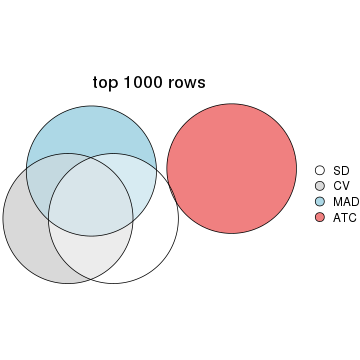</p>

</div>
<div id='tab-top-rows-overlap-by-euler-2'>
<pre><code class="r">top_rows_overlap(res_list, top_n = 2000, method = &quot;euler&quot;)
</code></pre>

<p>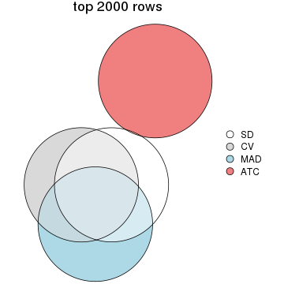</p>

</div>
<div id='tab-top-rows-overlap-by-euler-3'>
<pre><code class="r">top_rows_overlap(res_list, top_n = 3000, method = &quot;euler&quot;)
</code></pre>

<p></p>

</div>
<div id='tab-top-rows-overlap-by-euler-4'>
<pre><code class="r">top_rows_overlap(res_list, top_n = 4000, method = &quot;euler&quot;)
</code></pre>

<p></p>

</div>
<div id='tab-top-rows-overlap-by-euler-5'>
<pre><code class="r">top_rows_overlap(res_list, top_n = 5000, method = &quot;euler&quot;)
</code></pre>

<p>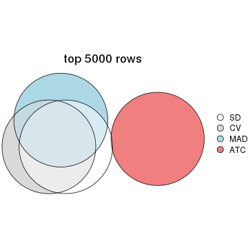</p>

</div>
</div>

Also visualize the correspondance of rankings between different top-row methods:


<script>
$( function() {
	$( '#tabs-top-rows-overlap-by-correspondance' ).tabs();
} );
</script>
<div id='tabs-top-rows-overlap-by-correspondance'>
<ul>
<li><a href='#tab-top-rows-overlap-by-correspondance-1'>top_n = 1000</a></li>
<li><a href='#tab-top-rows-overlap-by-correspondance-2'>top_n = 2000</a></li>
<li><a href='#tab-top-rows-overlap-by-correspondance-3'>top_n = 3000</a></li>
<li><a href='#tab-top-rows-overlap-by-correspondance-4'>top_n = 4000</a></li>
<li><a href='#tab-top-rows-overlap-by-correspondance-5'>top_n = 5000</a></li>
</ul>
<div id='tab-top-rows-overlap-by-correspondance-1'>
<pre><code class="r">top_rows_overlap(res_list, top_n = 1000, method = &quot;correspondance&quot;)
</code></pre>

<p></p>

</div>
<div id='tab-top-rows-overlap-by-correspondance-2'>
<pre><code class="r">top_rows_overlap(res_list, top_n = 2000, method = &quot;correspondance&quot;)
</code></pre>

<p></p>

</div>
<div id='tab-top-rows-overlap-by-correspondance-3'>
<pre><code class="r">top_rows_overlap(res_list, top_n = 3000, method = &quot;correspondance&quot;)
</code></pre>

<p></p>

</div>
<div id='tab-top-rows-overlap-by-correspondance-4'>
<pre><code class="r">top_rows_overlap(res_list, top_n = 4000, method = &quot;correspondance&quot;)
</code></pre>

<p></p>

</div>
<div id='tab-top-rows-overlap-by-correspondance-5'>
<pre><code class="r">top_rows_overlap(res_list, top_n = 5000, method = &quot;correspondance&quot;)
</code></pre>

<p></p>

</div>
</div>


Heatmaps of the top rows:


<script>
$( function() {
	$( '#tabs-top-rows-heatmap' ).tabs();
} );
</script>
<div id='tabs-top-rows-heatmap'>
<ul>
<li><a href='#tab-top-rows-heatmap-1'>top_n = 1000</a></li>
<li><a href='#tab-top-rows-heatmap-2'>top_n = 2000</a></li>
<li><a href='#tab-top-rows-heatmap-3'>top_n = 3000</a></li>
<li><a href='#tab-top-rows-heatmap-4'>top_n = 4000</a></li>
<li><a href='#tab-top-rows-heatmap-5'>top_n = 5000</a></li>
</ul>
<div id='tab-top-rows-heatmap-1'>
<pre><code class="r">top_rows_heatmap(res_list, top_n = 1000)
</code></pre>

<p></p>

</div>
<div id='tab-top-rows-heatmap-2'>
<pre><code class="r">top_rows_heatmap(res_list, top_n = 2000)
</code></pre>

<p></p>

</div>
<div id='tab-top-rows-heatmap-3'>
<pre><code class="r">top_rows_heatmap(res_list, top_n = 3000)
</code></pre>

<p></p>

</div>
<div id='tab-top-rows-heatmap-4'>
<pre><code class="r">top_rows_heatmap(res_list, top_n = 4000)
</code></pre>

<p></p>

</div>
<div id='tab-top-rows-heatmap-5'>
<pre><code class="r">top_rows_heatmap(res_list, top_n = 5000)
</code></pre>

<p></p>

</div>
</div>


### Test to known annotations


Test correlation between subgroups and known annotations. If the known
annotation is numeric, one-way ANOVA test is applied, and if the known
annotation is discrete, chi-squared contingency table test is applied.


<script>
$( function() {
	$( '#tabs-test-to-known-factors-from-consensus-partition-list' ).tabs();
} );
</script>
<div id='tabs-test-to-known-factors-from-consensus-partition-list'>
<ul>
<li><a href='#tab-test-to-known-factors-from-consensus-partition-list-1'>k = 2</a></li>
<li><a href='#tab-test-to-known-factors-from-consensus-partition-list-2'>k = 3</a></li>
<li><a href='#tab-test-to-known-factors-from-consensus-partition-list-3'>k = 4</a></li>
<li><a href='#tab-test-to-known-factors-from-consensus-partition-list-4'>k = 5</a></li>
<li><a href='#tab-test-to-known-factors-from-consensus-partition-list-5'>k = 6</a></li>
</ul>
<div id='tab-test-to-known-factors-from-consensus-partition-list-1'>
<pre><code class="r">test_to_known_factors(res_list, k = 2)
</code></pre>

<pre><code>#&gt;              n agent(p) disease.state(p) gender(p) individual(p) k
#&gt; SD:NMF      58  0.96332            0.719  2.06e-13      1.60e-03 2
#&gt; CV:NMF      84  1.00000            1.000  3.81e-19      8.65e-05 2
#&gt; MAD:NMF     70  0.99455            0.473  7.48e-01      4.53e-03 2
#&gt; ATC:NMF     81  0.47143            0.408  8.98e-01      1.73e-03 2
#&gt; SD:skmeans  10       NA               NA        NA            NA 2
#&gt; CV:skmeans  84  1.00000            1.000  3.81e-19      8.65e-05 2
#&gt; MAD:skmeans 72  0.97897            0.477  3.02e-01      7.14e-04 2
#&gt; ATC:skmeans 83  0.90491            0.446  2.60e-01      6.52e-03 2
#&gt; SD:mclust   84  1.00000            1.000  3.81e-19      8.65e-05 2
#&gt; CV:mclust   84  1.00000            1.000  3.81e-19      8.65e-05 2
#&gt; MAD:mclust  35  0.49215            0.545  1.00e+00      2.82e-02 2
#&gt; ATC:mclust  82  1.00000            1.000  6.59e-01      3.27e-04 2
#&gt; SD:kmeans   18  0.61708            0.393  2.05e-04      5.50e-02 2
#&gt; CV:kmeans   84  1.00000            1.000  3.81e-19      8.65e-05 2
#&gt; MAD:kmeans  83  0.88978            0.445  5.30e-01      2.02e-04 2
#&gt; ATC:kmeans  81  0.75321            0.434  1.00e+00      1.90e-03 2
#&gt; SD:pam       0       NA               NA        NA            NA 2
#&gt; CV:pam      66  0.69763            0.274  1.85e-11      6.36e-03 2
#&gt; MAD:pam     43  0.93745            0.407  3.49e-03      2.51e-01 2
#&gt; ATC:pam     70  0.00418            0.821  1.57e-01      7.98e-02 2
#&gt; SD:hclust   51  1.00000            0.701  8.57e-01      1.60e-03 2
#&gt; CV:hclust   10       NA               NA        NA            NA 2
#&gt; MAD:hclust  50  1.00000            1.000  1.00e+00      2.13e-03 2
#&gt; ATC:hclust  78  1.00000            1.000  7.69e-01      2.08e-04 2
</code></pre>

</div>
<div id='tab-test-to-known-factors-from-consensus-partition-list-2'>
<pre><code class="r">test_to_known_factors(res_list, k = 3)
</code></pre>

<pre><code>#&gt;              n agent(p) disease.state(p) gender(p) individual(p) k
#&gt; SD:NMF      48  1.00000            0.743  3.16e-11      2.52e-03 3
#&gt; CV:NMF      72  1.00000            0.813  1.59e-16      3.40e-04 3
#&gt; MAD:NMF     46  0.30535            0.597  1.70e-02      3.44e-03 3
#&gt; ATC:NMF     72  0.00438            0.191  1.18e-01      2.15e-02 3
#&gt; SD:skmeans  47  0.87270            0.563  3.72e-09      8.15e-05 3
#&gt; CV:skmeans  35       NA               NA        NA            NA 3
#&gt; MAD:skmeans 12       NA               NA        NA            NA 3
#&gt; ATC:skmeans 83  0.03422            0.673  2.33e-01      4.28e-04 3
#&gt; SD:mclust   82  1.00000            0.781  2.19e-16      2.04e-07 3
#&gt; CV:mclust   59  0.98231            0.851  1.54e-13      5.55e-06 3
#&gt; MAD:mclust  75  0.79434            0.215  1.78e-01      1.81e-06 3
#&gt; ATC:mclust  77  0.02381            0.719  6.50e-02      7.03e-04 3
#&gt; SD:kmeans   48  1.00000            0.319  1.52e-08      2.21e-05 3
#&gt; CV:kmeans   76  0.96896            0.337  3.14e-17      5.31e-07 3
#&gt; MAD:kmeans  60  0.77033            1.000  2.50e-01      1.35e-03 3
#&gt; ATC:kmeans  74  0.03055            0.751  2.93e-01      4.45e-04 3
#&gt; SD:pam      47  0.98896            0.111  9.72e-05      1.07e-02 3
#&gt; CV:pam      34       NA               NA        NA            NA 3
#&gt; MAD:pam     33  0.92744            0.132  1.55e-01      6.42e-02 3
#&gt; ATC:pam     73  0.09593            0.845  3.66e-01      3.67e-04 3
#&gt; SD:hclust   45  0.98186            0.785  1.51e-02      5.31e-05 3
#&gt; CV:hclust   78  1.00000            1.000  7.87e-18      2.08e-04 3
#&gt; MAD:hclust  54  1.00000            0.282  1.00e+00      1.52e-03 3
#&gt; ATC:hclust  61  0.55035            0.971  2.48e-02      7.88e-05 3
</code></pre>

</div>
<div id='tab-test-to-known-factors-from-consensus-partition-list-3'>
<pre><code class="r">test_to_known_factors(res_list, k = 4)
</code></pre>

<pre><code>#&gt;              n agent(p) disease.state(p) gender(p) individual(p) k
#&gt; SD:NMF      54  0.93327           0.0877  1.12e-11      5.00e-06 4
#&gt; CV:NMF      55  0.86881           1.0000  9.66e-13      2.48e-03 4
#&gt; MAD:NMF     24  0.87837           0.4979  6.70e-02      1.07e-02 4
#&gt; ATC:NMF     48  0.13220           0.9297  2.18e-02      3.40e-03 4
#&gt; SD:skmeans  43  0.83930           0.4642  1.28e-06      5.75e-06 4
#&gt; CV:skmeans  25       NA               NA        NA            NA 4
#&gt; MAD:skmeans  0       NA               NA        NA            NA 4
#&gt; ATC:skmeans 61  0.01411           0.5032  6.23e-01      7.01e-03 4
#&gt; SD:mclust   74  1.00000           0.2845  3.15e-14      2.08e-09 4
#&gt; CV:mclust   76  0.98549           0.3658  2.21e-16      1.03e-08 4
#&gt; MAD:mclust  58  0.73138           0.3302  1.06e-01      9.75e-06 4
#&gt; ATC:mclust  55  0.03518           0.7659  1.45e-01      7.51e-03 4
#&gt; SD:kmeans   38  1.00000           0.2479  1.47e-05      3.52e-06 4
#&gt; CV:kmeans   68  0.99367           0.1936  1.14e-14      8.59e-09 4
#&gt; MAD:kmeans  39  0.51650           0.3541  1.29e-04      2.76e-04 4
#&gt; ATC:kmeans  76  0.02065           0.8736  1.24e-01      5.55e-04 4
#&gt; SD:pam      33  1.00000           0.0932  8.53e-01      9.43e-02 4
#&gt; CV:pam      18       NA               NA        NA            NA 4
#&gt; MAD:pam     20       NA               NA        NA            NA 4
#&gt; ATC:pam     73  0.00526           0.7843  6.22e-01      1.29e-03 4
#&gt; SD:hclust   46  1.00000           0.9488  9.85e-04      5.23e-07 4
#&gt; CV:hclust   51  0.87364           0.6102  8.42e-12      4.25e-05 4
#&gt; MAD:hclust  34  0.59787           0.1031  5.66e-02      3.75e-03 4
#&gt; ATC:hclust  63  0.85909           0.5966  2.44e-02      9.49e-07 4
</code></pre>

</div>
<div id='tab-test-to-known-factors-from-consensus-partition-list-4'>
<pre><code class="r">test_to_known_factors(res_list, k = 5)
</code></pre>

<pre><code>#&gt;              n agent(p) disease.state(p) gender(p) individual(p) k
#&gt; SD:NMF       6       NA               NA        NA            NA 5
#&gt; CV:NMF      30   0.9418           0.0684  3.06e-07      1.95e-03 5
#&gt; MAD:NMF      8   1.0000           0.4142        NA      4.60e-02 5
#&gt; ATC:NMF     39   0.1040           0.8302  7.69e-02      6.48e-03 5
#&gt; SD:skmeans   9       NA               NA        NA            NA 5
#&gt; CV:skmeans   0       NA               NA        NA            NA 5
#&gt; MAD:skmeans  0       NA               NA        NA            NA 5
#&gt; ATC:skmeans 65   0.2622           0.2916  3.99e-02      1.09e-04 5
#&gt; SD:mclust   74   0.9780           0.1151  4.09e-13      2.52e-11 5
#&gt; CV:mclust   74   0.9750           0.1526  3.24e-15      9.67e-11 5
#&gt; MAD:mclust  45   0.9483           0.1123  5.76e-02      1.57e-04 5
#&gt; ATC:mclust  39   0.1608           0.7939  7.53e-01      1.13e-02 5
#&gt; SD:kmeans   59   0.9993           0.2861  9.16e-10      3.34e-10 5
#&gt; CV:kmeans   53   0.9927           0.5650  1.83e-11      5.22e-07 5
#&gt; MAD:kmeans  17   1.0000           0.4916  4.33e-01      3.01e-02 5
#&gt; ATC:kmeans  48   0.0991           0.7454  7.89e-03      1.11e-03 5
#&gt; SD:pam      30   0.9931           0.0481  4.15e-03      2.17e-03 5
#&gt; CV:pam      15       NA               NA        NA            NA 5
#&gt; MAD:pam     16       NA               NA        NA            NA 5
#&gt; ATC:pam     70   0.0162           0.7321  2.19e-02      5.23e-05 5
#&gt; SD:hclust   26   1.0000           0.0734  3.70e-03      6.24e-05 5
#&gt; CV:hclust   49   1.0000           0.4796  1.90e-11      2.83e-03 5
#&gt; MAD:hclust  10   1.0000           0.2586  6.28e-01      4.04e-02 5
#&gt; ATC:hclust  37   0.9706           0.3629  1.37e-01      8.59e-04 5
</code></pre>

</div>
<div id='tab-test-to-known-factors-from-consensus-partition-list-5'>
<pre><code class="r">test_to_known_factors(res_list, k = 6)
</code></pre>

<pre><code>#&gt;              n agent(p) disease.state(p) gender(p) individual(p) k
#&gt; SD:NMF      11  0.97415           0.1997  4.09e-03      3.75e-02 6
#&gt; CV:NMF       1       NA               NA        NA            NA 6
#&gt; MAD:NMF      0       NA               NA        NA            NA 6
#&gt; ATC:NMF     24  0.10551           0.2737  7.64e-01      3.09e-02 6
#&gt; SD:skmeans   0       NA               NA        NA            NA 6
#&gt; CV:skmeans   0       NA               NA        NA            NA 6
#&gt; MAD:skmeans  0       NA               NA        NA            NA 6
#&gt; ATC:skmeans 54  0.46388           0.3878  1.66e-01      2.92e-06 6
#&gt; SD:mclust   69  0.99664           0.0770  1.75e-11      2.05e-13 6
#&gt; CV:mclust   74  0.99370           0.1706  1.50e-14      1.65e-11 6
#&gt; MAD:mclust  44  0.78737           0.0634  8.21e-02      2.09e-05 6
#&gt; ATC:mclust  55  0.01048           0.2504  1.94e-01      1.28e-03 6
#&gt; SD:kmeans   51  0.94841           0.3169  1.58e-07      3.74e-10 6
#&gt; CV:kmeans   56  0.55056           0.4308  2.01e-11      7.21e-09 6
#&gt; MAD:kmeans  28  0.98688           0.0520  2.82e-02      1.31e-05 6
#&gt; ATC:kmeans  44  0.22061           0.6256  1.15e-01      5.73e-04 6
#&gt; SD:pam      28  0.97732           0.0287  2.88e-02      1.95e-03 6
#&gt; CV:pam      16       NA               NA        NA            NA 6
#&gt; MAD:pam     18  1.00000           0.0890  8.41e-01      1.58e-01 6
#&gt; ATC:pam     71  0.00221           0.6512  8.82e-02      2.48e-04 6
#&gt; SD:hclust   30  0.99743           0.0518  1.69e-04      6.23e-07 6
#&gt; CV:hclust   43  0.90356           0.6541  4.08e-10      6.93e-03 6
#&gt; MAD:hclust  20  0.89571           0.1222  4.99e-04      1.76e-04 6
#&gt; ATC:hclust  42  0.98993           0.2157  6.33e-02      1.56e-07 6
</code></pre>

</div>
</div>


 
## Results for each method


---------------------------------------------------


### SD:hclust


The object with results only for a single top-value method and a single partition method 
can be extracted as:

```r
res = res_list["SD", "hclust"]
# you can also extract it by
# res = res_list["SD:hclust"]
```

A summary of `res` and all the functions that can be applied to it:

```r
res
```

```
#> A 'ConsensusPartition' object with k = 2, 3, 4, 5, 6.
#>   On a matrix with 51941 rows and 84 columns.
#>   Top rows (1000, 2000, 3000, 4000, 5000) are extracted by 'SD' method.
#>   Subgroups are detected by 'hclust' method.
#>   Performed in total 1250 partitions by row resampling.
#>   Best k for subgroups seems to be 3.
#> 
#> Following methods can be applied to this 'ConsensusPartition' object:
#>  [1] "cola_report"             "collect_classes"         "collect_plots"          
#>  [4] "collect_stats"           "colnames"                "compare_signatures"     
#>  [7] "consensus_heatmap"       "dimension_reduction"     "functional_enrichment"  
#> [10] "get_anno_col"            "get_anno"                "get_classes"            
#> [13] "get_consensus"           "get_matrix"              "get_membership"         
#> [16] "get_param"               "get_signatures"          "get_stats"              
#> [19] "is_best_k"               "is_stable_k"             "membership_heatmap"     
#> [22] "ncol"                    "nrow"                    "plot_ecdf"              
#> [25] "rownames"                "select_partition_number" "show"                   
#> [28] "suggest_best_k"          "test_to_known_factors"
```

`collect_plots()` function collects all the plots made from `res` for all `k` (number of partitions)
into one single page to provide an easy and fast comparison between different `k`.

```r
collect_plots(res)
```


The plots are:

- The first row: a plot of the ECDF (Empirical cumulative distribution
  function) curves of the consensus matrix for each `k` and the heatmap of
  predicted classes for each `k`.
- The second row: heatmaps of the consensus matrix for each `k`.
- The third row: heatmaps of the membership matrix for each `k`.
- The fouth row: heatmaps of the signatures for each `k`.

All the plots in panels can be made by individual functions and they are
plotted later in this section.

`select_partition_number()` produces several plots showing different
statistics for choosing "optimized" `k`. There are following statistics:

- ECDF curves of the consensus matrix for each `k`;
- 1-PAC. [The PAC
  score](https://en.wikipedia.org/wiki/Consensus_clustering#Over-interpretation_potential_of_consensus_clustering)
  measures the proportion of the ambiguous subgrouping.
- Mean silhouette score.
- Concordance. The mean probability of fiting the consensus class ids in all
  partitions.
- Area increased. Denote $A_k$ as the area under the ECDF curve for current
  `k`, the area increased is defined as $A_k - A_{k-1}$.
- Rand index. The percent of pairs of samples that are both in a same cluster
  or both are not in a same cluster in the partition of k and k-1.
- Jaccard index. The ratio of pairs of samples are both in a same cluster in
  the partition of k and k-1 and the pairs of samples are both in a same
  cluster in the partition k or k-1.

The detailed explanations of these statistics can be found in [the cola
vignette](http://bioconductor.org/packages/devel/bioc/vignettes/cola/inst/doc/cola.html#toc_13).

Generally speaking, lower PAC score, higher mean silhouette score or higher
concordance corresponds to better partition. Rand index and Jaccard index
measure how similar the current partition is compared to partition with `k-1`.
If they are too similar, we won't accept `k` is better than `k-1`.

```r
select_partition_number(res)
```


The numeric values for all these statistics can be obtained by `get_stats()`.

```r
get_stats(res)
```

```
#>   k  1-PAC mean_silhouette concordance area_increased  Rand Jaccard
#> 2 2 0.0668           0.490       0.742         0.3485 0.826   0.826
#> 3 3 0.1571           0.441       0.641         0.4984 0.629   0.556
#> 4 4 0.2301           0.479       0.638         0.1866 0.869   0.736
#> 5 5 0.2931           0.352       0.598         0.1153 0.764   0.484
#> 6 6 0.3512           0.355       0.595         0.0612 0.836   0.557
```

`suggest_best_k()` suggests the best $k$ based on these statistics. The rules are as follows:

- All $k$ with Jaccard index larger than 0.95 are removed because the increase of
  the partition number does not provides enough extra information. If all $k$ are removed,
  the best $k$ is assigned by `NA`.
- For $k$ with 1-PAC larger than 0.9, the maximal $k$ is taken as the "best k". Other $k$ is called "optional k".
- If it does not fit the second rule. The $k$ with the highest vote of highest
  1-PAC, mean silhouette and concordance is taken as the "best k".

```r
suggest_best_k(res)
```

```
#> [1] 3
```


Following shows the table of the partitions (You need to click the **show/hide
code output** link to see it). The membership matrix (columns with name `p*`)
is inferred by
[`clue::cl_consensus()`](https://www.rdocumentation.org/link/cl_consensus?package=clue)
function with the `SE` method. Basically the value in the membership matrix
represents the probability to belong to a certain group. The finall class
label for an item is determined with the group with highest probability it
belongs to.

In `get_classes()` function, the entropy is calculated from the membership
matrix and the silhouette score is calculated from the consensus matrix.


<script>
$( function() {
	$( '#tabs-SD-hclust-get-classes' ).tabs();
} );
</script>
<div id='tabs-SD-hclust-get-classes'>
<ul>
<li><a href='#tab-SD-hclust-get-classes-1'>k = 2</a></li>
<li><a href='#tab-SD-hclust-get-classes-2'>k = 3</a></li>
<li><a href='#tab-SD-hclust-get-classes-3'>k = 4</a></li>
<li><a href='#tab-SD-hclust-get-classes-4'>k = 5</a></li>
<li><a href='#tab-SD-hclust-get-classes-5'>k = 6</a></li>
</ul>

<div id='tab-SD-hclust-get-classes-1'>
<p><a id='tab-SD-hclust-get-classes-1-a' style='color:#0366d6' href='#'>show/hide code output</a></p>
<pre><code class="r">cbind(get_classes(res, k = 2), get_membership(res, k = 2))
</code></pre>

<pre><code>#&gt;            class entropy silhouette    p1    p2
#&gt; GSM1269647     1   0.963     0.3921 0.612 0.388
#&gt; GSM1269655     1   0.653     0.6286 0.832 0.168
#&gt; GSM1269663     1   0.949     0.2857 0.632 0.368
#&gt; GSM1269671     1   0.999     0.0961 0.516 0.484
#&gt; GSM1269679     1   0.706     0.6118 0.808 0.192
#&gt; GSM1269693     1   0.921     0.1854 0.664 0.336
#&gt; GSM1269701     1   0.552     0.6373 0.872 0.128
#&gt; GSM1269709     1   0.714     0.6125 0.804 0.196
#&gt; GSM1269715     1   0.821     0.3346 0.744 0.256
#&gt; GSM1269717     1   0.469     0.5587 0.900 0.100
#&gt; GSM1269721     2   0.949     0.4933 0.368 0.632
#&gt; GSM1269723     1   0.563     0.6347 0.868 0.132
#&gt; GSM1269645     1   0.745     0.5108 0.788 0.212
#&gt; GSM1269653     1   0.939     0.4244 0.644 0.356
#&gt; GSM1269661     1   0.689     0.6290 0.816 0.184
#&gt; GSM1269669     1   0.373     0.6341 0.928 0.072
#&gt; GSM1269677     2   0.861     0.8142 0.284 0.716
#&gt; GSM1269685     1   0.402     0.6325 0.920 0.080
#&gt; GSM1269691     1   0.402     0.6354 0.920 0.080
#&gt; GSM1269699     1   0.998     0.1100 0.528 0.472
#&gt; GSM1269707     1   0.998     0.1100 0.528 0.472
#&gt; GSM1269651     2   0.821     0.8353 0.256 0.744
#&gt; GSM1269659     1   1.000    -0.2042 0.508 0.492
#&gt; GSM1269667     1   0.653     0.6336 0.832 0.168
#&gt; GSM1269675     1   0.978     0.3373 0.588 0.412
#&gt; GSM1269683     1   0.443     0.5932 0.908 0.092
#&gt; GSM1269689     1   0.949     0.4227 0.632 0.368
#&gt; GSM1269697     1   0.969     0.3699 0.604 0.396
#&gt; GSM1269705     1   0.961     0.3856 0.616 0.384
#&gt; GSM1269713     1   0.900     0.4746 0.684 0.316
#&gt; GSM1269719     1   0.827     0.5701 0.740 0.260
#&gt; GSM1269725     1   0.943     0.4256 0.640 0.360
#&gt; GSM1269727     1   0.605     0.6329 0.852 0.148
#&gt; GSM1269649     1   0.714     0.6181 0.804 0.196
#&gt; GSM1269657     1   0.997    -0.1228 0.532 0.468
#&gt; GSM1269665     1   0.730     0.5142 0.796 0.204
#&gt; GSM1269673     1   0.373     0.6325 0.928 0.072
#&gt; GSM1269681     2   0.821     0.8353 0.256 0.744
#&gt; GSM1269687     1   0.358     0.6246 0.932 0.068
#&gt; GSM1269695     1   0.494     0.6429 0.892 0.108
#&gt; GSM1269703     1   0.574     0.6215 0.864 0.136
#&gt; GSM1269711     1   0.653     0.6292 0.832 0.168
#&gt; GSM1269646     1   0.963     0.3921 0.612 0.388
#&gt; GSM1269654     1   0.653     0.6286 0.832 0.168
#&gt; GSM1269662     1   0.949     0.2857 0.632 0.368
#&gt; GSM1269670     1   0.999     0.0961 0.516 0.484
#&gt; GSM1269678     1   0.706     0.6118 0.808 0.192
#&gt; GSM1269692     1   0.913     0.1968 0.672 0.328
#&gt; GSM1269700     1   0.552     0.6373 0.872 0.128
#&gt; GSM1269708     1   0.714     0.6125 0.804 0.196
#&gt; GSM1269714     1   0.456     0.5605 0.904 0.096
#&gt; GSM1269716     1   0.469     0.5587 0.900 0.100
#&gt; GSM1269720     2   0.949     0.4933 0.368 0.632
#&gt; GSM1269722     1   0.563     0.6347 0.868 0.132
#&gt; GSM1269644     1   0.706     0.5362 0.808 0.192
#&gt; GSM1269652     1   0.939     0.4244 0.644 0.356
#&gt; GSM1269660     1   0.689     0.6290 0.816 0.184
#&gt; GSM1269668     1   0.373     0.6341 0.928 0.072
#&gt; GSM1269676     2   0.861     0.8142 0.284 0.716
#&gt; GSM1269684     1   0.402     0.6325 0.920 0.080
#&gt; GSM1269690     1   0.402     0.6354 0.920 0.080
#&gt; GSM1269698     1   0.998     0.1100 0.528 0.472
#&gt; GSM1269706     1   0.998     0.1100 0.528 0.472
#&gt; GSM1269650     2   0.821     0.8353 0.256 0.744
#&gt; GSM1269658     1   1.000    -0.2042 0.508 0.492
#&gt; GSM1269666     1   0.653     0.6336 0.832 0.168
#&gt; GSM1269674     1   0.978     0.3373 0.588 0.412
#&gt; GSM1269682     1   0.443     0.5932 0.908 0.092
#&gt; GSM1269688     1   0.949     0.4227 0.632 0.368
#&gt; GSM1269696     1   0.969     0.3699 0.604 0.396
#&gt; GSM1269704     1   0.961     0.3856 0.616 0.384
#&gt; GSM1269712     1   0.900     0.4746 0.684 0.316
#&gt; GSM1269718     1   0.827     0.5701 0.740 0.260
#&gt; GSM1269724     1   0.943     0.4256 0.640 0.360
#&gt; GSM1269726     1   0.605     0.6329 0.852 0.148
#&gt; GSM1269648     1   0.714     0.6181 0.804 0.196
#&gt; GSM1269656     1   0.997    -0.1228 0.532 0.468
#&gt; GSM1269664     1   0.714     0.5277 0.804 0.196
#&gt; GSM1269672     1   0.373     0.6325 0.928 0.072
#&gt; GSM1269680     2   0.821     0.8353 0.256 0.744
#&gt; GSM1269686     1   0.358     0.6246 0.932 0.068
#&gt; GSM1269694     1   0.494     0.6429 0.892 0.108
#&gt; GSM1269702     1   0.494     0.6192 0.892 0.108
#&gt; GSM1269710     1   0.653     0.6292 0.832 0.168
</code></pre>

<script>
$('#tab-SD-hclust-get-classes-1-a').parent().next().next().hide();
$('#tab-SD-hclust-get-classes-1-a').click(function(){
  $('#tab-SD-hclust-get-classes-1-a').parent().next().next().toggle();
  return(false);
});
</script>
</div>

<div id='tab-SD-hclust-get-classes-2'>
<p><a id='tab-SD-hclust-get-classes-2-a' style='color:#0366d6' href='#'>show/hide code output</a></p>
<pre><code class="r">cbind(get_classes(res, k = 3), get_membership(res, k = 3))
</code></pre>

<pre><code>#&gt;            class entropy silhouette    p1    p2    p3
#&gt; GSM1269647     3   0.662     0.7988 0.436 0.008 0.556
#&gt; GSM1269655     1   0.580     0.4698 0.776 0.040 0.184
#&gt; GSM1269663     1   0.913    -0.1216 0.480 0.372 0.148
#&gt; GSM1269671     3   0.733     0.7648 0.312 0.052 0.636
#&gt; GSM1269679     1   0.603     0.1570 0.712 0.016 0.272
#&gt; GSM1269693     1   0.958    -0.1912 0.480 0.248 0.272
#&gt; GSM1269701     1   0.563     0.3485 0.768 0.024 0.208
#&gt; GSM1269709     1   0.619     0.3416 0.724 0.028 0.248
#&gt; GSM1269715     1   0.805     0.0916 0.568 0.076 0.356
#&gt; GSM1269717     1   0.486     0.5275 0.840 0.044 0.116
#&gt; GSM1269721     2   0.875     0.6545 0.144 0.564 0.292
#&gt; GSM1269723     1   0.568     0.3423 0.764 0.024 0.212
#&gt; GSM1269645     1   0.774     0.4378 0.672 0.204 0.124
#&gt; GSM1269653     1   0.851    -0.6283 0.476 0.092 0.432
#&gt; GSM1269661     1   0.670     0.2962 0.712 0.052 0.236
#&gt; GSM1269669     1   0.368     0.5177 0.876 0.008 0.116
#&gt; GSM1269677     2   0.409     0.7483 0.068 0.880 0.052
#&gt; GSM1269685     1   0.371     0.5396 0.892 0.032 0.076
#&gt; GSM1269691     1   0.401     0.5338 0.876 0.028 0.096
#&gt; GSM1269699     3   0.824     0.7449 0.336 0.092 0.572
#&gt; GSM1269707     3   0.824     0.7449 0.336 0.092 0.572
#&gt; GSM1269651     2   0.444     0.7533 0.052 0.864 0.084
#&gt; GSM1269659     2   0.986     0.5109 0.304 0.416 0.280
#&gt; GSM1269667     1   0.598     0.2648 0.728 0.020 0.252
#&gt; GSM1269675     3   0.681     0.8035 0.404 0.016 0.580
#&gt; GSM1269683     1   0.440     0.5432 0.864 0.044 0.092
#&gt; GSM1269689     3   0.681     0.7376 0.464 0.012 0.524
#&gt; GSM1269697     3   0.623     0.8005 0.436 0.000 0.564
#&gt; GSM1269705     3   0.775     0.7227 0.460 0.048 0.492
#&gt; GSM1269713     1   0.650    -0.6035 0.532 0.004 0.464
#&gt; GSM1269719     1   0.806     0.4286 0.652 0.156 0.192
#&gt; GSM1269725     3   0.652     0.7265 0.484 0.004 0.512
#&gt; GSM1269727     1   0.594     0.4432 0.760 0.036 0.204
#&gt; GSM1269649     1   0.671     0.1713 0.672 0.032 0.296
#&gt; GSM1269657     2   0.865     0.3528 0.360 0.528 0.112
#&gt; GSM1269665     1   0.750     0.4461 0.688 0.200 0.112
#&gt; GSM1269673     1   0.377     0.5366 0.888 0.028 0.084
#&gt; GSM1269681     2   0.418     0.7542 0.052 0.876 0.072
#&gt; GSM1269687     1   0.324     0.5529 0.912 0.032 0.056
#&gt; GSM1269695     1   0.484     0.4551 0.816 0.016 0.168
#&gt; GSM1269703     1   0.556     0.5141 0.808 0.064 0.128
#&gt; GSM1269711     1   0.623     0.2273 0.700 0.020 0.280
#&gt; GSM1269646     3   0.662     0.7988 0.436 0.008 0.556
#&gt; GSM1269654     1   0.580     0.4698 0.776 0.040 0.184
#&gt; GSM1269662     1   0.913    -0.1216 0.480 0.372 0.148
#&gt; GSM1269670     3   0.733     0.7648 0.312 0.052 0.636
#&gt; GSM1269678     1   0.603     0.1570 0.712 0.016 0.272
#&gt; GSM1269692     1   0.945    -0.1344 0.500 0.232 0.268
#&gt; GSM1269700     1   0.563     0.3485 0.768 0.024 0.208
#&gt; GSM1269708     1   0.619     0.3416 0.724 0.028 0.248
#&gt; GSM1269714     1   0.493     0.5266 0.836 0.044 0.120
#&gt; GSM1269716     1   0.486     0.5275 0.840 0.044 0.116
#&gt; GSM1269720     2   0.875     0.6545 0.144 0.564 0.292
#&gt; GSM1269722     1   0.568     0.3423 0.764 0.024 0.212
#&gt; GSM1269644     1   0.738     0.4601 0.700 0.184 0.116
#&gt; GSM1269652     1   0.851    -0.6283 0.476 0.092 0.432
#&gt; GSM1269660     1   0.670     0.2962 0.712 0.052 0.236
#&gt; GSM1269668     1   0.368     0.5177 0.876 0.008 0.116
#&gt; GSM1269676     2   0.409     0.7483 0.068 0.880 0.052
#&gt; GSM1269684     1   0.383     0.5408 0.888 0.036 0.076
#&gt; GSM1269690     1   0.401     0.5338 0.876 0.028 0.096
#&gt; GSM1269698     3   0.824     0.7449 0.336 0.092 0.572
#&gt; GSM1269706     3   0.824     0.7449 0.336 0.092 0.572
#&gt; GSM1269650     2   0.444     0.7533 0.052 0.864 0.084
#&gt; GSM1269658     2   0.986     0.5109 0.304 0.416 0.280
#&gt; GSM1269666     1   0.598     0.2648 0.728 0.020 0.252
#&gt; GSM1269674     3   0.681     0.8035 0.404 0.016 0.580
#&gt; GSM1269682     1   0.440     0.5432 0.864 0.044 0.092
#&gt; GSM1269688     3   0.681     0.7376 0.464 0.012 0.524
#&gt; GSM1269696     3   0.623     0.8005 0.436 0.000 0.564
#&gt; GSM1269704     3   0.775     0.7227 0.460 0.048 0.492
#&gt; GSM1269712     1   0.650    -0.6035 0.532 0.004 0.464
#&gt; GSM1269718     1   0.806     0.4286 0.652 0.156 0.192
#&gt; GSM1269724     3   0.652     0.7265 0.484 0.004 0.512
#&gt; GSM1269726     1   0.594     0.4432 0.760 0.036 0.204
#&gt; GSM1269648     1   0.671     0.1713 0.672 0.032 0.296
#&gt; GSM1269656     2   0.865     0.3528 0.360 0.528 0.112
#&gt; GSM1269664     1   0.730     0.4593 0.704 0.188 0.108
#&gt; GSM1269672     1   0.377     0.5366 0.888 0.028 0.084
#&gt; GSM1269680     2   0.418     0.7542 0.052 0.876 0.072
#&gt; GSM1269686     1   0.324     0.5529 0.912 0.032 0.056
#&gt; GSM1269694     1   0.484     0.4551 0.816 0.016 0.168
#&gt; GSM1269702     1   0.442     0.5373 0.864 0.048 0.088
#&gt; GSM1269710     1   0.623     0.2273 0.700 0.020 0.280
</code></pre>

<script>
$('#tab-SD-hclust-get-classes-2-a').parent().next().next().hide();
$('#tab-SD-hclust-get-classes-2-a').click(function(){
  $('#tab-SD-hclust-get-classes-2-a').parent().next().next().toggle();
  return(false);
});
</script>
</div>

<div id='tab-SD-hclust-get-classes-3'>
<p><a id='tab-SD-hclust-get-classes-3-a' style='color:#0366d6' href='#'>show/hide code output</a></p>
<pre><code class="r">cbind(get_classes(res, k = 4), get_membership(res, k = 4))
</code></pre>

<pre><code>#&gt;            class entropy silhouette    p1    p2    p3    p4
#&gt; GSM1269647     3  0.5037      0.688 0.264 0.008 0.712 0.016
#&gt; GSM1269655     1  0.6668      0.460 0.652 0.020 0.228 0.100
#&gt; GSM1269663     1  0.9185     -0.247 0.400 0.268 0.084 0.248
#&gt; GSM1269671     3  0.4033      0.634 0.116 0.004 0.836 0.044
#&gt; GSM1269679     1  0.6357      0.173 0.544 0.000 0.388 0.068
#&gt; GSM1269693     4  0.6902      0.597 0.276 0.120 0.008 0.596
#&gt; GSM1269701     1  0.6254      0.346 0.624 0.004 0.300 0.072
#&gt; GSM1269709     1  0.6770      0.356 0.584 0.004 0.304 0.108
#&gt; GSM1269715     4  0.4980      0.489 0.304 0.000 0.016 0.680
#&gt; GSM1269717     1  0.5309      0.485 0.700 0.000 0.044 0.256
#&gt; GSM1269721     4  0.6538      0.353 0.036 0.460 0.020 0.484
#&gt; GSM1269723     1  0.6374      0.322 0.592 0.000 0.324 0.084
#&gt; GSM1269645     1  0.7030      0.397 0.680 0.120 0.116 0.084
#&gt; GSM1269653     3  0.7931      0.525 0.288 0.052 0.540 0.120
#&gt; GSM1269661     1  0.6610      0.333 0.616 0.032 0.304 0.048
#&gt; GSM1269669     1  0.4559      0.542 0.792 0.004 0.164 0.040
#&gt; GSM1269677     2  0.3173      0.631 0.016 0.888 0.016 0.080
#&gt; GSM1269685     1  0.3383      0.577 0.872 0.012 0.100 0.016
#&gt; GSM1269691     1  0.3594      0.572 0.860 0.008 0.108 0.024
#&gt; GSM1269699     3  0.6447      0.607 0.140 0.040 0.708 0.112
#&gt; GSM1269707     3  0.6447      0.607 0.140 0.040 0.708 0.112
#&gt; GSM1269651     2  0.2021      0.645 0.000 0.936 0.024 0.040
#&gt; GSM1269659     4  0.7078      0.593 0.120 0.312 0.008 0.560
#&gt; GSM1269667     1  0.6435      0.289 0.572 0.004 0.356 0.068
#&gt; GSM1269675     3  0.4919      0.680 0.200 0.000 0.752 0.048
#&gt; GSM1269683     1  0.5591      0.541 0.732 0.004 0.096 0.168
#&gt; GSM1269689     3  0.5311      0.606 0.328 0.000 0.648 0.024
#&gt; GSM1269697     3  0.4855      0.682 0.268 0.000 0.712 0.020
#&gt; GSM1269705     3  0.6699      0.624 0.304 0.044 0.612 0.040
#&gt; GSM1269713     3  0.5778      0.506 0.356 0.000 0.604 0.040
#&gt; GSM1269719     1  0.8203      0.437 0.560 0.084 0.220 0.136
#&gt; GSM1269725     3  0.5300      0.622 0.308 0.000 0.664 0.028
#&gt; GSM1269727     1  0.6323      0.436 0.628 0.000 0.272 0.100
#&gt; GSM1269649     1  0.6220      0.248 0.600 0.020 0.348 0.032
#&gt; GSM1269657     2  0.7911      0.168 0.336 0.508 0.108 0.048
#&gt; GSM1269665     1  0.6928      0.413 0.688 0.116 0.112 0.084
#&gt; GSM1269673     1  0.3134      0.573 0.880 0.008 0.100 0.012
#&gt; GSM1269681     2  0.0657      0.664 0.000 0.984 0.012 0.004
#&gt; GSM1269687     1  0.3238      0.580 0.880 0.008 0.092 0.020
#&gt; GSM1269695     1  0.4756      0.498 0.756 0.008 0.216 0.020
#&gt; GSM1269703     1  0.4881      0.558 0.792 0.036 0.148 0.024
#&gt; GSM1269711     1  0.5695      0.281 0.624 0.008 0.344 0.024
#&gt; GSM1269646     3  0.5037      0.688 0.264 0.008 0.712 0.016
#&gt; GSM1269654     1  0.6668      0.460 0.652 0.020 0.228 0.100
#&gt; GSM1269662     1  0.9185     -0.247 0.400 0.268 0.084 0.248
#&gt; GSM1269670     3  0.4033      0.634 0.116 0.004 0.836 0.044
#&gt; GSM1269678     1  0.6357      0.173 0.544 0.000 0.388 0.068
#&gt; GSM1269692     4  0.6962      0.582 0.292 0.108 0.012 0.588
#&gt; GSM1269700     1  0.6254      0.346 0.624 0.004 0.300 0.072
#&gt; GSM1269708     1  0.6770      0.356 0.584 0.004 0.304 0.108
#&gt; GSM1269714     1  0.6188      0.463 0.636 0.004 0.072 0.288
#&gt; GSM1269716     1  0.5309      0.485 0.700 0.000 0.044 0.256
#&gt; GSM1269720     4  0.6538      0.353 0.036 0.460 0.020 0.484
#&gt; GSM1269722     1  0.6374      0.322 0.592 0.000 0.324 0.084
#&gt; GSM1269644     1  0.6643      0.454 0.708 0.112 0.104 0.076
#&gt; GSM1269652     3  0.7931      0.525 0.288 0.052 0.540 0.120
#&gt; GSM1269660     1  0.6610      0.333 0.616 0.032 0.304 0.048
#&gt; GSM1269668     1  0.4559      0.542 0.792 0.004 0.164 0.040
#&gt; GSM1269676     2  0.3173      0.631 0.016 0.888 0.016 0.080
#&gt; GSM1269684     1  0.3502      0.577 0.868 0.016 0.100 0.016
#&gt; GSM1269690     1  0.3594      0.572 0.860 0.008 0.108 0.024
#&gt; GSM1269698     3  0.6447      0.607 0.140 0.040 0.708 0.112
#&gt; GSM1269706     3  0.6447      0.607 0.140 0.040 0.708 0.112
#&gt; GSM1269650     2  0.2021      0.645 0.000 0.936 0.024 0.040
#&gt; GSM1269658     4  0.7078      0.593 0.120 0.312 0.008 0.560
#&gt; GSM1269666     1  0.6435      0.289 0.572 0.004 0.356 0.068
#&gt; GSM1269674     3  0.4919      0.680 0.200 0.000 0.752 0.048
#&gt; GSM1269682     1  0.5591      0.541 0.732 0.004 0.096 0.168
#&gt; GSM1269688     3  0.5311      0.606 0.328 0.000 0.648 0.024
#&gt; GSM1269696     3  0.4855      0.682 0.268 0.000 0.712 0.020
#&gt; GSM1269704     3  0.6699      0.624 0.304 0.044 0.612 0.040
#&gt; GSM1269712     3  0.5778      0.506 0.356 0.000 0.604 0.040
#&gt; GSM1269718     1  0.8203      0.437 0.560 0.084 0.220 0.136
#&gt; GSM1269724     3  0.5300      0.622 0.308 0.000 0.664 0.028
#&gt; GSM1269726     1  0.6323      0.436 0.628 0.000 0.272 0.100
#&gt; GSM1269648     1  0.6220      0.248 0.600 0.020 0.348 0.032
#&gt; GSM1269656     2  0.7911      0.168 0.336 0.508 0.108 0.048
#&gt; GSM1269664     1  0.6713      0.445 0.704 0.112 0.100 0.084
#&gt; GSM1269672     1  0.3134      0.573 0.880 0.008 0.100 0.012
#&gt; GSM1269680     2  0.0657      0.664 0.000 0.984 0.012 0.004
#&gt; GSM1269686     1  0.3238      0.580 0.880 0.008 0.092 0.020
#&gt; GSM1269694     1  0.4756      0.498 0.756 0.008 0.216 0.020
#&gt; GSM1269702     1  0.4112      0.576 0.840 0.028 0.112 0.020
#&gt; GSM1269710     1  0.5695      0.281 0.624 0.008 0.344 0.024
</code></pre>

<script>
$('#tab-SD-hclust-get-classes-3-a').parent().next().next().hide();
$('#tab-SD-hclust-get-classes-3-a').click(function(){
  $('#tab-SD-hclust-get-classes-3-a').parent().next().next().toggle();
  return(false);
});
</script>
</div>

<div id='tab-SD-hclust-get-classes-4'>
<p><a id='tab-SD-hclust-get-classes-4-a' style='color:#0366d6' href='#'>show/hide code output</a></p>
<pre><code class="r">cbind(get_classes(res, k = 5), get_membership(res, k = 5))
</code></pre>

<pre><code>#&gt;            class entropy silhouette    p1    p2    p3    p4    p5
#&gt; GSM1269647     3   0.434      0.240 0.048 0.008 0.764 0.000 0.180
#&gt; GSM1269655     3   0.722      0.112 0.372 0.008 0.452 0.124 0.044
#&gt; GSM1269663     1   0.864     -0.223 0.408 0.160 0.028 0.256 0.148
#&gt; GSM1269671     5   0.529      0.555 0.048 0.000 0.464 0.000 0.488
#&gt; GSM1269679     3   0.543      0.445 0.216 0.000 0.676 0.096 0.012
#&gt; GSM1269693     4   0.374      0.571 0.112 0.040 0.012 0.832 0.004
#&gt; GSM1269701     3   0.602      0.313 0.320 0.000 0.576 0.084 0.020
#&gt; GSM1269709     3   0.691      0.265 0.304 0.000 0.516 0.136 0.044
#&gt; GSM1269715     4   0.533      0.467 0.136 0.000 0.028 0.720 0.116
#&gt; GSM1269717     1   0.713      0.176 0.400 0.000 0.224 0.356 0.020
#&gt; GSM1269721     4   0.590      0.307 0.020 0.372 0.020 0.560 0.028
#&gt; GSM1269723     3   0.606      0.372 0.276 0.000 0.596 0.112 0.016
#&gt; GSM1269645     1   0.465      0.440 0.792 0.024 0.028 0.036 0.120
#&gt; GSM1269653     3   0.719     -0.249 0.152 0.016 0.488 0.024 0.320
#&gt; GSM1269661     1   0.704      0.187 0.456 0.008 0.384 0.036 0.116
#&gt; GSM1269669     1   0.528      0.431 0.624 0.000 0.320 0.012 0.044
#&gt; GSM1269677     2   0.464      0.626 0.020 0.772 0.000 0.116 0.092
#&gt; GSM1269685     1   0.439      0.531 0.744 0.000 0.216 0.024 0.016
#&gt; GSM1269691     1   0.498      0.522 0.708 0.000 0.228 0.028 0.036
#&gt; GSM1269699     5   0.588      0.785 0.084 0.008 0.364 0.000 0.544
#&gt; GSM1269707     5   0.589      0.785 0.084 0.008 0.368 0.000 0.540
#&gt; GSM1269651     2   0.165      0.658 0.004 0.944 0.000 0.020 0.032
#&gt; GSM1269659     4   0.495      0.516 0.036 0.224 0.000 0.712 0.028
#&gt; GSM1269667     3   0.606      0.369 0.272 0.004 0.608 0.100 0.016
#&gt; GSM1269675     3   0.516     -0.260 0.048 0.000 0.620 0.004 0.328
#&gt; GSM1269683     1   0.714      0.127 0.448 0.000 0.296 0.232 0.024
#&gt; GSM1269689     3   0.520      0.256 0.152 0.000 0.708 0.008 0.132
#&gt; GSM1269697     3   0.361      0.294 0.040 0.000 0.812 0.000 0.148
#&gt; GSM1269705     3   0.586      0.294 0.084 0.028 0.700 0.024 0.164
#&gt; GSM1269713     3   0.295      0.481 0.100 0.000 0.868 0.004 0.028
#&gt; GSM1269719     1   0.780      0.123 0.456 0.024 0.332 0.108 0.080
#&gt; GSM1269725     3   0.280      0.426 0.060 0.000 0.888 0.008 0.044
#&gt; GSM1269727     3   0.747      0.179 0.356 0.000 0.428 0.140 0.076
#&gt; GSM1269649     1   0.625      0.290 0.504 0.004 0.356 0.000 0.136
#&gt; GSM1269657     2   0.825      0.281 0.296 0.456 0.108 0.056 0.084
#&gt; GSM1269665     1   0.445      0.451 0.808 0.028 0.024 0.036 0.104
#&gt; GSM1269673     1   0.452      0.526 0.732 0.000 0.224 0.012 0.032
#&gt; GSM1269681     2   0.124      0.682 0.008 0.960 0.000 0.004 0.028
#&gt; GSM1269687     1   0.438      0.523 0.728 0.000 0.240 0.012 0.020
#&gt; GSM1269695     1   0.545      0.452 0.632 0.000 0.280 0.004 0.084
#&gt; GSM1269703     1   0.494      0.523 0.716 0.012 0.224 0.008 0.040
#&gt; GSM1269711     1   0.622      0.279 0.496 0.000 0.352 0.000 0.152
#&gt; GSM1269646     3   0.434      0.240 0.048 0.008 0.764 0.000 0.180
#&gt; GSM1269654     3   0.722      0.112 0.372 0.008 0.452 0.124 0.044
#&gt; GSM1269662     1   0.864     -0.223 0.408 0.160 0.028 0.256 0.148
#&gt; GSM1269670     5   0.529      0.555 0.048 0.000 0.464 0.000 0.488
#&gt; GSM1269678     3   0.543      0.445 0.216 0.000 0.676 0.096 0.012
#&gt; GSM1269692     4   0.412      0.565 0.120 0.040 0.024 0.812 0.004
#&gt; GSM1269700     3   0.602      0.313 0.320 0.000 0.576 0.084 0.020
#&gt; GSM1269708     3   0.691      0.265 0.304 0.000 0.516 0.136 0.044
#&gt; GSM1269714     4   0.735     -0.264 0.340 0.000 0.232 0.396 0.032
#&gt; GSM1269716     1   0.713      0.176 0.400 0.000 0.224 0.356 0.020
#&gt; GSM1269720     4   0.590      0.307 0.020 0.372 0.020 0.560 0.028
#&gt; GSM1269722     3   0.606      0.372 0.276 0.000 0.596 0.112 0.016
#&gt; GSM1269644     1   0.476      0.463 0.792 0.024 0.044 0.036 0.104
#&gt; GSM1269652     3   0.719     -0.249 0.152 0.016 0.488 0.024 0.320
#&gt; GSM1269660     1   0.704      0.187 0.456 0.008 0.384 0.036 0.116
#&gt; GSM1269668     1   0.528      0.431 0.624 0.000 0.320 0.012 0.044
#&gt; GSM1269676     2   0.464      0.626 0.020 0.772 0.000 0.116 0.092
#&gt; GSM1269684     1   0.436      0.533 0.748 0.000 0.212 0.024 0.016
#&gt; GSM1269690     1   0.498      0.522 0.708 0.000 0.228 0.028 0.036
#&gt; GSM1269698     5   0.588      0.785 0.084 0.008 0.364 0.000 0.544
#&gt; GSM1269706     5   0.589      0.785 0.084 0.008 0.368 0.000 0.540
#&gt; GSM1269650     2   0.165      0.658 0.004 0.944 0.000 0.020 0.032
#&gt; GSM1269658     4   0.495      0.516 0.036 0.224 0.000 0.712 0.028
#&gt; GSM1269666     3   0.606      0.369 0.272 0.004 0.608 0.100 0.016
#&gt; GSM1269674     3   0.516     -0.260 0.048 0.000 0.620 0.004 0.328
#&gt; GSM1269682     1   0.714      0.127 0.448 0.000 0.296 0.232 0.024
#&gt; GSM1269688     3   0.520      0.256 0.152 0.000 0.708 0.008 0.132
#&gt; GSM1269696     3   0.361      0.294 0.040 0.000 0.812 0.000 0.148
#&gt; GSM1269704     3   0.586      0.294 0.084 0.028 0.700 0.024 0.164
#&gt; GSM1269712     3   0.295      0.481 0.100 0.000 0.868 0.004 0.028
#&gt; GSM1269718     1   0.780      0.123 0.456 0.024 0.332 0.108 0.080
#&gt; GSM1269724     3   0.280      0.426 0.060 0.000 0.888 0.008 0.044
#&gt; GSM1269726     3   0.747      0.179 0.356 0.000 0.428 0.140 0.076
#&gt; GSM1269648     1   0.625      0.290 0.504 0.004 0.356 0.000 0.136
#&gt; GSM1269656     2   0.825      0.281 0.296 0.456 0.108 0.056 0.084
#&gt; GSM1269664     1   0.465      0.460 0.800 0.028 0.036 0.036 0.100
#&gt; GSM1269672     1   0.452      0.526 0.732 0.000 0.224 0.012 0.032
#&gt; GSM1269680     2   0.124      0.682 0.008 0.960 0.000 0.004 0.028
#&gt; GSM1269686     1   0.438      0.523 0.728 0.000 0.240 0.012 0.020
#&gt; GSM1269694     1   0.545      0.452 0.632 0.000 0.280 0.004 0.084
#&gt; GSM1269702     1   0.490      0.532 0.720 0.012 0.224 0.012 0.032
#&gt; GSM1269710     1   0.622      0.279 0.496 0.000 0.352 0.000 0.152
</code></pre>

<script>
$('#tab-SD-hclust-get-classes-4-a').parent().next().next().hide();
$('#tab-SD-hclust-get-classes-4-a').click(function(){
  $('#tab-SD-hclust-get-classes-4-a').parent().next().next().toggle();
  return(false);
});
</script>
</div>

<div id='tab-SD-hclust-get-classes-5'>
<p><a id='tab-SD-hclust-get-classes-5-a' style='color:#0366d6' href='#'>show/hide code output</a></p>
<pre><code class="r">cbind(get_classes(res, k = 6), get_membership(res, k = 6))
</code></pre>

<pre><code>#&gt;            class entropy silhouette    p1    p2    p3    p4    p5    p6
#&gt; GSM1269647     3   0.548     0.4101 0.128 0.076 0.684 0.004 0.108 0.000
#&gt; GSM1269655     1   0.677     0.0996 0.492 0.052 0.312 0.124 0.016 0.004
#&gt; GSM1269663     2   0.661     1.0000 0.200 0.532 0.008 0.212 0.004 0.044
#&gt; GSM1269671     5   0.548     0.3378 0.012 0.092 0.380 0.000 0.516 0.000
#&gt; GSM1269679     3   0.604     0.2957 0.364 0.020 0.504 0.096 0.016 0.000
#&gt; GSM1269693     4   0.315     0.5176 0.080 0.036 0.012 0.860 0.004 0.008
#&gt; GSM1269701     1   0.641    -0.1327 0.448 0.044 0.408 0.076 0.024 0.000
#&gt; GSM1269709     1   0.669    -0.0623 0.440 0.032 0.376 0.124 0.028 0.000
#&gt; GSM1269715     4   0.657     0.2516 0.076 0.172 0.056 0.608 0.088 0.000
#&gt; GSM1269717     1   0.677     0.1957 0.452 0.080 0.112 0.348 0.008 0.000
#&gt; GSM1269721     4   0.572     0.5090 0.016 0.100 0.012 0.624 0.008 0.240
#&gt; GSM1269723     3   0.649     0.1694 0.400 0.032 0.436 0.112 0.020 0.000
#&gt; GSM1269645     1   0.536    -0.0801 0.584 0.340 0.004 0.016 0.044 0.012
#&gt; GSM1269653     5   0.796     0.2920 0.236 0.088 0.304 0.012 0.336 0.024
#&gt; GSM1269661     1   0.700     0.3007 0.552 0.080 0.200 0.020 0.136 0.012
#&gt; GSM1269669     1   0.445     0.4631 0.752 0.056 0.156 0.004 0.032 0.000
#&gt; GSM1269677     6   0.482     0.5198 0.004 0.048 0.000 0.176 0.052 0.720
#&gt; GSM1269685     1   0.201     0.5287 0.920 0.000 0.036 0.012 0.032 0.000
#&gt; GSM1269691     1   0.299     0.5243 0.876 0.016 0.044 0.020 0.044 0.000
#&gt; GSM1269699     5   0.425     0.6650 0.092 0.000 0.164 0.000 0.740 0.004
#&gt; GSM1269707     5   0.428     0.6646 0.092 0.000 0.168 0.000 0.736 0.004
#&gt; GSM1269651     6   0.350     0.5573 0.000 0.184 0.012 0.004 0.012 0.788
#&gt; GSM1269659     4   0.454     0.6158 0.024 0.120 0.000 0.756 0.008 0.092
#&gt; GSM1269667     3   0.661     0.1609 0.404 0.032 0.432 0.096 0.036 0.000
#&gt; GSM1269675     3   0.648    -0.0598 0.044 0.136 0.520 0.012 0.288 0.000
#&gt; GSM1269683     1   0.668     0.2819 0.540 0.068 0.168 0.212 0.012 0.000
#&gt; GSM1269689     3   0.657     0.2921 0.228 0.076 0.548 0.008 0.140 0.000
#&gt; GSM1269697     3   0.458     0.4522 0.132 0.036 0.744 0.000 0.088 0.000
#&gt; GSM1269705     3   0.673     0.4161 0.188 0.112 0.580 0.016 0.096 0.008
#&gt; GSM1269713     3   0.462     0.5087 0.232 0.032 0.704 0.012 0.020 0.000
#&gt; GSM1269719     1   0.741     0.1043 0.404 0.240 0.268 0.072 0.008 0.008
#&gt; GSM1269725     3   0.433     0.5201 0.188 0.016 0.744 0.008 0.044 0.000
#&gt; GSM1269727     1   0.768     0.0737 0.424 0.064 0.296 0.132 0.084 0.000
#&gt; GSM1269649     1   0.617     0.3489 0.580 0.064 0.188 0.000 0.168 0.000
#&gt; GSM1269657     6   0.797     0.2255 0.308 0.056 0.044 0.080 0.080 0.432
#&gt; GSM1269665     1   0.513    -0.0403 0.604 0.332 0.004 0.012 0.036 0.012
#&gt; GSM1269673     1   0.246     0.5253 0.900 0.016 0.040 0.004 0.040 0.000
#&gt; GSM1269681     6   0.026     0.6171 0.000 0.008 0.000 0.000 0.000 0.992
#&gt; GSM1269687     1   0.265     0.5257 0.888 0.020 0.060 0.004 0.028 0.000
#&gt; GSM1269695     1   0.465     0.4623 0.744 0.044 0.116 0.000 0.096 0.000
#&gt; GSM1269703     1   0.429     0.4945 0.784 0.084 0.080 0.000 0.048 0.004
#&gt; GSM1269711     1   0.604     0.3423 0.592 0.056 0.168 0.000 0.184 0.000
#&gt; GSM1269646     3   0.548     0.4101 0.128 0.076 0.684 0.004 0.108 0.000
#&gt; GSM1269654     1   0.677     0.0996 0.492 0.052 0.312 0.124 0.016 0.004
#&gt; GSM1269662     2   0.661     1.0000 0.200 0.532 0.008 0.212 0.004 0.044
#&gt; GSM1269670     5   0.548     0.3378 0.012 0.092 0.380 0.000 0.516 0.000
#&gt; GSM1269678     3   0.612     0.2946 0.364 0.020 0.500 0.096 0.020 0.000
#&gt; GSM1269692     4   0.345     0.4868 0.096 0.036 0.016 0.840 0.004 0.008
#&gt; GSM1269700     1   0.641    -0.1327 0.448 0.044 0.408 0.076 0.024 0.000
#&gt; GSM1269708     1   0.669    -0.0623 0.440 0.032 0.376 0.124 0.028 0.000
#&gt; GSM1269714     1   0.682     0.1569 0.416 0.068 0.108 0.392 0.016 0.000
#&gt; GSM1269716     1   0.677     0.1957 0.452 0.080 0.112 0.348 0.008 0.000
#&gt; GSM1269720     4   0.572     0.5090 0.016 0.100 0.012 0.624 0.008 0.240
#&gt; GSM1269722     3   0.649     0.1694 0.400 0.032 0.436 0.112 0.020 0.000
#&gt; GSM1269644     1   0.525     0.0276 0.616 0.308 0.004 0.016 0.044 0.012
#&gt; GSM1269652     5   0.796     0.2920 0.236 0.088 0.304 0.012 0.336 0.024
#&gt; GSM1269660     1   0.700     0.3007 0.552 0.080 0.200 0.020 0.136 0.012
#&gt; GSM1269668     1   0.445     0.4631 0.752 0.056 0.156 0.004 0.032 0.000
#&gt; GSM1269676     6   0.482     0.5198 0.004 0.048 0.000 0.176 0.052 0.720
#&gt; GSM1269684     1   0.236     0.5292 0.904 0.004 0.048 0.012 0.032 0.000
#&gt; GSM1269690     1   0.299     0.5243 0.876 0.016 0.044 0.020 0.044 0.000
#&gt; GSM1269698     5   0.425     0.6650 0.092 0.000 0.164 0.000 0.740 0.004
#&gt; GSM1269706     5   0.428     0.6646 0.092 0.000 0.168 0.000 0.736 0.004
#&gt; GSM1269650     6   0.350     0.5573 0.000 0.184 0.012 0.004 0.012 0.788
#&gt; GSM1269658     4   0.454     0.6158 0.024 0.120 0.000 0.756 0.008 0.092
#&gt; GSM1269666     3   0.661     0.1609 0.404 0.032 0.432 0.096 0.036 0.000
#&gt; GSM1269674     3   0.648    -0.0598 0.044 0.136 0.520 0.012 0.288 0.000
#&gt; GSM1269682     1   0.668     0.2819 0.540 0.068 0.168 0.212 0.012 0.000
#&gt; GSM1269688     3   0.657     0.2921 0.228 0.076 0.548 0.008 0.140 0.000
#&gt; GSM1269696     3   0.458     0.4522 0.132 0.036 0.744 0.000 0.088 0.000
#&gt; GSM1269704     3   0.673     0.4161 0.188 0.112 0.580 0.016 0.096 0.008
#&gt; GSM1269712     3   0.462     0.5087 0.232 0.032 0.704 0.012 0.020 0.000
#&gt; GSM1269718     1   0.741     0.1043 0.404 0.240 0.268 0.072 0.008 0.008
#&gt; GSM1269724     3   0.433     0.5201 0.188 0.016 0.744 0.008 0.044 0.000
#&gt; GSM1269726     1   0.768     0.0737 0.424 0.064 0.296 0.132 0.084 0.000
#&gt; GSM1269648     1   0.617     0.3489 0.580 0.064 0.188 0.000 0.168 0.000
#&gt; GSM1269656     6   0.797     0.2255 0.308 0.056 0.044 0.080 0.080 0.432
#&gt; GSM1269664     1   0.516     0.0108 0.620 0.312 0.008 0.012 0.036 0.012
#&gt; GSM1269672     1   0.246     0.5253 0.900 0.016 0.040 0.004 0.040 0.000
#&gt; GSM1269680     6   0.026     0.6171 0.000 0.008 0.000 0.000 0.000 0.992
#&gt; GSM1269686     1   0.265     0.5257 0.888 0.020 0.060 0.004 0.028 0.000
#&gt; GSM1269694     1   0.465     0.4623 0.744 0.044 0.116 0.000 0.096 0.000
#&gt; GSM1269702     1   0.353     0.5173 0.844 0.052 0.052 0.004 0.044 0.004
#&gt; GSM1269710     1   0.604     0.3423 0.592 0.056 0.168 0.000 0.184 0.000
</code></pre>

<script>
$('#tab-SD-hclust-get-classes-5-a').parent().next().next().hide();
$('#tab-SD-hclust-get-classes-5-a').click(function(){
  $('#tab-SD-hclust-get-classes-5-a').parent().next().next().toggle();
  return(false);
});
</script>
</div>
</div>

Heatmaps for the consensus matrix. It visualizes the probability of two
samples to be in a same group.


<script>
$( function() {
	$( '#tabs-SD-hclust-consensus-heatmap' ).tabs();
} );
</script>
<div id='tabs-SD-hclust-consensus-heatmap'>
<ul>
<li><a href='#tab-SD-hclust-consensus-heatmap-1'>k = 2</a></li>
<li><a href='#tab-SD-hclust-consensus-heatmap-2'>k = 3</a></li>
<li><a href='#tab-SD-hclust-consensus-heatmap-3'>k = 4</a></li>
<li><a href='#tab-SD-hclust-consensus-heatmap-4'>k = 5</a></li>
<li><a href='#tab-SD-hclust-consensus-heatmap-5'>k = 6</a></li>
</ul>
<div id='tab-SD-hclust-consensus-heatmap-1'>
<pre><code class="r">consensus_heatmap(res, k = 2)
</code></pre>

<p></p>

</div>
<div id='tab-SD-hclust-consensus-heatmap-2'>
<pre><code class="r">consensus_heatmap(res, k = 3)
</code></pre>

<p></p>

</div>
<div id='tab-SD-hclust-consensus-heatmap-3'>
<pre><code class="r">consensus_heatmap(res, k = 4)
</code></pre>

<p></p>

</div>
<div id='tab-SD-hclust-consensus-heatmap-4'>
<pre><code class="r">consensus_heatmap(res, k = 5)
</code></pre>

<p></p>

</div>
<div id='tab-SD-hclust-consensus-heatmap-5'>
<pre><code class="r">consensus_heatmap(res, k = 6)
</code></pre>

<p></p>

</div>
</div>

Heatmaps for the membership of samples in all partitions to see how consistent they are:


<script>
$( function() {
	$( '#tabs-SD-hclust-membership-heatmap' ).tabs();
} );
</script>
<div id='tabs-SD-hclust-membership-heatmap'>
<ul>
<li><a href='#tab-SD-hclust-membership-heatmap-1'>k = 2</a></li>
<li><a href='#tab-SD-hclust-membership-heatmap-2'>k = 3</a></li>
<li><a href='#tab-SD-hclust-membership-heatmap-3'>k = 4</a></li>
<li><a href='#tab-SD-hclust-membership-heatmap-4'>k = 5</a></li>
<li><a href='#tab-SD-hclust-membership-heatmap-5'>k = 6</a></li>
</ul>
<div id='tab-SD-hclust-membership-heatmap-1'>
<pre><code class="r">membership_heatmap(res, k = 2)
</code></pre>

<p></p>

</div>
<div id='tab-SD-hclust-membership-heatmap-2'>
<pre><code class="r">membership_heatmap(res, k = 3)
</code></pre>

<p>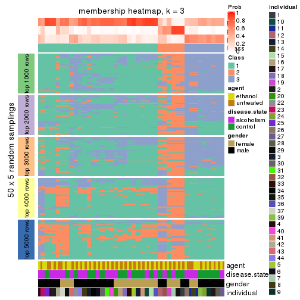</p>

</div>
<div id='tab-SD-hclust-membership-heatmap-3'>
<pre><code class="r">membership_heatmap(res, k = 4)
</code></pre>

<p></p>

</div>
<div id='tab-SD-hclust-membership-heatmap-4'>
<pre><code class="r">membership_heatmap(res, k = 5)
</code></pre>

<p></p>

</div>
<div id='tab-SD-hclust-membership-heatmap-5'>
<pre><code class="r">membership_heatmap(res, k = 6)
</code></pre>

<p></p>

</div>
</div>

As soon as we have had the classes for columns, we can look for signatures
which are significantly different between classes which can be candidate marks
for certain classes. Following are the heatmaps for signatures.


Signature heatmaps where rows are scaled:


<script>
$( function() {
	$( '#tabs-SD-hclust-get-signatures' ).tabs();
} );
</script>
<div id='tabs-SD-hclust-get-signatures'>
<ul>
<li><a href='#tab-SD-hclust-get-signatures-1'>k = 2</a></li>
<li><a href='#tab-SD-hclust-get-signatures-2'>k = 3</a></li>
<li><a href='#tab-SD-hclust-get-signatures-3'>k = 4</a></li>
<li><a href='#tab-SD-hclust-get-signatures-4'>k = 5</a></li>
<li><a href='#tab-SD-hclust-get-signatures-5'>k = 6</a></li>
</ul>
<div id='tab-SD-hclust-get-signatures-1'>
<pre><code class="r">get_signatures(res, k = 2)
</code></pre>

<p></p>

</div>
<div id='tab-SD-hclust-get-signatures-2'>
<pre><code class="r">get_signatures(res, k = 3)
</code></pre>

<p></p>

</div>
<div id='tab-SD-hclust-get-signatures-3'>
<pre><code class="r">get_signatures(res, k = 4)
</code></pre>

<p></p>

</div>
<div id='tab-SD-hclust-get-signatures-4'>
<pre><code class="r">get_signatures(res, k = 5)
</code></pre>

<p></p>

</div>
<div id='tab-SD-hclust-get-signatures-5'>
<pre><code class="r">get_signatures(res, k = 6)
</code></pre>

<p></p>

</div>
</div>


Signature heatmaps where rows are not scaled:


<script>
$( function() {
	$( '#tabs-SD-hclust-get-signatures-no-scale' ).tabs();
} );
</script>
<div id='tabs-SD-hclust-get-signatures-no-scale'>
<ul>
<li><a href='#tab-SD-hclust-get-signatures-no-scale-1'>k = 2</a></li>
<li><a href='#tab-SD-hclust-get-signatures-no-scale-2'>k = 3</a></li>
<li><a href='#tab-SD-hclust-get-signatures-no-scale-3'>k = 4</a></li>
<li><a href='#tab-SD-hclust-get-signatures-no-scale-4'>k = 5</a></li>
<li><a href='#tab-SD-hclust-get-signatures-no-scale-5'>k = 6</a></li>
</ul>
<div id='tab-SD-hclust-get-signatures-no-scale-1'>
<pre><code class="r">get_signatures(res, k = 2, scale_rows = FALSE)
</code></pre>

<p></p>

</div>
<div id='tab-SD-hclust-get-signatures-no-scale-2'>
<pre><code class="r">get_signatures(res, k = 3, scale_rows = FALSE)
</code></pre>

<p></p>

</div>
<div id='tab-SD-hclust-get-signatures-no-scale-3'>
<pre><code class="r">get_signatures(res, k = 4, scale_rows = FALSE)
</code></pre>

<p></p>

</div>
<div id='tab-SD-hclust-get-signatures-no-scale-4'>
<pre><code class="r">get_signatures(res, k = 5, scale_rows = FALSE)
</code></pre>

<p></p>

</div>
<div id='tab-SD-hclust-get-signatures-no-scale-5'>
<pre><code class="r">get_signatures(res, k = 6, scale_rows = FALSE)
</code></pre>

<p></p>

</div>
</div>


Compare the overlap of signatures from different k:

```r
compare_signatures(res)
```


`get_signature()` returns a data frame invisibly. TO get the list of signatures, the function
call should be assigned to a variable explicitly. In following code, if `plot` argument is set
to `FALSE`, no heatmap is plotted while only the differential analysis is performed.

```r
# code only for demonstration
tb = get_signature(res, k = ..., plot = FALSE)
```

An example of the output of `tb` is:

```
#>   which_row         fdr    mean_1    mean_2 scaled_mean_1 scaled_mean_2 km
#> 1        38 0.042760348  8.373488  9.131774    -0.5533452     0.5164555  1
#> 2        40 0.018707592  7.106213  8.469186    -0.6173731     0.5762149  1
#> 3        55 0.019134737 10.221463 11.207825    -0.6159697     0.5749050  1
#> 4        59 0.006059896  5.921854  7.869574    -0.6899429     0.6439467  1
#> 5        60 0.018055526  8.928898 10.211722    -0.6204761     0.5791110  1
#> 6        98 0.009384629 15.714769 14.887706     0.6635654    -0.6193277  2
...
```

The columns in `tb` are:

1. `which_row`: row indices corresponding to the input matrix.
2. `fdr`: FDR for the differential test. 
3. `mean_x`: The mean value in group x.
4. `scaled_mean_x`: The mean value in group x after rows are scaled.
5. `km`: Row groups if k-means clustering is applied to rows.


UMAP plot which shows how samples are separated.


<script>
$( function() {
	$( '#tabs-SD-hclust-dimension-reduction' ).tabs();
} );
</script>
<div id='tabs-SD-hclust-dimension-reduction'>
<ul>
<li><a href='#tab-SD-hclust-dimension-reduction-1'>k = 2</a></li>
<li><a href='#tab-SD-hclust-dimension-reduction-2'>k = 3</a></li>
<li><a href='#tab-SD-hclust-dimension-reduction-3'>k = 4</a></li>
<li><a href='#tab-SD-hclust-dimension-reduction-4'>k = 5</a></li>
<li><a href='#tab-SD-hclust-dimension-reduction-5'>k = 6</a></li>
</ul>
<div id='tab-SD-hclust-dimension-reduction-1'>
<pre><code class="r">dimension_reduction(res, k = 2, method = &quot;UMAP&quot;)
</code></pre>

<p></p>

</div>
<div id='tab-SD-hclust-dimension-reduction-2'>
<pre><code class="r">dimension_reduction(res, k = 3, method = &quot;UMAP&quot;)
</code></pre>

<p></p>

</div>
<div id='tab-SD-hclust-dimension-reduction-3'>
<pre><code class="r">dimension_reduction(res, k = 4, method = &quot;UMAP&quot;)
</code></pre>

<p></p>

</div>
<div id='tab-SD-hclust-dimension-reduction-4'>
<pre><code class="r">dimension_reduction(res, k = 5, method = &quot;UMAP&quot;)
</code></pre>

<p></p>

</div>
<div id='tab-SD-hclust-dimension-reduction-5'>
<pre><code class="r">dimension_reduction(res, k = 6, method = &quot;UMAP&quot;)
</code></pre>

<p></p>

</div>
</div>


Following heatmap shows how subgroups are split when increasing `k`:

```r
collect_classes(res)
```


Test correlation between subgroups and known annotations. If the known
annotation is numeric, one-way ANOVA test is applied, and if the known
annotation is discrete, chi-squared contingency table test is applied.

```r
test_to_known_factors(res)
```

```
#>            n agent(p) disease.state(p) gender(p) individual(p) k
#> SD:hclust 51    1.000           0.7013  0.857290      1.60e-03 2
#> SD:hclust 45    0.982           0.7854  0.015102      5.31e-05 3
#> SD:hclust 46    1.000           0.9488  0.000985      5.23e-07 4
#> SD:hclust 26    1.000           0.0734  0.003703      6.24e-05 5
#> SD:hclust 30    0.997           0.0518  0.000169      6.23e-07 6
```


If matrix rows can be associated to genes, consider to use `GO_Enrichment(res,
...)` to perform function enrichment for the signature genes.


 

---------------------------------------------------


### SD:kmeans


The object with results only for a single top-value method and a single partition method 
can be extracted as:

```r
res = res_list["SD", "kmeans"]
# you can also extract it by
# res = res_list["SD:kmeans"]
```

A summary of `res` and all the functions that can be applied to it:

```r
res
```

```
#> A 'ConsensusPartition' object with k = 2, 3, 4, 5, 6.
#>   On a matrix with 51941 rows and 84 columns.
#>   Top rows (1000, 2000, 3000, 4000, 5000) are extracted by 'SD' method.
#>   Subgroups are detected by 'kmeans' method.
#>   Performed in total 1250 partitions by row resampling.
#>   Best k for subgroups seems to be 3.
#> 
#> Following methods can be applied to this 'ConsensusPartition' object:
#>  [1] "cola_report"             "collect_classes"         "collect_plots"          
#>  [4] "collect_stats"           "colnames"                "compare_signatures"     
#>  [7] "consensus_heatmap"       "dimension_reduction"     "functional_enrichment"  
#> [10] "get_anno_col"            "get_anno"                "get_classes"            
#> [13] "get_consensus"           "get_matrix"              "get_membership"         
#> [16] "get_param"               "get_signatures"          "get_stats"              
#> [19] "is_best_k"               "is_stable_k"             "membership_heatmap"     
#> [22] "ncol"                    "nrow"                    "plot_ecdf"              
#> [25] "rownames"                "select_partition_number" "show"                   
#> [28] "suggest_best_k"          "test_to_known_factors"
```

`collect_plots()` function collects all the plots made from `res` for all `k` (number of partitions)
into one single page to provide an easy and fast comparison between different `k`.

```r
collect_plots(res)
```


The plots are:

- The first row: a plot of the ECDF (Empirical cumulative distribution
  function) curves of the consensus matrix for each `k` and the heatmap of
  predicted classes for each `k`.
- The second row: heatmaps of the consensus matrix for each `k`.
- The third row: heatmaps of the membership matrix for each `k`.
- The fouth row: heatmaps of the signatures for each `k`.

All the plots in panels can be made by individual functions and they are
plotted later in this section.

`select_partition_number()` produces several plots showing different
statistics for choosing "optimized" `k`. There are following statistics:

- ECDF curves of the consensus matrix for each `k`;
- 1-PAC. [The PAC
  score](https://en.wikipedia.org/wiki/Consensus_clustering#Over-interpretation_potential_of_consensus_clustering)
  measures the proportion of the ambiguous subgrouping.
- Mean silhouette score.
- Concordance. The mean probability of fiting the consensus class ids in all
  partitions.
- Area increased. Denote $A_k$ as the area under the ECDF curve for current
  `k`, the area increased is defined as $A_k - A_{k-1}$.
- Rand index. The percent of pairs of samples that are both in a same cluster
  or both are not in a same cluster in the partition of k and k-1.
- Jaccard index. The ratio of pairs of samples are both in a same cluster in
  the partition of k and k-1 and the pairs of samples are both in a same
  cluster in the partition k or k-1.

The detailed explanations of these statistics can be found in [the cola
vignette](http://bioconductor.org/packages/devel/bioc/vignettes/cola/inst/doc/cola.html#toc_13).

Generally speaking, lower PAC score, higher mean silhouette score or higher
concordance corresponds to better partition. Rand index and Jaccard index
measure how similar the current partition is compared to partition with `k-1`.
If they are too similar, we won't accept `k` is better than `k-1`.

```r
select_partition_number(res)
```


The numeric values for all these statistics can be obtained by `get_stats()`.

```r
get_stats(res)
```

```
#>   k 1-PAC mean_silhouette concordance area_increased  Rand Jaccard
#> 2 2 0.122           0.325       0.632         0.4486 0.499   0.499
#> 3 3 0.242           0.495       0.695         0.3852 0.807   0.637
#> 4 4 0.359           0.416       0.625         0.1347 0.748   0.452
#> 5 5 0.459           0.561       0.651         0.0697 0.871   0.604
#> 6 6 0.501           0.515       0.648         0.0482 0.982   0.918
```

`suggest_best_k()` suggests the best $k$ based on these statistics. The rules are as follows:

- All $k$ with Jaccard index larger than 0.95 are removed because the increase of
  the partition number does not provides enough extra information. If all $k$ are removed,
  the best $k$ is assigned by `NA`.
- For $k$ with 1-PAC larger than 0.9, the maximal $k$ is taken as the "best k". Other $k$ is called "optional k".
- If it does not fit the second rule. The $k$ with the highest vote of highest
  1-PAC, mean silhouette and concordance is taken as the "best k".

```r
suggest_best_k(res)
```

```
#> [1] 3
```


Following shows the table of the partitions (You need to click the **show/hide
code output** link to see it). The membership matrix (columns with name `p*`)
is inferred by
[`clue::cl_consensus()`](https://www.rdocumentation.org/link/cl_consensus?package=clue)
function with the `SE` method. Basically the value in the membership matrix
represents the probability to belong to a certain group. The finall class
label for an item is determined with the group with highest probability it
belongs to.

In `get_classes()` function, the entropy is calculated from the membership
matrix and the silhouette score is calculated from the consensus matrix.


<script>
$( function() {
	$( '#tabs-SD-kmeans-get-classes' ).tabs();
} );
</script>
<div id='tabs-SD-kmeans-get-classes'>
<ul>
<li><a href='#tab-SD-kmeans-get-classes-1'>k = 2</a></li>
<li><a href='#tab-SD-kmeans-get-classes-2'>k = 3</a></li>
<li><a href='#tab-SD-kmeans-get-classes-3'>k = 4</a></li>
<li><a href='#tab-SD-kmeans-get-classes-4'>k = 5</a></li>
<li><a href='#tab-SD-kmeans-get-classes-5'>k = 6</a></li>
</ul>

<div id='tab-SD-kmeans-get-classes-1'>
<p><a id='tab-SD-kmeans-get-classes-1-a' style='color:#0366d6' href='#'>show/hide code output</a></p>
<pre><code class="r">cbind(get_classes(res, k = 2), get_membership(res, k = 2))
</code></pre>

<pre><code>#&gt;            class entropy silhouette    p1    p2
#&gt; GSM1269647     1   0.327    0.49912 0.940 0.060
#&gt; GSM1269655     2   0.921    0.41361 0.336 0.664
#&gt; GSM1269663     2   0.788    0.35696 0.236 0.764
#&gt; GSM1269671     1   0.358    0.49027 0.932 0.068
#&gt; GSM1269679     1   0.980    0.27062 0.584 0.416
#&gt; GSM1269693     2   0.680    0.43575 0.180 0.820
#&gt; GSM1269701     1   0.985    0.25812 0.572 0.428
#&gt; GSM1269709     1   0.971    0.28960 0.600 0.400
#&gt; GSM1269715     2   0.876    0.44572 0.296 0.704
#&gt; GSM1269717     2   0.850    0.45557 0.276 0.724
#&gt; GSM1269721     1   1.000   -0.06715 0.504 0.496
#&gt; GSM1269723     1   0.980    0.27062 0.584 0.416
#&gt; GSM1269645     2   0.634    0.51956 0.160 0.840
#&gt; GSM1269653     1   0.891    0.34066 0.692 0.308
#&gt; GSM1269661     2   0.958    0.16309 0.380 0.620
#&gt; GSM1269669     2   0.985    0.04563 0.428 0.572
#&gt; GSM1269677     2   0.975    0.10879 0.408 0.592
#&gt; GSM1269685     2   0.653    0.51954 0.168 0.832
#&gt; GSM1269691     2   0.615    0.52200 0.152 0.848
#&gt; GSM1269699     1   0.722    0.34761 0.800 0.200
#&gt; GSM1269707     1   0.767    0.32721 0.776 0.224
#&gt; GSM1269651     1   0.997   -0.04301 0.532 0.468
#&gt; GSM1269659     2   0.980    0.13225 0.416 0.584
#&gt; GSM1269667     1   0.975    0.28192 0.592 0.408
#&gt; GSM1269675     1   0.358    0.49051 0.932 0.068
#&gt; GSM1269683     2   0.891    0.43237 0.308 0.692
#&gt; GSM1269689     1   0.625    0.50610 0.844 0.156
#&gt; GSM1269697     1   0.662    0.49987 0.828 0.172
#&gt; GSM1269705     1   0.402    0.50392 0.920 0.080
#&gt; GSM1269713     1   0.781    0.46327 0.768 0.232
#&gt; GSM1269719     2   0.871    0.44328 0.292 0.708
#&gt; GSM1269725     1   0.808    0.45213 0.752 0.248
#&gt; GSM1269727     1   0.987    0.23760 0.568 0.432
#&gt; GSM1269649     2   0.999   -0.03363 0.480 0.520
#&gt; GSM1269657     2   0.971    0.11518 0.400 0.600
#&gt; GSM1269665     2   0.722    0.50253 0.200 0.800
#&gt; GSM1269673     2   0.706    0.50922 0.192 0.808
#&gt; GSM1269681     2   0.980    0.10087 0.416 0.584
#&gt; GSM1269687     2   0.730    0.50370 0.204 0.796
#&gt; GSM1269695     2   0.992    0.04664 0.448 0.552
#&gt; GSM1269703     2   0.706    0.50719 0.192 0.808
#&gt; GSM1269711     2   0.992    0.03704 0.448 0.552
#&gt; GSM1269646     1   0.358    0.50272 0.932 0.068
#&gt; GSM1269654     2   0.921    0.41361 0.336 0.664
#&gt; GSM1269662     2   0.795    0.35601 0.240 0.760
#&gt; GSM1269670     1   0.358    0.49027 0.932 0.068
#&gt; GSM1269678     1   0.980    0.27062 0.584 0.416
#&gt; GSM1269692     2   0.680    0.43575 0.180 0.820
#&gt; GSM1269700     1   0.985    0.25812 0.572 0.428
#&gt; GSM1269708     1   0.973    0.28412 0.596 0.404
#&gt; GSM1269714     2   0.886    0.43687 0.304 0.696
#&gt; GSM1269716     2   0.850    0.45557 0.276 0.724
#&gt; GSM1269720     1   1.000   -0.06715 0.504 0.496
#&gt; GSM1269722     1   0.980    0.27062 0.584 0.416
#&gt; GSM1269644     2   0.574    0.51607 0.136 0.864
#&gt; GSM1269652     1   0.895    0.33750 0.688 0.312
#&gt; GSM1269660     2   0.952    0.18324 0.372 0.628
#&gt; GSM1269668     2   0.985    0.04563 0.428 0.572
#&gt; GSM1269676     2   0.975    0.10879 0.408 0.592
#&gt; GSM1269684     2   0.625    0.52184 0.156 0.844
#&gt; GSM1269690     2   0.615    0.52200 0.152 0.848
#&gt; GSM1269698     1   0.722    0.34761 0.800 0.200
#&gt; GSM1269706     1   0.767    0.32721 0.776 0.224
#&gt; GSM1269650     1   0.997   -0.04301 0.532 0.468
#&gt; GSM1269658     2   0.980    0.13225 0.416 0.584
#&gt; GSM1269666     1   0.975    0.28192 0.592 0.408
#&gt; GSM1269674     1   0.358    0.49051 0.932 0.068
#&gt; GSM1269682     2   0.891    0.43237 0.308 0.692
#&gt; GSM1269688     1   0.625    0.50610 0.844 0.156
#&gt; GSM1269696     1   0.634    0.50380 0.840 0.160
#&gt; GSM1269704     1   0.402    0.50392 0.920 0.080
#&gt; GSM1269712     1   0.969    0.29612 0.604 0.396
#&gt; GSM1269718     2   0.855    0.45045 0.280 0.720
#&gt; GSM1269724     1   0.808    0.45213 0.752 0.248
#&gt; GSM1269726     1   0.990    0.22620 0.560 0.440
#&gt; GSM1269648     2   0.997   -0.00167 0.468 0.532
#&gt; GSM1269656     2   0.978    0.11507 0.412 0.588
#&gt; GSM1269664     2   0.730    0.49848 0.204 0.796
#&gt; GSM1269672     2   0.706    0.50624 0.192 0.808
#&gt; GSM1269680     2   0.980    0.10087 0.416 0.584
#&gt; GSM1269686     2   0.745    0.49578 0.212 0.788
#&gt; GSM1269694     2   0.992    0.04664 0.448 0.552
#&gt; GSM1269702     2   0.680    0.51697 0.180 0.820
#&gt; GSM1269710     2   0.992    0.03704 0.448 0.552
</code></pre>

<script>
$('#tab-SD-kmeans-get-classes-1-a').parent().next().next().hide();
$('#tab-SD-kmeans-get-classes-1-a').click(function(){
  $('#tab-SD-kmeans-get-classes-1-a').parent().next().next().toggle();
  return(false);
});
</script>
</div>

<div id='tab-SD-kmeans-get-classes-2'>
<p><a id='tab-SD-kmeans-get-classes-2-a' style='color:#0366d6' href='#'>show/hide code output</a></p>
<pre><code class="r">cbind(get_classes(res, k = 3), get_membership(res, k = 3))
</code></pre>

<pre><code>#&gt;            class entropy silhouette    p1    p2    p3
#&gt; GSM1269647     3   0.580      0.600 0.044 0.176 0.780
#&gt; GSM1269655     1   0.947      0.274 0.456 0.188 0.356
#&gt; GSM1269663     2   0.981      0.120 0.320 0.424 0.256
#&gt; GSM1269671     3   0.730      0.510 0.072 0.252 0.676
#&gt; GSM1269679     3   0.633      0.313 0.332 0.012 0.656
#&gt; GSM1269693     1   0.933      0.311 0.516 0.268 0.216
#&gt; GSM1269701     3   0.697      0.240 0.356 0.028 0.616
#&gt; GSM1269709     3   0.512      0.541 0.188 0.016 0.796
#&gt; GSM1269715     1   0.803      0.456 0.616 0.096 0.288
#&gt; GSM1269717     1   0.823      0.460 0.608 0.112 0.280
#&gt; GSM1269721     2   0.479      0.782 0.112 0.844 0.044
#&gt; GSM1269723     3   0.739      0.212 0.356 0.044 0.600
#&gt; GSM1269645     1   0.264      0.635 0.932 0.048 0.020
#&gt; GSM1269653     3   0.897      0.239 0.412 0.128 0.460
#&gt; GSM1269661     1   0.532      0.520 0.780 0.016 0.204
#&gt; GSM1269669     1   0.558      0.539 0.772 0.024 0.204
#&gt; GSM1269677     2   0.501      0.772 0.180 0.804 0.016
#&gt; GSM1269685     1   0.177      0.643 0.960 0.024 0.016
#&gt; GSM1269691     1   0.175      0.645 0.960 0.028 0.012
#&gt; GSM1269699     3   0.985      0.278 0.288 0.292 0.420
#&gt; GSM1269707     3   0.982      0.246 0.356 0.244 0.400
#&gt; GSM1269651     2   0.510      0.764 0.084 0.836 0.080
#&gt; GSM1269659     2   0.594      0.763 0.140 0.788 0.072
#&gt; GSM1269667     3   0.679      0.302 0.324 0.028 0.648
#&gt; GSM1269675     3   0.634      0.555 0.044 0.220 0.736
#&gt; GSM1269683     1   0.817      0.443 0.600 0.100 0.300
#&gt; GSM1269689     3   0.572      0.614 0.068 0.132 0.800
#&gt; GSM1269697     3   0.473      0.623 0.060 0.088 0.852
#&gt; GSM1269705     3   0.614      0.600 0.060 0.172 0.768
#&gt; GSM1269713     3   0.391      0.589 0.104 0.020 0.876
#&gt; GSM1269719     1   0.966      0.285 0.444 0.224 0.332
#&gt; GSM1269725     3   0.421      0.586 0.120 0.020 0.860
#&gt; GSM1269727     1   0.845      0.251 0.488 0.088 0.424
#&gt; GSM1269649     1   0.740      0.321 0.644 0.060 0.296
#&gt; GSM1269657     2   0.560      0.739 0.228 0.756 0.016
#&gt; GSM1269665     1   0.255      0.643 0.936 0.040 0.024
#&gt; GSM1269673     1   0.134      0.647 0.972 0.016 0.012
#&gt; GSM1269681     2   0.462      0.769 0.136 0.840 0.024
#&gt; GSM1269687     1   0.255      0.638 0.932 0.012 0.056
#&gt; GSM1269695     1   0.659      0.436 0.732 0.060 0.208
#&gt; GSM1269703     1   0.118      0.645 0.976 0.012 0.012
#&gt; GSM1269711     1   0.706      0.313 0.656 0.044 0.300
#&gt; GSM1269646     3   0.569      0.605 0.044 0.168 0.788
#&gt; GSM1269654     1   0.947      0.274 0.456 0.188 0.356
#&gt; GSM1269662     2   0.980      0.116 0.324 0.424 0.252
#&gt; GSM1269670     3   0.730      0.510 0.072 0.252 0.676
#&gt; GSM1269678     3   0.636      0.307 0.336 0.012 0.652
#&gt; GSM1269692     1   0.933      0.311 0.516 0.268 0.216
#&gt; GSM1269700     3   0.697      0.240 0.356 0.028 0.616
#&gt; GSM1269708     3   0.527      0.528 0.200 0.016 0.784
#&gt; GSM1269714     1   0.799      0.453 0.616 0.092 0.292
#&gt; GSM1269716     1   0.823      0.460 0.608 0.112 0.280
#&gt; GSM1269720     2   0.479      0.782 0.112 0.844 0.044
#&gt; GSM1269722     3   0.733      0.242 0.344 0.044 0.612
#&gt; GSM1269644     1   0.223      0.631 0.944 0.044 0.012
#&gt; GSM1269652     3   0.902      0.228 0.416 0.132 0.452
#&gt; GSM1269660     1   0.537      0.519 0.776 0.016 0.208
#&gt; GSM1269668     1   0.558      0.539 0.772 0.024 0.204
#&gt; GSM1269676     2   0.501      0.772 0.180 0.804 0.016
#&gt; GSM1269684     1   0.145      0.646 0.968 0.024 0.008
#&gt; GSM1269690     1   0.175      0.645 0.960 0.028 0.012
#&gt; GSM1269698     3   0.985      0.278 0.288 0.292 0.420
#&gt; GSM1269706     3   0.982      0.246 0.356 0.244 0.400
#&gt; GSM1269650     2   0.510      0.764 0.084 0.836 0.080
#&gt; GSM1269658     2   0.594      0.763 0.140 0.788 0.072
#&gt; GSM1269666     3   0.655      0.301 0.324 0.020 0.656
#&gt; GSM1269674     3   0.634      0.556 0.044 0.220 0.736
#&gt; GSM1269682     1   0.817      0.439 0.600 0.100 0.300
#&gt; GSM1269688     3   0.581      0.615 0.072 0.132 0.796
#&gt; GSM1269696     3   0.473      0.623 0.060 0.088 0.852
#&gt; GSM1269704     3   0.614      0.600 0.060 0.172 0.768
#&gt; GSM1269712     3   0.465      0.530 0.176 0.008 0.816
#&gt; GSM1269718     1   0.958      0.286 0.452 0.208 0.340
#&gt; GSM1269724     3   0.435      0.585 0.128 0.020 0.852
#&gt; GSM1269726     1   0.844      0.260 0.492 0.088 0.420
#&gt; GSM1269648     1   0.731      0.331 0.656 0.060 0.284
#&gt; GSM1269656     2   0.657      0.600 0.348 0.636 0.016
#&gt; GSM1269664     1   0.232      0.644 0.944 0.028 0.028
#&gt; GSM1269672     1   0.101      0.646 0.980 0.012 0.008
#&gt; GSM1269680     2   0.481      0.771 0.148 0.828 0.024
#&gt; GSM1269686     1   0.249      0.637 0.932 0.008 0.060
#&gt; GSM1269694     1   0.659      0.436 0.732 0.060 0.208
#&gt; GSM1269702     1   0.178      0.644 0.960 0.020 0.020
#&gt; GSM1269710     1   0.703      0.321 0.660 0.044 0.296
</code></pre>

<script>
$('#tab-SD-kmeans-get-classes-2-a').parent().next().next().hide();
$('#tab-SD-kmeans-get-classes-2-a').click(function(){
  $('#tab-SD-kmeans-get-classes-2-a').parent().next().next().toggle();
  return(false);
});
</script>
</div>

<div id='tab-SD-kmeans-get-classes-3'>
<p><a id='tab-SD-kmeans-get-classes-3-a' style='color:#0366d6' href='#'>show/hide code output</a></p>
<pre><code class="r">cbind(get_classes(res, k = 4), get_membership(res, k = 4))
</code></pre>

<pre><code>#&gt;            class entropy silhouette    p1    p2    p3    p4
#&gt; GSM1269647     3  0.6506   -0.26871 0.016 0.444 0.500 0.040
#&gt; GSM1269655     3  0.7960    0.40881 0.292 0.064 0.540 0.104
#&gt; GSM1269663     3  0.9135   -0.00855 0.192 0.088 0.360 0.360
#&gt; GSM1269671     2  0.5596    0.56490 0.016 0.712 0.232 0.040
#&gt; GSM1269679     3  0.3760    0.50259 0.136 0.028 0.836 0.000
#&gt; GSM1269693     1  0.8734   -0.19070 0.392 0.068 0.380 0.160
#&gt; GSM1269701     3  0.4466    0.49600 0.156 0.040 0.800 0.004
#&gt; GSM1269709     3  0.5595    0.37122 0.112 0.148 0.736 0.004
#&gt; GSM1269715     3  0.7967    0.19407 0.412 0.068 0.444 0.076
#&gt; GSM1269717     1  0.8020   -0.21927 0.428 0.068 0.424 0.080
#&gt; GSM1269721     4  0.5738    0.77589 0.072 0.072 0.088 0.768
#&gt; GSM1269723     3  0.3972    0.51985 0.164 0.004 0.816 0.016
#&gt; GSM1269645     1  0.3662    0.68249 0.876 0.048 0.048 0.028
#&gt; GSM1269653     1  0.9272   -0.21019 0.396 0.280 0.228 0.096
#&gt; GSM1269661     1  0.4333    0.60523 0.776 0.008 0.208 0.008
#&gt; GSM1269669     1  0.4682    0.60511 0.760 0.024 0.212 0.004
#&gt; GSM1269677     4  0.4224    0.78694 0.100 0.076 0.000 0.824
#&gt; GSM1269685     1  0.0712    0.70511 0.984 0.004 0.004 0.008
#&gt; GSM1269691     1  0.1042    0.70108 0.972 0.000 0.020 0.008
#&gt; GSM1269699     2  0.7940    0.48455 0.200 0.576 0.056 0.168
#&gt; GSM1269707     2  0.8384    0.42600 0.268 0.508 0.060 0.164
#&gt; GSM1269651     4  0.5324    0.76735 0.036 0.128 0.056 0.780
#&gt; GSM1269659     4  0.5593    0.76385 0.072 0.040 0.120 0.768
#&gt; GSM1269667     3  0.4569    0.50135 0.144 0.052 0.800 0.004
#&gt; GSM1269675     2  0.6572    0.45868 0.020 0.588 0.340 0.052
#&gt; GSM1269683     3  0.7958    0.22187 0.400 0.076 0.456 0.068
#&gt; GSM1269689     2  0.6102    0.43190 0.032 0.540 0.420 0.008
#&gt; GSM1269697     3  0.6310   -0.17380 0.024 0.404 0.548 0.024
#&gt; GSM1269705     3  0.7056   -0.25144 0.036 0.424 0.492 0.048
#&gt; GSM1269713     3  0.5292    0.15984 0.036 0.252 0.708 0.004
#&gt; GSM1269719     3  0.8559    0.32702 0.320 0.068 0.464 0.148
#&gt; GSM1269725     3  0.5514    0.16834 0.040 0.252 0.700 0.008
#&gt; GSM1269727     3  0.7317    0.40314 0.260 0.088 0.604 0.048
#&gt; GSM1269649     1  0.6880    0.46060 0.644 0.216 0.116 0.024
#&gt; GSM1269657     4  0.4756    0.75793 0.144 0.072 0.000 0.784
#&gt; GSM1269665     1  0.3082    0.68702 0.896 0.040 0.056 0.008
#&gt; GSM1269673     1  0.0564    0.70559 0.988 0.004 0.004 0.004
#&gt; GSM1269681     4  0.3399    0.77937 0.040 0.092 0.000 0.868
#&gt; GSM1269687     1  0.2161    0.70126 0.932 0.016 0.048 0.004
#&gt; GSM1269695     1  0.6112    0.47166 0.668 0.256 0.064 0.012
#&gt; GSM1269703     1  0.1369    0.70735 0.964 0.016 0.016 0.004
#&gt; GSM1269711     1  0.6541    0.44802 0.648 0.228 0.116 0.008
#&gt; GSM1269646     3  0.6506   -0.26871 0.016 0.444 0.500 0.040
#&gt; GSM1269654     3  0.7978    0.40512 0.296 0.064 0.536 0.104
#&gt; GSM1269662     3  0.9156   -0.01371 0.188 0.092 0.360 0.360
#&gt; GSM1269670     2  0.5596    0.56490 0.016 0.712 0.232 0.040
#&gt; GSM1269678     3  0.3962    0.51054 0.152 0.028 0.820 0.000
#&gt; GSM1269692     1  0.8734   -0.19070 0.392 0.068 0.380 0.160
#&gt; GSM1269700     3  0.4466    0.49600 0.156 0.040 0.800 0.004
#&gt; GSM1269708     3  0.5595    0.37122 0.112 0.148 0.736 0.004
#&gt; GSM1269714     3  0.7967    0.19407 0.412 0.068 0.444 0.076
#&gt; GSM1269716     1  0.8020   -0.21927 0.428 0.068 0.424 0.080
#&gt; GSM1269720     4  0.5738    0.77589 0.072 0.072 0.088 0.768
#&gt; GSM1269722     3  0.3940    0.51923 0.152 0.004 0.824 0.020
#&gt; GSM1269644     1  0.1877    0.69730 0.948 0.020 0.012 0.020
#&gt; GSM1269652     1  0.9231   -0.19490 0.404 0.284 0.216 0.096
#&gt; GSM1269660     1  0.4574    0.60206 0.768 0.016 0.208 0.008
#&gt; GSM1269668     1  0.4754    0.59744 0.752 0.024 0.220 0.004
#&gt; GSM1269676     4  0.4224    0.78694 0.100 0.076 0.000 0.824
#&gt; GSM1269684     1  0.0672    0.70429 0.984 0.008 0.008 0.000
#&gt; GSM1269690     1  0.1042    0.70108 0.972 0.000 0.020 0.008
#&gt; GSM1269698     2  0.7940    0.48455 0.200 0.576 0.056 0.168
#&gt; GSM1269706     2  0.8384    0.42600 0.268 0.508 0.060 0.164
#&gt; GSM1269650     4  0.5324    0.76735 0.036 0.128 0.056 0.780
#&gt; GSM1269658     4  0.5593    0.76385 0.072 0.040 0.120 0.768
#&gt; GSM1269666     3  0.4232    0.50899 0.144 0.036 0.816 0.004
#&gt; GSM1269674     2  0.6572    0.45868 0.020 0.588 0.340 0.052
#&gt; GSM1269682     3  0.7950    0.22433 0.392 0.076 0.464 0.068
#&gt; GSM1269688     2  0.6102    0.43190 0.032 0.540 0.420 0.008
#&gt; GSM1269696     3  0.6389   -0.17457 0.024 0.400 0.548 0.028
#&gt; GSM1269704     3  0.7056   -0.25144 0.036 0.424 0.492 0.048
#&gt; GSM1269712     3  0.4001    0.38240 0.048 0.108 0.840 0.004
#&gt; GSM1269718     3  0.8479    0.34198 0.316 0.068 0.476 0.140
#&gt; GSM1269724     3  0.5514    0.16834 0.040 0.252 0.700 0.008
#&gt; GSM1269726     3  0.7472    0.36929 0.288 0.088 0.576 0.048
#&gt; GSM1269648     1  0.6558    0.46613 0.660 0.228 0.092 0.020
#&gt; GSM1269656     4  0.6141    0.56364 0.312 0.072 0.000 0.616
#&gt; GSM1269664     1  0.2909    0.68771 0.904 0.036 0.052 0.008
#&gt; GSM1269672     1  0.0524    0.70598 0.988 0.000 0.008 0.004
#&gt; GSM1269680     4  0.3333    0.77980 0.040 0.088 0.000 0.872
#&gt; GSM1269686     1  0.2161    0.70126 0.932 0.016 0.048 0.004
#&gt; GSM1269694     1  0.6112    0.47166 0.668 0.256 0.064 0.012
#&gt; GSM1269702     1  0.1007    0.70632 0.976 0.008 0.008 0.008
#&gt; GSM1269710     1  0.6417    0.45972 0.656 0.232 0.104 0.008
</code></pre>

<script>
$('#tab-SD-kmeans-get-classes-3-a').parent().next().next().hide();
$('#tab-SD-kmeans-get-classes-3-a').click(function(){
  $('#tab-SD-kmeans-get-classes-3-a').parent().next().next().toggle();
  return(false);
});
</script>
</div>

<div id='tab-SD-kmeans-get-classes-4'>
<p><a id='tab-SD-kmeans-get-classes-4-a' style='color:#0366d6' href='#'>show/hide code output</a></p>
<pre><code class="r">cbind(get_classes(res, k = 5), get_membership(res, k = 5))
</code></pre>

<pre><code>#&gt;            class entropy silhouette    p1    p2    p3    p4    p5
#&gt; GSM1269647     3  0.4877    0.36307 0.004 0.032 0.732 0.028 0.204
#&gt; GSM1269655     4  0.8161    0.61338 0.224 0.048 0.260 0.432 0.036
#&gt; GSM1269663     4  0.7765    0.52461 0.160 0.180 0.072 0.548 0.040
#&gt; GSM1269671     5  0.6050    0.43533 0.000 0.020 0.344 0.080 0.556
#&gt; GSM1269679     3  0.5175    0.47362 0.072 0.000 0.680 0.240 0.008
#&gt; GSM1269693     4  0.5869    0.71222 0.252 0.068 0.040 0.640 0.000
#&gt; GSM1269701     3  0.6665    0.44893 0.092 0.004 0.604 0.228 0.072
#&gt; GSM1269709     3  0.6423    0.53554 0.100 0.000 0.628 0.200 0.072
#&gt; GSM1269715     4  0.6015    0.74440 0.292 0.012 0.096 0.596 0.004
#&gt; GSM1269717     4  0.5971    0.74618 0.296 0.012 0.104 0.588 0.000
#&gt; GSM1269721     2  0.6594    0.67803 0.048 0.620 0.044 0.244 0.044
#&gt; GSM1269723     3  0.6432    0.20486 0.100 0.004 0.528 0.348 0.020
#&gt; GSM1269645     1  0.3355    0.69290 0.848 0.008 0.004 0.116 0.024
#&gt; GSM1269653     1  0.8195    0.00485 0.404 0.052 0.252 0.028 0.264
#&gt; GSM1269661     1  0.5949    0.59879 0.688 0.008 0.168 0.084 0.052
#&gt; GSM1269669     1  0.5550    0.65125 0.720 0.004 0.148 0.064 0.064
#&gt; GSM1269677     2  0.2766    0.73163 0.056 0.892 0.000 0.012 0.040
#&gt; GSM1269685     1  0.1657    0.73455 0.948 0.008 0.008 0.028 0.008
#&gt; GSM1269691     1  0.1924    0.71363 0.924 0.008 0.004 0.064 0.000
#&gt; GSM1269699     5  0.6570    0.53529 0.128 0.148 0.072 0.008 0.644
#&gt; GSM1269707     5  0.7655    0.49511 0.180 0.152 0.092 0.024 0.552
#&gt; GSM1269651     2  0.5574    0.70251 0.020 0.740 0.056 0.112 0.072
#&gt; GSM1269659     2  0.5884    0.67144 0.064 0.648 0.012 0.252 0.024
#&gt; GSM1269667     3  0.5835    0.43865 0.092 0.004 0.640 0.248 0.016
#&gt; GSM1269675     5  0.6917    0.25518 0.004 0.020 0.408 0.148 0.420
#&gt; GSM1269683     4  0.6332    0.72514 0.300 0.000 0.140 0.548 0.012
#&gt; GSM1269689     3  0.6394    0.06664 0.028 0.008 0.552 0.076 0.336
#&gt; GSM1269697     3  0.3458    0.45499 0.004 0.012 0.832 0.012 0.140
#&gt; GSM1269705     3  0.5839    0.33084 0.024 0.032 0.684 0.052 0.208
#&gt; GSM1269713     3  0.2302    0.59170 0.016 0.000 0.916 0.048 0.020
#&gt; GSM1269719     4  0.8283    0.65012 0.272 0.072 0.192 0.432 0.032
#&gt; GSM1269725     3  0.2362    0.58247 0.024 0.000 0.916 0.032 0.028
#&gt; GSM1269727     4  0.7560    0.62274 0.204 0.004 0.204 0.508 0.080
#&gt; GSM1269649     1  0.6409    0.55244 0.600 0.008 0.036 0.088 0.268
#&gt; GSM1269657     2  0.4112    0.69732 0.124 0.804 0.000 0.016 0.056
#&gt; GSM1269665     1  0.3360    0.70021 0.864 0.008 0.020 0.084 0.024
#&gt; GSM1269673     1  0.0671    0.73295 0.980 0.000 0.004 0.016 0.000
#&gt; GSM1269681     2  0.3359    0.71391 0.036 0.868 0.004 0.028 0.064
#&gt; GSM1269687     1  0.2140    0.73176 0.924 0.000 0.040 0.024 0.012
#&gt; GSM1269695     1  0.5779    0.53213 0.616 0.004 0.032 0.044 0.304
#&gt; GSM1269703     1  0.1074    0.73965 0.968 0.000 0.004 0.016 0.012
#&gt; GSM1269711     1  0.6039    0.50802 0.592 0.000 0.056 0.044 0.308
#&gt; GSM1269646     3  0.4877    0.36307 0.004 0.032 0.732 0.028 0.204
#&gt; GSM1269654     4  0.8144    0.61318 0.220 0.048 0.260 0.436 0.036
#&gt; GSM1269662     4  0.7822    0.52947 0.160 0.172 0.076 0.548 0.044
#&gt; GSM1269670     5  0.6050    0.43533 0.000 0.020 0.344 0.080 0.556
#&gt; GSM1269678     3  0.5240    0.45003 0.080 0.000 0.664 0.252 0.004
#&gt; GSM1269692     4  0.5821    0.70999 0.256 0.068 0.036 0.640 0.000
#&gt; GSM1269700     3  0.6665    0.44893 0.092 0.004 0.604 0.228 0.072
#&gt; GSM1269708     3  0.6451    0.53131 0.100 0.000 0.624 0.204 0.072
#&gt; GSM1269714     4  0.6015    0.74537 0.292 0.012 0.096 0.596 0.004
#&gt; GSM1269716     4  0.5971    0.74618 0.296 0.012 0.104 0.588 0.000
#&gt; GSM1269720     2  0.6594    0.67803 0.048 0.620 0.044 0.244 0.044
#&gt; GSM1269722     3  0.6390    0.21538 0.096 0.004 0.532 0.348 0.020
#&gt; GSM1269644     1  0.2054    0.72064 0.916 0.004 0.000 0.072 0.008
#&gt; GSM1269652     1  0.8157    0.03365 0.416 0.052 0.240 0.028 0.264
#&gt; GSM1269660     1  0.6069    0.58470 0.676 0.008 0.176 0.088 0.052
#&gt; GSM1269668     1  0.5589    0.64621 0.716 0.004 0.152 0.064 0.064
#&gt; GSM1269676     2  0.2766    0.73163 0.056 0.892 0.000 0.012 0.040
#&gt; GSM1269684     1  0.1153    0.73528 0.964 0.000 0.008 0.024 0.004
#&gt; GSM1269690     1  0.1857    0.71649 0.928 0.008 0.004 0.060 0.000
#&gt; GSM1269698     5  0.6570    0.53529 0.128 0.148 0.072 0.008 0.644
#&gt; GSM1269706     5  0.7655    0.49511 0.180 0.152 0.092 0.024 0.552
#&gt; GSM1269650     2  0.5574    0.70251 0.020 0.740 0.056 0.112 0.072
#&gt; GSM1269658     2  0.5884    0.67144 0.064 0.648 0.012 0.252 0.024
#&gt; GSM1269666     3  0.5465    0.46060 0.084 0.000 0.660 0.244 0.012
#&gt; GSM1269674     5  0.6917    0.25518 0.004 0.020 0.408 0.148 0.420
#&gt; GSM1269682     4  0.6317    0.72458 0.296 0.000 0.140 0.552 0.012
#&gt; GSM1269688     3  0.6394    0.06664 0.028 0.008 0.552 0.076 0.336
#&gt; GSM1269696     3  0.3559    0.45488 0.004 0.012 0.828 0.016 0.140
#&gt; GSM1269704     3  0.5809    0.33757 0.024 0.032 0.688 0.052 0.204
#&gt; GSM1269712     3  0.3292    0.60991 0.016 0.000 0.836 0.140 0.008
#&gt; GSM1269718     4  0.8290    0.64369 0.284 0.068 0.196 0.420 0.032
#&gt; GSM1269724     3  0.2362    0.58247 0.024 0.000 0.916 0.032 0.028
#&gt; GSM1269726     4  0.7558    0.62898 0.212 0.004 0.196 0.508 0.080
#&gt; GSM1269648     1  0.6151    0.55946 0.624 0.008 0.028 0.084 0.256
#&gt; GSM1269656     2  0.5931    0.46212 0.296 0.612 0.004 0.032 0.056
#&gt; GSM1269664     1  0.3451    0.69959 0.860 0.008 0.024 0.084 0.024
#&gt; GSM1269672     1  0.0898    0.73407 0.972 0.000 0.008 0.020 0.000
#&gt; GSM1269680     2  0.3359    0.71391 0.036 0.868 0.004 0.028 0.064
#&gt; GSM1269686     1  0.2124    0.73316 0.924 0.000 0.044 0.020 0.012
#&gt; GSM1269694     1  0.5779    0.53213 0.616 0.004 0.032 0.044 0.304
#&gt; GSM1269702     1  0.0854    0.73778 0.976 0.000 0.004 0.008 0.012
#&gt; GSM1269710     1  0.5995    0.50816 0.592 0.000 0.052 0.044 0.312
</code></pre>

<script>
$('#tab-SD-kmeans-get-classes-4-a').parent().next().next().hide();
$('#tab-SD-kmeans-get-classes-4-a').click(function(){
  $('#tab-SD-kmeans-get-classes-4-a').parent().next().next().toggle();
  return(false);
});
</script>
</div>

<div id='tab-SD-kmeans-get-classes-5'>
<p><a id='tab-SD-kmeans-get-classes-5-a' style='color:#0366d6' href='#'>show/hide code output</a></p>
<pre><code class="r">cbind(get_classes(res, k = 6), get_membership(res, k = 6))
</code></pre>

<pre><code>#&gt;            class entropy silhouette    p1    p2    p3    p4    p5    p6
#&gt; GSM1269647     3   0.583    -0.0448 0.004 0.312 0.580 0.024 0.052 0.028
#&gt; GSM1269655     4   0.788     0.4506 0.180 0.044 0.276 0.424 0.032 0.044
#&gt; GSM1269663     4   0.818     0.3851 0.076 0.088 0.060 0.504 0.132 0.140
#&gt; GSM1269671     2   0.434     0.5717 0.004 0.760 0.152 0.008 0.068 0.008
#&gt; GSM1269679     3   0.460     0.4944 0.012 0.020 0.668 0.284 0.016 0.000
#&gt; GSM1269693     4   0.505     0.6293 0.128 0.016 0.016 0.744 0.056 0.040
#&gt; GSM1269701     3   0.687     0.4019 0.052 0.068 0.544 0.244 0.092 0.000
#&gt; GSM1269709     3   0.658     0.4316 0.104 0.084 0.600 0.184 0.020 0.008
#&gt; GSM1269715     4   0.466     0.6740 0.168 0.004 0.064 0.736 0.024 0.004
#&gt; GSM1269717     4   0.461     0.6746 0.172 0.004 0.064 0.736 0.020 0.004
#&gt; GSM1269721     6   0.711     0.6215 0.024 0.060 0.012 0.228 0.152 0.524
#&gt; GSM1269723     3   0.630     0.2306 0.040 0.056 0.480 0.388 0.036 0.000
#&gt; GSM1269645     1   0.415     0.6784 0.800 0.044 0.008 0.100 0.044 0.004
#&gt; GSM1269653     1   0.868    -0.3396 0.348 0.088 0.176 0.012 0.236 0.140
#&gt; GSM1269661     1   0.634     0.5641 0.636 0.020 0.156 0.084 0.092 0.012
#&gt; GSM1269669     1   0.640     0.5615 0.632 0.056 0.144 0.084 0.084 0.000
#&gt; GSM1269677     6   0.189     0.6633 0.016 0.008 0.000 0.020 0.024 0.932
#&gt; GSM1269685     1   0.194     0.7108 0.928 0.012 0.004 0.040 0.012 0.004
#&gt; GSM1269691     1   0.226     0.7040 0.892 0.000 0.004 0.092 0.008 0.004
#&gt; GSM1269699     5   0.796     0.8646 0.120 0.252 0.060 0.000 0.412 0.156
#&gt; GSM1269707     5   0.811     0.8764 0.172 0.180 0.036 0.012 0.424 0.176
#&gt; GSM1269651     6   0.601     0.6543 0.000 0.100 0.024 0.088 0.132 0.656
#&gt; GSM1269659     6   0.621     0.6568 0.016 0.036 0.004 0.220 0.128 0.596
#&gt; GSM1269667     3   0.547     0.4704 0.040 0.024 0.632 0.268 0.036 0.000
#&gt; GSM1269675     2   0.601     0.6037 0.012 0.628 0.224 0.080 0.040 0.016
#&gt; GSM1269683     4   0.501     0.6583 0.196 0.016 0.100 0.684 0.004 0.000
#&gt; GSM1269689     2   0.701     0.4167 0.024 0.384 0.372 0.036 0.184 0.000
#&gt; GSM1269697     3   0.406     0.1670 0.000 0.236 0.728 0.008 0.020 0.008
#&gt; GSM1269705     3   0.655    -0.1557 0.036 0.364 0.500 0.028 0.032 0.040
#&gt; GSM1269713     3   0.273     0.4772 0.000 0.028 0.880 0.064 0.028 0.000
#&gt; GSM1269719     4   0.836     0.5002 0.248 0.052 0.208 0.388 0.064 0.040
#&gt; GSM1269725     3   0.202     0.4653 0.000 0.020 0.920 0.040 0.020 0.000
#&gt; GSM1269727     4   0.657     0.5381 0.128 0.068 0.148 0.608 0.048 0.000
#&gt; GSM1269649     1   0.595     0.5400 0.632 0.116 0.008 0.040 0.196 0.008
#&gt; GSM1269657     6   0.395     0.5641 0.112 0.008 0.004 0.032 0.036 0.808
#&gt; GSM1269665     1   0.384     0.6859 0.820 0.032 0.012 0.084 0.052 0.000
#&gt; GSM1269673     1   0.145     0.7165 0.948 0.008 0.000 0.032 0.008 0.004
#&gt; GSM1269681     6   0.261     0.6567 0.004 0.028 0.004 0.012 0.060 0.892
#&gt; GSM1269687     1   0.310     0.7109 0.868 0.016 0.036 0.060 0.020 0.000
#&gt; GSM1269695     1   0.593     0.4786 0.600 0.124 0.008 0.036 0.232 0.000
#&gt; GSM1269703     1   0.168     0.7204 0.944 0.012 0.008 0.016 0.016 0.004
#&gt; GSM1269711     1   0.602     0.4438 0.588 0.124 0.012 0.032 0.244 0.000
#&gt; GSM1269646     3   0.583    -0.0448 0.004 0.312 0.580 0.024 0.052 0.028
#&gt; GSM1269654     4   0.788     0.4506 0.180 0.044 0.276 0.424 0.032 0.044
#&gt; GSM1269662     4   0.815     0.3870 0.072 0.092 0.060 0.508 0.132 0.136
#&gt; GSM1269670     2   0.434     0.5717 0.004 0.760 0.152 0.008 0.068 0.008
#&gt; GSM1269678     3   0.461     0.4772 0.012 0.016 0.652 0.304 0.016 0.000
#&gt; GSM1269692     4   0.514     0.6316 0.128 0.016 0.020 0.740 0.056 0.040
#&gt; GSM1269700     3   0.687     0.4019 0.052 0.068 0.544 0.244 0.092 0.000
#&gt; GSM1269708     3   0.660     0.4325 0.104 0.084 0.596 0.188 0.020 0.008
#&gt; GSM1269714     4   0.458     0.6736 0.168 0.004 0.064 0.740 0.020 0.004
#&gt; GSM1269716     4   0.461     0.6746 0.172 0.004 0.064 0.736 0.020 0.004
#&gt; GSM1269720     6   0.711     0.6215 0.024 0.060 0.012 0.228 0.152 0.524
#&gt; GSM1269722     3   0.619     0.2453 0.036 0.056 0.488 0.388 0.032 0.000
#&gt; GSM1269644     1   0.331     0.6999 0.856 0.028 0.004 0.072 0.032 0.008
#&gt; GSM1269652     1   0.862    -0.3123 0.368 0.088 0.164 0.012 0.228 0.140
#&gt; GSM1269660     1   0.630     0.5630 0.640 0.020 0.156 0.080 0.092 0.012
#&gt; GSM1269668     1   0.665     0.5323 0.604 0.056 0.160 0.096 0.084 0.000
#&gt; GSM1269676     6   0.189     0.6633 0.016 0.008 0.000 0.020 0.024 0.932
#&gt; GSM1269684     1   0.187     0.7193 0.932 0.008 0.004 0.036 0.016 0.004
#&gt; GSM1269690     1   0.226     0.7040 0.892 0.000 0.004 0.092 0.008 0.004
#&gt; GSM1269698     5   0.796     0.8646 0.120 0.252 0.060 0.000 0.412 0.156
#&gt; GSM1269706     5   0.811     0.8764 0.172 0.180 0.036 0.012 0.424 0.176
#&gt; GSM1269650     6   0.601     0.6543 0.000 0.100 0.024 0.088 0.132 0.656
#&gt; GSM1269658     6   0.621     0.6568 0.016 0.036 0.004 0.220 0.128 0.596
#&gt; GSM1269666     3   0.524     0.4753 0.028 0.020 0.640 0.276 0.036 0.000
#&gt; GSM1269674     2   0.601     0.6037 0.012 0.628 0.224 0.080 0.040 0.016
#&gt; GSM1269682     4   0.494     0.6566 0.180 0.016 0.104 0.696 0.004 0.000
#&gt; GSM1269688     2   0.701     0.4167 0.024 0.384 0.372 0.036 0.184 0.000
#&gt; GSM1269696     3   0.403     0.1739 0.000 0.232 0.732 0.008 0.020 0.008
#&gt; GSM1269704     3   0.649    -0.1516 0.032 0.364 0.504 0.028 0.032 0.040
#&gt; GSM1269712     3   0.330     0.5262 0.000 0.012 0.820 0.140 0.028 0.000
#&gt; GSM1269718     4   0.838     0.4639 0.248 0.052 0.232 0.368 0.064 0.036
#&gt; GSM1269724     3   0.202     0.4653 0.000 0.020 0.920 0.040 0.020 0.000
#&gt; GSM1269726     4   0.657     0.5454 0.136 0.068 0.140 0.608 0.048 0.000
#&gt; GSM1269648     1   0.582     0.5373 0.644 0.112 0.008 0.036 0.192 0.008
#&gt; GSM1269656     6   0.551     0.2444 0.276 0.012 0.008 0.040 0.036 0.628
#&gt; GSM1269664     1   0.371     0.6886 0.828 0.028 0.012 0.080 0.052 0.000
#&gt; GSM1269672     1   0.123     0.7173 0.952 0.000 0.000 0.040 0.004 0.004
#&gt; GSM1269680     6   0.261     0.6567 0.004 0.028 0.004 0.012 0.060 0.892
#&gt; GSM1269686     1   0.303     0.7118 0.872 0.016 0.032 0.060 0.020 0.000
#&gt; GSM1269694     1   0.593     0.4786 0.600 0.124 0.008 0.036 0.232 0.000
#&gt; GSM1269702     1   0.135     0.7146 0.956 0.008 0.004 0.020 0.008 0.004
#&gt; GSM1269710     1   0.602     0.4438 0.588 0.124 0.012 0.032 0.244 0.000
</code></pre>

<script>
$('#tab-SD-kmeans-get-classes-5-a').parent().next().next().hide();
$('#tab-SD-kmeans-get-classes-5-a').click(function(){
  $('#tab-SD-kmeans-get-classes-5-a').parent().next().next().toggle();
  return(false);
});
</script>
</div>
</div>

Heatmaps for the consensus matrix. It visualizes the probability of two
samples to be in a same group.


<script>
$( function() {
	$( '#tabs-SD-kmeans-consensus-heatmap' ).tabs();
} );
</script>
<div id='tabs-SD-kmeans-consensus-heatmap'>
<ul>
<li><a href='#tab-SD-kmeans-consensus-heatmap-1'>k = 2</a></li>
<li><a href='#tab-SD-kmeans-consensus-heatmap-2'>k = 3</a></li>
<li><a href='#tab-SD-kmeans-consensus-heatmap-3'>k = 4</a></li>
<li><a href='#tab-SD-kmeans-consensus-heatmap-4'>k = 5</a></li>
<li><a href='#tab-SD-kmeans-consensus-heatmap-5'>k = 6</a></li>
</ul>
<div id='tab-SD-kmeans-consensus-heatmap-1'>
<pre><code class="r">consensus_heatmap(res, k = 2)
</code></pre>

<p></p>

</div>
<div id='tab-SD-kmeans-consensus-heatmap-2'>
<pre><code class="r">consensus_heatmap(res, k = 3)
</code></pre>

<p></p>

</div>
<div id='tab-SD-kmeans-consensus-heatmap-3'>
<pre><code class="r">consensus_heatmap(res, k = 4)
</code></pre>

<p></p>

</div>
<div id='tab-SD-kmeans-consensus-heatmap-4'>
<pre><code class="r">consensus_heatmap(res, k = 5)
</code></pre>

<p></p>

</div>
<div id='tab-SD-kmeans-consensus-heatmap-5'>
<pre><code class="r">consensus_heatmap(res, k = 6)
</code></pre>

<p></p>

</div>
</div>

Heatmaps for the membership of samples in all partitions to see how consistent they are:


<script>
$( function() {
	$( '#tabs-SD-kmeans-membership-heatmap' ).tabs();
} );
</script>
<div id='tabs-SD-kmeans-membership-heatmap'>
<ul>
<li><a href='#tab-SD-kmeans-membership-heatmap-1'>k = 2</a></li>
<li><a href='#tab-SD-kmeans-membership-heatmap-2'>k = 3</a></li>
<li><a href='#tab-SD-kmeans-membership-heatmap-3'>k = 4</a></li>
<li><a href='#tab-SD-kmeans-membership-heatmap-4'>k = 5</a></li>
<li><a href='#tab-SD-kmeans-membership-heatmap-5'>k = 6</a></li>
</ul>
<div id='tab-SD-kmeans-membership-heatmap-1'>
<pre><code class="r">membership_heatmap(res, k = 2)
</code></pre>

<p></p>

</div>
<div id='tab-SD-kmeans-membership-heatmap-2'>
<pre><code class="r">membership_heatmap(res, k = 3)
</code></pre>

<p></p>

</div>
<div id='tab-SD-kmeans-membership-heatmap-3'>
<pre><code class="r">membership_heatmap(res, k = 4)
</code></pre>

<p></p>

</div>
<div id='tab-SD-kmeans-membership-heatmap-4'>
<pre><code class="r">membership_heatmap(res, k = 5)
</code></pre>

<p></p>

</div>
<div id='tab-SD-kmeans-membership-heatmap-5'>
<pre><code class="r">membership_heatmap(res, k = 6)
</code></pre>

<p></p>

</div>
</div>

As soon as we have had the classes for columns, we can look for signatures
which are significantly different between classes which can be candidate marks
for certain classes. Following are the heatmaps for signatures.


Signature heatmaps where rows are scaled:


<script>
$( function() {
	$( '#tabs-SD-kmeans-get-signatures' ).tabs();
} );
</script>
<div id='tabs-SD-kmeans-get-signatures'>
<ul>
<li><a href='#tab-SD-kmeans-get-signatures-1'>k = 2</a></li>
<li><a href='#tab-SD-kmeans-get-signatures-2'>k = 3</a></li>
<li><a href='#tab-SD-kmeans-get-signatures-3'>k = 4</a></li>
<li><a href='#tab-SD-kmeans-get-signatures-4'>k = 5</a></li>
<li><a href='#tab-SD-kmeans-get-signatures-5'>k = 6</a></li>
</ul>
<div id='tab-SD-kmeans-get-signatures-1'>
<pre><code class="r">get_signatures(res, k = 2)
</code></pre>

<p></p>

</div>
<div id='tab-SD-kmeans-get-signatures-2'>
<pre><code class="r">get_signatures(res, k = 3)
</code></pre>

<p></p>

</div>
<div id='tab-SD-kmeans-get-signatures-3'>
<pre><code class="r">get_signatures(res, k = 4)
</code></pre>

<p></p>

</div>
<div id='tab-SD-kmeans-get-signatures-4'>
<pre><code class="r">get_signatures(res, k = 5)
</code></pre>

<p></p>

</div>
<div id='tab-SD-kmeans-get-signatures-5'>
<pre><code class="r">get_signatures(res, k = 6)
</code></pre>

<p></p>

</div>
</div>


Signature heatmaps where rows are not scaled:


<script>
$( function() {
	$( '#tabs-SD-kmeans-get-signatures-no-scale' ).tabs();
} );
</script>
<div id='tabs-SD-kmeans-get-signatures-no-scale'>
<ul>
<li><a href='#tab-SD-kmeans-get-signatures-no-scale-1'>k = 2</a></li>
<li><a href='#tab-SD-kmeans-get-signatures-no-scale-2'>k = 3</a></li>
<li><a href='#tab-SD-kmeans-get-signatures-no-scale-3'>k = 4</a></li>
<li><a href='#tab-SD-kmeans-get-signatures-no-scale-4'>k = 5</a></li>
<li><a href='#tab-SD-kmeans-get-signatures-no-scale-5'>k = 6</a></li>
</ul>
<div id='tab-SD-kmeans-get-signatures-no-scale-1'>
<pre><code class="r">get_signatures(res, k = 2, scale_rows = FALSE)
</code></pre>

<p></p>

</div>
<div id='tab-SD-kmeans-get-signatures-no-scale-2'>
<pre><code class="r">get_signatures(res, k = 3, scale_rows = FALSE)
</code></pre>

<p></p>

</div>
<div id='tab-SD-kmeans-get-signatures-no-scale-3'>
<pre><code class="r">get_signatures(res, k = 4, scale_rows = FALSE)
</code></pre>

<p></p>

</div>
<div id='tab-SD-kmeans-get-signatures-no-scale-4'>
<pre><code class="r">get_signatures(res, k = 5, scale_rows = FALSE)
</code></pre>

<p></p>

</div>
<div id='tab-SD-kmeans-get-signatures-no-scale-5'>
<pre><code class="r">get_signatures(res, k = 6, scale_rows = FALSE)
</code></pre>

<p></p>

</div>
</div>


Compare the overlap of signatures from different k:

```r
compare_signatures(res)
```


`get_signature()` returns a data frame invisibly. TO get the list of signatures, the function
call should be assigned to a variable explicitly. In following code, if `plot` argument is set
to `FALSE`, no heatmap is plotted while only the differential analysis is performed.

```r
# code only for demonstration
tb = get_signature(res, k = ..., plot = FALSE)
```

An example of the output of `tb` is:

```
#>   which_row         fdr    mean_1    mean_2 scaled_mean_1 scaled_mean_2 km
#> 1        38 0.042760348  8.373488  9.131774    -0.5533452     0.5164555  1
#> 2        40 0.018707592  7.106213  8.469186    -0.6173731     0.5762149  1
#> 3        55 0.019134737 10.221463 11.207825    -0.6159697     0.5749050  1
#> 4        59 0.006059896  5.921854  7.869574    -0.6899429     0.6439467  1
#> 5        60 0.018055526  8.928898 10.211722    -0.6204761     0.5791110  1
#> 6        98 0.009384629 15.714769 14.887706     0.6635654    -0.6193277  2
...
```

The columns in `tb` are:

1. `which_row`: row indices corresponding to the input matrix.
2. `fdr`: FDR for the differential test. 
3. `mean_x`: The mean value in group x.
4. `scaled_mean_x`: The mean value in group x after rows are scaled.
5. `km`: Row groups if k-means clustering is applied to rows.


UMAP plot which shows how samples are separated.


<script>
$( function() {
	$( '#tabs-SD-kmeans-dimension-reduction' ).tabs();
} );
</script>
<div id='tabs-SD-kmeans-dimension-reduction'>
<ul>
<li><a href='#tab-SD-kmeans-dimension-reduction-1'>k = 2</a></li>
<li><a href='#tab-SD-kmeans-dimension-reduction-2'>k = 3</a></li>
<li><a href='#tab-SD-kmeans-dimension-reduction-3'>k = 4</a></li>
<li><a href='#tab-SD-kmeans-dimension-reduction-4'>k = 5</a></li>
<li><a href='#tab-SD-kmeans-dimension-reduction-5'>k = 6</a></li>
</ul>
<div id='tab-SD-kmeans-dimension-reduction-1'>
<pre><code class="r">dimension_reduction(res, k = 2, method = &quot;UMAP&quot;)
</code></pre>

<p></p>

</div>
<div id='tab-SD-kmeans-dimension-reduction-2'>
<pre><code class="r">dimension_reduction(res, k = 3, method = &quot;UMAP&quot;)
</code></pre>

<p></p>

</div>
<div id='tab-SD-kmeans-dimension-reduction-3'>
<pre><code class="r">dimension_reduction(res, k = 4, method = &quot;UMAP&quot;)
</code></pre>

<p></p>

</div>
<div id='tab-SD-kmeans-dimension-reduction-4'>
<pre><code class="r">dimension_reduction(res, k = 5, method = &quot;UMAP&quot;)
</code></pre>

<p></p>

</div>
<div id='tab-SD-kmeans-dimension-reduction-5'>
<pre><code class="r">dimension_reduction(res, k = 6, method = &quot;UMAP&quot;)
</code></pre>

<p></p>

</div>
</div>


Following heatmap shows how subgroups are split when increasing `k`:

```r
collect_classes(res)
```


Test correlation between subgroups and known annotations. If the known
annotation is numeric, one-way ANOVA test is applied, and if the known
annotation is discrete, chi-squared contingency table test is applied.

```r
test_to_known_factors(res)
```

```
#>            n agent(p) disease.state(p) gender(p) individual(p) k
#> SD:kmeans 18    0.617            0.393  2.05e-04      5.50e-02 2
#> SD:kmeans 48    1.000            0.319  1.52e-08      2.21e-05 3
#> SD:kmeans 38    1.000            0.248  1.47e-05      3.52e-06 4
#> SD:kmeans 59    0.999            0.286  9.16e-10      3.34e-10 5
#> SD:kmeans 51    0.948            0.317  1.58e-07      3.74e-10 6
```


If matrix rows can be associated to genes, consider to use `GO_Enrichment(res,
...)` to perform function enrichment for the signature genes.


 

---------------------------------------------------


### SD:skmeans


The object with results only for a single top-value method and a single partition method 
can be extracted as:

```r
res = res_list["SD", "skmeans"]
# you can also extract it by
# res = res_list["SD:skmeans"]
```

A summary of `res` and all the functions that can be applied to it:

```r
res
```

```
#> A 'ConsensusPartition' object with k = 2, 3, 4, 5, 6.
#>   On a matrix with 51941 rows and 84 columns.
#>   Top rows (1000, 2000, 3000, 4000, 5000) are extracted by 'SD' method.
#>   Subgroups are detected by 'skmeans' method.
#>   Performed in total 1250 partitions by row resampling.
#>   Best k for subgroups seems to be 2.
#> 
#> Following methods can be applied to this 'ConsensusPartition' object:
#>  [1] "cola_report"             "collect_classes"         "collect_plots"          
#>  [4] "collect_stats"           "colnames"                "compare_signatures"     
#>  [7] "consensus_heatmap"       "dimension_reduction"     "functional_enrichment"  
#> [10] "get_anno_col"            "get_anno"                "get_classes"            
#> [13] "get_consensus"           "get_matrix"              "get_membership"         
#> [16] "get_param"               "get_signatures"          "get_stats"              
#> [19] "is_best_k"               "is_stable_k"             "membership_heatmap"     
#> [22] "ncol"                    "nrow"                    "plot_ecdf"              
#> [25] "rownames"                "select_partition_number" "show"                   
#> [28] "suggest_best_k"          "test_to_known_factors"
```

`collect_plots()` function collects all the plots made from `res` for all `k` (number of partitions)
into one single page to provide an easy and fast comparison between different `k`.

```r
collect_plots(res)
```


The plots are:

- The first row: a plot of the ECDF (Empirical cumulative distribution
  function) curves of the consensus matrix for each `k` and the heatmap of
  predicted classes for each `k`.
- The second row: heatmaps of the consensus matrix for each `k`.
- The third row: heatmaps of the membership matrix for each `k`.
- The fouth row: heatmaps of the signatures for each `k`.

All the plots in panels can be made by individual functions and they are
plotted later in this section.

`select_partition_number()` produces several plots showing different
statistics for choosing "optimized" `k`. There are following statistics:

- ECDF curves of the consensus matrix for each `k`;
- 1-PAC. [The PAC
  score](https://en.wikipedia.org/wiki/Consensus_clustering#Over-interpretation_potential_of_consensus_clustering)
  measures the proportion of the ambiguous subgrouping.
- Mean silhouette score.
- Concordance. The mean probability of fiting the consensus class ids in all
  partitions.
- Area increased. Denote $A_k$ as the area under the ECDF curve for current
  `k`, the area increased is defined as $A_k - A_{k-1}$.
- Rand index. The percent of pairs of samples that are both in a same cluster
  or both are not in a same cluster in the partition of k and k-1.
- Jaccard index. The ratio of pairs of samples are both in a same cluster in
  the partition of k and k-1 and the pairs of samples are both in a same
  cluster in the partition k or k-1.

The detailed explanations of these statistics can be found in [the cola
vignette](http://bioconductor.org/packages/devel/bioc/vignettes/cola/inst/doc/cola.html#toc_13).

Generally speaking, lower PAC score, higher mean silhouette score or higher
concordance corresponds to better partition. Rand index and Jaccard index
measure how similar the current partition is compared to partition with `k-1`.
If they are too similar, we won't accept `k` is better than `k-1`.

```r
select_partition_number(res)
```


The numeric values for all these statistics can be obtained by `get_stats()`.

```r
get_stats(res)
```

```
#>   k   1-PAC mean_silhouette concordance area_increased  Rand Jaccard
#> 2 2 0.00714           0.307       0.653         0.5028 0.494   0.494
#> 3 3 0.03797           0.460       0.629         0.3354 0.617   0.364
#> 4 4 0.13762           0.423       0.564         0.1215 0.840   0.562
#> 5 5 0.26095           0.302       0.489         0.0651 0.919   0.691
#> 6 6 0.38234           0.193       0.437         0.0411 0.907   0.613
```

`suggest_best_k()` suggests the best $k$ based on these statistics. The rules are as follows:

- All $k$ with Jaccard index larger than 0.95 are removed because the increase of
  the partition number does not provides enough extra information. If all $k$ are removed,
  the best $k$ is assigned by `NA`.
- For $k$ with 1-PAC larger than 0.9, the maximal $k$ is taken as the "best k". Other $k$ is called "optional k".
- If it does not fit the second rule. The $k$ with the highest vote of highest
  1-PAC, mean silhouette and concordance is taken as the "best k".

```r
suggest_best_k(res)
```

```
#> [1] 2
```


Following shows the table of the partitions (You need to click the **show/hide
code output** link to see it). The membership matrix (columns with name `p*`)
is inferred by
[`clue::cl_consensus()`](https://www.rdocumentation.org/link/cl_consensus?package=clue)
function with the `SE` method. Basically the value in the membership matrix
represents the probability to belong to a certain group. The finall class
label for an item is determined with the group with highest probability it
belongs to.

In `get_classes()` function, the entropy is calculated from the membership
matrix and the silhouette score is calculated from the consensus matrix.


<script>
$( function() {
	$( '#tabs-SD-skmeans-get-classes' ).tabs();
} );
</script>
<div id='tabs-SD-skmeans-get-classes'>
<ul>
<li><a href='#tab-SD-skmeans-get-classes-1'>k = 2</a></li>
<li><a href='#tab-SD-skmeans-get-classes-2'>k = 3</a></li>
<li><a href='#tab-SD-skmeans-get-classes-3'>k = 4</a></li>
<li><a href='#tab-SD-skmeans-get-classes-4'>k = 5</a></li>
<li><a href='#tab-SD-skmeans-get-classes-5'>k = 6</a></li>
</ul>

<div id='tab-SD-skmeans-get-classes-1'>
<p><a id='tab-SD-skmeans-get-classes-1-a' style='color:#0366d6' href='#'>show/hide code output</a></p>
<pre><code class="r">cbind(get_classes(res, k = 2), get_membership(res, k = 2))
</code></pre>

<pre><code>#&gt;            class entropy silhouette    p1    p2
#&gt; GSM1269647     1   0.605    0.48258 0.852 0.148
#&gt; GSM1269655     1   0.990    0.36344 0.560 0.440
#&gt; GSM1269663     1   1.000    0.24394 0.508 0.492
#&gt; GSM1269671     1   0.767    0.40849 0.776 0.224
#&gt; GSM1269679     1   0.866    0.47043 0.712 0.288
#&gt; GSM1269693     2   0.936   -0.10977 0.352 0.648
#&gt; GSM1269701     1   0.833    0.45312 0.736 0.264
#&gt; GSM1269709     1   0.821    0.52037 0.744 0.256
#&gt; GSM1269715     1   1.000    0.29009 0.504 0.496
#&gt; GSM1269717     2   0.991   -0.23234 0.444 0.556
#&gt; GSM1269721     1   0.999    0.15663 0.516 0.484
#&gt; GSM1269723     1   0.929    0.46677 0.656 0.344
#&gt; GSM1269645     2   0.814    0.47613 0.252 0.748
#&gt; GSM1269653     2   1.000    0.25769 0.496 0.504
#&gt; GSM1269661     2   0.991    0.30419 0.444 0.556
#&gt; GSM1269669     2   0.993    0.24828 0.452 0.548
#&gt; GSM1269677     2   0.802    0.38327 0.244 0.756
#&gt; GSM1269685     2   0.584    0.48670 0.140 0.860
#&gt; GSM1269691     2   0.615    0.47821 0.152 0.848
#&gt; GSM1269699     1   0.990   -0.22809 0.560 0.440
#&gt; GSM1269707     2   0.963    0.35271 0.388 0.612
#&gt; GSM1269651     1   0.999    0.13447 0.516 0.484
#&gt; GSM1269659     2   0.980   -0.05718 0.416 0.584
#&gt; GSM1269667     1   0.866    0.47465 0.712 0.288
#&gt; GSM1269675     1   0.775    0.49491 0.772 0.228
#&gt; GSM1269683     1   0.998    0.30973 0.528 0.472
#&gt; GSM1269689     1   0.506    0.50295 0.888 0.112
#&gt; GSM1269697     1   0.416    0.51976 0.916 0.084
#&gt; GSM1269705     1   0.788    0.48072 0.764 0.236
#&gt; GSM1269713     1   0.518    0.52580 0.884 0.116
#&gt; GSM1269719     1   0.999    0.24107 0.516 0.484
#&gt; GSM1269725     1   0.456    0.53771 0.904 0.096
#&gt; GSM1269727     1   0.939    0.44671 0.644 0.356
#&gt; GSM1269649     1   1.000   -0.28903 0.512 0.488
#&gt; GSM1269657     2   0.781    0.40050 0.232 0.768
#&gt; GSM1269665     2   0.855    0.45117 0.280 0.720
#&gt; GSM1269673     2   0.760    0.48369 0.220 0.780
#&gt; GSM1269681     2   0.913    0.36261 0.328 0.672
#&gt; GSM1269687     2   0.839    0.45596 0.268 0.732
#&gt; GSM1269695     2   0.990    0.35337 0.440 0.560
#&gt; GSM1269703     2   0.767    0.48040 0.224 0.776
#&gt; GSM1269711     2   0.997    0.29732 0.468 0.532
#&gt; GSM1269646     1   0.595    0.49774 0.856 0.144
#&gt; GSM1269654     1   1.000    0.28940 0.512 0.488
#&gt; GSM1269662     2   0.998   -0.22429 0.476 0.524
#&gt; GSM1269670     1   0.625    0.45642 0.844 0.156
#&gt; GSM1269678     1   0.876    0.48782 0.704 0.296
#&gt; GSM1269692     2   0.891   -0.07219 0.308 0.692
#&gt; GSM1269700     1   0.775    0.45178 0.772 0.228
#&gt; GSM1269708     1   0.827    0.52093 0.740 0.260
#&gt; GSM1269714     2   0.998   -0.27100 0.472 0.528
#&gt; GSM1269716     2   0.988   -0.22212 0.436 0.564
#&gt; GSM1269720     2   1.000   -0.15273 0.488 0.512
#&gt; GSM1269722     1   0.913    0.46990 0.672 0.328
#&gt; GSM1269644     2   0.541    0.48603 0.124 0.876
#&gt; GSM1269652     1   1.000   -0.27987 0.508 0.492
#&gt; GSM1269660     2   0.983    0.35183 0.424 0.576
#&gt; GSM1269668     2   0.988    0.27580 0.436 0.564
#&gt; GSM1269676     2   0.788    0.38910 0.236 0.764
#&gt; GSM1269684     2   0.644    0.48415 0.164 0.836
#&gt; GSM1269690     2   0.563    0.46691 0.132 0.868
#&gt; GSM1269698     1   0.998   -0.25975 0.528 0.472
#&gt; GSM1269706     2   0.988    0.32182 0.436 0.564
#&gt; GSM1269650     2   1.000   -0.12898 0.488 0.512
#&gt; GSM1269658     2   0.973   -0.00673 0.404 0.596
#&gt; GSM1269666     1   0.855    0.47648 0.720 0.280
#&gt; GSM1269674     1   0.844    0.42453 0.728 0.272
#&gt; GSM1269682     2   0.999   -0.28116 0.480 0.520
#&gt; GSM1269688     1   0.552    0.50883 0.872 0.128
#&gt; GSM1269696     1   0.311    0.51729 0.944 0.056
#&gt; GSM1269704     1   0.814    0.44764 0.748 0.252
#&gt; GSM1269712     1   0.753    0.51672 0.784 0.216
#&gt; GSM1269718     1   0.999    0.30011 0.520 0.480
#&gt; GSM1269724     1   0.615    0.53794 0.848 0.152
#&gt; GSM1269726     1   0.936    0.43114 0.648 0.352
#&gt; GSM1269648     2   0.993    0.33995 0.452 0.548
#&gt; GSM1269656     2   0.802    0.41262 0.244 0.756
#&gt; GSM1269664     2   0.850    0.43702 0.276 0.724
#&gt; GSM1269672     2   0.788    0.46313 0.236 0.764
#&gt; GSM1269680     2   0.833    0.38327 0.264 0.736
#&gt; GSM1269686     2   0.895    0.39610 0.312 0.688
#&gt; GSM1269694     2   0.966    0.40685 0.392 0.608
#&gt; GSM1269702     2   0.615    0.49234 0.152 0.848
#&gt; GSM1269710     2   0.987    0.35008 0.432 0.568
</code></pre>

<script>
$('#tab-SD-skmeans-get-classes-1-a').parent().next().next().hide();
$('#tab-SD-skmeans-get-classes-1-a').click(function(){
  $('#tab-SD-skmeans-get-classes-1-a').parent().next().next().toggle();
  return(false);
});
</script>
</div>

<div id='tab-SD-skmeans-get-classes-2'>
<p><a id='tab-SD-skmeans-get-classes-2-a' style='color:#0366d6' href='#'>show/hide code output</a></p>
<pre><code class="r">cbind(get_classes(res, k = 3), get_membership(res, k = 3))
</code></pre>

<pre><code>#&gt;            class entropy silhouette    p1    p2    p3
#&gt; GSM1269647     2   0.861    0.34582 0.364 0.528 0.108
#&gt; GSM1269655     1   0.886    0.40740 0.532 0.332 0.136
#&gt; GSM1269663     2   0.922   -0.10152 0.360 0.480 0.160
#&gt; GSM1269671     2   0.932    0.39285 0.272 0.516 0.212
#&gt; GSM1269679     1   0.422    0.59269 0.868 0.032 0.100
#&gt; GSM1269693     1   0.971    0.31760 0.404 0.376 0.220
#&gt; GSM1269701     1   0.701    0.54451 0.696 0.064 0.240
#&gt; GSM1269709     1   0.802    0.52723 0.632 0.108 0.260
#&gt; GSM1269715     1   0.880    0.49964 0.568 0.156 0.276
#&gt; GSM1269717     1   0.887    0.47934 0.556 0.156 0.288
#&gt; GSM1269721     2   0.543    0.54886 0.088 0.820 0.092
#&gt; GSM1269723     1   0.718    0.58196 0.716 0.168 0.116
#&gt; GSM1269645     3   0.892    0.52805 0.152 0.304 0.544
#&gt; GSM1269653     3   0.958    0.26508 0.212 0.332 0.456
#&gt; GSM1269661     3   0.917    0.51383 0.312 0.172 0.516
#&gt; GSM1269669     3   0.588    0.57182 0.272 0.012 0.716
#&gt; GSM1269677     2   0.313    0.55347 0.008 0.904 0.088
#&gt; GSM1269685     3   0.652    0.66063 0.080 0.168 0.752
#&gt; GSM1269691     3   0.802    0.61586 0.156 0.188 0.656
#&gt; GSM1269699     2   0.902    0.28162 0.148 0.516 0.336
#&gt; GSM1269707     2   0.833    0.23228 0.096 0.564 0.340
#&gt; GSM1269651     2   0.401    0.55787 0.084 0.880 0.036
#&gt; GSM1269659     2   0.593    0.46776 0.124 0.792 0.084
#&gt; GSM1269667     1   0.627    0.58750 0.768 0.076 0.156
#&gt; GSM1269675     2   0.898    0.41838 0.232 0.564 0.204
#&gt; GSM1269683     1   0.836    0.54982 0.616 0.140 0.244
#&gt; GSM1269689     2   0.982    0.12848 0.364 0.392 0.244
#&gt; GSM1269697     1   0.926    0.10921 0.520 0.284 0.196
#&gt; GSM1269705     2   0.918    0.36667 0.324 0.508 0.168
#&gt; GSM1269713     1   0.779    0.42022 0.672 0.192 0.136
#&gt; GSM1269719     2   0.882   -0.12528 0.408 0.476 0.116
#&gt; GSM1269725     1   0.732    0.44230 0.700 0.196 0.104
#&gt; GSM1269727     1   0.880    0.54531 0.580 0.180 0.240
#&gt; GSM1269649     3   0.767    0.59538 0.168 0.148 0.684
#&gt; GSM1269657     2   0.560    0.44378 0.020 0.764 0.216
#&gt; GSM1269665     3   0.850    0.60875 0.220 0.168 0.612
#&gt; GSM1269673     3   0.711    0.66229 0.184 0.100 0.716
#&gt; GSM1269681     2   0.357    0.58009 0.040 0.900 0.060
#&gt; GSM1269687     3   0.852    0.62630 0.204 0.184 0.612
#&gt; GSM1269695     3   0.596    0.64932 0.136 0.076 0.788
#&gt; GSM1269703     3   0.740    0.66151 0.144 0.152 0.704
#&gt; GSM1269711     3   0.740    0.62369 0.180 0.120 0.700
#&gt; GSM1269646     2   0.879    0.36221 0.328 0.540 0.132
#&gt; GSM1269654     1   0.932    0.39005 0.464 0.368 0.168
#&gt; GSM1269662     2   0.918   -0.00996 0.324 0.508 0.168
#&gt; GSM1269670     2   0.938    0.38319 0.276 0.508 0.216
#&gt; GSM1269678     1   0.651    0.59013 0.748 0.072 0.180
#&gt; GSM1269692     1   0.977    0.33994 0.416 0.348 0.236
#&gt; GSM1269700     1   0.573    0.56104 0.752 0.020 0.228
#&gt; GSM1269708     1   0.802    0.54620 0.632 0.108 0.260
#&gt; GSM1269714     1   0.829    0.54271 0.624 0.140 0.236
#&gt; GSM1269716     1   0.860    0.49805 0.580 0.136 0.284
#&gt; GSM1269720     2   0.545    0.54008 0.116 0.816 0.068
#&gt; GSM1269722     1   0.674    0.60105 0.744 0.100 0.156
#&gt; GSM1269644     3   0.808    0.56467 0.096 0.296 0.608
#&gt; GSM1269652     3   0.906    0.49767 0.200 0.248 0.552
#&gt; GSM1269660     3   0.979    0.39122 0.296 0.268 0.436
#&gt; GSM1269668     3   0.686    0.50764 0.356 0.024 0.620
#&gt; GSM1269676     2   0.392    0.54178 0.012 0.868 0.120
#&gt; GSM1269684     3   0.691    0.65927 0.120 0.144 0.736
#&gt; GSM1269690     3   0.770    0.62400 0.140 0.180 0.680
#&gt; GSM1269698     2   0.888    0.37118 0.144 0.540 0.316
#&gt; GSM1269706     3   0.907   -0.03641 0.136 0.428 0.436
#&gt; GSM1269650     2   0.380    0.56418 0.080 0.888 0.032
#&gt; GSM1269658     2   0.633    0.43752 0.144 0.768 0.088
#&gt; GSM1269666     1   0.554    0.59945 0.812 0.072 0.116
#&gt; GSM1269674     2   0.918    0.35123 0.324 0.508 0.168
#&gt; GSM1269682     1   0.877    0.53183 0.584 0.236 0.180
#&gt; GSM1269688     1   0.995   -0.10378 0.380 0.328 0.292
#&gt; GSM1269696     1   0.874    0.06319 0.536 0.340 0.124
#&gt; GSM1269704     2   0.910    0.34544 0.348 0.500 0.152
#&gt; GSM1269712     1   0.661    0.57183 0.752 0.096 0.152
#&gt; GSM1269718     1   0.947    0.30283 0.452 0.360 0.188
#&gt; GSM1269724     1   0.777    0.44312 0.676 0.176 0.148
#&gt; GSM1269726     1   0.902    0.51237 0.528 0.156 0.316
#&gt; GSM1269648     3   0.711    0.63903 0.100 0.184 0.716
#&gt; GSM1269656     2   0.682    0.23596 0.028 0.644 0.328
#&gt; GSM1269664     3   0.829    0.61018 0.256 0.128 0.616
#&gt; GSM1269672     3   0.646    0.66242 0.176 0.072 0.752
#&gt; GSM1269680     2   0.338    0.56431 0.012 0.896 0.092
#&gt; GSM1269686     3   0.772    0.65044 0.220 0.112 0.668
#&gt; GSM1269694     3   0.537    0.65747 0.128 0.056 0.816
#&gt; GSM1269702     3   0.719    0.64099 0.080 0.224 0.696
#&gt; GSM1269710     3   0.691    0.64640 0.180 0.092 0.728
</code></pre>

<script>
$('#tab-SD-skmeans-get-classes-2-a').parent().next().next().hide();
$('#tab-SD-skmeans-get-classes-2-a').click(function(){
  $('#tab-SD-skmeans-get-classes-2-a').parent().next().next().toggle();
  return(false);
});
</script>
</div>

<div id='tab-SD-skmeans-get-classes-3'>
<p><a id='tab-SD-skmeans-get-classes-3-a' style='color:#0366d6' href='#'>show/hide code output</a></p>
<pre><code class="r">cbind(get_classes(res, k = 4), get_membership(res, k = 4))
</code></pre>

<pre><code>#&gt;            class entropy silhouette    p1    p2    p3    p4
#&gt; GSM1269647     2   0.683    0.53630 0.036 0.656 0.092 0.216
#&gt; GSM1269655     3   0.929    0.22940 0.096 0.252 0.396 0.256
#&gt; GSM1269663     4   0.864    0.18716 0.104 0.112 0.312 0.472
#&gt; GSM1269671     2   0.669    0.51137 0.096 0.680 0.040 0.184
#&gt; GSM1269679     3   0.730    0.24436 0.072 0.360 0.532 0.036
#&gt; GSM1269693     3   0.790    0.30781 0.144 0.028 0.492 0.336
#&gt; GSM1269701     3   0.760    0.36211 0.188 0.264 0.536 0.012
#&gt; GSM1269709     2   0.810    0.22473 0.124 0.528 0.288 0.060
#&gt; GSM1269715     3   0.711    0.51919 0.176 0.064 0.660 0.100
#&gt; GSM1269717     3   0.753    0.53816 0.160 0.084 0.636 0.120
#&gt; GSM1269721     4   0.661    0.56017 0.068 0.100 0.124 0.708
#&gt; GSM1269723     3   0.806    0.32619 0.088 0.324 0.512 0.076
#&gt; GSM1269645     1   0.882    0.52711 0.500 0.104 0.192 0.204
#&gt; GSM1269653     2   0.977    0.05796 0.260 0.320 0.152 0.268
#&gt; GSM1269661     1   0.933    0.36675 0.412 0.232 0.244 0.112
#&gt; GSM1269669     1   0.690    0.53812 0.604 0.112 0.272 0.012
#&gt; GSM1269677     4   0.398    0.59370 0.060 0.052 0.028 0.860
#&gt; GSM1269685     1   0.780    0.59594 0.596 0.060 0.188 0.156
#&gt; GSM1269691     1   0.771    0.54204 0.580 0.036 0.180 0.204
#&gt; GSM1269699     4   0.910   -0.00563 0.248 0.332 0.068 0.352
#&gt; GSM1269707     4   0.879    0.27848 0.228 0.240 0.068 0.464
#&gt; GSM1269651     4   0.625    0.52292 0.040 0.128 0.108 0.724
#&gt; GSM1269659     4   0.445    0.56387 0.044 0.008 0.136 0.812
#&gt; GSM1269667     3   0.801    0.27625 0.168 0.308 0.496 0.028
#&gt; GSM1269675     2   0.881    0.44076 0.132 0.508 0.144 0.216
#&gt; GSM1269683     3   0.754    0.52912 0.140 0.100 0.640 0.120
#&gt; GSM1269689     2   0.835    0.44347 0.204 0.556 0.136 0.104
#&gt; GSM1269697     2   0.580    0.52892 0.080 0.760 0.108 0.052
#&gt; GSM1269705     2   0.828    0.44104 0.088 0.552 0.136 0.224
#&gt; GSM1269713     2   0.694    0.34432 0.056 0.616 0.280 0.048
#&gt; GSM1269719     4   0.962    0.02718 0.144 0.208 0.296 0.352
#&gt; GSM1269725     2   0.596    0.38236 0.028 0.676 0.264 0.032
#&gt; GSM1269727     3   0.868    0.37666 0.152 0.224 0.516 0.108
#&gt; GSM1269649     1   0.790    0.52932 0.584 0.228 0.100 0.088
#&gt; GSM1269657     4   0.605    0.57504 0.116 0.084 0.056 0.744
#&gt; GSM1269665     1   0.818    0.57961 0.584 0.140 0.156 0.120
#&gt; GSM1269673     1   0.718    0.61731 0.664 0.092 0.156 0.088
#&gt; GSM1269681     4   0.460    0.56767 0.044 0.100 0.032 0.824
#&gt; GSM1269687     1   0.842    0.57159 0.544 0.108 0.220 0.128
#&gt; GSM1269695     1   0.677    0.58900 0.684 0.160 0.108 0.048
#&gt; GSM1269703     1   0.763    0.60914 0.632 0.096 0.136 0.136
#&gt; GSM1269711     1   0.721    0.57197 0.648 0.188 0.104 0.060
#&gt; GSM1269646     2   0.776    0.49382 0.080 0.592 0.096 0.232
#&gt; GSM1269654     3   0.896    0.32292 0.092 0.172 0.444 0.292
#&gt; GSM1269662     4   0.930    0.11567 0.132 0.172 0.276 0.420
#&gt; GSM1269670     2   0.703    0.48277 0.096 0.652 0.048 0.204
#&gt; GSM1269678     3   0.777    0.32547 0.104 0.292 0.552 0.052
#&gt; GSM1269692     3   0.767    0.32734 0.136 0.024 0.524 0.316
#&gt; GSM1269700     3   0.763    0.32698 0.148 0.300 0.532 0.020
#&gt; GSM1269708     2   0.821    0.10523 0.112 0.488 0.336 0.064
#&gt; GSM1269714     3   0.610    0.52383 0.160 0.048 0.728 0.064
#&gt; GSM1269716     3   0.691    0.53744 0.140 0.068 0.684 0.108
#&gt; GSM1269720     4   0.624    0.56113 0.040 0.132 0.104 0.724
#&gt; GSM1269722     3   0.754    0.39714 0.084 0.316 0.552 0.048
#&gt; GSM1269644     1   0.801    0.50752 0.512 0.032 0.168 0.288
#&gt; GSM1269652     1   0.963    0.05973 0.336 0.284 0.128 0.252
#&gt; GSM1269660     1   0.978    0.24788 0.356 0.244 0.204 0.196
#&gt; GSM1269668     1   0.692    0.46214 0.552 0.096 0.344 0.008
#&gt; GSM1269676     4   0.468    0.58248 0.100 0.048 0.032 0.820
#&gt; GSM1269684     1   0.786    0.58404 0.576 0.056 0.232 0.136
#&gt; GSM1269690     1   0.766    0.54113 0.584 0.036 0.212 0.168
#&gt; GSM1269698     4   0.846    0.05817 0.196 0.368 0.036 0.400
#&gt; GSM1269706     4   0.911    0.13826 0.276 0.280 0.068 0.376
#&gt; GSM1269650     4   0.505    0.56228 0.028 0.096 0.076 0.800
#&gt; GSM1269658     4   0.466    0.55687 0.040 0.016 0.140 0.804
#&gt; GSM1269666     3   0.720    0.30349 0.068 0.324 0.568 0.040
#&gt; GSM1269674     2   0.865    0.41293 0.080 0.484 0.156 0.280
#&gt; GSM1269682     3   0.738    0.52872 0.160 0.068 0.644 0.128
#&gt; GSM1269688     2   0.869    0.42352 0.216 0.520 0.144 0.120
#&gt; GSM1269696     2   0.569    0.52782 0.056 0.768 0.104 0.072
#&gt; GSM1269704     2   0.786    0.41057 0.076 0.572 0.096 0.256
#&gt; GSM1269712     2   0.814   -0.02370 0.128 0.444 0.384 0.044
#&gt; GSM1269718     4   0.972   -0.12028 0.160 0.208 0.312 0.320
#&gt; GSM1269724     2   0.730    0.35471 0.076 0.588 0.288 0.048
#&gt; GSM1269726     3   0.897    0.45318 0.244 0.132 0.480 0.144
#&gt; GSM1269648     1   0.714    0.56983 0.648 0.204 0.068 0.080
#&gt; GSM1269656     4   0.732    0.52971 0.148 0.096 0.100 0.656
#&gt; GSM1269664     1   0.769    0.56919 0.608 0.124 0.200 0.068
#&gt; GSM1269672     1   0.637    0.62783 0.720 0.064 0.140 0.076
#&gt; GSM1269680     4   0.486    0.57510 0.068 0.076 0.040 0.816
#&gt; GSM1269686     1   0.791    0.58833 0.596 0.120 0.196 0.088
#&gt; GSM1269694     1   0.679    0.60658 0.692 0.140 0.104 0.064
#&gt; GSM1269702     1   0.713    0.59569 0.648 0.048 0.112 0.192
#&gt; GSM1269710     1   0.670    0.61234 0.700 0.140 0.080 0.080
</code></pre>

<script>
$('#tab-SD-skmeans-get-classes-3-a').parent().next().next().hide();
$('#tab-SD-skmeans-get-classes-3-a').click(function(){
  $('#tab-SD-skmeans-get-classes-3-a').parent().next().next().toggle();
  return(false);
});
</script>
</div>

<div id='tab-SD-skmeans-get-classes-4'>
<p><a id='tab-SD-skmeans-get-classes-4-a' style='color:#0366d6' href='#'>show/hide code output</a></p>
<pre><code class="r">cbind(get_classes(res, k = 5), get_membership(res, k = 5))
</code></pre>

<pre><code>#&gt;            class entropy silhouette    p1    p2    p3    p4    p5
#&gt; GSM1269647     3   0.730     0.4275 0.016 0.204 0.572 0.080 0.128
#&gt; GSM1269655     4   0.886     0.1483 0.076 0.260 0.264 0.344 0.056
#&gt; GSM1269663     2   0.920     0.1803 0.140 0.396 0.116 0.232 0.116
#&gt; GSM1269671     3   0.809     0.2894 0.052 0.120 0.444 0.060 0.324
#&gt; GSM1269679     4   0.764     0.1770 0.076 0.028 0.404 0.412 0.080
#&gt; GSM1269693     4   0.755     0.2415 0.140 0.300 0.032 0.492 0.036
#&gt; GSM1269701     3   0.866    -0.1201 0.176 0.020 0.368 0.288 0.148
#&gt; GSM1269709     3   0.855     0.0461 0.124 0.056 0.404 0.320 0.096
#&gt; GSM1269715     4   0.642     0.4490 0.156 0.076 0.040 0.676 0.052
#&gt; GSM1269717     4   0.672     0.4485 0.132 0.104 0.064 0.660 0.040
#&gt; GSM1269721     2   0.664     0.5376 0.048 0.672 0.072 0.124 0.084
#&gt; GSM1269723     4   0.847     0.2456 0.092 0.056 0.312 0.420 0.120
#&gt; GSM1269645     1   0.877     0.2562 0.420 0.172 0.040 0.148 0.220
#&gt; GSM1269653     5   0.883     0.3325 0.204 0.216 0.196 0.020 0.364
#&gt; GSM1269661     1   0.961     0.0907 0.312 0.096 0.208 0.172 0.212
#&gt; GSM1269669     1   0.769     0.3305 0.524 0.008 0.116 0.168 0.184
#&gt; GSM1269677     2   0.519     0.5241 0.080 0.760 0.024 0.024 0.112
#&gt; GSM1269685     1   0.775     0.3187 0.564 0.136 0.044 0.092 0.164
#&gt; GSM1269691     1   0.769     0.3807 0.556 0.168 0.032 0.160 0.084
#&gt; GSM1269699     5   0.776     0.3632 0.096 0.224 0.136 0.020 0.524
#&gt; GSM1269707     5   0.854     0.3321 0.136 0.264 0.100 0.056 0.444
#&gt; GSM1269651     2   0.604     0.5509 0.036 0.716 0.104 0.080 0.064
#&gt; GSM1269659     2   0.469     0.5761 0.028 0.780 0.016 0.140 0.036
#&gt; GSM1269667     4   0.827     0.1294 0.088 0.040 0.348 0.404 0.120
#&gt; GSM1269675     3   0.866     0.3235 0.040 0.176 0.396 0.104 0.284
#&gt; GSM1269683     4   0.743     0.4654 0.136 0.084 0.084 0.612 0.084
#&gt; GSM1269689     3   0.766     0.3568 0.080 0.040 0.492 0.072 0.316
#&gt; GSM1269697     3   0.481     0.4750 0.040 0.036 0.792 0.032 0.100
#&gt; GSM1269705     3   0.834     0.3712 0.040 0.180 0.480 0.100 0.200
#&gt; GSM1269713     3   0.682     0.3172 0.024 0.032 0.604 0.208 0.132
#&gt; GSM1269719     2   0.912     0.2349 0.108 0.420 0.160 0.196 0.116
#&gt; GSM1269725     3   0.641     0.3511 0.040 0.032 0.672 0.140 0.116
#&gt; GSM1269727     4   0.874     0.3092 0.196 0.048 0.136 0.440 0.180
#&gt; GSM1269649     5   0.883    -0.0126 0.332 0.072 0.164 0.080 0.352
#&gt; GSM1269657     2   0.656     0.4478 0.116 0.660 0.036 0.040 0.148
#&gt; GSM1269665     1   0.830     0.3784 0.524 0.104 0.080 0.132 0.160
#&gt; GSM1269673     1   0.663     0.4136 0.672 0.084 0.044 0.124 0.076
#&gt; GSM1269681     2   0.606     0.4891 0.040 0.688 0.108 0.016 0.148
#&gt; GSM1269687     1   0.850     0.3812 0.512 0.120 0.108 0.136 0.124
#&gt; GSM1269695     1   0.709     0.0164 0.432 0.016 0.080 0.048 0.424
#&gt; GSM1269703     1   0.766     0.3128 0.564 0.072 0.056 0.104 0.204
#&gt; GSM1269711     5   0.787     0.0103 0.344 0.028 0.096 0.088 0.444
#&gt; GSM1269646     3   0.772     0.4041 0.036 0.208 0.544 0.072 0.140
#&gt; GSM1269654     4   0.925     0.2519 0.104 0.236 0.196 0.368 0.096
#&gt; GSM1269662     2   0.882     0.2106 0.104 0.428 0.088 0.256 0.124
#&gt; GSM1269670     3   0.795     0.2722 0.064 0.108 0.404 0.040 0.384
#&gt; GSM1269678     4   0.767     0.2226 0.072 0.032 0.320 0.484 0.092
#&gt; GSM1269692     4   0.792     0.2260 0.148 0.296 0.028 0.464 0.064
#&gt; GSM1269700     4   0.878     0.1258 0.188 0.024 0.288 0.352 0.148
#&gt; GSM1269708     4   0.845     0.1193 0.112 0.032 0.332 0.388 0.136
#&gt; GSM1269714     4   0.634     0.4645 0.152 0.060 0.064 0.684 0.040
#&gt; GSM1269716     4   0.643     0.4797 0.128 0.080 0.072 0.684 0.036
#&gt; GSM1269720     2   0.617     0.5641 0.028 0.700 0.096 0.116 0.060
#&gt; GSM1269722     4   0.810     0.3231 0.104 0.044 0.272 0.484 0.096
#&gt; GSM1269644     1   0.808     0.3173 0.504 0.228 0.036 0.100 0.132
#&gt; GSM1269652     5   0.921     0.2452 0.284 0.160 0.156 0.064 0.336
#&gt; GSM1269660     1   0.983     0.0124 0.268 0.132 0.188 0.180 0.232
#&gt; GSM1269668     1   0.792     0.3209 0.468 0.008 0.116 0.264 0.144
#&gt; GSM1269676     2   0.565     0.5215 0.080 0.732 0.032 0.032 0.124
#&gt; GSM1269684     1   0.748     0.4120 0.580 0.108 0.028 0.172 0.112
#&gt; GSM1269690     1   0.721     0.3950 0.588 0.140 0.012 0.168 0.092
#&gt; GSM1269698     5   0.798     0.3437 0.084 0.216 0.168 0.028 0.504
#&gt; GSM1269706     5   0.824     0.3750 0.136 0.248 0.112 0.032 0.472
#&gt; GSM1269650     2   0.516     0.5707 0.020 0.772 0.080 0.072 0.056
#&gt; GSM1269658     2   0.513     0.5763 0.052 0.756 0.016 0.140 0.036
#&gt; GSM1269666     4   0.801     0.2547 0.100 0.040 0.340 0.440 0.080
#&gt; GSM1269674     3   0.910     0.3321 0.060 0.196 0.384 0.140 0.220
#&gt; GSM1269682     4   0.625     0.4754 0.100 0.076 0.076 0.704 0.044
#&gt; GSM1269688     3   0.813     0.2956 0.088 0.044 0.420 0.096 0.352
#&gt; GSM1269696     3   0.512     0.4770 0.016 0.060 0.772 0.064 0.088
#&gt; GSM1269704     3   0.830     0.3581 0.064 0.188 0.492 0.068 0.188
#&gt; GSM1269712     3   0.843    -0.0322 0.088 0.040 0.400 0.324 0.148
#&gt; GSM1269718     2   0.987    -0.1086 0.184 0.260 0.232 0.180 0.144
#&gt; GSM1269724     3   0.711     0.2837 0.076 0.032 0.608 0.192 0.092
#&gt; GSM1269726     4   0.872     0.2651 0.168 0.096 0.064 0.436 0.236
#&gt; GSM1269648     5   0.728     0.0104 0.424 0.064 0.060 0.028 0.424
#&gt; GSM1269656     2   0.831     0.1756 0.152 0.480 0.056 0.076 0.236
#&gt; GSM1269664     1   0.824     0.3997 0.516 0.080 0.072 0.188 0.144
#&gt; GSM1269672     1   0.622     0.4274 0.692 0.064 0.024 0.132 0.088
#&gt; GSM1269680     2   0.559     0.5103 0.088 0.732 0.052 0.012 0.116
#&gt; GSM1269686     1   0.834     0.3499 0.504 0.056 0.108 0.152 0.180
#&gt; GSM1269694     1   0.709    -0.0162 0.452 0.024 0.072 0.044 0.408
#&gt; GSM1269702     1   0.732     0.3072 0.568 0.132 0.032 0.048 0.220
#&gt; GSM1269710     5   0.738    -0.0359 0.396 0.048 0.056 0.052 0.448
</code></pre>

<script>
$('#tab-SD-skmeans-get-classes-4-a').parent().next().next().hide();
$('#tab-SD-skmeans-get-classes-4-a').click(function(){
  $('#tab-SD-skmeans-get-classes-4-a').parent().next().next().toggle();
  return(false);
});
</script>
</div>

<div id='tab-SD-skmeans-get-classes-5'>
<p><a id='tab-SD-skmeans-get-classes-5-a' style='color:#0366d6' href='#'>show/hide code output</a></p>
<pre><code class="r">cbind(get_classes(res, k = 6), get_membership(res, k = 6))
</code></pre>

<pre><code>#&gt;            class entropy silhouette    p1    p2    p3    p4    p5    p6
#&gt; GSM1269647     3   0.763    0.18737 0.016 0.192 0.480 0.016 0.144 0.152
#&gt; GSM1269655     4   0.928    0.03067 0.052 0.068 0.228 0.256 0.180 0.216
#&gt; GSM1269663     6   0.871   -0.14855 0.068 0.072 0.060 0.156 0.320 0.324
#&gt; GSM1269671     2   0.746    0.06292 0.028 0.436 0.332 0.020 0.064 0.120
#&gt; GSM1269679     3   0.772    0.08115 0.060 0.068 0.452 0.264 0.148 0.008
#&gt; GSM1269693     4   0.708    0.27577 0.044 0.036 0.032 0.568 0.192 0.128
#&gt; GSM1269701     3   0.889    0.07558 0.140 0.196 0.328 0.204 0.120 0.012
#&gt; GSM1269709     3   0.844    0.09783 0.080 0.116 0.340 0.328 0.116 0.020
#&gt; GSM1269715     4   0.568    0.39636 0.096 0.028 0.052 0.720 0.068 0.036
#&gt; GSM1269717     4   0.551    0.39762 0.080 0.016 0.060 0.732 0.060 0.052
#&gt; GSM1269721     6   0.774    0.25423 0.028 0.096 0.032 0.144 0.204 0.496
#&gt; GSM1269723     4   0.842    0.07684 0.056 0.080 0.336 0.340 0.148 0.040
#&gt; GSM1269645     1   0.907    0.11707 0.312 0.136 0.036 0.108 0.264 0.144
#&gt; GSM1269653     6   0.916   -0.17748 0.136 0.244 0.184 0.032 0.112 0.292
#&gt; GSM1269661     1   0.968   -0.09086 0.244 0.148 0.176 0.112 0.228 0.092
#&gt; GSM1269669     1   0.783    0.38047 0.500 0.132 0.128 0.112 0.124 0.004
#&gt; GSM1269677     6   0.346    0.40852 0.040 0.028 0.012 0.024 0.036 0.860
#&gt; GSM1269685     1   0.764    0.39451 0.508 0.132 0.012 0.164 0.040 0.144
#&gt; GSM1269691     1   0.788    0.35569 0.500 0.056 0.028 0.192 0.132 0.092
#&gt; GSM1269699     2   0.757    0.25459 0.100 0.480 0.080 0.020 0.044 0.276
#&gt; GSM1269707     2   0.831    0.14660 0.128 0.368 0.064 0.020 0.108 0.312
#&gt; GSM1269651     6   0.657    0.29113 0.016 0.060 0.040 0.084 0.180 0.620
#&gt; GSM1269659     6   0.640    0.29403 0.024 0.020 0.008 0.164 0.208 0.576
#&gt; GSM1269667     3   0.865    0.05023 0.072 0.120 0.336 0.224 0.232 0.016
#&gt; GSM1269675     2   0.892   -0.03255 0.056 0.312 0.288 0.056 0.172 0.116
#&gt; GSM1269683     4   0.763    0.35525 0.092 0.076 0.084 0.564 0.132 0.052
#&gt; GSM1269689     3   0.823    0.08998 0.076 0.344 0.368 0.052 0.112 0.048
#&gt; GSM1269697     3   0.527    0.33316 0.032 0.152 0.724 0.020 0.048 0.024
#&gt; GSM1269705     3   0.865    0.15281 0.024 0.220 0.388 0.080 0.144 0.144
#&gt; GSM1269713     3   0.739    0.35737 0.036 0.128 0.576 0.108 0.100 0.052
#&gt; GSM1269719     6   0.909   -0.12946 0.052 0.080 0.104 0.208 0.264 0.292
#&gt; GSM1269725     3   0.526    0.40644 0.024 0.060 0.744 0.076 0.080 0.016
#&gt; GSM1269727     4   0.919    0.19221 0.080 0.192 0.172 0.328 0.176 0.052
#&gt; GSM1269649     2   0.788   -0.16548 0.292 0.432 0.060 0.028 0.140 0.048
#&gt; GSM1269657     6   0.556    0.34681 0.076 0.040 0.028 0.052 0.072 0.732
#&gt; GSM1269665     1   0.839    0.30279 0.436 0.128 0.044 0.104 0.228 0.060
#&gt; GSM1269673     1   0.681    0.45443 0.620 0.064 0.020 0.124 0.116 0.056
#&gt; GSM1269681     6   0.383    0.39475 0.024 0.040 0.032 0.004 0.068 0.832
#&gt; GSM1269687     1   0.812    0.37855 0.496 0.064 0.088 0.168 0.136 0.048
#&gt; GSM1269695     1   0.702    0.20930 0.432 0.396 0.032 0.048 0.068 0.024
#&gt; GSM1269703     1   0.723    0.41510 0.572 0.116 0.020 0.072 0.164 0.056
#&gt; GSM1269711     2   0.705   -0.19225 0.408 0.420 0.048 0.040 0.060 0.024
#&gt; GSM1269646     3   0.851    0.15018 0.060 0.184 0.404 0.024 0.140 0.188
#&gt; GSM1269654     4   0.908    0.15559 0.084 0.072 0.144 0.384 0.156 0.160
#&gt; GSM1269662     5   0.841   -0.08951 0.064 0.068 0.052 0.128 0.380 0.308
#&gt; GSM1269670     2   0.796    0.05809 0.036 0.428 0.292 0.032 0.092 0.120
#&gt; GSM1269678     4   0.810    0.05446 0.096 0.024 0.340 0.356 0.148 0.036
#&gt; GSM1269692     4   0.729    0.20405 0.124 0.020 0.004 0.504 0.208 0.140
#&gt; GSM1269700     3   0.871    0.09641 0.120 0.144 0.372 0.204 0.148 0.012
#&gt; GSM1269708     3   0.830    0.05508 0.128 0.080 0.368 0.312 0.096 0.016
#&gt; GSM1269714     4   0.532    0.39682 0.092 0.016 0.056 0.740 0.068 0.028
#&gt; GSM1269716     4   0.483    0.42465 0.052 0.020 0.044 0.780 0.068 0.036
#&gt; GSM1269720     6   0.718    0.29916 0.020 0.072 0.024 0.120 0.232 0.532
#&gt; GSM1269722     4   0.852    0.12638 0.044 0.140 0.240 0.364 0.188 0.024
#&gt; GSM1269644     1   0.848    0.26902 0.416 0.100 0.012 0.148 0.152 0.172
#&gt; GSM1269652     6   0.944   -0.17709 0.224 0.224 0.136 0.056 0.108 0.252
#&gt; GSM1269660     5   0.980    0.00848 0.152 0.140 0.156 0.136 0.272 0.144
#&gt; GSM1269668     1   0.855    0.28552 0.380 0.108 0.180 0.156 0.172 0.004
#&gt; GSM1269676     6   0.337    0.40663 0.052 0.024 0.016 0.020 0.024 0.864
#&gt; GSM1269684     1   0.720    0.41979 0.556 0.076 0.032 0.208 0.100 0.028
#&gt; GSM1269690     1   0.784    0.38079 0.504 0.072 0.028 0.208 0.084 0.104
#&gt; GSM1269698     2   0.772    0.22055 0.080 0.416 0.108 0.024 0.036 0.336
#&gt; GSM1269706     2   0.830    0.19921 0.120 0.408 0.064 0.032 0.096 0.280
#&gt; GSM1269650     6   0.620    0.31700 0.024 0.040 0.048 0.064 0.164 0.660
#&gt; GSM1269658     6   0.602    0.28441 0.004 0.028 0.000 0.160 0.240 0.568
#&gt; GSM1269666     4   0.853   -0.02391 0.068 0.064 0.308 0.324 0.200 0.036
#&gt; GSM1269674     2   0.899    0.03304 0.040 0.340 0.240 0.084 0.136 0.160
#&gt; GSM1269682     4   0.778    0.34365 0.092 0.024 0.100 0.512 0.200 0.072
#&gt; GSM1269688     2   0.836   -0.13728 0.096 0.364 0.324 0.064 0.120 0.032
#&gt; GSM1269696     3   0.569    0.32849 0.016 0.152 0.688 0.024 0.092 0.028
#&gt; GSM1269704     3   0.856    0.13121 0.036 0.228 0.392 0.052 0.176 0.116
#&gt; GSM1269712     3   0.751    0.21262 0.064 0.088 0.508 0.244 0.080 0.016
#&gt; GSM1269718     6   0.981   -0.22153 0.128 0.116 0.128 0.196 0.212 0.220
#&gt; GSM1269724     3   0.680    0.36758 0.044 0.060 0.612 0.124 0.140 0.020
#&gt; GSM1269726     4   0.913    0.15374 0.136 0.244 0.068 0.296 0.204 0.052
#&gt; GSM1269648     1   0.796    0.13557 0.372 0.352 0.028 0.032 0.104 0.112
#&gt; GSM1269656     6   0.716    0.25404 0.164 0.060 0.052 0.048 0.084 0.592
#&gt; GSM1269664     1   0.821    0.30728 0.452 0.076 0.084 0.096 0.248 0.044
#&gt; GSM1269672     1   0.695    0.44776 0.592 0.084 0.028 0.164 0.108 0.024
#&gt; GSM1269680     6   0.376    0.39536 0.040 0.040 0.028 0.012 0.036 0.844
#&gt; GSM1269686     1   0.774    0.40526 0.548 0.116 0.124 0.100 0.072 0.040
#&gt; GSM1269694     1   0.692    0.19550 0.460 0.372 0.036 0.024 0.076 0.032
#&gt; GSM1269702     1   0.679    0.41170 0.624 0.088 0.020 0.064 0.068 0.136
#&gt; GSM1269710     2   0.698   -0.18226 0.388 0.448 0.040 0.040 0.044 0.040
</code></pre>

<script>
$('#tab-SD-skmeans-get-classes-5-a').parent().next().next().hide();
$('#tab-SD-skmeans-get-classes-5-a').click(function(){
  $('#tab-SD-skmeans-get-classes-5-a').parent().next().next().toggle();
  return(false);
});
</script>
</div>
</div>

Heatmaps for the consensus matrix. It visualizes the probability of two
samples to be in a same group.


<script>
$( function() {
	$( '#tabs-SD-skmeans-consensus-heatmap' ).tabs();
} );
</script>
<div id='tabs-SD-skmeans-consensus-heatmap'>
<ul>
<li><a href='#tab-SD-skmeans-consensus-heatmap-1'>k = 2</a></li>
<li><a href='#tab-SD-skmeans-consensus-heatmap-2'>k = 3</a></li>
<li><a href='#tab-SD-skmeans-consensus-heatmap-3'>k = 4</a></li>
<li><a href='#tab-SD-skmeans-consensus-heatmap-4'>k = 5</a></li>
<li><a href='#tab-SD-skmeans-consensus-heatmap-5'>k = 6</a></li>
</ul>
<div id='tab-SD-skmeans-consensus-heatmap-1'>
<pre><code class="r">consensus_heatmap(res, k = 2)
</code></pre>

<p></p>

</div>
<div id='tab-SD-skmeans-consensus-heatmap-2'>
<pre><code class="r">consensus_heatmap(res, k = 3)
</code></pre>

<p>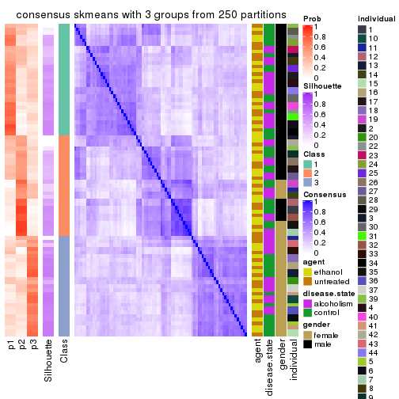</p>

</div>
<div id='tab-SD-skmeans-consensus-heatmap-3'>
<pre><code class="r">consensus_heatmap(res, k = 4)
</code></pre>

<p></p>

</div>
<div id='tab-SD-skmeans-consensus-heatmap-4'>
<pre><code class="r">consensus_heatmap(res, k = 5)
</code></pre>

<p></p>

</div>
<div id='tab-SD-skmeans-consensus-heatmap-5'>
<pre><code class="r">consensus_heatmap(res, k = 6)
</code></pre>

<p></p>

</div>
</div>

Heatmaps for the membership of samples in all partitions to see how consistent they are:


<script>
$( function() {
	$( '#tabs-SD-skmeans-membership-heatmap' ).tabs();
} );
</script>
<div id='tabs-SD-skmeans-membership-heatmap'>
<ul>
<li><a href='#tab-SD-skmeans-membership-heatmap-1'>k = 2</a></li>
<li><a href='#tab-SD-skmeans-membership-heatmap-2'>k = 3</a></li>
<li><a href='#tab-SD-skmeans-membership-heatmap-3'>k = 4</a></li>
<li><a href='#tab-SD-skmeans-membership-heatmap-4'>k = 5</a></li>
<li><a href='#tab-SD-skmeans-membership-heatmap-5'>k = 6</a></li>
</ul>
<div id='tab-SD-skmeans-membership-heatmap-1'>
<pre><code class="r">membership_heatmap(res, k = 2)
</code></pre>

<p></p>

</div>
<div id='tab-SD-skmeans-membership-heatmap-2'>
<pre><code class="r">membership_heatmap(res, k = 3)
</code></pre>

<p></p>

</div>
<div id='tab-SD-skmeans-membership-heatmap-3'>
<pre><code class="r">membership_heatmap(res, k = 4)
</code></pre>

<p></p>

</div>
<div id='tab-SD-skmeans-membership-heatmap-4'>
<pre><code class="r">membership_heatmap(res, k = 5)
</code></pre>

<p></p>

</div>
<div id='tab-SD-skmeans-membership-heatmap-5'>
<pre><code class="r">membership_heatmap(res, k = 6)
</code></pre>

<p></p>

</div>
</div>

As soon as we have had the classes for columns, we can look for signatures
which are significantly different between classes which can be candidate marks
for certain classes. Following are the heatmaps for signatures.


Signature heatmaps where rows are scaled:


<script>
$( function() {
	$( '#tabs-SD-skmeans-get-signatures' ).tabs();
} );
</script>
<div id='tabs-SD-skmeans-get-signatures'>
<ul>
<li><a href='#tab-SD-skmeans-get-signatures-1'>k = 2</a></li>
<li><a href='#tab-SD-skmeans-get-signatures-2'>k = 3</a></li>
<li><a href='#tab-SD-skmeans-get-signatures-3'>k = 4</a></li>
<li><a href='#tab-SD-skmeans-get-signatures-4'>k = 5</a></li>
<li><a href='#tab-SD-skmeans-get-signatures-5'>k = 6</a></li>
</ul>
<div id='tab-SD-skmeans-get-signatures-1'>
<pre><code class="r">get_signatures(res, k = 2)
</code></pre>

<p></p>

</div>
<div id='tab-SD-skmeans-get-signatures-2'>
<pre><code class="r">get_signatures(res, k = 3)
</code></pre>

<p></p>

</div>
<div id='tab-SD-skmeans-get-signatures-3'>
<pre><code class="r">get_signatures(res, k = 4)
</code></pre>

<p></p>

</div>
<div id='tab-SD-skmeans-get-signatures-4'>
<pre><code class="r">get_signatures(res, k = 5)
</code></pre>

<p></p>

</div>
<div id='tab-SD-skmeans-get-signatures-5'>
<pre><code class="r">get_signatures(res, k = 6)
</code></pre>

<p></p>

</div>
</div>


Signature heatmaps where rows are not scaled:


<script>
$( function() {
	$( '#tabs-SD-skmeans-get-signatures-no-scale' ).tabs();
} );
</script>
<div id='tabs-SD-skmeans-get-signatures-no-scale'>
<ul>
<li><a href='#tab-SD-skmeans-get-signatures-no-scale-1'>k = 2</a></li>
<li><a href='#tab-SD-skmeans-get-signatures-no-scale-2'>k = 3</a></li>
<li><a href='#tab-SD-skmeans-get-signatures-no-scale-3'>k = 4</a></li>
<li><a href='#tab-SD-skmeans-get-signatures-no-scale-4'>k = 5</a></li>
<li><a href='#tab-SD-skmeans-get-signatures-no-scale-5'>k = 6</a></li>
</ul>
<div id='tab-SD-skmeans-get-signatures-no-scale-1'>
<pre><code class="r">get_signatures(res, k = 2, scale_rows = FALSE)
</code></pre>

<p></p>

</div>
<div id='tab-SD-skmeans-get-signatures-no-scale-2'>
<pre><code class="r">get_signatures(res, k = 3, scale_rows = FALSE)
</code></pre>

<p></p>

</div>
<div id='tab-SD-skmeans-get-signatures-no-scale-3'>
<pre><code class="r">get_signatures(res, k = 4, scale_rows = FALSE)
</code></pre>

<p></p>

</div>
<div id='tab-SD-skmeans-get-signatures-no-scale-4'>
<pre><code class="r">get_signatures(res, k = 5, scale_rows = FALSE)
</code></pre>

<p></p>

</div>
<div id='tab-SD-skmeans-get-signatures-no-scale-5'>
<pre><code class="r">get_signatures(res, k = 6, scale_rows = FALSE)
</code></pre>

<p></p>

</div>
</div>


Compare the overlap of signatures from different k:

```r
compare_signatures(res)
```


`get_signature()` returns a data frame invisibly. TO get the list of signatures, the function
call should be assigned to a variable explicitly. In following code, if `plot` argument is set
to `FALSE`, no heatmap is plotted while only the differential analysis is performed.

```r
# code only for demonstration
tb = get_signature(res, k = ..., plot = FALSE)
```

An example of the output of `tb` is:

```
#>   which_row         fdr    mean_1    mean_2 scaled_mean_1 scaled_mean_2 km
#> 1        38 0.042760348  8.373488  9.131774    -0.5533452     0.5164555  1
#> 2        40 0.018707592  7.106213  8.469186    -0.6173731     0.5762149  1
#> 3        55 0.019134737 10.221463 11.207825    -0.6159697     0.5749050  1
#> 4        59 0.006059896  5.921854  7.869574    -0.6899429     0.6439467  1
#> 5        60 0.018055526  8.928898 10.211722    -0.6204761     0.5791110  1
#> 6        98 0.009384629 15.714769 14.887706     0.6635654    -0.6193277  2
...
```

The columns in `tb` are:

1. `which_row`: row indices corresponding to the input matrix.
2. `fdr`: FDR for the differential test. 
3. `mean_x`: The mean value in group x.
4. `scaled_mean_x`: The mean value in group x after rows are scaled.
5. `km`: Row groups if k-means clustering is applied to rows.


UMAP plot which shows how samples are separated.


<script>
$( function() {
	$( '#tabs-SD-skmeans-dimension-reduction' ).tabs();
} );
</script>
<div id='tabs-SD-skmeans-dimension-reduction'>
<ul>
<li><a href='#tab-SD-skmeans-dimension-reduction-1'>k = 2</a></li>
<li><a href='#tab-SD-skmeans-dimension-reduction-2'>k = 3</a></li>
<li><a href='#tab-SD-skmeans-dimension-reduction-3'>k = 4</a></li>
<li><a href='#tab-SD-skmeans-dimension-reduction-4'>k = 5</a></li>
<li><a href='#tab-SD-skmeans-dimension-reduction-5'>k = 6</a></li>
</ul>
<div id='tab-SD-skmeans-dimension-reduction-1'>
<pre><code class="r">dimension_reduction(res, k = 2, method = &quot;UMAP&quot;)
</code></pre>

<p></p>

</div>
<div id='tab-SD-skmeans-dimension-reduction-2'>
<pre><code class="r">dimension_reduction(res, k = 3, method = &quot;UMAP&quot;)
</code></pre>

<p></p>

</div>
<div id='tab-SD-skmeans-dimension-reduction-3'>
<pre><code class="r">dimension_reduction(res, k = 4, method = &quot;UMAP&quot;)
</code></pre>

<p></p>

</div>
<div id='tab-SD-skmeans-dimension-reduction-4'>
<pre><code class="r">dimension_reduction(res, k = 5, method = &quot;UMAP&quot;)
</code></pre>

<p></p>

</div>
<div id='tab-SD-skmeans-dimension-reduction-5'>
<pre><code class="r">dimension_reduction(res, k = 6, method = &quot;UMAP&quot;)
</code></pre>

<p></p>

</div>
</div>


Following heatmap shows how subgroups are split when increasing `k`:

```r
collect_classes(res)
```


Test correlation between subgroups and known annotations. If the known
annotation is numeric, one-way ANOVA test is applied, and if the known
annotation is discrete, chi-squared contingency table test is applied.

```r
test_to_known_factors(res)
```

```
#>             n agent(p) disease.state(p) gender(p) individual(p) k
#> SD:skmeans 10       NA               NA        NA            NA 2
#> SD:skmeans 47    0.873            0.563  3.72e-09      8.15e-05 3
#> SD:skmeans 43    0.839            0.464  1.28e-06      5.75e-06 4
#> SD:skmeans  9       NA               NA        NA            NA 5
#> SD:skmeans  0       NA               NA        NA            NA 6
```


If matrix rows can be associated to genes, consider to use `GO_Enrichment(res,
...)` to perform function enrichment for the signature genes.


 

---------------------------------------------------


### SD:pam


The object with results only for a single top-value method and a single partition method 
can be extracted as:

```r
res = res_list["SD", "pam"]
# you can also extract it by
# res = res_list["SD:pam"]
```

A summary of `res` and all the functions that can be applied to it:

```r
res
```

```
#> A 'ConsensusPartition' object with k = 2, 3, 4, 5, 6.
#>   On a matrix with 51941 rows and 84 columns.
#>   Top rows (1000, 2000, 3000, 4000, 5000) are extracted by 'SD' method.
#>   Subgroups are detected by 'pam' method.
#>   Performed in total 1250 partitions by row resampling.
#>   Best k for subgroups seems to be 3.
#> 
#> Following methods can be applied to this 'ConsensusPartition' object:
#>  [1] "cola_report"             "collect_classes"         "collect_plots"          
#>  [4] "collect_stats"           "colnames"                "compare_signatures"     
#>  [7] "consensus_heatmap"       "dimension_reduction"     "functional_enrichment"  
#> [10] "get_anno_col"            "get_anno"                "get_classes"            
#> [13] "get_consensus"           "get_matrix"              "get_membership"         
#> [16] "get_param"               "get_signatures"          "get_stats"              
#> [19] "is_best_k"               "is_stable_k"             "membership_heatmap"     
#> [22] "ncol"                    "nrow"                    "plot_ecdf"              
#> [25] "rownames"                "select_partition_number" "show"                   
#> [28] "suggest_best_k"          "test_to_known_factors"
```

`collect_plots()` function collects all the plots made from `res` for all `k` (number of partitions)
into one single page to provide an easy and fast comparison between different `k`.

```r
collect_plots(res)
```


The plots are:

- The first row: a plot of the ECDF (Empirical cumulative distribution
  function) curves of the consensus matrix for each `k` and the heatmap of
  predicted classes for each `k`.
- The second row: heatmaps of the consensus matrix for each `k`.
- The third row: heatmaps of the membership matrix for each `k`.
- The fouth row: heatmaps of the signatures for each `k`.

All the plots in panels can be made by individual functions and they are
plotted later in this section.

`select_partition_number()` produces several plots showing different
statistics for choosing "optimized" `k`. There are following statistics:

- ECDF curves of the consensus matrix for each `k`;
- 1-PAC. [The PAC
  score](https://en.wikipedia.org/wiki/Consensus_clustering#Over-interpretation_potential_of_consensus_clustering)
  measures the proportion of the ambiguous subgrouping.
- Mean silhouette score.
- Concordance. The mean probability of fiting the consensus class ids in all
  partitions.
- Area increased. Denote $A_k$ as the area under the ECDF curve for current
  `k`, the area increased is defined as $A_k - A_{k-1}$.
- Rand index. The percent of pairs of samples that are both in a same cluster
  or both are not in a same cluster in the partition of k and k-1.
- Jaccard index. The ratio of pairs of samples are both in a same cluster in
  the partition of k and k-1 and the pairs of samples are both in a same
  cluster in the partition k or k-1.

The detailed explanations of these statistics can be found in [the cola
vignette](http://bioconductor.org/packages/devel/bioc/vignettes/cola/inst/doc/cola.html#toc_13).

Generally speaking, lower PAC score, higher mean silhouette score or higher
concordance corresponds to better partition. Rand index and Jaccard index
measure how similar the current partition is compared to partition with `k-1`.
If they are too similar, we won't accept `k` is better than `k-1`.

```r
select_partition_number(res)
```


The numeric values for all these statistics can be obtained by `get_stats()`.

```r
get_stats(res)
```

```
#>   k  1-PAC mean_silhouette concordance area_increased  Rand Jaccard
#> 2 2 0.0539           0.239       0.599         0.4794 0.512   0.512
#> 3 3 0.1675           0.449       0.707         0.3495 0.639   0.406
#> 4 4 0.2136           0.386       0.638         0.0954 0.895   0.714
#> 5 5 0.2882           0.383       0.607         0.0482 0.910   0.719
#> 6 6 0.3444           0.387       0.618         0.0303 0.977   0.914
```

`suggest_best_k()` suggests the best $k$ based on these statistics. The rules are as follows:

- All $k$ with Jaccard index larger than 0.95 are removed because the increase of
  the partition number does not provides enough extra information. If all $k$ are removed,
  the best $k$ is assigned by `NA`.
- For $k$ with 1-PAC larger than 0.9, the maximal $k$ is taken as the "best k". Other $k$ is called "optional k".
- If it does not fit the second rule. The $k$ with the highest vote of highest
  1-PAC, mean silhouette and concordance is taken as the "best k".

```r
suggest_best_k(res)
```

```
#> [1] 3
```


Following shows the table of the partitions (You need to click the **show/hide
code output** link to see it). The membership matrix (columns with name `p*`)
is inferred by
[`clue::cl_consensus()`](https://www.rdocumentation.org/link/cl_consensus?package=clue)
function with the `SE` method. Basically the value in the membership matrix
represents the probability to belong to a certain group. The finall class
label for an item is determined with the group with highest probability it
belongs to.

In `get_classes()` function, the entropy is calculated from the membership
matrix and the silhouette score is calculated from the consensus matrix.


<script>
$( function() {
	$( '#tabs-SD-pam-get-classes' ).tabs();
} );
</script>
<div id='tabs-SD-pam-get-classes'>
<ul>
<li><a href='#tab-SD-pam-get-classes-1'>k = 2</a></li>
<li><a href='#tab-SD-pam-get-classes-2'>k = 3</a></li>
<li><a href='#tab-SD-pam-get-classes-3'>k = 4</a></li>
<li><a href='#tab-SD-pam-get-classes-4'>k = 5</a></li>
<li><a href='#tab-SD-pam-get-classes-5'>k = 6</a></li>
</ul>

<div id='tab-SD-pam-get-classes-1'>
<p><a id='tab-SD-pam-get-classes-1-a' style='color:#0366d6' href='#'>show/hide code output</a></p>
<pre><code class="r">cbind(get_classes(res, k = 2), get_membership(res, k = 2))
</code></pre>

<pre><code>#&gt;            class entropy silhouette    p1    p2
#&gt; GSM1269647     2  0.4161    0.43028 0.084 0.916
#&gt; GSM1269655     1  0.9998   -0.28865 0.508 0.492
#&gt; GSM1269663     1  0.9775   -0.17234 0.588 0.412
#&gt; GSM1269671     2  0.8386    0.21106 0.268 0.732
#&gt; GSM1269679     2  0.9815    0.28779 0.420 0.580
#&gt; GSM1269693     1  0.9635   -0.19214 0.612 0.388
#&gt; GSM1269701     1  0.9977   -0.26059 0.528 0.472
#&gt; GSM1269709     2  0.9552   -0.13414 0.376 0.624
#&gt; GSM1269715     2  0.9954    0.30853 0.460 0.540
#&gt; GSM1269717     2  0.9996   -0.00829 0.488 0.512
#&gt; GSM1269721     1  0.8763   -0.10014 0.704 0.296
#&gt; GSM1269723     2  0.9754    0.33136 0.408 0.592
#&gt; GSM1269645     1  0.9983    0.33759 0.524 0.476
#&gt; GSM1269653     1  0.4431    0.25778 0.908 0.092
#&gt; GSM1269661     1  0.9977    0.24535 0.528 0.472
#&gt; GSM1269669     1  0.6531    0.14266 0.832 0.168
#&gt; GSM1269677     1  0.9323    0.38403 0.652 0.348
#&gt; GSM1269685     1  0.9833    0.36759 0.576 0.424
#&gt; GSM1269691     1  0.0672    0.31679 0.992 0.008
#&gt; GSM1269699     1  0.9881    0.36333 0.564 0.436
#&gt; GSM1269707     1  0.7453    0.35850 0.788 0.212
#&gt; GSM1269651     2  0.9393    0.04448 0.356 0.644
#&gt; GSM1269659     1  0.8081    0.34238 0.752 0.248
#&gt; GSM1269667     2  0.8443    0.43980 0.272 0.728
#&gt; GSM1269675     2  0.7139    0.39858 0.196 0.804
#&gt; GSM1269683     2  0.9580    0.38842 0.380 0.620
#&gt; GSM1269689     2  0.9552    0.33888 0.376 0.624
#&gt; GSM1269697     2  0.7745    0.44576 0.228 0.772
#&gt; GSM1269705     2  0.9170    0.30585 0.332 0.668
#&gt; GSM1269713     2  0.9491    0.32489 0.368 0.632
#&gt; GSM1269719     2  0.9881   -0.22440 0.436 0.564
#&gt; GSM1269725     2  0.7376    0.44978 0.208 0.792
#&gt; GSM1269727     2  0.9996    0.24753 0.488 0.512
#&gt; GSM1269649     1  0.6801    0.19370 0.820 0.180
#&gt; GSM1269657     1  0.9988    0.34257 0.520 0.480
#&gt; GSM1269665     1  0.9909    0.35886 0.556 0.444
#&gt; GSM1269673     1  0.5946    0.37078 0.856 0.144
#&gt; GSM1269681     1  0.9988    0.33957 0.520 0.480
#&gt; GSM1269687     1  0.9393    0.37577 0.644 0.356
#&gt; GSM1269695     1  0.9988    0.34383 0.520 0.480
#&gt; GSM1269703     1  0.9988    0.33810 0.520 0.480
#&gt; GSM1269711     1  0.9909    0.30459 0.556 0.444
#&gt; GSM1269646     2  0.6438    0.45782 0.164 0.836
#&gt; GSM1269654     2  0.8955    0.17318 0.312 0.688
#&gt; GSM1269662     1  0.9933    0.13250 0.548 0.452
#&gt; GSM1269670     2  0.7950    0.25788 0.240 0.760
#&gt; GSM1269678     2  0.5519    0.45354 0.128 0.872
#&gt; GSM1269692     1  0.5059    0.22046 0.888 0.112
#&gt; GSM1269700     2  0.8713    0.43148 0.292 0.708
#&gt; GSM1269708     2  0.9608   -0.13103 0.384 0.616
#&gt; GSM1269714     2  0.9552    0.37984 0.376 0.624
#&gt; GSM1269716     2  0.9944    0.22040 0.456 0.544
#&gt; GSM1269720     1  0.9732   -0.18793 0.596 0.404
#&gt; GSM1269722     2  0.9988    0.24680 0.480 0.520
#&gt; GSM1269644     1  0.2423    0.33285 0.960 0.040
#&gt; GSM1269652     1  0.9491    0.26812 0.632 0.368
#&gt; GSM1269660     1  0.9909    0.16918 0.556 0.444
#&gt; GSM1269668     1  0.6531    0.21644 0.832 0.168
#&gt; GSM1269676     1  0.6801    0.37942 0.820 0.180
#&gt; GSM1269684     1  0.9866    0.36350 0.568 0.432
#&gt; GSM1269690     1  0.0376    0.31897 0.996 0.004
#&gt; GSM1269698     1  0.9922    0.34902 0.552 0.448
#&gt; GSM1269706     1  0.9686    0.31554 0.604 0.396
#&gt; GSM1269650     1  0.9393    0.28210 0.644 0.356
#&gt; GSM1269658     1  0.5946    0.20449 0.856 0.144
#&gt; GSM1269666     2  0.9661    0.35729 0.392 0.608
#&gt; GSM1269674     1  0.9833   -0.24025 0.576 0.424
#&gt; GSM1269682     2  0.9977   -0.27980 0.472 0.528
#&gt; GSM1269688     1  0.9944   -0.25190 0.544 0.456
#&gt; GSM1269696     2  0.2603    0.45623 0.044 0.956
#&gt; GSM1269704     2  0.6801    0.42403 0.180 0.820
#&gt; GSM1269712     2  0.6623    0.38250 0.172 0.828
#&gt; GSM1269718     2  0.7299    0.36272 0.204 0.796
#&gt; GSM1269724     2  0.8861    0.41046 0.304 0.696
#&gt; GSM1269726     1  0.9944   -0.24589 0.544 0.456
#&gt; GSM1269648     1  0.9977    0.34561 0.528 0.472
#&gt; GSM1269656     1  0.9775    0.37345 0.588 0.412
#&gt; GSM1269664     1  0.7299    0.36006 0.796 0.204
#&gt; GSM1269672     1  0.4161    0.34353 0.916 0.084
#&gt; GSM1269680     1  0.9996    0.33357 0.512 0.488
#&gt; GSM1269686     1  0.9983    0.34558 0.524 0.476
#&gt; GSM1269694     1  0.9970    0.35073 0.532 0.468
#&gt; GSM1269702     1  0.9977    0.34626 0.528 0.472
#&gt; GSM1269710     1  0.8763    0.36183 0.704 0.296
</code></pre>

<script>
$('#tab-SD-pam-get-classes-1-a').parent().next().next().hide();
$('#tab-SD-pam-get-classes-1-a').click(function(){
  $('#tab-SD-pam-get-classes-1-a').parent().next().next().toggle();
  return(false);
});
</script>
</div>

<div id='tab-SD-pam-get-classes-2'>
<p><a id='tab-SD-pam-get-classes-2-a' style='color:#0366d6' href='#'>show/hide code output</a></p>
<pre><code class="r">cbind(get_classes(res, k = 3), get_membership(res, k = 3))
</code></pre>

<pre><code>#&gt;            class entropy silhouette    p1    p2    p3
#&gt; GSM1269647     2  0.6661    0.41121 0.400 0.588 0.012
#&gt; GSM1269655     3  0.7979    0.37970 0.100 0.272 0.628
#&gt; GSM1269663     3  0.9217    0.34522 0.260 0.208 0.532
#&gt; GSM1269671     1  0.4968    0.60770 0.800 0.188 0.012
#&gt; GSM1269679     2  0.5443    0.50425 0.004 0.736 0.260
#&gt; GSM1269693     3  0.3686    0.55358 0.000 0.140 0.860
#&gt; GSM1269701     3  0.6888    0.07267 0.016 0.432 0.552
#&gt; GSM1269709     1  0.7571    0.13095 0.508 0.452 0.040
#&gt; GSM1269715     3  0.9387    0.28234 0.220 0.272 0.508
#&gt; GSM1269717     3  0.9370   -0.10537 0.416 0.168 0.416
#&gt; GSM1269721     3  0.5598    0.54341 0.148 0.052 0.800
#&gt; GSM1269723     2  0.7383    0.50451 0.084 0.680 0.236
#&gt; GSM1269645     1  0.4399    0.65407 0.812 0.000 0.188
#&gt; GSM1269653     3  0.5117    0.60588 0.108 0.060 0.832
#&gt; GSM1269661     1  0.8925    0.44464 0.564 0.180 0.256
#&gt; GSM1269669     3  0.2651    0.59002 0.012 0.060 0.928
#&gt; GSM1269677     1  0.4654    0.55161 0.792 0.000 0.208
#&gt; GSM1269685     1  0.5138    0.62793 0.748 0.000 0.252
#&gt; GSM1269691     3  0.1529    0.60570 0.040 0.000 0.960
#&gt; GSM1269699     1  0.2301    0.67032 0.936 0.004 0.060
#&gt; GSM1269707     1  0.5968    0.18945 0.636 0.000 0.364
#&gt; GSM1269651     1  0.5505    0.63947 0.816 0.088 0.096
#&gt; GSM1269659     3  0.7767    0.23682 0.412 0.052 0.536
#&gt; GSM1269667     2  0.9292    0.37039 0.284 0.516 0.200
#&gt; GSM1269675     2  0.7742    0.39818 0.356 0.584 0.060
#&gt; GSM1269683     2  0.9223    0.27279 0.172 0.504 0.324
#&gt; GSM1269689     2  0.4861    0.60069 0.012 0.808 0.180
#&gt; GSM1269697     2  0.3295    0.64097 0.096 0.896 0.008
#&gt; GSM1269705     1  0.8749    0.34293 0.572 0.276 0.152
#&gt; GSM1269713     2  0.5042    0.61670 0.104 0.836 0.060
#&gt; GSM1269719     1  0.4056    0.66891 0.876 0.092 0.032
#&gt; GSM1269725     2  0.2187    0.64214 0.028 0.948 0.024
#&gt; GSM1269727     2  0.6490    0.37893 0.012 0.628 0.360
#&gt; GSM1269649     3  0.7330    0.57895 0.216 0.092 0.692
#&gt; GSM1269657     1  0.0000    0.66129 1.000 0.000 0.000
#&gt; GSM1269665     1  0.5202    0.64635 0.772 0.008 0.220
#&gt; GSM1269673     3  0.5404    0.46966 0.256 0.004 0.740
#&gt; GSM1269681     1  0.0424    0.66317 0.992 0.000 0.008
#&gt; GSM1269687     1  0.6379    0.47753 0.624 0.008 0.368
#&gt; GSM1269695     1  0.4062    0.66078 0.836 0.000 0.164
#&gt; GSM1269703     1  0.2711    0.67376 0.912 0.000 0.088
#&gt; GSM1269711     1  0.8105    0.44841 0.580 0.084 0.336
#&gt; GSM1269646     2  0.2229    0.63602 0.044 0.944 0.012
#&gt; GSM1269654     1  0.6633    0.57120 0.728 0.212 0.060
#&gt; GSM1269662     1  0.9829   -0.11137 0.400 0.248 0.352
#&gt; GSM1269670     1  0.6252    0.51840 0.708 0.268 0.024
#&gt; GSM1269678     2  0.3481    0.64341 0.044 0.904 0.052
#&gt; GSM1269692     3  0.3148    0.60874 0.048 0.036 0.916
#&gt; GSM1269700     2  0.8459    0.47612 0.232 0.612 0.156
#&gt; GSM1269708     1  0.8342    0.07191 0.464 0.456 0.080
#&gt; GSM1269714     2  0.8309    0.46261 0.188 0.632 0.180
#&gt; GSM1269716     3  0.9547    0.17284 0.320 0.212 0.468
#&gt; GSM1269720     3  0.9133    0.35338 0.296 0.176 0.528
#&gt; GSM1269722     2  0.5618    0.52554 0.008 0.732 0.260
#&gt; GSM1269644     3  0.3482    0.60902 0.128 0.000 0.872
#&gt; GSM1269652     1  0.9783    0.00242 0.436 0.264 0.300
#&gt; GSM1269660     1  0.8304    0.22609 0.504 0.080 0.416
#&gt; GSM1269668     3  0.5307    0.61028 0.124 0.056 0.820
#&gt; GSM1269676     3  0.6192    0.35262 0.420 0.000 0.580
#&gt; GSM1269684     1  0.5254    0.62819 0.736 0.000 0.264
#&gt; GSM1269690     3  0.1753    0.60841 0.048 0.000 0.952
#&gt; GSM1269698     1  0.3752    0.64976 0.884 0.020 0.096
#&gt; GSM1269706     1  0.8230    0.17903 0.564 0.088 0.348
#&gt; GSM1269650     1  0.7095    0.37115 0.660 0.048 0.292
#&gt; GSM1269658     3  0.5263    0.60849 0.116 0.060 0.824
#&gt; GSM1269666     2  0.6970    0.51290 0.048 0.676 0.276
#&gt; GSM1269674     3  0.7841    0.11762 0.056 0.408 0.536
#&gt; GSM1269682     1  0.7726    0.59428 0.676 0.192 0.132
#&gt; GSM1269688     3  0.7466    0.03049 0.036 0.444 0.520
#&gt; GSM1269696     2  0.2096    0.64561 0.052 0.944 0.004
#&gt; GSM1269704     2  0.7392    0.12189 0.468 0.500 0.032
#&gt; GSM1269712     2  0.7138    0.14362 0.436 0.540 0.024
#&gt; GSM1269718     1  0.7325    0.22539 0.576 0.388 0.036
#&gt; GSM1269724     2  0.6677    0.56967 0.088 0.744 0.168
#&gt; GSM1269726     3  0.7698    0.33383 0.072 0.304 0.624
#&gt; GSM1269648     1  0.4002    0.66858 0.840 0.000 0.160
#&gt; GSM1269656     1  0.3619    0.62382 0.864 0.000 0.136
#&gt; GSM1269664     3  0.6521   -0.09641 0.492 0.004 0.504
#&gt; GSM1269672     3  0.4750    0.54513 0.216 0.000 0.784
#&gt; GSM1269680     1  0.0000    0.66129 1.000 0.000 0.000
#&gt; GSM1269686     1  0.4110    0.66183 0.844 0.004 0.152
#&gt; GSM1269694     1  0.3686    0.66639 0.860 0.000 0.140
#&gt; GSM1269702     1  0.3412    0.67002 0.876 0.000 0.124
#&gt; GSM1269710     3  0.6779    0.02768 0.444 0.012 0.544
</code></pre>

<script>
$('#tab-SD-pam-get-classes-2-a').parent().next().next().hide();
$('#tab-SD-pam-get-classes-2-a').click(function(){
  $('#tab-SD-pam-get-classes-2-a').parent().next().next().toggle();
  return(false);
});
</script>
</div>

<div id='tab-SD-pam-get-classes-3'>
<p><a id='tab-SD-pam-get-classes-3-a' style='color:#0366d6' href='#'>show/hide code output</a></p>
<pre><code class="r">cbind(get_classes(res, k = 4), get_membership(res, k = 4))
</code></pre>

<pre><code>#&gt;            class entropy silhouette    p1    p2    p3    p4
#&gt; GSM1269647     2   0.625    0.25001 0.276 0.652 0.052 0.020
#&gt; GSM1269655     4   0.835    0.24868 0.076 0.256 0.140 0.528
#&gt; GSM1269663     4   0.822    0.34733 0.244 0.204 0.040 0.512
#&gt; GSM1269671     1   0.511    0.58943 0.772 0.164 0.048 0.016
#&gt; GSM1269679     3   0.794   -0.17230 0.004 0.376 0.380 0.240
#&gt; GSM1269693     4   0.448    0.53212 0.000 0.052 0.152 0.796
#&gt; GSM1269701     2   0.605    0.19003 0.004 0.540 0.036 0.420
#&gt; GSM1269709     3   0.554    0.46022 0.272 0.020 0.688 0.020
#&gt; GSM1269715     4   0.924    0.31965 0.216 0.136 0.196 0.452
#&gt; GSM1269717     1   0.887    0.01977 0.384 0.084 0.152 0.380
#&gt; GSM1269721     4   0.603    0.51897 0.120 0.040 0.100 0.740
#&gt; GSM1269723     2   0.444    0.47510 0.040 0.836 0.040 0.084
#&gt; GSM1269645     1   0.405    0.64361 0.804 0.008 0.008 0.180
#&gt; GSM1269653     4   0.435    0.59242 0.092 0.004 0.080 0.824
#&gt; GSM1269661     1   0.759    0.45286 0.564 0.184 0.020 0.232
#&gt; GSM1269669     4   0.433    0.52835 0.008 0.148 0.032 0.812
#&gt; GSM1269677     1   0.617    0.47592 0.700 0.032 0.060 0.208
#&gt; GSM1269685     1   0.442    0.61441 0.736 0.000 0.008 0.256
#&gt; GSM1269691     4   0.102    0.59350 0.032 0.000 0.000 0.968
#&gt; GSM1269699     1   0.238    0.65658 0.916 0.008 0.004 0.072
#&gt; GSM1269707     1   0.530    0.12770 0.600 0.004 0.008 0.388
#&gt; GSM1269651     1   0.836    0.37659 0.548 0.200 0.168 0.084
#&gt; GSM1269659     4   0.773    0.26365 0.364 0.060 0.072 0.504
#&gt; GSM1269667     2   0.819    0.28915 0.212 0.568 0.100 0.120
#&gt; GSM1269675     3   0.839    0.23611 0.292 0.288 0.400 0.020
#&gt; GSM1269683     2   0.965    0.06428 0.144 0.360 0.264 0.232
#&gt; GSM1269689     2   0.650    0.32665 0.008 0.636 0.260 0.096
#&gt; GSM1269697     3   0.575    0.31902 0.052 0.272 0.672 0.004
#&gt; GSM1269705     1   0.888    0.18904 0.504 0.152 0.204 0.140
#&gt; GSM1269713     3   0.756    0.19695 0.080 0.316 0.552 0.052
#&gt; GSM1269719     1   0.377    0.66204 0.872 0.048 0.040 0.040
#&gt; GSM1269725     2   0.573    0.16107 0.016 0.560 0.416 0.008
#&gt; GSM1269727     2   0.691    0.40937 0.000 0.588 0.172 0.240
#&gt; GSM1269649     4   0.614    0.56392 0.168 0.108 0.016 0.708
#&gt; GSM1269657     1   0.123    0.64184 0.968 0.008 0.004 0.020
#&gt; GSM1269665     1   0.434    0.63099 0.764 0.008 0.004 0.224
#&gt; GSM1269673     4   0.448    0.46693 0.248 0.000 0.012 0.740
#&gt; GSM1269681     1   0.380    0.62451 0.868 0.048 0.060 0.024
#&gt; GSM1269687     1   0.577    0.47051 0.612 0.016 0.016 0.356
#&gt; GSM1269695     1   0.406    0.65262 0.828 0.020 0.012 0.140
#&gt; GSM1269703     1   0.299    0.65977 0.884 0.012 0.004 0.100
#&gt; GSM1269711     1   0.749    0.42989 0.560 0.088 0.044 0.308
#&gt; GSM1269646     2   0.609    0.15111 0.032 0.544 0.416 0.008
#&gt; GSM1269654     1   0.712    0.51665 0.652 0.168 0.136 0.044
#&gt; GSM1269662     1   0.839   -0.11358 0.328 0.328 0.016 0.328
#&gt; GSM1269670     1   0.651    0.50260 0.684 0.160 0.136 0.020
#&gt; GSM1269678     3   0.643    0.13994 0.032 0.356 0.584 0.028
#&gt; GSM1269692     4   0.356    0.58717 0.032 0.020 0.072 0.876
#&gt; GSM1269700     2   0.569    0.43830 0.124 0.760 0.036 0.080
#&gt; GSM1269708     3   0.564    0.46043 0.260 0.016 0.692 0.032
#&gt; GSM1269714     3   0.628    0.39807 0.076 0.116 0.732 0.076
#&gt; GSM1269716     4   0.932    0.20946 0.280 0.168 0.136 0.416
#&gt; GSM1269720     4   0.890    0.35268 0.244 0.112 0.160 0.484
#&gt; GSM1269722     2   0.575    0.45400 0.008 0.732 0.128 0.132
#&gt; GSM1269644     4   0.293    0.60320 0.108 0.000 0.012 0.880
#&gt; GSM1269652     3   0.776    0.26499 0.316 0.000 0.428 0.256
#&gt; GSM1269660     1   0.733    0.19509 0.476 0.100 0.016 0.408
#&gt; GSM1269668     4   0.629    0.52408 0.104 0.168 0.024 0.704
#&gt; GSM1269676     4   0.679    0.35092 0.364 0.020 0.060 0.556
#&gt; GSM1269684     1   0.477    0.62029 0.736 0.008 0.012 0.244
#&gt; GSM1269690     4   0.130    0.59727 0.044 0.000 0.000 0.956
#&gt; GSM1269698     1   0.316    0.64283 0.880 0.004 0.020 0.096
#&gt; GSM1269706     1   0.707    0.15375 0.524 0.008 0.104 0.364
#&gt; GSM1269650     1   0.919    0.12908 0.460 0.148 0.164 0.228
#&gt; GSM1269658     4   0.553    0.57666 0.076 0.084 0.060 0.780
#&gt; GSM1269666     2   0.758    0.35761 0.020 0.560 0.248 0.172
#&gt; GSM1269674     4   0.834   -0.04396 0.044 0.328 0.164 0.464
#&gt; GSM1269682     1   0.742    0.51239 0.636 0.188 0.096 0.080
#&gt; GSM1269688     2   0.768    0.15149 0.028 0.444 0.108 0.420
#&gt; GSM1269696     2   0.569   -0.03142 0.024 0.508 0.468 0.000
#&gt; GSM1269704     3   0.834    0.30539 0.324 0.212 0.436 0.028
#&gt; GSM1269712     3   0.803    0.26272 0.396 0.188 0.400 0.016
#&gt; GSM1269718     1   0.788    0.20449 0.544 0.248 0.176 0.032
#&gt; GSM1269724     3   0.657    0.27928 0.032 0.232 0.664 0.072
#&gt; GSM1269726     4   0.777    0.27148 0.068 0.272 0.092 0.568
#&gt; GSM1269648     1   0.371    0.65854 0.832 0.004 0.012 0.152
#&gt; GSM1269656     1   0.368    0.60332 0.828 0.008 0.004 0.160
#&gt; GSM1269664     4   0.540   -0.06302 0.476 0.012 0.000 0.512
#&gt; GSM1269672     4   0.391    0.54443 0.212 0.000 0.004 0.784
#&gt; GSM1269680     1   0.233    0.63914 0.932 0.024 0.024 0.020
#&gt; GSM1269686     1   0.416    0.65079 0.824 0.024 0.012 0.140
#&gt; GSM1269694     1   0.385    0.65436 0.844 0.020 0.012 0.124
#&gt; GSM1269702     1   0.294    0.65526 0.868 0.000 0.004 0.128
#&gt; GSM1269710     4   0.697   -0.00494 0.428 0.052 0.028 0.492
</code></pre>

<script>
$('#tab-SD-pam-get-classes-3-a').parent().next().next().hide();
$('#tab-SD-pam-get-classes-3-a').click(function(){
  $('#tab-SD-pam-get-classes-3-a').parent().next().next().toggle();
  return(false);
});
</script>
</div>

<div id='tab-SD-pam-get-classes-4'>
<p><a id='tab-SD-pam-get-classes-4-a' style='color:#0366d6' href='#'>show/hide code output</a></p>
<pre><code class="r">cbind(get_classes(res, k = 5), get_membership(res, k = 5))
</code></pre>

<pre><code>#&gt;            class entropy silhouette    p1    p2    p3    p4    p5
#&gt; GSM1269647     3   0.659    0.26855 0.176 0.148 0.620 0.004 0.052
#&gt; GSM1269655     4   0.851    0.16392 0.064 0.108 0.196 0.484 0.148
#&gt; GSM1269663     4   0.801    0.33651 0.248 0.060 0.164 0.488 0.040
#&gt; GSM1269671     1   0.544    0.54969 0.720 0.044 0.164 0.004 0.068
#&gt; GSM1269679     3   0.681    0.07900 0.004 0.000 0.384 0.232 0.380
#&gt; GSM1269693     4   0.342    0.52048 0.000 0.004 0.036 0.836 0.124
#&gt; GSM1269701     3   0.545    0.18630 0.008 0.008 0.564 0.388 0.032
#&gt; GSM1269709     5   0.452    0.50040 0.236 0.000 0.004 0.040 0.720
#&gt; GSM1269715     4   0.783    0.33535 0.212 0.016 0.112 0.516 0.144
#&gt; GSM1269717     4   0.803   -0.00598 0.376 0.036 0.084 0.404 0.100
#&gt; GSM1269721     4   0.609    0.46495 0.036 0.224 0.016 0.656 0.068
#&gt; GSM1269723     3   0.335    0.44309 0.028 0.008 0.872 0.056 0.036
#&gt; GSM1269645     1   0.273    0.65458 0.872 0.004 0.000 0.112 0.012
#&gt; GSM1269653     4   0.487    0.56286 0.080 0.044 0.004 0.776 0.096
#&gt; GSM1269661     1   0.665    0.45994 0.588 0.008 0.176 0.204 0.024
#&gt; GSM1269669     4   0.441    0.48166 0.016 0.004 0.180 0.768 0.032
#&gt; GSM1269677     1   0.759    0.02044 0.428 0.372 0.020 0.132 0.048
#&gt; GSM1269685     1   0.289    0.63988 0.824 0.000 0.000 0.176 0.000
#&gt; GSM1269691     4   0.173    0.56851 0.080 0.000 0.000 0.920 0.000
#&gt; GSM1269699     1   0.385    0.62877 0.836 0.084 0.004 0.056 0.020
#&gt; GSM1269707     1   0.619    0.15875 0.528 0.096 0.000 0.360 0.016
#&gt; GSM1269651     2   0.703    0.78397 0.184 0.620 0.064 0.040 0.092
#&gt; GSM1269659     4   0.787    0.22055 0.324 0.212 0.020 0.404 0.040
#&gt; GSM1269667     3   0.746    0.32437 0.188 0.012 0.560 0.120 0.120
#&gt; GSM1269675     5   0.771    0.21313 0.272 0.028 0.276 0.016 0.408
#&gt; GSM1269683     3   0.875    0.07080 0.136 0.020 0.348 0.236 0.260
#&gt; GSM1269689     3   0.551    0.28176 0.004 0.032 0.680 0.052 0.232
#&gt; GSM1269697     5   0.406    0.43590 0.024 0.012 0.188 0.000 0.776
#&gt; GSM1269705     1   0.892    0.06893 0.436 0.100 0.124 0.116 0.224
#&gt; GSM1269713     5   0.630    0.33318 0.020 0.084 0.260 0.020 0.616
#&gt; GSM1269719     1   0.344    0.64252 0.872 0.036 0.040 0.016 0.036
#&gt; GSM1269725     3   0.531    0.06268 0.012 0.020 0.520 0.004 0.444
#&gt; GSM1269727     3   0.619    0.40053 0.000 0.016 0.604 0.220 0.160
#&gt; GSM1269649     4   0.628    0.52087 0.220 0.036 0.092 0.640 0.012
#&gt; GSM1269657     1   0.298    0.59488 0.856 0.128 0.004 0.004 0.008
#&gt; GSM1269665     1   0.289    0.64925 0.844 0.000 0.008 0.148 0.000
#&gt; GSM1269673     4   0.407    0.41807 0.324 0.000 0.000 0.672 0.004
#&gt; GSM1269681     1   0.601    0.35844 0.608 0.296 0.040 0.004 0.052
#&gt; GSM1269687     1   0.427    0.52112 0.696 0.000 0.008 0.288 0.008
#&gt; GSM1269695     1   0.251    0.65576 0.900 0.012 0.008 0.076 0.004
#&gt; GSM1269703     1   0.106    0.64985 0.968 0.008 0.004 0.020 0.000
#&gt; GSM1269711     1   0.673    0.46180 0.576 0.016 0.096 0.276 0.036
#&gt; GSM1269646     3   0.564    0.04758 0.016 0.044 0.520 0.000 0.420
#&gt; GSM1269654     1   0.740    0.37381 0.600 0.120 0.104 0.036 0.140
#&gt; GSM1269662     3   0.860   -0.05073 0.292 0.124 0.320 0.252 0.012
#&gt; GSM1269670     1   0.615    0.49460 0.668 0.032 0.136 0.012 0.152
#&gt; GSM1269678     5   0.591    0.24692 0.028 0.004 0.324 0.052 0.592
#&gt; GSM1269692     4   0.311    0.55723 0.032 0.012 0.016 0.884 0.056
#&gt; GSM1269700     3   0.444    0.43294 0.104 0.004 0.800 0.060 0.032
#&gt; GSM1269708     5   0.471    0.50028 0.216 0.000 0.004 0.060 0.720
#&gt; GSM1269714     5   0.540    0.46014 0.060 0.004 0.092 0.104 0.740
#&gt; GSM1269716     4   0.819    0.18251 0.280 0.044 0.136 0.464 0.076
#&gt; GSM1269720     4   0.859    0.30415 0.184 0.192 0.040 0.452 0.132
#&gt; GSM1269722     3   0.520    0.41607 0.012 0.008 0.732 0.132 0.116
#&gt; GSM1269644     4   0.304    0.57316 0.148 0.004 0.000 0.840 0.008
#&gt; GSM1269652     5   0.778    0.23920 0.192 0.108 0.000 0.232 0.468
#&gt; GSM1269660     1   0.666    0.23268 0.464 0.016 0.100 0.408 0.012
#&gt; GSM1269668     4   0.601    0.45906 0.108 0.004 0.208 0.652 0.028
#&gt; GSM1269676     4   0.789    0.03900 0.184 0.348 0.020 0.400 0.048
#&gt; GSM1269684     1   0.349    0.63836 0.784 0.000 0.004 0.208 0.004
#&gt; GSM1269690     4   0.201    0.57324 0.088 0.000 0.000 0.908 0.004
#&gt; GSM1269698     1   0.427    0.61970 0.812 0.064 0.004 0.092 0.028
#&gt; GSM1269706     1   0.793    0.06537 0.404 0.116 0.008 0.352 0.120
#&gt; GSM1269650     2   0.660    0.78372 0.108 0.680 0.056 0.076 0.080
#&gt; GSM1269658     4   0.640    0.46651 0.044 0.224 0.052 0.644 0.036
#&gt; GSM1269666     3   0.777    0.32528 0.024 0.080 0.524 0.156 0.216
#&gt; GSM1269674     4   0.730   -0.01038 0.044 0.004 0.316 0.472 0.164
#&gt; GSM1269682     1   0.612    0.48488 0.668 0.004 0.180 0.080 0.068
#&gt; GSM1269688     3   0.724    0.16244 0.024 0.032 0.456 0.380 0.108
#&gt; GSM1269696     5   0.516    0.10360 0.024 0.008 0.476 0.000 0.492
#&gt; GSM1269704     5   0.796    0.31383 0.248 0.076 0.180 0.020 0.476
#&gt; GSM1269712     5   0.694    0.25434 0.368 0.004 0.168 0.016 0.444
#&gt; GSM1269718     1   0.751    0.22360 0.516 0.032 0.228 0.028 0.196
#&gt; GSM1269724     5   0.500    0.35951 0.012 0.004 0.212 0.056 0.716
#&gt; GSM1269726     4   0.607    0.28988 0.064 0.004 0.272 0.620 0.040
#&gt; GSM1269648     1   0.245    0.65961 0.896 0.016 0.000 0.084 0.004
#&gt; GSM1269656     1   0.523    0.55414 0.716 0.128 0.004 0.144 0.008
#&gt; GSM1269664     1   0.470    0.10127 0.516 0.004 0.008 0.472 0.000
#&gt; GSM1269672     4   0.379    0.52171 0.248 0.000 0.004 0.744 0.004
#&gt; GSM1269680     1   0.430    0.54362 0.748 0.216 0.004 0.004 0.028
#&gt; GSM1269686     1   0.249    0.65498 0.900 0.000 0.020 0.072 0.008
#&gt; GSM1269694     1   0.189    0.65214 0.936 0.012 0.008 0.040 0.004
#&gt; GSM1269702     1   0.157    0.65152 0.936 0.004 0.000 0.060 0.000
#&gt; GSM1269710     1   0.578    0.01451 0.480 0.008 0.040 0.460 0.012
</code></pre>

<script>
$('#tab-SD-pam-get-classes-4-a').parent().next().next().hide();
$('#tab-SD-pam-get-classes-4-a').click(function(){
  $('#tab-SD-pam-get-classes-4-a').parent().next().next().toggle();
  return(false);
});
</script>
</div>

<div id='tab-SD-pam-get-classes-5'>
<p><a id='tab-SD-pam-get-classes-5-a' style='color:#0366d6' href='#'>show/hide code output</a></p>
<pre><code class="r">cbind(get_classes(res, k = 6), get_membership(res, k = 6))
</code></pre>

<pre><code>#&gt;            class entropy silhouette    p1    p2    p3    p4    p5    p6
#&gt; GSM1269647     3  0.6631    0.28562 0.116 0.064 0.584 0.000 0.040 0.196
#&gt; GSM1269655     4  0.7457    0.19044 0.052 0.248 0.140 0.476 0.084 0.000
#&gt; GSM1269663     4  0.7332    0.36656 0.236 0.096 0.152 0.488 0.024 0.004
#&gt; GSM1269671     1  0.6415    0.48062 0.624 0.044 0.176 0.004 0.064 0.088
#&gt; GSM1269679     5  0.6317   -0.06079 0.004 0.004 0.376 0.216 0.396 0.004
#&gt; GSM1269693     4  0.3333    0.53652 0.000 0.012 0.016 0.832 0.124 0.016
#&gt; GSM1269701     3  0.5670    0.17442 0.020 0.012 0.556 0.348 0.060 0.004
#&gt; GSM1269709     5  0.3698    0.48845 0.212 0.000 0.004 0.028 0.756 0.000
#&gt; GSM1269715     4  0.7704    0.31919 0.220 0.032 0.088 0.472 0.172 0.016
#&gt; GSM1269717     4  0.7886   -0.00458 0.360 0.084 0.072 0.380 0.088 0.016
#&gt; GSM1269721     4  0.6584    0.41027 0.016 0.184 0.008 0.588 0.064 0.140
#&gt; GSM1269723     3  0.3518    0.43102 0.020 0.020 0.852 0.056 0.044 0.008
#&gt; GSM1269645     1  0.2666    0.65119 0.864 0.000 0.000 0.112 0.012 0.012
#&gt; GSM1269653     4  0.4284    0.54694 0.072 0.000 0.004 0.784 0.092 0.048
#&gt; GSM1269661     1  0.5845    0.46897 0.600 0.000 0.168 0.204 0.020 0.008
#&gt; GSM1269669     4  0.4744    0.44966 0.020 0.004 0.204 0.712 0.056 0.004
#&gt; GSM1269677     6  0.4310    0.65847 0.204 0.004 0.000 0.072 0.000 0.720
#&gt; GSM1269685     1  0.2527    0.63411 0.832 0.000 0.000 0.168 0.000 0.000
#&gt; GSM1269691     4  0.1387    0.55899 0.068 0.000 0.000 0.932 0.000 0.000
#&gt; GSM1269699     1  0.4341    0.60211 0.780 0.004 0.008 0.060 0.028 0.120
#&gt; GSM1269707     1  0.6361    0.15678 0.480 0.012 0.004 0.344 0.016 0.144
#&gt; GSM1269651     2  0.3193    0.86636 0.076 0.860 0.004 0.008 0.016 0.036
#&gt; GSM1269659     4  0.7877    0.27408 0.272 0.216 0.012 0.396 0.044 0.060
#&gt; GSM1269667     3  0.7107    0.29685 0.192 0.028 0.540 0.100 0.136 0.004
#&gt; GSM1269675     5  0.7649    0.19240 0.264 0.052 0.236 0.008 0.404 0.036
#&gt; GSM1269683     3  0.8264   -0.01012 0.140 0.040 0.320 0.228 0.268 0.004
#&gt; GSM1269689     3  0.5880    0.26177 0.000 0.036 0.648 0.028 0.172 0.116
#&gt; GSM1269697     5  0.3683    0.43748 0.016 0.028 0.172 0.000 0.784 0.000
#&gt; GSM1269705     1  0.8748    0.20268 0.424 0.168 0.096 0.104 0.156 0.052
#&gt; GSM1269713     5  0.6441    0.31806 0.016 0.028 0.236 0.016 0.576 0.128
#&gt; GSM1269719     1  0.3587    0.64012 0.856 0.028 0.036 0.024 0.028 0.028
#&gt; GSM1269725     3  0.5656    0.03254 0.012 0.092 0.472 0.000 0.420 0.004
#&gt; GSM1269727     3  0.6069    0.36747 0.000 0.028 0.588 0.212 0.160 0.012
#&gt; GSM1269649     4  0.6234    0.47734 0.220 0.000 0.088 0.604 0.024 0.064
#&gt; GSM1269657     1  0.2730    0.56382 0.808 0.000 0.000 0.000 0.000 0.192
#&gt; GSM1269665     1  0.2833    0.64348 0.836 0.004 0.012 0.148 0.000 0.000
#&gt; GSM1269673     4  0.3499    0.41559 0.320 0.000 0.000 0.680 0.000 0.000
#&gt; GSM1269681     1  0.5655   -0.00560 0.476 0.120 0.008 0.000 0.000 0.396
#&gt; GSM1269687     1  0.3895    0.52991 0.700 0.000 0.008 0.280 0.012 0.000
#&gt; GSM1269695     1  0.1965    0.65005 0.924 0.000 0.004 0.040 0.008 0.024
#&gt; GSM1269703     1  0.0909    0.64325 0.968 0.000 0.000 0.012 0.000 0.020
#&gt; GSM1269711     1  0.6419    0.44810 0.556 0.004 0.096 0.280 0.032 0.032
#&gt; GSM1269646     3  0.5876    0.01542 0.012 0.064 0.500 0.000 0.392 0.032
#&gt; GSM1269654     1  0.6579    0.43189 0.580 0.248 0.056 0.028 0.072 0.016
#&gt; GSM1269662     3  0.8473   -0.07783 0.248 0.044 0.316 0.240 0.012 0.140
#&gt; GSM1269670     1  0.6447    0.50567 0.644 0.048 0.124 0.012 0.112 0.060
#&gt; GSM1269678     5  0.5235    0.27358 0.016 0.028 0.292 0.028 0.632 0.004
#&gt; GSM1269692     4  0.3010    0.55662 0.024 0.012 0.008 0.876 0.064 0.016
#&gt; GSM1269700     3  0.4142    0.42218 0.076 0.004 0.808 0.044 0.056 0.012
#&gt; GSM1269708     5  0.3853    0.48972 0.196 0.000 0.004 0.044 0.756 0.000
#&gt; GSM1269714     5  0.4548    0.45717 0.036 0.012 0.076 0.088 0.780 0.008
#&gt; GSM1269716     4  0.7936    0.21399 0.268 0.080 0.112 0.448 0.076 0.016
#&gt; GSM1269720     4  0.8481    0.32499 0.132 0.220 0.028 0.420 0.076 0.124
#&gt; GSM1269722     3  0.5244    0.39059 0.008 0.044 0.712 0.112 0.120 0.004
#&gt; GSM1269644     4  0.2757    0.56190 0.136 0.004 0.000 0.848 0.004 0.008
#&gt; GSM1269652     5  0.6998    0.20509 0.148 0.000 0.000 0.208 0.484 0.160
#&gt; GSM1269660     1  0.6284    0.23510 0.460 0.008 0.092 0.404 0.020 0.016
#&gt; GSM1269668     4  0.6090    0.40094 0.108 0.004 0.240 0.592 0.052 0.004
#&gt; GSM1269676     6  0.4382    0.65218 0.080 0.004 0.000 0.200 0.000 0.716
#&gt; GSM1269684     1  0.2871    0.63936 0.804 0.000 0.004 0.192 0.000 0.000
#&gt; GSM1269690     4  0.1588    0.56118 0.072 0.000 0.000 0.924 0.000 0.004
#&gt; GSM1269698     1  0.4355    0.60040 0.776 0.004 0.004 0.092 0.024 0.100
#&gt; GSM1269706     1  0.7528   -0.05265 0.360 0.004 0.008 0.336 0.112 0.180
#&gt; GSM1269650     2  0.3737    0.86274 0.036 0.832 0.004 0.036 0.012 0.080
#&gt; GSM1269658     4  0.6260    0.46450 0.024 0.220 0.040 0.624 0.028 0.064
#&gt; GSM1269666     3  0.7431    0.31475 0.024 0.180 0.480 0.140 0.176 0.000
#&gt; GSM1269674     4  0.7445    0.02621 0.040 0.020 0.316 0.428 0.168 0.028
#&gt; GSM1269682     1  0.5624    0.49984 0.664 0.008 0.176 0.072 0.080 0.000
#&gt; GSM1269688     3  0.7611    0.16063 0.016 0.036 0.436 0.316 0.080 0.116
#&gt; GSM1269696     5  0.4874    0.11977 0.024 0.020 0.472 0.000 0.484 0.000
#&gt; GSM1269704     5  0.8148    0.29501 0.232 0.148 0.128 0.016 0.428 0.048
#&gt; GSM1269712     5  0.5989    0.23434 0.376 0.004 0.148 0.004 0.464 0.004
#&gt; GSM1269718     1  0.7359    0.26498 0.508 0.072 0.212 0.020 0.168 0.020
#&gt; GSM1269724     5  0.4711    0.38220 0.008 0.040 0.188 0.040 0.724 0.000
#&gt; GSM1269726     4  0.5697    0.33506 0.064 0.008 0.264 0.620 0.036 0.008
#&gt; GSM1269648     1  0.2189    0.65347 0.904 0.000 0.000 0.060 0.004 0.032
#&gt; GSM1269656     1  0.4774    0.50366 0.672 0.000 0.000 0.136 0.000 0.192
#&gt; GSM1269664     1  0.4097    0.08743 0.504 0.000 0.008 0.488 0.000 0.000
#&gt; GSM1269672     4  0.3411    0.51793 0.232 0.000 0.008 0.756 0.004 0.000
#&gt; GSM1269680     1  0.3979    0.37976 0.628 0.012 0.000 0.000 0.000 0.360
#&gt; GSM1269686     1  0.2170    0.65060 0.908 0.000 0.016 0.060 0.016 0.000
#&gt; GSM1269694     1  0.1515    0.64524 0.944 0.000 0.000 0.020 0.008 0.028
#&gt; GSM1269702     1  0.1462    0.64635 0.936 0.000 0.000 0.056 0.000 0.008
#&gt; GSM1269710     1  0.5380    0.05186 0.492 0.004 0.028 0.444 0.016 0.016
</code></pre>

<script>
$('#tab-SD-pam-get-classes-5-a').parent().next().next().hide();
$('#tab-SD-pam-get-classes-5-a').click(function(){
  $('#tab-SD-pam-get-classes-5-a').parent().next().next().toggle();
  return(false);
});
</script>
</div>
</div>

Heatmaps for the consensus matrix. It visualizes the probability of two
samples to be in a same group.


<script>
$( function() {
	$( '#tabs-SD-pam-consensus-heatmap' ).tabs();
} );
</script>
<div id='tabs-SD-pam-consensus-heatmap'>
<ul>
<li><a href='#tab-SD-pam-consensus-heatmap-1'>k = 2</a></li>
<li><a href='#tab-SD-pam-consensus-heatmap-2'>k = 3</a></li>
<li><a href='#tab-SD-pam-consensus-heatmap-3'>k = 4</a></li>
<li><a href='#tab-SD-pam-consensus-heatmap-4'>k = 5</a></li>
<li><a href='#tab-SD-pam-consensus-heatmap-5'>k = 6</a></li>
</ul>
<div id='tab-SD-pam-consensus-heatmap-1'>
<pre><code class="r">consensus_heatmap(res, k = 2)
</code></pre>

<p></p>

</div>
<div id='tab-SD-pam-consensus-heatmap-2'>
<pre><code class="r">consensus_heatmap(res, k = 3)
</code></pre>

<p></p>

</div>
<div id='tab-SD-pam-consensus-heatmap-3'>
<pre><code class="r">consensus_heatmap(res, k = 4)
</code></pre>

<p></p>

</div>
<div id='tab-SD-pam-consensus-heatmap-4'>
<pre><code class="r">consensus_heatmap(res, k = 5)
</code></pre>

<p></p>

</div>
<div id='tab-SD-pam-consensus-heatmap-5'>
<pre><code class="r">consensus_heatmap(res, k = 6)
</code></pre>

<p></p>

</div>
</div>

Heatmaps for the membership of samples in all partitions to see how consistent they are:


<script>
$( function() {
	$( '#tabs-SD-pam-membership-heatmap' ).tabs();
} );
</script>
<div id='tabs-SD-pam-membership-heatmap'>
<ul>
<li><a href='#tab-SD-pam-membership-heatmap-1'>k = 2</a></li>
<li><a href='#tab-SD-pam-membership-heatmap-2'>k = 3</a></li>
<li><a href='#tab-SD-pam-membership-heatmap-3'>k = 4</a></li>
<li><a href='#tab-SD-pam-membership-heatmap-4'>k = 5</a></li>
<li><a href='#tab-SD-pam-membership-heatmap-5'>k = 6</a></li>
</ul>
<div id='tab-SD-pam-membership-heatmap-1'>
<pre><code class="r">membership_heatmap(res, k = 2)
</code></pre>

<p></p>

</div>
<div id='tab-SD-pam-membership-heatmap-2'>
<pre><code class="r">membership_heatmap(res, k = 3)
</code></pre>

<p></p>

</div>
<div id='tab-SD-pam-membership-heatmap-3'>
<pre><code class="r">membership_heatmap(res, k = 4)
</code></pre>

<p></p>

</div>
<div id='tab-SD-pam-membership-heatmap-4'>
<pre><code class="r">membership_heatmap(res, k = 5)
</code></pre>

<p></p>

</div>
<div id='tab-SD-pam-membership-heatmap-5'>
<pre><code class="r">membership_heatmap(res, k = 6)
</code></pre>

<p></p>

</div>
</div>

As soon as we have had the classes for columns, we can look for signatures
which are significantly different between classes which can be candidate marks
for certain classes. Following are the heatmaps for signatures.


Signature heatmaps where rows are scaled:


<script>
$( function() {
	$( '#tabs-SD-pam-get-signatures' ).tabs();
} );
</script>
<div id='tabs-SD-pam-get-signatures'>
<ul>
<li><a href='#tab-SD-pam-get-signatures-1'>k = 2</a></li>
<li><a href='#tab-SD-pam-get-signatures-2'>k = 3</a></li>
<li><a href='#tab-SD-pam-get-signatures-3'>k = 4</a></li>
<li><a href='#tab-SD-pam-get-signatures-4'>k = 5</a></li>
<li><a href='#tab-SD-pam-get-signatures-5'>k = 6</a></li>
</ul>
<div id='tab-SD-pam-get-signatures-1'>
<pre><code class="r">get_signatures(res, k = 2)
</code></pre>

<p></p>

</div>
<div id='tab-SD-pam-get-signatures-2'>
<pre><code class="r">get_signatures(res, k = 3)
</code></pre>

<p>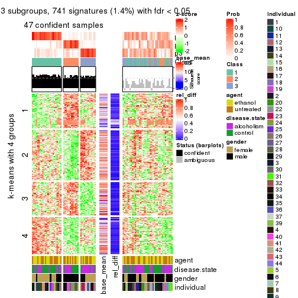</p>

</div>
<div id='tab-SD-pam-get-signatures-3'>
<pre><code class="r">get_signatures(res, k = 4)
</code></pre>

<p></p>

</div>
<div id='tab-SD-pam-get-signatures-4'>
<pre><code class="r">get_signatures(res, k = 5)
</code></pre>

<p></p>

</div>
<div id='tab-SD-pam-get-signatures-5'>
<pre><code class="r">get_signatures(res, k = 6)
</code></pre>

<p></p>

</div>
</div>


Signature heatmaps where rows are not scaled:


<script>
$( function() {
	$( '#tabs-SD-pam-get-signatures-no-scale' ).tabs();
} );
</script>
<div id='tabs-SD-pam-get-signatures-no-scale'>
<ul>
<li><a href='#tab-SD-pam-get-signatures-no-scale-1'>k = 2</a></li>
<li><a href='#tab-SD-pam-get-signatures-no-scale-2'>k = 3</a></li>
<li><a href='#tab-SD-pam-get-signatures-no-scale-3'>k = 4</a></li>
<li><a href='#tab-SD-pam-get-signatures-no-scale-4'>k = 5</a></li>
<li><a href='#tab-SD-pam-get-signatures-no-scale-5'>k = 6</a></li>
</ul>
<div id='tab-SD-pam-get-signatures-no-scale-1'>
<pre><code class="r">get_signatures(res, k = 2, scale_rows = FALSE)
</code></pre>

<p></p>

</div>
<div id='tab-SD-pam-get-signatures-no-scale-2'>
<pre><code class="r">get_signatures(res, k = 3, scale_rows = FALSE)
</code></pre>

<p></p>

</div>
<div id='tab-SD-pam-get-signatures-no-scale-3'>
<pre><code class="r">get_signatures(res, k = 4, scale_rows = FALSE)
</code></pre>

<p></p>

</div>
<div id='tab-SD-pam-get-signatures-no-scale-4'>
<pre><code class="r">get_signatures(res, k = 5, scale_rows = FALSE)
</code></pre>

<p></p>

</div>
<div id='tab-SD-pam-get-signatures-no-scale-5'>
<pre><code class="r">get_signatures(res, k = 6, scale_rows = FALSE)
</code></pre>

<p></p>

</div>
</div>


Compare the overlap of signatures from different k:

```r
compare_signatures(res)
```


`get_signature()` returns a data frame invisibly. TO get the list of signatures, the function
call should be assigned to a variable explicitly. In following code, if `plot` argument is set
to `FALSE`, no heatmap is plotted while only the differential analysis is performed.

```r
# code only for demonstration
tb = get_signature(res, k = ..., plot = FALSE)
```

An example of the output of `tb` is:

```
#>   which_row         fdr    mean_1    mean_2 scaled_mean_1 scaled_mean_2 km
#> 1        38 0.042760348  8.373488  9.131774    -0.5533452     0.5164555  1
#> 2        40 0.018707592  7.106213  8.469186    -0.6173731     0.5762149  1
#> 3        55 0.019134737 10.221463 11.207825    -0.6159697     0.5749050  1
#> 4        59 0.006059896  5.921854  7.869574    -0.6899429     0.6439467  1
#> 5        60 0.018055526  8.928898 10.211722    -0.6204761     0.5791110  1
#> 6        98 0.009384629 15.714769 14.887706     0.6635654    -0.6193277  2
...
```

The columns in `tb` are:

1. `which_row`: row indices corresponding to the input matrix.
2. `fdr`: FDR for the differential test. 
3. `mean_x`: The mean value in group x.
4. `scaled_mean_x`: The mean value in group x after rows are scaled.
5. `km`: Row groups if k-means clustering is applied to rows.


UMAP plot which shows how samples are separated.


<script>
$( function() {
	$( '#tabs-SD-pam-dimension-reduction' ).tabs();
} );
</script>
<div id='tabs-SD-pam-dimension-reduction'>
<ul>
<li><a href='#tab-SD-pam-dimension-reduction-1'>k = 2</a></li>
<li><a href='#tab-SD-pam-dimension-reduction-2'>k = 3</a></li>
<li><a href='#tab-SD-pam-dimension-reduction-3'>k = 4</a></li>
<li><a href='#tab-SD-pam-dimension-reduction-4'>k = 5</a></li>
<li><a href='#tab-SD-pam-dimension-reduction-5'>k = 6</a></li>
</ul>
<div id='tab-SD-pam-dimension-reduction-1'>
<pre><code class="r">dimension_reduction(res, k = 2, method = &quot;UMAP&quot;)
</code></pre>

<p></p>

</div>
<div id='tab-SD-pam-dimension-reduction-2'>
<pre><code class="r">dimension_reduction(res, k = 3, method = &quot;UMAP&quot;)
</code></pre>

<p></p>

</div>
<div id='tab-SD-pam-dimension-reduction-3'>
<pre><code class="r">dimension_reduction(res, k = 4, method = &quot;UMAP&quot;)
</code></pre>

<p></p>

</div>
<div id='tab-SD-pam-dimension-reduction-4'>
<pre><code class="r">dimension_reduction(res, k = 5, method = &quot;UMAP&quot;)
</code></pre>

<p></p>

</div>
<div id='tab-SD-pam-dimension-reduction-5'>
<pre><code class="r">dimension_reduction(res, k = 6, method = &quot;UMAP&quot;)
</code></pre>

<p></p>

</div>
</div>


Following heatmap shows how subgroups are split when increasing `k`:

```r
collect_classes(res)
```


Test correlation between subgroups and known annotations. If the known
annotation is numeric, one-way ANOVA test is applied, and if the known
annotation is discrete, chi-squared contingency table test is applied.

```r
test_to_known_factors(res)
```

```
#>         n agent(p) disease.state(p) gender(p) individual(p) k
#> SD:pam  0       NA               NA        NA            NA 2
#> SD:pam 47    0.989           0.1107  9.72e-05       0.01066 3
#> SD:pam 33    1.000           0.0932  8.53e-01       0.09428 4
#> SD:pam 30    0.993           0.0481  4.15e-03       0.00217 5
#> SD:pam 28    0.977           0.0287  2.88e-02       0.00195 6
```


If matrix rows can be associated to genes, consider to use `GO_Enrichment(res,
...)` to perform function enrichment for the signature genes.


 

---------------------------------------------------


### SD:mclust


The object with results only for a single top-value method and a single partition method 
can be extracted as:

```r
res = res_list["SD", "mclust"]
# you can also extract it by
# res = res_list["SD:mclust"]
```

A summary of `res` and all the functions that can be applied to it:

```r
res
```

```
#> A 'ConsensusPartition' object with k = 2, 3, 4, 5, 6.
#>   On a matrix with 51941 rows and 84 columns.
#>   Top rows (1000, 2000, 3000, 4000, 5000) are extracted by 'SD' method.
#>   Subgroups are detected by 'mclust' method.
#>   Performed in total 1250 partitions by row resampling.
#>   Best k for subgroups seems to be 3.
#> 
#> Following methods can be applied to this 'ConsensusPartition' object:
#>  [1] "cola_report"             "collect_classes"         "collect_plots"          
#>  [4] "collect_stats"           "colnames"                "compare_signatures"     
#>  [7] "consensus_heatmap"       "dimension_reduction"     "functional_enrichment"  
#> [10] "get_anno_col"            "get_anno"                "get_classes"            
#> [13] "get_consensus"           "get_matrix"              "get_membership"         
#> [16] "get_param"               "get_signatures"          "get_stats"              
#> [19] "is_best_k"               "is_stable_k"             "membership_heatmap"     
#> [22] "ncol"                    "nrow"                    "plot_ecdf"              
#> [25] "rownames"                "select_partition_number" "show"                   
#> [28] "suggest_best_k"          "test_to_known_factors"
```

`collect_plots()` function collects all the plots made from `res` for all `k` (number of partitions)
into one single page to provide an easy and fast comparison between different `k`.

```r
collect_plots(res)
```


The plots are:

- The first row: a plot of the ECDF (Empirical cumulative distribution
  function) curves of the consensus matrix for each `k` and the heatmap of
  predicted classes for each `k`.
- The second row: heatmaps of the consensus matrix for each `k`.
- The third row: heatmaps of the membership matrix for each `k`.
- The fouth row: heatmaps of the signatures for each `k`.

All the plots in panels can be made by individual functions and they are
plotted later in this section.

`select_partition_number()` produces several plots showing different
statistics for choosing "optimized" `k`. There are following statistics:

- ECDF curves of the consensus matrix for each `k`;
- 1-PAC. [The PAC
  score](https://en.wikipedia.org/wiki/Consensus_clustering#Over-interpretation_potential_of_consensus_clustering)
  measures the proportion of the ambiguous subgrouping.
- Mean silhouette score.
- Concordance. The mean probability of fiting the consensus class ids in all
  partitions.
- Area increased. Denote $A_k$ as the area under the ECDF curve for current
  `k`, the area increased is defined as $A_k - A_{k-1}$.
- Rand index. The percent of pairs of samples that are both in a same cluster
  or both are not in a same cluster in the partition of k and k-1.
- Jaccard index. The ratio of pairs of samples are both in a same cluster in
  the partition of k and k-1 and the pairs of samples are both in a same
  cluster in the partition k or k-1.

The detailed explanations of these statistics can be found in [the cola
vignette](http://bioconductor.org/packages/devel/bioc/vignettes/cola/inst/doc/cola.html#toc_13).

Generally speaking, lower PAC score, higher mean silhouette score or higher
concordance corresponds to better partition. Rand index and Jaccard index
measure how similar the current partition is compared to partition with `k-1`.
If they are too similar, we won't accept `k` is better than `k-1`.

```r
select_partition_number(res)
```


The numeric values for all these statistics can be obtained by `get_stats()`.

```r
get_stats(res)
```

```
#>   k 1-PAC mean_silhouette concordance area_increased  Rand Jaccard
#> 2 2 0.295           0.867       0.803         0.3692 0.504   0.504
#> 3 3 0.265           0.795       0.819         0.5548 0.884   0.773
#> 4 4 0.449           0.669       0.741         0.2210 0.865   0.671
#> 5 5 0.527           0.685       0.733         0.0859 0.816   0.462
#> 6 6 0.677           0.671       0.796         0.0658 0.934   0.707
```

`suggest_best_k()` suggests the best $k$ based on these statistics. The rules are as follows:

- All $k$ with Jaccard index larger than 0.95 are removed because the increase of
  the partition number does not provides enough extra information. If all $k$ are removed,
  the best $k$ is assigned by `NA`.
- For $k$ with 1-PAC larger than 0.9, the maximal $k$ is taken as the "best k". Other $k$ is called "optional k".
- If it does not fit the second rule. The $k$ with the highest vote of highest
  1-PAC, mean silhouette and concordance is taken as the "best k".

```r
suggest_best_k(res)
```

```
#> [1] 3
```


Following shows the table of the partitions (You need to click the **show/hide
code output** link to see it). The membership matrix (columns with name `p*`)
is inferred by
[`clue::cl_consensus()`](https://www.rdocumentation.org/link/cl_consensus?package=clue)
function with the `SE` method. Basically the value in the membership matrix
represents the probability to belong to a certain group. The finall class
label for an item is determined with the group with highest probability it
belongs to.

In `get_classes()` function, the entropy is calculated from the membership
matrix and the silhouette score is calculated from the consensus matrix.


<script>
$( function() {
	$( '#tabs-SD-mclust-get-classes' ).tabs();
} );
</script>
<div id='tabs-SD-mclust-get-classes'>
<ul>
<li><a href='#tab-SD-mclust-get-classes-1'>k = 2</a></li>
<li><a href='#tab-SD-mclust-get-classes-2'>k = 3</a></li>
<li><a href='#tab-SD-mclust-get-classes-3'>k = 4</a></li>
<li><a href='#tab-SD-mclust-get-classes-4'>k = 5</a></li>
<li><a href='#tab-SD-mclust-get-classes-5'>k = 6</a></li>
</ul>

<div id='tab-SD-mclust-get-classes-1'>
<p><a id='tab-SD-mclust-get-classes-1-a' style='color:#0366d6' href='#'>show/hide code output</a></p>
<pre><code class="r">cbind(get_classes(res, k = 2), get_membership(res, k = 2))
</code></pre>

<pre><code>#&gt;            class entropy silhouette    p1    p2
#&gt; GSM1269647     1   0.876      0.916 0.704 0.296
#&gt; GSM1269655     1   0.866      0.915 0.712 0.288
#&gt; GSM1269663     1   0.866      0.917 0.712 0.288
#&gt; GSM1269671     1   0.876      0.916 0.704 0.296
#&gt; GSM1269679     1   0.671      0.837 0.824 0.176
#&gt; GSM1269693     1   0.866      0.914 0.712 0.288
#&gt; GSM1269701     1   0.781      0.887 0.768 0.232
#&gt; GSM1269709     1   0.886      0.916 0.696 0.304
#&gt; GSM1269715     1   0.881      0.916 0.700 0.300
#&gt; GSM1269717     1   0.881      0.916 0.700 0.300
#&gt; GSM1269721     1   0.767      0.861 0.776 0.224
#&gt; GSM1269723     1   0.689      0.844 0.816 0.184
#&gt; GSM1269645     2   0.494      0.881 0.108 0.892
#&gt; GSM1269653     2   0.595      0.881 0.144 0.856
#&gt; GSM1269661     2   0.738      0.828 0.208 0.792
#&gt; GSM1269669     2   0.634      0.871 0.160 0.840
#&gt; GSM1269677     2   0.913      0.755 0.328 0.672
#&gt; GSM1269685     2   0.278      0.862 0.048 0.952
#&gt; GSM1269691     2   0.163      0.847 0.024 0.976
#&gt; GSM1269699     2   0.615      0.878 0.152 0.848
#&gt; GSM1269707     2   0.625      0.875 0.156 0.844
#&gt; GSM1269651     1   0.563      0.744 0.868 0.132
#&gt; GSM1269659     1   0.644      0.712 0.836 0.164
#&gt; GSM1269667     1   0.738      0.867 0.792 0.208
#&gt; GSM1269675     1   0.881      0.916 0.700 0.300
#&gt; GSM1269683     1   0.876      0.916 0.704 0.296
#&gt; GSM1269689     1   0.881      0.916 0.700 0.300
#&gt; GSM1269697     1   0.876      0.916 0.704 0.296
#&gt; GSM1269705     1   0.881      0.916 0.700 0.300
#&gt; GSM1269713     1   0.871      0.917 0.708 0.292
#&gt; GSM1269719     1   0.866      0.917 0.712 0.288
#&gt; GSM1269725     1   0.827      0.903 0.740 0.260
#&gt; GSM1269727     1   0.671      0.835 0.824 0.176
#&gt; GSM1269649     2   0.634      0.866 0.160 0.840
#&gt; GSM1269657     2   0.753      0.859 0.216 0.784
#&gt; GSM1269665     2   0.541      0.875 0.124 0.876
#&gt; GSM1269673     2   0.163      0.847 0.024 0.976
#&gt; GSM1269681     2   0.980      0.660 0.416 0.584
#&gt; GSM1269687     2   0.204      0.853 0.032 0.968
#&gt; GSM1269695     2   0.552      0.883 0.128 0.872
#&gt; GSM1269703     2   0.163      0.847 0.024 0.976
#&gt; GSM1269711     2   0.552      0.883 0.128 0.872
#&gt; GSM1269646     1   0.876      0.916 0.704 0.296
#&gt; GSM1269654     1   0.866      0.917 0.712 0.288
#&gt; GSM1269662     1   0.871      0.916 0.708 0.292
#&gt; GSM1269670     1   0.876      0.916 0.704 0.296
#&gt; GSM1269678     1   0.653      0.828 0.832 0.168
#&gt; GSM1269692     1   0.866      0.914 0.712 0.288
#&gt; GSM1269700     1   0.775      0.884 0.772 0.228
#&gt; GSM1269708     1   0.886      0.916 0.696 0.304
#&gt; GSM1269714     1   0.881      0.916 0.700 0.300
#&gt; GSM1269716     1   0.881      0.916 0.700 0.300
#&gt; GSM1269720     1   0.671      0.804 0.824 0.176
#&gt; GSM1269722     1   0.662      0.830 0.828 0.172
#&gt; GSM1269644     2   0.469      0.882 0.100 0.900
#&gt; GSM1269652     2   0.584      0.882 0.140 0.860
#&gt; GSM1269660     2   0.839      0.715 0.268 0.732
#&gt; GSM1269668     2   0.634      0.871 0.160 0.840
#&gt; GSM1269676     2   0.913      0.755 0.328 0.672
#&gt; GSM1269684     2   0.163      0.847 0.024 0.976
#&gt; GSM1269690     2   0.260      0.862 0.044 0.956
#&gt; GSM1269698     2   0.625      0.875 0.156 0.844
#&gt; GSM1269706     2   0.615      0.878 0.152 0.848
#&gt; GSM1269650     1   0.563      0.744 0.868 0.132
#&gt; GSM1269658     1   0.644      0.712 0.836 0.164
#&gt; GSM1269666     1   0.706      0.850 0.808 0.192
#&gt; GSM1269674     1   0.881      0.916 0.700 0.300
#&gt; GSM1269682     1   0.881      0.916 0.700 0.300
#&gt; GSM1269688     1   0.881      0.916 0.700 0.300
#&gt; GSM1269696     1   0.876      0.916 0.704 0.296
#&gt; GSM1269704     1   0.881      0.916 0.700 0.300
#&gt; GSM1269712     1   0.662      0.833 0.828 0.172
#&gt; GSM1269718     1   0.866      0.917 0.712 0.288
#&gt; GSM1269724     1   0.714      0.858 0.804 0.196
#&gt; GSM1269726     1   0.767      0.880 0.776 0.224
#&gt; GSM1269648     2   0.605      0.876 0.148 0.852
#&gt; GSM1269656     2   0.644      0.872 0.164 0.836
#&gt; GSM1269664     2   0.563      0.879 0.132 0.868
#&gt; GSM1269672     2   0.163      0.847 0.024 0.976
#&gt; GSM1269680     2   0.936      0.740 0.352 0.648
#&gt; GSM1269686     2   0.224      0.857 0.036 0.964
#&gt; GSM1269694     2   0.552      0.883 0.128 0.872
#&gt; GSM1269702     2   0.278      0.864 0.048 0.952
#&gt; GSM1269710     2   0.552      0.883 0.128 0.872
</code></pre>

<script>
$('#tab-SD-mclust-get-classes-1-a').parent().next().next().hide();
$('#tab-SD-mclust-get-classes-1-a').click(function(){
  $('#tab-SD-mclust-get-classes-1-a').parent().next().next().toggle();
  return(false);
});
</script>
</div>

<div id='tab-SD-mclust-get-classes-2'>
<p><a id='tab-SD-mclust-get-classes-2-a' style='color:#0366d6' href='#'>show/hide code output</a></p>
<pre><code class="r">cbind(get_classes(res, k = 3), get_membership(res, k = 3))
</code></pre>

<pre><code>#&gt;            class entropy silhouette    p1    p2    p3
#&gt; GSM1269647     3   0.419      0.823 0.064 0.060 0.876
#&gt; GSM1269655     3   0.300      0.855 0.068 0.016 0.916
#&gt; GSM1269663     3   0.651      0.785 0.072 0.180 0.748
#&gt; GSM1269671     3   0.473      0.810 0.088 0.060 0.852
#&gt; GSM1269679     3   0.249      0.848 0.016 0.048 0.936
#&gt; GSM1269693     3   0.701      0.745 0.080 0.208 0.712
#&gt; GSM1269701     3   0.314      0.853 0.020 0.068 0.912
#&gt; GSM1269709     3   0.425      0.849 0.080 0.048 0.872
#&gt; GSM1269715     3   0.654      0.776 0.084 0.164 0.752
#&gt; GSM1269717     3   0.646      0.779 0.080 0.164 0.756
#&gt; GSM1269721     2   0.725      0.568 0.056 0.656 0.288
#&gt; GSM1269723     3   0.249      0.852 0.016 0.048 0.936
#&gt; GSM1269645     1   0.569      0.771 0.756 0.020 0.224
#&gt; GSM1269653     1   0.463      0.795 0.856 0.056 0.088
#&gt; GSM1269661     1   0.731      0.665 0.616 0.044 0.340
#&gt; GSM1269669     1   0.634      0.810 0.736 0.044 0.220
#&gt; GSM1269677     2   0.639      0.746 0.184 0.752 0.064
#&gt; GSM1269685     1   0.466      0.826 0.852 0.048 0.100
#&gt; GSM1269691     1   0.425      0.826 0.864 0.028 0.108
#&gt; GSM1269699     1   0.541      0.782 0.820 0.076 0.104
#&gt; GSM1269707     1   0.475      0.801 0.852 0.068 0.080
#&gt; GSM1269651     2   0.586      0.780 0.024 0.748 0.228
#&gt; GSM1269659     2   0.437      0.802 0.032 0.860 0.108
#&gt; GSM1269667     3   0.223      0.852 0.012 0.044 0.944
#&gt; GSM1269675     3   0.315      0.847 0.044 0.040 0.916
#&gt; GSM1269683     3   0.594      0.800 0.072 0.140 0.788
#&gt; GSM1269689     3   0.415      0.827 0.080 0.044 0.876
#&gt; GSM1269697     3   0.346      0.837 0.060 0.036 0.904
#&gt; GSM1269705     3   0.274      0.855 0.052 0.020 0.928
#&gt; GSM1269713     3   0.227      0.853 0.040 0.016 0.944
#&gt; GSM1269719     3   0.600      0.810 0.072 0.144 0.784
#&gt; GSM1269725     3   0.244      0.855 0.032 0.028 0.940
#&gt; GSM1269727     3   0.290      0.853 0.016 0.064 0.920
#&gt; GSM1269649     1   0.641      0.770 0.716 0.036 0.248
#&gt; GSM1269657     1   0.826      0.374 0.556 0.356 0.088
#&gt; GSM1269665     1   0.588      0.739 0.728 0.016 0.256
#&gt; GSM1269673     1   0.435      0.831 0.852 0.020 0.128
#&gt; GSM1269681     2   0.635      0.773 0.156 0.764 0.080
#&gt; GSM1269687     1   0.474      0.825 0.828 0.020 0.152
#&gt; GSM1269695     1   0.448      0.777 0.864 0.064 0.072
#&gt; GSM1269703     1   0.421      0.825 0.860 0.020 0.120
#&gt; GSM1269711     1   0.438      0.772 0.868 0.064 0.068
#&gt; GSM1269646     3   0.419      0.823 0.064 0.060 0.876
#&gt; GSM1269654     3   0.353      0.853 0.068 0.032 0.900
#&gt; GSM1269662     3   0.702      0.746 0.072 0.224 0.704
#&gt; GSM1269670     3   0.456      0.815 0.080 0.060 0.860
#&gt; GSM1269678     3   0.270      0.847 0.016 0.056 0.928
#&gt; GSM1269692     3   0.719      0.726 0.080 0.224 0.696
#&gt; GSM1269700     3   0.280      0.854 0.016 0.060 0.924
#&gt; GSM1269708     3   0.446      0.844 0.080 0.056 0.864
#&gt; GSM1269714     3   0.635      0.784 0.080 0.156 0.764
#&gt; GSM1269716     3   0.646      0.779 0.080 0.164 0.756
#&gt; GSM1269720     2   0.626      0.722 0.032 0.724 0.244
#&gt; GSM1269722     3   0.270      0.847 0.016 0.056 0.928
#&gt; GSM1269644     1   0.509      0.825 0.824 0.040 0.136
#&gt; GSM1269652     1   0.447      0.781 0.864 0.060 0.076
#&gt; GSM1269660     1   0.798      0.415 0.500 0.060 0.440
#&gt; GSM1269668     1   0.640      0.803 0.724 0.040 0.236
#&gt; GSM1269676     2   0.639      0.746 0.184 0.752 0.064
#&gt; GSM1269684     1   0.392      0.829 0.872 0.016 0.112
#&gt; GSM1269690     1   0.453      0.826 0.856 0.040 0.104
#&gt; GSM1269698     1   0.533      0.786 0.824 0.076 0.100
#&gt; GSM1269706     1   0.475      0.797 0.852 0.068 0.080
#&gt; GSM1269650     2   0.582      0.783 0.024 0.752 0.224
#&gt; GSM1269658     2   0.437      0.802 0.032 0.860 0.108
#&gt; GSM1269666     3   0.212      0.851 0.012 0.040 0.948
#&gt; GSM1269674     3   0.338      0.856 0.048 0.044 0.908
#&gt; GSM1269682     3   0.591      0.801 0.068 0.144 0.788
#&gt; GSM1269688     3   0.397      0.828 0.088 0.032 0.880
#&gt; GSM1269696     3   0.409      0.826 0.068 0.052 0.880
#&gt; GSM1269704     3   0.298      0.854 0.056 0.024 0.920
#&gt; GSM1269712     3   0.212      0.850 0.012 0.040 0.948
#&gt; GSM1269718     3   0.559      0.817 0.068 0.124 0.808
#&gt; GSM1269724     3   0.175      0.856 0.012 0.028 0.960
#&gt; GSM1269726     3   0.412      0.846 0.024 0.108 0.868
#&gt; GSM1269648     1   0.539      0.817 0.808 0.044 0.148
#&gt; GSM1269656     1   0.618      0.804 0.780 0.104 0.116
#&gt; GSM1269664     1   0.603      0.752 0.732 0.024 0.244
#&gt; GSM1269672     1   0.421      0.830 0.856 0.016 0.128
#&gt; GSM1269680     2   0.628      0.754 0.176 0.760 0.064
#&gt; GSM1269686     1   0.445      0.827 0.836 0.012 0.152
#&gt; GSM1269694     1   0.474      0.786 0.852 0.064 0.084
#&gt; GSM1269702     1   0.445      0.826 0.860 0.040 0.100
#&gt; GSM1269710     1   0.456      0.780 0.860 0.064 0.076
</code></pre>

<script>
$('#tab-SD-mclust-get-classes-2-a').parent().next().next().hide();
$('#tab-SD-mclust-get-classes-2-a').click(function(){
  $('#tab-SD-mclust-get-classes-2-a').parent().next().next().toggle();
  return(false);
});
</script>
</div>

<div id='tab-SD-mclust-get-classes-3'>
<p><a id='tab-SD-mclust-get-classes-3-a' style='color:#0366d6' href='#'>show/hide code output</a></p>
<pre><code class="r">cbind(get_classes(res, k = 4), get_membership(res, k = 4))
</code></pre>

<pre><code>#&gt;            class entropy silhouette    p1    p2    p3    p4
#&gt; GSM1269647     3  0.2673      0.770 0.048 0.016 0.916 0.020
#&gt; GSM1269655     2  0.5512      0.127 0.000 0.496 0.488 0.016
#&gt; GSM1269663     2  0.4004      0.797 0.000 0.812 0.164 0.024
#&gt; GSM1269671     3  0.4217      0.736 0.112 0.024 0.836 0.028
#&gt; GSM1269679     3  0.3545      0.732 0.000 0.164 0.828 0.008
#&gt; GSM1269693     2  0.3172      0.796 0.004 0.872 0.112 0.012
#&gt; GSM1269701     3  0.5345      0.391 0.004 0.404 0.584 0.008
#&gt; GSM1269709     3  0.7086      0.542 0.112 0.308 0.568 0.012
#&gt; GSM1269715     2  0.3249      0.816 0.008 0.852 0.140 0.000
#&gt; GSM1269717     2  0.3052      0.817 0.004 0.860 0.136 0.000
#&gt; GSM1269721     2  0.7269     -0.203 0.000 0.456 0.148 0.396
#&gt; GSM1269723     3  0.4049      0.693 0.000 0.212 0.780 0.008
#&gt; GSM1269645     1  0.7258      0.676 0.544 0.352 0.052 0.052
#&gt; GSM1269653     1  0.2238      0.650 0.920 0.004 0.004 0.072
#&gt; GSM1269661     1  0.9250      0.544 0.448 0.216 0.204 0.132
#&gt; GSM1269669     1  0.6925      0.703 0.660 0.164 0.144 0.032
#&gt; GSM1269677     4  0.1820      0.745 0.036 0.020 0.000 0.944
#&gt; GSM1269685     1  0.6262      0.754 0.636 0.296 0.016 0.052
#&gt; GSM1269691     1  0.6355      0.751 0.628 0.300 0.016 0.056
#&gt; GSM1269699     1  0.2831      0.615 0.876 0.004 0.000 0.120
#&gt; GSM1269707     1  0.2075      0.677 0.936 0.016 0.004 0.044
#&gt; GSM1269651     4  0.6240      0.656 0.000 0.156 0.176 0.668
#&gt; GSM1269659     4  0.4897      0.606 0.000 0.332 0.008 0.660
#&gt; GSM1269667     3  0.3300      0.759 0.000 0.144 0.848 0.008
#&gt; GSM1269675     3  0.3385      0.778 0.048 0.056 0.884 0.012
#&gt; GSM1269683     2  0.3444      0.805 0.000 0.816 0.184 0.000
#&gt; GSM1269689     3  0.3769      0.746 0.096 0.020 0.860 0.024
#&gt; GSM1269697     3  0.3290      0.772 0.068 0.024 0.888 0.020
#&gt; GSM1269705     3  0.3656      0.778 0.040 0.080 0.868 0.012
#&gt; GSM1269713     3  0.1721      0.782 0.012 0.028 0.952 0.008
#&gt; GSM1269719     2  0.3351      0.797 0.000 0.844 0.148 0.008
#&gt; GSM1269725     3  0.1585      0.782 0.004 0.040 0.952 0.004
#&gt; GSM1269727     3  0.5070      0.381 0.000 0.372 0.620 0.008
#&gt; GSM1269649     1  0.5285      0.635 0.760 0.040 0.176 0.024
#&gt; GSM1269657     4  0.6674      0.141 0.316 0.096 0.004 0.584
#&gt; GSM1269665     1  0.7499      0.665 0.532 0.348 0.068 0.052
#&gt; GSM1269673     1  0.6080      0.756 0.660 0.272 0.012 0.056
#&gt; GSM1269681     4  0.2261      0.745 0.036 0.024 0.008 0.932
#&gt; GSM1269687     1  0.6467      0.746 0.612 0.316 0.020 0.052
#&gt; GSM1269695     1  0.0804      0.682 0.980 0.000 0.012 0.008
#&gt; GSM1269703     1  0.6457      0.749 0.624 0.300 0.020 0.056
#&gt; GSM1269711     1  0.0672      0.681 0.984 0.000 0.008 0.008
#&gt; GSM1269646     3  0.2786      0.771 0.048 0.020 0.912 0.020
#&gt; GSM1269654     2  0.5150      0.438 0.000 0.596 0.396 0.008
#&gt; GSM1269662     2  0.4037      0.779 0.000 0.824 0.136 0.040
#&gt; GSM1269670     3  0.3601      0.746 0.100 0.012 0.864 0.024
#&gt; GSM1269678     3  0.3852      0.710 0.000 0.192 0.800 0.008
#&gt; GSM1269692     2  0.3450      0.784 0.004 0.864 0.108 0.024
#&gt; GSM1269700     3  0.5349      0.460 0.008 0.364 0.620 0.008
#&gt; GSM1269708     3  0.6330      0.535 0.056 0.344 0.592 0.008
#&gt; GSM1269714     2  0.3257      0.817 0.004 0.844 0.152 0.000
#&gt; GSM1269716     2  0.3052      0.817 0.004 0.860 0.136 0.000
#&gt; GSM1269720     4  0.7290      0.457 0.000 0.328 0.168 0.504
#&gt; GSM1269722     3  0.4228      0.684 0.000 0.232 0.760 0.008
#&gt; GSM1269644     1  0.6769      0.723 0.588 0.324 0.020 0.068
#&gt; GSM1269652     1  0.1389      0.661 0.952 0.000 0.000 0.048
#&gt; GSM1269660     1  0.9533      0.327 0.340 0.328 0.200 0.132
#&gt; GSM1269668     1  0.7369      0.690 0.624 0.180 0.156 0.040
#&gt; GSM1269676     4  0.1820      0.745 0.036 0.020 0.000 0.944
#&gt; GSM1269684     1  0.6355      0.750 0.628 0.300 0.016 0.056
#&gt; GSM1269690     1  0.6333      0.753 0.632 0.296 0.016 0.056
#&gt; GSM1269698     1  0.2888      0.611 0.872 0.004 0.000 0.124
#&gt; GSM1269706     1  0.2125      0.671 0.932 0.012 0.004 0.052
#&gt; GSM1269650     4  0.6240      0.656 0.000 0.156 0.176 0.668
#&gt; GSM1269658     4  0.4999      0.607 0.000 0.328 0.012 0.660
#&gt; GSM1269666     3  0.3450      0.744 0.000 0.156 0.836 0.008
#&gt; GSM1269674     3  0.3845      0.737 0.016 0.132 0.840 0.012
#&gt; GSM1269682     2  0.3402      0.817 0.000 0.832 0.164 0.004
#&gt; GSM1269688     3  0.4664      0.738 0.116 0.056 0.812 0.016
#&gt; GSM1269696     3  0.3161      0.775 0.056 0.028 0.896 0.020
#&gt; GSM1269704     3  0.3790      0.770 0.040 0.096 0.856 0.008
#&gt; GSM1269712     3  0.3933      0.711 0.000 0.200 0.792 0.008
#&gt; GSM1269718     2  0.3529      0.782 0.000 0.836 0.152 0.012
#&gt; GSM1269724     3  0.1978      0.777 0.000 0.068 0.928 0.004
#&gt; GSM1269726     2  0.5212      0.224 0.000 0.572 0.420 0.008
#&gt; GSM1269648     1  0.2497      0.692 0.924 0.016 0.040 0.020
#&gt; GSM1269656     1  0.7720      0.654 0.512 0.284 0.012 0.192
#&gt; GSM1269664     1  0.7325      0.681 0.540 0.352 0.056 0.052
#&gt; GSM1269672     1  0.6082      0.755 0.652 0.284 0.012 0.052
#&gt; GSM1269680     4  0.1913      0.745 0.040 0.020 0.000 0.940
#&gt; GSM1269686     1  0.6436      0.752 0.628 0.296 0.020 0.056
#&gt; GSM1269694     1  0.0672      0.681 0.984 0.000 0.008 0.008
#&gt; GSM1269702     1  0.6217      0.755 0.644 0.288 0.016 0.052
#&gt; GSM1269710     1  0.0524      0.680 0.988 0.000 0.004 0.008
</code></pre>

<script>
$('#tab-SD-mclust-get-classes-3-a').parent().next().next().hide();
$('#tab-SD-mclust-get-classes-3-a').click(function(){
  $('#tab-SD-mclust-get-classes-3-a').parent().next().next().toggle();
  return(false);
});
</script>
</div>

<div id='tab-SD-mclust-get-classes-4'>
<p><a id='tab-SD-mclust-get-classes-4-a' style='color:#0366d6' href='#'>show/hide code output</a></p>
<pre><code class="r">cbind(get_classes(res, k = 5), get_membership(res, k = 5))
</code></pre>

<pre><code>#&gt;            class entropy silhouette    p1    p2    p3    p4    p5
#&gt; GSM1269647     3   0.157     0.8409 0.000 0.000 0.936 0.060 0.004
#&gt; GSM1269655     4   0.683     0.6642 0.164 0.076 0.148 0.608 0.004
#&gt; GSM1269663     4   0.641     0.6509 0.180 0.120 0.048 0.644 0.008
#&gt; GSM1269671     3   0.186     0.8015 0.000 0.016 0.932 0.004 0.048
#&gt; GSM1269679     4   0.586     0.5310 0.108 0.004 0.276 0.608 0.004
#&gt; GSM1269693     4   0.545     0.5478 0.100 0.148 0.008 0.720 0.024
#&gt; GSM1269701     4   0.587     0.5699 0.144 0.000 0.240 0.612 0.004
#&gt; GSM1269709     4   0.754     0.4788 0.116 0.008 0.264 0.512 0.100
#&gt; GSM1269715     4   0.498     0.5766 0.096 0.112 0.004 0.760 0.028
#&gt; GSM1269717     4   0.502     0.5732 0.096 0.116 0.004 0.756 0.028
#&gt; GSM1269721     2   0.611     0.5828 0.128 0.612 0.012 0.244 0.004
#&gt; GSM1269723     4   0.528     0.5583 0.076 0.004 0.268 0.652 0.000
#&gt; GSM1269645     1   0.351     0.6848 0.828 0.008 0.012 0.144 0.008
#&gt; GSM1269653     5   0.199     0.9342 0.076 0.004 0.004 0.000 0.916
#&gt; GSM1269661     1   0.765     0.4354 0.536 0.032 0.080 0.244 0.108
#&gt; GSM1269669     1   0.711     0.4557 0.556 0.012 0.040 0.220 0.172
#&gt; GSM1269677     2   0.348     0.7839 0.076 0.836 0.000 0.000 0.088
#&gt; GSM1269685     1   0.185     0.7224 0.912 0.000 0.000 0.000 0.088
#&gt; GSM1269691     1   0.218     0.7153 0.896 0.000 0.000 0.004 0.100
#&gt; GSM1269699     5   0.193     0.9308 0.072 0.004 0.004 0.000 0.920
#&gt; GSM1269707     5   0.218     0.9386 0.100 0.004 0.000 0.000 0.896
#&gt; GSM1269651     2   0.260     0.8049 0.008 0.904 0.040 0.044 0.004
#&gt; GSM1269659     2   0.336     0.7613 0.012 0.816 0.000 0.168 0.004
#&gt; GSM1269667     4   0.600     0.4971 0.108 0.004 0.308 0.576 0.004
#&gt; GSM1269675     3   0.199     0.8402 0.004 0.000 0.916 0.076 0.004
#&gt; GSM1269683     4   0.583     0.6425 0.092 0.100 0.064 0.724 0.020
#&gt; GSM1269689     3   0.242     0.8120 0.000 0.016 0.912 0.036 0.036
#&gt; GSM1269697     3   0.265     0.8330 0.000 0.000 0.884 0.084 0.032
#&gt; GSM1269705     3   0.365     0.7836 0.028 0.000 0.808 0.160 0.004
#&gt; GSM1269713     3   0.281     0.7990 0.000 0.000 0.844 0.152 0.004
#&gt; GSM1269719     4   0.647     0.6579 0.212 0.084 0.064 0.632 0.008
#&gt; GSM1269725     3   0.343     0.7583 0.000 0.000 0.776 0.220 0.004
#&gt; GSM1269727     4   0.514     0.6305 0.124 0.004 0.168 0.704 0.000
#&gt; GSM1269649     5   0.689     0.5713 0.120 0.004 0.200 0.080 0.596
#&gt; GSM1269657     1   0.683    -0.0425 0.440 0.396 0.000 0.028 0.136
#&gt; GSM1269665     1   0.367     0.6619 0.808 0.004 0.020 0.164 0.004
#&gt; GSM1269673     1   0.244     0.7000 0.876 0.000 0.000 0.004 0.120
#&gt; GSM1269681     2   0.368     0.7837 0.072 0.828 0.000 0.004 0.096
#&gt; GSM1269687     1   0.301     0.7423 0.876 0.000 0.008 0.052 0.064
#&gt; GSM1269695     5   0.218     0.9381 0.112 0.000 0.000 0.000 0.888
#&gt; GSM1269703     1   0.163     0.7327 0.936 0.000 0.000 0.008 0.056
#&gt; GSM1269711     5   0.213     0.9393 0.108 0.000 0.000 0.000 0.892
#&gt; GSM1269646     3   0.170     0.8413 0.000 0.000 0.928 0.068 0.004
#&gt; GSM1269654     4   0.670     0.6711 0.164 0.080 0.128 0.624 0.004
#&gt; GSM1269662     4   0.674     0.6101 0.160 0.188 0.036 0.604 0.012
#&gt; GSM1269670     3   0.163     0.8041 0.000 0.016 0.944 0.004 0.036
#&gt; GSM1269678     4   0.577     0.5587 0.112 0.004 0.252 0.628 0.004
#&gt; GSM1269692     4   0.545     0.5478 0.100 0.148 0.008 0.720 0.024
#&gt; GSM1269700     4   0.572     0.5703 0.144 0.000 0.240 0.616 0.000
#&gt; GSM1269708     4   0.718     0.5582 0.128 0.008 0.216 0.568 0.080
#&gt; GSM1269714     4   0.498     0.5766 0.096 0.112 0.004 0.760 0.028
#&gt; GSM1269716     4   0.498     0.5766 0.096 0.112 0.004 0.760 0.028
#&gt; GSM1269720     2   0.607     0.6321 0.108 0.644 0.028 0.216 0.004
#&gt; GSM1269722     4   0.519     0.5453 0.068 0.004 0.272 0.656 0.000
#&gt; GSM1269644     1   0.326     0.7165 0.860 0.024 0.004 0.100 0.012
#&gt; GSM1269652     5   0.212     0.9408 0.096 0.004 0.000 0.000 0.900
#&gt; GSM1269660     1   0.798     0.3485 0.508 0.036 0.124 0.240 0.092
#&gt; GSM1269668     1   0.707     0.4573 0.560 0.012 0.040 0.224 0.164
#&gt; GSM1269676     2   0.348     0.7839 0.076 0.836 0.000 0.000 0.088
#&gt; GSM1269684     1   0.236     0.7173 0.892 0.000 0.000 0.012 0.096
#&gt; GSM1269690     1   0.262     0.7131 0.876 0.008 0.000 0.004 0.112
#&gt; GSM1269698     5   0.186     0.9197 0.060 0.008 0.004 0.000 0.928
#&gt; GSM1269706     5   0.212     0.9383 0.096 0.004 0.000 0.000 0.900
#&gt; GSM1269650     2   0.260     0.8049 0.008 0.904 0.040 0.044 0.004
#&gt; GSM1269658     2   0.356     0.7585 0.020 0.808 0.000 0.168 0.004
#&gt; GSM1269666     4   0.587     0.5230 0.108 0.004 0.280 0.604 0.004
#&gt; GSM1269674     3   0.412     0.7340 0.032 0.004 0.776 0.184 0.004
#&gt; GSM1269682     4   0.611     0.6578 0.100 0.112 0.080 0.696 0.012
#&gt; GSM1269688     3   0.433     0.7493 0.004 0.016 0.796 0.060 0.124
#&gt; GSM1269696     3   0.219     0.8356 0.000 0.000 0.904 0.084 0.012
#&gt; GSM1269704     3   0.373     0.7844 0.028 0.004 0.812 0.152 0.004
#&gt; GSM1269712     4   0.520     0.3725 0.040 0.004 0.380 0.576 0.000
#&gt; GSM1269718     4   0.661     0.6711 0.196 0.068 0.100 0.628 0.008
#&gt; GSM1269724     3   0.449     0.4062 0.008 0.000 0.624 0.364 0.004
#&gt; GSM1269726     4   0.603     0.6552 0.168 0.028 0.156 0.648 0.000
#&gt; GSM1269648     5   0.338     0.9089 0.108 0.000 0.032 0.012 0.848
#&gt; GSM1269656     1   0.639     0.3591 0.560 0.288 0.000 0.020 0.132
#&gt; GSM1269664     1   0.420     0.6426 0.784 0.008 0.040 0.164 0.004
#&gt; GSM1269672     1   0.202     0.7196 0.900 0.000 0.000 0.000 0.100
#&gt; GSM1269680     2   0.353     0.7835 0.072 0.832 0.000 0.000 0.096
#&gt; GSM1269686     1   0.308     0.7420 0.872 0.000 0.008 0.060 0.060
#&gt; GSM1269694     5   0.218     0.9381 0.112 0.000 0.000 0.000 0.888
#&gt; GSM1269702     1   0.258     0.6853 0.864 0.000 0.000 0.004 0.132
#&gt; GSM1269710     5   0.213     0.9393 0.108 0.000 0.000 0.000 0.892
</code></pre>

<script>
$('#tab-SD-mclust-get-classes-4-a').parent().next().next().hide();
$('#tab-SD-mclust-get-classes-4-a').click(function(){
  $('#tab-SD-mclust-get-classes-4-a').parent().next().next().toggle();
  return(false);
});
</script>
</div>

<div id='tab-SD-mclust-get-classes-5'>
<p><a id='tab-SD-mclust-get-classes-5-a' style='color:#0366d6' href='#'>show/hide code output</a></p>
<pre><code class="r">cbind(get_classes(res, k = 6), get_membership(res, k = 6))
</code></pre>

<pre><code>#&gt;            class entropy silhouette    p1    p2    p3    p4    p5    p6
#&gt; GSM1269647     2  0.1970     0.8020 0.000 0.900 0.092 0.008 0.000 0.000
#&gt; GSM1269655     3  0.5930     0.2244 0.032 0.028 0.524 0.368 0.000 0.048
#&gt; GSM1269663     4  0.6192     0.2875 0.028 0.004 0.356 0.480 0.000 0.132
#&gt; GSM1269671     2  0.1053     0.7804 0.000 0.964 0.020 0.004 0.012 0.000
#&gt; GSM1269679     3  0.1528     0.7577 0.016 0.028 0.944 0.012 0.000 0.000
#&gt; GSM1269693     4  0.3176     0.6900 0.040 0.000 0.048 0.856 0.000 0.056
#&gt; GSM1269701     3  0.3520     0.7143 0.016 0.084 0.836 0.052 0.012 0.000
#&gt; GSM1269709     3  0.5190     0.6651 0.060 0.052 0.744 0.048 0.092 0.004
#&gt; GSM1269715     4  0.2344     0.7139 0.048 0.000 0.052 0.896 0.000 0.004
#&gt; GSM1269717     4  0.2550     0.7186 0.048 0.004 0.056 0.888 0.000 0.004
#&gt; GSM1269721     6  0.6407     0.5023 0.032 0.024 0.116 0.300 0.000 0.528
#&gt; GSM1269723     3  0.2016     0.7527 0.024 0.016 0.920 0.040 0.000 0.000
#&gt; GSM1269645     1  0.4652     0.6666 0.720 0.008 0.152 0.116 0.004 0.000
#&gt; GSM1269653     5  0.1003     0.9421 0.020 0.000 0.000 0.000 0.964 0.016
#&gt; GSM1269661     1  0.7485     0.3682 0.456 0.012 0.308 0.072 0.108 0.044
#&gt; GSM1269669     1  0.7013     0.4860 0.500 0.008 0.224 0.048 0.204 0.016
#&gt; GSM1269677     6  0.1059     0.7239 0.016 0.000 0.000 0.004 0.016 0.964
#&gt; GSM1269685     1  0.0790     0.7662 0.968 0.000 0.000 0.000 0.032 0.000
#&gt; GSM1269691     1  0.0363     0.7678 0.988 0.000 0.000 0.000 0.012 0.000
#&gt; GSM1269699     5  0.1148     0.9380 0.004 0.016 0.000 0.000 0.960 0.020
#&gt; GSM1269707     5  0.0909     0.9411 0.012 0.000 0.000 0.000 0.968 0.020
#&gt; GSM1269651     6  0.4066     0.7076 0.000 0.040 0.032 0.156 0.000 0.772
#&gt; GSM1269659     6  0.4748     0.5970 0.016 0.004 0.028 0.332 0.000 0.620
#&gt; GSM1269667     3  0.2521     0.7443 0.020 0.056 0.892 0.032 0.000 0.000
#&gt; GSM1269675     2  0.3625     0.7754 0.000 0.768 0.204 0.020 0.004 0.004
#&gt; GSM1269683     4  0.5803     0.2799 0.052 0.020 0.380 0.520 0.000 0.028
#&gt; GSM1269689     2  0.2760     0.7981 0.012 0.868 0.100 0.004 0.016 0.000
#&gt; GSM1269697     2  0.3081     0.8069 0.012 0.824 0.152 0.000 0.012 0.000
#&gt; GSM1269705     2  0.4874     0.6414 0.008 0.624 0.324 0.028 0.004 0.012
#&gt; GSM1269713     2  0.4317     0.6873 0.012 0.660 0.312 0.008 0.004 0.004
#&gt; GSM1269719     3  0.5724     0.2280 0.020 0.012 0.544 0.348 0.000 0.076
#&gt; GSM1269725     2  0.4203     0.6277 0.008 0.608 0.376 0.004 0.000 0.004
#&gt; GSM1269727     3  0.1649     0.7495 0.032 0.000 0.932 0.036 0.000 0.000
#&gt; GSM1269649     5  0.5408     0.6151 0.048 0.104 0.152 0.004 0.688 0.004
#&gt; GSM1269657     6  0.5506     0.3323 0.324 0.004 0.008 0.040 0.036 0.588
#&gt; GSM1269665     1  0.4819     0.6346 0.688 0.004 0.192 0.112 0.000 0.004
#&gt; GSM1269673     1  0.1049     0.7619 0.960 0.000 0.000 0.008 0.032 0.000
#&gt; GSM1269681     6  0.0862     0.7232 0.004 0.000 0.000 0.008 0.016 0.972
#&gt; GSM1269687     1  0.1686     0.7715 0.940 0.000 0.016 0.024 0.016 0.004
#&gt; GSM1269695     5  0.0547     0.9412 0.020 0.000 0.000 0.000 0.980 0.000
#&gt; GSM1269703     1  0.0405     0.7706 0.988 0.000 0.008 0.000 0.004 0.000
#&gt; GSM1269711     5  0.0458     0.9412 0.016 0.000 0.000 0.000 0.984 0.000
#&gt; GSM1269646     2  0.1956     0.8035 0.000 0.908 0.080 0.008 0.004 0.000
#&gt; GSM1269654     3  0.6154     0.1378 0.040 0.032 0.484 0.396 0.000 0.048
#&gt; GSM1269662     4  0.6368     0.3643 0.032 0.000 0.256 0.492 0.000 0.220
#&gt; GSM1269670     2  0.0964     0.7789 0.000 0.968 0.016 0.004 0.012 0.000
#&gt; GSM1269678     3  0.1346     0.7579 0.016 0.024 0.952 0.008 0.000 0.000
#&gt; GSM1269692     4  0.3110     0.6872 0.040 0.000 0.044 0.860 0.000 0.056
#&gt; GSM1269700     3  0.3469     0.7169 0.016 0.080 0.840 0.052 0.012 0.000
#&gt; GSM1269708     3  0.4422     0.6940 0.064 0.032 0.796 0.036 0.068 0.004
#&gt; GSM1269714     4  0.2662     0.7190 0.048 0.004 0.056 0.884 0.000 0.008
#&gt; GSM1269716     4  0.2550     0.7186 0.048 0.004 0.056 0.888 0.000 0.004
#&gt; GSM1269720     6  0.6271     0.5346 0.020 0.028 0.128 0.272 0.000 0.552
#&gt; GSM1269722     3  0.1536     0.7577 0.024 0.020 0.944 0.012 0.000 0.000
#&gt; GSM1269644     1  0.3209     0.7458 0.856 0.000 0.060 0.056 0.004 0.024
#&gt; GSM1269652     5  0.0725     0.9428 0.012 0.000 0.000 0.000 0.976 0.012
#&gt; GSM1269660     1  0.8003     0.2772 0.404 0.028 0.320 0.100 0.104 0.044
#&gt; GSM1269668     1  0.7028     0.4789 0.496 0.008 0.232 0.048 0.200 0.016
#&gt; GSM1269676     6  0.1059     0.7239 0.016 0.000 0.000 0.004 0.016 0.964
#&gt; GSM1269684     1  0.0363     0.7678 0.988 0.000 0.000 0.000 0.012 0.000
#&gt; GSM1269690     1  0.0547     0.7682 0.980 0.000 0.000 0.000 0.020 0.000
#&gt; GSM1269698     5  0.1313     0.9355 0.004 0.016 0.000 0.000 0.952 0.028
#&gt; GSM1269706     5  0.1003     0.9402 0.016 0.000 0.000 0.000 0.964 0.020
#&gt; GSM1269650     6  0.4066     0.7076 0.000 0.040 0.032 0.156 0.000 0.772
#&gt; GSM1269658     6  0.4634     0.5896 0.012 0.004 0.024 0.344 0.000 0.616
#&gt; GSM1269666     3  0.2421     0.7536 0.028 0.040 0.900 0.032 0.000 0.000
#&gt; GSM1269674     2  0.4890     0.6912 0.008 0.660 0.276 0.036 0.004 0.016
#&gt; GSM1269682     4  0.5668     0.4060 0.036 0.032 0.332 0.572 0.000 0.028
#&gt; GSM1269688     2  0.4553     0.7459 0.012 0.744 0.144 0.004 0.092 0.004
#&gt; GSM1269696     2  0.2841     0.8022 0.008 0.852 0.124 0.004 0.012 0.000
#&gt; GSM1269704     2  0.4598     0.6755 0.008 0.652 0.304 0.028 0.004 0.004
#&gt; GSM1269712     3  0.1692     0.7488 0.008 0.048 0.932 0.012 0.000 0.000
#&gt; GSM1269718     3  0.5484     0.3649 0.024 0.012 0.596 0.308 0.000 0.060
#&gt; GSM1269724     3  0.4109    -0.0407 0.008 0.392 0.596 0.000 0.000 0.004
#&gt; GSM1269726     3  0.3514     0.6919 0.032 0.004 0.812 0.140 0.000 0.012
#&gt; GSM1269648     5  0.2024     0.9035 0.028 0.016 0.036 0.000 0.920 0.000
#&gt; GSM1269656     1  0.6099     0.1721 0.492 0.004 0.000 0.048 0.084 0.372
#&gt; GSM1269664     1  0.5124     0.6442 0.692 0.016 0.184 0.096 0.004 0.008
#&gt; GSM1269672     1  0.0458     0.7676 0.984 0.000 0.000 0.000 0.016 0.000
#&gt; GSM1269680     6  0.0748     0.7234 0.004 0.000 0.000 0.004 0.016 0.976
#&gt; GSM1269686     1  0.2044     0.7665 0.920 0.000 0.040 0.028 0.008 0.004
#&gt; GSM1269694     5  0.0632     0.9404 0.024 0.000 0.000 0.000 0.976 0.000
#&gt; GSM1269702     1  0.1340     0.7601 0.948 0.000 0.000 0.008 0.040 0.004
#&gt; GSM1269710     5  0.0632     0.9404 0.024 0.000 0.000 0.000 0.976 0.000
</code></pre>

<script>
$('#tab-SD-mclust-get-classes-5-a').parent().next().next().hide();
$('#tab-SD-mclust-get-classes-5-a').click(function(){
  $('#tab-SD-mclust-get-classes-5-a').parent().next().next().toggle();
  return(false);
});
</script>
</div>
</div>

Heatmaps for the consensus matrix. It visualizes the probability of two
samples to be in a same group.


<script>
$( function() {
	$( '#tabs-SD-mclust-consensus-heatmap' ).tabs();
} );
</script>
<div id='tabs-SD-mclust-consensus-heatmap'>
<ul>
<li><a href='#tab-SD-mclust-consensus-heatmap-1'>k = 2</a></li>
<li><a href='#tab-SD-mclust-consensus-heatmap-2'>k = 3</a></li>
<li><a href='#tab-SD-mclust-consensus-heatmap-3'>k = 4</a></li>
<li><a href='#tab-SD-mclust-consensus-heatmap-4'>k = 5</a></li>
<li><a href='#tab-SD-mclust-consensus-heatmap-5'>k = 6</a></li>
</ul>
<div id='tab-SD-mclust-consensus-heatmap-1'>
<pre><code class="r">consensus_heatmap(res, k = 2)
</code></pre>

<p></p>

</div>
<div id='tab-SD-mclust-consensus-heatmap-2'>
<pre><code class="r">consensus_heatmap(res, k = 3)
</code></pre>

<p></p>

</div>
<div id='tab-SD-mclust-consensus-heatmap-3'>
<pre><code class="r">consensus_heatmap(res, k = 4)
</code></pre>

<p></p>

</div>
<div id='tab-SD-mclust-consensus-heatmap-4'>
<pre><code class="r">consensus_heatmap(res, k = 5)
</code></pre>

<p></p>

</div>
<div id='tab-SD-mclust-consensus-heatmap-5'>
<pre><code class="r">consensus_heatmap(res, k = 6)
</code></pre>

<p></p>

</div>
</div>

Heatmaps for the membership of samples in all partitions to see how consistent they are:


<script>
$( function() {
	$( '#tabs-SD-mclust-membership-heatmap' ).tabs();
} );
</script>
<div id='tabs-SD-mclust-membership-heatmap'>
<ul>
<li><a href='#tab-SD-mclust-membership-heatmap-1'>k = 2</a></li>
<li><a href='#tab-SD-mclust-membership-heatmap-2'>k = 3</a></li>
<li><a href='#tab-SD-mclust-membership-heatmap-3'>k = 4</a></li>
<li><a href='#tab-SD-mclust-membership-heatmap-4'>k = 5</a></li>
<li><a href='#tab-SD-mclust-membership-heatmap-5'>k = 6</a></li>
</ul>
<div id='tab-SD-mclust-membership-heatmap-1'>
<pre><code class="r">membership_heatmap(res, k = 2)
</code></pre>

<p></p>

</div>
<div id='tab-SD-mclust-membership-heatmap-2'>
<pre><code class="r">membership_heatmap(res, k = 3)
</code></pre>

<p></p>

</div>
<div id='tab-SD-mclust-membership-heatmap-3'>
<pre><code class="r">membership_heatmap(res, k = 4)
</code></pre>

<p></p>

</div>
<div id='tab-SD-mclust-membership-heatmap-4'>
<pre><code class="r">membership_heatmap(res, k = 5)
</code></pre>

<p></p>

</div>
<div id='tab-SD-mclust-membership-heatmap-5'>
<pre><code class="r">membership_heatmap(res, k = 6)
</code></pre>

<p></p>

</div>
</div>

As soon as we have had the classes for columns, we can look for signatures
which are significantly different between classes which can be candidate marks
for certain classes. Following are the heatmaps for signatures.


Signature heatmaps where rows are scaled:


<script>
$( function() {
	$( '#tabs-SD-mclust-get-signatures' ).tabs();
} );
</script>
<div id='tabs-SD-mclust-get-signatures'>
<ul>
<li><a href='#tab-SD-mclust-get-signatures-1'>k = 2</a></li>
<li><a href='#tab-SD-mclust-get-signatures-2'>k = 3</a></li>
<li><a href='#tab-SD-mclust-get-signatures-3'>k = 4</a></li>
<li><a href='#tab-SD-mclust-get-signatures-4'>k = 5</a></li>
<li><a href='#tab-SD-mclust-get-signatures-5'>k = 6</a></li>
</ul>
<div id='tab-SD-mclust-get-signatures-1'>
<pre><code class="r">get_signatures(res, k = 2)
</code></pre>

<p></p>

</div>
<div id='tab-SD-mclust-get-signatures-2'>
<pre><code class="r">get_signatures(res, k = 3)
</code></pre>

<p></p>

</div>
<div id='tab-SD-mclust-get-signatures-3'>
<pre><code class="r">get_signatures(res, k = 4)
</code></pre>

<p></p>

</div>
<div id='tab-SD-mclust-get-signatures-4'>
<pre><code class="r">get_signatures(res, k = 5)
</code></pre>

<p></p>

</div>
<div id='tab-SD-mclust-get-signatures-5'>
<pre><code class="r">get_signatures(res, k = 6)
</code></pre>

<p></p>

</div>
</div>


Signature heatmaps where rows are not scaled:


<script>
$( function() {
	$( '#tabs-SD-mclust-get-signatures-no-scale' ).tabs();
} );
</script>
<div id='tabs-SD-mclust-get-signatures-no-scale'>
<ul>
<li><a href='#tab-SD-mclust-get-signatures-no-scale-1'>k = 2</a></li>
<li><a href='#tab-SD-mclust-get-signatures-no-scale-2'>k = 3</a></li>
<li><a href='#tab-SD-mclust-get-signatures-no-scale-3'>k = 4</a></li>
<li><a href='#tab-SD-mclust-get-signatures-no-scale-4'>k = 5</a></li>
<li><a href='#tab-SD-mclust-get-signatures-no-scale-5'>k = 6</a></li>
</ul>
<div id='tab-SD-mclust-get-signatures-no-scale-1'>
<pre><code class="r">get_signatures(res, k = 2, scale_rows = FALSE)
</code></pre>

<p></p>

</div>
<div id='tab-SD-mclust-get-signatures-no-scale-2'>
<pre><code class="r">get_signatures(res, k = 3, scale_rows = FALSE)
</code></pre>

<p></p>

</div>
<div id='tab-SD-mclust-get-signatures-no-scale-3'>
<pre><code class="r">get_signatures(res, k = 4, scale_rows = FALSE)
</code></pre>

<p></p>

</div>
<div id='tab-SD-mclust-get-signatures-no-scale-4'>
<pre><code class="r">get_signatures(res, k = 5, scale_rows = FALSE)
</code></pre>

<p></p>

</div>
<div id='tab-SD-mclust-get-signatures-no-scale-5'>
<pre><code class="r">get_signatures(res, k = 6, scale_rows = FALSE)
</code></pre>

<p></p>

</div>
</div>


Compare the overlap of signatures from different k:

```r
compare_signatures(res)
```


`get_signature()` returns a data frame invisibly. TO get the list of signatures, the function
call should be assigned to a variable explicitly. In following code, if `plot` argument is set
to `FALSE`, no heatmap is plotted while only the differential analysis is performed.

```r
# code only for demonstration
tb = get_signature(res, k = ..., plot = FALSE)
```

An example of the output of `tb` is:

```
#>   which_row         fdr    mean_1    mean_2 scaled_mean_1 scaled_mean_2 km
#> 1        38 0.042760348  8.373488  9.131774    -0.5533452     0.5164555  1
#> 2        40 0.018707592  7.106213  8.469186    -0.6173731     0.5762149  1
#> 3        55 0.019134737 10.221463 11.207825    -0.6159697     0.5749050  1
#> 4        59 0.006059896  5.921854  7.869574    -0.6899429     0.6439467  1
#> 5        60 0.018055526  8.928898 10.211722    -0.6204761     0.5791110  1
#> 6        98 0.009384629 15.714769 14.887706     0.6635654    -0.6193277  2
...
```

The columns in `tb` are:

1. `which_row`: row indices corresponding to the input matrix.
2. `fdr`: FDR for the differential test. 
3. `mean_x`: The mean value in group x.
4. `scaled_mean_x`: The mean value in group x after rows are scaled.
5. `km`: Row groups if k-means clustering is applied to rows.


UMAP plot which shows how samples are separated.


<script>
$( function() {
	$( '#tabs-SD-mclust-dimension-reduction' ).tabs();
} );
</script>
<div id='tabs-SD-mclust-dimension-reduction'>
<ul>
<li><a href='#tab-SD-mclust-dimension-reduction-1'>k = 2</a></li>
<li><a href='#tab-SD-mclust-dimension-reduction-2'>k = 3</a></li>
<li><a href='#tab-SD-mclust-dimension-reduction-3'>k = 4</a></li>
<li><a href='#tab-SD-mclust-dimension-reduction-4'>k = 5</a></li>
<li><a href='#tab-SD-mclust-dimension-reduction-5'>k = 6</a></li>
</ul>
<div id='tab-SD-mclust-dimension-reduction-1'>
<pre><code class="r">dimension_reduction(res, k = 2, method = &quot;UMAP&quot;)
</code></pre>

<p></p>

</div>
<div id='tab-SD-mclust-dimension-reduction-2'>
<pre><code class="r">dimension_reduction(res, k = 3, method = &quot;UMAP&quot;)
</code></pre>

<p></p>

</div>
<div id='tab-SD-mclust-dimension-reduction-3'>
<pre><code class="r">dimension_reduction(res, k = 4, method = &quot;UMAP&quot;)
</code></pre>

<p></p>

</div>
<div id='tab-SD-mclust-dimension-reduction-4'>
<pre><code class="r">dimension_reduction(res, k = 5, method = &quot;UMAP&quot;)
</code></pre>

<p>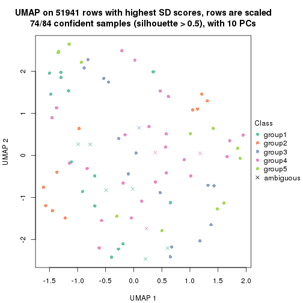</p>

</div>
<div id='tab-SD-mclust-dimension-reduction-5'>
<pre><code class="r">dimension_reduction(res, k = 6, method = &quot;UMAP&quot;)
</code></pre>

<p></p>

</div>
</div>


Following heatmap shows how subgroups are split when increasing `k`:

```r
collect_classes(res)
```


Test correlation between subgroups and known annotations. If the known
annotation is numeric, one-way ANOVA test is applied, and if the known
annotation is discrete, chi-squared contingency table test is applied.

```r
test_to_known_factors(res)
```

```
#>            n agent(p) disease.state(p) gender(p) individual(p) k
#> SD:mclust 84    1.000            1.000  3.81e-19      8.65e-05 2
#> SD:mclust 82    1.000            0.781  2.19e-16      2.04e-07 3
#> SD:mclust 74    1.000            0.284  3.15e-14      2.08e-09 4
#> SD:mclust 74    0.978            0.115  4.09e-13      2.52e-11 5
#> SD:mclust 69    0.997            0.077  1.75e-11      2.05e-13 6
```


If matrix rows can be associated to genes, consider to use `GO_Enrichment(res,
...)` to perform function enrichment for the signature genes.


 

---------------------------------------------------


### SD:NMF


The object with results only for a single top-value method and a single partition method 
can be extracted as:

```r
res = res_list["SD", "NMF"]
# you can also extract it by
# res = res_list["SD:NMF"]
```

A summary of `res` and all the functions that can be applied to it:

```r
res
```

```
#> A 'ConsensusPartition' object with k = 2, 3, 4, 5, 6.
#>   On a matrix with 51941 rows and 84 columns.
#>   Top rows (1000, 2000, 3000, 4000, 5000) are extracted by 'SD' method.
#>   Subgroups are detected by 'NMF' method.
#>   Performed in total 1250 partitions by row resampling.
#>   Best k for subgroups seems to be 2.
#> 
#> Following methods can be applied to this 'ConsensusPartition' object:
#>  [1] "cola_report"             "collect_classes"         "collect_plots"          
#>  [4] "collect_stats"           "colnames"                "compare_signatures"     
#>  [7] "consensus_heatmap"       "dimension_reduction"     "functional_enrichment"  
#> [10] "get_anno_col"            "get_anno"                "get_classes"            
#> [13] "get_consensus"           "get_matrix"              "get_membership"         
#> [16] "get_param"               "get_signatures"          "get_stats"              
#> [19] "is_best_k"               "is_stable_k"             "membership_heatmap"     
#> [22] "ncol"                    "nrow"                    "plot_ecdf"              
#> [25] "rownames"                "select_partition_number" "show"                   
#> [28] "suggest_best_k"          "test_to_known_factors"
```

`collect_plots()` function collects all the plots made from `res` for all `k` (number of partitions)
into one single page to provide an easy and fast comparison between different `k`.

```r
collect_plots(res)
```


The plots are:

- The first row: a plot of the ECDF (Empirical cumulative distribution
  function) curves of the consensus matrix for each `k` and the heatmap of
  predicted classes for each `k`.
- The second row: heatmaps of the consensus matrix for each `k`.
- The third row: heatmaps of the membership matrix for each `k`.
- The fouth row: heatmaps of the signatures for each `k`.

All the plots in panels can be made by individual functions and they are
plotted later in this section.

`select_partition_number()` produces several plots showing different
statistics for choosing "optimized" `k`. There are following statistics:

- ECDF curves of the consensus matrix for each `k`;
- 1-PAC. [The PAC
  score](https://en.wikipedia.org/wiki/Consensus_clustering#Over-interpretation_potential_of_consensus_clustering)
  measures the proportion of the ambiguous subgrouping.
- Mean silhouette score.
- Concordance. The mean probability of fiting the consensus class ids in all
  partitions.
- Area increased. Denote $A_k$ as the area under the ECDF curve for current
  `k`, the area increased is defined as $A_k - A_{k-1}$.
- Rand index. The percent of pairs of samples that are both in a same cluster
  or both are not in a same cluster in the partition of k and k-1.
- Jaccard index. The ratio of pairs of samples are both in a same cluster in
  the partition of k and k-1 and the pairs of samples are both in a same
  cluster in the partition k or k-1.

The detailed explanations of these statistics can be found in [the cola
vignette](http://bioconductor.org/packages/devel/bioc/vignettes/cola/inst/doc/cola.html#toc_13).

Generally speaking, lower PAC score, higher mean silhouette score or higher
concordance corresponds to better partition. Rand index and Jaccard index
measure how similar the current partition is compared to partition with `k-1`.
If they are too similar, we won't accept `k` is better than `k-1`.

```r
select_partition_number(res)
```


The numeric values for all these statistics can be obtained by `get_stats()`.

```r
get_stats(res)
```

```
#>   k 1-PAC mean_silhouette concordance area_increased  Rand Jaccard
#> 2 2 0.218           0.563       0.806         0.4909 0.504   0.504
#> 3 3 0.273           0.455       0.671         0.2873 0.742   0.566
#> 4 4 0.411           0.510       0.700         0.1431 0.783   0.527
#> 5 5 0.451           0.307       0.602         0.0825 0.972   0.905
#> 6 6 0.491           0.306       0.543         0.0504 0.834   0.468
```

`suggest_best_k()` suggests the best $k$ based on these statistics. The rules are as follows:

- All $k$ with Jaccard index larger than 0.95 are removed because the increase of
  the partition number does not provides enough extra information. If all $k$ are removed,
  the best $k$ is assigned by `NA`.
- For $k$ with 1-PAC larger than 0.9, the maximal $k$ is taken as the "best k". Other $k$ is called "optional k".
- If it does not fit the second rule. The $k$ with the highest vote of highest
  1-PAC, mean silhouette and concordance is taken as the "best k".

```r
suggest_best_k(res)
```

```
#> [1] 2
```


Following shows the table of the partitions (You need to click the **show/hide
code output** link to see it). The membership matrix (columns with name `p*`)
is inferred by
[`clue::cl_consensus()`](https://www.rdocumentation.org/link/cl_consensus?package=clue)
function with the `SE` method. Basically the value in the membership matrix
represents the probability to belong to a certain group. The finall class
label for an item is determined with the group with highest probability it
belongs to.

In `get_classes()` function, the entropy is calculated from the membership
matrix and the silhouette score is calculated from the consensus matrix.


<script>
$( function() {
	$( '#tabs-SD-NMF-get-classes' ).tabs();
} );
</script>
<div id='tabs-SD-NMF-get-classes'>
<ul>
<li><a href='#tab-SD-NMF-get-classes-1'>k = 2</a></li>
<li><a href='#tab-SD-NMF-get-classes-2'>k = 3</a></li>
<li><a href='#tab-SD-NMF-get-classes-3'>k = 4</a></li>
<li><a href='#tab-SD-NMF-get-classes-4'>k = 5</a></li>
<li><a href='#tab-SD-NMF-get-classes-5'>k = 6</a></li>
</ul>

<div id='tab-SD-NMF-get-classes-1'>
<p><a id='tab-SD-NMF-get-classes-1-a' style='color:#0366d6' href='#'>show/hide code output</a></p>
<pre><code class="r">cbind(get_classes(res, k = 2), get_membership(res, k = 2))
</code></pre>

<pre><code>#&gt;            class entropy silhouette    p1    p2
#&gt; GSM1269647     1  0.5629    0.71552 0.868 0.132
#&gt; GSM1269655     1  0.6712    0.65801 0.824 0.176
#&gt; GSM1269663     1  0.9963    0.11966 0.536 0.464
#&gt; GSM1269671     1  0.9580    0.32162 0.620 0.380
#&gt; GSM1269679     1  0.2603    0.75764 0.956 0.044
#&gt; GSM1269693     1  0.9896    0.21665 0.560 0.440
#&gt; GSM1269701     1  0.3431    0.74791 0.936 0.064
#&gt; GSM1269709     1  0.2043    0.75866 0.968 0.032
#&gt; GSM1269715     1  0.4431    0.74847 0.908 0.092
#&gt; GSM1269717     1  0.4939    0.73886 0.892 0.108
#&gt; GSM1269721     2  0.9522    0.28969 0.372 0.628
#&gt; GSM1269723     1  0.2423    0.74780 0.960 0.040
#&gt; GSM1269645     2  0.4022    0.72047 0.080 0.920
#&gt; GSM1269653     2  0.7950    0.61914 0.240 0.760
#&gt; GSM1269661     1  0.9977   -0.00822 0.528 0.472
#&gt; GSM1269669     1  0.9358    0.29676 0.648 0.352
#&gt; GSM1269677     2  0.2778    0.69876 0.048 0.952
#&gt; GSM1269685     2  0.2603    0.71992 0.044 0.956
#&gt; GSM1269691     2  0.3114    0.71987 0.056 0.944
#&gt; GSM1269699     2  0.5629    0.70399 0.132 0.868
#&gt; GSM1269707     2  0.3431    0.71873 0.064 0.936
#&gt; GSM1269651     2  0.9635    0.25214 0.388 0.612
#&gt; GSM1269659     2  0.9323    0.34338 0.348 0.652
#&gt; GSM1269667     1  0.2043    0.76052 0.968 0.032
#&gt; GSM1269675     1  0.7056    0.66259 0.808 0.192
#&gt; GSM1269683     1  0.3733    0.74958 0.928 0.072
#&gt; GSM1269689     1  0.3274    0.75405 0.940 0.060
#&gt; GSM1269697     1  0.2043    0.75853 0.968 0.032
#&gt; GSM1269705     1  0.5519    0.71988 0.872 0.128
#&gt; GSM1269713     1  0.2603    0.75737 0.956 0.044
#&gt; GSM1269719     1  1.0000    0.01894 0.504 0.496
#&gt; GSM1269725     1  0.2043    0.75864 0.968 0.032
#&gt; GSM1269727     1  0.2236    0.75754 0.964 0.036
#&gt; GSM1269649     1  1.0000   -0.08604 0.500 0.500
#&gt; GSM1269657     2  0.2236    0.70250 0.036 0.964
#&gt; GSM1269665     2  0.9491    0.39771 0.368 0.632
#&gt; GSM1269673     2  0.8499    0.58266 0.276 0.724
#&gt; GSM1269681     2  0.3879    0.69358 0.076 0.924
#&gt; GSM1269687     2  0.9248    0.47228 0.340 0.660
#&gt; GSM1269695     2  0.9087    0.49780 0.324 0.676
#&gt; GSM1269703     2  0.5178    0.70498 0.116 0.884
#&gt; GSM1269711     2  0.9963    0.15933 0.464 0.536
#&gt; GSM1269646     1  0.4562    0.73681 0.904 0.096
#&gt; GSM1269654     1  0.6801    0.65285 0.820 0.180
#&gt; GSM1269662     1  0.9866    0.20128 0.568 0.432
#&gt; GSM1269670     1  0.8081    0.59119 0.752 0.248
#&gt; GSM1269678     1  0.2948    0.75702 0.948 0.052
#&gt; GSM1269692     2  0.9996   -0.07127 0.488 0.512
#&gt; GSM1269700     1  0.3114    0.75202 0.944 0.056
#&gt; GSM1269708     1  0.2603    0.75730 0.956 0.044
#&gt; GSM1269714     1  0.3879    0.75116 0.924 0.076
#&gt; GSM1269716     1  0.5946    0.72075 0.856 0.144
#&gt; GSM1269720     2  0.9661    0.24891 0.392 0.608
#&gt; GSM1269722     1  0.0672    0.75868 0.992 0.008
#&gt; GSM1269644     2  0.2043    0.71545 0.032 0.968
#&gt; GSM1269652     2  0.8144    0.60610 0.252 0.748
#&gt; GSM1269660     1  0.9993   -0.04596 0.516 0.484
#&gt; GSM1269668     1  0.9209    0.33169 0.664 0.336
#&gt; GSM1269676     2  0.2948    0.69973 0.052 0.948
#&gt; GSM1269684     2  0.4815    0.70306 0.104 0.896
#&gt; GSM1269690     2  0.2423    0.71780 0.040 0.960
#&gt; GSM1269698     2  0.4815    0.71433 0.104 0.896
#&gt; GSM1269706     2  0.4022    0.71763 0.080 0.920
#&gt; GSM1269650     2  0.9491    0.29845 0.368 0.632
#&gt; GSM1269658     2  0.9286    0.35106 0.344 0.656
#&gt; GSM1269666     1  0.2236    0.75988 0.964 0.036
#&gt; GSM1269674     1  0.9129    0.46532 0.672 0.328
#&gt; GSM1269682     1  0.5629    0.72435 0.868 0.132
#&gt; GSM1269688     1  0.4161    0.74247 0.916 0.084
#&gt; GSM1269696     1  0.2423    0.75899 0.960 0.040
#&gt; GSM1269704     1  0.5519    0.71580 0.872 0.128
#&gt; GSM1269712     1  0.3114    0.75466 0.944 0.056
#&gt; GSM1269718     1  0.9491    0.35175 0.632 0.368
#&gt; GSM1269724     1  0.2236    0.75848 0.964 0.036
#&gt; GSM1269726     1  0.3114    0.75750 0.944 0.056
#&gt; GSM1269648     2  0.8267    0.59824 0.260 0.740
#&gt; GSM1269656     2  0.1184    0.71552 0.016 0.984
#&gt; GSM1269664     1  0.9922    0.10208 0.552 0.448
#&gt; GSM1269672     2  0.8443    0.58251 0.272 0.728
#&gt; GSM1269680     2  0.3431    0.69602 0.064 0.936
#&gt; GSM1269686     1  0.9933    0.08187 0.548 0.452
#&gt; GSM1269694     2  0.8499    0.57398 0.276 0.724
#&gt; GSM1269702     2  0.2603    0.71888 0.044 0.956
#&gt; GSM1269710     2  0.9710    0.33773 0.400 0.600
</code></pre>

<script>
$('#tab-SD-NMF-get-classes-1-a').parent().next().next().hide();
$('#tab-SD-NMF-get-classes-1-a').click(function(){
  $('#tab-SD-NMF-get-classes-1-a').parent().next().next().toggle();
  return(false);
});
</script>
</div>

<div id='tab-SD-NMF-get-classes-2'>
<p><a id='tab-SD-NMF-get-classes-2-a' style='color:#0366d6' href='#'>show/hide code output</a></p>
<pre><code class="r">cbind(get_classes(res, k = 3), get_membership(res, k = 3))
</code></pre>

<pre><code>#&gt;            class entropy silhouette    p1    p2    p3
#&gt; GSM1269647     1   0.686     0.5428 0.728 0.188 0.084
#&gt; GSM1269655     1   0.405     0.5197 0.848 0.004 0.148
#&gt; GSM1269663     1   0.654     0.3834 0.672 0.024 0.304
#&gt; GSM1269671     1   0.855     0.3685 0.568 0.312 0.120
#&gt; GSM1269679     1   0.468     0.5281 0.840 0.028 0.132
#&gt; GSM1269693     1   0.867    -0.0793 0.484 0.104 0.412
#&gt; GSM1269701     1   0.761     0.2844 0.644 0.076 0.280
#&gt; GSM1269709     1   0.672     0.5563 0.744 0.160 0.096
#&gt; GSM1269715     3   0.832     0.1550 0.428 0.080 0.492
#&gt; GSM1269717     3   0.828     0.1202 0.456 0.076 0.468
#&gt; GSM1269721     1   0.922    -0.0107 0.448 0.152 0.400
#&gt; GSM1269723     1   0.153     0.5724 0.964 0.004 0.032
#&gt; GSM1269645     2   0.651     0.6234 0.044 0.720 0.236
#&gt; GSM1269653     2   0.448     0.6474 0.068 0.864 0.068
#&gt; GSM1269661     2   0.734     0.4891 0.148 0.708 0.144
#&gt; GSM1269669     3   0.952     0.0676 0.188 0.396 0.416
#&gt; GSM1269677     2   0.613     0.4993 0.000 0.600 0.400
#&gt; GSM1269685     2   0.440     0.6620 0.000 0.812 0.188
#&gt; GSM1269691     2   0.562     0.6401 0.012 0.744 0.244
#&gt; GSM1269699     2   0.506     0.6439 0.064 0.836 0.100
#&gt; GSM1269707     2   0.343     0.6746 0.004 0.884 0.112
#&gt; GSM1269651     1   0.780     0.2253 0.552 0.056 0.392
#&gt; GSM1269659     3   0.977     0.1498 0.320 0.248 0.432
#&gt; GSM1269667     1   0.191     0.5829 0.956 0.016 0.028
#&gt; GSM1269675     1   0.686     0.5495 0.732 0.176 0.092
#&gt; GSM1269683     1   0.649     0.3854 0.740 0.060 0.200
#&gt; GSM1269689     1   0.791     0.4849 0.648 0.240 0.112
#&gt; GSM1269697     1   0.741     0.5216 0.692 0.204 0.104
#&gt; GSM1269705     1   0.564     0.5819 0.808 0.112 0.080
#&gt; GSM1269713     1   0.609     0.5702 0.784 0.124 0.092
#&gt; GSM1269719     1   0.775     0.3029 0.624 0.076 0.300
#&gt; GSM1269725     1   0.512     0.5852 0.832 0.108 0.060
#&gt; GSM1269727     1   0.313     0.5499 0.904 0.008 0.088
#&gt; GSM1269649     2   0.698     0.5027 0.132 0.732 0.136
#&gt; GSM1269657     2   0.595     0.5405 0.000 0.640 0.360
#&gt; GSM1269665     2   0.778     0.4779 0.208 0.668 0.124
#&gt; GSM1269673     2   0.269     0.6789 0.032 0.932 0.036
#&gt; GSM1269681     2   0.731     0.4613 0.032 0.552 0.416
#&gt; GSM1269687     2   0.666     0.5906 0.116 0.752 0.132
#&gt; GSM1269695     2   0.457     0.6249 0.068 0.860 0.072
#&gt; GSM1269703     2   0.570     0.6636 0.064 0.800 0.136
#&gt; GSM1269711     2   0.600     0.5604 0.084 0.788 0.128
#&gt; GSM1269646     1   0.654     0.5602 0.752 0.164 0.084
#&gt; GSM1269654     1   0.453     0.5042 0.824 0.008 0.168
#&gt; GSM1269662     1   0.606     0.4243 0.708 0.016 0.276
#&gt; GSM1269670     1   0.801     0.4413 0.624 0.276 0.100
#&gt; GSM1269678     1   0.551     0.4585 0.784 0.028 0.188
#&gt; GSM1269692     3   0.917     0.1406 0.372 0.152 0.476
#&gt; GSM1269700     1   0.704     0.3512 0.688 0.060 0.252
#&gt; GSM1269708     1   0.720     0.5283 0.712 0.180 0.108
#&gt; GSM1269714     1   0.813    -0.1975 0.488 0.068 0.444
#&gt; GSM1269716     1   0.828    -0.2408 0.464 0.076 0.460
#&gt; GSM1269720     1   0.910     0.0439 0.476 0.144 0.380
#&gt; GSM1269722     1   0.368     0.5704 0.892 0.028 0.080
#&gt; GSM1269644     2   0.559     0.6061 0.004 0.720 0.276
#&gt; GSM1269652     2   0.389     0.6504 0.064 0.888 0.048
#&gt; GSM1269660     2   0.815     0.4280 0.240 0.632 0.128
#&gt; GSM1269668     3   0.970     0.0790 0.216 0.388 0.396
#&gt; GSM1269676     2   0.634     0.4945 0.004 0.596 0.400
#&gt; GSM1269684     2   0.614     0.6373 0.040 0.748 0.212
#&gt; GSM1269690     2   0.548     0.6324 0.004 0.732 0.264
#&gt; GSM1269698     2   0.588     0.6348 0.064 0.788 0.148
#&gt; GSM1269706     2   0.437     0.6739 0.032 0.860 0.108
#&gt; GSM1269650     1   0.817     0.1609 0.512 0.072 0.416
#&gt; GSM1269658     3   0.982     0.1443 0.328 0.256 0.416
#&gt; GSM1269666     1   0.165     0.5752 0.960 0.004 0.036
#&gt; GSM1269674     1   0.688     0.5428 0.736 0.108 0.156
#&gt; GSM1269682     1   0.619     0.3968 0.744 0.040 0.216
#&gt; GSM1269688     1   0.832     0.4289 0.600 0.284 0.116
#&gt; GSM1269696     1   0.649     0.5480 0.744 0.192 0.064
#&gt; GSM1269704     1   0.603     0.5718 0.780 0.152 0.068
#&gt; GSM1269712     1   0.459     0.5595 0.856 0.048 0.096
#&gt; GSM1269718     1   0.671     0.4327 0.716 0.056 0.228
#&gt; GSM1269724     1   0.397     0.5788 0.884 0.044 0.072
#&gt; GSM1269726     1   0.462     0.5042 0.836 0.020 0.144
#&gt; GSM1269648     2   0.406     0.6394 0.076 0.880 0.044
#&gt; GSM1269656     2   0.568     0.5811 0.000 0.684 0.316
#&gt; GSM1269664     2   0.912     0.2737 0.236 0.548 0.216
#&gt; GSM1269672     2   0.357     0.6744 0.040 0.900 0.060
#&gt; GSM1269680     2   0.658     0.4796 0.008 0.572 0.420
#&gt; GSM1269686     2   0.849     0.3471 0.148 0.604 0.248
#&gt; GSM1269694     2   0.379     0.6458 0.060 0.892 0.048
#&gt; GSM1269702     2   0.406     0.6673 0.000 0.836 0.164
#&gt; GSM1269710     2   0.518     0.6040 0.084 0.832 0.084
</code></pre>

<script>
$('#tab-SD-NMF-get-classes-2-a').parent().next().next().hide();
$('#tab-SD-NMF-get-classes-2-a').click(function(){
  $('#tab-SD-NMF-get-classes-2-a').parent().next().next().toggle();
  return(false);
});
</script>
</div>

<div id='tab-SD-NMF-get-classes-3'>
<p><a id='tab-SD-NMF-get-classes-3-a' style='color:#0366d6' href='#'>show/hide code output</a></p>
<pre><code class="r">cbind(get_classes(res, k = 4), get_membership(res, k = 4))
</code></pre>

<pre><code>#&gt;            class entropy silhouette    p1    p2    p3    p4
#&gt; GSM1269647     3   0.373     0.7299 0.076 0.060 0.860 0.004
#&gt; GSM1269655     3   0.543     0.5822 0.000 0.216 0.716 0.068
#&gt; GSM1269663     2   0.672     0.1663 0.000 0.524 0.380 0.096
#&gt; GSM1269671     3   0.605     0.4808 0.384 0.028 0.576 0.012
#&gt; GSM1269679     3   0.604     0.6747 0.036 0.052 0.712 0.200
#&gt; GSM1269693     4   0.640     0.0527 0.000 0.464 0.064 0.472
#&gt; GSM1269701     3   0.707     0.4357 0.124 0.004 0.540 0.332
#&gt; GSM1269709     3   0.632     0.6681 0.272 0.052 0.652 0.024
#&gt; GSM1269715     4   0.316     0.5297 0.004 0.096 0.020 0.880
#&gt; GSM1269717     4   0.414     0.5256 0.004 0.144 0.032 0.820
#&gt; GSM1269721     2   0.468     0.4777 0.012 0.808 0.120 0.060
#&gt; GSM1269723     3   0.498     0.6725 0.008 0.136 0.784 0.072
#&gt; GSM1269645     1   0.714     0.5656 0.584 0.252 0.008 0.156
#&gt; GSM1269653     1   0.310     0.6805 0.892 0.044 0.060 0.004
#&gt; GSM1269661     1   0.653     0.6003 0.696 0.056 0.068 0.180
#&gt; GSM1269669     4   0.639     0.0972 0.384 0.004 0.060 0.552
#&gt; GSM1269677     2   0.380     0.4374 0.220 0.780 0.000 0.000
#&gt; GSM1269685     1   0.627     0.6257 0.648 0.240 0.000 0.112
#&gt; GSM1269691     1   0.718     0.5462 0.540 0.284 0.000 0.176
#&gt; GSM1269699     1   0.412     0.6134 0.836 0.044 0.112 0.008
#&gt; GSM1269707     1   0.428     0.6871 0.816 0.144 0.032 0.008
#&gt; GSM1269651     2   0.566     0.3747 0.008 0.632 0.336 0.024
#&gt; GSM1269659     2   0.286     0.5044 0.052 0.904 0.004 0.040
#&gt; GSM1269667     3   0.450     0.6977 0.004 0.068 0.812 0.116
#&gt; GSM1269675     3   0.450     0.7115 0.140 0.044 0.808 0.008
#&gt; GSM1269683     4   0.725     0.0895 0.004 0.148 0.316 0.532
#&gt; GSM1269689     3   0.461     0.6405 0.264 0.000 0.724 0.012
#&gt; GSM1269697     3   0.432     0.6684 0.228 0.000 0.760 0.012
#&gt; GSM1269705     3   0.447     0.7115 0.052 0.116 0.820 0.012
#&gt; GSM1269713     3   0.381     0.7069 0.156 0.000 0.824 0.020
#&gt; GSM1269719     2   0.649     0.2174 0.008 0.560 0.372 0.060
#&gt; GSM1269725     3   0.379     0.7269 0.108 0.008 0.852 0.032
#&gt; GSM1269727     3   0.615     0.6050 0.000 0.144 0.676 0.180
#&gt; GSM1269649     1   0.450     0.5746 0.808 0.008 0.140 0.044
#&gt; GSM1269657     2   0.438     0.3205 0.296 0.704 0.000 0.000
#&gt; GSM1269665     1   0.754     0.4546 0.536 0.104 0.032 0.328
#&gt; GSM1269673     1   0.521     0.6835 0.768 0.144 0.008 0.080
#&gt; GSM1269681     2   0.617     0.3131 0.308 0.628 0.056 0.008
#&gt; GSM1269687     1   0.662     0.5701 0.604 0.124 0.000 0.272
#&gt; GSM1269695     1   0.236     0.6732 0.928 0.008 0.036 0.028
#&gt; GSM1269703     1   0.714     0.5719 0.576 0.176 0.004 0.244
#&gt; GSM1269711     1   0.328     0.6125 0.872 0.004 0.104 0.020
#&gt; GSM1269646     3   0.265     0.7188 0.036 0.040 0.916 0.008
#&gt; GSM1269654     3   0.662     0.4543 0.000 0.272 0.604 0.124
#&gt; GSM1269662     2   0.667     0.2522 0.004 0.540 0.376 0.080
#&gt; GSM1269670     3   0.571     0.5857 0.300 0.024 0.660 0.016
#&gt; GSM1269678     3   0.679     0.5728 0.024 0.076 0.616 0.284
#&gt; GSM1269692     2   0.540     0.1626 0.000 0.628 0.024 0.348
#&gt; GSM1269700     3   0.647     0.5522 0.080 0.008 0.620 0.292
#&gt; GSM1269708     3   0.719     0.6647 0.256 0.076 0.616 0.052
#&gt; GSM1269714     4   0.444     0.5247 0.004 0.140 0.048 0.808
#&gt; GSM1269716     4   0.386     0.5272 0.000 0.144 0.028 0.828
#&gt; GSM1269720     2   0.476     0.4773 0.012 0.796 0.144 0.048
#&gt; GSM1269722     3   0.593     0.6836 0.028 0.108 0.740 0.124
#&gt; GSM1269644     1   0.678     0.4618 0.532 0.376 0.004 0.088
#&gt; GSM1269652     1   0.288     0.6852 0.908 0.028 0.048 0.016
#&gt; GSM1269660     1   0.744     0.4990 0.612 0.052 0.108 0.228
#&gt; GSM1269668     4   0.592     0.2757 0.300 0.004 0.052 0.644
#&gt; GSM1269676     2   0.398     0.4172 0.240 0.760 0.000 0.000
#&gt; GSM1269684     1   0.736     0.5066 0.520 0.204 0.000 0.276
#&gt; GSM1269690     1   0.757     0.4693 0.476 0.300 0.000 0.224
#&gt; GSM1269698     1   0.426     0.6143 0.828 0.048 0.116 0.008
#&gt; GSM1269706     1   0.367     0.6924 0.864 0.092 0.032 0.012
#&gt; GSM1269650     2   0.498     0.4299 0.008 0.708 0.272 0.012
#&gt; GSM1269658     2   0.276     0.5008 0.036 0.908 0.004 0.052
#&gt; GSM1269666     3   0.496     0.6670 0.000 0.116 0.776 0.108
#&gt; GSM1269674     3   0.390     0.6889 0.024 0.120 0.844 0.012
#&gt; GSM1269682     4   0.747     0.2308 0.000 0.228 0.268 0.504
#&gt; GSM1269688     3   0.519     0.5335 0.372 0.000 0.616 0.012
#&gt; GSM1269696     3   0.373     0.6999 0.164 0.004 0.824 0.008
#&gt; GSM1269704     3   0.454     0.7296 0.104 0.072 0.816 0.008
#&gt; GSM1269712     3   0.560     0.7113 0.052 0.056 0.768 0.124
#&gt; GSM1269718     3   0.700     0.3362 0.024 0.360 0.548 0.068
#&gt; GSM1269724     3   0.414     0.7270 0.052 0.020 0.848 0.080
#&gt; GSM1269726     3   0.750     0.3987 0.016 0.128 0.512 0.344
#&gt; GSM1269648     1   0.259     0.6928 0.920 0.036 0.032 0.012
#&gt; GSM1269656     2   0.583    -0.1878 0.440 0.528 0.000 0.032
#&gt; GSM1269664     4   0.728    -0.2215 0.444 0.048 0.048 0.460
#&gt; GSM1269672     1   0.599     0.6529 0.692 0.156 0.000 0.152
#&gt; GSM1269680     2   0.514     0.3393 0.296 0.680 0.024 0.000
#&gt; GSM1269686     4   0.639    -0.1447 0.404 0.068 0.000 0.528
#&gt; GSM1269694     1   0.263     0.6938 0.920 0.036 0.024 0.020
#&gt; GSM1269702     1   0.555     0.6225 0.680 0.268 0.000 0.052
#&gt; GSM1269710     1   0.310     0.6377 0.888 0.008 0.084 0.020
</code></pre>

<script>
$('#tab-SD-NMF-get-classes-3-a').parent().next().next().hide();
$('#tab-SD-NMF-get-classes-3-a').click(function(){
  $('#tab-SD-NMF-get-classes-3-a').parent().next().next().toggle();
  return(false);
});
</script>
</div>

<div id='tab-SD-NMF-get-classes-4'>
<p><a id='tab-SD-NMF-get-classes-4-a' style='color:#0366d6' href='#'>show/hide code output</a></p>
<pre><code class="r">cbind(get_classes(res, k = 5), get_membership(res, k = 5))
</code></pre>

<pre><code>#&gt;            class entropy silhouette    p1    p2    p3    p4    p5
#&gt; GSM1269647     3   0.351     0.3713 0.016 0.020 0.832 0.000 0.132
#&gt; GSM1269655     3   0.650     0.4129 0.008 0.208 0.632 0.084 0.068
#&gt; GSM1269663     2   0.632     0.3744 0.000 0.636 0.200 0.068 0.096
#&gt; GSM1269671     3   0.708    -0.5373 0.184 0.028 0.444 0.000 0.344
#&gt; GSM1269679     3   0.543     0.4259 0.004 0.024 0.692 0.216 0.064
#&gt; GSM1269693     2   0.766     0.0716 0.008 0.448 0.052 0.292 0.200
#&gt; GSM1269701     3   0.707     0.0318 0.040 0.000 0.492 0.300 0.168
#&gt; GSM1269709     3   0.658    -0.0560 0.052 0.028 0.568 0.036 0.316
#&gt; GSM1269715     4   0.708     0.3840 0.012 0.164 0.068 0.592 0.164
#&gt; GSM1269717     4   0.401     0.4967 0.004 0.076 0.040 0.832 0.048
#&gt; GSM1269721     2   0.697     0.3289 0.008 0.516 0.100 0.048 0.328
#&gt; GSM1269723     3   0.561     0.4559 0.000 0.096 0.716 0.072 0.116
#&gt; GSM1269645     1   0.687     0.4077 0.588 0.196 0.000 0.136 0.080
#&gt; GSM1269653     1   0.548     0.4284 0.616 0.008 0.068 0.000 0.308
#&gt; GSM1269661     1   0.575     0.4220 0.664 0.004 0.052 0.236 0.044
#&gt; GSM1269669     4   0.495     0.3022 0.264 0.000 0.016 0.684 0.036
#&gt; GSM1269677     2   0.661     0.3043 0.280 0.508 0.000 0.008 0.204
#&gt; GSM1269685     1   0.641     0.4808 0.624 0.096 0.000 0.068 0.212
#&gt; GSM1269691     1   0.711     0.4332 0.576 0.128 0.000 0.164 0.132
#&gt; GSM1269699     1   0.568     0.3065 0.564 0.004 0.080 0.000 0.352
#&gt; GSM1269707     1   0.563     0.3946 0.504 0.028 0.020 0.004 0.444
#&gt; GSM1269651     2   0.536     0.3841 0.016 0.664 0.256 0.000 0.064
#&gt; GSM1269659     2   0.491     0.4598 0.056 0.736 0.004 0.016 0.188
#&gt; GSM1269667     3   0.575     0.4344 0.028 0.036 0.720 0.144 0.072
#&gt; GSM1269675     3   0.640     0.1609 0.060 0.080 0.620 0.004 0.236
#&gt; GSM1269683     4   0.681     0.3841 0.012 0.112 0.208 0.608 0.060
#&gt; GSM1269689     3   0.610    -0.5373 0.100 0.008 0.560 0.004 0.328
#&gt; GSM1269697     3   0.369     0.2861 0.036 0.000 0.812 0.004 0.148
#&gt; GSM1269705     3   0.391     0.4511 0.004 0.056 0.820 0.008 0.112
#&gt; GSM1269713     3   0.365     0.3014 0.016 0.004 0.820 0.012 0.148
#&gt; GSM1269719     2   0.651     0.3700 0.064 0.620 0.248 0.028 0.040
#&gt; GSM1269725     3   0.286     0.4171 0.004 0.004 0.880 0.024 0.088
#&gt; GSM1269727     3   0.845     0.2113 0.008 0.188 0.404 0.176 0.224
#&gt; GSM1269649     1   0.606     0.4728 0.652 0.012 0.076 0.032 0.228
#&gt; GSM1269657     2   0.655     0.1883 0.368 0.452 0.000 0.004 0.176
#&gt; GSM1269665     1   0.718     0.1357 0.472 0.092 0.008 0.364 0.064
#&gt; GSM1269673     1   0.404     0.5388 0.808 0.028 0.000 0.132 0.032
#&gt; GSM1269681     2   0.680     0.3032 0.316 0.524 0.048 0.000 0.112
#&gt; GSM1269687     1   0.510     0.3788 0.636 0.024 0.000 0.320 0.020
#&gt; GSM1269695     1   0.391     0.5495 0.772 0.000 0.008 0.016 0.204
#&gt; GSM1269703     1   0.553     0.4101 0.652 0.076 0.000 0.256 0.016
#&gt; GSM1269711     1   0.531     0.3705 0.624 0.000 0.064 0.004 0.308
#&gt; GSM1269646     3   0.327     0.4169 0.004 0.036 0.848 0.000 0.112
#&gt; GSM1269654     3   0.663     0.3912 0.004 0.248 0.596 0.080 0.072
#&gt; GSM1269662     2   0.578     0.4303 0.004 0.680 0.200 0.040 0.076
#&gt; GSM1269670     3   0.683    -0.3891 0.164 0.028 0.512 0.000 0.296
#&gt; GSM1269678     3   0.611     0.4006 0.004 0.036 0.640 0.228 0.092
#&gt; GSM1269692     2   0.728     0.2435 0.028 0.548 0.032 0.232 0.160
#&gt; GSM1269700     3   0.650     0.1965 0.028 0.000 0.560 0.284 0.128
#&gt; GSM1269708     3   0.709    -0.0294 0.040 0.052 0.524 0.052 0.332
#&gt; GSM1269714     4   0.762     0.3112 0.000 0.180 0.112 0.500 0.208
#&gt; GSM1269716     4   0.578     0.4639 0.008 0.136 0.068 0.712 0.076
#&gt; GSM1269720     2   0.656     0.3658 0.008 0.548 0.112 0.020 0.312
#&gt; GSM1269722     3   0.662     0.4108 0.016 0.116 0.656 0.088 0.124
#&gt; GSM1269644     1   0.647     0.3957 0.600 0.224 0.000 0.136 0.040
#&gt; GSM1269652     1   0.556     0.4159 0.568 0.004 0.056 0.004 0.368
#&gt; GSM1269660     1   0.755     0.2254 0.516 0.040 0.064 0.296 0.084
#&gt; GSM1269668     4   0.542     0.2858 0.268 0.000 0.024 0.656 0.052
#&gt; GSM1269676     2   0.639     0.2995 0.304 0.500 0.000 0.000 0.196
#&gt; GSM1269684     1   0.681     0.2704 0.488 0.064 0.000 0.368 0.080
#&gt; GSM1269690     1   0.762     0.3521 0.508 0.140 0.000 0.204 0.148
#&gt; GSM1269698     1   0.548     0.3488 0.580 0.004 0.064 0.000 0.352
#&gt; GSM1269706     1   0.564     0.3602 0.488 0.028 0.028 0.000 0.456
#&gt; GSM1269650     2   0.529     0.4116 0.020 0.680 0.240 0.000 0.060
#&gt; GSM1269658     2   0.394     0.4780 0.052 0.812 0.000 0.012 0.124
#&gt; GSM1269666     3   0.538     0.4707 0.004 0.052 0.732 0.144 0.068
#&gt; GSM1269674     3   0.621     0.3151 0.024 0.140 0.632 0.004 0.200
#&gt; GSM1269682     4   0.677     0.3103 0.000 0.200 0.140 0.592 0.068
#&gt; GSM1269688     5   0.675     0.0000 0.156 0.016 0.404 0.000 0.424
#&gt; GSM1269696     3   0.356     0.3578 0.020 0.012 0.832 0.004 0.132
#&gt; GSM1269704     3   0.400     0.4036 0.020 0.028 0.800 0.000 0.152
#&gt; GSM1269712     3   0.481     0.4341 0.004 0.020 0.768 0.104 0.104
#&gt; GSM1269718     3   0.817     0.0403 0.068 0.384 0.392 0.084 0.072
#&gt; GSM1269724     3   0.378     0.4585 0.004 0.012 0.836 0.064 0.084
#&gt; GSM1269726     3   0.896     0.0983 0.024 0.180 0.332 0.236 0.228
#&gt; GSM1269648     1   0.322     0.5767 0.852 0.004 0.036 0.000 0.108
#&gt; GSM1269656     1   0.692     0.1011 0.476 0.280 0.000 0.016 0.228
#&gt; GSM1269664     4   0.617    -0.0491 0.420 0.040 0.012 0.500 0.028
#&gt; GSM1269672     1   0.460     0.5280 0.764 0.028 0.000 0.164 0.044
#&gt; GSM1269680     2   0.590     0.3413 0.304 0.584 0.008 0.000 0.104
#&gt; GSM1269686     4   0.531    -0.1351 0.452 0.012 0.004 0.512 0.020
#&gt; GSM1269694     1   0.348     0.5699 0.812 0.000 0.008 0.012 0.168
#&gt; GSM1269702     1   0.489     0.5358 0.768 0.088 0.000 0.048 0.096
#&gt; GSM1269710     1   0.468     0.4663 0.696 0.000 0.040 0.004 0.260
</code></pre>

<script>
$('#tab-SD-NMF-get-classes-4-a').parent().next().next().hide();
$('#tab-SD-NMF-get-classes-4-a').click(function(){
  $('#tab-SD-NMF-get-classes-4-a').parent().next().next().toggle();
  return(false);
});
</script>
</div>

<div id='tab-SD-NMF-get-classes-5'>
<p><a id='tab-SD-NMF-get-classes-5-a' style='color:#0366d6' href='#'>show/hide code output</a></p>
<pre><code class="r">cbind(get_classes(res, k = 6), get_membership(res, k = 6))
</code></pre>

<pre><code>#&gt;            class entropy silhouette    p1    p2    p3    p4    p5    p6
#&gt; GSM1269647     3   0.434     0.4908 0.028 0.228 0.720 0.016 0.000 0.008
#&gt; GSM1269655     3   0.724     0.1988 0.004 0.244 0.516 0.100 0.048 0.088
#&gt; GSM1269663     4   0.779     0.1948 0.016 0.240 0.116 0.456 0.028 0.144
#&gt; GSM1269671     2   0.685     0.2350 0.308 0.408 0.244 0.032 0.004 0.004
#&gt; GSM1269679     3   0.496     0.5604 0.020 0.040 0.740 0.088 0.112 0.000
#&gt; GSM1269693     4   0.576     0.5199 0.000 0.012 0.052 0.652 0.176 0.108
#&gt; GSM1269701     3   0.702     0.3936 0.120 0.092 0.560 0.052 0.176 0.000
#&gt; GSM1269709     3   0.639     0.4860 0.068 0.132 0.648 0.104 0.020 0.028
#&gt; GSM1269715     4   0.584     0.1511 0.008 0.008 0.076 0.452 0.444 0.012
#&gt; GSM1269717     5   0.554     0.2109 0.000 0.032 0.116 0.156 0.676 0.020
#&gt; GSM1269721     4   0.524     0.4903 0.012 0.044 0.080 0.700 0.000 0.164
#&gt; GSM1269723     3   0.473     0.4976 0.004 0.076 0.700 0.208 0.012 0.000
#&gt; GSM1269645     1   0.851    -0.1033 0.300 0.212 0.000 0.084 0.264 0.140
#&gt; GSM1269653     1   0.724     0.3282 0.520 0.132 0.096 0.012 0.020 0.220
#&gt; GSM1269661     1   0.828    -0.0388 0.372 0.080 0.088 0.012 0.296 0.152
#&gt; GSM1269669     5   0.529     0.3564 0.272 0.024 0.040 0.012 0.644 0.008
#&gt; GSM1269677     6   0.222     0.4955 0.016 0.024 0.000 0.052 0.000 0.908
#&gt; GSM1269685     6   0.741     0.0888 0.336 0.056 0.000 0.064 0.124 0.420
#&gt; GSM1269691     6   0.769     0.0694 0.312 0.020 0.000 0.104 0.220 0.344
#&gt; GSM1269699     1   0.472     0.4931 0.748 0.152 0.040 0.004 0.012 0.044
#&gt; GSM1269707     1   0.697     0.3589 0.564 0.156 0.024 0.088 0.008 0.160
#&gt; GSM1269651     2   0.748     0.0862 0.000 0.384 0.132 0.264 0.004 0.216
#&gt; GSM1269659     4   0.481     0.3919 0.008 0.048 0.000 0.592 0.000 0.352
#&gt; GSM1269667     3   0.632     0.4205 0.036 0.172 0.588 0.024 0.180 0.000
#&gt; GSM1269675     2   0.740     0.1891 0.160 0.376 0.316 0.144 0.000 0.004
#&gt; GSM1269683     5   0.609     0.0089 0.000 0.028 0.172 0.268 0.532 0.000
#&gt; GSM1269689     3   0.706     0.1535 0.232 0.244 0.448 0.068 0.008 0.000
#&gt; GSM1269697     3   0.380     0.5257 0.068 0.136 0.788 0.000 0.008 0.000
#&gt; GSM1269705     3   0.554     0.4642 0.036 0.176 0.660 0.120 0.008 0.000
#&gt; GSM1269713     3   0.359     0.5647 0.044 0.104 0.828 0.008 0.012 0.004
#&gt; GSM1269719     2   0.839     0.1029 0.024 0.352 0.168 0.160 0.028 0.268
#&gt; GSM1269725     3   0.272     0.5779 0.024 0.056 0.888 0.020 0.012 0.000
#&gt; GSM1269727     4   0.723     0.3031 0.020 0.168 0.192 0.512 0.104 0.004
#&gt; GSM1269649     1   0.578     0.3993 0.664 0.176 0.016 0.008 0.096 0.040
#&gt; GSM1269657     6   0.279     0.5214 0.040 0.036 0.000 0.036 0.004 0.884
#&gt; GSM1269665     5   0.733     0.2630 0.248 0.128 0.000 0.020 0.468 0.136
#&gt; GSM1269673     1   0.700     0.0437 0.416 0.056 0.004 0.008 0.348 0.168
#&gt; GSM1269681     6   0.650     0.2384 0.080 0.300 0.008 0.064 0.012 0.536
#&gt; GSM1269687     5   0.663     0.1684 0.376 0.048 0.012 0.004 0.452 0.108
#&gt; GSM1269695     1   0.486     0.4665 0.744 0.112 0.008 0.004 0.096 0.036
#&gt; GSM1269703     5   0.714     0.1427 0.328 0.056 0.000 0.024 0.424 0.168
#&gt; GSM1269711     1   0.412     0.4958 0.816 0.072 0.056 0.024 0.020 0.012
#&gt; GSM1269646     3   0.515     0.4502 0.032 0.244 0.672 0.024 0.004 0.024
#&gt; GSM1269654     3   0.791     0.1235 0.004 0.232 0.456 0.124 0.092 0.092
#&gt; GSM1269662     4   0.792     0.0303 0.004 0.292 0.104 0.376 0.036 0.188
#&gt; GSM1269670     2   0.660     0.2273 0.264 0.428 0.280 0.024 0.000 0.004
#&gt; GSM1269678     3   0.463     0.5461 0.000 0.040 0.744 0.116 0.100 0.000
#&gt; GSM1269692     4   0.584     0.5060 0.000 0.012 0.016 0.604 0.188 0.180
#&gt; GSM1269700     3   0.683     0.4401 0.088 0.076 0.588 0.080 0.168 0.000
#&gt; GSM1269708     3   0.650     0.4604 0.068 0.104 0.616 0.176 0.024 0.012
#&gt; GSM1269714     4   0.618     0.3118 0.000 0.012 0.160 0.504 0.312 0.012
#&gt; GSM1269716     5   0.636     0.0569 0.000 0.024 0.136 0.232 0.572 0.036
#&gt; GSM1269720     4   0.542     0.4846 0.008 0.048 0.076 0.668 0.000 0.200
#&gt; GSM1269722     3   0.559     0.4142 0.012 0.060 0.596 0.300 0.032 0.000
#&gt; GSM1269644     1   0.798    -0.1016 0.292 0.104 0.000 0.036 0.280 0.288
#&gt; GSM1269652     1   0.771     0.2616 0.456 0.168 0.100 0.012 0.028 0.236
#&gt; GSM1269660     5   0.862     0.1122 0.252 0.084 0.092 0.016 0.324 0.232
#&gt; GSM1269668     5   0.538     0.3586 0.280 0.020 0.060 0.016 0.624 0.000
#&gt; GSM1269676     6   0.235     0.5177 0.036 0.028 0.000 0.032 0.000 0.904
#&gt; GSM1269684     5   0.620     0.3283 0.180 0.032 0.000 0.024 0.600 0.164
#&gt; GSM1269690     6   0.747     0.1006 0.192 0.020 0.000 0.084 0.340 0.364
#&gt; GSM1269698     1   0.545     0.4854 0.704 0.140 0.052 0.008 0.012 0.084
#&gt; GSM1269706     1   0.730     0.3414 0.540 0.156 0.044 0.120 0.004 0.136
#&gt; GSM1269650     2   0.761     0.0704 0.000 0.352 0.124 0.240 0.008 0.276
#&gt; GSM1269658     4   0.529     0.3954 0.008 0.072 0.000 0.580 0.008 0.332
#&gt; GSM1269666     3   0.562     0.4891 0.004 0.168 0.656 0.052 0.120 0.000
#&gt; GSM1269674     2   0.713     0.1095 0.088 0.376 0.356 0.176 0.000 0.004
#&gt; GSM1269682     5   0.674     0.0214 0.004 0.104 0.088 0.256 0.536 0.012
#&gt; GSM1269688     3   0.734     0.0132 0.320 0.220 0.344 0.116 0.000 0.000
#&gt; GSM1269696     3   0.409     0.4888 0.052 0.212 0.732 0.004 0.000 0.000
#&gt; GSM1269704     3   0.574     0.4452 0.036 0.180 0.648 0.124 0.004 0.008
#&gt; GSM1269712     3   0.422     0.5760 0.024 0.048 0.804 0.060 0.064 0.000
#&gt; GSM1269718     3   0.866    -0.1528 0.020 0.288 0.304 0.084 0.088 0.216
#&gt; GSM1269724     3   0.398     0.5767 0.016 0.084 0.812 0.060 0.028 0.000
#&gt; GSM1269726     4   0.732     0.3289 0.032 0.132 0.192 0.520 0.120 0.004
#&gt; GSM1269648     1   0.624     0.4210 0.636 0.088 0.020 0.008 0.076 0.172
#&gt; GSM1269656     6   0.437     0.4856 0.112 0.044 0.000 0.036 0.024 0.784
#&gt; GSM1269664     5   0.701     0.3292 0.236 0.096 0.016 0.016 0.540 0.096
#&gt; GSM1269672     1   0.675     0.0625 0.412 0.020 0.000 0.024 0.364 0.180
#&gt; GSM1269680     6   0.585     0.3512 0.060 0.220 0.000 0.072 0.016 0.632
#&gt; GSM1269686     5   0.618     0.3356 0.304 0.032 0.028 0.020 0.572 0.044
#&gt; GSM1269694     1   0.484     0.4596 0.732 0.136 0.000 0.004 0.084 0.044
#&gt; GSM1269702     6   0.668    -0.0440 0.392 0.040 0.000 0.020 0.124 0.424
#&gt; GSM1269710     1   0.345     0.4930 0.844 0.072 0.032 0.008 0.044 0.000
</code></pre>

<script>
$('#tab-SD-NMF-get-classes-5-a').parent().next().next().hide();
$('#tab-SD-NMF-get-classes-5-a').click(function(){
  $('#tab-SD-NMF-get-classes-5-a').parent().next().next().toggle();
  return(false);
});
</script>
</div>
</div>

Heatmaps for the consensus matrix. It visualizes the probability of two
samples to be in a same group.


<script>
$( function() {
	$( '#tabs-SD-NMF-consensus-heatmap' ).tabs();
} );
</script>
<div id='tabs-SD-NMF-consensus-heatmap'>
<ul>
<li><a href='#tab-SD-NMF-consensus-heatmap-1'>k = 2</a></li>
<li><a href='#tab-SD-NMF-consensus-heatmap-2'>k = 3</a></li>
<li><a href='#tab-SD-NMF-consensus-heatmap-3'>k = 4</a></li>
<li><a href='#tab-SD-NMF-consensus-heatmap-4'>k = 5</a></li>
<li><a href='#tab-SD-NMF-consensus-heatmap-5'>k = 6</a></li>
</ul>
<div id='tab-SD-NMF-consensus-heatmap-1'>
<pre><code class="r">consensus_heatmap(res, k = 2)
</code></pre>

<p></p>

</div>
<div id='tab-SD-NMF-consensus-heatmap-2'>
<pre><code class="r">consensus_heatmap(res, k = 3)
</code></pre>

<p></p>

</div>
<div id='tab-SD-NMF-consensus-heatmap-3'>
<pre><code class="r">consensus_heatmap(res, k = 4)
</code></pre>

<p></p>

</div>
<div id='tab-SD-NMF-consensus-heatmap-4'>
<pre><code class="r">consensus_heatmap(res, k = 5)
</code></pre>

<p></p>

</div>
<div id='tab-SD-NMF-consensus-heatmap-5'>
<pre><code class="r">consensus_heatmap(res, k = 6)
</code></pre>

<p></p>

</div>
</div>

Heatmaps for the membership of samples in all partitions to see how consistent they are:


<script>
$( function() {
	$( '#tabs-SD-NMF-membership-heatmap' ).tabs();
} );
</script>
<div id='tabs-SD-NMF-membership-heatmap'>
<ul>
<li><a href='#tab-SD-NMF-membership-heatmap-1'>k = 2</a></li>
<li><a href='#tab-SD-NMF-membership-heatmap-2'>k = 3</a></li>
<li><a href='#tab-SD-NMF-membership-heatmap-3'>k = 4</a></li>
<li><a href='#tab-SD-NMF-membership-heatmap-4'>k = 5</a></li>
<li><a href='#tab-SD-NMF-membership-heatmap-5'>k = 6</a></li>
</ul>
<div id='tab-SD-NMF-membership-heatmap-1'>
<pre><code class="r">membership_heatmap(res, k = 2)
</code></pre>

<p></p>

</div>
<div id='tab-SD-NMF-membership-heatmap-2'>
<pre><code class="r">membership_heatmap(res, k = 3)
</code></pre>

<p></p>

</div>
<div id='tab-SD-NMF-membership-heatmap-3'>
<pre><code class="r">membership_heatmap(res, k = 4)
</code></pre>

<p></p>

</div>
<div id='tab-SD-NMF-membership-heatmap-4'>
<pre><code class="r">membership_heatmap(res, k = 5)
</code></pre>

<p></p>

</div>
<div id='tab-SD-NMF-membership-heatmap-5'>
<pre><code class="r">membership_heatmap(res, k = 6)
</code></pre>

<p></p>

</div>
</div>

As soon as we have had the classes for columns, we can look for signatures
which are significantly different between classes which can be candidate marks
for certain classes. Following are the heatmaps for signatures.


Signature heatmaps where rows are scaled:


<script>
$( function() {
	$( '#tabs-SD-NMF-get-signatures' ).tabs();
} );
</script>
<div id='tabs-SD-NMF-get-signatures'>
<ul>
<li><a href='#tab-SD-NMF-get-signatures-1'>k = 2</a></li>
<li><a href='#tab-SD-NMF-get-signatures-2'>k = 3</a></li>
<li><a href='#tab-SD-NMF-get-signatures-3'>k = 4</a></li>
<li><a href='#tab-SD-NMF-get-signatures-4'>k = 5</a></li>
<li><a href='#tab-SD-NMF-get-signatures-5'>k = 6</a></li>
</ul>
<div id='tab-SD-NMF-get-signatures-1'>
<pre><code class="r">get_signatures(res, k = 2)
</code></pre>

<p></p>

</div>
<div id='tab-SD-NMF-get-signatures-2'>
<pre><code class="r">get_signatures(res, k = 3)
</code></pre>

<p></p>

</div>
<div id='tab-SD-NMF-get-signatures-3'>
<pre><code class="r">get_signatures(res, k = 4)
</code></pre>

<p></p>

</div>
<div id='tab-SD-NMF-get-signatures-4'>
<pre><code class="r">get_signatures(res, k = 5)
</code></pre>

<p></p>

</div>
<div id='tab-SD-NMF-get-signatures-5'>
<pre><code class="r">get_signatures(res, k = 6)
</code></pre>

<p>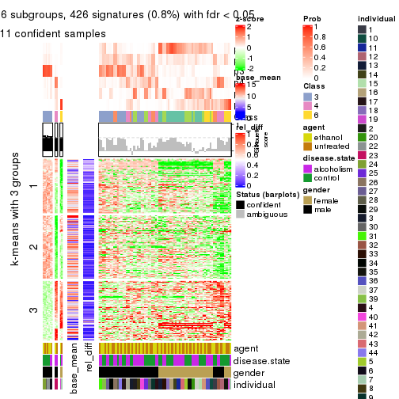</p>

</div>
</div>


Signature heatmaps where rows are not scaled:


<script>
$( function() {
	$( '#tabs-SD-NMF-get-signatures-no-scale' ).tabs();
} );
</script>
<div id='tabs-SD-NMF-get-signatures-no-scale'>
<ul>
<li><a href='#tab-SD-NMF-get-signatures-no-scale-1'>k = 2</a></li>
<li><a href='#tab-SD-NMF-get-signatures-no-scale-2'>k = 3</a></li>
<li><a href='#tab-SD-NMF-get-signatures-no-scale-3'>k = 4</a></li>
<li><a href='#tab-SD-NMF-get-signatures-no-scale-4'>k = 5</a></li>
<li><a href='#tab-SD-NMF-get-signatures-no-scale-5'>k = 6</a></li>
</ul>
<div id='tab-SD-NMF-get-signatures-no-scale-1'>
<pre><code class="r">get_signatures(res, k = 2, scale_rows = FALSE)
</code></pre>

<p></p>

</div>
<div id='tab-SD-NMF-get-signatures-no-scale-2'>
<pre><code class="r">get_signatures(res, k = 3, scale_rows = FALSE)
</code></pre>

<p></p>

</div>
<div id='tab-SD-NMF-get-signatures-no-scale-3'>
<pre><code class="r">get_signatures(res, k = 4, scale_rows = FALSE)
</code></pre>

<p></p>

</div>
<div id='tab-SD-NMF-get-signatures-no-scale-4'>
<pre><code class="r">get_signatures(res, k = 5, scale_rows = FALSE)
</code></pre>

<p></p>

</div>
<div id='tab-SD-NMF-get-signatures-no-scale-5'>
<pre><code class="r">get_signatures(res, k = 6, scale_rows = FALSE)
</code></pre>

<p></p>

</div>
</div>


Compare the overlap of signatures from different k:

```r
compare_signatures(res)
```


`get_signature()` returns a data frame invisibly. TO get the list of signatures, the function
call should be assigned to a variable explicitly. In following code, if `plot` argument is set
to `FALSE`, no heatmap is plotted while only the differential analysis is performed.

```r
# code only for demonstration
tb = get_signature(res, k = ..., plot = FALSE)
```

An example of the output of `tb` is:

```
#>   which_row         fdr    mean_1    mean_2 scaled_mean_1 scaled_mean_2 km
#> 1        38 0.042760348  8.373488  9.131774    -0.5533452     0.5164555  1
#> 2        40 0.018707592  7.106213  8.469186    -0.6173731     0.5762149  1
#> 3        55 0.019134737 10.221463 11.207825    -0.6159697     0.5749050  1
#> 4        59 0.006059896  5.921854  7.869574    -0.6899429     0.6439467  1
#> 5        60 0.018055526  8.928898 10.211722    -0.6204761     0.5791110  1
#> 6        98 0.009384629 15.714769 14.887706     0.6635654    -0.6193277  2
...
```

The columns in `tb` are:

1. `which_row`: row indices corresponding to the input matrix.
2. `fdr`: FDR for the differential test. 
3. `mean_x`: The mean value in group x.
4. `scaled_mean_x`: The mean value in group x after rows are scaled.
5. `km`: Row groups if k-means clustering is applied to rows.


UMAP plot which shows how samples are separated.


<script>
$( function() {
	$( '#tabs-SD-NMF-dimension-reduction' ).tabs();
} );
</script>
<div id='tabs-SD-NMF-dimension-reduction'>
<ul>
<li><a href='#tab-SD-NMF-dimension-reduction-1'>k = 2</a></li>
<li><a href='#tab-SD-NMF-dimension-reduction-2'>k = 3</a></li>
<li><a href='#tab-SD-NMF-dimension-reduction-3'>k = 4</a></li>
<li><a href='#tab-SD-NMF-dimension-reduction-4'>k = 5</a></li>
<li><a href='#tab-SD-NMF-dimension-reduction-5'>k = 6</a></li>
</ul>
<div id='tab-SD-NMF-dimension-reduction-1'>
<pre><code class="r">dimension_reduction(res, k = 2, method = &quot;UMAP&quot;)
</code></pre>

<p></p>

</div>
<div id='tab-SD-NMF-dimension-reduction-2'>
<pre><code class="r">dimension_reduction(res, k = 3, method = &quot;UMAP&quot;)
</code></pre>

<p></p>

</div>
<div id='tab-SD-NMF-dimension-reduction-3'>
<pre><code class="r">dimension_reduction(res, k = 4, method = &quot;UMAP&quot;)
</code></pre>

<p></p>

</div>
<div id='tab-SD-NMF-dimension-reduction-4'>
<pre><code class="r">dimension_reduction(res, k = 5, method = &quot;UMAP&quot;)
</code></pre>

<p></p>

</div>
<div id='tab-SD-NMF-dimension-reduction-5'>
<pre><code class="r">dimension_reduction(res, k = 6, method = &quot;UMAP&quot;)
</code></pre>

<p></p>

</div>
</div>


Following heatmap shows how subgroups are split when increasing `k`:

```r
collect_classes(res)
```


Test correlation between subgroups and known annotations. If the known
annotation is numeric, one-way ANOVA test is applied, and if the known
annotation is discrete, chi-squared contingency table test is applied.

```r
test_to_known_factors(res)
```

```
#>         n agent(p) disease.state(p) gender(p) individual(p) k
#> SD:NMF 58    0.963           0.7193  2.06e-13      0.001597 2
#> SD:NMF 48    1.000           0.7432  3.16e-11      0.002524 3
#> SD:NMF 54    0.933           0.0877  1.12e-11      0.000005 4
#> SD:NMF  6       NA               NA        NA            NA 5
#> SD:NMF 11    0.974           0.1997  4.09e-03      0.037520 6
```


If matrix rows can be associated to genes, consider to use `GO_Enrichment(res,
...)` to perform function enrichment for the signature genes.


 

---------------------------------------------------


### CV:hclust


The object with results only for a single top-value method and a single partition method 
can be extracted as:

```r
res = res_list["CV", "hclust"]
# you can also extract it by
# res = res_list["CV:hclust"]
```

A summary of `res` and all the functions that can be applied to it:

```r
res
```

```
#> A 'ConsensusPartition' object with k = 2, 3, 4, 5, 6.
#>   On a matrix with 51941 rows and 84 columns.
#>   Top rows (1000, 2000, 3000, 4000, 5000) are extracted by 'CV' method.
#>   Subgroups are detected by 'hclust' method.
#>   Performed in total 1250 partitions by row resampling.
#>   Best k for subgroups seems to be 3.
#> 
#> Following methods can be applied to this 'ConsensusPartition' object:
#>  [1] "cola_report"             "collect_classes"         "collect_plots"          
#>  [4] "collect_stats"           "colnames"                "compare_signatures"     
#>  [7] "consensus_heatmap"       "dimension_reduction"     "functional_enrichment"  
#> [10] "get_anno_col"            "get_anno"                "get_classes"            
#> [13] "get_consensus"           "get_matrix"              "get_membership"         
#> [16] "get_param"               "get_signatures"          "get_stats"              
#> [19] "is_best_k"               "is_stable_k"             "membership_heatmap"     
#> [22] "ncol"                    "nrow"                    "plot_ecdf"              
#> [25] "rownames"                "select_partition_number" "show"                   
#> [28] "suggest_best_k"          "test_to_known_factors"
```

`collect_plots()` function collects all the plots made from `res` for all `k` (number of partitions)
into one single page to provide an easy and fast comparison between different `k`.

```r
collect_plots(res)
```


The plots are:

- The first row: a plot of the ECDF (Empirical cumulative distribution
  function) curves of the consensus matrix for each `k` and the heatmap of
  predicted classes for each `k`.
- The second row: heatmaps of the consensus matrix for each `k`.
- The third row: heatmaps of the membership matrix for each `k`.
- The fouth row: heatmaps of the signatures for each `k`.

All the plots in panels can be made by individual functions and they are
plotted later in this section.

`select_partition_number()` produces several plots showing different
statistics for choosing "optimized" `k`. There are following statistics:

- ECDF curves of the consensus matrix for each `k`;
- 1-PAC. [The PAC
  score](https://en.wikipedia.org/wiki/Consensus_clustering#Over-interpretation_potential_of_consensus_clustering)
  measures the proportion of the ambiguous subgrouping.
- Mean silhouette score.
- Concordance. The mean probability of fiting the consensus class ids in all
  partitions.
- Area increased. Denote $A_k$ as the area under the ECDF curve for current
  `k`, the area increased is defined as $A_k - A_{k-1}$.
- Rand index. The percent of pairs of samples that are both in a same cluster
  or both are not in a same cluster in the partition of k and k-1.
- Jaccard index. The ratio of pairs of samples are both in a same cluster in
  the partition of k and k-1 and the pairs of samples are both in a same
  cluster in the partition k or k-1.

The detailed explanations of these statistics can be found in [the cola
vignette](http://bioconductor.org/packages/devel/bioc/vignettes/cola/inst/doc/cola.html#toc_13).

Generally speaking, lower PAC score, higher mean silhouette score or higher
concordance corresponds to better partition. Rand index and Jaccard index
measure how similar the current partition is compared to partition with `k-1`.
If they are too similar, we won't accept `k` is better than `k-1`.

```r
select_partition_number(res)
```


The numeric values for all these statistics can be obtained by `get_stats()`.

```r
get_stats(res)
```

```
#>   k  1-PAC mean_silhouette concordance area_increased  Rand Jaccard
#> 2 2 0.0409          0.0814       0.643         0.3478 0.719   0.719
#> 3 3 0.0108          0.6686       0.670         0.4445 0.518   0.430
#> 4 4 0.0419          0.4726       0.634         0.2464 0.920   0.836
#> 5 5 0.1039          0.4755       0.615         0.1105 0.894   0.747
#> 6 6 0.2321          0.4251       0.593         0.0718 0.909   0.733
```

`suggest_best_k()` suggests the best $k$ based on these statistics. The rules are as follows:

- All $k$ with Jaccard index larger than 0.95 are removed because the increase of
  the partition number does not provides enough extra information. If all $k$ are removed,
  the best $k$ is assigned by `NA`.
- For $k$ with 1-PAC larger than 0.9, the maximal $k$ is taken as the "best k". Other $k$ is called "optional k".
- If it does not fit the second rule. The $k$ with the highest vote of highest
  1-PAC, mean silhouette and concordance is taken as the "best k".

```r
suggest_best_k(res)
```

```
#> [1] 3
```


Following shows the table of the partitions (You need to click the **show/hide
code output** link to see it). The membership matrix (columns with name `p*`)
is inferred by
[`clue::cl_consensus()`](https://www.rdocumentation.org/link/cl_consensus?package=clue)
function with the `SE` method. Basically the value in the membership matrix
represents the probability to belong to a certain group. The finall class
label for an item is determined with the group with highest probability it
belongs to.

In `get_classes()` function, the entropy is calculated from the membership
matrix and the silhouette score is calculated from the consensus matrix.


<script>
$( function() {
	$( '#tabs-CV-hclust-get-classes' ).tabs();
} );
</script>
<div id='tabs-CV-hclust-get-classes'>
<ul>
<li><a href='#tab-CV-hclust-get-classes-1'>k = 2</a></li>
<li><a href='#tab-CV-hclust-get-classes-2'>k = 3</a></li>
<li><a href='#tab-CV-hclust-get-classes-3'>k = 4</a></li>
<li><a href='#tab-CV-hclust-get-classes-4'>k = 5</a></li>
<li><a href='#tab-CV-hclust-get-classes-5'>k = 6</a></li>
</ul>

<div id='tab-CV-hclust-get-classes-1'>
<p><a id='tab-CV-hclust-get-classes-1-a' style='color:#0366d6' href='#'>show/hide code output</a></p>
<pre><code class="r">cbind(get_classes(res, k = 2), get_membership(res, k = 2))
</code></pre>

<pre><code>#&gt;            class entropy silhouette    p1    p2
#&gt; GSM1269647     1   0.995     -0.457 0.540 0.460
#&gt; GSM1269655     1   0.994     -0.523 0.544 0.456
#&gt; GSM1269663     2   0.990      0.587 0.440 0.560
#&gt; GSM1269671     2   1.000      0.246 0.496 0.504
#&gt; GSM1269679     2   0.998      0.611 0.472 0.528
#&gt; GSM1269693     1   1.000     -0.603 0.500 0.500
#&gt; GSM1269701     1   0.996     -0.525 0.536 0.464
#&gt; GSM1269709     1   1.000     -0.601 0.508 0.492
#&gt; GSM1269715     2   0.722      0.216 0.200 0.800
#&gt; GSM1269717     2   0.999      0.616 0.484 0.516
#&gt; GSM1269721     1   0.991     -0.350 0.556 0.444
#&gt; GSM1269723     1   0.998     -0.561 0.528 0.472
#&gt; GSM1269645     1   0.697      0.413 0.812 0.188
#&gt; GSM1269653     1   0.552      0.445 0.872 0.128
#&gt; GSM1269661     1   0.680      0.396 0.820 0.180
#&gt; GSM1269669     1   0.469      0.451 0.900 0.100
#&gt; GSM1269677     1   0.730      0.392 0.796 0.204
#&gt; GSM1269685     1   0.430      0.458 0.912 0.088
#&gt; GSM1269691     1   0.541      0.446 0.876 0.124
#&gt; GSM1269699     1   0.625      0.418 0.844 0.156
#&gt; GSM1269707     1   0.644      0.423 0.836 0.164
#&gt; GSM1269651     1   0.996     -0.284 0.536 0.464
#&gt; GSM1269659     1   0.994     -0.408 0.544 0.456
#&gt; GSM1269667     1   0.998     -0.565 0.524 0.476
#&gt; GSM1269675     2   0.999      0.378 0.484 0.516
#&gt; GSM1269683     2   1.000      0.569 0.500 0.500
#&gt; GSM1269689     1   0.998     -0.430 0.524 0.476
#&gt; GSM1269697     1   0.998     -0.417 0.524 0.476
#&gt; GSM1269705     1   1.000     -0.392 0.512 0.488
#&gt; GSM1269713     2   1.000      0.603 0.492 0.508
#&gt; GSM1269719     1   0.994     -0.487 0.544 0.456
#&gt; GSM1269725     1   1.000     -0.576 0.500 0.500
#&gt; GSM1269727     2   1.000      0.605 0.488 0.512
#&gt; GSM1269649     1   0.456      0.456 0.904 0.096
#&gt; GSM1269657     1   0.689      0.419 0.816 0.184
#&gt; GSM1269665     1   0.745      0.404 0.788 0.212
#&gt; GSM1269673     1   0.456      0.453 0.904 0.096
#&gt; GSM1269681     1   0.738      0.380 0.792 0.208
#&gt; GSM1269687     1   0.430      0.458 0.912 0.088
#&gt; GSM1269695     1   0.343      0.457 0.936 0.064
#&gt; GSM1269703     1   0.574      0.451 0.864 0.136
#&gt; GSM1269711     1   0.456      0.455 0.904 0.096
#&gt; GSM1269646     1   0.995     -0.454 0.540 0.460
#&gt; GSM1269654     1   0.994     -0.523 0.544 0.456
#&gt; GSM1269662     2   0.990      0.547 0.440 0.560
#&gt; GSM1269670     1   1.000     -0.289 0.504 0.496
#&gt; GSM1269678     1   0.999     -0.584 0.516 0.484
#&gt; GSM1269692     1   0.961     -0.220 0.616 0.384
#&gt; GSM1269700     1   0.998     -0.544 0.528 0.472
#&gt; GSM1269708     1   1.000     -0.601 0.508 0.492
#&gt; GSM1269714     1   0.998     -0.601 0.524 0.476
#&gt; GSM1269716     2   0.999      0.615 0.484 0.516
#&gt; GSM1269720     1   0.991     -0.338 0.556 0.444
#&gt; GSM1269722     1   0.998     -0.576 0.528 0.472
#&gt; GSM1269644     1   0.506      0.448 0.888 0.112
#&gt; GSM1269652     1   0.373      0.461 0.928 0.072
#&gt; GSM1269660     1   0.644      0.421 0.836 0.164
#&gt; GSM1269668     1   0.518      0.450 0.884 0.116
#&gt; GSM1269676     1   0.730      0.392 0.796 0.204
#&gt; GSM1269684     1   0.506      0.441 0.888 0.112
#&gt; GSM1269690     1   0.541      0.446 0.876 0.124
#&gt; GSM1269698     1   0.680      0.414 0.820 0.180
#&gt; GSM1269706     1   0.644      0.423 0.836 0.164
#&gt; GSM1269650     1   0.980     -0.248 0.584 0.416
#&gt; GSM1269658     1   0.994     -0.408 0.544 0.456
#&gt; GSM1269666     1   0.998     -0.562 0.528 0.472
#&gt; GSM1269674     2   1.000      0.379 0.488 0.512
#&gt; GSM1269682     1   1.000     -0.606 0.504 0.496
#&gt; GSM1269688     1   1.000     -0.473 0.508 0.492
#&gt; GSM1269696     1   0.998     -0.447 0.524 0.476
#&gt; GSM1269704     1   0.999     -0.446 0.520 0.480
#&gt; GSM1269712     2   0.998      0.620 0.472 0.528
#&gt; GSM1269718     1   0.981     -0.418 0.580 0.420
#&gt; GSM1269724     1   0.999     -0.542 0.516 0.484
#&gt; GSM1269726     2   1.000      0.601 0.496 0.504
#&gt; GSM1269648     1   0.416      0.457 0.916 0.084
#&gt; GSM1269656     1   0.574      0.443 0.864 0.136
#&gt; GSM1269664     1   0.529      0.450 0.880 0.120
#&gt; GSM1269672     1   0.443      0.453 0.908 0.092
#&gt; GSM1269680     1   0.680      0.404 0.820 0.180
#&gt; GSM1269686     1   0.416      0.457 0.916 0.084
#&gt; GSM1269694     1   0.343      0.457 0.936 0.064
#&gt; GSM1269702     1   0.443      0.457 0.908 0.092
#&gt; GSM1269710     1   0.402      0.453 0.920 0.080
</code></pre>

<script>
$('#tab-CV-hclust-get-classes-1-a').parent().next().next().hide();
$('#tab-CV-hclust-get-classes-1-a').click(function(){
  $('#tab-CV-hclust-get-classes-1-a').parent().next().next().toggle();
  return(false);
});
</script>
</div>

<div id='tab-CV-hclust-get-classes-2'>
<p><a id='tab-CV-hclust-get-classes-2-a' style='color:#0366d6' href='#'>show/hide code output</a></p>
<pre><code class="r">cbind(get_classes(res, k = 3), get_membership(res, k = 3))
</code></pre>

<pre><code>#&gt;            class entropy silhouette    p1    p2    p3
#&gt; GSM1269647     1   0.673      0.685 0.740 0.172 0.088
#&gt; GSM1269655     1   0.471      0.728 0.848 0.108 0.044
#&gt; GSM1269663     1   0.768      0.618 0.680 0.188 0.132
#&gt; GSM1269671     1   0.944      0.447 0.480 0.324 0.196
#&gt; GSM1269679     1   0.388      0.729 0.888 0.068 0.044
#&gt; GSM1269693     1   0.544      0.713 0.812 0.132 0.056
#&gt; GSM1269701     1   0.503      0.719 0.828 0.132 0.040
#&gt; GSM1269709     1   0.417      0.725 0.868 0.104 0.028
#&gt; GSM1269715     3   0.527      0.000 0.200 0.016 0.784
#&gt; GSM1269717     1   0.491      0.699 0.844 0.088 0.068
#&gt; GSM1269721     1   0.856      0.527 0.572 0.304 0.124
#&gt; GSM1269723     1   0.449      0.718 0.856 0.108 0.036
#&gt; GSM1269645     2   0.578      0.670 0.160 0.788 0.052
#&gt; GSM1269653     2   0.667      0.740 0.224 0.720 0.056
#&gt; GSM1269661     2   0.660      0.653 0.428 0.564 0.008
#&gt; GSM1269669     2   0.676      0.761 0.288 0.676 0.036
#&gt; GSM1269677     2   0.789      0.493 0.372 0.564 0.064
#&gt; GSM1269685     2   0.651      0.776 0.300 0.676 0.024
#&gt; GSM1269691     2   0.636      0.739 0.364 0.628 0.008
#&gt; GSM1269699     2   0.771      0.651 0.256 0.652 0.092
#&gt; GSM1269707     2   0.788      0.638 0.268 0.636 0.096
#&gt; GSM1269651     1   0.894      0.534 0.548 0.292 0.160
#&gt; GSM1269659     1   0.837      0.586 0.608 0.260 0.132
#&gt; GSM1269667     1   0.570      0.723 0.796 0.148 0.056
#&gt; GSM1269675     1   0.902      0.541 0.548 0.276 0.176
#&gt; GSM1269683     1   0.572      0.714 0.800 0.132 0.068
#&gt; GSM1269689     1   0.760      0.639 0.668 0.236 0.096
#&gt; GSM1269697     1   0.747      0.645 0.684 0.216 0.100
#&gt; GSM1269705     1   0.844      0.602 0.612 0.236 0.152
#&gt; GSM1269713     1   0.491      0.725 0.844 0.088 0.068
#&gt; GSM1269719     1   0.635      0.684 0.744 0.204 0.052
#&gt; GSM1269725     1   0.448      0.733 0.860 0.096 0.044
#&gt; GSM1269727     1   0.367      0.718 0.896 0.064 0.040
#&gt; GSM1269649     2   0.680      0.768 0.308 0.660 0.032
#&gt; GSM1269657     2   0.751      0.622 0.344 0.604 0.052
#&gt; GSM1269665     2   0.673      0.674 0.260 0.696 0.044
#&gt; GSM1269673     2   0.694      0.769 0.312 0.652 0.036
#&gt; GSM1269681     2   0.742      0.555 0.172 0.700 0.128
#&gt; GSM1269687     2   0.642      0.766 0.324 0.660 0.016
#&gt; GSM1269695     2   0.590      0.778 0.292 0.700 0.008
#&gt; GSM1269703     2   0.640      0.761 0.344 0.644 0.012
#&gt; GSM1269711     2   0.659      0.771 0.280 0.688 0.032
#&gt; GSM1269646     1   0.681      0.683 0.736 0.172 0.092
#&gt; GSM1269654     1   0.471      0.728 0.848 0.108 0.044
#&gt; GSM1269662     1   0.845      0.602 0.616 0.220 0.164
#&gt; GSM1269670     1   0.940      0.443 0.480 0.332 0.188
#&gt; GSM1269678     1   0.448      0.722 0.860 0.096 0.044
#&gt; GSM1269692     1   0.777      0.274 0.592 0.344 0.064
#&gt; GSM1269700     1   0.471      0.722 0.844 0.120 0.036
#&gt; GSM1269708     1   0.441      0.723 0.860 0.104 0.036
#&gt; GSM1269714     1   0.489      0.714 0.844 0.096 0.060
#&gt; GSM1269716     1   0.500      0.695 0.840 0.088 0.072
#&gt; GSM1269720     1   0.865      0.527 0.568 0.300 0.132
#&gt; GSM1269722     1   0.353      0.727 0.892 0.092 0.016
#&gt; GSM1269644     2   0.660      0.762 0.296 0.676 0.028
#&gt; GSM1269652     2   0.703      0.780 0.296 0.660 0.044
#&gt; GSM1269660     2   0.666      0.694 0.400 0.588 0.012
#&gt; GSM1269668     2   0.704      0.756 0.312 0.648 0.040
#&gt; GSM1269676     2   0.789      0.493 0.372 0.564 0.064
#&gt; GSM1269684     2   0.704      0.761 0.348 0.620 0.032
#&gt; GSM1269690     2   0.636      0.739 0.364 0.628 0.008
#&gt; GSM1269698     2   0.797      0.593 0.280 0.624 0.096
#&gt; GSM1269706     2   0.788      0.638 0.268 0.636 0.096
#&gt; GSM1269650     1   0.808      0.579 0.608 0.296 0.096
#&gt; GSM1269658     1   0.834      0.593 0.612 0.256 0.132
#&gt; GSM1269666     1   0.471      0.728 0.844 0.120 0.036
#&gt; GSM1269674     1   0.900      0.542 0.548 0.280 0.172
#&gt; GSM1269682     1   0.514      0.711 0.824 0.132 0.044
#&gt; GSM1269688     1   0.711      0.664 0.696 0.232 0.072
#&gt; GSM1269696     1   0.706      0.668 0.716 0.192 0.092
#&gt; GSM1269704     1   0.787      0.652 0.664 0.200 0.136
#&gt; GSM1269712     1   0.518      0.714 0.832 0.084 0.084
#&gt; GSM1269718     1   0.603      0.671 0.752 0.212 0.036
#&gt; GSM1269724     1   0.572      0.729 0.800 0.132 0.068
#&gt; GSM1269726     1   0.376      0.722 0.892 0.068 0.040
#&gt; GSM1269648     2   0.672      0.769 0.312 0.660 0.028
#&gt; GSM1269656     2   0.709      0.724 0.268 0.676 0.056
#&gt; GSM1269664     2   0.697      0.749 0.356 0.616 0.028
#&gt; GSM1269672     2   0.671      0.768 0.296 0.672 0.032
#&gt; GSM1269680     2   0.794      0.590 0.236 0.648 0.116
#&gt; GSM1269686     2   0.628      0.765 0.324 0.664 0.012
#&gt; GSM1269694     2   0.590      0.778 0.292 0.700 0.008
#&gt; GSM1269702     2   0.610      0.767 0.320 0.672 0.008
#&gt; GSM1269710     2   0.642      0.767 0.260 0.708 0.032
</code></pre>

<script>
$('#tab-CV-hclust-get-classes-2-a').parent().next().next().hide();
$('#tab-CV-hclust-get-classes-2-a').click(function(){
  $('#tab-CV-hclust-get-classes-2-a').parent().next().next().toggle();
  return(false);
});
</script>
</div>

<div id='tab-CV-hclust-get-classes-3'>
<p><a id='tab-CV-hclust-get-classes-3-a' style='color:#0366d6' href='#'>show/hide code output</a></p>
<pre><code class="r">cbind(get_classes(res, k = 4), get_membership(res, k = 4))
</code></pre>

<pre><code>#&gt;            class entropy silhouette    p1    p2    p3    p4
#&gt; GSM1269647     3   0.736     0.1041 0.108 0.312 0.556 0.024
#&gt; GSM1269655     3   0.681     0.4670 0.120 0.156 0.680 0.044
#&gt; GSM1269663     3   0.802     0.1972 0.080 0.248 0.564 0.108
#&gt; GSM1269671     2   0.667     0.6591 0.100 0.652 0.228 0.020
#&gt; GSM1269679     3   0.438     0.5765 0.092 0.044 0.836 0.028
#&gt; GSM1269693     3   0.653     0.4913 0.112 0.116 0.712 0.060
#&gt; GSM1269701     3   0.538     0.5621 0.140 0.072 0.768 0.020
#&gt; GSM1269709     3   0.419     0.5816 0.108 0.044 0.836 0.012
#&gt; GSM1269715     4   0.338     0.0000 0.000 0.012 0.140 0.848
#&gt; GSM1269717     3   0.506     0.5601 0.084 0.040 0.804 0.072
#&gt; GSM1269721     3   0.868    -0.1747 0.188 0.372 0.388 0.052
#&gt; GSM1269723     3   0.496     0.5792 0.116 0.072 0.796 0.016
#&gt; GSM1269645     1   0.626     0.5882 0.716 0.168 0.068 0.048
#&gt; GSM1269653     1   0.633     0.6396 0.712 0.140 0.116 0.032
#&gt; GSM1269661     1   0.653     0.6026 0.620 0.076 0.292 0.012
#&gt; GSM1269669     1   0.521     0.7020 0.768 0.032 0.168 0.032
#&gt; GSM1269677     1   0.882     0.2350 0.440 0.288 0.208 0.064
#&gt; GSM1269685     1   0.544     0.7189 0.756 0.052 0.168 0.024
#&gt; GSM1269691     1   0.595     0.6616 0.672 0.052 0.264 0.012
#&gt; GSM1269699     1   0.790     0.4730 0.536 0.276 0.152 0.036
#&gt; GSM1269707     1   0.798     0.4798 0.540 0.256 0.164 0.040
#&gt; GSM1269651     2   0.821     0.5078 0.132 0.484 0.332 0.052
#&gt; GSM1269659     3   0.911     0.0727 0.192 0.260 0.444 0.104
#&gt; GSM1269667     3   0.657     0.5368 0.144 0.112 0.700 0.044
#&gt; GSM1269675     2   0.808     0.6159 0.128 0.500 0.324 0.048
#&gt; GSM1269683     3   0.588     0.5524 0.124 0.076 0.752 0.048
#&gt; GSM1269689     3   0.792     0.0936 0.168 0.268 0.532 0.032
#&gt; GSM1269697     3   0.719    -0.1275 0.108 0.348 0.532 0.012
#&gt; GSM1269705     2   0.721     0.4584 0.100 0.488 0.400 0.012
#&gt; GSM1269713     3   0.564     0.5702 0.100 0.060 0.772 0.068
#&gt; GSM1269719     3   0.695     0.4284 0.176 0.136 0.656 0.032
#&gt; GSM1269725     3   0.599     0.4978 0.092 0.156 0.728 0.024
#&gt; GSM1269727     3   0.361     0.5845 0.080 0.028 0.872 0.020
#&gt; GSM1269649     1   0.592     0.7039 0.720 0.048 0.196 0.036
#&gt; GSM1269657     1   0.812     0.4756 0.520 0.244 0.200 0.036
#&gt; GSM1269665     1   0.712     0.6106 0.652 0.120 0.180 0.048
#&gt; GSM1269673     1   0.615     0.7119 0.708 0.060 0.196 0.036
#&gt; GSM1269681     1   0.728     0.1943 0.464 0.440 0.048 0.048
#&gt; GSM1269687     1   0.524     0.7110 0.744 0.048 0.200 0.008
#&gt; GSM1269695     1   0.566     0.7202 0.740 0.076 0.168 0.016
#&gt; GSM1269703     1   0.569     0.6985 0.696 0.052 0.244 0.008
#&gt; GSM1269711     1   0.547     0.7140 0.756 0.056 0.164 0.024
#&gt; GSM1269646     3   0.741     0.0933 0.104 0.316 0.552 0.028
#&gt; GSM1269654     3   0.677     0.4725 0.120 0.152 0.684 0.044
#&gt; GSM1269662     3   0.897    -0.0991 0.104 0.324 0.428 0.144
#&gt; GSM1269670     2   0.684     0.6571 0.108 0.644 0.224 0.024
#&gt; GSM1269678     3   0.452     0.5875 0.108 0.044 0.824 0.024
#&gt; GSM1269692     3   0.760     0.2022 0.352 0.096 0.516 0.036
#&gt; GSM1269700     3   0.516     0.5653 0.104 0.088 0.788 0.020
#&gt; GSM1269708     3   0.442     0.5812 0.108 0.044 0.828 0.020
#&gt; GSM1269714     3   0.503     0.5791 0.112 0.052 0.800 0.036
#&gt; GSM1269716     3   0.499     0.5591 0.088 0.044 0.808 0.060
#&gt; GSM1269720     3   0.872    -0.1892 0.184 0.380 0.380 0.056
#&gt; GSM1269722     3   0.455     0.5794 0.108 0.056 0.820 0.016
#&gt; GSM1269644     1   0.625     0.7015 0.708 0.092 0.172 0.028
#&gt; GSM1269652     1   0.607     0.7106 0.728 0.088 0.152 0.032
#&gt; GSM1269660     1   0.669     0.6318 0.620 0.084 0.280 0.016
#&gt; GSM1269668     1   0.587     0.6969 0.716 0.044 0.208 0.032
#&gt; GSM1269676     1   0.882     0.2350 0.440 0.288 0.208 0.064
#&gt; GSM1269684     1   0.584     0.7125 0.716 0.068 0.200 0.016
#&gt; GSM1269690     1   0.595     0.6616 0.672 0.052 0.264 0.012
#&gt; GSM1269698     1   0.804     0.4198 0.496 0.312 0.160 0.032
#&gt; GSM1269706     1   0.798     0.4798 0.540 0.256 0.164 0.040
#&gt; GSM1269650     2   0.798     0.3384 0.132 0.420 0.416 0.032
#&gt; GSM1269658     3   0.910     0.0685 0.188 0.264 0.444 0.104
#&gt; GSM1269666     3   0.601     0.5543 0.116 0.108 0.740 0.036
#&gt; GSM1269674     2   0.808     0.6167 0.128 0.500 0.324 0.048
#&gt; GSM1269682     3   0.529     0.5746 0.120 0.076 0.780 0.024
#&gt; GSM1269688     3   0.763     0.2345 0.164 0.224 0.580 0.032
#&gt; GSM1269696     3   0.720    -0.0793 0.092 0.348 0.540 0.020
#&gt; GSM1269704     3   0.747    -0.3431 0.104 0.412 0.464 0.020
#&gt; GSM1269712     3   0.557     0.5688 0.088 0.052 0.776 0.084
#&gt; GSM1269718     3   0.699     0.4259 0.176 0.132 0.656 0.036
#&gt; GSM1269724     3   0.670     0.4321 0.108 0.196 0.668 0.028
#&gt; GSM1269726     3   0.370     0.5846 0.080 0.032 0.868 0.020
#&gt; GSM1269648     1   0.604     0.7049 0.716 0.056 0.192 0.036
#&gt; GSM1269656     1   0.680     0.6347 0.656 0.180 0.144 0.020
#&gt; GSM1269664     1   0.664     0.6770 0.652 0.064 0.248 0.036
#&gt; GSM1269672     1   0.541     0.7121 0.752 0.044 0.180 0.024
#&gt; GSM1269680     1   0.778     0.2694 0.448 0.416 0.096 0.040
#&gt; GSM1269686     1   0.502     0.7098 0.752 0.044 0.200 0.004
#&gt; GSM1269694     1   0.566     0.7202 0.740 0.076 0.168 0.016
#&gt; GSM1269702     1   0.534     0.7089 0.748 0.064 0.180 0.008
#&gt; GSM1269710     1   0.545     0.7108 0.764 0.052 0.152 0.032
</code></pre>

<script>
$('#tab-CV-hclust-get-classes-3-a').parent().next().next().hide();
$('#tab-CV-hclust-get-classes-3-a').click(function(){
  $('#tab-CV-hclust-get-classes-3-a').parent().next().next().toggle();
  return(false);
});
</script>
</div>

<div id='tab-CV-hclust-get-classes-4'>
<p><a id='tab-CV-hclust-get-classes-4-a' style='color:#0366d6' href='#'>show/hide code output</a></p>
<pre><code class="r">cbind(get_classes(res, k = 5), get_membership(res, k = 5))
</code></pre>

<pre><code>#&gt;            class entropy silhouette    p1    p2    p3    p4    p5
#&gt; GSM1269647     3   0.749     0.1655 0.088 0.060 0.472 0.028 0.352
#&gt; GSM1269655     3   0.720     0.5199 0.092 0.072 0.624 0.060 0.152
#&gt; GSM1269663     3   0.850    -0.0964 0.020 0.260 0.388 0.104 0.228
#&gt; GSM1269671     5   0.532     0.4860 0.044 0.116 0.108 0.000 0.732
#&gt; GSM1269679     3   0.426     0.6462 0.080 0.008 0.816 0.024 0.072
#&gt; GSM1269693     3   0.696     0.4701 0.060 0.168 0.636 0.080 0.056
#&gt; GSM1269701     3   0.552     0.6315 0.144 0.012 0.720 0.024 0.100
#&gt; GSM1269709     3   0.442     0.6454 0.108 0.020 0.800 0.008 0.064
#&gt; GSM1269715     4   0.247     0.0000 0.000 0.012 0.104 0.884 0.000
#&gt; GSM1269717     3   0.508     0.6101 0.076 0.056 0.768 0.092 0.008
#&gt; GSM1269721     2   0.880     0.2870 0.092 0.384 0.240 0.048 0.236
#&gt; GSM1269723     3   0.513     0.6482 0.120 0.028 0.764 0.024 0.064
#&gt; GSM1269645     1   0.688     0.4883 0.608 0.208 0.040 0.028 0.116
#&gt; GSM1269653     1   0.668     0.5527 0.624 0.204 0.072 0.012 0.088
#&gt; GSM1269661     1   0.624     0.5994 0.652 0.068 0.212 0.012 0.056
#&gt; GSM1269669     1   0.483     0.6778 0.772 0.084 0.116 0.012 0.016
#&gt; GSM1269677     2   0.699     0.3489 0.280 0.552 0.112 0.016 0.040
#&gt; GSM1269685     1   0.490     0.6947 0.764 0.104 0.104 0.004 0.024
#&gt; GSM1269691     1   0.578     0.6359 0.664 0.112 0.204 0.004 0.016
#&gt; GSM1269699     1   0.788     0.2588 0.456 0.312 0.104 0.016 0.112
#&gt; GSM1269707     1   0.802     0.2802 0.452 0.308 0.120 0.024 0.096
#&gt; GSM1269651     5   0.828     0.2610 0.068 0.248 0.192 0.040 0.452
#&gt; GSM1269659     2   0.898     0.3542 0.112 0.344 0.336 0.084 0.124
#&gt; GSM1269667     3   0.696     0.6008 0.152 0.040 0.632 0.056 0.120
#&gt; GSM1269675     5   0.575     0.4885 0.056 0.048 0.156 0.024 0.716
#&gt; GSM1269683     3   0.595     0.6121 0.116 0.040 0.720 0.072 0.052
#&gt; GSM1269689     3   0.771     0.1695 0.120 0.060 0.440 0.024 0.356
#&gt; GSM1269697     3   0.691    -0.0235 0.080 0.036 0.436 0.016 0.432
#&gt; GSM1269705     5   0.722     0.4012 0.088 0.096 0.296 0.004 0.516
#&gt; GSM1269713     3   0.615     0.6282 0.104 0.036 0.708 0.084 0.068
#&gt; GSM1269719     3   0.762     0.4165 0.116 0.160 0.580 0.044 0.100
#&gt; GSM1269725     3   0.645     0.5682 0.076 0.064 0.672 0.032 0.156
#&gt; GSM1269727     3   0.417     0.6460 0.076 0.040 0.828 0.012 0.044
#&gt; GSM1269649     1   0.497     0.6893 0.760 0.072 0.136 0.012 0.020
#&gt; GSM1269657     1   0.691     0.0932 0.432 0.408 0.120 0.000 0.040
#&gt; GSM1269665     1   0.727     0.5242 0.576 0.196 0.136 0.016 0.076
#&gt; GSM1269673     1   0.571     0.6898 0.704 0.112 0.148 0.016 0.020
#&gt; GSM1269681     5   0.763    -0.1173 0.284 0.320 0.028 0.008 0.360
#&gt; GSM1269687     1   0.535     0.6837 0.732 0.068 0.148 0.004 0.048
#&gt; GSM1269695     1   0.500     0.7004 0.760 0.092 0.112 0.004 0.032
#&gt; GSM1269703     1   0.532     0.6897 0.716 0.056 0.188 0.004 0.036
#&gt; GSM1269711     1   0.439     0.6961 0.788 0.084 0.112 0.000 0.016
#&gt; GSM1269646     3   0.745     0.1667 0.092 0.060 0.472 0.024 0.352
#&gt; GSM1269654     3   0.716     0.5255 0.092 0.072 0.628 0.060 0.148
#&gt; GSM1269662     2   0.888    -0.0492 0.028 0.336 0.208 0.144 0.284
#&gt; GSM1269670     5   0.543     0.4838 0.048 0.120 0.108 0.000 0.724
#&gt; GSM1269678     3   0.499     0.6545 0.108 0.020 0.776 0.036 0.060
#&gt; GSM1269692     3   0.767     0.1512 0.360 0.060 0.456 0.044 0.080
#&gt; GSM1269700     3   0.539     0.6370 0.116 0.020 0.744 0.028 0.092
#&gt; GSM1269708     3   0.453     0.6449 0.108 0.020 0.796 0.012 0.064
#&gt; GSM1269714     3   0.533     0.6371 0.112 0.044 0.760 0.040 0.044
#&gt; GSM1269716     3   0.486     0.6109 0.080 0.060 0.780 0.076 0.004
#&gt; GSM1269720     2   0.872     0.2937 0.088 0.400 0.216 0.048 0.248
#&gt; GSM1269722     3   0.494     0.6490 0.116 0.024 0.772 0.016 0.072
#&gt; GSM1269644     1   0.604     0.6599 0.692 0.124 0.128 0.016 0.040
#&gt; GSM1269652     1   0.549     0.6661 0.724 0.148 0.088 0.012 0.028
#&gt; GSM1269660     1   0.633     0.6226 0.648 0.076 0.208 0.012 0.056
#&gt; GSM1269668     1   0.551     0.6774 0.720 0.068 0.168 0.020 0.024
#&gt; GSM1269676     2   0.699     0.3489 0.280 0.552 0.112 0.016 0.040
#&gt; GSM1269684     1   0.536     0.6945 0.724 0.096 0.140 0.000 0.040
#&gt; GSM1269690     1   0.578     0.6359 0.664 0.112 0.204 0.004 0.016
#&gt; GSM1269698     1   0.826     0.2267 0.436 0.260 0.112 0.016 0.176
#&gt; GSM1269706     1   0.802     0.2802 0.452 0.308 0.120 0.024 0.096
#&gt; GSM1269650     5   0.847     0.2035 0.064 0.252 0.304 0.032 0.348
#&gt; GSM1269658     2   0.901     0.3509 0.112 0.340 0.336 0.084 0.128
#&gt; GSM1269666     3   0.651     0.6196 0.116 0.036 0.676 0.060 0.112
#&gt; GSM1269674     5   0.577     0.4888 0.056 0.044 0.156 0.028 0.716
#&gt; GSM1269682     3   0.565     0.6316 0.136 0.052 0.732 0.048 0.032
#&gt; GSM1269688     3   0.747     0.3253 0.120 0.052 0.508 0.024 0.296
#&gt; GSM1269696     3   0.678     0.0336 0.056 0.052 0.444 0.012 0.436
#&gt; GSM1269704     5   0.730     0.2061 0.072 0.092 0.384 0.008 0.444
#&gt; GSM1269712     3   0.611     0.6302 0.096 0.044 0.712 0.096 0.052
#&gt; GSM1269718     3   0.747     0.4428 0.116 0.140 0.600 0.048 0.096
#&gt; GSM1269724     3   0.704     0.5028 0.084 0.072 0.616 0.036 0.192
#&gt; GSM1269726     3   0.424     0.6451 0.076 0.040 0.824 0.012 0.048
#&gt; GSM1269648     1   0.514     0.6896 0.748 0.092 0.128 0.008 0.024
#&gt; GSM1269656     1   0.686     0.5317 0.592 0.232 0.088 0.008 0.080
#&gt; GSM1269664     1   0.632     0.6606 0.652 0.088 0.204 0.024 0.032
#&gt; GSM1269672     1   0.484     0.6964 0.768 0.072 0.132 0.012 0.016
#&gt; GSM1269680     2   0.815    -0.0102 0.320 0.328 0.072 0.008 0.272
#&gt; GSM1269686     1   0.495     0.6846 0.752 0.056 0.148 0.000 0.044
#&gt; GSM1269694     1   0.500     0.7004 0.760 0.092 0.112 0.004 0.032
#&gt; GSM1269702     1   0.485     0.6746 0.752 0.116 0.116 0.000 0.016
#&gt; GSM1269710     1   0.441     0.6912 0.800 0.080 0.096 0.008 0.016
</code></pre>

<script>
$('#tab-CV-hclust-get-classes-4-a').parent().next().next().hide();
$('#tab-CV-hclust-get-classes-4-a').click(function(){
  $('#tab-CV-hclust-get-classes-4-a').parent().next().next().toggle();
  return(false);
});
</script>
</div>

<div id='tab-CV-hclust-get-classes-5'>
<p><a id='tab-CV-hclust-get-classes-5-a' style='color:#0366d6' href='#'>show/hide code output</a></p>
<pre><code class="r">cbind(get_classes(res, k = 6), get_membership(res, k = 6))
</code></pre>

<pre><code>#&gt;            class entropy silhouette    p1    p2    p3    p4    p5    p6
#&gt; GSM1269647     3   0.735   -0.07774 0.076 0.072 0.404 0.012 0.388 0.048
#&gt; GSM1269655     3   0.732    0.47715 0.076 0.072 0.588 0.048 0.144 0.072
#&gt; GSM1269663     2   0.825    0.34042 0.012 0.380 0.300 0.080 0.116 0.112
#&gt; GSM1269671     5   0.401    0.30822 0.016 0.068 0.008 0.012 0.812 0.084
#&gt; GSM1269679     3   0.453    0.62663 0.076 0.024 0.784 0.024 0.084 0.008
#&gt; GSM1269693     3   0.690    0.39584 0.032 0.084 0.600 0.076 0.032 0.176
#&gt; GSM1269701     3   0.563    0.61066 0.136 0.016 0.696 0.024 0.100 0.028
#&gt; GSM1269709     3   0.485    0.61217 0.080 0.024 0.768 0.012 0.080 0.036
#&gt; GSM1269715     4   0.201    0.00000 0.000 0.004 0.084 0.904 0.000 0.008
#&gt; GSM1269717     3   0.526    0.57151 0.052 0.060 0.740 0.088 0.004 0.056
#&gt; GSM1269721     6   0.767   -0.06061 0.036 0.068 0.180 0.024 0.204 0.488
#&gt; GSM1269723     3   0.522    0.62547 0.096 0.032 0.748 0.024 0.068 0.032
#&gt; GSM1269645     1   0.744    0.38987 0.544 0.160 0.028 0.032 0.092 0.144
#&gt; GSM1269653     1   0.736    0.40995 0.524 0.132 0.064 0.008 0.060 0.212
#&gt; GSM1269661     1   0.648    0.57148 0.612 0.052 0.196 0.020 0.020 0.100
#&gt; GSM1269669     1   0.481    0.67150 0.768 0.052 0.096 0.012 0.016 0.056
#&gt; GSM1269677     6   0.459    0.40695 0.164 0.008 0.064 0.008 0.012 0.744
#&gt; GSM1269685     1   0.505    0.66721 0.740 0.024 0.080 0.012 0.020 0.124
#&gt; GSM1269691     1   0.590    0.60299 0.632 0.016 0.176 0.004 0.024 0.148
#&gt; GSM1269699     6   0.758    0.27777 0.328 0.092 0.044 0.020 0.076 0.440
#&gt; GSM1269707     6   0.766    0.25429 0.352 0.104 0.060 0.016 0.060 0.408
#&gt; GSM1269651     5   0.773   -0.20989 0.016 0.320 0.100 0.008 0.364 0.192
#&gt; GSM1269659     6   0.827   -0.11262 0.052 0.156 0.264 0.036 0.080 0.412
#&gt; GSM1269667     3   0.718    0.57318 0.132 0.052 0.592 0.064 0.124 0.036
#&gt; GSM1269675     5   0.553    0.31222 0.040 0.160 0.084 0.012 0.692 0.012
#&gt; GSM1269683     3   0.620    0.56752 0.096 0.048 0.688 0.064 0.052 0.052
#&gt; GSM1269689     3   0.774   -0.00852 0.128 0.076 0.368 0.008 0.368 0.052
#&gt; GSM1269697     5   0.697    0.14893 0.072 0.052 0.388 0.008 0.436 0.044
#&gt; GSM1269705     5   0.757    0.25240 0.056 0.092 0.248 0.008 0.488 0.108
#&gt; GSM1269713     3   0.662    0.58686 0.088 0.048 0.656 0.080 0.080 0.048
#&gt; GSM1269719     3   0.773    0.28351 0.096 0.176 0.508 0.016 0.056 0.148
#&gt; GSM1269725     3   0.658    0.51815 0.064 0.048 0.636 0.028 0.160 0.064
#&gt; GSM1269727     3   0.479    0.60309 0.060 0.040 0.784 0.020 0.052 0.044
#&gt; GSM1269649     1   0.531    0.66272 0.732 0.028 0.096 0.012 0.036 0.096
#&gt; GSM1269657     6   0.594    0.22299 0.304 0.016 0.088 0.000 0.028 0.564
#&gt; GSM1269665     1   0.762    0.46005 0.524 0.140 0.116 0.024 0.036 0.160
#&gt; GSM1269673     1   0.598    0.67411 0.680 0.060 0.136 0.016 0.028 0.080
#&gt; GSM1269681     6   0.823    0.21488 0.180 0.164 0.008 0.032 0.268 0.348
#&gt; GSM1269687     1   0.507    0.66777 0.728 0.020 0.116 0.008 0.016 0.112
#&gt; GSM1269695     1   0.500    0.66712 0.720 0.008 0.076 0.004 0.032 0.160
#&gt; GSM1269703     1   0.544    0.67694 0.696 0.032 0.140 0.008 0.012 0.112
#&gt; GSM1269711     1   0.468    0.67099 0.768 0.036 0.080 0.004 0.016 0.096
#&gt; GSM1269646     3   0.739   -0.08445 0.080 0.072 0.400 0.012 0.388 0.048
#&gt; GSM1269654     3   0.729    0.48369 0.076 0.072 0.592 0.048 0.140 0.072
#&gt; GSM1269662     2   0.784    0.31595 0.012 0.504 0.124 0.072 0.144 0.144
#&gt; GSM1269670     5   0.418    0.31213 0.020 0.076 0.016 0.004 0.800 0.084
#&gt; GSM1269678     3   0.502    0.63098 0.076 0.044 0.768 0.032 0.052 0.028
#&gt; GSM1269692     3   0.778    0.10888 0.328 0.052 0.424 0.040 0.044 0.112
#&gt; GSM1269700     3   0.561    0.61418 0.096 0.020 0.712 0.032 0.108 0.032
#&gt; GSM1269708     3   0.496    0.61123 0.084 0.028 0.764 0.016 0.072 0.036
#&gt; GSM1269714     3   0.548    0.59938 0.088 0.036 0.736 0.044 0.032 0.064
#&gt; GSM1269716     3   0.483    0.57379 0.056 0.040 0.764 0.084 0.000 0.056
#&gt; GSM1269720     6   0.763   -0.03700 0.036 0.068 0.156 0.028 0.212 0.500
#&gt; GSM1269722     3   0.507    0.62815 0.096 0.032 0.752 0.012 0.076 0.032
#&gt; GSM1269644     1   0.634    0.62247 0.656 0.076 0.112 0.020 0.028 0.108
#&gt; GSM1269652     1   0.575    0.60822 0.676 0.048 0.072 0.008 0.024 0.172
#&gt; GSM1269660     1   0.637    0.59195 0.616 0.048 0.196 0.012 0.024 0.104
#&gt; GSM1269668     1   0.543    0.66954 0.716 0.044 0.144 0.024 0.016 0.056
#&gt; GSM1269676     6   0.459    0.40695 0.164 0.008 0.064 0.008 0.012 0.744
#&gt; GSM1269684     1   0.512    0.67969 0.728 0.020 0.112 0.008 0.020 0.112
#&gt; GSM1269690     1   0.590    0.60299 0.632 0.016 0.176 0.004 0.024 0.148
#&gt; GSM1269698     6   0.821    0.26458 0.304 0.080 0.080 0.016 0.136 0.384
#&gt; GSM1269706     6   0.766    0.25429 0.352 0.104 0.060 0.016 0.060 0.408
#&gt; GSM1269650     2   0.821   -0.04799 0.012 0.292 0.204 0.012 0.268 0.212
#&gt; GSM1269658     6   0.830   -0.11076 0.052 0.164 0.260 0.036 0.080 0.408
#&gt; GSM1269666     3   0.665    0.58975 0.100 0.064 0.640 0.048 0.120 0.028
#&gt; GSM1269674     5   0.573    0.30954 0.040 0.152 0.092 0.016 0.684 0.016
#&gt; GSM1269682     3   0.580    0.59485 0.104 0.056 0.712 0.040 0.032 0.056
#&gt; GSM1269688     3   0.747    0.17247 0.124 0.052 0.436 0.012 0.328 0.048
#&gt; GSM1269696     5   0.698    0.13499 0.056 0.080 0.372 0.004 0.444 0.044
#&gt; GSM1269704     5   0.747    0.23699 0.060 0.064 0.320 0.008 0.448 0.100
#&gt; GSM1269712     3   0.624    0.59163 0.088 0.036 0.680 0.100 0.048 0.048
#&gt; GSM1269718     3   0.772    0.33556 0.100 0.136 0.540 0.036 0.056 0.132
#&gt; GSM1269724     3   0.705    0.43951 0.064 0.052 0.580 0.024 0.196 0.084
#&gt; GSM1269726     3   0.491    0.60239 0.064 0.040 0.776 0.020 0.052 0.048
#&gt; GSM1269648     1   0.530    0.65887 0.720 0.024 0.088 0.004 0.040 0.124
#&gt; GSM1269656     1   0.681    0.29964 0.504 0.040 0.064 0.004 0.068 0.320
#&gt; GSM1269664     1   0.634    0.64370 0.632 0.052 0.176 0.024 0.016 0.100
#&gt; GSM1269672     1   0.505    0.68994 0.748 0.040 0.116 0.016 0.016 0.064
#&gt; GSM1269680     6   0.816    0.35836 0.236 0.116 0.028 0.020 0.208 0.392
#&gt; GSM1269686     1   0.484    0.67080 0.744 0.020 0.112 0.004 0.016 0.104
#&gt; GSM1269694     1   0.500    0.66712 0.720 0.008 0.076 0.004 0.032 0.160
#&gt; GSM1269702     1   0.501    0.63748 0.704 0.012 0.088 0.000 0.020 0.176
#&gt; GSM1269710     1   0.448    0.66447 0.784 0.040 0.064 0.004 0.016 0.092
</code></pre>

<script>
$('#tab-CV-hclust-get-classes-5-a').parent().next().next().hide();
$('#tab-CV-hclust-get-classes-5-a').click(function(){
  $('#tab-CV-hclust-get-classes-5-a').parent().next().next().toggle();
  return(false);
});
</script>
</div>
</div>

Heatmaps for the consensus matrix. It visualizes the probability of two
samples to be in a same group.


<script>
$( function() {
	$( '#tabs-CV-hclust-consensus-heatmap' ).tabs();
} );
</script>
<div id='tabs-CV-hclust-consensus-heatmap'>
<ul>
<li><a href='#tab-CV-hclust-consensus-heatmap-1'>k = 2</a></li>
<li><a href='#tab-CV-hclust-consensus-heatmap-2'>k = 3</a></li>
<li><a href='#tab-CV-hclust-consensus-heatmap-3'>k = 4</a></li>
<li><a href='#tab-CV-hclust-consensus-heatmap-4'>k = 5</a></li>
<li><a href='#tab-CV-hclust-consensus-heatmap-5'>k = 6</a></li>
</ul>
<div id='tab-CV-hclust-consensus-heatmap-1'>
<pre><code class="r">consensus_heatmap(res, k = 2)
</code></pre>

<p></p>

</div>
<div id='tab-CV-hclust-consensus-heatmap-2'>
<pre><code class="r">consensus_heatmap(res, k = 3)
</code></pre>

<p></p>

</div>
<div id='tab-CV-hclust-consensus-heatmap-3'>
<pre><code class="r">consensus_heatmap(res, k = 4)
</code></pre>

<p></p>

</div>
<div id='tab-CV-hclust-consensus-heatmap-4'>
<pre><code class="r">consensus_heatmap(res, k = 5)
</code></pre>

<p></p>

</div>
<div id='tab-CV-hclust-consensus-heatmap-5'>
<pre><code class="r">consensus_heatmap(res, k = 6)
</code></pre>

<p></p>

</div>
</div>

Heatmaps for the membership of samples in all partitions to see how consistent they are:


<script>
$( function() {
	$( '#tabs-CV-hclust-membership-heatmap' ).tabs();
} );
</script>
<div id='tabs-CV-hclust-membership-heatmap'>
<ul>
<li><a href='#tab-CV-hclust-membership-heatmap-1'>k = 2</a></li>
<li><a href='#tab-CV-hclust-membership-heatmap-2'>k = 3</a></li>
<li><a href='#tab-CV-hclust-membership-heatmap-3'>k = 4</a></li>
<li><a href='#tab-CV-hclust-membership-heatmap-4'>k = 5</a></li>
<li><a href='#tab-CV-hclust-membership-heatmap-5'>k = 6</a></li>
</ul>
<div id='tab-CV-hclust-membership-heatmap-1'>
<pre><code class="r">membership_heatmap(res, k = 2)
</code></pre>

<p></p>

</div>
<div id='tab-CV-hclust-membership-heatmap-2'>
<pre><code class="r">membership_heatmap(res, k = 3)
</code></pre>

<p></p>

</div>
<div id='tab-CV-hclust-membership-heatmap-3'>
<pre><code class="r">membership_heatmap(res, k = 4)
</code></pre>

<p></p>

</div>
<div id='tab-CV-hclust-membership-heatmap-4'>
<pre><code class="r">membership_heatmap(res, k = 5)
</code></pre>

<p></p>

</div>
<div id='tab-CV-hclust-membership-heatmap-5'>
<pre><code class="r">membership_heatmap(res, k = 6)
</code></pre>

<p></p>

</div>
</div>

As soon as we have had the classes for columns, we can look for signatures
which are significantly different between classes which can be candidate marks
for certain classes. Following are the heatmaps for signatures.


Signature heatmaps where rows are scaled:


<script>
$( function() {
	$( '#tabs-CV-hclust-get-signatures' ).tabs();
} );
</script>
<div id='tabs-CV-hclust-get-signatures'>
<ul>
<li><a href='#tab-CV-hclust-get-signatures-1'>k = 2</a></li>
<li><a href='#tab-CV-hclust-get-signatures-2'>k = 3</a></li>
<li><a href='#tab-CV-hclust-get-signatures-3'>k = 4</a></li>
<li><a href='#tab-CV-hclust-get-signatures-4'>k = 5</a></li>
<li><a href='#tab-CV-hclust-get-signatures-5'>k = 6</a></li>
</ul>
<div id='tab-CV-hclust-get-signatures-1'>
<pre><code class="r">get_signatures(res, k = 2)
</code></pre>

<p></p>

</div>
<div id='tab-CV-hclust-get-signatures-2'>
<pre><code class="r">get_signatures(res, k = 3)
</code></pre>

<p></p>

</div>
<div id='tab-CV-hclust-get-signatures-3'>
<pre><code class="r">get_signatures(res, k = 4)
</code></pre>

<p>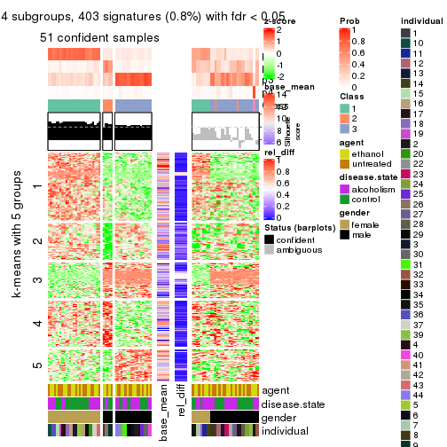</p>

</div>
<div id='tab-CV-hclust-get-signatures-4'>
<pre><code class="r">get_signatures(res, k = 5)
</code></pre>

<p></p>

</div>
<div id='tab-CV-hclust-get-signatures-5'>
<pre><code class="r">get_signatures(res, k = 6)
</code></pre>

<p></p>

</div>
</div>


Signature heatmaps where rows are not scaled:


<script>
$( function() {
	$( '#tabs-CV-hclust-get-signatures-no-scale' ).tabs();
} );
</script>
<div id='tabs-CV-hclust-get-signatures-no-scale'>
<ul>
<li><a href='#tab-CV-hclust-get-signatures-no-scale-1'>k = 2</a></li>
<li><a href='#tab-CV-hclust-get-signatures-no-scale-2'>k = 3</a></li>
<li><a href='#tab-CV-hclust-get-signatures-no-scale-3'>k = 4</a></li>
<li><a href='#tab-CV-hclust-get-signatures-no-scale-4'>k = 5</a></li>
<li><a href='#tab-CV-hclust-get-signatures-no-scale-5'>k = 6</a></li>
</ul>
<div id='tab-CV-hclust-get-signatures-no-scale-1'>
<pre><code class="r">get_signatures(res, k = 2, scale_rows = FALSE)
</code></pre>

<p></p>

</div>
<div id='tab-CV-hclust-get-signatures-no-scale-2'>
<pre><code class="r">get_signatures(res, k = 3, scale_rows = FALSE)
</code></pre>

<p></p>

</div>
<div id='tab-CV-hclust-get-signatures-no-scale-3'>
<pre><code class="r">get_signatures(res, k = 4, scale_rows = FALSE)
</code></pre>

<p></p>

</div>
<div id='tab-CV-hclust-get-signatures-no-scale-4'>
<pre><code class="r">get_signatures(res, k = 5, scale_rows = FALSE)
</code></pre>

<p></p>

</div>
<div id='tab-CV-hclust-get-signatures-no-scale-5'>
<pre><code class="r">get_signatures(res, k = 6, scale_rows = FALSE)
</code></pre>

<p></p>

</div>
</div>


Compare the overlap of signatures from different k:

```r
compare_signatures(res)
```


`get_signature()` returns a data frame invisibly. TO get the list of signatures, the function
call should be assigned to a variable explicitly. In following code, if `plot` argument is set
to `FALSE`, no heatmap is plotted while only the differential analysis is performed.

```r
# code only for demonstration
tb = get_signature(res, k = ..., plot = FALSE)
```

An example of the output of `tb` is:

```
#>   which_row         fdr    mean_1    mean_2 scaled_mean_1 scaled_mean_2 km
#> 1        38 0.042760348  8.373488  9.131774    -0.5533452     0.5164555  1
#> 2        40 0.018707592  7.106213  8.469186    -0.6173731     0.5762149  1
#> 3        55 0.019134737 10.221463 11.207825    -0.6159697     0.5749050  1
#> 4        59 0.006059896  5.921854  7.869574    -0.6899429     0.6439467  1
#> 5        60 0.018055526  8.928898 10.211722    -0.6204761     0.5791110  1
#> 6        98 0.009384629 15.714769 14.887706     0.6635654    -0.6193277  2
...
```

The columns in `tb` are:

1. `which_row`: row indices corresponding to the input matrix.
2. `fdr`: FDR for the differential test. 
3. `mean_x`: The mean value in group x.
4. `scaled_mean_x`: The mean value in group x after rows are scaled.
5. `km`: Row groups if k-means clustering is applied to rows.


UMAP plot which shows how samples are separated.


<script>
$( function() {
	$( '#tabs-CV-hclust-dimension-reduction' ).tabs();
} );
</script>
<div id='tabs-CV-hclust-dimension-reduction'>
<ul>
<li><a href='#tab-CV-hclust-dimension-reduction-1'>k = 2</a></li>
<li><a href='#tab-CV-hclust-dimension-reduction-2'>k = 3</a></li>
<li><a href='#tab-CV-hclust-dimension-reduction-3'>k = 4</a></li>
<li><a href='#tab-CV-hclust-dimension-reduction-4'>k = 5</a></li>
<li><a href='#tab-CV-hclust-dimension-reduction-5'>k = 6</a></li>
</ul>
<div id='tab-CV-hclust-dimension-reduction-1'>
<pre><code class="r">dimension_reduction(res, k = 2, method = &quot;UMAP&quot;)
</code></pre>

<p></p>

</div>
<div id='tab-CV-hclust-dimension-reduction-2'>
<pre><code class="r">dimension_reduction(res, k = 3, method = &quot;UMAP&quot;)
</code></pre>

<p></p>

</div>
<div id='tab-CV-hclust-dimension-reduction-3'>
<pre><code class="r">dimension_reduction(res, k = 4, method = &quot;UMAP&quot;)
</code></pre>

<p></p>

</div>
<div id='tab-CV-hclust-dimension-reduction-4'>
<pre><code class="r">dimension_reduction(res, k = 5, method = &quot;UMAP&quot;)
</code></pre>

<p></p>

</div>
<div id='tab-CV-hclust-dimension-reduction-5'>
<pre><code class="r">dimension_reduction(res, k = 6, method = &quot;UMAP&quot;)
</code></pre>

<p></p>

</div>
</div>


Following heatmap shows how subgroups are split when increasing `k`:

```r
collect_classes(res)
```


Test correlation between subgroups and known annotations. If the known
annotation is numeric, one-way ANOVA test is applied, and if the known
annotation is discrete, chi-squared contingency table test is applied.

```r
test_to_known_factors(res)
```

```
#>            n agent(p) disease.state(p) gender(p) individual(p) k
#> CV:hclust 10       NA               NA        NA            NA 2
#> CV:hclust 78    1.000            1.000  7.87e-18      2.08e-04 3
#> CV:hclust 51    0.874            0.610  8.42e-12      4.25e-05 4
#> CV:hclust 49    1.000            0.480  1.90e-11      2.83e-03 5
#> CV:hclust 43    0.904            0.654  4.08e-10      6.93e-03 6
```


If matrix rows can be associated to genes, consider to use `GO_Enrichment(res,
...)` to perform function enrichment for the signature genes.


 

---------------------------------------------------


### CV:kmeans


The object with results only for a single top-value method and a single partition method 
can be extracted as:

```r
res = res_list["CV", "kmeans"]
# you can also extract it by
# res = res_list["CV:kmeans"]
```

A summary of `res` and all the functions that can be applied to it:

```r
res
```

```
#> A 'ConsensusPartition' object with k = 2, 3, 4, 5, 6.
#>   On a matrix with 51941 rows and 84 columns.
#>   Top rows (1000, 2000, 3000, 4000, 5000) are extracted by 'CV' method.
#>   Subgroups are detected by 'kmeans' method.
#>   Performed in total 1250 partitions by row resampling.
#>   Best k for subgroups seems to be 2.
#> 
#> Following methods can be applied to this 'ConsensusPartition' object:
#>  [1] "cola_report"             "collect_classes"         "collect_plots"          
#>  [4] "collect_stats"           "colnames"                "compare_signatures"     
#>  [7] "consensus_heatmap"       "dimension_reduction"     "functional_enrichment"  
#> [10] "get_anno_col"            "get_anno"                "get_classes"            
#> [13] "get_consensus"           "get_matrix"              "get_membership"         
#> [16] "get_param"               "get_signatures"          "get_stats"              
#> [19] "is_best_k"               "is_stable_k"             "membership_heatmap"     
#> [22] "ncol"                    "nrow"                    "plot_ecdf"              
#> [25] "rownames"                "select_partition_number" "show"                   
#> [28] "suggest_best_k"          "test_to_known_factors"
```

`collect_plots()` function collects all the plots made from `res` for all `k` (number of partitions)
into one single page to provide an easy and fast comparison between different `k`.

```r
collect_plots(res)
```

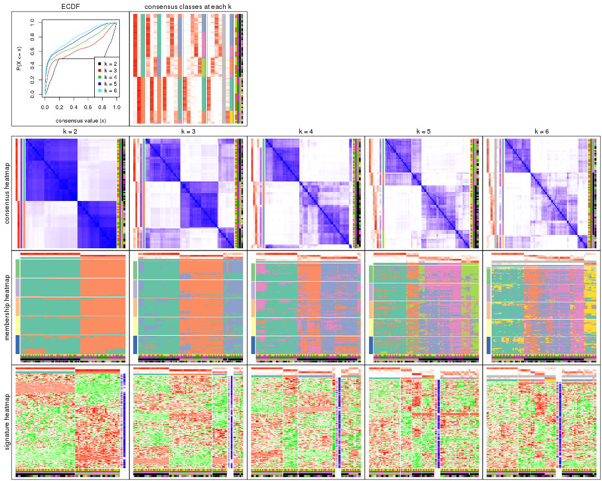

The plots are:

- The first row: a plot of the ECDF (Empirical cumulative distribution
  function) curves of the consensus matrix for each `k` and the heatmap of
  predicted classes for each `k`.
- The second row: heatmaps of the consensus matrix for each `k`.
- The third row: heatmaps of the membership matrix for each `k`.
- The fouth row: heatmaps of the signatures for each `k`.

All the plots in panels can be made by individual functions and they are
plotted later in this section.

`select_partition_number()` produces several plots showing different
statistics for choosing "optimized" `k`. There are following statistics:

- ECDF curves of the consensus matrix for each `k`;
- 1-PAC. [The PAC
  score](https://en.wikipedia.org/wiki/Consensus_clustering#Over-interpretation_potential_of_consensus_clustering)
  measures the proportion of the ambiguous subgrouping.
- Mean silhouette score.
- Concordance. The mean probability of fiting the consensus class ids in all
  partitions.
- Area increased. Denote $A_k$ as the area under the ECDF curve for current
  `k`, the area increased is defined as $A_k - A_{k-1}$.
- Rand index. The percent of pairs of samples that are both in a same cluster
  or both are not in a same cluster in the partition of k and k-1.
- Jaccard index. The ratio of pairs of samples are both in a same cluster in
  the partition of k and k-1 and the pairs of samples are both in a same
  cluster in the partition k or k-1.

The detailed explanations of these statistics can be found in [the cola
vignette](http://bioconductor.org/packages/devel/bioc/vignettes/cola/inst/doc/cola.html#toc_13).

Generally speaking, lower PAC score, higher mean silhouette score or higher
concordance corresponds to better partition. Rand index and Jaccard index
measure how similar the current partition is compared to partition with `k-1`.
If they are too similar, we won't accept `k` is better than `k-1`.

```r
select_partition_number(res)
```


The numeric values for all these statistics can be obtained by `get_stats()`.

```r
get_stats(res)
```

```
#>   k 1-PAC mean_silhouette concordance area_increased  Rand Jaccard
#> 2 2 0.543           0.927       0.924         0.4885 0.504   0.504
#> 3 3 0.525           0.713       0.811         0.3018 0.844   0.693
#> 4 4 0.512           0.550       0.728         0.1289 0.937   0.831
#> 5 5 0.553           0.487       0.656         0.0746 0.853   0.568
#> 6 6 0.573           0.506       0.626         0.0405 0.909   0.658
```

`suggest_best_k()` suggests the best $k$ based on these statistics. The rules are as follows:

- All $k$ with Jaccard index larger than 0.95 are removed because the increase of
  the partition number does not provides enough extra information. If all $k$ are removed,
  the best $k$ is assigned by `NA`.
- For $k$ with 1-PAC larger than 0.9, the maximal $k$ is taken as the "best k". Other $k$ is called "optional k".
- If it does not fit the second rule. The $k$ with the highest vote of highest
  1-PAC, mean silhouette and concordance is taken as the "best k".

```r
suggest_best_k(res)
```

```
#> [1] 2
```


Following shows the table of the partitions (You need to click the **show/hide
code output** link to see it). The membership matrix (columns with name `p*`)
is inferred by
[`clue::cl_consensus()`](https://www.rdocumentation.org/link/cl_consensus?package=clue)
function with the `SE` method. Basically the value in the membership matrix
represents the probability to belong to a certain group. The finall class
label for an item is determined with the group with highest probability it
belongs to.

In `get_classes()` function, the entropy is calculated from the membership
matrix and the silhouette score is calculated from the consensus matrix.


<script>
$( function() {
	$( '#tabs-CV-kmeans-get-classes' ).tabs();
} );
</script>
<div id='tabs-CV-kmeans-get-classes'>
<ul>
<li><a href='#tab-CV-kmeans-get-classes-1'>k = 2</a></li>
<li><a href='#tab-CV-kmeans-get-classes-2'>k = 3</a></li>
<li><a href='#tab-CV-kmeans-get-classes-3'>k = 4</a></li>
<li><a href='#tab-CV-kmeans-get-classes-4'>k = 5</a></li>
<li><a href='#tab-CV-kmeans-get-classes-5'>k = 6</a></li>
</ul>

<div id='tab-CV-kmeans-get-classes-1'>
<p><a id='tab-CV-kmeans-get-classes-1-a' style='color:#0366d6' href='#'>show/hide code output</a></p>
<pre><code class="r">cbind(get_classes(res, k = 2), get_membership(res, k = 2))
</code></pre>

<pre><code>#&gt;            class entropy silhouette    p1    p2
#&gt; GSM1269647     1   0.402      0.903 0.920 0.080
#&gt; GSM1269655     1   0.242      0.937 0.960 0.040
#&gt; GSM1269663     1   0.327      0.938 0.940 0.060
#&gt; GSM1269671     1   0.430      0.892 0.912 0.088
#&gt; GSM1269679     1   0.469      0.934 0.900 0.100
#&gt; GSM1269693     1   0.506      0.927 0.888 0.112
#&gt; GSM1269701     1   0.469      0.934 0.900 0.100
#&gt; GSM1269709     1   0.529      0.932 0.880 0.120
#&gt; GSM1269715     1   0.506      0.929 0.888 0.112
#&gt; GSM1269717     1   0.494      0.929 0.892 0.108
#&gt; GSM1269721     1   0.295      0.914 0.948 0.052
#&gt; GSM1269723     1   0.373      0.940 0.928 0.072
#&gt; GSM1269645     2   0.343      0.942 0.064 0.936
#&gt; GSM1269653     2   0.224      0.937 0.036 0.964
#&gt; GSM1269661     2   0.373      0.940 0.072 0.928
#&gt; GSM1269669     2   0.402      0.935 0.080 0.920
#&gt; GSM1269677     2   0.416      0.911 0.084 0.916
#&gt; GSM1269685     2   0.242      0.945 0.040 0.960
#&gt; GSM1269691     2   0.388      0.939 0.076 0.924
#&gt; GSM1269699     2   0.443      0.900 0.092 0.908
#&gt; GSM1269707     2   0.373      0.916 0.072 0.928
#&gt; GSM1269651     1   0.242      0.911 0.960 0.040
#&gt; GSM1269659     1   0.358      0.922 0.932 0.068
#&gt; GSM1269667     1   0.456      0.935 0.904 0.096
#&gt; GSM1269675     1   0.327      0.905 0.940 0.060
#&gt; GSM1269683     1   0.494      0.931 0.892 0.108
#&gt; GSM1269689     1   0.494      0.899 0.892 0.108
#&gt; GSM1269697     1   0.443      0.936 0.908 0.092
#&gt; GSM1269705     1   0.373      0.900 0.928 0.072
#&gt; GSM1269713     1   0.402      0.939 0.920 0.080
#&gt; GSM1269719     1   0.416      0.940 0.916 0.084
#&gt; GSM1269725     1   0.311      0.939 0.944 0.056
#&gt; GSM1269727     1   0.469      0.934 0.900 0.100
#&gt; GSM1269649     2   0.204      0.945 0.032 0.968
#&gt; GSM1269657     2   0.402      0.914 0.080 0.920
#&gt; GSM1269665     2   0.402      0.935 0.080 0.920
#&gt; GSM1269673     2   0.327      0.943 0.060 0.940
#&gt; GSM1269681     2   0.494      0.888 0.108 0.892
#&gt; GSM1269687     2   0.388      0.938 0.076 0.924
#&gt; GSM1269695     2   0.118      0.943 0.016 0.984
#&gt; GSM1269703     2   0.373      0.940 0.072 0.928
#&gt; GSM1269711     2   0.242      0.944 0.040 0.960
#&gt; GSM1269646     1   0.430      0.908 0.912 0.088
#&gt; GSM1269654     1   0.311      0.939 0.944 0.056
#&gt; GSM1269662     1   0.184      0.932 0.972 0.028
#&gt; GSM1269670     1   0.430      0.892 0.912 0.088
#&gt; GSM1269678     1   0.469      0.934 0.900 0.100
#&gt; GSM1269692     1   0.494      0.929 0.892 0.108
#&gt; GSM1269700     1   0.456      0.935 0.904 0.096
#&gt; GSM1269708     1   0.518      0.935 0.884 0.116
#&gt; GSM1269714     1   0.494      0.931 0.892 0.108
#&gt; GSM1269716     1   0.494      0.929 0.892 0.108
#&gt; GSM1269720     1   0.388      0.903 0.924 0.076
#&gt; GSM1269722     1   0.416      0.938 0.916 0.084
#&gt; GSM1269644     2   0.311      0.943 0.056 0.944
#&gt; GSM1269652     2   0.242      0.938 0.040 0.960
#&gt; GSM1269660     2   0.373      0.940 0.072 0.928
#&gt; GSM1269668     2   0.402      0.935 0.080 0.920
#&gt; GSM1269676     2   0.416      0.912 0.084 0.916
#&gt; GSM1269684     2   0.416      0.935 0.084 0.916
#&gt; GSM1269690     2   0.388      0.939 0.076 0.924
#&gt; GSM1269698     2   0.456      0.897 0.096 0.904
#&gt; GSM1269706     2   0.373      0.916 0.072 0.928
#&gt; GSM1269650     1   0.278      0.909 0.952 0.048
#&gt; GSM1269658     1   0.358      0.924 0.932 0.068
#&gt; GSM1269666     1   0.430      0.937 0.912 0.088
#&gt; GSM1269674     1   0.343      0.903 0.936 0.064
#&gt; GSM1269682     1   0.506      0.929 0.888 0.112
#&gt; GSM1269688     1   0.494      0.897 0.892 0.108
#&gt; GSM1269696     1   0.443      0.921 0.908 0.092
#&gt; GSM1269704     1   0.388      0.897 0.924 0.076
#&gt; GSM1269712     1   0.430      0.937 0.912 0.088
#&gt; GSM1269718     1   0.402      0.940 0.920 0.080
#&gt; GSM1269724     1   0.373      0.939 0.928 0.072
#&gt; GSM1269726     1   0.469      0.934 0.900 0.100
#&gt; GSM1269648     2   0.118      0.943 0.016 0.984
#&gt; GSM1269656     2   0.311      0.925 0.056 0.944
#&gt; GSM1269664     2   0.416      0.934 0.084 0.916
#&gt; GSM1269672     2   0.358      0.941 0.068 0.932
#&gt; GSM1269680     2   0.456      0.896 0.096 0.904
#&gt; GSM1269686     2   0.388      0.938 0.076 0.924
#&gt; GSM1269694     2   0.118      0.943 0.016 0.984
#&gt; GSM1269702     2   0.184      0.945 0.028 0.972
#&gt; GSM1269710     2   0.163      0.944 0.024 0.976
</code></pre>

<script>
$('#tab-CV-kmeans-get-classes-1-a').parent().next().next().hide();
$('#tab-CV-kmeans-get-classes-1-a').click(function(){
  $('#tab-CV-kmeans-get-classes-1-a').parent().next().next().toggle();
  return(false);
});
</script>
</div>

<div id='tab-CV-kmeans-get-classes-2'>
<p><a id='tab-CV-kmeans-get-classes-2-a' style='color:#0366d6' href='#'>show/hide code output</a></p>
<pre><code class="r">cbind(get_classes(res, k = 3), get_membership(res, k = 3))
</code></pre>

<pre><code>#&gt;            class entropy silhouette    p1    p2    p3
#&gt; GSM1269647     1   0.729    -0.3868 0.508 0.028 0.464
#&gt; GSM1269655     1   0.516     0.6266 0.764 0.004 0.232
#&gt; GSM1269663     1   0.525     0.7013 0.792 0.020 0.188
#&gt; GSM1269671     3   0.679     0.7125 0.292 0.036 0.672
#&gt; GSM1269679     1   0.164     0.7813 0.964 0.016 0.020
#&gt; GSM1269693     1   0.541     0.7041 0.812 0.052 0.136
#&gt; GSM1269701     1   0.279     0.7761 0.928 0.028 0.044
#&gt; GSM1269709     1   0.315     0.7625 0.916 0.044 0.040
#&gt; GSM1269715     1   0.516     0.7063 0.820 0.040 0.140
#&gt; GSM1269717     1   0.437     0.7425 0.864 0.040 0.096
#&gt; GSM1269721     3   0.572     0.6972 0.240 0.016 0.744
#&gt; GSM1269723     1   0.364     0.7736 0.892 0.024 0.084
#&gt; GSM1269645     2   0.378     0.8882 0.044 0.892 0.064
#&gt; GSM1269653     2   0.338     0.8859 0.012 0.896 0.092
#&gt; GSM1269661     2   0.408     0.8805 0.072 0.880 0.048
#&gt; GSM1269669     2   0.337     0.8846 0.052 0.908 0.040
#&gt; GSM1269677     2   0.566     0.7766 0.004 0.712 0.284
#&gt; GSM1269685     2   0.145     0.8944 0.008 0.968 0.024
#&gt; GSM1269691     2   0.348     0.8893 0.052 0.904 0.044
#&gt; GSM1269699     2   0.580     0.7701 0.008 0.712 0.280
#&gt; GSM1269707     2   0.497     0.8006 0.000 0.764 0.236
#&gt; GSM1269651     3   0.580     0.7030 0.280 0.008 0.712
#&gt; GSM1269659     3   0.742     0.4282 0.388 0.040 0.572
#&gt; GSM1269667     1   0.355     0.7616 0.896 0.024 0.080
#&gt; GSM1269675     3   0.697     0.6760 0.356 0.028 0.616
#&gt; GSM1269683     1   0.432     0.7491 0.868 0.044 0.088
#&gt; GSM1269689     3   0.812     0.6008 0.396 0.072 0.532
#&gt; GSM1269697     1   0.721     0.0121 0.604 0.036 0.360
#&gt; GSM1269705     3   0.701     0.6869 0.364 0.028 0.608
#&gt; GSM1269713     1   0.383     0.7424 0.880 0.020 0.100
#&gt; GSM1269719     1   0.429     0.7331 0.840 0.008 0.152
#&gt; GSM1269725     1   0.364     0.7531 0.892 0.024 0.084
#&gt; GSM1269727     1   0.231     0.7831 0.944 0.024 0.032
#&gt; GSM1269649     2   0.245     0.8873 0.012 0.936 0.052
#&gt; GSM1269657     2   0.566     0.7768 0.004 0.712 0.284
#&gt; GSM1269665     2   0.386     0.8771 0.072 0.888 0.040
#&gt; GSM1269673     2   0.269     0.8931 0.036 0.932 0.032
#&gt; GSM1269681     3   0.641    -0.2588 0.004 0.420 0.576
#&gt; GSM1269687     2   0.358     0.8912 0.056 0.900 0.044
#&gt; GSM1269695     2   0.304     0.8816 0.008 0.908 0.084
#&gt; GSM1269703     2   0.293     0.8922 0.040 0.924 0.036
#&gt; GSM1269711     2   0.249     0.8854 0.016 0.936 0.048
#&gt; GSM1269646     1   0.737    -0.3363 0.524 0.032 0.444
#&gt; GSM1269654     1   0.397     0.7524 0.860 0.008 0.132
#&gt; GSM1269662     3   0.668     0.2580 0.484 0.008 0.508
#&gt; GSM1269670     3   0.660     0.7139 0.296 0.028 0.676
#&gt; GSM1269678     1   0.255     0.7831 0.936 0.024 0.040
#&gt; GSM1269692     1   0.625     0.6404 0.756 0.056 0.188
#&gt; GSM1269700     1   0.266     0.7743 0.932 0.024 0.044
#&gt; GSM1269708     1   0.348     0.7573 0.904 0.044 0.052
#&gt; GSM1269714     1   0.441     0.7504 0.860 0.036 0.104
#&gt; GSM1269716     1   0.426     0.7497 0.868 0.036 0.096
#&gt; GSM1269720     3   0.608     0.6887 0.216 0.036 0.748
#&gt; GSM1269722     1   0.241     0.7849 0.940 0.020 0.040
#&gt; GSM1269644     2   0.315     0.8932 0.040 0.916 0.044
#&gt; GSM1269652     2   0.265     0.8891 0.012 0.928 0.060
#&gt; GSM1269660     2   0.437     0.8788 0.076 0.868 0.056
#&gt; GSM1269668     2   0.374     0.8780 0.072 0.892 0.036
#&gt; GSM1269676     2   0.562     0.7803 0.004 0.716 0.280
#&gt; GSM1269684     2   0.218     0.8960 0.032 0.948 0.020
#&gt; GSM1269690     2   0.348     0.8893 0.052 0.904 0.044
#&gt; GSM1269698     2   0.586     0.7606 0.008 0.704 0.288
#&gt; GSM1269706     2   0.497     0.8006 0.000 0.764 0.236
#&gt; GSM1269650     3   0.569     0.7035 0.268 0.008 0.724
#&gt; GSM1269658     3   0.746     0.3957 0.400 0.040 0.560
#&gt; GSM1269666     1   0.275     0.7783 0.924 0.012 0.064
#&gt; GSM1269674     3   0.657     0.7071 0.308 0.024 0.668
#&gt; GSM1269682     1   0.404     0.7577 0.880 0.040 0.080
#&gt; GSM1269688     3   0.800     0.6594 0.360 0.072 0.568
#&gt; GSM1269696     1   0.703    -0.1273 0.580 0.024 0.396
#&gt; GSM1269704     3   0.691     0.7034 0.344 0.028 0.628
#&gt; GSM1269712     1   0.205     0.7821 0.952 0.020 0.028
#&gt; GSM1269718     1   0.368     0.7539 0.876 0.008 0.116
#&gt; GSM1269724     1   0.515     0.6305 0.800 0.020 0.180
#&gt; GSM1269726     1   0.343     0.7690 0.904 0.032 0.064
#&gt; GSM1269648     2   0.258     0.8843 0.008 0.928 0.064
#&gt; GSM1269656     2   0.463     0.8416 0.004 0.808 0.188
#&gt; GSM1269664     2   0.355     0.8826 0.064 0.900 0.036
#&gt; GSM1269672     2   0.303     0.8870 0.048 0.920 0.032
#&gt; GSM1269680     2   0.590     0.7382 0.004 0.680 0.316
#&gt; GSM1269686     2   0.324     0.8873 0.056 0.912 0.032
#&gt; GSM1269694     2   0.296     0.8821 0.008 0.912 0.080
#&gt; GSM1269702     2   0.290     0.8938 0.016 0.920 0.064
#&gt; GSM1269710     2   0.188     0.8887 0.004 0.952 0.044
</code></pre>

<script>
$('#tab-CV-kmeans-get-classes-2-a').parent().next().next().hide();
$('#tab-CV-kmeans-get-classes-2-a').click(function(){
  $('#tab-CV-kmeans-get-classes-2-a').parent().next().next().toggle();
  return(false);
});
</script>
</div>

<div id='tab-CV-kmeans-get-classes-3'>
<p><a id='tab-CV-kmeans-get-classes-3-a' style='color:#0366d6' href='#'>show/hide code output</a></p>
<pre><code class="r">cbind(get_classes(res, k = 4), get_membership(res, k = 4))
</code></pre>

<pre><code>#&gt;            class entropy silhouette    p1    p2    p3    p4
#&gt; GSM1269647     2   0.658     0.4303 0.004 0.540 0.384 0.072
#&gt; GSM1269655     3   0.683     0.5880 0.008 0.236 0.620 0.136
#&gt; GSM1269663     3   0.646     0.6342 0.008 0.120 0.660 0.212
#&gt; GSM1269671     2   0.330     0.6851 0.000 0.876 0.076 0.048
#&gt; GSM1269679     3   0.238     0.7317 0.000 0.052 0.920 0.028
#&gt; GSM1269693     3   0.623     0.6342 0.012 0.068 0.656 0.264
#&gt; GSM1269701     3   0.298     0.7081 0.000 0.084 0.888 0.028
#&gt; GSM1269709     3   0.425     0.7189 0.004 0.104 0.828 0.064
#&gt; GSM1269715     3   0.623     0.6305 0.008 0.072 0.648 0.272
#&gt; GSM1269717     3   0.560     0.6801 0.004 0.060 0.704 0.232
#&gt; GSM1269721     2   0.622     0.6359 0.012 0.688 0.100 0.200
#&gt; GSM1269723     3   0.413     0.7192 0.000 0.108 0.828 0.064
#&gt; GSM1269645     1   0.355     0.6779 0.868 0.020 0.016 0.096
#&gt; GSM1269653     1   0.398     0.6217 0.796 0.012 0.000 0.192
#&gt; GSM1269661     1   0.334     0.6959 0.880 0.008 0.032 0.080
#&gt; GSM1269669     1   0.277     0.6976 0.908 0.008 0.024 0.060
#&gt; GSM1269677     4   0.621     0.3860 0.460 0.052 0.000 0.488
#&gt; GSM1269685     1   0.291     0.6932 0.888 0.020 0.000 0.092
#&gt; GSM1269691     1   0.307     0.7019 0.888 0.012 0.012 0.088
#&gt; GSM1269699     1   0.701    -0.5191 0.452 0.116 0.000 0.432
#&gt; GSM1269707     1   0.630    -0.3582 0.516 0.060 0.000 0.424
#&gt; GSM1269651     2   0.478     0.6815 0.004 0.796 0.088 0.112
#&gt; GSM1269659     2   0.852     0.2843 0.028 0.400 0.268 0.304
#&gt; GSM1269667     3   0.415     0.6600 0.000 0.152 0.812 0.036
#&gt; GSM1269675     2   0.391     0.7041 0.000 0.836 0.120 0.044
#&gt; GSM1269683     3   0.506     0.7064 0.004 0.068 0.768 0.160
#&gt; GSM1269689     2   0.677     0.5771 0.016 0.604 0.296 0.084
#&gt; GSM1269697     3   0.629    -0.1396 0.004 0.436 0.512 0.048
#&gt; GSM1269705     2   0.473     0.6929 0.004 0.780 0.172 0.044
#&gt; GSM1269713     3   0.409     0.6672 0.000 0.140 0.820 0.040
#&gt; GSM1269719     3   0.696     0.6165 0.008 0.180 0.616 0.196
#&gt; GSM1269725     3   0.440     0.6458 0.000 0.152 0.800 0.048
#&gt; GSM1269727     3   0.392     0.7343 0.004 0.044 0.844 0.108
#&gt; GSM1269649     1   0.348     0.6971 0.872 0.032 0.008 0.088
#&gt; GSM1269657     1   0.601    -0.5283 0.484 0.040 0.000 0.476
#&gt; GSM1269665     1   0.363     0.6789 0.860 0.008 0.028 0.104
#&gt; GSM1269673     1   0.201     0.7086 0.932 0.004 0.004 0.060
#&gt; GSM1269681     4   0.749     0.5272 0.192 0.336 0.000 0.472
#&gt; GSM1269687     1   0.298     0.7088 0.896 0.012 0.016 0.076
#&gt; GSM1269695     1   0.375     0.6641 0.840 0.032 0.000 0.128
#&gt; GSM1269703     1   0.276     0.7047 0.908 0.012 0.016 0.064
#&gt; GSM1269711     1   0.409     0.6681 0.828 0.028 0.008 0.136
#&gt; GSM1269646     2   0.669     0.4177 0.004 0.532 0.384 0.080
#&gt; GSM1269654     3   0.625     0.6796 0.008 0.168 0.688 0.136
#&gt; GSM1269662     2   0.745     0.4808 0.004 0.532 0.204 0.260
#&gt; GSM1269670     2   0.353     0.6857 0.000 0.864 0.080 0.056
#&gt; GSM1269678     3   0.266     0.7416 0.000 0.036 0.908 0.056
#&gt; GSM1269692     3   0.727     0.5506 0.024 0.112 0.580 0.284
#&gt; GSM1269700     3   0.308     0.7062 0.000 0.096 0.880 0.024
#&gt; GSM1269708     3   0.370     0.7281 0.004 0.084 0.860 0.052
#&gt; GSM1269714     3   0.578     0.6758 0.008 0.076 0.712 0.204
#&gt; GSM1269716     3   0.522     0.6907 0.000 0.060 0.732 0.208
#&gt; GSM1269720     2   0.602     0.6275 0.016 0.692 0.064 0.228
#&gt; GSM1269722     3   0.354     0.7355 0.000 0.076 0.864 0.060
#&gt; GSM1269644     1   0.238     0.7069 0.916 0.004 0.008 0.072
#&gt; GSM1269652     1   0.365     0.6459 0.832 0.016 0.000 0.152
#&gt; GSM1269660     1   0.391     0.6839 0.844 0.008 0.032 0.116
#&gt; GSM1269668     1   0.276     0.6903 0.904 0.000 0.044 0.052
#&gt; GSM1269676     1   0.608    -0.5173 0.488 0.044 0.000 0.468
#&gt; GSM1269684     1   0.231     0.7089 0.920 0.008 0.004 0.068
#&gt; GSM1269690     1   0.314     0.7013 0.884 0.012 0.012 0.092
#&gt; GSM1269698     1   0.697    -0.5312 0.456 0.112 0.000 0.432
#&gt; GSM1269706     1   0.624    -0.3398 0.520 0.056 0.000 0.424
#&gt; GSM1269650     2   0.517     0.6829 0.004 0.768 0.096 0.132
#&gt; GSM1269658     2   0.853     0.2811 0.028 0.396 0.268 0.308
#&gt; GSM1269666     3   0.459     0.6992 0.000 0.116 0.800 0.084
#&gt; GSM1269674     2   0.324     0.7039 0.000 0.876 0.088 0.036
#&gt; GSM1269682     3   0.510     0.7026 0.004 0.068 0.764 0.164
#&gt; GSM1269688     2   0.635     0.6518 0.020 0.676 0.224 0.080
#&gt; GSM1269696     2   0.631     0.2919 0.004 0.496 0.452 0.048
#&gt; GSM1269704     2   0.485     0.6873 0.004 0.760 0.200 0.036
#&gt; GSM1269712     3   0.314     0.7406 0.000 0.024 0.876 0.100
#&gt; GSM1269718     3   0.619     0.6605 0.020 0.128 0.712 0.140
#&gt; GSM1269724     3   0.665     0.4610 0.004 0.236 0.628 0.132
#&gt; GSM1269726     3   0.462     0.7193 0.004 0.052 0.796 0.148
#&gt; GSM1269648     1   0.358     0.6654 0.852 0.032 0.000 0.116
#&gt; GSM1269656     1   0.534     0.0142 0.624 0.020 0.000 0.356
#&gt; GSM1269664     1   0.366     0.6741 0.864 0.008 0.040 0.088
#&gt; GSM1269672     1   0.233     0.7024 0.924 0.004 0.016 0.056
#&gt; GSM1269680     4   0.728     0.5783 0.380 0.152 0.000 0.468
#&gt; GSM1269686     1   0.298     0.7080 0.896 0.012 0.016 0.076
#&gt; GSM1269694     1   0.380     0.6608 0.836 0.032 0.000 0.132
#&gt; GSM1269702     1   0.303     0.6804 0.868 0.008 0.000 0.124
#&gt; GSM1269710     1   0.318     0.6858 0.876 0.028 0.000 0.096
</code></pre>

<script>
$('#tab-CV-kmeans-get-classes-3-a').parent().next().next().hide();
$('#tab-CV-kmeans-get-classes-3-a').click(function(){
  $('#tab-CV-kmeans-get-classes-3-a').parent().next().next().toggle();
  return(false);
});
</script>
</div>

<div id='tab-CV-kmeans-get-classes-4'>
<p><a id='tab-CV-kmeans-get-classes-4-a' style='color:#0366d6' href='#'>show/hide code output</a></p>
<pre><code class="r">cbind(get_classes(res, k = 5), get_membership(res, k = 5))
</code></pre>

<pre><code>#&gt;            class entropy silhouette    p1    p2    p3    p4    p5
#&gt; GSM1269647     3   0.604    0.29942 0.004 0.028 0.592 0.064 0.312
#&gt; GSM1269655     4   0.719   -0.02028 0.000 0.040 0.336 0.452 0.172
#&gt; GSM1269663     4   0.605    0.45446 0.000 0.064 0.172 0.668 0.096
#&gt; GSM1269671     5   0.380    0.62147 0.000 0.080 0.108 0.000 0.812
#&gt; GSM1269679     4   0.467   -0.00334 0.000 0.004 0.444 0.544 0.008
#&gt; GSM1269693     4   0.339    0.53966 0.028 0.036 0.052 0.872 0.012
#&gt; GSM1269701     3   0.493    0.22443 0.008 0.016 0.564 0.412 0.000
#&gt; GSM1269709     3   0.637    0.13355 0.012 0.020 0.456 0.448 0.064
#&gt; GSM1269715     4   0.332    0.54485 0.016 0.036 0.052 0.876 0.020
#&gt; GSM1269717     4   0.311    0.56680 0.024 0.024 0.080 0.872 0.000
#&gt; GSM1269721     5   0.642    0.61399 0.004 0.184 0.060 0.112 0.640
#&gt; GSM1269723     4   0.570    0.10405 0.004 0.020 0.392 0.548 0.036
#&gt; GSM1269645     1   0.460    0.68726 0.800 0.064 0.092 0.016 0.028
#&gt; GSM1269653     1   0.527    0.53361 0.676 0.256 0.048 0.004 0.016
#&gt; GSM1269661     1   0.500    0.71100 0.760 0.132 0.044 0.060 0.004
#&gt; GSM1269669     1   0.236    0.73190 0.916 0.024 0.032 0.028 0.000
#&gt; GSM1269677     2   0.526    0.69716 0.260 0.676 0.028 0.004 0.032
#&gt; GSM1269685     1   0.418    0.65363 0.736 0.240 0.008 0.000 0.016
#&gt; GSM1269691     1   0.411    0.70124 0.776 0.184 0.012 0.028 0.000
#&gt; GSM1269699     2   0.591    0.70241 0.208 0.652 0.028 0.000 0.112
#&gt; GSM1269707     2   0.580    0.66416 0.296 0.616 0.044 0.000 0.044
#&gt; GSM1269651     5   0.615    0.61857 0.000 0.112 0.144 0.076 0.668
#&gt; GSM1269659     5   0.845    0.34192 0.008 0.168 0.156 0.324 0.344
#&gt; GSM1269667     3   0.599    0.24865 0.008 0.016 0.520 0.404 0.052
#&gt; GSM1269675     5   0.412    0.60441 0.004 0.020 0.176 0.016 0.784
#&gt; GSM1269683     4   0.290    0.57113 0.020 0.008 0.080 0.884 0.008
#&gt; GSM1269689     3   0.741   -0.03922 0.036 0.080 0.456 0.048 0.380
#&gt; GSM1269697     3   0.626    0.29521 0.004 0.008 0.524 0.108 0.356
#&gt; GSM1269705     5   0.463    0.57163 0.000 0.028 0.224 0.020 0.728
#&gt; GSM1269713     3   0.563    0.26861 0.004 0.012 0.528 0.416 0.040
#&gt; GSM1269719     3   0.723    0.00331 0.008 0.068 0.440 0.396 0.088
#&gt; GSM1269725     3   0.483    0.32338 0.004 0.000 0.616 0.356 0.024
#&gt; GSM1269727     4   0.480    0.43978 0.012 0.016 0.260 0.700 0.012
#&gt; GSM1269649     1   0.496    0.69898 0.756 0.152 0.056 0.008 0.028
#&gt; GSM1269657     2   0.507    0.70238 0.256 0.688 0.020 0.004 0.032
#&gt; GSM1269665     1   0.503    0.69466 0.776 0.084 0.072 0.056 0.012
#&gt; GSM1269673     1   0.301    0.74287 0.876 0.076 0.036 0.012 0.000
#&gt; GSM1269681     2   0.645    0.37062 0.064 0.572 0.068 0.000 0.296
#&gt; GSM1269687     1   0.426    0.71826 0.780 0.172 0.016 0.028 0.004
#&gt; GSM1269695     1   0.473    0.57644 0.700 0.256 0.012 0.000 0.032
#&gt; GSM1269703     1   0.301    0.74110 0.884 0.060 0.040 0.008 0.008
#&gt; GSM1269711     1   0.496    0.64349 0.712 0.228 0.036 0.004 0.020
#&gt; GSM1269646     3   0.602    0.30367 0.004 0.024 0.592 0.068 0.312
#&gt; GSM1269654     4   0.671    0.07284 0.000 0.032 0.352 0.496 0.120
#&gt; GSM1269662     5   0.797    0.36097 0.000 0.088 0.240 0.288 0.384
#&gt; GSM1269670     5   0.391    0.61886 0.000 0.084 0.112 0.000 0.804
#&gt; GSM1269678     4   0.451    0.30200 0.012 0.000 0.340 0.644 0.004
#&gt; GSM1269692     4   0.565    0.47024 0.032 0.052 0.136 0.732 0.048
#&gt; GSM1269700     3   0.501    0.19336 0.008 0.012 0.548 0.428 0.004
#&gt; GSM1269708     4   0.646   -0.18423 0.012 0.028 0.436 0.464 0.060
#&gt; GSM1269714     4   0.190    0.56817 0.024 0.012 0.016 0.940 0.008
#&gt; GSM1269716     4   0.227    0.57136 0.016 0.008 0.064 0.912 0.000
#&gt; GSM1269720     5   0.629    0.61910 0.004 0.188 0.068 0.088 0.652
#&gt; GSM1269722     4   0.560   -0.00762 0.008 0.020 0.452 0.500 0.020
#&gt; GSM1269644     1   0.418    0.72448 0.796 0.152 0.028 0.016 0.008
#&gt; GSM1269652     1   0.486    0.57718 0.696 0.252 0.040 0.000 0.012
#&gt; GSM1269660     1   0.520    0.69355 0.752 0.088 0.108 0.048 0.004
#&gt; GSM1269668     1   0.332    0.70847 0.864 0.020 0.056 0.060 0.000
#&gt; GSM1269676     2   0.525    0.69524 0.272 0.668 0.024 0.004 0.032
#&gt; GSM1269684     1   0.354    0.73140 0.824 0.148 0.016 0.004 0.008
#&gt; GSM1269690     1   0.412    0.70271 0.780 0.176 0.012 0.032 0.000
#&gt; GSM1269698     2   0.571    0.71753 0.184 0.680 0.032 0.000 0.104
#&gt; GSM1269706     2   0.563    0.67388 0.288 0.632 0.036 0.000 0.044
#&gt; GSM1269650     5   0.665    0.60927 0.000 0.136 0.180 0.072 0.612
#&gt; GSM1269658     5   0.845    0.33449 0.008 0.168 0.156 0.328 0.340
#&gt; GSM1269666     3   0.541    0.08034 0.000 0.020 0.512 0.444 0.024
#&gt; GSM1269674     5   0.405    0.63219 0.004 0.020 0.128 0.036 0.812
#&gt; GSM1269682     4   0.243    0.57252 0.020 0.004 0.076 0.900 0.000
#&gt; GSM1269688     5   0.697    0.25613 0.032 0.072 0.356 0.032 0.508
#&gt; GSM1269696     3   0.643    0.22295 0.004 0.032 0.524 0.076 0.364
#&gt; GSM1269704     5   0.485    0.53604 0.000 0.036 0.248 0.016 0.700
#&gt; GSM1269712     4   0.454    0.20472 0.000 0.008 0.380 0.608 0.004
#&gt; GSM1269718     3   0.671    0.19487 0.024 0.060 0.552 0.324 0.040
#&gt; GSM1269724     3   0.574    0.38316 0.004 0.004 0.616 0.280 0.096
#&gt; GSM1269726     4   0.410    0.51356 0.012 0.016 0.196 0.772 0.004
#&gt; GSM1269648     1   0.470    0.60104 0.708 0.248 0.016 0.000 0.028
#&gt; GSM1269656     2   0.504    0.55009 0.376 0.592 0.004 0.004 0.024
#&gt; GSM1269664     1   0.424    0.69799 0.808 0.040 0.116 0.032 0.004
#&gt; GSM1269672     1   0.252    0.74465 0.908 0.036 0.036 0.020 0.000
#&gt; GSM1269680     2   0.632    0.69007 0.180 0.636 0.052 0.000 0.132
#&gt; GSM1269686     1   0.400    0.74781 0.824 0.112 0.024 0.032 0.008
#&gt; GSM1269694     1   0.478    0.57315 0.704 0.248 0.016 0.000 0.032
#&gt; GSM1269702     1   0.379    0.66226 0.744 0.248 0.000 0.004 0.004
#&gt; GSM1269710     1   0.430    0.66585 0.748 0.216 0.016 0.000 0.020
</code></pre>

<script>
$('#tab-CV-kmeans-get-classes-4-a').parent().next().next().hide();
$('#tab-CV-kmeans-get-classes-4-a').click(function(){
  $('#tab-CV-kmeans-get-classes-4-a').parent().next().next().toggle();
  return(false);
});
</script>
</div>

<div id='tab-CV-kmeans-get-classes-5'>
<p><a id='tab-CV-kmeans-get-classes-5-a' style='color:#0366d6' href='#'>show/hide code output</a></p>
<pre><code class="r">cbind(get_classes(res, k = 6), get_membership(res, k = 6))
</code></pre>

<pre><code>#&gt;            class entropy silhouette    p1    p2    p3    p4 p5    p6
#&gt; GSM1269647     3   0.627     0.3069 0.000 0.240 0.572 0.024 NA 0.028
#&gt; GSM1269655     3   0.766     0.0910 0.004 0.172 0.380 0.264 NA 0.004
#&gt; GSM1269663     4   0.694     0.3904 0.004 0.112 0.256 0.500 NA 0.004
#&gt; GSM1269671     2   0.306     0.6869 0.000 0.868 0.024 0.012 NA 0.068
#&gt; GSM1269679     3   0.393     0.4299 0.004 0.012 0.768 0.188 NA 0.004
#&gt; GSM1269693     4   0.429     0.6027 0.012 0.004 0.200 0.736 NA 0.000
#&gt; GSM1269701     3   0.341     0.5057 0.004 0.016 0.844 0.072 NA 0.004
#&gt; GSM1269709     3   0.511     0.4372 0.004 0.052 0.696 0.204 NA 0.012
#&gt; GSM1269715     4   0.506     0.5886 0.020 0.008 0.156 0.728 NA 0.028
#&gt; GSM1269717     4   0.453     0.6039 0.016 0.004 0.224 0.716 NA 0.008
#&gt; GSM1269721     2   0.761     0.5714 0.000 0.488 0.056 0.176 NA 0.116
#&gt; GSM1269723     3   0.446     0.4144 0.000 0.024 0.720 0.216 NA 0.004
#&gt; GSM1269645     1   0.470     0.6415 0.704 0.008 0.000 0.020 NA 0.048
#&gt; GSM1269653     1   0.535     0.5423 0.604 0.000 0.000 0.004 NA 0.232
#&gt; GSM1269661     1   0.527     0.6702 0.720 0.012 0.004 0.060 NA 0.116
#&gt; GSM1269669     1   0.267     0.7027 0.852 0.000 0.000 0.000 NA 0.020
#&gt; GSM1269677     6   0.623     0.6781 0.216 0.020 0.000 0.072 NA 0.604
#&gt; GSM1269685     1   0.461     0.6577 0.720 0.000 0.000 0.028 NA 0.188
#&gt; GSM1269691     1   0.455     0.6844 0.752 0.000 0.000 0.064 NA 0.128
#&gt; GSM1269699     6   0.484     0.7130 0.144 0.064 0.000 0.004 NA 0.732
#&gt; GSM1269707     6   0.473     0.7201 0.180 0.024 0.004 0.012 NA 0.732
#&gt; GSM1269651     2   0.592     0.6566 0.000 0.624 0.020 0.084 NA 0.048
#&gt; GSM1269659     4   0.817    -0.1736 0.004 0.252 0.072 0.376 NA 0.084
#&gt; GSM1269667     3   0.538     0.4778 0.016 0.068 0.708 0.108 NA 0.000
#&gt; GSM1269675     2   0.554     0.6269 0.000 0.684 0.116 0.040 NA 0.020
#&gt; GSM1269683     4   0.506     0.5298 0.032 0.008 0.292 0.636 NA 0.000
#&gt; GSM1269689     3   0.672     0.2112 0.012 0.272 0.528 0.008 NA 0.056
#&gt; GSM1269697     3   0.548     0.3309 0.000 0.288 0.592 0.008 NA 0.008
#&gt; GSM1269705     2   0.454     0.6593 0.000 0.764 0.128 0.012 NA 0.048
#&gt; GSM1269713     3   0.422     0.5060 0.004 0.052 0.796 0.084 NA 0.004
#&gt; GSM1269719     3   0.750     0.0883 0.008 0.060 0.352 0.280 NA 0.012
#&gt; GSM1269725     3   0.282     0.5259 0.000 0.020 0.876 0.028 NA 0.004
#&gt; GSM1269727     3   0.502    -0.0585 0.000 0.020 0.532 0.412 NA 0.000
#&gt; GSM1269649     1   0.477     0.6515 0.712 0.004 0.000 0.012 NA 0.160
#&gt; GSM1269657     6   0.574     0.6948 0.216 0.008 0.000 0.060 NA 0.636
#&gt; GSM1269665     1   0.543     0.6186 0.680 0.004 0.012 0.036 NA 0.080
#&gt; GSM1269673     1   0.366     0.7024 0.816 0.000 0.000 0.028 NA 0.052
#&gt; GSM1269681     6   0.615     0.3333 0.032 0.276 0.000 0.032 NA 0.576
#&gt; GSM1269687     1   0.418     0.6947 0.776 0.000 0.004 0.024 NA 0.136
#&gt; GSM1269695     1   0.472     0.5793 0.668 0.004 0.000 0.004 NA 0.256
#&gt; GSM1269703     1   0.374     0.7093 0.804 0.000 0.000 0.020 NA 0.056
#&gt; GSM1269711     1   0.522     0.6249 0.660 0.000 0.012 0.008 NA 0.212
#&gt; GSM1269646     3   0.651     0.2461 0.000 0.276 0.524 0.024 NA 0.028
#&gt; GSM1269654     3   0.735     0.0971 0.004 0.100 0.408 0.292 NA 0.004
#&gt; GSM1269662     2   0.791     0.3149 0.004 0.348 0.108 0.272 NA 0.024
#&gt; GSM1269670     2   0.335     0.6837 0.000 0.852 0.024 0.020 NA 0.076
#&gt; GSM1269678     3   0.395     0.2474 0.000 0.000 0.656 0.328 NA 0.000
#&gt; GSM1269692     4   0.586     0.5531 0.016 0.024 0.196 0.640 NA 0.008
#&gt; GSM1269700     3   0.308     0.4962 0.004 0.000 0.852 0.080 NA 0.004
#&gt; GSM1269708     3   0.493     0.4438 0.004 0.044 0.712 0.196 NA 0.012
#&gt; GSM1269714     4   0.405     0.6011 0.020 0.000 0.236 0.728 NA 0.004
#&gt; GSM1269716     4   0.422     0.6005 0.016 0.000 0.232 0.724 NA 0.008
#&gt; GSM1269720     2   0.754     0.5803 0.000 0.492 0.044 0.164 NA 0.136
#&gt; GSM1269722     3   0.366     0.4352 0.000 0.008 0.772 0.192 NA 0.000
#&gt; GSM1269644     1   0.403     0.6955 0.796 0.000 0.000 0.044 NA 0.088
#&gt; GSM1269652     1   0.508     0.5903 0.652 0.000 0.000 0.012 NA 0.228
#&gt; GSM1269660     1   0.534     0.6486 0.696 0.008 0.000 0.064 NA 0.084
#&gt; GSM1269668     1   0.396     0.6856 0.796 0.000 0.048 0.012 NA 0.016
#&gt; GSM1269676     6   0.607     0.6727 0.224 0.012 0.000 0.068 NA 0.608
#&gt; GSM1269684     1   0.435     0.6998 0.760 0.000 0.004 0.024 NA 0.148
#&gt; GSM1269690     1   0.442     0.6834 0.760 0.000 0.000 0.068 NA 0.128
#&gt; GSM1269698     6   0.451     0.7374 0.148 0.076 0.000 0.000 NA 0.744
#&gt; GSM1269706     6   0.459     0.7241 0.180 0.020 0.004 0.012 NA 0.740
#&gt; GSM1269650     2   0.650     0.6476 0.000 0.580 0.040 0.116 NA 0.044
#&gt; GSM1269658     4   0.819    -0.1318 0.004 0.240 0.076 0.380 NA 0.084
#&gt; GSM1269666     3   0.595     0.3749 0.000 0.048 0.608 0.204 NA 0.004
#&gt; GSM1269674     2   0.426     0.6900 0.000 0.796 0.052 0.036 NA 0.024
#&gt; GSM1269682     4   0.461     0.5050 0.028 0.000 0.332 0.624 NA 0.000
#&gt; GSM1269688     3   0.698    -0.1159 0.012 0.384 0.416 0.008 NA 0.064
#&gt; GSM1269696     3   0.608     0.2323 0.000 0.316 0.524 0.016 NA 0.012
#&gt; GSM1269704     2   0.559     0.5660 0.000 0.640 0.224 0.004 NA 0.068
#&gt; GSM1269712     3   0.478     0.3365 0.000 0.008 0.664 0.268 NA 0.008
#&gt; GSM1269718     3   0.722     0.3136 0.040 0.040 0.488 0.164 NA 0.008
#&gt; GSM1269724     3   0.631     0.4598 0.008 0.100 0.616 0.092 NA 0.008
#&gt; GSM1269726     3   0.519    -0.2377 0.012 0.008 0.480 0.460 NA 0.000
#&gt; GSM1269648     1   0.482     0.5865 0.664 0.000 0.000 0.008 NA 0.244
#&gt; GSM1269656     6   0.478     0.5958 0.304 0.016 0.000 0.020 NA 0.644
#&gt; GSM1269664     1   0.487     0.6453 0.720 0.008 0.020 0.024 NA 0.032
#&gt; GSM1269672     1   0.300     0.7147 0.856 0.000 0.000 0.024 NA 0.024
#&gt; GSM1269680     6   0.614     0.7008 0.132 0.120 0.000 0.040 NA 0.648
#&gt; GSM1269686     1   0.393     0.7109 0.800 0.000 0.004 0.020 NA 0.104
#&gt; GSM1269694     1   0.499     0.5339 0.624 0.004 0.000 0.004 NA 0.292
#&gt; GSM1269702     1   0.433     0.6294 0.708 0.000 0.000 0.020 NA 0.240
#&gt; GSM1269710     1   0.467     0.6409 0.704 0.000 0.000 0.012 NA 0.192
</code></pre>

<script>
$('#tab-CV-kmeans-get-classes-5-a').parent().next().next().hide();
$('#tab-CV-kmeans-get-classes-5-a').click(function(){
  $('#tab-CV-kmeans-get-classes-5-a').parent().next().next().toggle();
  return(false);
});
</script>
</div>
</div>

Heatmaps for the consensus matrix. It visualizes the probability of two
samples to be in a same group.


<script>
$( function() {
	$( '#tabs-CV-kmeans-consensus-heatmap' ).tabs();
} );
</script>
<div id='tabs-CV-kmeans-consensus-heatmap'>
<ul>
<li><a href='#tab-CV-kmeans-consensus-heatmap-1'>k = 2</a></li>
<li><a href='#tab-CV-kmeans-consensus-heatmap-2'>k = 3</a></li>
<li><a href='#tab-CV-kmeans-consensus-heatmap-3'>k = 4</a></li>
<li><a href='#tab-CV-kmeans-consensus-heatmap-4'>k = 5</a></li>
<li><a href='#tab-CV-kmeans-consensus-heatmap-5'>k = 6</a></li>
</ul>
<div id='tab-CV-kmeans-consensus-heatmap-1'>
<pre><code class="r">consensus_heatmap(res, k = 2)
</code></pre>

<p></p>

</div>
<div id='tab-CV-kmeans-consensus-heatmap-2'>
<pre><code class="r">consensus_heatmap(res, k = 3)
</code></pre>

<p></p>

</div>
<div id='tab-CV-kmeans-consensus-heatmap-3'>
<pre><code class="r">consensus_heatmap(res, k = 4)
</code></pre>

<p></p>

</div>
<div id='tab-CV-kmeans-consensus-heatmap-4'>
<pre><code class="r">consensus_heatmap(res, k = 5)
</code></pre>

<p></p>

</div>
<div id='tab-CV-kmeans-consensus-heatmap-5'>
<pre><code class="r">consensus_heatmap(res, k = 6)
</code></pre>

<p></p>

</div>
</div>

Heatmaps for the membership of samples in all partitions to see how consistent they are:


<script>
$( function() {
	$( '#tabs-CV-kmeans-membership-heatmap' ).tabs();
} );
</script>
<div id='tabs-CV-kmeans-membership-heatmap'>
<ul>
<li><a href='#tab-CV-kmeans-membership-heatmap-1'>k = 2</a></li>
<li><a href='#tab-CV-kmeans-membership-heatmap-2'>k = 3</a></li>
<li><a href='#tab-CV-kmeans-membership-heatmap-3'>k = 4</a></li>
<li><a href='#tab-CV-kmeans-membership-heatmap-4'>k = 5</a></li>
<li><a href='#tab-CV-kmeans-membership-heatmap-5'>k = 6</a></li>
</ul>
<div id='tab-CV-kmeans-membership-heatmap-1'>
<pre><code class="r">membership_heatmap(res, k = 2)
</code></pre>

<p></p>

</div>
<div id='tab-CV-kmeans-membership-heatmap-2'>
<pre><code class="r">membership_heatmap(res, k = 3)
</code></pre>

<p></p>

</div>
<div id='tab-CV-kmeans-membership-heatmap-3'>
<pre><code class="r">membership_heatmap(res, k = 4)
</code></pre>

<p></p>

</div>
<div id='tab-CV-kmeans-membership-heatmap-4'>
<pre><code class="r">membership_heatmap(res, k = 5)
</code></pre>

<p></p>

</div>
<div id='tab-CV-kmeans-membership-heatmap-5'>
<pre><code class="r">membership_heatmap(res, k = 6)
</code></pre>

<p></p>

</div>
</div>

As soon as we have had the classes for columns, we can look for signatures
which are significantly different between classes which can be candidate marks
for certain classes. Following are the heatmaps for signatures.


Signature heatmaps where rows are scaled:


<script>
$( function() {
	$( '#tabs-CV-kmeans-get-signatures' ).tabs();
} );
</script>
<div id='tabs-CV-kmeans-get-signatures'>
<ul>
<li><a href='#tab-CV-kmeans-get-signatures-1'>k = 2</a></li>
<li><a href='#tab-CV-kmeans-get-signatures-2'>k = 3</a></li>
<li><a href='#tab-CV-kmeans-get-signatures-3'>k = 4</a></li>
<li><a href='#tab-CV-kmeans-get-signatures-4'>k = 5</a></li>
<li><a href='#tab-CV-kmeans-get-signatures-5'>k = 6</a></li>
</ul>
<div id='tab-CV-kmeans-get-signatures-1'>
<pre><code class="r">get_signatures(res, k = 2)
</code></pre>

<p></p>

</div>
<div id='tab-CV-kmeans-get-signatures-2'>
<pre><code class="r">get_signatures(res, k = 3)
</code></pre>

<p></p>

</div>
<div id='tab-CV-kmeans-get-signatures-3'>
<pre><code class="r">get_signatures(res, k = 4)
</code></pre>

<p></p>

</div>
<div id='tab-CV-kmeans-get-signatures-4'>
<pre><code class="r">get_signatures(res, k = 5)
</code></pre>

<p></p>

</div>
<div id='tab-CV-kmeans-get-signatures-5'>
<pre><code class="r">get_signatures(res, k = 6)
</code></pre>

<p>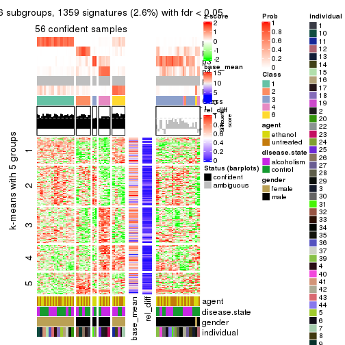</p>

</div>
</div>


Signature heatmaps where rows are not scaled:


<script>
$( function() {
	$( '#tabs-CV-kmeans-get-signatures-no-scale' ).tabs();
} );
</script>
<div id='tabs-CV-kmeans-get-signatures-no-scale'>
<ul>
<li><a href='#tab-CV-kmeans-get-signatures-no-scale-1'>k = 2</a></li>
<li><a href='#tab-CV-kmeans-get-signatures-no-scale-2'>k = 3</a></li>
<li><a href='#tab-CV-kmeans-get-signatures-no-scale-3'>k = 4</a></li>
<li><a href='#tab-CV-kmeans-get-signatures-no-scale-4'>k = 5</a></li>
<li><a href='#tab-CV-kmeans-get-signatures-no-scale-5'>k = 6</a></li>
</ul>
<div id='tab-CV-kmeans-get-signatures-no-scale-1'>
<pre><code class="r">get_signatures(res, k = 2, scale_rows = FALSE)
</code></pre>

<p></p>

</div>
<div id='tab-CV-kmeans-get-signatures-no-scale-2'>
<pre><code class="r">get_signatures(res, k = 3, scale_rows = FALSE)
</code></pre>

<p></p>

</div>
<div id='tab-CV-kmeans-get-signatures-no-scale-3'>
<pre><code class="r">get_signatures(res, k = 4, scale_rows = FALSE)
</code></pre>

<p></p>

</div>
<div id='tab-CV-kmeans-get-signatures-no-scale-4'>
<pre><code class="r">get_signatures(res, k = 5, scale_rows = FALSE)
</code></pre>

<p></p>

</div>
<div id='tab-CV-kmeans-get-signatures-no-scale-5'>
<pre><code class="r">get_signatures(res, k = 6, scale_rows = FALSE)
</code></pre>

<p></p>

</div>
</div>


Compare the overlap of signatures from different k:

```r
compare_signatures(res)
```


`get_signature()` returns a data frame invisibly. TO get the list of signatures, the function
call should be assigned to a variable explicitly. In following code, if `plot` argument is set
to `FALSE`, no heatmap is plotted while only the differential analysis is performed.

```r
# code only for demonstration
tb = get_signature(res, k = ..., plot = FALSE)
```

An example of the output of `tb` is:

```
#>   which_row         fdr    mean_1    mean_2 scaled_mean_1 scaled_mean_2 km
#> 1        38 0.042760348  8.373488  9.131774    -0.5533452     0.5164555  1
#> 2        40 0.018707592  7.106213  8.469186    -0.6173731     0.5762149  1
#> 3        55 0.019134737 10.221463 11.207825    -0.6159697     0.5749050  1
#> 4        59 0.006059896  5.921854  7.869574    -0.6899429     0.6439467  1
#> 5        60 0.018055526  8.928898 10.211722    -0.6204761     0.5791110  1
#> 6        98 0.009384629 15.714769 14.887706     0.6635654    -0.6193277  2
...
```

The columns in `tb` are:

1. `which_row`: row indices corresponding to the input matrix.
2. `fdr`: FDR for the differential test. 
3. `mean_x`: The mean value in group x.
4. `scaled_mean_x`: The mean value in group x after rows are scaled.
5. `km`: Row groups if k-means clustering is applied to rows.


UMAP plot which shows how samples are separated.


<script>
$( function() {
	$( '#tabs-CV-kmeans-dimension-reduction' ).tabs();
} );
</script>
<div id='tabs-CV-kmeans-dimension-reduction'>
<ul>
<li><a href='#tab-CV-kmeans-dimension-reduction-1'>k = 2</a></li>
<li><a href='#tab-CV-kmeans-dimension-reduction-2'>k = 3</a></li>
<li><a href='#tab-CV-kmeans-dimension-reduction-3'>k = 4</a></li>
<li><a href='#tab-CV-kmeans-dimension-reduction-4'>k = 5</a></li>
<li><a href='#tab-CV-kmeans-dimension-reduction-5'>k = 6</a></li>
</ul>
<div id='tab-CV-kmeans-dimension-reduction-1'>
<pre><code class="r">dimension_reduction(res, k = 2, method = &quot;UMAP&quot;)
</code></pre>

<p></p>

</div>
<div id='tab-CV-kmeans-dimension-reduction-2'>
<pre><code class="r">dimension_reduction(res, k = 3, method = &quot;UMAP&quot;)
</code></pre>

<p></p>

</div>
<div id='tab-CV-kmeans-dimension-reduction-3'>
<pre><code class="r">dimension_reduction(res, k = 4, method = &quot;UMAP&quot;)
</code></pre>

<p></p>

</div>
<div id='tab-CV-kmeans-dimension-reduction-4'>
<pre><code class="r">dimension_reduction(res, k = 5, method = &quot;UMAP&quot;)
</code></pre>

<p></p>

</div>
<div id='tab-CV-kmeans-dimension-reduction-5'>
<pre><code class="r">dimension_reduction(res, k = 6, method = &quot;UMAP&quot;)
</code></pre>

<p></p>

</div>
</div>


Following heatmap shows how subgroups are split when increasing `k`:

```r
collect_classes(res)
```


Test correlation between subgroups and known annotations. If the known
annotation is numeric, one-way ANOVA test is applied, and if the known
annotation is discrete, chi-squared contingency table test is applied.

```r
test_to_known_factors(res)
```

```
#>            n agent(p) disease.state(p) gender(p) individual(p) k
#> CV:kmeans 84    1.000            1.000  3.81e-19      8.65e-05 2
#> CV:kmeans 76    0.969            0.337  3.14e-17      5.31e-07 3
#> CV:kmeans 68    0.994            0.194  1.14e-14      8.59e-09 4
#> CV:kmeans 53    0.993            0.565  1.83e-11      5.22e-07 5
#> CV:kmeans 56    0.551            0.431  2.01e-11      7.21e-09 6
```


If matrix rows can be associated to genes, consider to use `GO_Enrichment(res,
...)` to perform function enrichment for the signature genes.


 

---------------------------------------------------


### CV:skmeans


The object with results only for a single top-value method and a single partition method 
can be extracted as:

```r
res = res_list["CV", "skmeans"]
# you can also extract it by
# res = res_list["CV:skmeans"]
```

A summary of `res` and all the functions that can be applied to it:

```r
res
```

```
#> A 'ConsensusPartition' object with k = 2, 3, 4, 5, 6.
#>   On a matrix with 51941 rows and 84 columns.
#>   Top rows (1000, 2000, 3000, 4000, 5000) are extracted by 'CV' method.
#>   Subgroups are detected by 'skmeans' method.
#>   Performed in total 1250 partitions by row resampling.
#>   Best k for subgroups seems to be 2.
#> 
#> Following methods can be applied to this 'ConsensusPartition' object:
#>  [1] "cola_report"             "collect_classes"         "collect_plots"          
#>  [4] "collect_stats"           "colnames"                "compare_signatures"     
#>  [7] "consensus_heatmap"       "dimension_reduction"     "functional_enrichment"  
#> [10] "get_anno_col"            "get_anno"                "get_classes"            
#> [13] "get_consensus"           "get_matrix"              "get_membership"         
#> [16] "get_param"               "get_signatures"          "get_stats"              
#> [19] "is_best_k"               "is_stable_k"             "membership_heatmap"     
#> [22] "ncol"                    "nrow"                    "plot_ecdf"              
#> [25] "rownames"                "select_partition_number" "show"                   
#> [28] "suggest_best_k"          "test_to_known_factors"
```

`collect_plots()` function collects all the plots made from `res` for all `k` (number of partitions)
into one single page to provide an easy and fast comparison between different `k`.

```r
collect_plots(res)
```


The plots are:

- The first row: a plot of the ECDF (Empirical cumulative distribution
  function) curves of the consensus matrix for each `k` and the heatmap of
  predicted classes for each `k`.
- The second row: heatmaps of the consensus matrix for each `k`.
- The third row: heatmaps of the membership matrix for each `k`.
- The fouth row: heatmaps of the signatures for each `k`.

All the plots in panels can be made by individual functions and they are
plotted later in this section.

`select_partition_number()` produces several plots showing different
statistics for choosing "optimized" `k`. There are following statistics:

- ECDF curves of the consensus matrix for each `k`;
- 1-PAC. [The PAC
  score](https://en.wikipedia.org/wiki/Consensus_clustering#Over-interpretation_potential_of_consensus_clustering)
  measures the proportion of the ambiguous subgrouping.
- Mean silhouette score.
- Concordance. The mean probability of fiting the consensus class ids in all
  partitions.
- Area increased. Denote $A_k$ as the area under the ECDF curve for current
  `k`, the area increased is defined as $A_k - A_{k-1}$.
- Rand index. The percent of pairs of samples that are both in a same cluster
  or both are not in a same cluster in the partition of k and k-1.
- Jaccard index. The ratio of pairs of samples are both in a same cluster in
  the partition of k and k-1 and the pairs of samples are both in a same
  cluster in the partition k or k-1.

The detailed explanations of these statistics can be found in [the cola
vignette](http://bioconductor.org/packages/devel/bioc/vignettes/cola/inst/doc/cola.html#toc_13).

Generally speaking, lower PAC score, higher mean silhouette score or higher
concordance corresponds to better partition. Rand index and Jaccard index
measure how similar the current partition is compared to partition with `k-1`.
If they are too similar, we won't accept `k` is better than `k-1`.

```r
select_partition_number(res)
```


The numeric values for all these statistics can be obtained by `get_stats()`.

```r
get_stats(res)
```

```
#>   k    1-PAC mean_silhouette concordance area_increased  Rand Jaccard
#> 2 2 0.000000           0.819       0.780         0.5031 0.504   0.504
#> 3 3 0.000974           0.409       0.593         0.3302 0.835   0.673
#> 4 4 0.047387           0.321       0.492         0.1236 0.902   0.747
#> 5 5 0.162610           0.125       0.378         0.0688 0.836   0.563
#> 6 6 0.291139           0.104       0.376         0.0428 0.869   0.534
```

`suggest_best_k()` suggests the best $k$ based on these statistics. The rules are as follows:

- All $k$ with Jaccard index larger than 0.95 are removed because the increase of
  the partition number does not provides enough extra information. If all $k$ are removed,
  the best $k$ is assigned by `NA`.
- For $k$ with 1-PAC larger than 0.9, the maximal $k$ is taken as the "best k". Other $k$ is called "optional k".
- If it does not fit the second rule. The $k$ with the highest vote of highest
  1-PAC, mean silhouette and concordance is taken as the "best k".

```r
suggest_best_k(res)
```

```
#> [1] 2
```


Following shows the table of the partitions (You need to click the **show/hide
code output** link to see it). The membership matrix (columns with name `p*`)
is inferred by
[`clue::cl_consensus()`](https://www.rdocumentation.org/link/cl_consensus?package=clue)
function with the `SE` method. Basically the value in the membership matrix
represents the probability to belong to a certain group. The finall class
label for an item is determined with the group with highest probability it
belongs to.

In `get_classes()` function, the entropy is calculated from the membership
matrix and the silhouette score is calculated from the consensus matrix.


<script>
$( function() {
	$( '#tabs-CV-skmeans-get-classes' ).tabs();
} );
</script>
<div id='tabs-CV-skmeans-get-classes'>
<ul>
<li><a href='#tab-CV-skmeans-get-classes-1'>k = 2</a></li>
<li><a href='#tab-CV-skmeans-get-classes-2'>k = 3</a></li>
<li><a href='#tab-CV-skmeans-get-classes-3'>k = 4</a></li>
<li><a href='#tab-CV-skmeans-get-classes-4'>k = 5</a></li>
<li><a href='#tab-CV-skmeans-get-classes-5'>k = 6</a></li>
</ul>

<div id='tab-CV-skmeans-get-classes-1'>
<p><a id='tab-CV-skmeans-get-classes-1-a' style='color:#0366d6' href='#'>show/hide code output</a></p>
<pre><code class="r">cbind(get_classes(res, k = 2), get_membership(res, k = 2))
</code></pre>

<pre><code>#&gt;            class entropy silhouette    p1    p2
#&gt; GSM1269647     1   0.730      0.824 0.796 0.204
#&gt; GSM1269655     1   0.760      0.837 0.780 0.220
#&gt; GSM1269663     1   0.680      0.837 0.820 0.180
#&gt; GSM1269671     1   0.900      0.766 0.684 0.316
#&gt; GSM1269679     1   0.584      0.825 0.860 0.140
#&gt; GSM1269693     1   0.827      0.802 0.740 0.260
#&gt; GSM1269701     1   0.795      0.816 0.760 0.240
#&gt; GSM1269709     1   0.788      0.819 0.764 0.236
#&gt; GSM1269715     1   0.839      0.808 0.732 0.268
#&gt; GSM1269717     1   0.814      0.817 0.748 0.252
#&gt; GSM1269721     1   0.891      0.758 0.692 0.308
#&gt; GSM1269723     1   0.753      0.838 0.784 0.216
#&gt; GSM1269645     2   0.753      0.827 0.216 0.784
#&gt; GSM1269653     2   0.662      0.852 0.172 0.828
#&gt; GSM1269661     2   0.917      0.717 0.332 0.668
#&gt; GSM1269669     2   0.671      0.850 0.176 0.824
#&gt; GSM1269677     2   0.730      0.832 0.204 0.796
#&gt; GSM1269685     2   0.529      0.854 0.120 0.880
#&gt; GSM1269691     2   0.706      0.847 0.192 0.808
#&gt; GSM1269699     2   0.625      0.843 0.156 0.844
#&gt; GSM1269707     2   0.680      0.834 0.180 0.820
#&gt; GSM1269651     1   0.730      0.824 0.796 0.204
#&gt; GSM1269659     1   0.909      0.748 0.676 0.324
#&gt; GSM1269667     1   0.671      0.826 0.824 0.176
#&gt; GSM1269675     1   0.844      0.812 0.728 0.272
#&gt; GSM1269683     1   0.753      0.830 0.784 0.216
#&gt; GSM1269689     1   0.904      0.767 0.680 0.320
#&gt; GSM1269697     1   0.814      0.827 0.748 0.252
#&gt; GSM1269705     1   0.781      0.824 0.768 0.232
#&gt; GSM1269713     1   0.697      0.841 0.812 0.188
#&gt; GSM1269719     1   0.861      0.799 0.716 0.284
#&gt; GSM1269725     1   0.615      0.831 0.848 0.152
#&gt; GSM1269727     1   0.518      0.823 0.884 0.116
#&gt; GSM1269649     2   0.775      0.823 0.228 0.772
#&gt; GSM1269657     2   0.745      0.830 0.212 0.788
#&gt; GSM1269665     2   0.821      0.799 0.256 0.744
#&gt; GSM1269673     2   0.634      0.851 0.160 0.840
#&gt; GSM1269681     2   0.861      0.774 0.284 0.716
#&gt; GSM1269687     2   0.671      0.855 0.176 0.824
#&gt; GSM1269695     2   0.584      0.852 0.140 0.860
#&gt; GSM1269703     2   0.714      0.846 0.196 0.804
#&gt; GSM1269711     2   0.697      0.849 0.188 0.812
#&gt; GSM1269646     1   0.753      0.830 0.784 0.216
#&gt; GSM1269654     1   0.722      0.838 0.800 0.200
#&gt; GSM1269662     1   0.855      0.802 0.720 0.280
#&gt; GSM1269670     1   0.904      0.736 0.680 0.320
#&gt; GSM1269678     1   0.738      0.826 0.792 0.208
#&gt; GSM1269692     1   0.855      0.801 0.720 0.280
#&gt; GSM1269700     1   0.714      0.836 0.804 0.196
#&gt; GSM1269708     1   0.821      0.824 0.744 0.256
#&gt; GSM1269714     1   0.714      0.834 0.804 0.196
#&gt; GSM1269716     1   0.808      0.814 0.752 0.248
#&gt; GSM1269720     1   0.871      0.786 0.708 0.292
#&gt; GSM1269722     1   0.802      0.827 0.756 0.244
#&gt; GSM1269644     2   0.760      0.844 0.220 0.780
#&gt; GSM1269652     2   0.653      0.855 0.168 0.832
#&gt; GSM1269660     2   0.827      0.793 0.260 0.740
#&gt; GSM1269668     2   0.833      0.782 0.264 0.736
#&gt; GSM1269676     2   0.574      0.854 0.136 0.864
#&gt; GSM1269684     2   0.662      0.846 0.172 0.828
#&gt; GSM1269690     2   0.745      0.822 0.212 0.788
#&gt; GSM1269698     2   0.714      0.833 0.196 0.804
#&gt; GSM1269706     2   0.671      0.846 0.176 0.824
#&gt; GSM1269650     1   0.795      0.816 0.760 0.240
#&gt; GSM1269658     1   0.939      0.664 0.644 0.356
#&gt; GSM1269666     1   0.730      0.833 0.796 0.204
#&gt; GSM1269674     1   0.745      0.826 0.788 0.212
#&gt; GSM1269682     1   0.722      0.835 0.800 0.200
#&gt; GSM1269688     1   0.939      0.713 0.644 0.356
#&gt; GSM1269696     1   0.706      0.834 0.808 0.192
#&gt; GSM1269704     1   0.689      0.819 0.816 0.184
#&gt; GSM1269712     1   0.802      0.824 0.756 0.244
#&gt; GSM1269718     1   0.891      0.774 0.692 0.308
#&gt; GSM1269724     1   0.722      0.834 0.800 0.200
#&gt; GSM1269726     1   0.814      0.823 0.748 0.252
#&gt; GSM1269648     2   0.671      0.857 0.176 0.824
#&gt; GSM1269656     2   0.706      0.847 0.192 0.808
#&gt; GSM1269664     2   0.886      0.738 0.304 0.696
#&gt; GSM1269672     2   0.689      0.849 0.184 0.816
#&gt; GSM1269680     2   0.680      0.836 0.180 0.820
#&gt; GSM1269686     2   0.730      0.838 0.204 0.796
#&gt; GSM1269694     2   0.541      0.853 0.124 0.876
#&gt; GSM1269702     2   0.416      0.840 0.084 0.916
#&gt; GSM1269710     2   0.605      0.859 0.148 0.852
</code></pre>

<script>
$('#tab-CV-skmeans-get-classes-1-a').parent().next().next().hide();
$('#tab-CV-skmeans-get-classes-1-a').click(function(){
  $('#tab-CV-skmeans-get-classes-1-a').parent().next().next().toggle();
  return(false);
});
</script>
</div>

<div id='tab-CV-skmeans-get-classes-2'>
<p><a id='tab-CV-skmeans-get-classes-2-a' style='color:#0366d6' href='#'>show/hide code output</a></p>
<pre><code class="r">cbind(get_classes(res, k = 3), get_membership(res, k = 3))
</code></pre>

<pre><code>#&gt;            class entropy silhouette    p1    p2    p3
#&gt; GSM1269647     2   0.828     0.2791 0.148 0.628 0.224
#&gt; GSM1269655     2   0.846    -0.0633 0.088 0.476 0.436
#&gt; GSM1269663     3   0.834     0.2381 0.096 0.344 0.560
#&gt; GSM1269671     2   0.854     0.3032 0.172 0.608 0.220
#&gt; GSM1269679     3   0.804     0.2777 0.076 0.352 0.572
#&gt; GSM1269693     3   0.844     0.2826 0.132 0.268 0.600
#&gt; GSM1269701     3   0.903     0.1454 0.136 0.388 0.476
#&gt; GSM1269709     2   0.943    -0.0684 0.176 0.412 0.412
#&gt; GSM1269715     3   0.787     0.3334 0.112 0.236 0.652
#&gt; GSM1269717     3   0.770     0.3705 0.116 0.212 0.672
#&gt; GSM1269721     2   0.909     0.2393 0.168 0.528 0.304
#&gt; GSM1269723     3   0.835     0.2455 0.092 0.360 0.548
#&gt; GSM1269645     1   0.899     0.6381 0.544 0.164 0.292
#&gt; GSM1269653     1   0.710     0.7384 0.724 0.148 0.128
#&gt; GSM1269661     1   0.884     0.6486 0.580 0.208 0.212
#&gt; GSM1269669     1   0.745     0.7327 0.696 0.120 0.184
#&gt; GSM1269677     1   0.807     0.6852 0.648 0.144 0.208
#&gt; GSM1269685     1   0.642     0.7454 0.752 0.068 0.180
#&gt; GSM1269691     1   0.825     0.7104 0.628 0.140 0.232
#&gt; GSM1269699     1   0.703     0.7090 0.724 0.172 0.104
#&gt; GSM1269707     1   0.761     0.7231 0.688 0.164 0.148
#&gt; GSM1269651     2   0.814     0.2770 0.112 0.620 0.268
#&gt; GSM1269659     2   0.947     0.1699 0.188 0.456 0.356
#&gt; GSM1269667     2   0.889    -0.1372 0.120 0.452 0.428
#&gt; GSM1269675     2   0.843     0.2483 0.120 0.588 0.292
#&gt; GSM1269683     3   0.781     0.3434 0.092 0.268 0.640
#&gt; GSM1269689     2   0.939     0.2282 0.224 0.508 0.268
#&gt; GSM1269697     2   0.858     0.0882 0.108 0.536 0.356
#&gt; GSM1269705     2   0.794     0.3064 0.124 0.652 0.224
#&gt; GSM1269713     3   0.857     0.1248 0.096 0.428 0.476
#&gt; GSM1269719     3   0.916     0.0640 0.148 0.388 0.464
#&gt; GSM1269725     2   0.832    -0.0825 0.080 0.496 0.424
#&gt; GSM1269727     3   0.836     0.2288 0.084 0.412 0.504
#&gt; GSM1269649     1   0.835     0.6556 0.628 0.188 0.184
#&gt; GSM1269657     1   0.782     0.7029 0.672 0.176 0.152
#&gt; GSM1269665     1   0.901     0.5744 0.536 0.160 0.304
#&gt; GSM1269673     1   0.713     0.7426 0.716 0.104 0.180
#&gt; GSM1269681     1   0.900     0.4517 0.504 0.356 0.140
#&gt; GSM1269687     1   0.867     0.6638 0.580 0.148 0.272
#&gt; GSM1269695     1   0.586     0.7423 0.796 0.120 0.084
#&gt; GSM1269703     1   0.778     0.7197 0.668 0.124 0.208
#&gt; GSM1269711     1   0.764     0.7124 0.684 0.180 0.136
#&gt; GSM1269646     2   0.800     0.2860 0.128 0.648 0.224
#&gt; GSM1269654     3   0.873     0.1081 0.108 0.424 0.468
#&gt; GSM1269662     2   0.867     0.0546 0.104 0.480 0.416
#&gt; GSM1269670     2   0.770     0.3378 0.180 0.680 0.140
#&gt; GSM1269678     3   0.788     0.2947 0.080 0.308 0.612
#&gt; GSM1269692     3   0.801     0.2689 0.116 0.244 0.640
#&gt; GSM1269700     3   0.849     0.2405 0.108 0.336 0.556
#&gt; GSM1269708     3   0.920     0.1468 0.160 0.352 0.488
#&gt; GSM1269714     3   0.745     0.3576 0.076 0.260 0.664
#&gt; GSM1269716     3   0.744     0.3652 0.108 0.200 0.692
#&gt; GSM1269720     2   0.873     0.2922 0.208 0.592 0.200
#&gt; GSM1269722     3   0.882     0.1870 0.132 0.336 0.532
#&gt; GSM1269644     1   0.804     0.7102 0.648 0.136 0.216
#&gt; GSM1269652     1   0.646     0.7401 0.764 0.116 0.120
#&gt; GSM1269660     1   0.908     0.6015 0.552 0.236 0.212
#&gt; GSM1269668     1   0.839     0.6806 0.612 0.140 0.248
#&gt; GSM1269676     1   0.644     0.7297 0.756 0.168 0.076
#&gt; GSM1269684     1   0.787     0.7153 0.660 0.124 0.216
#&gt; GSM1269690     1   0.727     0.7245 0.684 0.076 0.240
#&gt; GSM1269698     1   0.749     0.7029 0.680 0.224 0.096
#&gt; GSM1269706     1   0.710     0.7235 0.724 0.148 0.128
#&gt; GSM1269650     2   0.891     0.2505 0.164 0.556 0.280
#&gt; GSM1269658     3   0.946    -0.1047 0.180 0.392 0.428
#&gt; GSM1269666     2   0.879    -0.1415 0.112 0.448 0.440
#&gt; GSM1269674     2   0.880     0.1863 0.124 0.520 0.356
#&gt; GSM1269682     3   0.835     0.3272 0.120 0.280 0.600
#&gt; GSM1269688     2   0.924     0.2427 0.232 0.532 0.236
#&gt; GSM1269696     2   0.805     0.1746 0.096 0.612 0.292
#&gt; GSM1269704     2   0.791     0.3239 0.148 0.664 0.188
#&gt; GSM1269712     3   0.818     0.3123 0.092 0.324 0.584
#&gt; GSM1269718     2   0.971     0.0567 0.236 0.440 0.324
#&gt; GSM1269724     2   0.846     0.0457 0.092 0.512 0.396
#&gt; GSM1269726     3   0.869     0.3074 0.164 0.248 0.588
#&gt; GSM1269648     1   0.618     0.7435 0.780 0.100 0.120
#&gt; GSM1269656     1   0.745     0.7234 0.700 0.148 0.152
#&gt; GSM1269664     1   0.943     0.5599 0.504 0.232 0.264
#&gt; GSM1269672     1   0.730     0.7333 0.692 0.088 0.220
#&gt; GSM1269680     1   0.819     0.6787 0.632 0.232 0.136
#&gt; GSM1269686     1   0.794     0.7166 0.644 0.112 0.244
#&gt; GSM1269694     1   0.664     0.7386 0.752 0.140 0.108
#&gt; GSM1269702     1   0.627     0.7471 0.772 0.088 0.140
#&gt; GSM1269710     1   0.638     0.7416 0.768 0.128 0.104
</code></pre>

<script>
$('#tab-CV-skmeans-get-classes-2-a').parent().next().next().hide();
$('#tab-CV-skmeans-get-classes-2-a').click(function(){
  $('#tab-CV-skmeans-get-classes-2-a').parent().next().next().toggle();
  return(false);
});
</script>
</div>

<div id='tab-CV-skmeans-get-classes-3'>
<p><a id='tab-CV-skmeans-get-classes-3-a' style='color:#0366d6' href='#'>show/hide code output</a></p>
<pre><code class="r">cbind(get_classes(res, k = 4), get_membership(res, k = 4))
</code></pre>

<pre><code>#&gt;            class entropy silhouette    p1    p2    p3    p4
#&gt; GSM1269647     2   0.819    0.23983 0.088 0.572 0.156 0.184
#&gt; GSM1269655     3   0.847    0.08339 0.028 0.340 0.396 0.236
#&gt; GSM1269663     3   0.825    0.22766 0.036 0.244 0.500 0.220
#&gt; GSM1269671     2   0.797    0.28843 0.148 0.604 0.132 0.116
#&gt; GSM1269679     3   0.851    0.22250 0.048 0.260 0.476 0.216
#&gt; GSM1269693     3   0.718    0.31906 0.072 0.128 0.664 0.136
#&gt; GSM1269701     3   0.979    0.10869 0.156 0.272 0.312 0.260
#&gt; GSM1269709     3   0.949    0.13394 0.116 0.280 0.368 0.236
#&gt; GSM1269715     3   0.787    0.29567 0.096 0.132 0.608 0.164
#&gt; GSM1269717     3   0.781    0.30351 0.096 0.120 0.612 0.172
#&gt; GSM1269721     2   0.915    0.15118 0.092 0.424 0.264 0.220
#&gt; GSM1269723     3   0.870    0.14525 0.068 0.316 0.448 0.168
#&gt; GSM1269645     1   0.939    0.39639 0.364 0.196 0.116 0.324
#&gt; GSM1269653     1   0.765    0.58739 0.592 0.080 0.080 0.248
#&gt; GSM1269661     1   0.912    0.48442 0.444 0.112 0.176 0.268
#&gt; GSM1269669     1   0.726    0.57210 0.624 0.040 0.116 0.220
#&gt; GSM1269677     1   0.858    0.52431 0.496 0.160 0.076 0.268
#&gt; GSM1269685     1   0.620    0.61756 0.716 0.040 0.072 0.172
#&gt; GSM1269691     1   0.792    0.58276 0.564 0.064 0.116 0.256
#&gt; GSM1269699     1   0.874    0.46393 0.460 0.188 0.068 0.284
#&gt; GSM1269707     1   0.881    0.46283 0.384 0.164 0.072 0.380
#&gt; GSM1269651     2   0.843    0.24535 0.084 0.540 0.192 0.184
#&gt; GSM1269659     3   0.955   -0.02734 0.132 0.304 0.356 0.208
#&gt; GSM1269667     2   0.845   -0.11793 0.024 0.372 0.356 0.248
#&gt; GSM1269675     2   0.806    0.26474 0.096 0.584 0.196 0.124
#&gt; GSM1269683     3   0.839    0.27633 0.088 0.228 0.540 0.144
#&gt; GSM1269689     2   0.942    0.15081 0.148 0.424 0.208 0.220
#&gt; GSM1269697     2   0.865    0.10776 0.068 0.484 0.256 0.192
#&gt; GSM1269705     2   0.826    0.24966 0.072 0.552 0.200 0.176
#&gt; GSM1269713     3   0.881    0.14070 0.052 0.340 0.388 0.220
#&gt; GSM1269719     2   0.924    0.00858 0.076 0.332 0.316 0.276
#&gt; GSM1269725     3   0.893    0.13355 0.068 0.336 0.396 0.200
#&gt; GSM1269727     3   0.799    0.26669 0.048 0.232 0.556 0.164
#&gt; GSM1269649     1   0.871    0.51289 0.496 0.160 0.092 0.252
#&gt; GSM1269657     1   0.847    0.51646 0.520 0.136 0.088 0.256
#&gt; GSM1269665     1   0.907    0.44515 0.416 0.112 0.148 0.324
#&gt; GSM1269673     1   0.773    0.59414 0.564 0.072 0.080 0.284
#&gt; GSM1269681     2   0.915   -0.22577 0.332 0.348 0.072 0.248
#&gt; GSM1269687     1   0.870    0.54724 0.492 0.104 0.132 0.272
#&gt; GSM1269695     1   0.651    0.60844 0.692 0.076 0.044 0.188
#&gt; GSM1269703     1   0.808    0.56466 0.556 0.072 0.124 0.248
#&gt; GSM1269711     1   0.740    0.56617 0.588 0.076 0.056 0.280
#&gt; GSM1269646     2   0.853    0.16866 0.104 0.536 0.208 0.152
#&gt; GSM1269654     3   0.910    0.15992 0.080 0.288 0.408 0.224
#&gt; GSM1269662     2   0.909    0.04520 0.084 0.372 0.352 0.192
#&gt; GSM1269670     2   0.791    0.28888 0.112 0.608 0.128 0.152
#&gt; GSM1269678     3   0.876    0.25851 0.116 0.192 0.516 0.176
#&gt; GSM1269692     3   0.912    0.17920 0.124 0.228 0.464 0.184
#&gt; GSM1269700     3   0.902    0.16066 0.084 0.312 0.416 0.188
#&gt; GSM1269708     3   0.946    0.17694 0.136 0.252 0.404 0.208
#&gt; GSM1269714     3   0.782    0.31236 0.092 0.132 0.612 0.164
#&gt; GSM1269716     3   0.715    0.33110 0.104 0.100 0.672 0.124
#&gt; GSM1269720     2   0.889    0.20754 0.108 0.492 0.204 0.196
#&gt; GSM1269722     3   0.900    0.07332 0.064 0.328 0.376 0.232
#&gt; GSM1269644     1   0.846    0.57122 0.520 0.108 0.108 0.264
#&gt; GSM1269652     1   0.634    0.60859 0.680 0.060 0.032 0.228
#&gt; GSM1269660     1   0.980    0.23874 0.332 0.188 0.200 0.280
#&gt; GSM1269668     1   0.890    0.47734 0.452 0.092 0.164 0.292
#&gt; GSM1269676     1   0.790    0.54738 0.556 0.128 0.052 0.264
#&gt; GSM1269684     1   0.839    0.54779 0.464 0.072 0.116 0.348
#&gt; GSM1269690     1   0.791    0.56524 0.576 0.060 0.140 0.224
#&gt; GSM1269698     1   0.820    0.49426 0.464 0.192 0.028 0.316
#&gt; GSM1269706     1   0.818    0.53353 0.532 0.164 0.052 0.252
#&gt; GSM1269650     2   0.805    0.24576 0.060 0.568 0.184 0.188
#&gt; GSM1269658     3   0.936   -0.05204 0.104 0.332 0.352 0.212
#&gt; GSM1269666     3   0.906    0.14437 0.080 0.296 0.412 0.212
#&gt; GSM1269674     2   0.816    0.20282 0.076 0.552 0.244 0.128
#&gt; GSM1269682     3   0.812    0.27756 0.096 0.164 0.584 0.156
#&gt; GSM1269688     2   0.926    0.20924 0.140 0.448 0.184 0.228
#&gt; GSM1269696     2   0.799    0.14912 0.036 0.540 0.232 0.192
#&gt; GSM1269704     2   0.880    0.20789 0.100 0.500 0.208 0.192
#&gt; GSM1269712     3   0.849    0.28395 0.080 0.184 0.528 0.208
#&gt; GSM1269718     3   0.952    0.06126 0.108 0.308 0.320 0.264
#&gt; GSM1269724     2   0.883   -0.01938 0.052 0.388 0.332 0.228
#&gt; GSM1269726     3   0.844    0.28936 0.100 0.188 0.548 0.164
#&gt; GSM1269648     1   0.574    0.60764 0.768 0.080 0.068 0.084
#&gt; GSM1269656     1   0.811    0.55027 0.500 0.104 0.064 0.332
#&gt; GSM1269664     1   0.906    0.42189 0.376 0.100 0.156 0.368
#&gt; GSM1269672     1   0.822    0.55972 0.532 0.060 0.152 0.256
#&gt; GSM1269680     1   0.838    0.45920 0.452 0.216 0.032 0.300
#&gt; GSM1269686     1   0.817    0.54991 0.540 0.064 0.140 0.256
#&gt; GSM1269694     1   0.727    0.59378 0.624 0.088 0.056 0.232
#&gt; GSM1269702     1   0.682    0.61244 0.628 0.044 0.056 0.272
#&gt; GSM1269710     1   0.702    0.60226 0.656 0.072 0.068 0.204
</code></pre>

<script>
$('#tab-CV-skmeans-get-classes-3-a').parent().next().next().hide();
$('#tab-CV-skmeans-get-classes-3-a').click(function(){
  $('#tab-CV-skmeans-get-classes-3-a').parent().next().next().toggle();
  return(false);
});
</script>
</div>

<div id='tab-CV-skmeans-get-classes-4'>
<p><a id='tab-CV-skmeans-get-classes-4-a' style='color:#0366d6' href='#'>show/hide code output</a></p>
<pre><code class="r">cbind(get_classes(res, k = 5), get_membership(res, k = 5))
</code></pre>

<pre><code>#&gt;            class entropy silhouette    p1    p2    p3    p4    p5
#&gt; GSM1269647     5   0.924    0.02698 0.048 0.176 0.280 0.192 0.304
#&gt; GSM1269655     3   0.914    0.14220 0.072 0.088 0.304 0.260 0.276
#&gt; GSM1269663     4   0.881    0.07846 0.072 0.088 0.188 0.424 0.228
#&gt; GSM1269671     5   0.799    0.19377 0.068 0.152 0.112 0.112 0.556
#&gt; GSM1269679     4   0.722    0.12620 0.060 0.048 0.164 0.612 0.116
#&gt; GSM1269693     4   0.896    0.09932 0.092 0.104 0.236 0.420 0.148
#&gt; GSM1269701     4   0.918    0.04460 0.148 0.088 0.260 0.376 0.128
#&gt; GSM1269709     4   0.915    0.05532 0.108 0.124 0.172 0.420 0.176
#&gt; GSM1269715     4   0.869    0.10755 0.152 0.092 0.252 0.436 0.068
#&gt; GSM1269717     4   0.888    0.04016 0.104 0.108 0.300 0.392 0.096
#&gt; GSM1269721     5   0.878    0.14876 0.064 0.192 0.148 0.144 0.452
#&gt; GSM1269723     4   0.887    0.10957 0.064 0.148 0.180 0.440 0.168
#&gt; GSM1269645     1   0.843    0.21475 0.480 0.192 0.176 0.048 0.104
#&gt; GSM1269653     1   0.769    0.15753 0.496 0.308 0.088 0.064 0.044
#&gt; GSM1269661     1   0.925    0.07562 0.348 0.276 0.164 0.080 0.132
#&gt; GSM1269669     1   0.674    0.32545 0.656 0.100 0.144 0.052 0.048
#&gt; GSM1269677     2   0.799    0.19366 0.284 0.476 0.104 0.028 0.108
#&gt; GSM1269685     1   0.761    0.18187 0.516 0.260 0.136 0.068 0.020
#&gt; GSM1269691     1   0.832    0.13018 0.432 0.288 0.172 0.048 0.060
#&gt; GSM1269699     2   0.834    0.21407 0.312 0.424 0.068 0.052 0.144
#&gt; GSM1269707     2   0.717    0.24044 0.232 0.580 0.052 0.032 0.104
#&gt; GSM1269651     5   0.681    0.11864 0.020 0.072 0.172 0.104 0.632
#&gt; GSM1269659     5   0.944    0.07337 0.072 0.272 0.164 0.196 0.296
#&gt; GSM1269667     4   0.846    0.00268 0.052 0.052 0.288 0.396 0.212
#&gt; GSM1269675     5   0.797    0.10560 0.056 0.084 0.260 0.092 0.508
#&gt; GSM1269683     4   0.916    0.05664 0.108 0.076 0.244 0.364 0.208
#&gt; GSM1269689     5   0.896    0.03847 0.080 0.072 0.320 0.196 0.332
#&gt; GSM1269697     5   0.881   -0.02154 0.068 0.060 0.228 0.320 0.324
#&gt; GSM1269705     5   0.793    0.15006 0.052 0.136 0.076 0.200 0.536
#&gt; GSM1269713     4   0.861    0.05384 0.064 0.068 0.228 0.432 0.208
#&gt; GSM1269719     4   0.951   -0.06608 0.100 0.116 0.256 0.280 0.248
#&gt; GSM1269725     4   0.820   -0.01997 0.036 0.072 0.248 0.464 0.180
#&gt; GSM1269727     4   0.806    0.14537 0.084 0.072 0.156 0.544 0.144
#&gt; GSM1269649     1   0.862    0.14341 0.472 0.216 0.128 0.092 0.092
#&gt; GSM1269657     2   0.804    0.29073 0.208 0.516 0.088 0.040 0.148
#&gt; GSM1269665     1   0.910    0.17112 0.424 0.184 0.164 0.132 0.096
#&gt; GSM1269673     1   0.698    0.27256 0.608 0.204 0.096 0.068 0.024
#&gt; GSM1269681     2   0.858    0.14508 0.136 0.388 0.124 0.036 0.316
#&gt; GSM1269687     1   0.889    0.15191 0.420 0.252 0.132 0.116 0.080
#&gt; GSM1269695     1   0.768    0.14366 0.520 0.280 0.080 0.060 0.060
#&gt; GSM1269703     1   0.843    0.17856 0.496 0.196 0.140 0.072 0.096
#&gt; GSM1269711     1   0.838    0.10542 0.428 0.260 0.204 0.068 0.040
#&gt; GSM1269646     5   0.915    0.06874 0.084 0.100 0.268 0.188 0.360
#&gt; GSM1269654     5   0.909   -0.27894 0.060 0.096 0.276 0.268 0.300
#&gt; GSM1269662     5   0.897    0.05546 0.052 0.144 0.252 0.164 0.388
#&gt; GSM1269670     5   0.830    0.19152 0.068 0.180 0.108 0.128 0.516
#&gt; GSM1269678     4   0.828    0.13793 0.064 0.056 0.232 0.476 0.172
#&gt; GSM1269692     4   0.951    0.03835 0.108 0.120 0.272 0.304 0.196
#&gt; GSM1269700     4   0.852    0.04887 0.060 0.056 0.288 0.404 0.192
#&gt; GSM1269708     4   0.892    0.06792 0.084 0.144 0.172 0.448 0.152
#&gt; GSM1269714     4   0.875    0.14094 0.080 0.076 0.260 0.420 0.164
#&gt; GSM1269716     4   0.839    0.08058 0.136 0.072 0.248 0.472 0.072
#&gt; GSM1269720     5   0.825    0.20488 0.052 0.236 0.120 0.100 0.492
#&gt; GSM1269722     4   0.923    0.03780 0.088 0.108 0.216 0.368 0.220
#&gt; GSM1269644     1   0.888    0.11172 0.388 0.296 0.144 0.084 0.088
#&gt; GSM1269652     1   0.810    0.04771 0.408 0.352 0.140 0.036 0.064
#&gt; GSM1269660     1   0.917    0.15204 0.388 0.184 0.228 0.092 0.108
#&gt; GSM1269668     1   0.808    0.28031 0.540 0.140 0.136 0.132 0.052
#&gt; GSM1269676     2   0.800    0.25584 0.236 0.512 0.100 0.040 0.112
#&gt; GSM1269684     1   0.858    0.16317 0.452 0.252 0.128 0.104 0.064
#&gt; GSM1269690     1   0.830    0.21086 0.488 0.228 0.148 0.072 0.064
#&gt; GSM1269698     2   0.808    0.29154 0.188 0.520 0.092 0.044 0.156
#&gt; GSM1269706     2   0.811    0.19990 0.272 0.484 0.076 0.052 0.116
#&gt; GSM1269650     5   0.862    0.14266 0.064 0.188 0.116 0.160 0.472
#&gt; GSM1269658     5   0.957    0.06875 0.088 0.208 0.184 0.204 0.316
#&gt; GSM1269666     3   0.847    0.09437 0.052 0.052 0.400 0.272 0.224
#&gt; GSM1269674     5   0.796    0.12840 0.032 0.084 0.220 0.152 0.512
#&gt; GSM1269682     4   0.873    0.15374 0.088 0.076 0.244 0.436 0.156
#&gt; GSM1269688     5   0.934    0.13028 0.096 0.148 0.204 0.172 0.380
#&gt; GSM1269696     5   0.852    0.00899 0.036 0.084 0.252 0.216 0.412
#&gt; GSM1269704     5   0.842    0.12114 0.048 0.152 0.096 0.240 0.464
#&gt; GSM1269712     4   0.750    0.11471 0.028 0.072 0.220 0.556 0.124
#&gt; GSM1269718     3   0.938    0.02421 0.076 0.160 0.348 0.196 0.220
#&gt; GSM1269724     4   0.866   -0.06101 0.036 0.092 0.256 0.384 0.232
#&gt; GSM1269726     4   0.907    0.14433 0.128 0.112 0.212 0.424 0.124
#&gt; GSM1269648     1   0.788    0.19131 0.532 0.228 0.108 0.052 0.080
#&gt; GSM1269656     2   0.765    0.22802 0.260 0.536 0.076 0.056 0.072
#&gt; GSM1269664     1   0.882    0.24588 0.460 0.172 0.160 0.124 0.084
#&gt; GSM1269672     1   0.759    0.28512 0.564 0.176 0.156 0.068 0.036
#&gt; GSM1269680     2   0.793    0.22183 0.272 0.456 0.096 0.008 0.168
#&gt; GSM1269686     1   0.778    0.25103 0.556 0.196 0.116 0.076 0.056
#&gt; GSM1269694     1   0.811    0.12005 0.480 0.272 0.096 0.040 0.112
#&gt; GSM1269702     1   0.700    0.06455 0.452 0.404 0.096 0.016 0.032
#&gt; GSM1269710     1   0.749    0.20047 0.536 0.276 0.072 0.044 0.072
</code></pre>

<script>
$('#tab-CV-skmeans-get-classes-4-a').parent().next().next().hide();
$('#tab-CV-skmeans-get-classes-4-a').click(function(){
  $('#tab-CV-skmeans-get-classes-4-a').parent().next().next().toggle();
  return(false);
});
</script>
</div>

<div id='tab-CV-skmeans-get-classes-5'>
<p><a id='tab-CV-skmeans-get-classes-5-a' style='color:#0366d6' href='#'>show/hide code output</a></p>
<pre><code class="r">cbind(get_classes(res, k = 6), get_membership(res, k = 6))
</code></pre>

<pre><code>#&gt;            class entropy silhouette    p1    p2    p3    p4    p5    p6
#&gt; GSM1269647     3   0.843   0.061551 0.036 0.228 0.428 0.068 0.112 0.128
#&gt; GSM1269655     3   0.862   0.011471 0.036 0.224 0.324 0.272 0.096 0.048
#&gt; GSM1269663     4   0.859   0.041431 0.032 0.236 0.252 0.336 0.088 0.056
#&gt; GSM1269671     2   0.794   0.172500 0.052 0.520 0.148 0.052 0.096 0.132
#&gt; GSM1269679     3   0.824   0.027800 0.052 0.112 0.404 0.284 0.120 0.028
#&gt; GSM1269693     4   0.758   0.199038 0.104 0.068 0.076 0.564 0.140 0.048
#&gt; GSM1269701     3   0.874   0.105752 0.172 0.112 0.412 0.168 0.096 0.040
#&gt; GSM1269709     4   0.939   0.019644 0.084 0.144 0.260 0.288 0.132 0.092
#&gt; GSM1269715     4   0.793   0.187037 0.124 0.068 0.096 0.520 0.152 0.040
#&gt; GSM1269717     4   0.768   0.187872 0.076 0.056 0.136 0.544 0.144 0.044
#&gt; GSM1269721     2   0.911   0.217863 0.072 0.368 0.080 0.136 0.148 0.196
#&gt; GSM1269723     3   0.864   0.039921 0.036 0.168 0.340 0.284 0.124 0.048
#&gt; GSM1269645     5   0.885   0.085473 0.280 0.116 0.076 0.052 0.348 0.128
#&gt; GSM1269653     1   0.884   0.057607 0.316 0.076 0.084 0.048 0.184 0.292
#&gt; GSM1269661     6   0.953  -0.080379 0.232 0.080 0.108 0.116 0.212 0.252
#&gt; GSM1269669     1   0.657   0.092749 0.612 0.032 0.044 0.048 0.212 0.052
#&gt; GSM1269677     6   0.659   0.260984 0.144 0.060 0.016 0.040 0.112 0.628
#&gt; GSM1269685     1   0.746   0.157545 0.484 0.008 0.040 0.072 0.148 0.248
#&gt; GSM1269691     1   0.869   0.015852 0.332 0.032 0.072 0.088 0.200 0.276
#&gt; GSM1269699     6   0.744   0.227689 0.224 0.116 0.048 0.012 0.084 0.516
#&gt; GSM1269707     6   0.803   0.176023 0.192 0.128 0.032 0.036 0.140 0.472
#&gt; GSM1269651     2   0.840   0.210265 0.020 0.444 0.152 0.148 0.088 0.148
#&gt; GSM1269659     2   0.946   0.136419 0.052 0.272 0.116 0.204 0.160 0.196
#&gt; GSM1269667     3   0.858   0.013654 0.048 0.144 0.328 0.288 0.168 0.024
#&gt; GSM1269675     2   0.834   0.132343 0.048 0.456 0.168 0.088 0.180 0.060
#&gt; GSM1269683     4   0.894   0.088150 0.088 0.200 0.176 0.324 0.192 0.020
#&gt; GSM1269689     3   0.945   0.038439 0.120 0.256 0.288 0.088 0.132 0.116
#&gt; GSM1269697     3   0.894   0.039194 0.052 0.276 0.312 0.184 0.116 0.060
#&gt; GSM1269705     2   0.774   0.159705 0.048 0.532 0.172 0.112 0.044 0.092
#&gt; GSM1269713     3   0.809   0.124275 0.036 0.128 0.476 0.212 0.084 0.064
#&gt; GSM1269719     4   0.905   0.052995 0.056 0.220 0.168 0.352 0.128 0.076
#&gt; GSM1269725     3   0.762   0.143761 0.040 0.120 0.544 0.160 0.092 0.044
#&gt; GSM1269727     4   0.823   0.044677 0.036 0.200 0.244 0.376 0.132 0.012
#&gt; GSM1269649     1   0.815   0.002979 0.488 0.064 0.052 0.080 0.184 0.132
#&gt; GSM1269657     6   0.708   0.284280 0.144 0.080 0.048 0.040 0.084 0.604
#&gt; GSM1269665     1   0.868  -0.055631 0.328 0.056 0.048 0.124 0.320 0.124
#&gt; GSM1269673     1   0.834   0.009015 0.396 0.032 0.048 0.084 0.240 0.200
#&gt; GSM1269681     6   0.850   0.182866 0.100 0.248 0.076 0.032 0.140 0.404
#&gt; GSM1269687     1   0.856   0.029613 0.360 0.048 0.068 0.064 0.172 0.288
#&gt; GSM1269695     1   0.734   0.142844 0.520 0.080 0.024 0.024 0.120 0.232
#&gt; GSM1269703     1   0.775   0.040080 0.480 0.044 0.040 0.052 0.248 0.136
#&gt; GSM1269711     1   0.877   0.103504 0.420 0.080 0.120 0.056 0.148 0.176
#&gt; GSM1269646     3   0.873   0.071335 0.072 0.240 0.400 0.108 0.116 0.064
#&gt; GSM1269654     4   0.862   0.000796 0.028 0.184 0.296 0.328 0.096 0.068
#&gt; GSM1269662     2   0.891   0.110683 0.052 0.368 0.100 0.236 0.156 0.088
#&gt; GSM1269670     2   0.812   0.171437 0.052 0.500 0.152 0.060 0.092 0.144
#&gt; GSM1269678     4   0.887   0.036324 0.076 0.144 0.280 0.296 0.180 0.024
#&gt; GSM1269692     4   0.908   0.097617 0.136 0.144 0.084 0.328 0.256 0.052
#&gt; GSM1269700     3   0.810   0.095774 0.056 0.148 0.460 0.224 0.076 0.036
#&gt; GSM1269708     4   0.935   0.060197 0.100 0.124 0.228 0.328 0.128 0.092
#&gt; GSM1269714     4   0.708   0.209801 0.048 0.096 0.116 0.608 0.096 0.036
#&gt; GSM1269716     4   0.724   0.211409 0.068 0.116 0.112 0.592 0.084 0.028
#&gt; GSM1269720     2   0.880   0.225926 0.048 0.368 0.120 0.068 0.144 0.252
#&gt; GSM1269722     3   0.891   0.088556 0.036 0.212 0.324 0.188 0.188 0.052
#&gt; GSM1269644     5   0.862  -0.021438 0.276 0.024 0.056 0.100 0.284 0.260
#&gt; GSM1269652     1   0.788   0.152736 0.464 0.068 0.060 0.028 0.120 0.260
#&gt; GSM1269660     5   0.921   0.109311 0.204 0.100 0.076 0.092 0.340 0.188
#&gt; GSM1269668     1   0.793   0.039759 0.460 0.024 0.108 0.048 0.252 0.108
#&gt; GSM1269676     6   0.703   0.255936 0.164 0.052 0.060 0.024 0.108 0.592
#&gt; GSM1269684     1   0.879   0.027337 0.328 0.040 0.052 0.120 0.256 0.204
#&gt; GSM1269690     1   0.861   0.022000 0.340 0.028 0.052 0.120 0.188 0.272
#&gt; GSM1269698     6   0.779   0.297556 0.128 0.152 0.076 0.028 0.088 0.528
#&gt; GSM1269706     6   0.762   0.197998 0.268 0.072 0.040 0.044 0.084 0.492
#&gt; GSM1269650     2   0.880   0.086164 0.048 0.364 0.260 0.124 0.068 0.136
#&gt; GSM1269658     2   0.963   0.134802 0.084 0.268 0.104 0.172 0.188 0.184
#&gt; GSM1269666     3   0.863   0.031756 0.044 0.148 0.368 0.240 0.164 0.036
#&gt; GSM1269674     2   0.776   0.171066 0.056 0.532 0.088 0.184 0.088 0.052
#&gt; GSM1269682     4   0.867   0.132928 0.052 0.164 0.176 0.412 0.144 0.052
#&gt; GSM1269688     2   0.851   0.054029 0.052 0.420 0.240 0.120 0.060 0.108
#&gt; GSM1269696     3   0.806   0.083224 0.048 0.288 0.436 0.108 0.056 0.064
#&gt; GSM1269704     2   0.841   0.093034 0.076 0.432 0.256 0.084 0.076 0.076
#&gt; GSM1269712     4   0.833   0.054539 0.056 0.108 0.304 0.392 0.096 0.044
#&gt; GSM1269718     3   0.939   0.000841 0.108 0.100 0.272 0.208 0.240 0.072
#&gt; GSM1269724     3   0.913   0.044370 0.044 0.216 0.312 0.168 0.188 0.072
#&gt; GSM1269726     4   0.852   0.073939 0.072 0.084 0.228 0.416 0.156 0.044
#&gt; GSM1269648     1   0.749   0.175396 0.532 0.068 0.040 0.048 0.088 0.224
#&gt; GSM1269656     6   0.730   0.229407 0.160 0.104 0.036 0.048 0.076 0.576
#&gt; GSM1269664     5   0.869   0.106343 0.244 0.072 0.092 0.068 0.404 0.120
#&gt; GSM1269672     1   0.793   0.018641 0.448 0.044 0.040 0.048 0.244 0.176
#&gt; GSM1269680     6   0.803   0.266138 0.152 0.140 0.076 0.032 0.096 0.504
#&gt; GSM1269686     1   0.817   0.024363 0.384 0.024 0.068 0.052 0.288 0.184
#&gt; GSM1269694     1   0.738   0.119196 0.516 0.072 0.024 0.032 0.116 0.240
#&gt; GSM1269702     1   0.717   0.042407 0.400 0.032 0.012 0.040 0.124 0.392
#&gt; GSM1269710     1   0.725   0.132528 0.548 0.020 0.064 0.052 0.100 0.216
</code></pre>

<script>
$('#tab-CV-skmeans-get-classes-5-a').parent().next().next().hide();
$('#tab-CV-skmeans-get-classes-5-a').click(function(){
  $('#tab-CV-skmeans-get-classes-5-a').parent().next().next().toggle();
  return(false);
});
</script>
</div>
</div>

Heatmaps for the consensus matrix. It visualizes the probability of two
samples to be in a same group.


<script>
$( function() {
	$( '#tabs-CV-skmeans-consensus-heatmap' ).tabs();
} );
</script>
<div id='tabs-CV-skmeans-consensus-heatmap'>
<ul>
<li><a href='#tab-CV-skmeans-consensus-heatmap-1'>k = 2</a></li>
<li><a href='#tab-CV-skmeans-consensus-heatmap-2'>k = 3</a></li>
<li><a href='#tab-CV-skmeans-consensus-heatmap-3'>k = 4</a></li>
<li><a href='#tab-CV-skmeans-consensus-heatmap-4'>k = 5</a></li>
<li><a href='#tab-CV-skmeans-consensus-heatmap-5'>k = 6</a></li>
</ul>
<div id='tab-CV-skmeans-consensus-heatmap-1'>
<pre><code class="r">consensus_heatmap(res, k = 2)
</code></pre>

<p></p>

</div>
<div id='tab-CV-skmeans-consensus-heatmap-2'>
<pre><code class="r">consensus_heatmap(res, k = 3)
</code></pre>

<p></p>

</div>
<div id='tab-CV-skmeans-consensus-heatmap-3'>
<pre><code class="r">consensus_heatmap(res, k = 4)
</code></pre>

<p></p>

</div>
<div id='tab-CV-skmeans-consensus-heatmap-4'>
<pre><code class="r">consensus_heatmap(res, k = 5)
</code></pre>

<p></p>

</div>
<div id='tab-CV-skmeans-consensus-heatmap-5'>
<pre><code class="r">consensus_heatmap(res, k = 6)
</code></pre>

<p></p>

</div>
</div>

Heatmaps for the membership of samples in all partitions to see how consistent they are:


<script>
$( function() {
	$( '#tabs-CV-skmeans-membership-heatmap' ).tabs();
} );
</script>
<div id='tabs-CV-skmeans-membership-heatmap'>
<ul>
<li><a href='#tab-CV-skmeans-membership-heatmap-1'>k = 2</a></li>
<li><a href='#tab-CV-skmeans-membership-heatmap-2'>k = 3</a></li>
<li><a href='#tab-CV-skmeans-membership-heatmap-3'>k = 4</a></li>
<li><a href='#tab-CV-skmeans-membership-heatmap-4'>k = 5</a></li>
<li><a href='#tab-CV-skmeans-membership-heatmap-5'>k = 6</a></li>
</ul>
<div id='tab-CV-skmeans-membership-heatmap-1'>
<pre><code class="r">membership_heatmap(res, k = 2)
</code></pre>

<p></p>

</div>
<div id='tab-CV-skmeans-membership-heatmap-2'>
<pre><code class="r">membership_heatmap(res, k = 3)
</code></pre>

<p></p>

</div>
<div id='tab-CV-skmeans-membership-heatmap-3'>
<pre><code class="r">membership_heatmap(res, k = 4)
</code></pre>

<p></p>

</div>
<div id='tab-CV-skmeans-membership-heatmap-4'>
<pre><code class="r">membership_heatmap(res, k = 5)
</code></pre>

<p></p>

</div>
<div id='tab-CV-skmeans-membership-heatmap-5'>
<pre><code class="r">membership_heatmap(res, k = 6)
</code></pre>

<p></p>

</div>
</div>

As soon as we have had the classes for columns, we can look for signatures
which are significantly different between classes which can be candidate marks
for certain classes. Following are the heatmaps for signatures.


Signature heatmaps where rows are scaled:


<script>
$( function() {
	$( '#tabs-CV-skmeans-get-signatures' ).tabs();
} );
</script>
<div id='tabs-CV-skmeans-get-signatures'>
<ul>
<li><a href='#tab-CV-skmeans-get-signatures-1'>k = 2</a></li>
<li><a href='#tab-CV-skmeans-get-signatures-2'>k = 3</a></li>
<li><a href='#tab-CV-skmeans-get-signatures-3'>k = 4</a></li>
<li><a href='#tab-CV-skmeans-get-signatures-4'>k = 5</a></li>
<li><a href='#tab-CV-skmeans-get-signatures-5'>k = 6</a></li>
</ul>
<div id='tab-CV-skmeans-get-signatures-1'>
<pre><code class="r">get_signatures(res, k = 2)
</code></pre>

<p></p>

</div>
<div id='tab-CV-skmeans-get-signatures-2'>
<pre><code class="r">get_signatures(res, k = 3)
</code></pre>

<p></p>

</div>
<div id='tab-CV-skmeans-get-signatures-3'>
<pre><code class="r">get_signatures(res, k = 4)
</code></pre>

<p></p>

</div>
<div id='tab-CV-skmeans-get-signatures-4'>
<pre><code class="r">get_signatures(res, k = 5)
</code></pre>

<p></p>

</div>
<div id='tab-CV-skmeans-get-signatures-5'>
<pre><code class="r">get_signatures(res, k = 6)
</code></pre>

<p></p>

</div>
</div>


Signature heatmaps where rows are not scaled:


<script>
$( function() {
	$( '#tabs-CV-skmeans-get-signatures-no-scale' ).tabs();
} );
</script>
<div id='tabs-CV-skmeans-get-signatures-no-scale'>
<ul>
<li><a href='#tab-CV-skmeans-get-signatures-no-scale-1'>k = 2</a></li>
<li><a href='#tab-CV-skmeans-get-signatures-no-scale-2'>k = 3</a></li>
<li><a href='#tab-CV-skmeans-get-signatures-no-scale-3'>k = 4</a></li>
<li><a href='#tab-CV-skmeans-get-signatures-no-scale-4'>k = 5</a></li>
<li><a href='#tab-CV-skmeans-get-signatures-no-scale-5'>k = 6</a></li>
</ul>
<div id='tab-CV-skmeans-get-signatures-no-scale-1'>
<pre><code class="r">get_signatures(res, k = 2, scale_rows = FALSE)
</code></pre>

<p></p>

</div>
<div id='tab-CV-skmeans-get-signatures-no-scale-2'>
<pre><code class="r">get_signatures(res, k = 3, scale_rows = FALSE)
</code></pre>

<p></p>

</div>
<div id='tab-CV-skmeans-get-signatures-no-scale-3'>
<pre><code class="r">get_signatures(res, k = 4, scale_rows = FALSE)
</code></pre>

<p></p>

</div>
<div id='tab-CV-skmeans-get-signatures-no-scale-4'>
<pre><code class="r">get_signatures(res, k = 5, scale_rows = FALSE)
</code></pre>

<p></p>

</div>
<div id='tab-CV-skmeans-get-signatures-no-scale-5'>
<pre><code class="r">get_signatures(res, k = 6, scale_rows = FALSE)
</code></pre>

<p></p>

</div>
</div>


Compare the overlap of signatures from different k:

```r
compare_signatures(res)
```


`get_signature()` returns a data frame invisibly. TO get the list of signatures, the function
call should be assigned to a variable explicitly. In following code, if `plot` argument is set
to `FALSE`, no heatmap is plotted while only the differential analysis is performed.

```r
# code only for demonstration
tb = get_signature(res, k = ..., plot = FALSE)
```

An example of the output of `tb` is:

```
#>   which_row         fdr    mean_1    mean_2 scaled_mean_1 scaled_mean_2 km
#> 1        38 0.042760348  8.373488  9.131774    -0.5533452     0.5164555  1
#> 2        40 0.018707592  7.106213  8.469186    -0.6173731     0.5762149  1
#> 3        55 0.019134737 10.221463 11.207825    -0.6159697     0.5749050  1
#> 4        59 0.006059896  5.921854  7.869574    -0.6899429     0.6439467  1
#> 5        60 0.018055526  8.928898 10.211722    -0.6204761     0.5791110  1
#> 6        98 0.009384629 15.714769 14.887706     0.6635654    -0.6193277  2
...
```

The columns in `tb` are:

1. `which_row`: row indices corresponding to the input matrix.
2. `fdr`: FDR for the differential test. 
3. `mean_x`: The mean value in group x.
4. `scaled_mean_x`: The mean value in group x after rows are scaled.
5. `km`: Row groups if k-means clustering is applied to rows.


UMAP plot which shows how samples are separated.


<script>
$( function() {
	$( '#tabs-CV-skmeans-dimension-reduction' ).tabs();
} );
</script>
<div id='tabs-CV-skmeans-dimension-reduction'>
<ul>
<li><a href='#tab-CV-skmeans-dimension-reduction-1'>k = 2</a></li>
<li><a href='#tab-CV-skmeans-dimension-reduction-2'>k = 3</a></li>
<li><a href='#tab-CV-skmeans-dimension-reduction-3'>k = 4</a></li>
<li><a href='#tab-CV-skmeans-dimension-reduction-4'>k = 5</a></li>
<li><a href='#tab-CV-skmeans-dimension-reduction-5'>k = 6</a></li>
</ul>
<div id='tab-CV-skmeans-dimension-reduction-1'>
<pre><code class="r">dimension_reduction(res, k = 2, method = &quot;UMAP&quot;)
</code></pre>

<p></p>

</div>
<div id='tab-CV-skmeans-dimension-reduction-2'>
<pre><code class="r">dimension_reduction(res, k = 3, method = &quot;UMAP&quot;)
</code></pre>

<p></p>

</div>
<div id='tab-CV-skmeans-dimension-reduction-3'>
<pre><code class="r">dimension_reduction(res, k = 4, method = &quot;UMAP&quot;)
</code></pre>

<p></p>

</div>
<div id='tab-CV-skmeans-dimension-reduction-4'>
<pre><code class="r">dimension_reduction(res, k = 5, method = &quot;UMAP&quot;)
</code></pre>

<p></p>

</div>
<div id='tab-CV-skmeans-dimension-reduction-5'>
<pre><code class="r">dimension_reduction(res, k = 6, method = &quot;UMAP&quot;)
</code></pre>

<p></p>

</div>
</div>


Following heatmap shows how subgroups are split when increasing `k`:

```r
collect_classes(res)
```


Test correlation between subgroups and known annotations. If the known
annotation is numeric, one-way ANOVA test is applied, and if the known
annotation is discrete, chi-squared contingency table test is applied.

```r
test_to_known_factors(res)
```

```
#>             n agent(p) disease.state(p) gender(p) individual(p) k
#> CV:skmeans 84        1                1  3.81e-19      8.65e-05 2
#> CV:skmeans 35       NA               NA        NA            NA 3
#> CV:skmeans 25       NA               NA        NA            NA 4
#> CV:skmeans  0       NA               NA        NA            NA 5
#> CV:skmeans  0       NA               NA        NA            NA 6
```


If matrix rows can be associated to genes, consider to use `GO_Enrichment(res,
...)` to perform function enrichment for the signature genes.


 

---------------------------------------------------


### CV:pam


The object with results only for a single top-value method and a single partition method 
can be extracted as:

```r
res = res_list["CV", "pam"]
# you can also extract it by
# res = res_list["CV:pam"]
```

A summary of `res` and all the functions that can be applied to it:

```r
res
```

```
#> A 'ConsensusPartition' object with k = 2, 3, 4, 5, 6.
#>   On a matrix with 51941 rows and 84 columns.
#>   Top rows (1000, 2000, 3000, 4000, 5000) are extracted by 'CV' method.
#>   Subgroups are detected by 'pam' method.
#>   Performed in total 1250 partitions by row resampling.
#>   Best k for subgroups seems to be 2.
#> 
#> Following methods can be applied to this 'ConsensusPartition' object:
#>  [1] "cola_report"             "collect_classes"         "collect_plots"          
#>  [4] "collect_stats"           "colnames"                "compare_signatures"     
#>  [7] "consensus_heatmap"       "dimension_reduction"     "functional_enrichment"  
#> [10] "get_anno_col"            "get_anno"                "get_classes"            
#> [13] "get_consensus"           "get_matrix"              "get_membership"         
#> [16] "get_param"               "get_signatures"          "get_stats"              
#> [19] "is_best_k"               "is_stable_k"             "membership_heatmap"     
#> [22] "ncol"                    "nrow"                    "plot_ecdf"              
#> [25] "rownames"                "select_partition_number" "show"                   
#> [28] "suggest_best_k"          "test_to_known_factors"
```

`collect_plots()` function collects all the plots made from `res` for all `k` (number of partitions)
into one single page to provide an easy and fast comparison between different `k`.

```r
collect_plots(res)
```


The plots are:

- The first row: a plot of the ECDF (Empirical cumulative distribution
  function) curves of the consensus matrix for each `k` and the heatmap of
  predicted classes for each `k`.
- The second row: heatmaps of the consensus matrix for each `k`.
- The third row: heatmaps of the membership matrix for each `k`.
- The fouth row: heatmaps of the signatures for each `k`.

All the plots in panels can be made by individual functions and they are
plotted later in this section.

`select_partition_number()` produces several plots showing different
statistics for choosing "optimized" `k`. There are following statistics:

- ECDF curves of the consensus matrix for each `k`;
- 1-PAC. [The PAC
  score](https://en.wikipedia.org/wiki/Consensus_clustering#Over-interpretation_potential_of_consensus_clustering)
  measures the proportion of the ambiguous subgrouping.
- Mean silhouette score.
- Concordance. The mean probability of fiting the consensus class ids in all
  partitions.
- Area increased. Denote $A_k$ as the area under the ECDF curve for current
  `k`, the area increased is defined as $A_k - A_{k-1}$.
- Rand index. The percent of pairs of samples that are both in a same cluster
  or both are not in a same cluster in the partition of k and k-1.
- Jaccard index. The ratio of pairs of samples are both in a same cluster in
  the partition of k and k-1 and the pairs of samples are both in a same
  cluster in the partition k or k-1.

The detailed explanations of these statistics can be found in [the cola
vignette](http://bioconductor.org/packages/devel/bioc/vignettes/cola/inst/doc/cola.html#toc_13).

Generally speaking, lower PAC score, higher mean silhouette score or higher
concordance corresponds to better partition. Rand index and Jaccard index
measure how similar the current partition is compared to partition with `k-1`.
If they are too similar, we won't accept `k` is better than `k-1`.

```r
select_partition_number(res)
```


The numeric values for all these statistics can be obtained by `get_stats()`.

```r
get_stats(res)
```

```
#>   k 1-PAC mean_silhouette concordance area_increased  Rand Jaccard
#> 2 2 0.136           0.623       0.809         0.4622 0.523   0.523
#> 3 3 0.132           0.345       0.658         0.3164 0.902   0.816
#> 4 4 0.187           0.266       0.612         0.1364 0.863   0.716
#> 5 5 0.219           0.245       0.577         0.0573 0.882   0.710
#> 6 6 0.253           0.251       0.544         0.0378 0.925   0.769
```

`suggest_best_k()` suggests the best $k$ based on these statistics. The rules are as follows:

- All $k$ with Jaccard index larger than 0.95 are removed because the increase of
  the partition number does not provides enough extra information. If all $k$ are removed,
  the best $k$ is assigned by `NA`.
- For $k$ with 1-PAC larger than 0.9, the maximal $k$ is taken as the "best k". Other $k$ is called "optional k".
- If it does not fit the second rule. The $k$ with the highest vote of highest
  1-PAC, mean silhouette and concordance is taken as the "best k".

```r
suggest_best_k(res)
```

```
#> [1] 2
```


Following shows the table of the partitions (You need to click the **show/hide
code output** link to see it). The membership matrix (columns with name `p*`)
is inferred by
[`clue::cl_consensus()`](https://www.rdocumentation.org/link/cl_consensus?package=clue)
function with the `SE` method. Basically the value in the membership matrix
represents the probability to belong to a certain group. The finall class
label for an item is determined with the group with highest probability it
belongs to.

In `get_classes()` function, the entropy is calculated from the membership
matrix and the silhouette score is calculated from the consensus matrix.


<script>
$( function() {
	$( '#tabs-CV-pam-get-classes' ).tabs();
} );
</script>
<div id='tabs-CV-pam-get-classes'>
<ul>
<li><a href='#tab-CV-pam-get-classes-1'>k = 2</a></li>
<li><a href='#tab-CV-pam-get-classes-2'>k = 3</a></li>
<li><a href='#tab-CV-pam-get-classes-3'>k = 4</a></li>
<li><a href='#tab-CV-pam-get-classes-4'>k = 5</a></li>
<li><a href='#tab-CV-pam-get-classes-5'>k = 6</a></li>
</ul>

<div id='tab-CV-pam-get-classes-1'>
<p><a id='tab-CV-pam-get-classes-1-a' style='color:#0366d6' href='#'>show/hide code output</a></p>
<pre><code class="r">cbind(get_classes(res, k = 2), get_membership(res, k = 2))
</code></pre>

<pre><code>#&gt;            class entropy silhouette    p1    p2
#&gt; GSM1269647     1  0.2423     0.7212 0.960 0.040
#&gt; GSM1269655     1  0.8555     0.6922 0.720 0.280
#&gt; GSM1269663     1  0.8443     0.7025 0.728 0.272
#&gt; GSM1269671     2  0.7602     0.6878 0.220 0.780
#&gt; GSM1269679     1  0.9460     0.5752 0.636 0.364
#&gt; GSM1269693     2  0.9866     0.1551 0.432 0.568
#&gt; GSM1269701     1  0.3431     0.7115 0.936 0.064
#&gt; GSM1269709     2  0.7602     0.6829 0.220 0.780
#&gt; GSM1269715     2  0.9988    -0.1187 0.480 0.520
#&gt; GSM1269717     2  0.9580     0.3681 0.380 0.620
#&gt; GSM1269721     1  0.8081     0.7050 0.752 0.248
#&gt; GSM1269723     1  0.6887     0.7424 0.816 0.184
#&gt; GSM1269645     2  0.6712     0.7008 0.176 0.824
#&gt; GSM1269653     2  0.6247     0.6912 0.156 0.844
#&gt; GSM1269661     2  0.4939     0.7536 0.108 0.892
#&gt; GSM1269669     2  0.2603     0.7704 0.044 0.956
#&gt; GSM1269677     2  0.0938     0.7730 0.012 0.988
#&gt; GSM1269685     2  0.1633     0.7744 0.024 0.976
#&gt; GSM1269691     2  0.1633     0.7722 0.024 0.976
#&gt; GSM1269699     2  0.1414     0.7758 0.020 0.980
#&gt; GSM1269707     2  0.2043     0.7735 0.032 0.968
#&gt; GSM1269651     1  0.5408     0.7478 0.876 0.124
#&gt; GSM1269659     2  0.9044     0.5307 0.320 0.680
#&gt; GSM1269667     1  0.9977     0.2085 0.528 0.472
#&gt; GSM1269675     1  0.7453     0.7129 0.788 0.212
#&gt; GSM1269683     1  0.7745     0.7267 0.772 0.228
#&gt; GSM1269689     1  0.4161     0.7195 0.916 0.084
#&gt; GSM1269697     1  0.8555     0.6361 0.720 0.280
#&gt; GSM1269705     1  0.6623     0.7388 0.828 0.172
#&gt; GSM1269713     1  0.4431     0.7382 0.908 0.092
#&gt; GSM1269719     2  0.9754     0.2089 0.408 0.592
#&gt; GSM1269725     1  0.9491     0.5570 0.632 0.368
#&gt; GSM1269727     1  0.1414     0.7130 0.980 0.020
#&gt; GSM1269649     2  0.6531     0.7002 0.168 0.832
#&gt; GSM1269657     2  0.4298     0.7572 0.088 0.912
#&gt; GSM1269665     2  0.6801     0.6865 0.180 0.820
#&gt; GSM1269673     2  0.0376     0.7690 0.004 0.996
#&gt; GSM1269681     2  0.4161     0.7626 0.084 0.916
#&gt; GSM1269687     2  0.0938     0.7738 0.012 0.988
#&gt; GSM1269695     2  0.0938     0.7731 0.012 0.988
#&gt; GSM1269703     2  0.3274     0.7697 0.060 0.940
#&gt; GSM1269711     2  0.9427     0.3753 0.360 0.640
#&gt; GSM1269646     1  0.3584     0.7181 0.932 0.068
#&gt; GSM1269654     2  0.8327     0.5822 0.264 0.736
#&gt; GSM1269662     2  0.9993    -0.0832 0.484 0.516
#&gt; GSM1269670     2  0.9815     0.2032 0.420 0.580
#&gt; GSM1269678     1  0.8267     0.6939 0.740 0.260
#&gt; GSM1269692     2  0.9286     0.3964 0.344 0.656
#&gt; GSM1269700     1  0.9795     0.4083 0.584 0.416
#&gt; GSM1269708     2  0.8813     0.5472 0.300 0.700
#&gt; GSM1269714     2  0.9491     0.3550 0.368 0.632
#&gt; GSM1269716     1  0.9754     0.4486 0.592 0.408
#&gt; GSM1269720     2  0.9661     0.3597 0.392 0.608
#&gt; GSM1269722     1  0.2423     0.7105 0.960 0.040
#&gt; GSM1269644     2  0.8713     0.4601 0.292 0.708
#&gt; GSM1269652     2  0.1633     0.7734 0.024 0.976
#&gt; GSM1269660     2  0.5059     0.7495 0.112 0.888
#&gt; GSM1269668     2  0.7376     0.6460 0.208 0.792
#&gt; GSM1269676     2  0.2603     0.7726 0.044 0.956
#&gt; GSM1269684     2  0.1184     0.7751 0.016 0.984
#&gt; GSM1269690     2  0.0672     0.7685 0.008 0.992
#&gt; GSM1269698     2  0.7299     0.6909 0.204 0.796
#&gt; GSM1269706     2  0.6438     0.6979 0.164 0.836
#&gt; GSM1269650     1  0.9977     0.2116 0.528 0.472
#&gt; GSM1269658     1  0.6801     0.7438 0.820 0.180
#&gt; GSM1269666     1  0.9833     0.3840 0.576 0.424
#&gt; GSM1269674     1  0.3584     0.7354 0.932 0.068
#&gt; GSM1269682     2  0.9552     0.3512 0.376 0.624
#&gt; GSM1269688     1  0.7376     0.6987 0.792 0.208
#&gt; GSM1269696     1  0.9000     0.6512 0.684 0.316
#&gt; GSM1269704     1  0.9427     0.5269 0.640 0.360
#&gt; GSM1269712     2  0.9661     0.3418 0.392 0.608
#&gt; GSM1269718     1  0.5408     0.7525 0.876 0.124
#&gt; GSM1269724     1  0.9460     0.5706 0.636 0.364
#&gt; GSM1269726     1  0.6438     0.7469 0.836 0.164
#&gt; GSM1269648     2  0.0000     0.7686 0.000 1.000
#&gt; GSM1269656     2  0.0000     0.7686 0.000 1.000
#&gt; GSM1269664     2  0.4562     0.7584 0.096 0.904
#&gt; GSM1269672     2  0.1184     0.7722 0.016 0.984
#&gt; GSM1269680     2  0.3114     0.7683 0.056 0.944
#&gt; GSM1269686     2  0.0376     0.7706 0.004 0.996
#&gt; GSM1269694     2  0.2423     0.7676 0.040 0.960
#&gt; GSM1269702     2  0.0000     0.7686 0.000 1.000
#&gt; GSM1269710     2  0.0938     0.7722 0.012 0.988
</code></pre>

<script>
$('#tab-CV-pam-get-classes-1-a').parent().next().next().hide();
$('#tab-CV-pam-get-classes-1-a').click(function(){
  $('#tab-CV-pam-get-classes-1-a').parent().next().next().toggle();
  return(false);
});
</script>
</div>

<div id='tab-CV-pam-get-classes-2'>
<p><a id='tab-CV-pam-get-classes-2-a' style='color:#0366d6' href='#'>show/hide code output</a></p>
<pre><code class="r">cbind(get_classes(res, k = 3), get_membership(res, k = 3))
</code></pre>

<pre><code>#&gt;            class entropy silhouette    p1    p2    p3
#&gt; GSM1269647     3  0.4277    0.29169 0.016 0.132 0.852
#&gt; GSM1269655     3  0.9550    0.09622 0.196 0.368 0.436
#&gt; GSM1269663     3  0.8597    0.24428 0.132 0.292 0.576
#&gt; GSM1269671     1  0.7216    0.54441 0.712 0.112 0.176
#&gt; GSM1269679     3  0.8966    0.09492 0.256 0.184 0.560
#&gt; GSM1269693     2  0.9405    0.16509 0.300 0.496 0.204
#&gt; GSM1269701     3  0.7570    0.16617 0.044 0.404 0.552
#&gt; GSM1269709     1  0.8187    0.41181 0.628 0.244 0.128
#&gt; GSM1269715     1  0.9633   -0.13114 0.444 0.216 0.340
#&gt; GSM1269717     1  0.8965    0.28758 0.564 0.240 0.196
#&gt; GSM1269721     2  0.8932   -0.00598 0.124 0.456 0.420
#&gt; GSM1269723     3  0.4087    0.35237 0.068 0.052 0.880
#&gt; GSM1269645     1  0.6981    0.59551 0.732 0.132 0.136
#&gt; GSM1269653     1  0.7660    0.42839 0.612 0.324 0.064
#&gt; GSM1269661     1  0.3583    0.68689 0.900 0.044 0.056
#&gt; GSM1269669     1  0.6143    0.60038 0.720 0.256 0.024
#&gt; GSM1269677     1  0.2998    0.69393 0.916 0.068 0.016
#&gt; GSM1269685     1  0.1753    0.68999 0.952 0.048 0.000
#&gt; GSM1269691     1  0.5493    0.60988 0.756 0.232 0.012
#&gt; GSM1269699     1  0.1525    0.69520 0.964 0.032 0.004
#&gt; GSM1269707     1  0.4413    0.68995 0.860 0.104 0.036
#&gt; GSM1269651     3  0.7641    0.09697 0.044 0.436 0.520
#&gt; GSM1269659     1  0.9284    0.16139 0.512 0.296 0.192
#&gt; GSM1269667     3  0.9968   -0.09475 0.332 0.300 0.368
#&gt; GSM1269675     2  0.8158   -0.00722 0.080 0.556 0.364
#&gt; GSM1269683     3  0.8246    0.25865 0.100 0.312 0.588
#&gt; GSM1269689     3  0.7043    0.05732 0.024 0.400 0.576
#&gt; GSM1269697     3  0.8631   -0.06305 0.100 0.432 0.468
#&gt; GSM1269705     3  0.9095   -0.07560 0.144 0.376 0.480
#&gt; GSM1269713     3  0.7555    0.00147 0.040 0.440 0.520
#&gt; GSM1269719     1  0.9385    0.03081 0.484 0.188 0.328
#&gt; GSM1269725     3  0.8907    0.14718 0.272 0.168 0.560
#&gt; GSM1269727     3  0.5216    0.30040 0.000 0.260 0.740
#&gt; GSM1269649     1  0.7800    0.51387 0.668 0.204 0.128
#&gt; GSM1269657     1  0.3181    0.69042 0.912 0.064 0.024
#&gt; GSM1269665     1  0.5884    0.60533 0.788 0.148 0.064
#&gt; GSM1269673     1  0.3918    0.68107 0.856 0.140 0.004
#&gt; GSM1269681     1  0.4665    0.67412 0.852 0.100 0.048
#&gt; GSM1269687     1  0.2173    0.69422 0.944 0.048 0.008
#&gt; GSM1269695     1  0.2845    0.69644 0.920 0.068 0.012
#&gt; GSM1269703     1  0.2703    0.69284 0.928 0.056 0.016
#&gt; GSM1269711     2  0.9383    0.19684 0.364 0.460 0.176
#&gt; GSM1269646     3  0.6465    0.24263 0.044 0.232 0.724
#&gt; GSM1269654     1  0.7635    0.50107 0.676 0.212 0.112
#&gt; GSM1269662     3  0.8280   -0.02966 0.404 0.080 0.516
#&gt; GSM1269670     1  0.9025    0.18457 0.544 0.172 0.284
#&gt; GSM1269678     3  0.8101    0.28111 0.132 0.228 0.640
#&gt; GSM1269692     1  0.8824    0.29242 0.572 0.168 0.260
#&gt; GSM1269700     3  0.6981    0.21367 0.228 0.068 0.704
#&gt; GSM1269708     1  0.8423    0.38077 0.616 0.228 0.156
#&gt; GSM1269714     1  0.8869    0.03629 0.496 0.124 0.380
#&gt; GSM1269716     3  0.8588   -0.02211 0.344 0.112 0.544
#&gt; GSM1269720     1  0.9502   -0.09080 0.480 0.308 0.212
#&gt; GSM1269722     3  0.4862    0.33179 0.020 0.160 0.820
#&gt; GSM1269644     1  0.9678    0.05384 0.444 0.328 0.228
#&gt; GSM1269652     1  0.3459    0.69725 0.892 0.096 0.012
#&gt; GSM1269660     1  0.5787    0.64926 0.796 0.068 0.136
#&gt; GSM1269668     1  0.7064    0.53135 0.704 0.076 0.220
#&gt; GSM1269676     1  0.3272    0.69841 0.904 0.080 0.016
#&gt; GSM1269684     1  0.4128    0.69105 0.856 0.132 0.012
#&gt; GSM1269690     1  0.5024    0.61579 0.776 0.220 0.004
#&gt; GSM1269698     1  0.7525    0.49045 0.676 0.228 0.096
#&gt; GSM1269706     1  0.7800    0.51486 0.668 0.128 0.204
#&gt; GSM1269650     2  0.9825    0.15286 0.308 0.424 0.268
#&gt; GSM1269658     3  0.7248    0.30555 0.068 0.256 0.676
#&gt; GSM1269666     2  0.9850    0.02930 0.264 0.412 0.324
#&gt; GSM1269674     2  0.6448   -0.00991 0.012 0.636 0.352
#&gt; GSM1269682     1  0.9355    0.14006 0.516 0.232 0.252
#&gt; GSM1269688     3  0.8157   -0.01517 0.072 0.412 0.516
#&gt; GSM1269696     3  0.7259    0.21158 0.248 0.072 0.680
#&gt; GSM1269704     2  0.9425    0.07415 0.176 0.432 0.392
#&gt; GSM1269712     1  0.9837   -0.33126 0.392 0.360 0.248
#&gt; GSM1269718     3  0.7525    0.28642 0.096 0.228 0.676
#&gt; GSM1269724     3  0.9743    0.06543 0.248 0.312 0.440
#&gt; GSM1269726     3  0.7301    0.27337 0.052 0.308 0.640
#&gt; GSM1269648     1  0.0892    0.68609 0.980 0.020 0.000
#&gt; GSM1269656     1  0.1964    0.68820 0.944 0.056 0.000
#&gt; GSM1269664     1  0.6922    0.59843 0.720 0.200 0.080
#&gt; GSM1269672     1  0.5012    0.63948 0.788 0.204 0.008
#&gt; GSM1269680     1  0.2446    0.69056 0.936 0.052 0.012
#&gt; GSM1269686     1  0.2031    0.69322 0.952 0.032 0.016
#&gt; GSM1269694     1  0.3669    0.68342 0.896 0.064 0.040
#&gt; GSM1269702     1  0.0237    0.68484 0.996 0.004 0.000
#&gt; GSM1269710     1  0.3682    0.69045 0.876 0.116 0.008
</code></pre>

<script>
$('#tab-CV-pam-get-classes-2-a').parent().next().next().hide();
$('#tab-CV-pam-get-classes-2-a').click(function(){
  $('#tab-CV-pam-get-classes-2-a').parent().next().next().toggle();
  return(false);
});
</script>
</div>

<div id='tab-CV-pam-get-classes-3'>
<p><a id='tab-CV-pam-get-classes-3-a' style='color:#0366d6' href='#'>show/hide code output</a></p>
<pre><code class="r">cbind(get_classes(res, k = 4), get_membership(res, k = 4))
</code></pre>

<pre><code>#&gt;            class entropy silhouette    p1    p2    p3    p4
#&gt; GSM1269647     4  0.5640  -0.045743 0.008 0.012 0.424 0.556
#&gt; GSM1269655     3  0.8274   0.276381 0.116 0.204 0.564 0.116
#&gt; GSM1269663     3  0.8470   0.296805 0.072 0.256 0.512 0.160
#&gt; GSM1269671     1  0.5482   0.448571 0.716 0.012 0.040 0.232
#&gt; GSM1269679     3  0.9244   0.237826 0.172 0.120 0.416 0.292
#&gt; GSM1269693     2  0.8652  -0.119996 0.100 0.440 0.352 0.108
#&gt; GSM1269701     3  0.8564   0.065538 0.028 0.324 0.376 0.272
#&gt; GSM1269709     1  0.8640   0.157897 0.512 0.092 0.164 0.232
#&gt; GSM1269715     3  0.7722  -0.056013 0.400 0.052 0.472 0.076
#&gt; GSM1269717     1  0.7994   0.177647 0.524 0.064 0.312 0.100
#&gt; GSM1269721     4  0.9018   0.040601 0.064 0.316 0.240 0.380
#&gt; GSM1269723     3  0.6637   0.244242 0.040 0.032 0.584 0.344
#&gt; GSM1269645     1  0.7097   0.433912 0.648 0.160 0.156 0.036
#&gt; GSM1269653     1  0.7476  -0.027487 0.416 0.408 0.000 0.176
#&gt; GSM1269661     1  0.3110   0.556177 0.892 0.056 0.048 0.004
#&gt; GSM1269669     2  0.6473  -0.265305 0.472 0.476 0.024 0.028
#&gt; GSM1269677     1  0.3901   0.547957 0.816 0.168 0.004 0.012
#&gt; GSM1269685     1  0.2831   0.545805 0.876 0.120 0.004 0.000
#&gt; GSM1269691     1  0.5404  -0.043348 0.512 0.476 0.012 0.000
#&gt; GSM1269699     1  0.2924   0.561199 0.884 0.100 0.016 0.000
#&gt; GSM1269707     1  0.4766   0.515820 0.800 0.140 0.020 0.040
#&gt; GSM1269651     3  0.7986  -0.000905 0.020 0.176 0.464 0.340
#&gt; GSM1269659     1  0.9613  -0.225729 0.352 0.240 0.276 0.132
#&gt; GSM1269667     3  0.8043   0.132838 0.272 0.076 0.548 0.104
#&gt; GSM1269675     4  0.7435   0.243990 0.044 0.068 0.376 0.512
#&gt; GSM1269683     3  0.7841   0.337000 0.072 0.200 0.596 0.132
#&gt; GSM1269689     4  0.1909   0.458818 0.004 0.008 0.048 0.940
#&gt; GSM1269697     4  0.5650   0.423533 0.040 0.040 0.176 0.744
#&gt; GSM1269705     4  0.6229   0.348161 0.116 0.000 0.228 0.656
#&gt; GSM1269713     4  0.3376   0.469970 0.016 0.008 0.108 0.868
#&gt; GSM1269719     1  0.8848  -0.003413 0.432 0.132 0.336 0.100
#&gt; GSM1269725     3  0.8365   0.366667 0.180 0.096 0.556 0.168
#&gt; GSM1269727     3  0.4295   0.277854 0.000 0.008 0.752 0.240
#&gt; GSM1269649     1  0.8300   0.193369 0.492 0.288 0.044 0.176
#&gt; GSM1269657     1  0.1909   0.550662 0.940 0.048 0.004 0.008
#&gt; GSM1269665     1  0.5394   0.477156 0.748 0.060 0.180 0.012
#&gt; GSM1269673     1  0.4825   0.462767 0.700 0.288 0.008 0.004
#&gt; GSM1269681     1  0.5365   0.535077 0.780 0.092 0.028 0.100
#&gt; GSM1269687     1  0.3679   0.548267 0.840 0.140 0.016 0.004
#&gt; GSM1269695     1  0.4194   0.533017 0.764 0.228 0.008 0.000
#&gt; GSM1269703     1  0.1930   0.553498 0.936 0.056 0.004 0.004
#&gt; GSM1269711     4  0.8699   0.140592 0.188 0.248 0.076 0.488
#&gt; GSM1269646     3  0.7322   0.007954 0.012 0.108 0.460 0.420
#&gt; GSM1269654     1  0.7145   0.331642 0.620 0.092 0.248 0.040
#&gt; GSM1269662     3  0.8342   0.138004 0.360 0.032 0.420 0.188
#&gt; GSM1269670     1  0.8014   0.171846 0.520 0.028 0.244 0.208
#&gt; GSM1269678     3  0.7903   0.351206 0.080 0.124 0.592 0.204
#&gt; GSM1269692     1  0.9191   0.047809 0.452 0.244 0.168 0.136
#&gt; GSM1269700     3  0.7863   0.271187 0.168 0.024 0.516 0.292
#&gt; GSM1269708     1  0.8231   0.104532 0.496 0.084 0.328 0.092
#&gt; GSM1269714     1  0.8668  -0.016038 0.420 0.092 0.116 0.372
#&gt; GSM1269716     1  0.9755  -0.345305 0.292 0.144 0.276 0.288
#&gt; GSM1269720     1  0.8441  -0.005135 0.448 0.036 0.212 0.304
#&gt; GSM1269722     3  0.5369   0.271067 0.012 0.016 0.676 0.296
#&gt; GSM1269644     2  0.7148   0.217477 0.220 0.560 0.220 0.000
#&gt; GSM1269652     1  0.4604   0.544720 0.788 0.168 0.004 0.040
#&gt; GSM1269660     1  0.6140   0.460335 0.724 0.132 0.116 0.028
#&gt; GSM1269668     1  0.7037   0.276003 0.624 0.160 0.200 0.016
#&gt; GSM1269676     1  0.3727   0.547662 0.832 0.152 0.008 0.008
#&gt; GSM1269684     1  0.5010   0.491512 0.700 0.276 0.024 0.000
#&gt; GSM1269690     1  0.4985  -0.020090 0.532 0.468 0.000 0.000
#&gt; GSM1269698     1  0.7475   0.344789 0.608 0.128 0.044 0.220
#&gt; GSM1269706     1  0.7880   0.240752 0.576 0.216 0.156 0.052
#&gt; GSM1269650     2  0.9444  -0.017024 0.228 0.344 0.320 0.108
#&gt; GSM1269658     3  0.7287   0.330100 0.040 0.224 0.620 0.116
#&gt; GSM1269666     3  0.8335  -0.051119 0.192 0.308 0.464 0.036
#&gt; GSM1269674     4  0.7834   0.134824 0.004 0.236 0.312 0.448
#&gt; GSM1269682     1  0.6311   0.061682 0.492 0.048 0.456 0.004
#&gt; GSM1269688     4  0.4033   0.449115 0.028 0.008 0.132 0.832
#&gt; GSM1269696     3  0.8777   0.267404 0.188 0.064 0.432 0.316
#&gt; GSM1269704     4  0.6166   0.416576 0.124 0.036 0.112 0.728
#&gt; GSM1269712     4  0.9129   0.001925 0.312 0.096 0.184 0.408
#&gt; GSM1269718     3  0.6917   0.366464 0.080 0.072 0.676 0.172
#&gt; GSM1269724     3  0.6980   0.290122 0.176 0.124 0.660 0.040
#&gt; GSM1269726     3  0.7937   0.288698 0.032 0.264 0.532 0.172
#&gt; GSM1269648     1  0.2345   0.553140 0.900 0.100 0.000 0.000
#&gt; GSM1269656     1  0.3306   0.549142 0.840 0.156 0.000 0.004
#&gt; GSM1269664     1  0.6878   0.113180 0.524 0.376 0.096 0.004
#&gt; GSM1269672     1  0.5158   0.159163 0.524 0.472 0.004 0.000
#&gt; GSM1269680     1  0.2198   0.549952 0.920 0.072 0.008 0.000
#&gt; GSM1269686     1  0.3046   0.543812 0.884 0.096 0.016 0.004
#&gt; GSM1269694     1  0.3970   0.529439 0.840 0.076 0.000 0.084
#&gt; GSM1269702     1  0.0707   0.546002 0.980 0.020 0.000 0.000
#&gt; GSM1269710     1  0.5130   0.423639 0.644 0.344 0.008 0.004
</code></pre>

<script>
$('#tab-CV-pam-get-classes-3-a').parent().next().next().hide();
$('#tab-CV-pam-get-classes-3-a').click(function(){
  $('#tab-CV-pam-get-classes-3-a').parent().next().next().toggle();
  return(false);
});
</script>
</div>

<div id='tab-CV-pam-get-classes-4'>
<p><a id='tab-CV-pam-get-classes-4-a' style='color:#0366d6' href='#'>show/hide code output</a></p>
<pre><code class="r">cbind(get_classes(res, k = 5), get_membership(res, k = 5))
</code></pre>

<pre><code>#&gt;            class entropy silhouette    p1    p2    p3    p4    p5
#&gt; GSM1269647     3   0.574     0.0661 0.008 0.016 0.488 0.032 0.456
#&gt; GSM1269655     3   0.849    -0.1074 0.080 0.120 0.460 0.260 0.080
#&gt; GSM1269663     3   0.867     0.0796 0.056 0.156 0.428 0.260 0.100
#&gt; GSM1269671     1   0.552     0.4114 0.684 0.000 0.032 0.072 0.212
#&gt; GSM1269679     3   0.936     0.1494 0.144 0.068 0.320 0.224 0.244
#&gt; GSM1269693     4   0.869     0.1057 0.040 0.300 0.248 0.336 0.076
#&gt; GSM1269701     2   0.788    -0.2780 0.012 0.388 0.324 0.048 0.228
#&gt; GSM1269709     1   0.814    -0.1050 0.396 0.020 0.080 0.340 0.164
#&gt; GSM1269715     3   0.811    -0.1204 0.300 0.064 0.440 0.164 0.032
#&gt; GSM1269717     1   0.751     0.2470 0.516 0.040 0.300 0.060 0.084
#&gt; GSM1269721     5   0.928    -0.1912 0.044 0.184 0.228 0.260 0.284
#&gt; GSM1269723     3   0.550     0.2747 0.028 0.004 0.668 0.048 0.252
#&gt; GSM1269645     1   0.666     0.3760 0.620 0.184 0.136 0.008 0.052
#&gt; GSM1269653     2   0.721     0.3674 0.364 0.432 0.000 0.044 0.160
#&gt; GSM1269661     1   0.328     0.5306 0.864 0.076 0.048 0.008 0.004
#&gt; GSM1269669     2   0.650     0.2953 0.384 0.512 0.012 0.048 0.044
#&gt; GSM1269677     1   0.424     0.5179 0.800 0.108 0.004 0.080 0.008
#&gt; GSM1269685     1   0.277     0.5172 0.880 0.076 0.000 0.044 0.000
#&gt; GSM1269691     2   0.486     0.4815 0.428 0.552 0.012 0.008 0.000
#&gt; GSM1269699     1   0.337     0.5316 0.852 0.096 0.004 0.044 0.004
#&gt; GSM1269707     1   0.550     0.4231 0.740 0.124 0.020 0.076 0.040
#&gt; GSM1269651     3   0.807    -0.0713 0.016 0.072 0.440 0.236 0.236
#&gt; GSM1269659     4   0.895     0.3032 0.248 0.060 0.220 0.376 0.096
#&gt; GSM1269667     3   0.822     0.0269 0.264 0.076 0.472 0.048 0.140
#&gt; GSM1269675     5   0.778     0.2126 0.048 0.056 0.300 0.104 0.492
#&gt; GSM1269683     3   0.721     0.1170 0.056 0.156 0.616 0.116 0.056
#&gt; GSM1269689     5   0.257     0.4544 0.000 0.012 0.112 0.000 0.876
#&gt; GSM1269697     5   0.622     0.3596 0.028 0.000 0.224 0.132 0.616
#&gt; GSM1269705     5   0.665     0.3346 0.108 0.000 0.240 0.064 0.588
#&gt; GSM1269713     5   0.397     0.4476 0.004 0.008 0.164 0.028 0.796
#&gt; GSM1269719     1   0.830    -0.0567 0.400 0.040 0.204 0.304 0.052
#&gt; GSM1269725     3   0.832     0.1747 0.164 0.044 0.488 0.204 0.100
#&gt; GSM1269727     3   0.584     0.2721 0.000 0.012 0.624 0.112 0.252
#&gt; GSM1269649     1   0.822    -0.1336 0.432 0.316 0.064 0.048 0.140
#&gt; GSM1269657     1   0.157     0.5212 0.944 0.036 0.000 0.020 0.000
#&gt; GSM1269665     1   0.530     0.4941 0.740 0.048 0.152 0.048 0.012
#&gt; GSM1269673     1   0.506     0.3229 0.668 0.276 0.004 0.048 0.004
#&gt; GSM1269681     1   0.483     0.5078 0.780 0.040 0.008 0.064 0.108
#&gt; GSM1269687     1   0.408     0.5112 0.816 0.108 0.016 0.056 0.004
#&gt; GSM1269695     1   0.555     0.3902 0.652 0.220 0.000 0.124 0.004
#&gt; GSM1269703     1   0.234     0.5290 0.912 0.052 0.000 0.028 0.008
#&gt; GSM1269711     5   0.845     0.1603 0.180 0.172 0.044 0.124 0.480
#&gt; GSM1269646     3   0.776     0.1283 0.016 0.036 0.428 0.272 0.248
#&gt; GSM1269654     1   0.689     0.3188 0.592 0.100 0.236 0.056 0.016
#&gt; GSM1269662     3   0.811     0.1014 0.340 0.020 0.404 0.084 0.152
#&gt; GSM1269670     1   0.787     0.2075 0.488 0.024 0.276 0.084 0.128
#&gt; GSM1269678     3   0.707     0.2405 0.060 0.048 0.628 0.152 0.112
#&gt; GSM1269692     1   0.902     0.0466 0.428 0.144 0.160 0.188 0.080
#&gt; GSM1269700     3   0.764     0.2612 0.152 0.056 0.512 0.024 0.256
#&gt; GSM1269708     1   0.803    -0.1141 0.404 0.012 0.228 0.292 0.064
#&gt; GSM1269714     1   0.885    -0.1805 0.340 0.020 0.164 0.240 0.236
#&gt; GSM1269716     3   0.880     0.0945 0.276 0.148 0.352 0.024 0.200
#&gt; GSM1269720     1   0.764    -0.0247 0.428 0.012 0.180 0.044 0.336
#&gt; GSM1269722     3   0.470     0.2991 0.004 0.008 0.736 0.048 0.204
#&gt; GSM1269644     2   0.721     0.2668 0.188 0.560 0.172 0.076 0.004
#&gt; GSM1269652     1   0.479     0.5048 0.772 0.132 0.004 0.056 0.036
#&gt; GSM1269660     1   0.658     0.3497 0.652 0.168 0.100 0.056 0.024
#&gt; GSM1269668     1   0.682     0.1468 0.568 0.208 0.192 0.016 0.016
#&gt; GSM1269676     1   0.359     0.5145 0.828 0.120 0.004 0.048 0.000
#&gt; GSM1269684     1   0.510     0.4158 0.696 0.240 0.016 0.044 0.004
#&gt; GSM1269690     2   0.470     0.4740 0.432 0.552 0.000 0.016 0.000
#&gt; GSM1269698     1   0.729     0.2908 0.588 0.096 0.032 0.080 0.204
#&gt; GSM1269706     1   0.787     0.0867 0.516 0.236 0.144 0.064 0.040
#&gt; GSM1269650     4   0.947     0.2981 0.168 0.168 0.268 0.312 0.084
#&gt; GSM1269658     3   0.639     0.0852 0.016 0.084 0.608 0.264 0.028
#&gt; GSM1269666     3   0.805    -0.1391 0.156 0.332 0.420 0.064 0.028
#&gt; GSM1269674     3   0.829    -0.1151 0.000 0.204 0.332 0.144 0.320
#&gt; GSM1269682     1   0.611     0.1607 0.488 0.040 0.436 0.012 0.024
#&gt; GSM1269688     5   0.335     0.4568 0.020 0.004 0.092 0.024 0.860
#&gt; GSM1269696     3   0.841     0.2614 0.124 0.044 0.472 0.128 0.232
#&gt; GSM1269704     5   0.573     0.4167 0.120 0.020 0.068 0.064 0.728
#&gt; GSM1269712     5   0.907    -0.1262 0.304 0.056 0.152 0.148 0.340
#&gt; GSM1269718     3   0.647     0.2067 0.080 0.044 0.688 0.096 0.092
#&gt; GSM1269724     3   0.772     0.0688 0.176 0.088 0.564 0.128 0.044
#&gt; GSM1269726     3   0.782     0.1946 0.032 0.244 0.520 0.112 0.092
#&gt; GSM1269648     1   0.251     0.5277 0.892 0.080 0.000 0.028 0.000
#&gt; GSM1269656     1   0.359     0.5175 0.828 0.120 0.000 0.048 0.004
#&gt; GSM1269664     2   0.699     0.3144 0.428 0.436 0.076 0.044 0.016
#&gt; GSM1269672     2   0.481     0.3334 0.436 0.548 0.004 0.004 0.008
#&gt; GSM1269680     1   0.246     0.5233 0.904 0.052 0.004 0.040 0.000
#&gt; GSM1269686     1   0.358     0.5081 0.848 0.096 0.012 0.036 0.008
#&gt; GSM1269694     1   0.556     0.4055 0.720 0.116 0.000 0.096 0.068
#&gt; GSM1269702     1   0.117     0.5179 0.960 0.032 0.000 0.008 0.000
#&gt; GSM1269710     1   0.531     0.2450 0.600 0.352 0.008 0.036 0.004
</code></pre>

<script>
$('#tab-CV-pam-get-classes-4-a').parent().next().next().hide();
$('#tab-CV-pam-get-classes-4-a').click(function(){
  $('#tab-CV-pam-get-classes-4-a').parent().next().next().toggle();
  return(false);
});
</script>
</div>

<div id='tab-CV-pam-get-classes-5'>
<p><a id='tab-CV-pam-get-classes-5-a' style='color:#0366d6' href='#'>show/hide code output</a></p>
<pre><code class="r">cbind(get_classes(res, k = 6), get_membership(res, k = 6))
</code></pre>

<pre><code>#&gt;            class entropy silhouette    p1    p2    p3    p4    p5    p6
#&gt; GSM1269647     5   0.553  -0.055462 0.012 0.016 0.464 0.036 0.464 0.008
#&gt; GSM1269655     3   0.836  -0.047496 0.060 0.080 0.384 0.312 0.048 0.116
#&gt; GSM1269663     3   0.876  -0.093037 0.052 0.228 0.372 0.196 0.072 0.080
#&gt; GSM1269671     1   0.572   0.421114 0.660 0.020 0.036 0.072 0.204 0.008
#&gt; GSM1269679     4   0.836   0.000557 0.128 0.008 0.284 0.332 0.196 0.052
#&gt; GSM1269693     4   0.757  -0.074752 0.032 0.048 0.208 0.444 0.016 0.252
#&gt; GSM1269701     6   0.765  -0.202387 0.008 0.048 0.280 0.036 0.240 0.388
#&gt; GSM1269709     4   0.661   0.386190 0.340 0.012 0.048 0.484 0.112 0.004
#&gt; GSM1269715     3   0.894  -0.086245 0.148 0.136 0.352 0.244 0.048 0.072
#&gt; GSM1269717     1   0.722   0.214837 0.508 0.024 0.280 0.084 0.076 0.028
#&gt; GSM1269721     2   0.907   0.342242 0.040 0.304 0.176 0.088 0.264 0.128
#&gt; GSM1269723     3   0.556   0.192221 0.020 0.028 0.632 0.052 0.264 0.004
#&gt; GSM1269645     1   0.663   0.378297 0.596 0.024 0.132 0.016 0.048 0.184
#&gt; GSM1269653     6   0.729   0.333255 0.360 0.080 0.000 0.020 0.156 0.384
#&gt; GSM1269661     1   0.336   0.560909 0.840 0.012 0.040 0.004 0.004 0.100
#&gt; GSM1269669     6   0.634   0.293263 0.324 0.052 0.016 0.028 0.036 0.544
#&gt; GSM1269677     1   0.379   0.554170 0.796 0.132 0.004 0.008 0.000 0.060
#&gt; GSM1269685     1   0.294   0.553070 0.856 0.100 0.000 0.012 0.000 0.032
#&gt; GSM1269691     6   0.456   0.498260 0.376 0.020 0.008 0.004 0.000 0.592
#&gt; GSM1269699     1   0.436   0.541839 0.776 0.116 0.004 0.028 0.004 0.072
#&gt; GSM1269707     1   0.569   0.440850 0.696 0.104 0.020 0.016 0.040 0.124
#&gt; GSM1269651     2   0.694   0.338531 0.008 0.404 0.360 0.020 0.188 0.020
#&gt; GSM1269659     2   0.868   0.295903 0.192 0.380 0.176 0.160 0.068 0.024
#&gt; GSM1269667     3   0.737   0.108316 0.268 0.004 0.488 0.072 0.112 0.056
#&gt; GSM1269675     5   0.779   0.092260 0.040 0.056 0.260 0.164 0.452 0.028
#&gt; GSM1269683     3   0.753   0.104294 0.048 0.064 0.568 0.104 0.076 0.140
#&gt; GSM1269689     5   0.198   0.471770 0.000 0.008 0.044 0.012 0.924 0.012
#&gt; GSM1269697     5   0.557   0.363704 0.024 0.000 0.160 0.196 0.620 0.000
#&gt; GSM1269705     5   0.633   0.338156 0.104 0.012 0.176 0.104 0.604 0.000
#&gt; GSM1269713     5   0.328   0.463489 0.004 0.004 0.112 0.048 0.832 0.000
#&gt; GSM1269719     1   0.821  -0.243431 0.352 0.104 0.164 0.320 0.040 0.020
#&gt; GSM1269725     3   0.742   0.083771 0.144 0.020 0.460 0.288 0.072 0.016
#&gt; GSM1269727     3   0.547   0.220311 0.000 0.012 0.632 0.132 0.216 0.008
#&gt; GSM1269649     1   0.866  -0.126198 0.372 0.120 0.048 0.056 0.132 0.272
#&gt; GSM1269657     1   0.146   0.556315 0.944 0.036 0.000 0.004 0.000 0.016
#&gt; GSM1269665     1   0.538   0.518324 0.724 0.040 0.132 0.056 0.012 0.036
#&gt; GSM1269673     1   0.534   0.358055 0.656 0.080 0.008 0.020 0.004 0.232
#&gt; GSM1269681     1   0.489   0.540762 0.764 0.060 0.012 0.024 0.100 0.040
#&gt; GSM1269687     1   0.442   0.541718 0.792 0.096 0.020 0.036 0.008 0.048
#&gt; GSM1269695     1   0.680   0.247847 0.504 0.240 0.004 0.084 0.000 0.168
#&gt; GSM1269703     1   0.229   0.560924 0.900 0.008 0.000 0.016 0.004 0.072
#&gt; GSM1269711     5   0.821   0.177144 0.172 0.124 0.028 0.120 0.476 0.080
#&gt; GSM1269646     3   0.791   0.005585 0.008 0.168 0.408 0.164 0.232 0.020
#&gt; GSM1269654     1   0.659   0.328042 0.576 0.088 0.236 0.016 0.012 0.072
#&gt; GSM1269662     3   0.782   0.082276 0.324 0.040 0.380 0.100 0.152 0.004
#&gt; GSM1269670     1   0.785   0.080532 0.472 0.032 0.212 0.128 0.136 0.020
#&gt; GSM1269678     3   0.736   0.171515 0.056 0.040 0.532 0.220 0.124 0.028
#&gt; GSM1269692     1   0.892  -0.030289 0.384 0.220 0.132 0.124 0.068 0.072
#&gt; GSM1269700     3   0.734   0.211167 0.128 0.012 0.512 0.036 0.236 0.076
#&gt; GSM1269708     4   0.655   0.373255 0.356 0.004 0.176 0.436 0.020 0.008
#&gt; GSM1269714     4   0.760   0.334743 0.300 0.000 0.100 0.356 0.228 0.016
#&gt; GSM1269716     3   0.841  -0.021667 0.260 0.008 0.312 0.040 0.224 0.156
#&gt; GSM1269720     1   0.748  -0.045766 0.400 0.068 0.160 0.020 0.340 0.012
#&gt; GSM1269722     3   0.474   0.223614 0.004 0.024 0.688 0.044 0.240 0.000
#&gt; GSM1269644     6   0.761   0.343714 0.172 0.112 0.144 0.072 0.000 0.500
#&gt; GSM1269652     1   0.489   0.539564 0.760 0.084 0.004 0.040 0.028 0.084
#&gt; GSM1269660     1   0.662   0.349154 0.608 0.068 0.088 0.044 0.008 0.184
#&gt; GSM1269668     1   0.690   0.111914 0.492 0.024 0.188 0.020 0.012 0.264
#&gt; GSM1269676     1   0.325   0.550879 0.844 0.052 0.000 0.020 0.000 0.084
#&gt; GSM1269684     1   0.525   0.456712 0.684 0.084 0.020 0.020 0.000 0.192
#&gt; GSM1269690     6   0.446   0.493962 0.372 0.028 0.000 0.004 0.000 0.596
#&gt; GSM1269698     1   0.732   0.281248 0.556 0.116 0.028 0.068 0.188 0.044
#&gt; GSM1269706     1   0.796   0.065893 0.468 0.080 0.136 0.048 0.032 0.236
#&gt; GSM1269650     2   0.777   0.421339 0.124 0.480 0.240 0.024 0.040 0.092
#&gt; GSM1269658     3   0.653  -0.265746 0.012 0.364 0.496 0.052 0.044 0.032
#&gt; GSM1269666     3   0.781   0.005918 0.136 0.064 0.408 0.060 0.012 0.320
#&gt; GSM1269674     3   0.865  -0.150965 0.000 0.104 0.276 0.200 0.272 0.148
#&gt; GSM1269682     3   0.580  -0.153040 0.456 0.012 0.456 0.016 0.016 0.044
#&gt; GSM1269688     5   0.286   0.459265 0.012 0.012 0.068 0.024 0.880 0.004
#&gt; GSM1269696     3   0.861   0.126881 0.104 0.072 0.388 0.168 0.236 0.032
#&gt; GSM1269704     5   0.586   0.399719 0.112 0.020 0.072 0.116 0.676 0.004
#&gt; GSM1269712     5   0.868  -0.231321 0.272 0.012 0.112 0.208 0.308 0.088
#&gt; GSM1269718     3   0.611   0.109265 0.080 0.116 0.668 0.024 0.100 0.012
#&gt; GSM1269724     3   0.685   0.160480 0.156 0.024 0.572 0.180 0.016 0.052
#&gt; GSM1269726     3   0.742   0.168704 0.016 0.032 0.488 0.168 0.056 0.240
#&gt; GSM1269648     1   0.310   0.568165 0.856 0.060 0.000 0.020 0.000 0.064
#&gt; GSM1269656     1   0.347   0.554660 0.824 0.092 0.000 0.012 0.000 0.072
#&gt; GSM1269664     6   0.675   0.319803 0.368 0.036 0.068 0.048 0.008 0.472
#&gt; GSM1269672     6   0.473   0.321855 0.412 0.020 0.004 0.012 0.000 0.552
#&gt; GSM1269680     1   0.274   0.558125 0.892 0.040 0.008 0.024 0.004 0.032
#&gt; GSM1269686     1   0.424   0.533557 0.796 0.040 0.016 0.028 0.008 0.112
#&gt; GSM1269694     1   0.680   0.271696 0.580 0.176 0.000 0.060 0.060 0.124
#&gt; GSM1269702     1   0.144   0.552295 0.944 0.012 0.000 0.004 0.000 0.040
#&gt; GSM1269710     1   0.497   0.252742 0.580 0.020 0.000 0.040 0.000 0.360
</code></pre>

<script>
$('#tab-CV-pam-get-classes-5-a').parent().next().next().hide();
$('#tab-CV-pam-get-classes-5-a').click(function(){
  $('#tab-CV-pam-get-classes-5-a').parent().next().next().toggle();
  return(false);
});
</script>
</div>
</div>

Heatmaps for the consensus matrix. It visualizes the probability of two
samples to be in a same group.


<script>
$( function() {
	$( '#tabs-CV-pam-consensus-heatmap' ).tabs();
} );
</script>
<div id='tabs-CV-pam-consensus-heatmap'>
<ul>
<li><a href='#tab-CV-pam-consensus-heatmap-1'>k = 2</a></li>
<li><a href='#tab-CV-pam-consensus-heatmap-2'>k = 3</a></li>
<li><a href='#tab-CV-pam-consensus-heatmap-3'>k = 4</a></li>
<li><a href='#tab-CV-pam-consensus-heatmap-4'>k = 5</a></li>
<li><a href='#tab-CV-pam-consensus-heatmap-5'>k = 6</a></li>
</ul>
<div id='tab-CV-pam-consensus-heatmap-1'>
<pre><code class="r">consensus_heatmap(res, k = 2)
</code></pre>

<p></p>

</div>
<div id='tab-CV-pam-consensus-heatmap-2'>
<pre><code class="r">consensus_heatmap(res, k = 3)
</code></pre>

<p></p>

</div>
<div id='tab-CV-pam-consensus-heatmap-3'>
<pre><code class="r">consensus_heatmap(res, k = 4)
</code></pre>

<p></p>

</div>
<div id='tab-CV-pam-consensus-heatmap-4'>
<pre><code class="r">consensus_heatmap(res, k = 5)
</code></pre>

<p></p>

</div>
<div id='tab-CV-pam-consensus-heatmap-5'>
<pre><code class="r">consensus_heatmap(res, k = 6)
</code></pre>

<p></p>

</div>
</div>

Heatmaps for the membership of samples in all partitions to see how consistent they are:


<script>
$( function() {
	$( '#tabs-CV-pam-membership-heatmap' ).tabs();
} );
</script>
<div id='tabs-CV-pam-membership-heatmap'>
<ul>
<li><a href='#tab-CV-pam-membership-heatmap-1'>k = 2</a></li>
<li><a href='#tab-CV-pam-membership-heatmap-2'>k = 3</a></li>
<li><a href='#tab-CV-pam-membership-heatmap-3'>k = 4</a></li>
<li><a href='#tab-CV-pam-membership-heatmap-4'>k = 5</a></li>
<li><a href='#tab-CV-pam-membership-heatmap-5'>k = 6</a></li>
</ul>
<div id='tab-CV-pam-membership-heatmap-1'>
<pre><code class="r">membership_heatmap(res, k = 2)
</code></pre>

<p></p>

</div>
<div id='tab-CV-pam-membership-heatmap-2'>
<pre><code class="r">membership_heatmap(res, k = 3)
</code></pre>

<p></p>

</div>
<div id='tab-CV-pam-membership-heatmap-3'>
<pre><code class="r">membership_heatmap(res, k = 4)
</code></pre>

<p></p>

</div>
<div id='tab-CV-pam-membership-heatmap-4'>
<pre><code class="r">membership_heatmap(res, k = 5)
</code></pre>

<p></p>

</div>
<div id='tab-CV-pam-membership-heatmap-5'>
<pre><code class="r">membership_heatmap(res, k = 6)
</code></pre>

<p></p>

</div>
</div>

As soon as we have had the classes for columns, we can look for signatures
which are significantly different between classes which can be candidate marks
for certain classes. Following are the heatmaps for signatures.


Signature heatmaps where rows are scaled:


<script>
$( function() {
	$( '#tabs-CV-pam-get-signatures' ).tabs();
} );
</script>
<div id='tabs-CV-pam-get-signatures'>
<ul>
<li><a href='#tab-CV-pam-get-signatures-1'>k = 2</a></li>
<li><a href='#tab-CV-pam-get-signatures-2'>k = 3</a></li>
<li><a href='#tab-CV-pam-get-signatures-3'>k = 4</a></li>
<li><a href='#tab-CV-pam-get-signatures-4'>k = 5</a></li>
<li><a href='#tab-CV-pam-get-signatures-5'>k = 6</a></li>
</ul>
<div id='tab-CV-pam-get-signatures-1'>
<pre><code class="r">get_signatures(res, k = 2)
</code></pre>

<p></p>

</div>
<div id='tab-CV-pam-get-signatures-2'>
<pre><code class="r">get_signatures(res, k = 3)
</code></pre>

<p></p>

</div>
<div id='tab-CV-pam-get-signatures-3'>
<pre><code class="r">get_signatures(res, k = 4)
</code></pre>

<p></p>

</div>
<div id='tab-CV-pam-get-signatures-4'>
<pre><code class="r">get_signatures(res, k = 5)
</code></pre>

<p></p>

</div>
<div id='tab-CV-pam-get-signatures-5'>
<pre><code class="r">get_signatures(res, k = 6)
</code></pre>

<p></p>

</div>
</div>


Signature heatmaps where rows are not scaled:


<script>
$( function() {
	$( '#tabs-CV-pam-get-signatures-no-scale' ).tabs();
} );
</script>
<div id='tabs-CV-pam-get-signatures-no-scale'>
<ul>
<li><a href='#tab-CV-pam-get-signatures-no-scale-1'>k = 2</a></li>
<li><a href='#tab-CV-pam-get-signatures-no-scale-2'>k = 3</a></li>
<li><a href='#tab-CV-pam-get-signatures-no-scale-3'>k = 4</a></li>
<li><a href='#tab-CV-pam-get-signatures-no-scale-4'>k = 5</a></li>
<li><a href='#tab-CV-pam-get-signatures-no-scale-5'>k = 6</a></li>
</ul>
<div id='tab-CV-pam-get-signatures-no-scale-1'>
<pre><code class="r">get_signatures(res, k = 2, scale_rows = FALSE)
</code></pre>

<p></p>

</div>
<div id='tab-CV-pam-get-signatures-no-scale-2'>
<pre><code class="r">get_signatures(res, k = 3, scale_rows = FALSE)
</code></pre>

<p></p>

</div>
<div id='tab-CV-pam-get-signatures-no-scale-3'>
<pre><code class="r">get_signatures(res, k = 4, scale_rows = FALSE)
</code></pre>

<p></p>

</div>
<div id='tab-CV-pam-get-signatures-no-scale-4'>
<pre><code class="r">get_signatures(res, k = 5, scale_rows = FALSE)
</code></pre>

<p></p>

</div>
<div id='tab-CV-pam-get-signatures-no-scale-5'>
<pre><code class="r">get_signatures(res, k = 6, scale_rows = FALSE)
</code></pre>

<p></p>

</div>
</div>


Compare the overlap of signatures from different k:

```r
compare_signatures(res)
```


`get_signature()` returns a data frame invisibly. TO get the list of signatures, the function
call should be assigned to a variable explicitly. In following code, if `plot` argument is set
to `FALSE`, no heatmap is plotted while only the differential analysis is performed.

```r
# code only for demonstration
tb = get_signature(res, k = ..., plot = FALSE)
```

An example of the output of `tb` is:

```
#>   which_row         fdr    mean_1    mean_2 scaled_mean_1 scaled_mean_2 km
#> 1        38 0.042760348  8.373488  9.131774    -0.5533452     0.5164555  1
#> 2        40 0.018707592  7.106213  8.469186    -0.6173731     0.5762149  1
#> 3        55 0.019134737 10.221463 11.207825    -0.6159697     0.5749050  1
#> 4        59 0.006059896  5.921854  7.869574    -0.6899429     0.6439467  1
#> 5        60 0.018055526  8.928898 10.211722    -0.6204761     0.5791110  1
#> 6        98 0.009384629 15.714769 14.887706     0.6635654    -0.6193277  2
...
```

The columns in `tb` are:

1. `which_row`: row indices corresponding to the input matrix.
2. `fdr`: FDR for the differential test. 
3. `mean_x`: The mean value in group x.
4. `scaled_mean_x`: The mean value in group x after rows are scaled.
5. `km`: Row groups if k-means clustering is applied to rows.


UMAP plot which shows how samples are separated.


<script>
$( function() {
	$( '#tabs-CV-pam-dimension-reduction' ).tabs();
} );
</script>
<div id='tabs-CV-pam-dimension-reduction'>
<ul>
<li><a href='#tab-CV-pam-dimension-reduction-1'>k = 2</a></li>
<li><a href='#tab-CV-pam-dimension-reduction-2'>k = 3</a></li>
<li><a href='#tab-CV-pam-dimension-reduction-3'>k = 4</a></li>
<li><a href='#tab-CV-pam-dimension-reduction-4'>k = 5</a></li>
<li><a href='#tab-CV-pam-dimension-reduction-5'>k = 6</a></li>
</ul>
<div id='tab-CV-pam-dimension-reduction-1'>
<pre><code class="r">dimension_reduction(res, k = 2, method = &quot;UMAP&quot;)
</code></pre>

<p></p>

</div>
<div id='tab-CV-pam-dimension-reduction-2'>
<pre><code class="r">dimension_reduction(res, k = 3, method = &quot;UMAP&quot;)
</code></pre>

<p></p>

</div>
<div id='tab-CV-pam-dimension-reduction-3'>
<pre><code class="r">dimension_reduction(res, k = 4, method = &quot;UMAP&quot;)
</code></pre>

<p></p>

</div>
<div id='tab-CV-pam-dimension-reduction-4'>
<pre><code class="r">dimension_reduction(res, k = 5, method = &quot;UMAP&quot;)
</code></pre>

<p></p>

</div>
<div id='tab-CV-pam-dimension-reduction-5'>
<pre><code class="r">dimension_reduction(res, k = 6, method = &quot;UMAP&quot;)
</code></pre>

<p></p>

</div>
</div>


Following heatmap shows how subgroups are split when increasing `k`:

```r
collect_classes(res)
```


Test correlation between subgroups and known annotations. If the known
annotation is numeric, one-way ANOVA test is applied, and if the known
annotation is discrete, chi-squared contingency table test is applied.

```r
test_to_known_factors(res)
```

```
#>         n agent(p) disease.state(p) gender(p) individual(p) k
#> CV:pam 66    0.698            0.274  1.85e-11       0.00636 2
#> CV:pam 34       NA               NA        NA            NA 3
#> CV:pam 18       NA               NA        NA            NA 4
#> CV:pam 15       NA               NA        NA            NA 5
#> CV:pam 16       NA               NA        NA            NA 6
```


If matrix rows can be associated to genes, consider to use `GO_Enrichment(res,
...)` to perform function enrichment for the signature genes.


 

---------------------------------------------------


### CV:mclust**


The object with results only for a single top-value method and a single partition method 
can be extracted as:

```r
res = res_list["CV", "mclust"]
# you can also extract it by
# res = res_list["CV:mclust"]
```

A summary of `res` and all the functions that can be applied to it:

```r
res
```

```
#> A 'ConsensusPartition' object with k = 2, 3, 4, 5, 6.
#>   On a matrix with 51941 rows and 84 columns.
#>   Top rows (1000, 2000, 3000, 4000, 5000) are extracted by 'CV' method.
#>   Subgroups are detected by 'mclust' method.
#>   Performed in total 1250 partitions by row resampling.
#>   Best k for subgroups seems to be 2.
#> 
#> Following methods can be applied to this 'ConsensusPartition' object:
#>  [1] "cola_report"             "collect_classes"         "collect_plots"          
#>  [4] "collect_stats"           "colnames"                "compare_signatures"     
#>  [7] "consensus_heatmap"       "dimension_reduction"     "functional_enrichment"  
#> [10] "get_anno_col"            "get_anno"                "get_classes"            
#> [13] "get_consensus"           "get_matrix"              "get_membership"         
#> [16] "get_param"               "get_signatures"          "get_stats"              
#> [19] "is_best_k"               "is_stable_k"             "membership_heatmap"     
#> [22] "ncol"                    "nrow"                    "plot_ecdf"              
#> [25] "rownames"                "select_partition_number" "show"                   
#> [28] "suggest_best_k"          "test_to_known_factors"
```

`collect_plots()` function collects all the plots made from `res` for all `k` (number of partitions)
into one single page to provide an easy and fast comparison between different `k`.

```r
collect_plots(res)
```


The plots are:

- The first row: a plot of the ECDF (Empirical cumulative distribution
  function) curves of the consensus matrix for each `k` and the heatmap of
  predicted classes for each `k`.
- The second row: heatmaps of the consensus matrix for each `k`.
- The third row: heatmaps of the membership matrix for each `k`.
- The fouth row: heatmaps of the signatures for each `k`.

All the plots in panels can be made by individual functions and they are
plotted later in this section.

`select_partition_number()` produces several plots showing different
statistics for choosing "optimized" `k`. There are following statistics:

- ECDF curves of the consensus matrix for each `k`;
- 1-PAC. [The PAC
  score](https://en.wikipedia.org/wiki/Consensus_clustering#Over-interpretation_potential_of_consensus_clustering)
  measures the proportion of the ambiguous subgrouping.
- Mean silhouette score.
- Concordance. The mean probability of fiting the consensus class ids in all
  partitions.
- Area increased. Denote $A_k$ as the area under the ECDF curve for current
  `k`, the area increased is defined as $A_k - A_{k-1}$.
- Rand index. The percent of pairs of samples that are both in a same cluster
  or both are not in a same cluster in the partition of k and k-1.
- Jaccard index. The ratio of pairs of samples are both in a same cluster in
  the partition of k and k-1 and the pairs of samples are both in a same
  cluster in the partition k or k-1.

The detailed explanations of these statistics can be found in [the cola
vignette](http://bioconductor.org/packages/devel/bioc/vignettes/cola/inst/doc/cola.html#toc_13).

Generally speaking, lower PAC score, higher mean silhouette score or higher
concordance corresponds to better partition. Rand index and Jaccard index
measure how similar the current partition is compared to partition with `k-1`.
If they are too similar, we won't accept `k` is better than `k-1`.

```r
select_partition_number(res)
```


The numeric values for all these statistics can be obtained by `get_stats()`.

```r
get_stats(res)
```

```
#>   k 1-PAC mean_silhouette concordance area_increased  Rand Jaccard
#> 2 2 0.985           0.982       0.968         0.4773 0.504   0.504
#> 3 3 0.612           0.627       0.825         0.2559 0.950   0.900
#> 4 4 0.592           0.710       0.754         0.1584 0.800   0.573
#> 5 5 0.612           0.685       0.781         0.0882 0.953   0.835
#> 6 6 0.640           0.683       0.761         0.0563 0.953   0.807
```

`suggest_best_k()` suggests the best $k$ based on these statistics. The rules are as follows:

- All $k$ with Jaccard index larger than 0.95 are removed because the increase of
  the partition number does not provides enough extra information. If all $k$ are removed,
  the best $k$ is assigned by `NA`.
- For $k$ with 1-PAC larger than 0.9, the maximal $k$ is taken as the "best k". Other $k$ is called "optional k".
- If it does not fit the second rule. The $k$ with the highest vote of highest
  1-PAC, mean silhouette and concordance is taken as the "best k".

```r
suggest_best_k(res)
```

```
#> [1] 2
```


Following shows the table of the partitions (You need to click the **show/hide
code output** link to see it). The membership matrix (columns with name `p*`)
is inferred by
[`clue::cl_consensus()`](https://www.rdocumentation.org/link/cl_consensus?package=clue)
function with the `SE` method. Basically the value in the membership matrix
represents the probability to belong to a certain group. The finall class
label for an item is determined with the group with highest probability it
belongs to.

In `get_classes()` function, the entropy is calculated from the membership
matrix and the silhouette score is calculated from the consensus matrix.


<script>
$( function() {
	$( '#tabs-CV-mclust-get-classes' ).tabs();
} );
</script>
<div id='tabs-CV-mclust-get-classes'>
<ul>
<li><a href='#tab-CV-mclust-get-classes-1'>k = 2</a></li>
<li><a href='#tab-CV-mclust-get-classes-2'>k = 3</a></li>
<li><a href='#tab-CV-mclust-get-classes-3'>k = 4</a></li>
<li><a href='#tab-CV-mclust-get-classes-4'>k = 5</a></li>
<li><a href='#tab-CV-mclust-get-classes-5'>k = 6</a></li>
</ul>

<div id='tab-CV-mclust-get-classes-1'>
<p><a id='tab-CV-mclust-get-classes-1-a' style='color:#0366d6' href='#'>show/hide code output</a></p>
<pre><code class="r">cbind(get_classes(res, k = 2), get_membership(res, k = 2))
</code></pre>

<pre><code>#&gt;            class entropy silhouette    p1    p2
#&gt; GSM1269647     1  0.3114      0.985 0.944 0.056
#&gt; GSM1269655     1  0.3274      0.984 0.940 0.060
#&gt; GSM1269663     1  0.3114      0.985 0.944 0.056
#&gt; GSM1269671     1  0.3733      0.978 0.928 0.072
#&gt; GSM1269679     1  0.1414      0.967 0.980 0.020
#&gt; GSM1269693     1  0.3274      0.984 0.940 0.060
#&gt; GSM1269701     1  0.2236      0.976 0.964 0.036
#&gt; GSM1269709     1  0.3584      0.980 0.932 0.068
#&gt; GSM1269715     1  0.3114      0.985 0.944 0.056
#&gt; GSM1269717     1  0.3114      0.985 0.944 0.056
#&gt; GSM1269721     1  0.3274      0.984 0.940 0.060
#&gt; GSM1269723     1  0.1633      0.970 0.976 0.024
#&gt; GSM1269645     2  0.0376      0.994 0.004 0.996
#&gt; GSM1269653     2  0.0000      0.991 0.000 1.000
#&gt; GSM1269661     2  0.2423      0.964 0.040 0.960
#&gt; GSM1269669     2  0.0376      0.994 0.004 0.996
#&gt; GSM1269677     2  0.0376      0.994 0.004 0.996
#&gt; GSM1269685     2  0.0376      0.994 0.004 0.996
#&gt; GSM1269691     2  0.0376      0.994 0.004 0.996
#&gt; GSM1269699     2  0.0376      0.994 0.004 0.996
#&gt; GSM1269707     2  0.0376      0.994 0.004 0.996
#&gt; GSM1269651     1  0.3274      0.984 0.940 0.060
#&gt; GSM1269659     1  0.3431      0.983 0.936 0.064
#&gt; GSM1269667     1  0.1414      0.967 0.980 0.020
#&gt; GSM1269675     1  0.3114      0.985 0.944 0.056
#&gt; GSM1269683     1  0.2778      0.982 0.952 0.048
#&gt; GSM1269689     1  0.4161      0.967 0.916 0.084
#&gt; GSM1269697     1  0.3274      0.984 0.940 0.060
#&gt; GSM1269705     1  0.3274      0.984 0.940 0.060
#&gt; GSM1269713     1  0.2236      0.977 0.964 0.036
#&gt; GSM1269719     1  0.3274      0.984 0.940 0.060
#&gt; GSM1269725     1  0.2778      0.982 0.952 0.048
#&gt; GSM1269727     1  0.0672      0.957 0.992 0.008
#&gt; GSM1269649     2  0.0376      0.994 0.004 0.996
#&gt; GSM1269657     2  0.0376      0.994 0.004 0.996
#&gt; GSM1269665     2  0.2236      0.968 0.036 0.964
#&gt; GSM1269673     2  0.0376      0.994 0.004 0.996
#&gt; GSM1269681     2  0.1633      0.979 0.024 0.976
#&gt; GSM1269687     2  0.0672      0.991 0.008 0.992
#&gt; GSM1269695     2  0.0000      0.991 0.000 1.000
#&gt; GSM1269703     2  0.0376      0.994 0.004 0.996
#&gt; GSM1269711     2  0.0376      0.994 0.004 0.996
#&gt; GSM1269646     1  0.3114      0.985 0.944 0.056
#&gt; GSM1269654     1  0.3114      0.984 0.944 0.056
#&gt; GSM1269662     1  0.3274      0.984 0.940 0.060
#&gt; GSM1269670     1  0.3584      0.980 0.932 0.068
#&gt; GSM1269678     1  0.0000      0.951 1.000 0.000
#&gt; GSM1269692     1  0.3274      0.984 0.940 0.060
#&gt; GSM1269700     1  0.1843      0.972 0.972 0.028
#&gt; GSM1269708     1  0.3431      0.983 0.936 0.064
#&gt; GSM1269714     1  0.3114      0.985 0.944 0.056
#&gt; GSM1269716     1  0.3114      0.985 0.944 0.056
#&gt; GSM1269720     1  0.3274      0.984 0.940 0.060
#&gt; GSM1269722     1  0.1633      0.970 0.976 0.024
#&gt; GSM1269644     2  0.0376      0.994 0.004 0.996
#&gt; GSM1269652     2  0.0000      0.991 0.000 1.000
#&gt; GSM1269660     2  0.2778      0.956 0.048 0.952
#&gt; GSM1269668     2  0.0672      0.991 0.008 0.992
#&gt; GSM1269676     2  0.0376      0.994 0.004 0.996
#&gt; GSM1269684     2  0.0376      0.994 0.004 0.996
#&gt; GSM1269690     2  0.0376      0.994 0.004 0.996
#&gt; GSM1269698     2  0.0376      0.994 0.004 0.996
#&gt; GSM1269706     2  0.0376      0.994 0.004 0.996
#&gt; GSM1269650     1  0.3274      0.984 0.940 0.060
#&gt; GSM1269658     1  0.4022      0.971 0.920 0.080
#&gt; GSM1269666     1  0.0672      0.958 0.992 0.008
#&gt; GSM1269674     1  0.3114      0.985 0.944 0.056
#&gt; GSM1269682     1  0.3114      0.985 0.944 0.056
#&gt; GSM1269688     1  0.4815      0.947 0.896 0.104
#&gt; GSM1269696     1  0.3114      0.985 0.944 0.056
#&gt; GSM1269704     1  0.3274      0.984 0.940 0.060
#&gt; GSM1269712     1  0.1184      0.965 0.984 0.016
#&gt; GSM1269718     1  0.3274      0.984 0.940 0.060
#&gt; GSM1269724     1  0.1414      0.966 0.980 0.020
#&gt; GSM1269726     1  0.0938      0.962 0.988 0.012
#&gt; GSM1269648     2  0.0000      0.991 0.000 1.000
#&gt; GSM1269656     2  0.0376      0.994 0.004 0.996
#&gt; GSM1269664     2  0.2423      0.965 0.040 0.960
#&gt; GSM1269672     2  0.0376      0.994 0.004 0.996
#&gt; GSM1269680     2  0.0376      0.994 0.004 0.996
#&gt; GSM1269686     2  0.1414      0.983 0.020 0.980
#&gt; GSM1269694     2  0.0000      0.991 0.000 1.000
#&gt; GSM1269702     2  0.0376      0.994 0.004 0.996
#&gt; GSM1269710     2  0.0000      0.991 0.000 1.000
</code></pre>

<script>
$('#tab-CV-mclust-get-classes-1-a').parent().next().next().hide();
$('#tab-CV-mclust-get-classes-1-a').click(function(){
  $('#tab-CV-mclust-get-classes-1-a').parent().next().next().toggle();
  return(false);
});
</script>
</div>

<div id='tab-CV-mclust-get-classes-2'>
<p><a id='tab-CV-mclust-get-classes-2-a' style='color:#0366d6' href='#'>show/hide code output</a></p>
<pre><code class="r">cbind(get_classes(res, k = 3), get_membership(res, k = 3))
</code></pre>

<pre><code>#&gt;            class entropy silhouette    p1    p2    p3
#&gt; GSM1269647     1  0.5881    0.33111 0.728 0.016 0.256
#&gt; GSM1269655     1  0.3530    0.57265 0.900 0.032 0.068
#&gt; GSM1269663     1  0.4324    0.53115 0.860 0.028 0.112
#&gt; GSM1269671     1  0.6859   -0.00116 0.620 0.024 0.356
#&gt; GSM1269679     1  0.3183    0.58317 0.908 0.016 0.076
#&gt; GSM1269693     1  0.6750    0.06736 0.640 0.024 0.336
#&gt; GSM1269701     1  0.4209    0.55717 0.860 0.020 0.120
#&gt; GSM1269709     1  0.5241    0.51182 0.820 0.048 0.132
#&gt; GSM1269715     1  0.6726    0.08863 0.644 0.024 0.332
#&gt; GSM1269717     1  0.6597    0.14487 0.664 0.024 0.312
#&gt; GSM1269721     3  0.7360    0.73562 0.440 0.032 0.528
#&gt; GSM1269723     1  0.2651    0.58635 0.928 0.012 0.060
#&gt; GSM1269645     2  0.1765    0.93767 0.004 0.956 0.040
#&gt; GSM1269653     2  0.1182    0.94344 0.012 0.976 0.012
#&gt; GSM1269661     2  0.4095    0.90005 0.056 0.880 0.064
#&gt; GSM1269669     2  0.1919    0.94407 0.020 0.956 0.024
#&gt; GSM1269677     2  0.4324    0.90451 0.028 0.860 0.112
#&gt; GSM1269685     2  0.0661    0.94293 0.004 0.988 0.008
#&gt; GSM1269691     2  0.1267    0.94051 0.004 0.972 0.024
#&gt; GSM1269699     2  0.4324    0.90633 0.028 0.860 0.112
#&gt; GSM1269707     2  0.3832    0.91308 0.020 0.880 0.100
#&gt; GSM1269651     1  0.7309   -0.32499 0.552 0.032 0.416
#&gt; GSM1269659     3  0.7263    0.79327 0.400 0.032 0.568
#&gt; GSM1269667     1  0.3293    0.57606 0.900 0.012 0.088
#&gt; GSM1269675     1  0.6143    0.30030 0.720 0.024 0.256
#&gt; GSM1269683     1  0.5119    0.49927 0.812 0.028 0.160
#&gt; GSM1269689     1  0.6703    0.25326 0.692 0.040 0.268
#&gt; GSM1269697     1  0.5058    0.49752 0.820 0.032 0.148
#&gt; GSM1269705     1  0.6653    0.18405 0.680 0.032 0.288
#&gt; GSM1269713     1  0.3293    0.58203 0.900 0.012 0.088
#&gt; GSM1269719     1  0.5874    0.43879 0.760 0.032 0.208
#&gt; GSM1269725     1  0.3502    0.58540 0.896 0.020 0.084
#&gt; GSM1269727     1  0.2537    0.57425 0.920 0.000 0.080
#&gt; GSM1269649     2  0.2056    0.94206 0.024 0.952 0.024
#&gt; GSM1269657     2  0.4324    0.90433 0.028 0.860 0.112
#&gt; GSM1269665     2  0.3337    0.92079 0.032 0.908 0.060
#&gt; GSM1269673     2  0.0747    0.94208 0.000 0.984 0.016
#&gt; GSM1269681     2  0.6062    0.82978 0.064 0.776 0.160
#&gt; GSM1269687     2  0.2527    0.93693 0.020 0.936 0.044
#&gt; GSM1269695     2  0.1170    0.94259 0.008 0.976 0.016
#&gt; GSM1269703     2  0.1163    0.93854 0.000 0.972 0.028
#&gt; GSM1269711     2  0.1482    0.94389 0.012 0.968 0.020
#&gt; GSM1269646     1  0.5639    0.37460 0.752 0.016 0.232
#&gt; GSM1269654     1  0.4045    0.55417 0.872 0.024 0.104
#&gt; GSM1269662     1  0.5874    0.37550 0.760 0.032 0.208
#&gt; GSM1269670     1  0.6818    0.01755 0.628 0.024 0.348
#&gt; GSM1269678     1  0.3272    0.56831 0.892 0.004 0.104
#&gt; GSM1269692     1  0.6934    0.00371 0.624 0.028 0.348
#&gt; GSM1269700     1  0.3587    0.58554 0.892 0.020 0.088
#&gt; GSM1269708     1  0.3692    0.56334 0.896 0.048 0.056
#&gt; GSM1269714     1  0.6301    0.28815 0.712 0.028 0.260
#&gt; GSM1269716     1  0.5986    0.34296 0.736 0.024 0.240
#&gt; GSM1269720     3  0.7263    0.78660 0.400 0.032 0.568
#&gt; GSM1269722     1  0.3532    0.57845 0.884 0.008 0.108
#&gt; GSM1269644     2  0.1182    0.94488 0.012 0.976 0.012
#&gt; GSM1269652     2  0.1315    0.94210 0.008 0.972 0.020
#&gt; GSM1269660     2  0.4087    0.90794 0.052 0.880 0.068
#&gt; GSM1269668     2  0.2926    0.93044 0.036 0.924 0.040
#&gt; GSM1269676     2  0.4324    0.90451 0.028 0.860 0.112
#&gt; GSM1269684     2  0.1399    0.93980 0.004 0.968 0.028
#&gt; GSM1269690     2  0.1751    0.94228 0.012 0.960 0.028
#&gt; GSM1269698     2  0.4540    0.89811 0.028 0.848 0.124
#&gt; GSM1269706     2  0.3769    0.91255 0.016 0.880 0.104
#&gt; GSM1269650     1  0.7299   -0.31343 0.556 0.032 0.412
#&gt; GSM1269658     3  0.7366    0.80137 0.400 0.036 0.564
#&gt; GSM1269666     1  0.3038    0.56065 0.896 0.000 0.104
#&gt; GSM1269674     1  0.6224    0.31532 0.728 0.032 0.240
#&gt; GSM1269682     1  0.6143    0.30169 0.720 0.024 0.256
#&gt; GSM1269688     1  0.7159    0.15895 0.660 0.052 0.288
#&gt; GSM1269696     1  0.5269    0.43574 0.784 0.016 0.200
#&gt; GSM1269704     1  0.6507    0.20360 0.688 0.028 0.284
#&gt; GSM1269712     1  0.4228    0.53705 0.844 0.008 0.148
#&gt; GSM1269718     1  0.5581    0.47160 0.788 0.036 0.176
#&gt; GSM1269724     1  0.2682    0.58616 0.920 0.004 0.076
#&gt; GSM1269726     1  0.2448    0.57936 0.924 0.000 0.076
#&gt; GSM1269648     2  0.1170    0.94274 0.008 0.976 0.016
#&gt; GSM1269656     2  0.3310    0.92646 0.028 0.908 0.064
#&gt; GSM1269664     2  0.3896    0.90653 0.052 0.888 0.060
#&gt; GSM1269672     2  0.1411    0.93849 0.000 0.964 0.036
#&gt; GSM1269680     2  0.4324    0.90520 0.028 0.860 0.112
#&gt; GSM1269686     2  0.2903    0.93066 0.028 0.924 0.048
#&gt; GSM1269694     2  0.1315    0.94210 0.008 0.972 0.020
#&gt; GSM1269702     2  0.0661    0.94386 0.008 0.988 0.004
#&gt; GSM1269710     2  0.1315    0.94210 0.008 0.972 0.020
</code></pre>

<script>
$('#tab-CV-mclust-get-classes-2-a').parent().next().next().hide();
$('#tab-CV-mclust-get-classes-2-a').click(function(){
  $('#tab-CV-mclust-get-classes-2-a').parent().next().next().toggle();
  return(false);
});
</script>
</div>

<div id='tab-CV-mclust-get-classes-3'>
<p><a id='tab-CV-mclust-get-classes-3-a' style='color:#0366d6' href='#'>show/hide code output</a></p>
<pre><code class="r">cbind(get_classes(res, k = 4), get_membership(res, k = 4))
</code></pre>

<pre><code>#&gt;            class entropy silhouette    p1    p2    p3    p4
#&gt; GSM1269647     2  0.5239      0.701 0.004 0.676 0.300 0.020
#&gt; GSM1269655     3  0.4397      0.722 0.008 0.120 0.820 0.052
#&gt; GSM1269663     3  0.5390      0.723 0.016 0.124 0.768 0.092
#&gt; GSM1269671     2  0.4747      0.731 0.008 0.764 0.204 0.024
#&gt; GSM1269679     3  0.1721      0.742 0.008 0.028 0.952 0.012
#&gt; GSM1269693     3  0.7362      0.569 0.016 0.144 0.568 0.272
#&gt; GSM1269701     3  0.2927      0.729 0.008 0.068 0.900 0.024
#&gt; GSM1269709     3  0.6141      0.441 0.036 0.252 0.676 0.036
#&gt; GSM1269715     3  0.7451      0.540 0.016 0.136 0.540 0.308
#&gt; GSM1269717     3  0.7474      0.540 0.016 0.140 0.540 0.304
#&gt; GSM1269721     2  0.4665      0.673 0.004 0.804 0.104 0.088
#&gt; GSM1269723     3  0.0992      0.751 0.004 0.012 0.976 0.008
#&gt; GSM1269645     1  0.0804      0.854 0.980 0.012 0.000 0.008
#&gt; GSM1269653     1  0.3498      0.732 0.832 0.008 0.000 0.160
#&gt; GSM1269661     1  0.2499      0.811 0.924 0.032 0.012 0.032
#&gt; GSM1269669     1  0.2174      0.854 0.928 0.020 0.000 0.052
#&gt; GSM1269677     4  0.5716      0.899 0.420 0.028 0.000 0.552
#&gt; GSM1269685     1  0.2611      0.827 0.896 0.008 0.000 0.096
#&gt; GSM1269691     1  0.1191      0.855 0.968 0.004 0.004 0.024
#&gt; GSM1269699     4  0.5917      0.880 0.444 0.036 0.000 0.520
#&gt; GSM1269707     4  0.5780      0.850 0.476 0.028 0.000 0.496
#&gt; GSM1269651     2  0.5169      0.698 0.004 0.760 0.164 0.072
#&gt; GSM1269659     2  0.5537      0.591 0.012 0.752 0.096 0.140
#&gt; GSM1269667     3  0.1674      0.736 0.004 0.032 0.952 0.012
#&gt; GSM1269675     2  0.5237      0.668 0.000 0.628 0.356 0.016
#&gt; GSM1269683     3  0.4931      0.717 0.016 0.056 0.792 0.136
#&gt; GSM1269689     2  0.6090      0.427 0.012 0.512 0.452 0.024
#&gt; GSM1269697     3  0.5421      0.242 0.008 0.328 0.648 0.016
#&gt; GSM1269705     2  0.4719      0.740 0.008 0.752 0.224 0.016
#&gt; GSM1269713     3  0.2923      0.716 0.008 0.080 0.896 0.016
#&gt; GSM1269719     3  0.6521      0.371 0.008 0.328 0.592 0.072
#&gt; GSM1269725     3  0.3564      0.694 0.012 0.112 0.860 0.016
#&gt; GSM1269727     3  0.2131      0.747 0.000 0.036 0.932 0.032
#&gt; GSM1269649     1  0.2409      0.847 0.924 0.032 0.004 0.040
#&gt; GSM1269657     4  0.5673      0.897 0.448 0.024 0.000 0.528
#&gt; GSM1269665     1  0.2107      0.829 0.940 0.020 0.016 0.024
#&gt; GSM1269673     1  0.1854      0.855 0.940 0.012 0.000 0.048
#&gt; GSM1269681     4  0.7087      0.794 0.364 0.080 0.020 0.536
#&gt; GSM1269687     1  0.1139      0.855 0.972 0.008 0.008 0.012
#&gt; GSM1269695     1  0.3196      0.783 0.856 0.008 0.000 0.136
#&gt; GSM1269703     1  0.0779      0.854 0.980 0.004 0.000 0.016
#&gt; GSM1269711     1  0.2987      0.808 0.880 0.016 0.000 0.104
#&gt; GSM1269646     2  0.5851      0.454 0.004 0.516 0.456 0.024
#&gt; GSM1269654     3  0.4736      0.730 0.012 0.104 0.808 0.076
#&gt; GSM1269662     3  0.6774      0.480 0.016 0.296 0.604 0.084
#&gt; GSM1269670     2  0.4652      0.735 0.004 0.756 0.220 0.020
#&gt; GSM1269678     3  0.2245      0.752 0.008 0.020 0.932 0.040
#&gt; GSM1269692     3  0.7439      0.574 0.016 0.188 0.576 0.220
#&gt; GSM1269700     3  0.2197      0.739 0.012 0.028 0.936 0.024
#&gt; GSM1269708     3  0.5016      0.643 0.024 0.152 0.784 0.040
#&gt; GSM1269714     3  0.6742      0.636 0.016 0.116 0.644 0.224
#&gt; GSM1269716     3  0.7060      0.599 0.016 0.120 0.600 0.264
#&gt; GSM1269720     2  0.4417      0.659 0.004 0.820 0.084 0.092
#&gt; GSM1269722     3  0.2521      0.741 0.004 0.060 0.916 0.020
#&gt; GSM1269644     1  0.1863      0.853 0.944 0.012 0.004 0.040
#&gt; GSM1269652     1  0.3498      0.746 0.832 0.008 0.000 0.160
#&gt; GSM1269660     1  0.2807      0.799 0.912 0.040 0.016 0.032
#&gt; GSM1269668     1  0.1958      0.850 0.944 0.020 0.008 0.028
#&gt; GSM1269676     4  0.5731      0.903 0.428 0.028 0.000 0.544
#&gt; GSM1269684     1  0.0967      0.853 0.976 0.004 0.004 0.016
#&gt; GSM1269690     1  0.1191      0.855 0.968 0.004 0.004 0.024
#&gt; GSM1269698     4  0.5996      0.900 0.448 0.040 0.000 0.512
#&gt; GSM1269706     4  0.5771      0.867 0.460 0.028 0.000 0.512
#&gt; GSM1269650     2  0.5276      0.696 0.004 0.756 0.156 0.084
#&gt; GSM1269658     2  0.6745      0.541 0.024 0.668 0.160 0.148
#&gt; GSM1269666     3  0.2207      0.747 0.004 0.024 0.932 0.040
#&gt; GSM1269674     2  0.5426      0.709 0.004 0.656 0.316 0.024
#&gt; GSM1269682     3  0.6498      0.658 0.020 0.128 0.684 0.168
#&gt; GSM1269688     2  0.6429      0.655 0.024 0.600 0.336 0.040
#&gt; GSM1269696     2  0.5607      0.388 0.000 0.496 0.484 0.020
#&gt; GSM1269704     2  0.4747      0.739 0.004 0.736 0.244 0.016
#&gt; GSM1269712     3  0.2164      0.748 0.004 0.004 0.924 0.068
#&gt; GSM1269718     3  0.5340      0.599 0.008 0.220 0.728 0.044
#&gt; GSM1269724     3  0.1796      0.742 0.004 0.032 0.948 0.016
#&gt; GSM1269726     3  0.1943      0.750 0.008 0.032 0.944 0.016
#&gt; GSM1269648     1  0.3196      0.785 0.856 0.008 0.000 0.136
#&gt; GSM1269656     1  0.5548     -0.593 0.588 0.024 0.000 0.388
#&gt; GSM1269664     1  0.2329      0.817 0.932 0.024 0.024 0.020
#&gt; GSM1269672     1  0.1191      0.855 0.968 0.004 0.004 0.024
#&gt; GSM1269680     4  0.6333      0.894 0.416 0.052 0.004 0.528
#&gt; GSM1269686     1  0.1762      0.834 0.952 0.012 0.016 0.020
#&gt; GSM1269694     1  0.3032      0.797 0.868 0.008 0.000 0.124
#&gt; GSM1269702     1  0.2796      0.814 0.892 0.016 0.000 0.092
#&gt; GSM1269710     1  0.3032      0.797 0.868 0.008 0.000 0.124
</code></pre>

<script>
$('#tab-CV-mclust-get-classes-3-a').parent().next().next().hide();
$('#tab-CV-mclust-get-classes-3-a').click(function(){
  $('#tab-CV-mclust-get-classes-3-a').parent().next().next().toggle();
  return(false);
});
</script>
</div>

<div id='tab-CV-mclust-get-classes-4'>
<p><a id='tab-CV-mclust-get-classes-4-a' style='color:#0366d6' href='#'>show/hide code output</a></p>
<pre><code class="r">cbind(get_classes(res, k = 5), get_membership(res, k = 5))
</code></pre>

<pre><code>#&gt;            class entropy silhouette    p1    p2    p3    p4    p5
#&gt; GSM1269647     5  0.3721     0.7254 0.004 0.008 0.148 0.024 0.816
#&gt; GSM1269655     3  0.4236     0.6704 0.004 0.020 0.808 0.108 0.060
#&gt; GSM1269663     3  0.4927     0.5693 0.016 0.012 0.736 0.196 0.040
#&gt; GSM1269671     5  0.2242     0.7389 0.008 0.008 0.052 0.012 0.920
#&gt; GSM1269679     3  0.1074     0.7227 0.004 0.000 0.968 0.012 0.016
#&gt; GSM1269693     4  0.4781     0.7403 0.008 0.012 0.388 0.592 0.000
#&gt; GSM1269701     3  0.1788     0.7231 0.004 0.000 0.932 0.008 0.056
#&gt; GSM1269709     3  0.6165     0.4240 0.048 0.004 0.604 0.056 0.288
#&gt; GSM1269715     4  0.4289     0.7992 0.008 0.012 0.272 0.708 0.000
#&gt; GSM1269717     4  0.4313     0.8019 0.008 0.012 0.276 0.704 0.000
#&gt; GSM1269721     5  0.6124     0.6662 0.008 0.088 0.060 0.168 0.676
#&gt; GSM1269723     3  0.1646     0.7284 0.004 0.000 0.944 0.032 0.020
#&gt; GSM1269645     1  0.1082     0.8384 0.964 0.028 0.000 0.008 0.000
#&gt; GSM1269653     1  0.6195     0.5159 0.564 0.308 0.000 0.112 0.016
#&gt; GSM1269661     1  0.2417     0.8156 0.912 0.040 0.000 0.032 0.016
#&gt; GSM1269669     1  0.2124     0.8347 0.924 0.044 0.000 0.020 0.012
#&gt; GSM1269677     2  0.2612     0.8953 0.124 0.868 0.000 0.000 0.008
#&gt; GSM1269685     1  0.4356     0.7697 0.784 0.140 0.000 0.060 0.016
#&gt; GSM1269691     1  0.1393     0.8347 0.956 0.024 0.000 0.012 0.008
#&gt; GSM1269699     2  0.2921     0.8853 0.124 0.856 0.000 0.000 0.020
#&gt; GSM1269707     2  0.3365     0.8618 0.180 0.808 0.000 0.004 0.008
#&gt; GSM1269651     5  0.6037     0.6864 0.008 0.084 0.088 0.124 0.696
#&gt; GSM1269659     5  0.6793     0.5956 0.004 0.092 0.084 0.224 0.596
#&gt; GSM1269667     3  0.0671     0.7219 0.004 0.000 0.980 0.000 0.016
#&gt; GSM1269675     5  0.4699     0.7024 0.004 0.008 0.204 0.048 0.736
#&gt; GSM1269683     3  0.3750     0.4554 0.012 0.000 0.756 0.232 0.000
#&gt; GSM1269689     5  0.5690     0.5899 0.020 0.012 0.276 0.048 0.644
#&gt; GSM1269697     3  0.5076     0.2753 0.008 0.000 0.592 0.028 0.372
#&gt; GSM1269705     5  0.2906     0.7468 0.004 0.016 0.088 0.012 0.880
#&gt; GSM1269713     3  0.1862     0.7204 0.004 0.000 0.932 0.016 0.048
#&gt; GSM1269719     3  0.6940     0.3886 0.016 0.056 0.596 0.116 0.216
#&gt; GSM1269725     3  0.2608     0.7041 0.004 0.000 0.888 0.020 0.088
#&gt; GSM1269727     3  0.1830     0.7273 0.000 0.000 0.932 0.040 0.028
#&gt; GSM1269649     1  0.2707     0.8284 0.896 0.068 0.004 0.016 0.016
#&gt; GSM1269657     2  0.2989     0.8948 0.132 0.852 0.000 0.008 0.008
#&gt; GSM1269665     1  0.1875     0.8301 0.940 0.028 0.008 0.016 0.008
#&gt; GSM1269673     1  0.2589     0.8307 0.900 0.048 0.000 0.044 0.008
#&gt; GSM1269681     2  0.3180     0.8578 0.068 0.856 0.000 0.000 0.076
#&gt; GSM1269687     1  0.1854     0.8374 0.936 0.036 0.000 0.020 0.008
#&gt; GSM1269695     1  0.5971     0.6544 0.628 0.236 0.000 0.116 0.020
#&gt; GSM1269703     1  0.1492     0.8400 0.948 0.040 0.000 0.008 0.004
#&gt; GSM1269711     1  0.5321     0.7239 0.704 0.184 0.000 0.092 0.020
#&gt; GSM1269646     5  0.5580     0.4738 0.004 0.008 0.356 0.052 0.580
#&gt; GSM1269654     3  0.3637     0.6565 0.008 0.012 0.836 0.120 0.024
#&gt; GSM1269662     3  0.6996     0.2592 0.004 0.056 0.572 0.180 0.188
#&gt; GSM1269670     5  0.2229     0.7377 0.004 0.012 0.052 0.012 0.920
#&gt; GSM1269678     3  0.2304     0.6643 0.000 0.000 0.892 0.100 0.008
#&gt; GSM1269692     4  0.5902     0.5181 0.012 0.020 0.436 0.500 0.032
#&gt; GSM1269700     3  0.0955     0.7264 0.004 0.000 0.968 0.000 0.028
#&gt; GSM1269708     3  0.5349     0.5900 0.048 0.004 0.728 0.060 0.160
#&gt; GSM1269714     3  0.4653    -0.5147 0.012 0.000 0.516 0.472 0.000
#&gt; GSM1269716     4  0.4491     0.7614 0.008 0.004 0.364 0.624 0.000
#&gt; GSM1269720     5  0.5969     0.6725 0.008 0.092 0.056 0.152 0.692
#&gt; GSM1269722     3  0.2522     0.7244 0.000 0.000 0.896 0.052 0.052
#&gt; GSM1269644     1  0.3023     0.8216 0.868 0.096 0.000 0.028 0.008
#&gt; GSM1269652     1  0.6351     0.5241 0.560 0.296 0.000 0.124 0.020
#&gt; GSM1269660     1  0.2514     0.8114 0.912 0.032 0.004 0.032 0.020
#&gt; GSM1269668     1  0.1235     0.8363 0.964 0.016 0.004 0.012 0.004
#&gt; GSM1269676     2  0.2563     0.8971 0.120 0.872 0.000 0.000 0.008
#&gt; GSM1269684     1  0.1153     0.8387 0.964 0.024 0.000 0.004 0.008
#&gt; GSM1269690     1  0.1538     0.8337 0.948 0.036 0.000 0.008 0.008
#&gt; GSM1269698     2  0.3035     0.8959 0.112 0.856 0.000 0.000 0.032
#&gt; GSM1269706     2  0.3320     0.8751 0.164 0.820 0.000 0.004 0.012
#&gt; GSM1269650     5  0.5962     0.6838 0.008 0.084 0.076 0.132 0.700
#&gt; GSM1269658     5  0.7858     0.4827 0.016 0.088 0.156 0.248 0.492
#&gt; GSM1269666     3  0.1205     0.7076 0.000 0.000 0.956 0.040 0.004
#&gt; GSM1269674     5  0.4874     0.7292 0.008 0.016 0.164 0.060 0.752
#&gt; GSM1269682     3  0.4936    -0.0586 0.012 0.004 0.616 0.356 0.012
#&gt; GSM1269688     5  0.5754     0.6753 0.044 0.012 0.196 0.056 0.692
#&gt; GSM1269696     5  0.5502     0.4383 0.004 0.008 0.372 0.044 0.572
#&gt; GSM1269704     5  0.3005     0.7460 0.008 0.028 0.068 0.012 0.884
#&gt; GSM1269712     3  0.2017     0.6902 0.000 0.000 0.912 0.080 0.008
#&gt; GSM1269718     3  0.5158     0.5994 0.020 0.016 0.744 0.064 0.156
#&gt; GSM1269724     3  0.1403     0.7296 0.000 0.000 0.952 0.024 0.024
#&gt; GSM1269726     3  0.1800     0.7219 0.000 0.000 0.932 0.048 0.020
#&gt; GSM1269648     1  0.5949     0.6464 0.624 0.240 0.000 0.120 0.016
#&gt; GSM1269656     2  0.4777     0.5427 0.356 0.620 0.000 0.016 0.008
#&gt; GSM1269664     1  0.1877     0.8242 0.940 0.024 0.004 0.016 0.016
#&gt; GSM1269672     1  0.1074     0.8383 0.968 0.012 0.000 0.016 0.004
#&gt; GSM1269680     2  0.2595     0.8882 0.080 0.888 0.000 0.000 0.032
#&gt; GSM1269686     1  0.1243     0.8316 0.960 0.028 0.000 0.008 0.004
#&gt; GSM1269694     1  0.5815     0.6802 0.652 0.212 0.000 0.116 0.020
#&gt; GSM1269702     1  0.4863     0.7150 0.716 0.212 0.000 0.064 0.008
#&gt; GSM1269710     1  0.5842     0.6758 0.652 0.204 0.000 0.124 0.020
</code></pre>

<script>
$('#tab-CV-mclust-get-classes-4-a').parent().next().next().hide();
$('#tab-CV-mclust-get-classes-4-a').click(function(){
  $('#tab-CV-mclust-get-classes-4-a').parent().next().next().toggle();
  return(false);
});
</script>
</div>

<div id='tab-CV-mclust-get-classes-5'>
<p><a id='tab-CV-mclust-get-classes-5-a' style='color:#0366d6' href='#'>show/hide code output</a></p>
<pre><code class="r">cbind(get_classes(res, k = 6), get_membership(res, k = 6))
</code></pre>

<pre><code>#&gt;            class entropy silhouette    p1    p2    p3    p4    p5    p6
#&gt; GSM1269647     2   0.265     0.7181 0.000 0.892 0.056 0.016 0.020 0.016
#&gt; GSM1269655     3   0.392     0.7082 0.000 0.068 0.808 0.092 0.024 0.008
#&gt; GSM1269663     3   0.430     0.6535 0.004 0.040 0.740 0.200 0.012 0.004
#&gt; GSM1269671     2   0.152     0.7339 0.000 0.948 0.016 0.008 0.008 0.020
#&gt; GSM1269679     3   0.172     0.7343 0.000 0.016 0.932 0.044 0.008 0.000
#&gt; GSM1269693     4   0.399     0.7431 0.004 0.008 0.264 0.712 0.008 0.004
#&gt; GSM1269701     3   0.207     0.7404 0.000 0.044 0.916 0.028 0.012 0.000
#&gt; GSM1269709     3   0.542     0.4580 0.028 0.332 0.592 0.020 0.020 0.008
#&gt; GSM1269715     4   0.284     0.7762 0.004 0.008 0.144 0.840 0.000 0.004
#&gt; GSM1269717     4   0.299     0.7845 0.004 0.008 0.160 0.824 0.000 0.004
#&gt; GSM1269721     2   0.649     0.6457 0.000 0.604 0.040 0.144 0.156 0.056
#&gt; GSM1269723     3   0.193     0.7454 0.000 0.016 0.924 0.048 0.008 0.004
#&gt; GSM1269645     1   0.171     0.8030 0.928 0.000 0.004 0.000 0.056 0.012
#&gt; GSM1269653     5   0.501     0.8534 0.188 0.000 0.000 0.000 0.644 0.168
#&gt; GSM1269661     1   0.168     0.7953 0.944 0.012 0.004 0.008 0.016 0.016
#&gt; GSM1269669     1   0.331     0.7031 0.788 0.004 0.000 0.000 0.192 0.016
#&gt; GSM1269677     6   0.302     0.8451 0.092 0.008 0.000 0.000 0.048 0.852
#&gt; GSM1269685     1   0.508    -0.1936 0.512 0.000 0.000 0.000 0.408 0.080
#&gt; GSM1269691     1   0.215     0.8007 0.896 0.000 0.000 0.000 0.084 0.020
#&gt; GSM1269699     6   0.320     0.7918 0.016 0.012 0.000 0.004 0.140 0.828
#&gt; GSM1269707     6   0.376     0.8279 0.084 0.008 0.000 0.000 0.112 0.796
#&gt; GSM1269651     2   0.642     0.6464 0.000 0.608 0.032 0.144 0.156 0.060
#&gt; GSM1269659     2   0.753     0.5404 0.004 0.488 0.060 0.212 0.172 0.064
#&gt; GSM1269667     3   0.139     0.7348 0.000 0.016 0.948 0.032 0.004 0.000
#&gt; GSM1269675     2   0.364     0.7079 0.000 0.812 0.128 0.020 0.036 0.004
#&gt; GSM1269683     3   0.401     0.4857 0.004 0.008 0.700 0.276 0.012 0.000
#&gt; GSM1269689     2   0.455     0.6467 0.004 0.748 0.168 0.020 0.048 0.012
#&gt; GSM1269697     3   0.472     0.2962 0.004 0.408 0.556 0.016 0.016 0.000
#&gt; GSM1269705     2   0.272     0.7419 0.004 0.888 0.040 0.008 0.052 0.008
#&gt; GSM1269713     3   0.184     0.7396 0.000 0.048 0.924 0.024 0.004 0.000
#&gt; GSM1269719     3   0.682     0.3944 0.000 0.208 0.552 0.136 0.076 0.028
#&gt; GSM1269725     3   0.281     0.7079 0.000 0.104 0.864 0.012 0.016 0.004
#&gt; GSM1269727     3   0.212     0.7382 0.000 0.020 0.908 0.064 0.008 0.000
#&gt; GSM1269649     1   0.439     0.5890 0.736 0.008 0.004 0.004 0.192 0.056
#&gt; GSM1269657     6   0.303     0.8477 0.088 0.008 0.000 0.000 0.052 0.852
#&gt; GSM1269665     1   0.133     0.8007 0.956 0.004 0.004 0.004 0.024 0.008
#&gt; GSM1269673     1   0.340     0.6623 0.768 0.000 0.000 0.000 0.212 0.020
#&gt; GSM1269681     6   0.268     0.8133 0.020 0.080 0.000 0.004 0.016 0.880
#&gt; GSM1269687     1   0.265     0.7831 0.868 0.000 0.004 0.000 0.100 0.028
#&gt; GSM1269695     5   0.477     0.8904 0.256 0.000 0.000 0.000 0.648 0.096
#&gt; GSM1269703     1   0.175     0.8057 0.912 0.000 0.000 0.000 0.084 0.004
#&gt; GSM1269711     5   0.548     0.8060 0.304 0.008 0.000 0.000 0.564 0.124
#&gt; GSM1269646     2   0.439     0.6054 0.000 0.716 0.228 0.020 0.032 0.004
#&gt; GSM1269654     3   0.360     0.7034 0.000 0.036 0.816 0.124 0.020 0.004
#&gt; GSM1269662     3   0.693     0.3464 0.000 0.160 0.556 0.172 0.068 0.044
#&gt; GSM1269670     2   0.132     0.7353 0.000 0.956 0.016 0.004 0.008 0.016
#&gt; GSM1269678     3   0.274     0.7000 0.000 0.008 0.852 0.128 0.012 0.000
#&gt; GSM1269692     4   0.518     0.4879 0.008 0.024 0.360 0.580 0.020 0.008
#&gt; GSM1269700     3   0.160     0.7394 0.000 0.024 0.940 0.028 0.008 0.000
#&gt; GSM1269708     3   0.529     0.5676 0.036 0.240 0.668 0.028 0.020 0.008
#&gt; GSM1269714     4   0.412     0.5731 0.004 0.004 0.384 0.604 0.004 0.000
#&gt; GSM1269716     4   0.338     0.7821 0.004 0.004 0.204 0.780 0.004 0.004
#&gt; GSM1269720     2   0.650     0.6436 0.000 0.600 0.032 0.144 0.160 0.064
#&gt; GSM1269722     3   0.252     0.7430 0.000 0.056 0.888 0.048 0.008 0.000
#&gt; GSM1269644     1   0.422     0.6129 0.724 0.000 0.000 0.000 0.196 0.080
#&gt; GSM1269652     5   0.480     0.8629 0.176 0.000 0.000 0.000 0.672 0.152
#&gt; GSM1269660     1   0.225     0.7794 0.920 0.024 0.016 0.008 0.012 0.020
#&gt; GSM1269668     1   0.190     0.8000 0.924 0.008 0.004 0.000 0.052 0.012
#&gt; GSM1269676     6   0.293     0.8487 0.080 0.008 0.000 0.000 0.052 0.860
#&gt; GSM1269684     1   0.143     0.8076 0.940 0.000 0.000 0.000 0.048 0.012
#&gt; GSM1269690     1   0.207     0.8048 0.904 0.000 0.000 0.000 0.072 0.024
#&gt; GSM1269698     6   0.279     0.8407 0.028 0.016 0.000 0.004 0.076 0.876
#&gt; GSM1269706     6   0.373     0.8270 0.068 0.008 0.000 0.004 0.116 0.804
#&gt; GSM1269650     2   0.650     0.6462 0.000 0.604 0.044 0.144 0.156 0.052
#&gt; GSM1269658     2   0.805     0.4451 0.004 0.420 0.124 0.232 0.164 0.056
#&gt; GSM1269666     3   0.161     0.7335 0.000 0.008 0.932 0.056 0.004 0.000
#&gt; GSM1269674     2   0.408     0.7204 0.000 0.792 0.128 0.032 0.036 0.012
#&gt; GSM1269682     3   0.459    -0.0408 0.004 0.012 0.548 0.424 0.012 0.000
#&gt; GSM1269688     2   0.380     0.7103 0.012 0.828 0.092 0.016 0.036 0.016
#&gt; GSM1269696     2   0.488     0.5537 0.000 0.668 0.264 0.024 0.032 0.012
#&gt; GSM1269704     2   0.241     0.7423 0.004 0.904 0.044 0.004 0.036 0.008
#&gt; GSM1269712     3   0.257     0.7002 0.000 0.008 0.856 0.132 0.004 0.000
#&gt; GSM1269718     3   0.502     0.6229 0.004 0.168 0.716 0.076 0.024 0.012
#&gt; GSM1269724     3   0.157     0.7474 0.000 0.028 0.940 0.028 0.004 0.000
#&gt; GSM1269726     3   0.236     0.7386 0.000 0.016 0.892 0.080 0.012 0.000
#&gt; GSM1269648     5   0.472     0.8976 0.232 0.000 0.000 0.000 0.664 0.104
#&gt; GSM1269656     6   0.510     0.5572 0.228 0.008 0.000 0.000 0.120 0.644
#&gt; GSM1269664     1   0.128     0.7955 0.960 0.008 0.004 0.008 0.012 0.008
#&gt; GSM1269672     1   0.240     0.7866 0.872 0.000 0.000 0.000 0.112 0.016
#&gt; GSM1269680     6   0.217     0.8390 0.016 0.032 0.000 0.004 0.032 0.916
#&gt; GSM1269686     1   0.148     0.8064 0.948 0.004 0.004 0.004 0.032 0.008
#&gt; GSM1269694     5   0.476     0.8824 0.272 0.000 0.000 0.000 0.640 0.088
#&gt; GSM1269702     1   0.559    -0.2526 0.468 0.000 0.000 0.000 0.388 0.144
#&gt; GSM1269710     5   0.462     0.8922 0.244 0.000 0.000 0.000 0.668 0.088
</code></pre>

<script>
$('#tab-CV-mclust-get-classes-5-a').parent().next().next().hide();
$('#tab-CV-mclust-get-classes-5-a').click(function(){
  $('#tab-CV-mclust-get-classes-5-a').parent().next().next().toggle();
  return(false);
});
</script>
</div>
</div>

Heatmaps for the consensus matrix. It visualizes the probability of two
samples to be in a same group.


<script>
$( function() {
	$( '#tabs-CV-mclust-consensus-heatmap' ).tabs();
} );
</script>
<div id='tabs-CV-mclust-consensus-heatmap'>
<ul>
<li><a href='#tab-CV-mclust-consensus-heatmap-1'>k = 2</a></li>
<li><a href='#tab-CV-mclust-consensus-heatmap-2'>k = 3</a></li>
<li><a href='#tab-CV-mclust-consensus-heatmap-3'>k = 4</a></li>
<li><a href='#tab-CV-mclust-consensus-heatmap-4'>k = 5</a></li>
<li><a href='#tab-CV-mclust-consensus-heatmap-5'>k = 6</a></li>
</ul>
<div id='tab-CV-mclust-consensus-heatmap-1'>
<pre><code class="r">consensus_heatmap(res, k = 2)
</code></pre>

<p></p>

</div>
<div id='tab-CV-mclust-consensus-heatmap-2'>
<pre><code class="r">consensus_heatmap(res, k = 3)
</code></pre>

<p></p>

</div>
<div id='tab-CV-mclust-consensus-heatmap-3'>
<pre><code class="r">consensus_heatmap(res, k = 4)
</code></pre>

<p></p>

</div>
<div id='tab-CV-mclust-consensus-heatmap-4'>
<pre><code class="r">consensus_heatmap(res, k = 5)
</code></pre>

<p>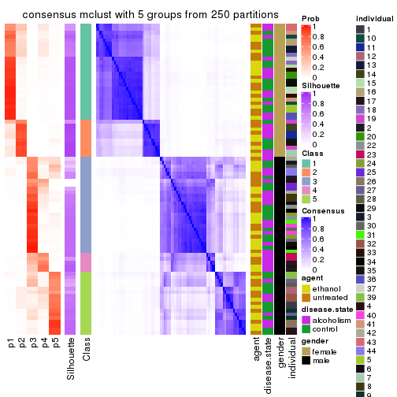</p>

</div>
<div id='tab-CV-mclust-consensus-heatmap-5'>
<pre><code class="r">consensus_heatmap(res, k = 6)
</code></pre>

<p></p>

</div>
</div>

Heatmaps for the membership of samples in all partitions to see how consistent they are:


<script>
$( function() {
	$( '#tabs-CV-mclust-membership-heatmap' ).tabs();
} );
</script>
<div id='tabs-CV-mclust-membership-heatmap'>
<ul>
<li><a href='#tab-CV-mclust-membership-heatmap-1'>k = 2</a></li>
<li><a href='#tab-CV-mclust-membership-heatmap-2'>k = 3</a></li>
<li><a href='#tab-CV-mclust-membership-heatmap-3'>k = 4</a></li>
<li><a href='#tab-CV-mclust-membership-heatmap-4'>k = 5</a></li>
<li><a href='#tab-CV-mclust-membership-heatmap-5'>k = 6</a></li>
</ul>
<div id='tab-CV-mclust-membership-heatmap-1'>
<pre><code class="r">membership_heatmap(res, k = 2)
</code></pre>

<p></p>

</div>
<div id='tab-CV-mclust-membership-heatmap-2'>
<pre><code class="r">membership_heatmap(res, k = 3)
</code></pre>

<p></p>

</div>
<div id='tab-CV-mclust-membership-heatmap-3'>
<pre><code class="r">membership_heatmap(res, k = 4)
</code></pre>

<p></p>

</div>
<div id='tab-CV-mclust-membership-heatmap-4'>
<pre><code class="r">membership_heatmap(res, k = 5)
</code></pre>

<p></p>

</div>
<div id='tab-CV-mclust-membership-heatmap-5'>
<pre><code class="r">membership_heatmap(res, k = 6)
</code></pre>

<p></p>

</div>
</div>

As soon as we have had the classes for columns, we can look for signatures
which are significantly different between classes which can be candidate marks
for certain classes. Following are the heatmaps for signatures.


Signature heatmaps where rows are scaled:


<script>
$( function() {
	$( '#tabs-CV-mclust-get-signatures' ).tabs();
} );
</script>
<div id='tabs-CV-mclust-get-signatures'>
<ul>
<li><a href='#tab-CV-mclust-get-signatures-1'>k = 2</a></li>
<li><a href='#tab-CV-mclust-get-signatures-2'>k = 3</a></li>
<li><a href='#tab-CV-mclust-get-signatures-3'>k = 4</a></li>
<li><a href='#tab-CV-mclust-get-signatures-4'>k = 5</a></li>
<li><a href='#tab-CV-mclust-get-signatures-5'>k = 6</a></li>
</ul>
<div id='tab-CV-mclust-get-signatures-1'>
<pre><code class="r">get_signatures(res, k = 2)
</code></pre>

<p></p>

</div>
<div id='tab-CV-mclust-get-signatures-2'>
<pre><code class="r">get_signatures(res, k = 3)
</code></pre>

<p></p>

</div>
<div id='tab-CV-mclust-get-signatures-3'>
<pre><code class="r">get_signatures(res, k = 4)
</code></pre>

<p></p>

</div>
<div id='tab-CV-mclust-get-signatures-4'>
<pre><code class="r">get_signatures(res, k = 5)
</code></pre>

<p></p>

</div>
<div id='tab-CV-mclust-get-signatures-5'>
<pre><code class="r">get_signatures(res, k = 6)
</code></pre>

<p></p>

</div>
</div>


Signature heatmaps where rows are not scaled:


<script>
$( function() {
	$( '#tabs-CV-mclust-get-signatures-no-scale' ).tabs();
} );
</script>
<div id='tabs-CV-mclust-get-signatures-no-scale'>
<ul>
<li><a href='#tab-CV-mclust-get-signatures-no-scale-1'>k = 2</a></li>
<li><a href='#tab-CV-mclust-get-signatures-no-scale-2'>k = 3</a></li>
<li><a href='#tab-CV-mclust-get-signatures-no-scale-3'>k = 4</a></li>
<li><a href='#tab-CV-mclust-get-signatures-no-scale-4'>k = 5</a></li>
<li><a href='#tab-CV-mclust-get-signatures-no-scale-5'>k = 6</a></li>
</ul>
<div id='tab-CV-mclust-get-signatures-no-scale-1'>
<pre><code class="r">get_signatures(res, k = 2, scale_rows = FALSE)
</code></pre>

<p></p>

</div>
<div id='tab-CV-mclust-get-signatures-no-scale-2'>
<pre><code class="r">get_signatures(res, k = 3, scale_rows = FALSE)
</code></pre>

<p></p>

</div>
<div id='tab-CV-mclust-get-signatures-no-scale-3'>
<pre><code class="r">get_signatures(res, k = 4, scale_rows = FALSE)
</code></pre>

<p></p>

</div>
<div id='tab-CV-mclust-get-signatures-no-scale-4'>
<pre><code class="r">get_signatures(res, k = 5, scale_rows = FALSE)
</code></pre>

<p></p>

</div>
<div id='tab-CV-mclust-get-signatures-no-scale-5'>
<pre><code class="r">get_signatures(res, k = 6, scale_rows = FALSE)
</code></pre>

<p></p>

</div>
</div>


Compare the overlap of signatures from different k:

```r
compare_signatures(res)
```


`get_signature()` returns a data frame invisibly. TO get the list of signatures, the function
call should be assigned to a variable explicitly. In following code, if `plot` argument is set
to `FALSE`, no heatmap is plotted while only the differential analysis is performed.

```r
# code only for demonstration
tb = get_signature(res, k = ..., plot = FALSE)
```

An example of the output of `tb` is:

```
#>   which_row         fdr    mean_1    mean_2 scaled_mean_1 scaled_mean_2 km
#> 1        38 0.042760348  8.373488  9.131774    -0.5533452     0.5164555  1
#> 2        40 0.018707592  7.106213  8.469186    -0.6173731     0.5762149  1
#> 3        55 0.019134737 10.221463 11.207825    -0.6159697     0.5749050  1
#> 4        59 0.006059896  5.921854  7.869574    -0.6899429     0.6439467  1
#> 5        60 0.018055526  8.928898 10.211722    -0.6204761     0.5791110  1
#> 6        98 0.009384629 15.714769 14.887706     0.6635654    -0.6193277  2
...
```

The columns in `tb` are:

1. `which_row`: row indices corresponding to the input matrix.
2. `fdr`: FDR for the differential test. 
3. `mean_x`: The mean value in group x.
4. `scaled_mean_x`: The mean value in group x after rows are scaled.
5. `km`: Row groups if k-means clustering is applied to rows.


UMAP plot which shows how samples are separated.


<script>
$( function() {
	$( '#tabs-CV-mclust-dimension-reduction' ).tabs();
} );
</script>
<div id='tabs-CV-mclust-dimension-reduction'>
<ul>
<li><a href='#tab-CV-mclust-dimension-reduction-1'>k = 2</a></li>
<li><a href='#tab-CV-mclust-dimension-reduction-2'>k = 3</a></li>
<li><a href='#tab-CV-mclust-dimension-reduction-3'>k = 4</a></li>
<li><a href='#tab-CV-mclust-dimension-reduction-4'>k = 5</a></li>
<li><a href='#tab-CV-mclust-dimension-reduction-5'>k = 6</a></li>
</ul>
<div id='tab-CV-mclust-dimension-reduction-1'>
<pre><code class="r">dimension_reduction(res, k = 2, method = &quot;UMAP&quot;)
</code></pre>

<p></p>

</div>
<div id='tab-CV-mclust-dimension-reduction-2'>
<pre><code class="r">dimension_reduction(res, k = 3, method = &quot;UMAP&quot;)
</code></pre>

<p></p>

</div>
<div id='tab-CV-mclust-dimension-reduction-3'>
<pre><code class="r">dimension_reduction(res, k = 4, method = &quot;UMAP&quot;)
</code></pre>

<p></p>

</div>
<div id='tab-CV-mclust-dimension-reduction-4'>
<pre><code class="r">dimension_reduction(res, k = 5, method = &quot;UMAP&quot;)
</code></pre>

<p></p>

</div>
<div id='tab-CV-mclust-dimension-reduction-5'>
<pre><code class="r">dimension_reduction(res, k = 6, method = &quot;UMAP&quot;)
</code></pre>

<p></p>

</div>
</div>


Following heatmap shows how subgroups are split when increasing `k`:

```r
collect_classes(res)
```


Test correlation between subgroups and known annotations. If the known
annotation is numeric, one-way ANOVA test is applied, and if the known
annotation is discrete, chi-squared contingency table test is applied.

```r
test_to_known_factors(res)
```

```
#>            n agent(p) disease.state(p) gender(p) individual(p) k
#> CV:mclust 84    1.000            1.000  3.81e-19      8.65e-05 2
#> CV:mclust 59    0.982            0.851  1.54e-13      5.55e-06 3
#> CV:mclust 76    0.985            0.366  2.21e-16      1.03e-08 4
#> CV:mclust 74    0.975            0.153  3.24e-15      9.67e-11 5
#> CV:mclust 74    0.994            0.171  1.50e-14      1.65e-11 6
```


If matrix rows can be associated to genes, consider to use `GO_Enrichment(res,
...)` to perform function enrichment for the signature genes.


 

---------------------------------------------------


### CV:NMF**


The object with results only for a single top-value method and a single partition method 
can be extracted as:

```r
res = res_list["CV", "NMF"]
# you can also extract it by
# res = res_list["CV:NMF"]
```

A summary of `res` and all the functions that can be applied to it:

```r
res
```

```
#> A 'ConsensusPartition' object with k = 2, 3, 4, 5, 6.
#>   On a matrix with 51941 rows and 84 columns.
#>   Top rows (1000, 2000, 3000, 4000, 5000) are extracted by 'CV' method.
#>   Subgroups are detected by 'NMF' method.
#>   Performed in total 1250 partitions by row resampling.
#>   Best k for subgroups seems to be 2.
#> 
#> Following methods can be applied to this 'ConsensusPartition' object:
#>  [1] "cola_report"             "collect_classes"         "collect_plots"          
#>  [4] "collect_stats"           "colnames"                "compare_signatures"     
#>  [7] "consensus_heatmap"       "dimension_reduction"     "functional_enrichment"  
#> [10] "get_anno_col"            "get_anno"                "get_classes"            
#> [13] "get_consensus"           "get_matrix"              "get_membership"         
#> [16] "get_param"               "get_signatures"          "get_stats"              
#> [19] "is_best_k"               "is_stable_k"             "membership_heatmap"     
#> [22] "ncol"                    "nrow"                    "plot_ecdf"              
#> [25] "rownames"                "select_partition_number" "show"                   
#> [28] "suggest_best_k"          "test_to_known_factors"
```

`collect_plots()` function collects all the plots made from `res` for all `k` (number of partitions)
into one single page to provide an easy and fast comparison between different `k`.

```r
collect_plots(res)
```


The plots are:

- The first row: a plot of the ECDF (Empirical cumulative distribution
  function) curves of the consensus matrix for each `k` and the heatmap of
  predicted classes for each `k`.
- The second row: heatmaps of the consensus matrix for each `k`.
- The third row: heatmaps of the membership matrix for each `k`.
- The fouth row: heatmaps of the signatures for each `k`.

All the plots in panels can be made by individual functions and they are
plotted later in this section.

`select_partition_number()` produces several plots showing different
statistics for choosing "optimized" `k`. There are following statistics:

- ECDF curves of the consensus matrix for each `k`;
- 1-PAC. [The PAC
  score](https://en.wikipedia.org/wiki/Consensus_clustering#Over-interpretation_potential_of_consensus_clustering)
  measures the proportion of the ambiguous subgrouping.
- Mean silhouette score.
- Concordance. The mean probability of fiting the consensus class ids in all
  partitions.
- Area increased. Denote $A_k$ as the area under the ECDF curve for current
  `k`, the area increased is defined as $A_k - A_{k-1}$.
- Rand index. The percent of pairs of samples that are both in a same cluster
  or both are not in a same cluster in the partition of k and k-1.
- Jaccard index. The ratio of pairs of samples are both in a same cluster in
  the partition of k and k-1 and the pairs of samples are both in a same
  cluster in the partition k or k-1.

The detailed explanations of these statistics can be found in [the cola
vignette](http://bioconductor.org/packages/devel/bioc/vignettes/cola/inst/doc/cola.html#toc_13).

Generally speaking, lower PAC score, higher mean silhouette score or higher
concordance corresponds to better partition. Rand index and Jaccard index
measure how similar the current partition is compared to partition with `k-1`.
If they are too similar, we won't accept `k` is better than `k-1`.

```r
select_partition_number(res)
```


The numeric values for all these statistics can be obtained by `get_stats()`.

```r
get_stats(res)
```

```
#>   k 1-PAC mean_silhouette concordance area_increased  Rand Jaccard
#> 2 2 0.998           0.974       0.983         0.4976 0.504   0.504
#> 3 3 0.531           0.665       0.844         0.2167 0.987   0.973
#> 4 4 0.446           0.508       0.676         0.1635 0.883   0.763
#> 5 5 0.462           0.359       0.566         0.0898 0.913   0.781
#> 6 6 0.469           0.176       0.476         0.0631 0.846   0.567
```

`suggest_best_k()` suggests the best $k$ based on these statistics. The rules are as follows:

- All $k$ with Jaccard index larger than 0.95 are removed because the increase of
  the partition number does not provides enough extra information. If all $k$ are removed,
  the best $k$ is assigned by `NA`.
- For $k$ with 1-PAC larger than 0.9, the maximal $k$ is taken as the "best k". Other $k$ is called "optional k".
- If it does not fit the second rule. The $k$ with the highest vote of highest
  1-PAC, mean silhouette and concordance is taken as the "best k".

```r
suggest_best_k(res)
```

```
#> [1] 2
```


Following shows the table of the partitions (You need to click the **show/hide
code output** link to see it). The membership matrix (columns with name `p*`)
is inferred by
[`clue::cl_consensus()`](https://www.rdocumentation.org/link/cl_consensus?package=clue)
function with the `SE` method. Basically the value in the membership matrix
represents the probability to belong to a certain group. The finall class
label for an item is determined with the group with highest probability it
belongs to.

In `get_classes()` function, the entropy is calculated from the membership
matrix and the silhouette score is calculated from the consensus matrix.


<script>
$( function() {
	$( '#tabs-CV-NMF-get-classes' ).tabs();
} );
</script>
<div id='tabs-CV-NMF-get-classes'>
<ul>
<li><a href='#tab-CV-NMF-get-classes-1'>k = 2</a></li>
<li><a href='#tab-CV-NMF-get-classes-2'>k = 3</a></li>
<li><a href='#tab-CV-NMF-get-classes-3'>k = 4</a></li>
<li><a href='#tab-CV-NMF-get-classes-4'>k = 5</a></li>
<li><a href='#tab-CV-NMF-get-classes-5'>k = 6</a></li>
</ul>

<div id='tab-CV-NMF-get-classes-1'>
<p><a id='tab-CV-NMF-get-classes-1-a' style='color:#0366d6' href='#'>show/hide code output</a></p>
<pre><code class="r">cbind(get_classes(res, k = 2), get_membership(res, k = 2))
</code></pre>

<pre><code>#&gt;            class entropy silhouette    p1    p2
#&gt; GSM1269647     1  0.1184      0.974 0.984 0.016
#&gt; GSM1269655     1  0.0000      0.977 1.000 0.000
#&gt; GSM1269663     1  0.0376      0.977 0.996 0.004
#&gt; GSM1269671     1  0.4431      0.920 0.908 0.092
#&gt; GSM1269679     1  0.0000      0.977 1.000 0.000
#&gt; GSM1269693     1  0.0672      0.976 0.992 0.008
#&gt; GSM1269701     1  0.0000      0.977 1.000 0.000
#&gt; GSM1269709     1  0.3274      0.948 0.940 0.060
#&gt; GSM1269715     1  0.0938      0.975 0.988 0.012
#&gt; GSM1269717     1  0.0672      0.976 0.992 0.008
#&gt; GSM1269721     1  0.0938      0.975 0.988 0.012
#&gt; GSM1269723     1  0.0000      0.977 1.000 0.000
#&gt; GSM1269645     2  0.0672      0.990 0.008 0.992
#&gt; GSM1269653     2  0.0000      0.993 0.000 1.000
#&gt; GSM1269661     2  0.2948      0.957 0.052 0.948
#&gt; GSM1269669     2  0.0376      0.991 0.004 0.996
#&gt; GSM1269677     2  0.0000      0.993 0.000 1.000
#&gt; GSM1269685     2  0.0000      0.993 0.000 1.000
#&gt; GSM1269691     2  0.0672      0.990 0.008 0.992
#&gt; GSM1269699     2  0.0376      0.991 0.004 0.996
#&gt; GSM1269707     2  0.0000      0.993 0.000 1.000
#&gt; GSM1269651     1  0.0376      0.977 0.996 0.004
#&gt; GSM1269659     1  0.4815      0.905 0.896 0.104
#&gt; GSM1269667     1  0.0000      0.977 1.000 0.000
#&gt; GSM1269675     1  0.0672      0.977 0.992 0.008
#&gt; GSM1269683     1  0.0000      0.977 1.000 0.000
#&gt; GSM1269689     1  0.5629      0.880 0.868 0.132
#&gt; GSM1269697     1  0.0672      0.977 0.992 0.008
#&gt; GSM1269705     1  0.0672      0.977 0.992 0.008
#&gt; GSM1269713     1  0.0000      0.977 1.000 0.000
#&gt; GSM1269719     1  0.0938      0.976 0.988 0.012
#&gt; GSM1269725     1  0.0376      0.977 0.996 0.004
#&gt; GSM1269727     1  0.0000      0.977 1.000 0.000
#&gt; GSM1269649     2  0.0672      0.989 0.008 0.992
#&gt; GSM1269657     2  0.0000      0.993 0.000 1.000
#&gt; GSM1269665     2  0.1414      0.983 0.020 0.980
#&gt; GSM1269673     2  0.0000      0.993 0.000 1.000
#&gt; GSM1269681     2  0.0938      0.987 0.012 0.988
#&gt; GSM1269687     2  0.0376      0.991 0.004 0.996
#&gt; GSM1269695     2  0.0000      0.993 0.000 1.000
#&gt; GSM1269703     2  0.0000      0.993 0.000 1.000
#&gt; GSM1269711     2  0.0000      0.993 0.000 1.000
#&gt; GSM1269646     1  0.0672      0.977 0.992 0.008
#&gt; GSM1269654     1  0.0000      0.977 1.000 0.000
#&gt; GSM1269662     1  0.0000      0.977 1.000 0.000
#&gt; GSM1269670     1  0.2603      0.958 0.956 0.044
#&gt; GSM1269678     1  0.0000      0.977 1.000 0.000
#&gt; GSM1269692     1  0.2778      0.952 0.952 0.048
#&gt; GSM1269700     1  0.0000      0.977 1.000 0.000
#&gt; GSM1269708     1  0.2423      0.960 0.960 0.040
#&gt; GSM1269714     1  0.0376      0.977 0.996 0.004
#&gt; GSM1269716     1  0.0376      0.977 0.996 0.004
#&gt; GSM1269720     1  0.5408      0.886 0.876 0.124
#&gt; GSM1269722     1  0.0000      0.977 1.000 0.000
#&gt; GSM1269644     2  0.0000      0.993 0.000 1.000
#&gt; GSM1269652     2  0.0000      0.993 0.000 1.000
#&gt; GSM1269660     2  0.2043      0.975 0.032 0.968
#&gt; GSM1269668     2  0.2236      0.970 0.036 0.964
#&gt; GSM1269676     2  0.0000      0.993 0.000 1.000
#&gt; GSM1269684     2  0.0672      0.990 0.008 0.992
#&gt; GSM1269690     2  0.0672      0.990 0.008 0.992
#&gt; GSM1269698     2  0.0000      0.993 0.000 1.000
#&gt; GSM1269706     2  0.0000      0.993 0.000 1.000
#&gt; GSM1269650     1  0.0938      0.976 0.988 0.012
#&gt; GSM1269658     1  0.6531      0.832 0.832 0.168
#&gt; GSM1269666     1  0.0000      0.977 1.000 0.000
#&gt; GSM1269674     1  0.0376      0.977 0.996 0.004
#&gt; GSM1269682     1  0.0672      0.976 0.992 0.008
#&gt; GSM1269688     1  0.5629      0.880 0.868 0.132
#&gt; GSM1269696     1  0.0672      0.977 0.992 0.008
#&gt; GSM1269704     1  0.2043      0.965 0.968 0.032
#&gt; GSM1269712     1  0.0376      0.977 0.996 0.004
#&gt; GSM1269718     1  0.0672      0.977 0.992 0.008
#&gt; GSM1269724     1  0.0000      0.977 1.000 0.000
#&gt; GSM1269726     1  0.0000      0.977 1.000 0.000
#&gt; GSM1269648     2  0.0000      0.993 0.000 1.000
#&gt; GSM1269656     2  0.0000      0.993 0.000 1.000
#&gt; GSM1269664     2  0.2778      0.959 0.048 0.952
#&gt; GSM1269672     2  0.0376      0.991 0.004 0.996
#&gt; GSM1269680     2  0.0376      0.991 0.004 0.996
#&gt; GSM1269686     2  0.1414      0.983 0.020 0.980
#&gt; GSM1269694     2  0.0000      0.993 0.000 1.000
#&gt; GSM1269702     2  0.0000      0.993 0.000 1.000
#&gt; GSM1269710     2  0.0000      0.993 0.000 1.000
</code></pre>

<script>
$('#tab-CV-NMF-get-classes-1-a').parent().next().next().hide();
$('#tab-CV-NMF-get-classes-1-a').click(function(){
  $('#tab-CV-NMF-get-classes-1-a').parent().next().next().toggle();
  return(false);
});
</script>
</div>

<div id='tab-CV-NMF-get-classes-2'>
<p><a id='tab-CV-NMF-get-classes-2-a' style='color:#0366d6' href='#'>show/hide code output</a></p>
<pre><code class="r">cbind(get_classes(res, k = 3), get_membership(res, k = 3))
</code></pre>

<pre><code>#&gt;            class entropy silhouette    p1    p2    p3
#&gt; GSM1269647     1  0.4931      0.618 0.768 0.000 0.232
#&gt; GSM1269655     1  0.1163      0.713 0.972 0.000 0.028
#&gt; GSM1269663     1  0.2200      0.698 0.940 0.004 0.056
#&gt; GSM1269671     1  0.7190      0.384 0.608 0.036 0.356
#&gt; GSM1269679     1  0.2261      0.694 0.932 0.000 0.068
#&gt; GSM1269693     1  0.7114     -0.606 0.584 0.028 0.388
#&gt; GSM1269701     1  0.3715      0.658 0.868 0.004 0.128
#&gt; GSM1269709     1  0.3765      0.706 0.888 0.028 0.084
#&gt; GSM1269715     1  0.7286     -0.869 0.508 0.028 0.464
#&gt; GSM1269717     3  0.7283      0.000 0.460 0.028 0.512
#&gt; GSM1269721     1  0.5109      0.618 0.780 0.008 0.212
#&gt; GSM1269723     1  0.0747      0.712 0.984 0.000 0.016
#&gt; GSM1269645     2  0.3295      0.886 0.008 0.896 0.096
#&gt; GSM1269653     2  0.2796      0.889 0.000 0.908 0.092
#&gt; GSM1269661     2  0.4840      0.834 0.016 0.816 0.168
#&gt; GSM1269669     2  0.4121      0.838 0.000 0.832 0.168
#&gt; GSM1269677     2  0.4291      0.853 0.000 0.820 0.180
#&gt; GSM1269685     2  0.1753      0.895 0.000 0.952 0.048
#&gt; GSM1269691     2  0.2356      0.887 0.000 0.928 0.072
#&gt; GSM1269699     2  0.5098      0.804 0.000 0.752 0.248
#&gt; GSM1269707     2  0.4178      0.856 0.000 0.828 0.172
#&gt; GSM1269651     1  0.4750      0.625 0.784 0.000 0.216
#&gt; GSM1269659     1  0.7712      0.335 0.652 0.092 0.256
#&gt; GSM1269667     1  0.2165      0.709 0.936 0.000 0.064
#&gt; GSM1269675     1  0.4346      0.662 0.816 0.000 0.184
#&gt; GSM1269683     1  0.4475      0.544 0.840 0.016 0.144
#&gt; GSM1269689     1  0.7606      0.440 0.664 0.092 0.244
#&gt; GSM1269697     1  0.1860      0.718 0.948 0.000 0.052
#&gt; GSM1269705     1  0.4121      0.678 0.832 0.000 0.168
#&gt; GSM1269713     1  0.2261      0.719 0.932 0.000 0.068
#&gt; GSM1269719     1  0.2301      0.720 0.936 0.004 0.060
#&gt; GSM1269725     1  0.2261      0.718 0.932 0.000 0.068
#&gt; GSM1269727     1  0.1411      0.706 0.964 0.000 0.036
#&gt; GSM1269649     2  0.3755      0.883 0.008 0.872 0.120
#&gt; GSM1269657     2  0.4399      0.847 0.000 0.812 0.188
#&gt; GSM1269665     2  0.5461      0.760 0.008 0.748 0.244
#&gt; GSM1269673     2  0.2165      0.889 0.000 0.936 0.064
#&gt; GSM1269681     2  0.6651      0.687 0.024 0.656 0.320
#&gt; GSM1269687     2  0.1529      0.891 0.000 0.960 0.040
#&gt; GSM1269695     2  0.2066      0.893 0.000 0.940 0.060
#&gt; GSM1269703     2  0.1643      0.892 0.000 0.956 0.044
#&gt; GSM1269711     2  0.2796      0.894 0.000 0.908 0.092
#&gt; GSM1269646     1  0.3619      0.695 0.864 0.000 0.136
#&gt; GSM1269654     1  0.1411      0.710 0.964 0.000 0.036
#&gt; GSM1269662     1  0.2682      0.710 0.920 0.004 0.076
#&gt; GSM1269670     1  0.6773      0.433 0.636 0.024 0.340
#&gt; GSM1269678     1  0.2165      0.691 0.936 0.000 0.064
#&gt; GSM1269692     1  0.7308     -0.121 0.648 0.056 0.296
#&gt; GSM1269700     1  0.1964      0.704 0.944 0.000 0.056
#&gt; GSM1269708     1  0.3042      0.711 0.920 0.040 0.040
#&gt; GSM1269714     1  0.4047      0.554 0.848 0.004 0.148
#&gt; GSM1269716     1  0.5902     -0.252 0.680 0.004 0.316
#&gt; GSM1269720     1  0.8394      0.252 0.576 0.108 0.316
#&gt; GSM1269722     1  0.0747      0.704 0.984 0.000 0.016
#&gt; GSM1269644     2  0.1964      0.893 0.000 0.944 0.056
#&gt; GSM1269652     2  0.2537      0.891 0.000 0.920 0.080
#&gt; GSM1269660     2  0.3539      0.888 0.012 0.888 0.100
#&gt; GSM1269668     2  0.4047      0.856 0.004 0.848 0.148
#&gt; GSM1269676     2  0.3816      0.868 0.000 0.852 0.148
#&gt; GSM1269684     2  0.1860      0.891 0.000 0.948 0.052
#&gt; GSM1269690     2  0.3752      0.863 0.000 0.856 0.144
#&gt; GSM1269698     2  0.5397      0.774 0.000 0.720 0.280
#&gt; GSM1269706     2  0.4178      0.859 0.000 0.828 0.172
#&gt; GSM1269650     1  0.5158      0.602 0.764 0.004 0.232
#&gt; GSM1269658     1  0.8483      0.115 0.600 0.140 0.260
#&gt; GSM1269666     1  0.1529      0.710 0.960 0.000 0.040
#&gt; GSM1269674     1  0.4351      0.670 0.828 0.004 0.168
#&gt; GSM1269682     1  0.3644      0.612 0.872 0.004 0.124
#&gt; GSM1269688     1  0.7739      0.419 0.644 0.088 0.268
#&gt; GSM1269696     1  0.3941      0.681 0.844 0.000 0.156
#&gt; GSM1269704     1  0.4235      0.673 0.824 0.000 0.176
#&gt; GSM1269712     1  0.2537      0.683 0.920 0.000 0.080
#&gt; GSM1269718     1  0.2878      0.711 0.904 0.000 0.096
#&gt; GSM1269724     1  0.1643      0.708 0.956 0.000 0.044
#&gt; GSM1269726     1  0.1964      0.695 0.944 0.000 0.056
#&gt; GSM1269648     2  0.2066      0.893 0.000 0.940 0.060
#&gt; GSM1269656     2  0.2711      0.891 0.000 0.912 0.088
#&gt; GSM1269664     2  0.5848      0.744 0.012 0.720 0.268
#&gt; GSM1269672     2  0.1643      0.890 0.000 0.956 0.044
#&gt; GSM1269680     2  0.5397      0.767 0.000 0.720 0.280
#&gt; GSM1269686     2  0.3038      0.877 0.000 0.896 0.104
#&gt; GSM1269694     2  0.1964      0.894 0.000 0.944 0.056
#&gt; GSM1269702     2  0.1860      0.895 0.000 0.948 0.052
#&gt; GSM1269710     2  0.1860      0.893 0.000 0.948 0.052
</code></pre>

<script>
$('#tab-CV-NMF-get-classes-2-a').parent().next().next().hide();
$('#tab-CV-NMF-get-classes-2-a').click(function(){
  $('#tab-CV-NMF-get-classes-2-a').parent().next().next().toggle();
  return(false);
});
</script>
</div>

<div id='tab-CV-NMF-get-classes-3'>
<p><a id='tab-CV-NMF-get-classes-3-a' style='color:#0366d6' href='#'>show/hide code output</a></p>
<pre><code class="r">cbind(get_classes(res, k = 4), get_membership(res, k = 4))
</code></pre>

<pre><code>#&gt;            class entropy silhouette    p1    p2    p3    p4
#&gt; GSM1269647     3   0.572    0.39747 0.008 0.312 0.648 0.032
#&gt; GSM1269655     3   0.525    0.59683 0.004 0.116 0.764 0.116
#&gt; GSM1269663     3   0.451    0.59833 0.000 0.076 0.804 0.120
#&gt; GSM1269671     2   0.630   -0.00395 0.020 0.484 0.472 0.024
#&gt; GSM1269679     3   0.395    0.62976 0.000 0.064 0.840 0.096
#&gt; GSM1269693     4   0.699    0.41219 0.016 0.076 0.388 0.520
#&gt; GSM1269701     3   0.639    0.52622 0.016 0.128 0.688 0.168
#&gt; GSM1269709     3   0.573    0.53648 0.040 0.176 0.740 0.044
#&gt; GSM1269715     4   0.661    0.48530 0.020 0.056 0.332 0.592
#&gt; GSM1269717     4   0.566    0.48607 0.016 0.024 0.292 0.668
#&gt; GSM1269721     3   0.681    0.02581 0.004 0.352 0.548 0.096
#&gt; GSM1269723     3   0.247    0.62861 0.000 0.028 0.916 0.056
#&gt; GSM1269645     1   0.617    0.69467 0.672 0.136 0.000 0.192
#&gt; GSM1269653     1   0.421    0.76372 0.820 0.124 0.000 0.056
#&gt; GSM1269661     1   0.634    0.64620 0.636 0.076 0.008 0.280
#&gt; GSM1269669     1   0.605    0.61217 0.616 0.064 0.000 0.320
#&gt; GSM1269677     1   0.680    0.54315 0.568 0.308 0.000 0.124
#&gt; GSM1269685     1   0.395    0.77101 0.840 0.064 0.000 0.096
#&gt; GSM1269691     1   0.494    0.74715 0.768 0.072 0.000 0.160
#&gt; GSM1269699     1   0.582    0.64428 0.652 0.288 0.000 0.060
#&gt; GSM1269707     1   0.553    0.70573 0.720 0.192 0.000 0.088
#&gt; GSM1269651     3   0.663    0.06806 0.008 0.376 0.548 0.068
#&gt; GSM1269659     2   0.886    0.26614 0.088 0.396 0.372 0.144
#&gt; GSM1269667     3   0.477    0.61917 0.000 0.076 0.784 0.140
#&gt; GSM1269675     3   0.563    0.37891 0.004 0.304 0.656 0.036
#&gt; GSM1269683     3   0.564    0.30102 0.000 0.040 0.636 0.324
#&gt; GSM1269689     3   0.794    0.03547 0.104 0.364 0.484 0.048
#&gt; GSM1269697     3   0.317    0.62062 0.000 0.116 0.868 0.016
#&gt; GSM1269705     3   0.544    0.39577 0.000 0.288 0.672 0.040
#&gt; GSM1269713     3   0.295    0.62454 0.000 0.088 0.888 0.024
#&gt; GSM1269719     3   0.501    0.56725 0.000 0.172 0.760 0.068
#&gt; GSM1269725     3   0.322    0.61976 0.000 0.120 0.864 0.016
#&gt; GSM1269727     3   0.284    0.63553 0.000 0.028 0.896 0.076
#&gt; GSM1269649     1   0.531    0.72815 0.744 0.164 0.000 0.092
#&gt; GSM1269657     1   0.630    0.61612 0.632 0.268 0.000 0.100
#&gt; GSM1269665     1   0.648    0.43654 0.508 0.060 0.004 0.428
#&gt; GSM1269673     1   0.451    0.75259 0.788 0.044 0.000 0.168
#&gt; GSM1269681     2   0.644   -0.39040 0.456 0.492 0.016 0.036
#&gt; GSM1269687     1   0.431    0.76707 0.812 0.056 0.000 0.132
#&gt; GSM1269695     1   0.236    0.77096 0.920 0.056 0.000 0.024
#&gt; GSM1269703     1   0.413    0.76627 0.824 0.052 0.000 0.124
#&gt; GSM1269711     1   0.538    0.71464 0.728 0.196 0.000 0.076
#&gt; GSM1269646     3   0.499    0.50977 0.000 0.236 0.728 0.036
#&gt; GSM1269654     3   0.407    0.60793 0.000 0.064 0.832 0.104
#&gt; GSM1269662     3   0.614    0.35207 0.000 0.252 0.652 0.096
#&gt; GSM1269670     2   0.671    0.02827 0.028 0.480 0.456 0.036
#&gt; GSM1269678     3   0.396    0.61948 0.000 0.024 0.816 0.160
#&gt; GSM1269692     4   0.791    0.17997 0.012 0.184 0.400 0.404
#&gt; GSM1269700     3   0.327    0.63350 0.000 0.024 0.868 0.108
#&gt; GSM1269708     3   0.517    0.57557 0.040 0.128 0.788 0.044
#&gt; GSM1269714     3   0.561    0.41227 0.000 0.060 0.684 0.256
#&gt; GSM1269716     3   0.600   -0.22854 0.000 0.040 0.504 0.456
#&gt; GSM1269720     2   0.847    0.30684 0.080 0.420 0.392 0.108
#&gt; GSM1269722     3   0.223    0.63294 0.000 0.036 0.928 0.036
#&gt; GSM1269644     1   0.505    0.75722 0.764 0.084 0.000 0.152
#&gt; GSM1269652     1   0.409    0.75423 0.820 0.140 0.000 0.040
#&gt; GSM1269660     1   0.627    0.70548 0.664 0.152 0.000 0.184
#&gt; GSM1269668     1   0.564    0.64025 0.648 0.044 0.000 0.308
#&gt; GSM1269676     1   0.643    0.60370 0.620 0.272 0.000 0.108
#&gt; GSM1269684     1   0.467    0.75941 0.764 0.036 0.000 0.200
#&gt; GSM1269690     1   0.600    0.67511 0.660 0.084 0.000 0.256
#&gt; GSM1269698     1   0.565    0.66114 0.672 0.272 0.000 0.056
#&gt; GSM1269706     1   0.551    0.70056 0.720 0.196 0.000 0.084
#&gt; GSM1269650     3   0.695   -0.12602 0.012 0.428 0.484 0.076
#&gt; GSM1269658     2   0.885    0.23014 0.072 0.412 0.340 0.176
#&gt; GSM1269666     3   0.434    0.62382 0.004 0.048 0.816 0.132
#&gt; GSM1269674     3   0.583    0.26491 0.000 0.332 0.620 0.048
#&gt; GSM1269682     3   0.604    0.33739 0.004 0.060 0.640 0.296
#&gt; GSM1269688     3   0.784    0.06422 0.088 0.348 0.508 0.056
#&gt; GSM1269696     3   0.540    0.39331 0.000 0.328 0.644 0.028
#&gt; GSM1269704     3   0.525    0.46179 0.008 0.252 0.712 0.028
#&gt; GSM1269712     3   0.442    0.59723 0.000 0.040 0.792 0.168
#&gt; GSM1269718     3   0.671    0.49569 0.012 0.184 0.652 0.152
#&gt; GSM1269724     3   0.307    0.63647 0.000 0.044 0.888 0.068
#&gt; GSM1269726     3   0.447    0.59149 0.000 0.036 0.784 0.180
#&gt; GSM1269648     1   0.274    0.77175 0.904 0.060 0.000 0.036
#&gt; GSM1269656     1   0.451    0.75482 0.800 0.136 0.000 0.064
#&gt; GSM1269664     4   0.696   -0.45307 0.448 0.076 0.012 0.464
#&gt; GSM1269672     1   0.405    0.76224 0.820 0.036 0.000 0.144
#&gt; GSM1269680     1   0.588    0.58687 0.620 0.328 0.000 0.052
#&gt; GSM1269686     1   0.497    0.72919 0.752 0.040 0.004 0.204
#&gt; GSM1269694     1   0.277    0.76872 0.900 0.072 0.000 0.028
#&gt; GSM1269702     1   0.389    0.77009 0.844 0.064 0.000 0.092
#&gt; GSM1269710     1   0.340    0.77381 0.868 0.092 0.000 0.040
</code></pre>

<script>
$('#tab-CV-NMF-get-classes-3-a').parent().next().next().hide();
$('#tab-CV-NMF-get-classes-3-a').click(function(){
  $('#tab-CV-NMF-get-classes-3-a').parent().next().next().toggle();
  return(false);
});
</script>
</div>

<div id='tab-CV-NMF-get-classes-4'>
<p><a id='tab-CV-NMF-get-classes-4-a' style='color:#0366d6' href='#'>show/hide code output</a></p>
<pre><code class="r">cbind(get_classes(res, k = 5), get_membership(res, k = 5))
</code></pre>

<pre><code>#&gt;            class entropy silhouette    p1    p2    p3    p4    p5
#&gt; GSM1269647     3   0.554    0.22707 0.004 0.364 0.580 0.036 0.016
#&gt; GSM1269655     3   0.650    0.35635 0.004 0.216 0.612 0.128 0.040
#&gt; GSM1269663     3   0.639    0.23373 0.004 0.104 0.644 0.184 0.064
#&gt; GSM1269671     2   0.654    0.28821 0.044 0.524 0.372 0.024 0.036
#&gt; GSM1269679     3   0.518    0.48887 0.016 0.132 0.732 0.116 0.004
#&gt; GSM1269693     4   0.780    0.65107 0.024 0.068 0.328 0.456 0.124
#&gt; GSM1269701     3   0.726    0.35539 0.036 0.208 0.556 0.176 0.024
#&gt; GSM1269709     3   0.600    0.42004 0.020 0.208 0.672 0.032 0.068
#&gt; GSM1269715     4   0.694    0.70153 0.032 0.044 0.264 0.580 0.080
#&gt; GSM1269717     4   0.583    0.65109 0.036 0.012 0.268 0.644 0.040
#&gt; GSM1269721     3   0.827   -0.18313 0.000 0.288 0.324 0.120 0.268
#&gt; GSM1269723     3   0.354    0.52463 0.000 0.068 0.852 0.056 0.024
#&gt; GSM1269645     1   0.672    0.53898 0.616 0.116 0.000 0.160 0.108
#&gt; GSM1269653     1   0.671    0.47676 0.580 0.136 0.000 0.052 0.232
#&gt; GSM1269661     1   0.668    0.50073 0.572 0.060 0.000 0.264 0.104
#&gt; GSM1269669     1   0.576    0.53495 0.652 0.060 0.004 0.252 0.032
#&gt; GSM1269677     5   0.449    0.25334 0.256 0.016 0.000 0.016 0.712
#&gt; GSM1269685     1   0.566    0.51392 0.652 0.052 0.000 0.040 0.256
#&gt; GSM1269691     1   0.589    0.46912 0.592 0.020 0.000 0.076 0.312
#&gt; GSM1269699     1   0.733    0.37501 0.500 0.200 0.000 0.060 0.240
#&gt; GSM1269707     1   0.700    0.31335 0.452 0.128 0.000 0.044 0.376
#&gt; GSM1269651     2   0.783    0.24956 0.000 0.372 0.356 0.088 0.184
#&gt; GSM1269659     5   0.767    0.19893 0.012 0.160 0.192 0.104 0.532
#&gt; GSM1269667     3   0.645    0.45510 0.024 0.156 0.632 0.172 0.016
#&gt; GSM1269675     3   0.667    0.05309 0.020 0.368 0.516 0.064 0.032
#&gt; GSM1269683     3   0.669   -0.19853 0.032 0.072 0.512 0.368 0.016
#&gt; GSM1269689     2   0.765    0.00183 0.080 0.428 0.392 0.048 0.052
#&gt; GSM1269697     3   0.491    0.43370 0.004 0.200 0.732 0.040 0.024
#&gt; GSM1269705     3   0.600    0.11474 0.000 0.312 0.592 0.044 0.052
#&gt; GSM1269713     3   0.429    0.50783 0.008 0.160 0.784 0.040 0.008
#&gt; GSM1269719     3   0.700    0.30491 0.004 0.188 0.592 0.116 0.100
#&gt; GSM1269725     3   0.418    0.50423 0.000 0.168 0.776 0.052 0.004
#&gt; GSM1269727     3   0.451    0.48391 0.000 0.112 0.776 0.100 0.012
#&gt; GSM1269649     1   0.568    0.58500 0.712 0.144 0.004 0.060 0.080
#&gt; GSM1269657     5   0.547    0.04342 0.356 0.048 0.000 0.012 0.584
#&gt; GSM1269665     1   0.724    0.39423 0.472 0.076 0.004 0.352 0.096
#&gt; GSM1269673     1   0.413    0.61428 0.804 0.016 0.000 0.120 0.060
#&gt; GSM1269681     2   0.777   -0.22566 0.316 0.400 0.012 0.040 0.232
#&gt; GSM1269687     1   0.493    0.60471 0.748 0.028 0.000 0.072 0.152
#&gt; GSM1269695     1   0.344    0.60952 0.856 0.040 0.000 0.024 0.080
#&gt; GSM1269703     1   0.490    0.61140 0.764 0.044 0.000 0.116 0.076
#&gt; GSM1269711     1   0.668    0.50132 0.612 0.196 0.008 0.048 0.136
#&gt; GSM1269646     3   0.543    0.32646 0.008 0.304 0.636 0.036 0.016
#&gt; GSM1269654     3   0.570    0.44318 0.000 0.140 0.684 0.148 0.028
#&gt; GSM1269662     3   0.772    0.06913 0.000 0.260 0.472 0.132 0.136
#&gt; GSM1269670     2   0.655    0.26779 0.032 0.508 0.388 0.020 0.052
#&gt; GSM1269678     3   0.512    0.44086 0.004 0.068 0.712 0.204 0.012
#&gt; GSM1269692     4   0.851    0.51937 0.024 0.100 0.288 0.384 0.204
#&gt; GSM1269700     3   0.477    0.52295 0.012 0.140 0.752 0.096 0.000
#&gt; GSM1269708     3   0.637    0.44491 0.020 0.188 0.660 0.068 0.064
#&gt; GSM1269714     3   0.693   -0.27512 0.004 0.072 0.516 0.332 0.076
#&gt; GSM1269716     4   0.599    0.60421 0.008 0.016 0.404 0.520 0.052
#&gt; GSM1269720     5   0.774    0.06081 0.008 0.248 0.224 0.060 0.460
#&gt; GSM1269722     3   0.365    0.53353 0.000 0.088 0.840 0.056 0.016
#&gt; GSM1269644     1   0.611    0.54383 0.620 0.032 0.000 0.100 0.248
#&gt; GSM1269652     1   0.691    0.46545 0.564 0.160 0.004 0.044 0.228
#&gt; GSM1269660     1   0.660    0.55006 0.632 0.116 0.000 0.124 0.128
#&gt; GSM1269668     1   0.606    0.54187 0.640 0.064 0.008 0.248 0.040
#&gt; GSM1269676     5   0.552    0.09168 0.320 0.048 0.000 0.020 0.612
#&gt; GSM1269684     1   0.655    0.56438 0.604 0.056 0.000 0.120 0.220
#&gt; GSM1269690     1   0.718    0.32040 0.440 0.024 0.000 0.252 0.284
#&gt; GSM1269698     1   0.726    0.33362 0.456 0.180 0.000 0.044 0.320
#&gt; GSM1269706     1   0.718    0.25383 0.428 0.128 0.000 0.056 0.388
#&gt; GSM1269650     2   0.809    0.27745 0.012 0.364 0.340 0.068 0.216
#&gt; GSM1269658     5   0.795    0.13527 0.016 0.148 0.180 0.144 0.512
#&gt; GSM1269666     3   0.523    0.47538 0.004 0.096 0.716 0.172 0.012
#&gt; GSM1269674     3   0.689   -0.10653 0.000 0.356 0.492 0.072 0.080
#&gt; GSM1269682     3   0.711   -0.17196 0.016 0.092 0.520 0.320 0.052
#&gt; GSM1269688     3   0.815   -0.02525 0.092 0.308 0.456 0.048 0.096
#&gt; GSM1269696     3   0.579    0.08520 0.008 0.384 0.552 0.020 0.036
#&gt; GSM1269704     3   0.529    0.23613 0.000 0.316 0.628 0.016 0.040
#&gt; GSM1269712     3   0.557    0.34080 0.012 0.060 0.704 0.192 0.032
#&gt; GSM1269718     3   0.716    0.35587 0.032 0.200 0.576 0.160 0.032
#&gt; GSM1269724     3   0.392    0.52097 0.000 0.096 0.820 0.072 0.012
#&gt; GSM1269726     3   0.561    0.29266 0.004 0.108 0.652 0.232 0.004
#&gt; GSM1269648     1   0.434    0.59986 0.792 0.064 0.000 0.020 0.124
#&gt; GSM1269656     1   0.544    0.37974 0.564 0.048 0.000 0.008 0.380
#&gt; GSM1269664     1   0.684    0.40385 0.484 0.088 0.008 0.380 0.040
#&gt; GSM1269672     1   0.456    0.60817 0.772 0.012 0.000 0.112 0.104
#&gt; GSM1269680     1   0.713    0.26645 0.456 0.252 0.000 0.024 0.268
#&gt; GSM1269686     1   0.505    0.60600 0.748 0.044 0.000 0.140 0.068
#&gt; GSM1269694     1   0.383    0.60819 0.828 0.060 0.000 0.016 0.096
#&gt; GSM1269702     1   0.492    0.48787 0.636 0.008 0.000 0.028 0.328
#&gt; GSM1269710     1   0.434    0.60604 0.800 0.072 0.000 0.028 0.100
</code></pre>

<script>
$('#tab-CV-NMF-get-classes-4-a').parent().next().next().hide();
$('#tab-CV-NMF-get-classes-4-a').click(function(){
  $('#tab-CV-NMF-get-classes-4-a').parent().next().next().toggle();
  return(false);
});
</script>
</div>

<div id='tab-CV-NMF-get-classes-5'>
<p><a id='tab-CV-NMF-get-classes-5-a' style='color:#0366d6' href='#'>show/hide code output</a></p>
<pre><code class="r">cbind(get_classes(res, k = 6), get_membership(res, k = 6))
</code></pre>

<pre><code>#&gt;            class entropy silhouette    p1    p2    p3    p4    p5    p6
#&gt; GSM1269647     3   0.552     0.3653 0.016 0.144 0.712 0.052 0.044 0.032
#&gt; GSM1269655     2   0.747     0.1106 0.008 0.332 0.316 0.276 0.056 0.012
#&gt; GSM1269663     4   0.649     0.1038 0.000 0.104 0.404 0.436 0.024 0.032
#&gt; GSM1269671     2   0.675     0.0861 0.052 0.436 0.412 0.044 0.044 0.012
#&gt; GSM1269679     3   0.602     0.1496 0.008 0.036 0.552 0.324 0.072 0.008
#&gt; GSM1269693     4   0.715     0.3745 0.004 0.120 0.096 0.572 0.136 0.072
#&gt; GSM1269701     3   0.729     0.1879 0.032 0.056 0.484 0.276 0.140 0.012
#&gt; GSM1269709     3   0.680     0.3102 0.056 0.068 0.612 0.136 0.012 0.116
#&gt; GSM1269715     4   0.637     0.3544 0.016 0.036 0.032 0.616 0.208 0.092
#&gt; GSM1269717     4   0.578     0.4137 0.008 0.028 0.048 0.656 0.212 0.048
#&gt; GSM1269721     3   0.830    -0.2071 0.008 0.272 0.296 0.204 0.024 0.196
#&gt; GSM1269723     3   0.570     0.0676 0.000 0.064 0.536 0.364 0.024 0.012
#&gt; GSM1269645     5   0.667     0.3959 0.368 0.096 0.004 0.008 0.456 0.068
#&gt; GSM1269653     1   0.739     0.2994 0.492 0.048 0.052 0.008 0.164 0.236
#&gt; GSM1269661     1   0.697    -0.2701 0.444 0.064 0.000 0.036 0.360 0.096
#&gt; GSM1269669     1   0.566    -0.2884 0.508 0.008 0.012 0.048 0.408 0.016
#&gt; GSM1269677     6   0.349     0.3936 0.152 0.024 0.000 0.008 0.008 0.808
#&gt; GSM1269685     1   0.631     0.3064 0.464 0.008 0.000 0.024 0.144 0.360
#&gt; GSM1269691     1   0.655     0.2826 0.432 0.020 0.000 0.020 0.152 0.376
#&gt; GSM1269699     1   0.755     0.2887 0.516 0.108 0.048 0.012 0.116 0.200
#&gt; GSM1269707     1   0.807     0.2530 0.412 0.108 0.036 0.024 0.140 0.280
#&gt; GSM1269651     2   0.741     0.4023 0.012 0.524 0.208 0.132 0.048 0.076
#&gt; GSM1269659     6   0.723     0.3465 0.004 0.184 0.132 0.132 0.024 0.524
#&gt; GSM1269667     3   0.712     0.1712 0.032 0.088 0.504 0.272 0.100 0.004
#&gt; GSM1269675     3   0.669    -0.0317 0.040 0.336 0.512 0.056 0.032 0.024
#&gt; GSM1269683     4   0.667     0.3874 0.016 0.044 0.184 0.576 0.164 0.016
#&gt; GSM1269689     3   0.685     0.2634 0.092 0.136 0.604 0.028 0.120 0.020
#&gt; GSM1269697     3   0.598     0.3636 0.016 0.140 0.636 0.172 0.028 0.008
#&gt; GSM1269705     3   0.693    -0.1609 0.012 0.340 0.456 0.140 0.020 0.032
#&gt; GSM1269713     3   0.586     0.2839 0.004 0.064 0.616 0.252 0.052 0.012
#&gt; GSM1269719     2   0.833     0.0986 0.028 0.336 0.328 0.176 0.048 0.084
#&gt; GSM1269725     3   0.578     0.3071 0.012 0.052 0.636 0.236 0.056 0.008
#&gt; GSM1269727     4   0.576     0.0142 0.000 0.076 0.440 0.456 0.020 0.008
#&gt; GSM1269649     1   0.592     0.1438 0.672 0.112 0.028 0.008 0.136 0.044
#&gt; GSM1269657     6   0.483     0.2892 0.220 0.032 0.004 0.004 0.040 0.700
#&gt; GSM1269665     5   0.699     0.4919 0.296 0.068 0.004 0.088 0.504 0.040
#&gt; GSM1269673     1   0.624    -0.0432 0.576 0.040 0.004 0.032 0.280 0.068
#&gt; GSM1269681     2   0.827    -0.1999 0.224 0.372 0.048 0.004 0.168 0.184
#&gt; GSM1269687     1   0.627     0.0694 0.576 0.036 0.004 0.020 0.260 0.104
#&gt; GSM1269695     1   0.492     0.2627 0.752 0.060 0.008 0.008 0.096 0.076
#&gt; GSM1269703     1   0.634    -0.1996 0.516 0.032 0.000 0.020 0.324 0.108
#&gt; GSM1269711     1   0.737     0.2223 0.536 0.064 0.080 0.008 0.196 0.116
#&gt; GSM1269646     3   0.619     0.3692 0.036 0.100 0.680 0.072 0.084 0.028
#&gt; GSM1269654     4   0.721     0.0861 0.004 0.200 0.316 0.416 0.040 0.024
#&gt; GSM1269662     2   0.805     0.2498 0.004 0.340 0.288 0.236 0.048 0.084
#&gt; GSM1269670     3   0.613    -0.1696 0.036 0.440 0.452 0.008 0.028 0.036
#&gt; GSM1269678     4   0.626     0.0442 0.004 0.036 0.428 0.444 0.072 0.016
#&gt; GSM1269692     4   0.866     0.0876 0.020 0.192 0.108 0.400 0.144 0.136
#&gt; GSM1269700     3   0.557     0.1238 0.004 0.040 0.552 0.360 0.040 0.004
#&gt; GSM1269708     3   0.724     0.2469 0.036 0.072 0.552 0.224 0.040 0.076
#&gt; GSM1269714     4   0.606     0.3924 0.004 0.088 0.212 0.628 0.040 0.028
#&gt; GSM1269716     4   0.515     0.4487 0.012 0.028 0.088 0.744 0.096 0.032
#&gt; GSM1269720     6   0.741     0.2272 0.008 0.188 0.232 0.068 0.028 0.476
#&gt; GSM1269722     3   0.595     0.1220 0.000 0.056 0.548 0.336 0.036 0.024
#&gt; GSM1269644     1   0.700    -0.1174 0.436 0.076 0.000 0.016 0.344 0.128
#&gt; GSM1269652     1   0.673     0.3395 0.536 0.032 0.036 0.008 0.116 0.272
#&gt; GSM1269660     1   0.727    -0.3836 0.436 0.116 0.004 0.020 0.328 0.096
#&gt; GSM1269668     1   0.607    -0.3095 0.500 0.012 0.016 0.064 0.388 0.020
#&gt; GSM1269676     6   0.421     0.3367 0.200 0.028 0.000 0.004 0.024 0.744
#&gt; GSM1269684     1   0.671     0.1800 0.492 0.024 0.000 0.024 0.252 0.208
#&gt; GSM1269690     1   0.736     0.1116 0.380 0.016 0.000 0.068 0.236 0.300
#&gt; GSM1269698     1   0.791     0.2440 0.420 0.160 0.040 0.004 0.128 0.248
#&gt; GSM1269706     1   0.783     0.2598 0.428 0.100 0.040 0.016 0.120 0.296
#&gt; GSM1269650     2   0.762     0.3872 0.012 0.508 0.204 0.108 0.052 0.116
#&gt; GSM1269658     6   0.816     0.2117 0.016 0.244 0.104 0.136 0.068 0.432
#&gt; GSM1269666     4   0.694    -0.0148 0.008 0.144 0.392 0.396 0.052 0.008
#&gt; GSM1269674     2   0.710     0.2220 0.024 0.436 0.364 0.120 0.020 0.036
#&gt; GSM1269682     4   0.700     0.4045 0.012 0.088 0.152 0.584 0.124 0.040
#&gt; GSM1269688     3   0.687     0.2518 0.088 0.124 0.628 0.040 0.052 0.068
#&gt; GSM1269696     3   0.563     0.2589 0.008 0.252 0.636 0.040 0.052 0.012
#&gt; GSM1269704     3   0.528     0.2862 0.012 0.152 0.700 0.104 0.004 0.028
#&gt; GSM1269712     4   0.633     0.2170 0.012 0.040 0.356 0.516 0.052 0.024
#&gt; GSM1269718     3   0.884     0.0187 0.072 0.212 0.344 0.208 0.136 0.028
#&gt; GSM1269724     3   0.625     0.1385 0.004 0.108 0.532 0.308 0.044 0.004
#&gt; GSM1269726     4   0.673     0.2439 0.020 0.048 0.336 0.496 0.088 0.012
#&gt; GSM1269648     1   0.416     0.3314 0.784 0.028 0.004 0.000 0.068 0.116
#&gt; GSM1269656     1   0.677     0.2345 0.428 0.084 0.004 0.004 0.100 0.380
#&gt; GSM1269664     5   0.678     0.5422 0.336 0.040 0.008 0.076 0.496 0.044
#&gt; GSM1269672     1   0.654     0.0362 0.516 0.004 0.000 0.056 0.260 0.164
#&gt; GSM1269680     1   0.807     0.0125 0.308 0.280 0.020 0.004 0.152 0.236
#&gt; GSM1269686     1   0.586    -0.1913 0.560 0.020 0.004 0.024 0.332 0.060
#&gt; GSM1269694     1   0.456     0.2565 0.776 0.060 0.008 0.004 0.084 0.068
#&gt; GSM1269702     1   0.510     0.2876 0.504 0.008 0.000 0.004 0.048 0.436
#&gt; GSM1269710     1   0.476     0.2703 0.760 0.032 0.012 0.008 0.108 0.080
</code></pre>

<script>
$('#tab-CV-NMF-get-classes-5-a').parent().next().next().hide();
$('#tab-CV-NMF-get-classes-5-a').click(function(){
  $('#tab-CV-NMF-get-classes-5-a').parent().next().next().toggle();
  return(false);
});
</script>
</div>
</div>

Heatmaps for the consensus matrix. It visualizes the probability of two
samples to be in a same group.


<script>
$( function() {
	$( '#tabs-CV-NMF-consensus-heatmap' ).tabs();
} );
</script>
<div id='tabs-CV-NMF-consensus-heatmap'>
<ul>
<li><a href='#tab-CV-NMF-consensus-heatmap-1'>k = 2</a></li>
<li><a href='#tab-CV-NMF-consensus-heatmap-2'>k = 3</a></li>
<li><a href='#tab-CV-NMF-consensus-heatmap-3'>k = 4</a></li>
<li><a href='#tab-CV-NMF-consensus-heatmap-4'>k = 5</a></li>
<li><a href='#tab-CV-NMF-consensus-heatmap-5'>k = 6</a></li>
</ul>
<div id='tab-CV-NMF-consensus-heatmap-1'>
<pre><code class="r">consensus_heatmap(res, k = 2)
</code></pre>

<p>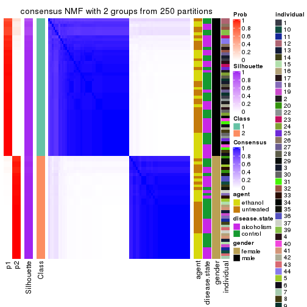</p>

</div>
<div id='tab-CV-NMF-consensus-heatmap-2'>
<pre><code class="r">consensus_heatmap(res, k = 3)
</code></pre>

<p></p>

</div>
<div id='tab-CV-NMF-consensus-heatmap-3'>
<pre><code class="r">consensus_heatmap(res, k = 4)
</code></pre>

<p></p>

</div>
<div id='tab-CV-NMF-consensus-heatmap-4'>
<pre><code class="r">consensus_heatmap(res, k = 5)
</code></pre>

<p></p>

</div>
<div id='tab-CV-NMF-consensus-heatmap-5'>
<pre><code class="r">consensus_heatmap(res, k = 6)
</code></pre>

<p></p>

</div>
</div>

Heatmaps for the membership of samples in all partitions to see how consistent they are:


<script>
$( function() {
	$( '#tabs-CV-NMF-membership-heatmap' ).tabs();
} );
</script>
<div id='tabs-CV-NMF-membership-heatmap'>
<ul>
<li><a href='#tab-CV-NMF-membership-heatmap-1'>k = 2</a></li>
<li><a href='#tab-CV-NMF-membership-heatmap-2'>k = 3</a></li>
<li><a href='#tab-CV-NMF-membership-heatmap-3'>k = 4</a></li>
<li><a href='#tab-CV-NMF-membership-heatmap-4'>k = 5</a></li>
<li><a href='#tab-CV-NMF-membership-heatmap-5'>k = 6</a></li>
</ul>
<div id='tab-CV-NMF-membership-heatmap-1'>
<pre><code class="r">membership_heatmap(res, k = 2)
</code></pre>

<p></p>

</div>
<div id='tab-CV-NMF-membership-heatmap-2'>
<pre><code class="r">membership_heatmap(res, k = 3)
</code></pre>

<p></p>

</div>
<div id='tab-CV-NMF-membership-heatmap-3'>
<pre><code class="r">membership_heatmap(res, k = 4)
</code></pre>

<p></p>

</div>
<div id='tab-CV-NMF-membership-heatmap-4'>
<pre><code class="r">membership_heatmap(res, k = 5)
</code></pre>

<p></p>

</div>
<div id='tab-CV-NMF-membership-heatmap-5'>
<pre><code class="r">membership_heatmap(res, k = 6)
</code></pre>

<p>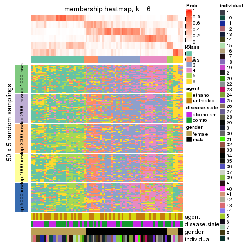</p>

</div>
</div>

As soon as we have had the classes for columns, we can look for signatures
which are significantly different between classes which can be candidate marks
for certain classes. Following are the heatmaps for signatures.


Signature heatmaps where rows are scaled:


<script>
$( function() {
	$( '#tabs-CV-NMF-get-signatures' ).tabs();
} );
</script>
<div id='tabs-CV-NMF-get-signatures'>
<ul>
<li><a href='#tab-CV-NMF-get-signatures-1'>k = 2</a></li>
<li><a href='#tab-CV-NMF-get-signatures-2'>k = 3</a></li>
<li><a href='#tab-CV-NMF-get-signatures-3'>k = 4</a></li>
<li><a href='#tab-CV-NMF-get-signatures-4'>k = 5</a></li>
<li><a href='#tab-CV-NMF-get-signatures-5'>k = 6</a></li>
</ul>
<div id='tab-CV-NMF-get-signatures-1'>
<pre><code class="r">get_signatures(res, k = 2)
</code></pre>

<p></p>

</div>
<div id='tab-CV-NMF-get-signatures-2'>
<pre><code class="r">get_signatures(res, k = 3)
</code></pre>

<p></p>

</div>
<div id='tab-CV-NMF-get-signatures-3'>
<pre><code class="r">get_signatures(res, k = 4)
</code></pre>

<p></p>

</div>
<div id='tab-CV-NMF-get-signatures-4'>
<pre><code class="r">get_signatures(res, k = 5)
</code></pre>

<p></p>

</div>
<div id='tab-CV-NMF-get-signatures-5'>
<pre><code class="r">get_signatures(res, k = 6)
</code></pre>

<p></p>

</div>
</div>


Signature heatmaps where rows are not scaled:


<script>
$( function() {
	$( '#tabs-CV-NMF-get-signatures-no-scale' ).tabs();
} );
</script>
<div id='tabs-CV-NMF-get-signatures-no-scale'>
<ul>
<li><a href='#tab-CV-NMF-get-signatures-no-scale-1'>k = 2</a></li>
<li><a href='#tab-CV-NMF-get-signatures-no-scale-2'>k = 3</a></li>
<li><a href='#tab-CV-NMF-get-signatures-no-scale-3'>k = 4</a></li>
<li><a href='#tab-CV-NMF-get-signatures-no-scale-4'>k = 5</a></li>
<li><a href='#tab-CV-NMF-get-signatures-no-scale-5'>k = 6</a></li>
</ul>
<div id='tab-CV-NMF-get-signatures-no-scale-1'>
<pre><code class="r">get_signatures(res, k = 2, scale_rows = FALSE)
</code></pre>

<p></p>

</div>
<div id='tab-CV-NMF-get-signatures-no-scale-2'>
<pre><code class="r">get_signatures(res, k = 3, scale_rows = FALSE)
</code></pre>

<p></p>

</div>
<div id='tab-CV-NMF-get-signatures-no-scale-3'>
<pre><code class="r">get_signatures(res, k = 4, scale_rows = FALSE)
</code></pre>

<p></p>

</div>
<div id='tab-CV-NMF-get-signatures-no-scale-4'>
<pre><code class="r">get_signatures(res, k = 5, scale_rows = FALSE)
</code></pre>

<p>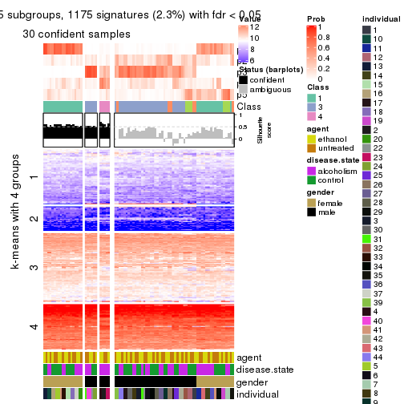</p>

</div>
<div id='tab-CV-NMF-get-signatures-no-scale-5'>
<pre><code class="r">get_signatures(res, k = 6, scale_rows = FALSE)
</code></pre>

<p></p>

</div>
</div>


Compare the overlap of signatures from different k:

```r
compare_signatures(res)
```


`get_signature()` returns a data frame invisibly. TO get the list of signatures, the function
call should be assigned to a variable explicitly. In following code, if `plot` argument is set
to `FALSE`, no heatmap is plotted while only the differential analysis is performed.

```r
# code only for demonstration
tb = get_signature(res, k = ..., plot = FALSE)
```

An example of the output of `tb` is:

```
#>   which_row         fdr    mean_1    mean_2 scaled_mean_1 scaled_mean_2 km
#> 1        38 0.042760348  8.373488  9.131774    -0.5533452     0.5164555  1
#> 2        40 0.018707592  7.106213  8.469186    -0.6173731     0.5762149  1
#> 3        55 0.019134737 10.221463 11.207825    -0.6159697     0.5749050  1
#> 4        59 0.006059896  5.921854  7.869574    -0.6899429     0.6439467  1
#> 5        60 0.018055526  8.928898 10.211722    -0.6204761     0.5791110  1
#> 6        98 0.009384629 15.714769 14.887706     0.6635654    -0.6193277  2
...
```

The columns in `tb` are:

1. `which_row`: row indices corresponding to the input matrix.
2. `fdr`: FDR for the differential test. 
3. `mean_x`: The mean value in group x.
4. `scaled_mean_x`: The mean value in group x after rows are scaled.
5. `km`: Row groups if k-means clustering is applied to rows.


UMAP plot which shows how samples are separated.


<script>
$( function() {
	$( '#tabs-CV-NMF-dimension-reduction' ).tabs();
} );
</script>
<div id='tabs-CV-NMF-dimension-reduction'>
<ul>
<li><a href='#tab-CV-NMF-dimension-reduction-1'>k = 2</a></li>
<li><a href='#tab-CV-NMF-dimension-reduction-2'>k = 3</a></li>
<li><a href='#tab-CV-NMF-dimension-reduction-3'>k = 4</a></li>
<li><a href='#tab-CV-NMF-dimension-reduction-4'>k = 5</a></li>
<li><a href='#tab-CV-NMF-dimension-reduction-5'>k = 6</a></li>
</ul>
<div id='tab-CV-NMF-dimension-reduction-1'>
<pre><code class="r">dimension_reduction(res, k = 2, method = &quot;UMAP&quot;)
</code></pre>

<p></p>

</div>
<div id='tab-CV-NMF-dimension-reduction-2'>
<pre><code class="r">dimension_reduction(res, k = 3, method = &quot;UMAP&quot;)
</code></pre>

<p></p>

</div>
<div id='tab-CV-NMF-dimension-reduction-3'>
<pre><code class="r">dimension_reduction(res, k = 4, method = &quot;UMAP&quot;)
</code></pre>

<p></p>

</div>
<div id='tab-CV-NMF-dimension-reduction-4'>
<pre><code class="r">dimension_reduction(res, k = 5, method = &quot;UMAP&quot;)
</code></pre>

<p></p>

</div>
<div id='tab-CV-NMF-dimension-reduction-5'>
<pre><code class="r">dimension_reduction(res, k = 6, method = &quot;UMAP&quot;)
</code></pre>

<p></p>

</div>
</div>


Following heatmap shows how subgroups are split when increasing `k`:

```r
collect_classes(res)
```


Test correlation between subgroups and known annotations. If the known
annotation is numeric, one-way ANOVA test is applied, and if the known
annotation is discrete, chi-squared contingency table test is applied.

```r
test_to_known_factors(res)
```

```
#>         n agent(p) disease.state(p) gender(p) individual(p) k
#> CV:NMF 84    1.000           1.0000  3.81e-19      8.65e-05 2
#> CV:NMF 72    1.000           0.8134  1.59e-16      3.40e-04 3
#> CV:NMF 55    0.869           1.0000  9.66e-13      2.48e-03 4
#> CV:NMF 30    0.942           0.0684  3.06e-07      1.95e-03 5
#> CV:NMF  1       NA               NA        NA            NA 6
```


If matrix rows can be associated to genes, consider to use `GO_Enrichment(res,
...)` to perform function enrichment for the signature genes.


 

---------------------------------------------------


### MAD:hclust


The object with results only for a single top-value method and a single partition method 
can be extracted as:

```r
res = res_list["MAD", "hclust"]
# you can also extract it by
# res = res_list["MAD:hclust"]
```

A summary of `res` and all the functions that can be applied to it:

```r
res
```

```
#> A 'ConsensusPartition' object with k = 2, 3, 4, 5, 6.
#>   On a matrix with 51941 rows and 84 columns.
#>   Top rows (1000, 2000, 3000, 4000, 5000) are extracted by 'MAD' method.
#>   Subgroups are detected by 'hclust' method.
#>   Performed in total 1250 partitions by row resampling.
#>   Best k for subgroups seems to be 3.
#> 
#> Following methods can be applied to this 'ConsensusPartition' object:
#>  [1] "cola_report"             "collect_classes"         "collect_plots"          
#>  [4] "collect_stats"           "colnames"                "compare_signatures"     
#>  [7] "consensus_heatmap"       "dimension_reduction"     "functional_enrichment"  
#> [10] "get_anno_col"            "get_anno"                "get_classes"            
#> [13] "get_consensus"           "get_matrix"              "get_membership"         
#> [16] "get_param"               "get_signatures"          "get_stats"              
#> [19] "is_best_k"               "is_stable_k"             "membership_heatmap"     
#> [22] "ncol"                    "nrow"                    "plot_ecdf"              
#> [25] "rownames"                "select_partition_number" "show"                   
#> [28] "suggest_best_k"          "test_to_known_factors"
```

`collect_plots()` function collects all the plots made from `res` for all `k` (number of partitions)
into one single page to provide an easy and fast comparison between different `k`.

```r
collect_plots(res)
```


The plots are:

- The first row: a plot of the ECDF (Empirical cumulative distribution
  function) curves of the consensus matrix for each `k` and the heatmap of
  predicted classes for each `k`.
- The second row: heatmaps of the consensus matrix for each `k`.
- The third row: heatmaps of the membership matrix for each `k`.
- The fouth row: heatmaps of the signatures for each `k`.

All the plots in panels can be made by individual functions and they are
plotted later in this section.

`select_partition_number()` produces several plots showing different
statistics for choosing "optimized" `k`. There are following statistics:

- ECDF curves of the consensus matrix for each `k`;
- 1-PAC. [The PAC
  score](https://en.wikipedia.org/wiki/Consensus_clustering#Over-interpretation_potential_of_consensus_clustering)
  measures the proportion of the ambiguous subgrouping.
- Mean silhouette score.
- Concordance. The mean probability of fiting the consensus class ids in all
  partitions.
- Area increased. Denote $A_k$ as the area under the ECDF curve for current
  `k`, the area increased is defined as $A_k - A_{k-1}$.
- Rand index. The percent of pairs of samples that are both in a same cluster
  or both are not in a same cluster in the partition of k and k-1.
- Jaccard index. The ratio of pairs of samples are both in a same cluster in
  the partition of k and k-1 and the pairs of samples are both in a same
  cluster in the partition k or k-1.

The detailed explanations of these statistics can be found in [the cola
vignette](http://bioconductor.org/packages/devel/bioc/vignettes/cola/inst/doc/cola.html#toc_13).

Generally speaking, lower PAC score, higher mean silhouette score or higher
concordance corresponds to better partition. Rand index and Jaccard index
measure how similar the current partition is compared to partition with `k-1`.
If they are too similar, we won't accept `k` is better than `k-1`.

```r
select_partition_number(res)
```


The numeric values for all these statistics can be obtained by `get_stats()`.

```r
get_stats(res)
```

```
#>   k  1-PAC mean_silhouette concordance area_increased  Rand Jaccard
#> 2 2 0.0208           0.323       0.728         0.3387 0.845   0.845
#> 3 3 0.0175           0.454       0.595         0.5777 0.617   0.567
#> 4 4 0.0730           0.410       0.568         0.1830 0.863   0.752
#> 5 5 0.1835           0.360       0.552         0.1025 0.936   0.855
#> 6 6 0.2481           0.378       0.533         0.0616 0.892   0.746
```

`suggest_best_k()` suggests the best $k$ based on these statistics. The rules are as follows:

- All $k$ with Jaccard index larger than 0.95 are removed because the increase of
  the partition number does not provides enough extra information. If all $k$ are removed,
  the best $k$ is assigned by `NA`.
- For $k$ with 1-PAC larger than 0.9, the maximal $k$ is taken as the "best k". Other $k$ is called "optional k".
- If it does not fit the second rule. The $k$ with the highest vote of highest
  1-PAC, mean silhouette and concordance is taken as the "best k".

```r
suggest_best_k(res)
```

```
#> [1] 3
```


Following shows the table of the partitions (You need to click the **show/hide
code output** link to see it). The membership matrix (columns with name `p*`)
is inferred by
[`clue::cl_consensus()`](https://www.rdocumentation.org/link/cl_consensus?package=clue)
function with the `SE` method. Basically the value in the membership matrix
represents the probability to belong to a certain group. The finall class
label for an item is determined with the group with highest probability it
belongs to.

In `get_classes()` function, the entropy is calculated from the membership
matrix and the silhouette score is calculated from the consensus matrix.


<script>
$( function() {
	$( '#tabs-MAD-hclust-get-classes' ).tabs();
} );
</script>
<div id='tabs-MAD-hclust-get-classes'>
<ul>
<li><a href='#tab-MAD-hclust-get-classes-1'>k = 2</a></li>
<li><a href='#tab-MAD-hclust-get-classes-2'>k = 3</a></li>
<li><a href='#tab-MAD-hclust-get-classes-3'>k = 4</a></li>
<li><a href='#tab-MAD-hclust-get-classes-4'>k = 5</a></li>
<li><a href='#tab-MAD-hclust-get-classes-5'>k = 6</a></li>
</ul>

<div id='tab-MAD-hclust-get-classes-1'>
<p><a id='tab-MAD-hclust-get-classes-1-a' style='color:#0366d6' href='#'>show/hide code output</a></p>
<pre><code class="r">cbind(get_classes(res, k = 2), get_membership(res, k = 2))
</code></pre>

<pre><code>#&gt;            class entropy silhouette    p1    p2
#&gt; GSM1269647     1   0.955    -0.2745 0.624 0.376
#&gt; GSM1269655     1   0.529     0.5996 0.880 0.120
#&gt; GSM1269663     1   0.904     0.2721 0.680 0.320
#&gt; GSM1269671     2   1.000     0.8391 0.492 0.508
#&gt; GSM1269679     1   0.653     0.5932 0.832 0.168
#&gt; GSM1269693     1   0.767     0.5323 0.776 0.224
#&gt; GSM1269701     1   0.653     0.5870 0.832 0.168
#&gt; GSM1269709     1   0.563     0.5958 0.868 0.132
#&gt; GSM1269715     1   0.994     0.2167 0.544 0.456
#&gt; GSM1269717     1   0.921     0.3652 0.664 0.336
#&gt; GSM1269721     1   0.998    -0.6864 0.524 0.476
#&gt; GSM1269723     1   0.634     0.5935 0.840 0.160
#&gt; GSM1269645     1   0.788     0.5406 0.764 0.236
#&gt; GSM1269653     1   0.990    -0.2435 0.560 0.440
#&gt; GSM1269661     1   0.634     0.5828 0.840 0.160
#&gt; GSM1269669     1   0.443     0.6022 0.908 0.092
#&gt; GSM1269677     2   1.000     0.8633 0.492 0.508
#&gt; GSM1269685     1   0.541     0.6052 0.876 0.124
#&gt; GSM1269691     1   0.541     0.6044 0.876 0.124
#&gt; GSM1269699     1   1.000    -0.7004 0.512 0.488
#&gt; GSM1269707     1   0.994    -0.6320 0.544 0.456
#&gt; GSM1269651     1   1.000    -0.8740 0.500 0.500
#&gt; GSM1269659     1   0.997    -0.6772 0.532 0.468
#&gt; GSM1269667     1   0.518     0.6065 0.884 0.116
#&gt; GSM1269675     1   0.971    -0.4150 0.600 0.400
#&gt; GSM1269683     1   0.584     0.5828 0.860 0.140
#&gt; GSM1269689     1   0.971    -0.2103 0.600 0.400
#&gt; GSM1269697     1   0.904     0.1577 0.680 0.320
#&gt; GSM1269705     1   0.949    -0.3364 0.632 0.368
#&gt; GSM1269713     1   0.833     0.4215 0.736 0.264
#&gt; GSM1269719     1   0.760     0.4490 0.780 0.220
#&gt; GSM1269725     1   0.795     0.4237 0.760 0.240
#&gt; GSM1269727     1   0.605     0.5983 0.852 0.148
#&gt; GSM1269649     1   0.653     0.5704 0.832 0.168
#&gt; GSM1269657     1   0.900     0.1472 0.684 0.316
#&gt; GSM1269665     1   0.563     0.6050 0.868 0.132
#&gt; GSM1269673     1   0.506     0.5934 0.888 0.112
#&gt; GSM1269681     2   0.996     0.8802 0.464 0.536
#&gt; GSM1269687     1   0.430     0.6041 0.912 0.088
#&gt; GSM1269695     1   0.443     0.6040 0.908 0.092
#&gt; GSM1269703     1   0.494     0.6106 0.892 0.108
#&gt; GSM1269711     1   0.563     0.5862 0.868 0.132
#&gt; GSM1269646     1   0.955    -0.2745 0.624 0.376
#&gt; GSM1269654     1   0.529     0.5996 0.880 0.120
#&gt; GSM1269662     1   0.913     0.2124 0.672 0.328
#&gt; GSM1269670     2   1.000     0.8391 0.492 0.508
#&gt; GSM1269678     1   0.563     0.6103 0.868 0.132
#&gt; GSM1269692     1   0.767     0.5406 0.776 0.224
#&gt; GSM1269700     1   0.653     0.5870 0.832 0.168
#&gt; GSM1269708     1   0.563     0.5958 0.868 0.132
#&gt; GSM1269714     1   0.644     0.5946 0.836 0.164
#&gt; GSM1269716     1   0.921     0.3652 0.664 0.336
#&gt; GSM1269720     1   0.998    -0.6864 0.524 0.476
#&gt; GSM1269722     1   0.662     0.5943 0.828 0.172
#&gt; GSM1269644     1   0.563     0.6013 0.868 0.132
#&gt; GSM1269652     1   0.925    -0.0752 0.660 0.340
#&gt; GSM1269660     1   0.644     0.5840 0.836 0.164
#&gt; GSM1269668     1   0.443     0.6014 0.908 0.092
#&gt; GSM1269676     2   1.000     0.8633 0.492 0.508
#&gt; GSM1269684     1   0.469     0.6046 0.900 0.100
#&gt; GSM1269690     1   0.541     0.6044 0.876 0.124
#&gt; GSM1269698     1   1.000    -0.7004 0.512 0.488
#&gt; GSM1269706     1   0.994    -0.6320 0.544 0.456
#&gt; GSM1269650     2   1.000     0.8511 0.500 0.500
#&gt; GSM1269658     1   0.997    -0.6772 0.532 0.468
#&gt; GSM1269666     1   0.529     0.6059 0.880 0.120
#&gt; GSM1269674     1   0.971    -0.4150 0.600 0.400
#&gt; GSM1269682     1   0.584     0.5959 0.860 0.140
#&gt; GSM1269688     1   0.971    -0.2103 0.600 0.400
#&gt; GSM1269696     1   0.929     0.0855 0.656 0.344
#&gt; GSM1269704     1   0.949    -0.3364 0.632 0.368
#&gt; GSM1269712     1   0.808     0.4617 0.752 0.248
#&gt; GSM1269718     1   0.760     0.4490 0.780 0.220
#&gt; GSM1269724     1   0.767     0.4656 0.776 0.224
#&gt; GSM1269726     1   0.615     0.5982 0.848 0.152
#&gt; GSM1269648     1   0.653     0.5644 0.832 0.168
#&gt; GSM1269656     1   0.891     0.1777 0.692 0.308
#&gt; GSM1269664     1   0.482     0.6069 0.896 0.104
#&gt; GSM1269672     1   0.506     0.5959 0.888 0.112
#&gt; GSM1269680     2   0.996     0.8802 0.464 0.536
#&gt; GSM1269686     1   0.430     0.6041 0.912 0.088
#&gt; GSM1269694     1   0.443     0.6040 0.908 0.092
#&gt; GSM1269702     1   0.469     0.5961 0.900 0.100
#&gt; GSM1269710     1   0.541     0.5948 0.876 0.124
</code></pre>

<script>
$('#tab-MAD-hclust-get-classes-1-a').parent().next().next().hide();
$('#tab-MAD-hclust-get-classes-1-a').click(function(){
  $('#tab-MAD-hclust-get-classes-1-a').parent().next().next().toggle();
  return(false);
});
</script>
</div>

<div id='tab-MAD-hclust-get-classes-2'>
<p><a id='tab-MAD-hclust-get-classes-2-a' style='color:#0366d6' href='#'>show/hide code output</a></p>
<pre><code class="r">cbind(get_classes(res, k = 3), get_membership(res, k = 3))
</code></pre>

<pre><code>#&gt;            class entropy silhouette    p1    p2    p3
#&gt; GSM1269647     2   0.843     0.3459 0.384 0.524 0.092
#&gt; GSM1269655     1   0.755     0.6099 0.684 0.204 0.112
#&gt; GSM1269663     1   0.933     0.2105 0.520 0.232 0.248
#&gt; GSM1269671     2   0.806     0.5833 0.236 0.640 0.124
#&gt; GSM1269679     1   0.727     0.5756 0.700 0.204 0.096
#&gt; GSM1269693     1   0.875     0.2417 0.584 0.172 0.244
#&gt; GSM1269701     1   0.762     0.5205 0.684 0.188 0.128
#&gt; GSM1269709     1   0.694     0.5902 0.708 0.224 0.068
#&gt; GSM1269715     3   0.711     0.0000 0.388 0.028 0.584
#&gt; GSM1269717     1   0.780    -0.4926 0.520 0.052 0.428
#&gt; GSM1269721     2   0.792     0.5629 0.248 0.644 0.108
#&gt; GSM1269723     1   0.723     0.5626 0.708 0.188 0.104
#&gt; GSM1269645     1   0.848     0.3690 0.616 0.196 0.188
#&gt; GSM1269653     2   0.890     0.4148 0.320 0.536 0.144
#&gt; GSM1269661     1   0.702     0.5762 0.704 0.224 0.072
#&gt; GSM1269669     1   0.581     0.5857 0.800 0.108 0.092
#&gt; GSM1269677     2   0.869     0.5373 0.176 0.592 0.232
#&gt; GSM1269685     1   0.613     0.5990 0.780 0.136 0.084
#&gt; GSM1269691     1   0.579     0.6062 0.800 0.116 0.084
#&gt; GSM1269699     2   0.618     0.5662 0.236 0.732 0.032
#&gt; GSM1269707     2   0.613     0.5527 0.268 0.712 0.020
#&gt; GSM1269651     2   0.916     0.5329 0.204 0.540 0.256
#&gt; GSM1269659     2   0.935     0.4785 0.256 0.516 0.228
#&gt; GSM1269667     1   0.683     0.6104 0.740 0.148 0.112
#&gt; GSM1269675     2   0.868     0.4699 0.352 0.532 0.116
#&gt; GSM1269683     1   0.721     0.5375 0.716 0.128 0.156
#&gt; GSM1269689     2   0.804     0.3620 0.372 0.556 0.072
#&gt; GSM1269697     1   0.875    -0.0151 0.492 0.396 0.112
#&gt; GSM1269705     2   0.830     0.3646 0.416 0.504 0.080
#&gt; GSM1269713     1   0.833     0.2924 0.564 0.340 0.096
#&gt; GSM1269719     1   0.844     0.3709 0.592 0.284 0.124
#&gt; GSM1269725     1   0.829     0.3194 0.572 0.332 0.096
#&gt; GSM1269727     1   0.769     0.5452 0.680 0.184 0.136
#&gt; GSM1269649     1   0.677     0.5655 0.720 0.216 0.064
#&gt; GSM1269657     2   0.879     0.1509 0.432 0.456 0.112
#&gt; GSM1269665     1   0.611     0.5850 0.784 0.116 0.100
#&gt; GSM1269673     1   0.573     0.6225 0.796 0.144 0.060
#&gt; GSM1269681     2   0.886     0.5313 0.164 0.564 0.272
#&gt; GSM1269687     1   0.542     0.6014 0.820 0.100 0.080
#&gt; GSM1269695     1   0.537     0.6212 0.812 0.140 0.048
#&gt; GSM1269703     1   0.560     0.6311 0.804 0.136 0.060
#&gt; GSM1269711     1   0.640     0.5811 0.744 0.200 0.056
#&gt; GSM1269646     2   0.844     0.3435 0.388 0.520 0.092
#&gt; GSM1269654     1   0.755     0.6099 0.684 0.204 0.112
#&gt; GSM1269662     1   0.947     0.1414 0.496 0.228 0.276
#&gt; GSM1269670     2   0.806     0.5833 0.236 0.640 0.124
#&gt; GSM1269678     1   0.668     0.6135 0.744 0.168 0.088
#&gt; GSM1269692     1   0.859     0.2971 0.604 0.180 0.216
#&gt; GSM1269700     1   0.762     0.5205 0.684 0.188 0.128
#&gt; GSM1269708     1   0.702     0.5901 0.704 0.224 0.072
#&gt; GSM1269714     1   0.760     0.5543 0.688 0.172 0.140
#&gt; GSM1269716     1   0.781    -0.4986 0.516 0.052 0.432
#&gt; GSM1269720     2   0.792     0.5629 0.248 0.644 0.108
#&gt; GSM1269722     1   0.756     0.5631 0.676 0.224 0.100
#&gt; GSM1269644     1   0.591     0.6251 0.788 0.144 0.068
#&gt; GSM1269652     2   0.792     0.2179 0.468 0.476 0.056
#&gt; GSM1269660     1   0.719     0.5762 0.696 0.224 0.080
#&gt; GSM1269668     1   0.594     0.5879 0.792 0.120 0.088
#&gt; GSM1269676     2   0.869     0.5373 0.176 0.592 0.232
#&gt; GSM1269684     1   0.614     0.5768 0.780 0.132 0.088
#&gt; GSM1269690     1   0.579     0.6062 0.800 0.116 0.084
#&gt; GSM1269698     2   0.618     0.5662 0.236 0.732 0.032
#&gt; GSM1269706     2   0.613     0.5527 0.268 0.712 0.020
#&gt; GSM1269650     2   0.916     0.5329 0.204 0.540 0.256
#&gt; GSM1269658     2   0.938     0.4752 0.260 0.512 0.228
#&gt; GSM1269666     1   0.688     0.6093 0.736 0.156 0.108
#&gt; GSM1269674     2   0.868     0.4699 0.352 0.532 0.116
#&gt; GSM1269682     1   0.722     0.5693 0.716 0.152 0.132
#&gt; GSM1269688     2   0.804     0.3620 0.372 0.556 0.072
#&gt; GSM1269696     1   0.882    -0.0736 0.476 0.408 0.116
#&gt; GSM1269704     2   0.830     0.3646 0.416 0.504 0.080
#&gt; GSM1269712     1   0.853     0.3329 0.556 0.332 0.112
#&gt; GSM1269718     1   0.844     0.3709 0.592 0.284 0.124
#&gt; GSM1269724     1   0.806     0.3469 0.588 0.328 0.084
#&gt; GSM1269726     1   0.770     0.5417 0.680 0.180 0.140
#&gt; GSM1269648     1   0.663     0.5686 0.724 0.220 0.056
#&gt; GSM1269656     1   0.879    -0.1449 0.452 0.436 0.112
#&gt; GSM1269664     1   0.608     0.5934 0.784 0.128 0.088
#&gt; GSM1269672     1   0.563     0.6315 0.800 0.144 0.056
#&gt; GSM1269680     2   0.886     0.5313 0.164 0.564 0.272
#&gt; GSM1269686     1   0.541     0.6007 0.820 0.104 0.076
#&gt; GSM1269694     1   0.537     0.6212 0.812 0.140 0.048
#&gt; GSM1269702     1   0.632     0.6251 0.760 0.172 0.068
#&gt; GSM1269710     1   0.604     0.6020 0.772 0.172 0.056
</code></pre>

<script>
$('#tab-MAD-hclust-get-classes-2-a').parent().next().next().hide();
$('#tab-MAD-hclust-get-classes-2-a').click(function(){
  $('#tab-MAD-hclust-get-classes-2-a').parent().next().next().toggle();
  return(false);
});
</script>
</div>

<div id='tab-MAD-hclust-get-classes-3'>
<p><a id='tab-MAD-hclust-get-classes-3-a' style='color:#0366d6' href='#'>show/hide code output</a></p>
<pre><code class="r">cbind(get_classes(res, k = 4), get_membership(res, k = 4))
</code></pre>

<pre><code>#&gt;            class entropy silhouette    p1    p2    p3    p4
#&gt; GSM1269647     2   0.795     0.4508 0.304 0.520 0.040 0.136
#&gt; GSM1269655     1   0.690     0.5096 0.668 0.188 0.092 0.052
#&gt; GSM1269663     1   0.916    -0.0500 0.396 0.148 0.120 0.336
#&gt; GSM1269671     2   0.818     0.1928 0.080 0.500 0.092 0.328
#&gt; GSM1269679     1   0.720     0.4942 0.640 0.208 0.096 0.056
#&gt; GSM1269693     1   0.858    -0.0708 0.508 0.080 0.244 0.168
#&gt; GSM1269701     1   0.715     0.4400 0.612 0.240 0.124 0.024
#&gt; GSM1269709     1   0.722     0.5301 0.648 0.192 0.092 0.068
#&gt; GSM1269715     3   0.484     0.5899 0.256 0.016 0.724 0.004
#&gt; GSM1269717     3   0.655     0.7152 0.448 0.028 0.496 0.028
#&gt; GSM1269721     4   0.807     0.1963 0.152 0.348 0.032 0.468
#&gt; GSM1269723     1   0.701     0.4889 0.648 0.208 0.104 0.040
#&gt; GSM1269645     1   0.855     0.0588 0.536 0.200 0.160 0.104
#&gt; GSM1269653     2   0.856     0.3878 0.228 0.504 0.068 0.200
#&gt; GSM1269661     1   0.797     0.4569 0.588 0.208 0.100 0.104
#&gt; GSM1269669     1   0.602     0.4966 0.728 0.144 0.104 0.024
#&gt; GSM1269677     4   0.507     0.5422 0.076 0.104 0.024 0.796
#&gt; GSM1269685     1   0.652     0.5023 0.716 0.108 0.104 0.072
#&gt; GSM1269691     1   0.600     0.5134 0.752 0.080 0.080 0.088
#&gt; GSM1269699     2   0.691     0.4384 0.140 0.624 0.012 0.224
#&gt; GSM1269707     2   0.752     0.4413 0.164 0.588 0.028 0.220
#&gt; GSM1269651     4   0.582     0.5167 0.092 0.096 0.052 0.760
#&gt; GSM1269659     4   0.708     0.5014 0.164 0.136 0.044 0.656
#&gt; GSM1269667     1   0.650     0.5238 0.712 0.136 0.092 0.060
#&gt; GSM1269675     2   0.834     0.4189 0.212 0.540 0.072 0.176
#&gt; GSM1269683     1   0.694     0.3823 0.668 0.072 0.188 0.072
#&gt; GSM1269689     2   0.743     0.4947 0.288 0.580 0.052 0.080
#&gt; GSM1269697     1   0.860    -0.1533 0.408 0.392 0.088 0.112
#&gt; GSM1269705     2   0.812     0.4610 0.348 0.472 0.040 0.140
#&gt; GSM1269713     1   0.844     0.1886 0.500 0.296 0.088 0.116
#&gt; GSM1269719     1   0.844     0.2492 0.544 0.156 0.096 0.204
#&gt; GSM1269725     1   0.774     0.2140 0.516 0.348 0.060 0.076
#&gt; GSM1269727     1   0.759     0.4314 0.628 0.160 0.136 0.076
#&gt; GSM1269649     1   0.671     0.4951 0.656 0.236 0.064 0.044
#&gt; GSM1269657     4   0.873     0.0681 0.328 0.220 0.048 0.404
#&gt; GSM1269665     1   0.648     0.4634 0.720 0.104 0.096 0.080
#&gt; GSM1269673     1   0.613     0.5444 0.740 0.116 0.060 0.084
#&gt; GSM1269681     4   0.469     0.5080 0.048 0.084 0.044 0.824
#&gt; GSM1269687     1   0.593     0.5125 0.756 0.092 0.084 0.068
#&gt; GSM1269695     1   0.573     0.5489 0.740 0.172 0.060 0.028
#&gt; GSM1269703     1   0.573     0.5446 0.756 0.132 0.076 0.036
#&gt; GSM1269711     1   0.630     0.5187 0.668 0.248 0.060 0.024
#&gt; GSM1269646     2   0.797     0.4500 0.308 0.516 0.040 0.136
#&gt; GSM1269654     1   0.690     0.5096 0.668 0.188 0.092 0.052
#&gt; GSM1269662     4   0.891    -0.0117 0.380 0.140 0.096 0.384
#&gt; GSM1269670     2   0.818     0.1928 0.080 0.500 0.092 0.328
#&gt; GSM1269678     1   0.682     0.5271 0.692 0.128 0.112 0.068
#&gt; GSM1269692     1   0.842     0.0609 0.540 0.084 0.204 0.172
#&gt; GSM1269700     1   0.715     0.4400 0.612 0.240 0.124 0.024
#&gt; GSM1269708     1   0.727     0.5289 0.644 0.192 0.096 0.068
#&gt; GSM1269714     1   0.766     0.4226 0.620 0.132 0.172 0.076
#&gt; GSM1269716     3   0.663     0.7179 0.444 0.032 0.496 0.028
#&gt; GSM1269720     4   0.807     0.1963 0.152 0.348 0.032 0.468
#&gt; GSM1269722     1   0.737     0.4880 0.628 0.212 0.096 0.064
#&gt; GSM1269644     1   0.638     0.5426 0.724 0.120 0.068 0.088
#&gt; GSM1269652     2   0.815     0.3561 0.368 0.436 0.028 0.168
#&gt; GSM1269660     1   0.807     0.4529 0.580 0.208 0.108 0.104
#&gt; GSM1269668     1   0.601     0.5013 0.728 0.148 0.100 0.024
#&gt; GSM1269676     4   0.507     0.5422 0.076 0.104 0.024 0.796
#&gt; GSM1269684     1   0.624     0.4807 0.736 0.072 0.100 0.092
#&gt; GSM1269690     1   0.600     0.5134 0.752 0.080 0.080 0.088
#&gt; GSM1269698     2   0.691     0.4384 0.140 0.624 0.012 0.224
#&gt; GSM1269706     2   0.752     0.4413 0.164 0.588 0.028 0.220
#&gt; GSM1269650     4   0.582     0.5167 0.092 0.096 0.052 0.760
#&gt; GSM1269658     4   0.712     0.4983 0.168 0.136 0.044 0.652
#&gt; GSM1269666     1   0.651     0.5222 0.712 0.136 0.088 0.064
#&gt; GSM1269674     2   0.834     0.4189 0.212 0.540 0.072 0.176
#&gt; GSM1269682     1   0.699     0.4288 0.672 0.092 0.168 0.068
#&gt; GSM1269688     2   0.743     0.4947 0.288 0.580 0.052 0.080
#&gt; GSM1269696     2   0.870     0.1731 0.384 0.404 0.088 0.124
#&gt; GSM1269704     2   0.812     0.4610 0.348 0.472 0.040 0.140
#&gt; GSM1269712     1   0.860     0.2315 0.500 0.276 0.108 0.116
#&gt; GSM1269718     1   0.844     0.2492 0.544 0.156 0.096 0.204
#&gt; GSM1269724     1   0.742     0.2655 0.544 0.340 0.056 0.060
#&gt; GSM1269726     1   0.763     0.4275 0.624 0.164 0.136 0.076
#&gt; GSM1269648     1   0.642     0.5071 0.676 0.228 0.060 0.036
#&gt; GSM1269656     4   0.872     0.0399 0.348 0.212 0.048 0.392
#&gt; GSM1269664     1   0.619     0.5005 0.740 0.092 0.088 0.080
#&gt; GSM1269672     1   0.607     0.5549 0.740 0.132 0.056 0.072
#&gt; GSM1269680     4   0.469     0.5080 0.048 0.084 0.044 0.824
#&gt; GSM1269686     1   0.580     0.5107 0.764 0.088 0.080 0.068
#&gt; GSM1269694     1   0.573     0.5489 0.740 0.172 0.060 0.028
#&gt; GSM1269702     1   0.682     0.5323 0.696 0.120 0.084 0.100
#&gt; GSM1269710     1   0.622     0.5401 0.680 0.232 0.068 0.020
</code></pre>

<script>
$('#tab-MAD-hclust-get-classes-3-a').parent().next().next().hide();
$('#tab-MAD-hclust-get-classes-3-a').click(function(){
  $('#tab-MAD-hclust-get-classes-3-a').parent().next().next().toggle();
  return(false);
});
</script>
</div>

<div id='tab-MAD-hclust-get-classes-4'>
<p><a id='tab-MAD-hclust-get-classes-4-a' style='color:#0366d6' href='#'>show/hide code output</a></p>
<pre><code class="r">cbind(get_classes(res, k = 5), get_membership(res, k = 5))
</code></pre>

<pre><code>#&gt;            class entropy silhouette    p1    p2    p3    p4    p5
#&gt; GSM1269647     5   0.786    0.38870 0.264 0.048 0.140 0.048 0.500
#&gt; GSM1269655     1   0.705    0.40420 0.576 0.040 0.224 0.020 0.140
#&gt; GSM1269663     3   0.891    0.39480 0.248 0.256 0.356 0.068 0.072
#&gt; GSM1269671     5   0.811    0.22304 0.044 0.248 0.072 0.148 0.488
#&gt; GSM1269679     1   0.636    0.41723 0.624 0.016 0.224 0.020 0.116
#&gt; GSM1269693     3   0.810   -0.17480 0.376 0.092 0.384 0.124 0.024
#&gt; GSM1269701     1   0.611    0.38416 0.600 0.008 0.272 0.008 0.112
#&gt; GSM1269709     1   0.634    0.44821 0.648 0.024 0.196 0.024 0.108
#&gt; GSM1269715     4   0.582    0.46044 0.164 0.000 0.228 0.608 0.000
#&gt; GSM1269717     4   0.734    0.67950 0.316 0.012 0.284 0.380 0.008
#&gt; GSM1269721     2   0.775    0.25383 0.108 0.436 0.096 0.012 0.348
#&gt; GSM1269723     1   0.644    0.39737 0.604 0.016 0.252 0.020 0.108
#&gt; GSM1269645     3   0.818    0.07414 0.368 0.028 0.380 0.080 0.144
#&gt; GSM1269653     5   0.895    0.36533 0.216 0.096 0.192 0.080 0.416
#&gt; GSM1269661     1   0.719    0.32198 0.564 0.040 0.228 0.024 0.144
#&gt; GSM1269669     1   0.487    0.43897 0.720 0.008 0.220 0.008 0.044
#&gt; GSM1269677     2   0.461    0.59210 0.024 0.804 0.036 0.044 0.092
#&gt; GSM1269685     1   0.633    0.40846 0.680 0.036 0.160 0.052 0.072
#&gt; GSM1269691     1   0.588    0.41778 0.680 0.036 0.212 0.024 0.048
#&gt; GSM1269699     5   0.649    0.44524 0.144 0.152 0.036 0.020 0.648
#&gt; GSM1269707     5   0.719    0.44483 0.172 0.148 0.052 0.032 0.596
#&gt; GSM1269651     2   0.482    0.55128 0.024 0.792 0.072 0.032 0.080
#&gt; GSM1269659     2   0.738    0.52396 0.096 0.616 0.124 0.064 0.100
#&gt; GSM1269667     1   0.552    0.44970 0.676 0.012 0.240 0.016 0.056
#&gt; GSM1269675     5   0.786    0.42088 0.140 0.072 0.108 0.108 0.572
#&gt; GSM1269683     1   0.686    0.31079 0.584 0.036 0.268 0.072 0.040
#&gt; GSM1269689     5   0.746    0.43080 0.268 0.040 0.144 0.028 0.520
#&gt; GSM1269697     1   0.862   -0.09530 0.372 0.048 0.160 0.088 0.332
#&gt; GSM1269705     5   0.794    0.40303 0.296 0.128 0.072 0.032 0.472
#&gt; GSM1269713     1   0.836    0.16074 0.452 0.056 0.216 0.056 0.220
#&gt; GSM1269719     1   0.806   -0.05055 0.420 0.084 0.360 0.044 0.092
#&gt; GSM1269725     1   0.801    0.20649 0.468 0.060 0.172 0.032 0.268
#&gt; GSM1269727     1   0.667    0.30501 0.580 0.032 0.288 0.028 0.072
#&gt; GSM1269649     1   0.625    0.38945 0.632 0.004 0.136 0.028 0.200
#&gt; GSM1269657     2   0.850    0.05185 0.308 0.388 0.124 0.024 0.156
#&gt; GSM1269665     1   0.638    0.29499 0.620 0.012 0.252 0.056 0.060
#&gt; GSM1269673     1   0.534    0.43134 0.692 0.016 0.232 0.012 0.048
#&gt; GSM1269681     2   0.352    0.55536 0.008 0.864 0.032 0.044 0.052
#&gt; GSM1269687     1   0.517    0.43354 0.740 0.028 0.172 0.020 0.040
#&gt; GSM1269695     1   0.510    0.48104 0.744 0.016 0.136 0.008 0.096
#&gt; GSM1269703     1   0.545    0.44873 0.724 0.024 0.168 0.020 0.064
#&gt; GSM1269711     1   0.557    0.45888 0.700 0.004 0.140 0.020 0.136
#&gt; GSM1269646     5   0.789    0.39028 0.264 0.048 0.144 0.048 0.496
#&gt; GSM1269654     1   0.705    0.40420 0.576 0.040 0.224 0.020 0.140
#&gt; GSM1269662     3   0.899    0.33541 0.220 0.284 0.344 0.088 0.064
#&gt; GSM1269670     5   0.811    0.22304 0.044 0.248 0.072 0.148 0.488
#&gt; GSM1269678     1   0.579    0.46684 0.672 0.012 0.220 0.024 0.072
#&gt; GSM1269692     1   0.822   -0.15394 0.444 0.084 0.304 0.128 0.040
#&gt; GSM1269700     1   0.613    0.38001 0.596 0.008 0.276 0.008 0.112
#&gt; GSM1269708     1   0.628    0.44924 0.648 0.024 0.200 0.020 0.108
#&gt; GSM1269714     1   0.672    0.34380 0.572 0.012 0.288 0.072 0.056
#&gt; GSM1269716     4   0.734    0.68207 0.312 0.012 0.288 0.380 0.008
#&gt; GSM1269720     2   0.775    0.25383 0.108 0.436 0.096 0.012 0.348
#&gt; GSM1269722     1   0.629    0.39491 0.608 0.024 0.268 0.012 0.088
#&gt; GSM1269644     1   0.609    0.43740 0.672 0.044 0.200 0.020 0.064
#&gt; GSM1269652     5   0.850    0.26625 0.348 0.092 0.112 0.060 0.388
#&gt; GSM1269660     1   0.715    0.31986 0.560 0.040 0.236 0.020 0.144
#&gt; GSM1269668     1   0.492    0.44641 0.724 0.008 0.208 0.008 0.052
#&gt; GSM1269676     2   0.461    0.59210 0.024 0.804 0.036 0.044 0.092
#&gt; GSM1269684     1   0.592    0.38548 0.688 0.036 0.196 0.048 0.032
#&gt; GSM1269690     1   0.588    0.41778 0.680 0.036 0.212 0.024 0.048
#&gt; GSM1269698     5   0.649    0.44524 0.144 0.152 0.036 0.020 0.648
#&gt; GSM1269706     5   0.719    0.44483 0.172 0.148 0.052 0.032 0.596
#&gt; GSM1269650     2   0.482    0.55128 0.024 0.792 0.072 0.032 0.080
#&gt; GSM1269658     2   0.743    0.51961 0.100 0.612 0.124 0.064 0.100
#&gt; GSM1269666     1   0.547    0.44950 0.672 0.012 0.248 0.012 0.056
#&gt; GSM1269674     5   0.786    0.42088 0.140 0.072 0.108 0.108 0.572
#&gt; GSM1269682     1   0.680    0.36796 0.624 0.036 0.212 0.072 0.056
#&gt; GSM1269688     5   0.746    0.43080 0.268 0.040 0.144 0.028 0.520
#&gt; GSM1269696     1   0.884   -0.15120 0.360 0.056 0.160 0.104 0.320
#&gt; GSM1269704     5   0.794    0.40303 0.296 0.128 0.072 0.032 0.472
#&gt; GSM1269712     1   0.824    0.21022 0.452 0.052 0.244 0.048 0.204
#&gt; GSM1269718     1   0.806   -0.05055 0.420 0.084 0.360 0.044 0.092
#&gt; GSM1269724     1   0.766    0.27968 0.500 0.044 0.164 0.028 0.264
#&gt; GSM1269726     1   0.674    0.29631 0.572 0.032 0.292 0.028 0.076
#&gt; GSM1269648     1   0.564    0.44027 0.680 0.004 0.108 0.016 0.192
#&gt; GSM1269656     2   0.850    0.00403 0.324 0.376 0.128 0.024 0.148
#&gt; GSM1269664     1   0.572    0.38284 0.664 0.004 0.236 0.032 0.064
#&gt; GSM1269672     1   0.530    0.45673 0.712 0.028 0.196 0.004 0.060
#&gt; GSM1269680     2   0.352    0.55536 0.008 0.864 0.032 0.044 0.052
#&gt; GSM1269686     1   0.516    0.43595 0.740 0.024 0.172 0.020 0.044
#&gt; GSM1269694     1   0.510    0.48104 0.744 0.016 0.136 0.008 0.096
#&gt; GSM1269702     1   0.642    0.42560 0.668 0.064 0.164 0.024 0.080
#&gt; GSM1269710     1   0.539    0.46949 0.716 0.004 0.148 0.020 0.112
</code></pre>

<script>
$('#tab-MAD-hclust-get-classes-4-a').parent().next().next().hide();
$('#tab-MAD-hclust-get-classes-4-a').click(function(){
  $('#tab-MAD-hclust-get-classes-4-a').parent().next().next().toggle();
  return(false);
});
</script>
</div>

<div id='tab-MAD-hclust-get-classes-5'>
<p><a id='tab-MAD-hclust-get-classes-5-a' style='color:#0366d6' href='#'>show/hide code output</a></p>
<pre><code class="r">cbind(get_classes(res, k = 6), get_membership(res, k = 6))
</code></pre>

<pre><code>#&gt;            class entropy silhouette    p1    p2    p3    p4    p5    p6
#&gt; GSM1269647     3   0.739     0.3000 0.172 0.048 0.504 0.012 0.216 0.048
#&gt; GSM1269655     1   0.728     0.4283 0.544 0.068 0.220 0.100 0.044 0.024
#&gt; GSM1269663     2   0.711     0.5021 0.172 0.564 0.068 0.044 0.012 0.140
#&gt; GSM1269671     5   0.363     0.6489 0.008 0.020 0.068 0.020 0.844 0.040
#&gt; GSM1269679     1   0.680     0.3538 0.512 0.092 0.292 0.084 0.016 0.004
#&gt; GSM1269693     1   0.779    -0.1570 0.388 0.172 0.056 0.304 0.000 0.080
#&gt; GSM1269701     1   0.679     0.3962 0.500 0.096 0.280 0.116 0.008 0.000
#&gt; GSM1269709     1   0.685     0.4417 0.592 0.108 0.184 0.064 0.028 0.024
#&gt; GSM1269715     4   0.267     0.4437 0.100 0.012 0.004 0.872 0.012 0.000
#&gt; GSM1269717     4   0.498     0.7246 0.284 0.032 0.020 0.648 0.000 0.016
#&gt; GSM1269721     6   0.772     0.3299 0.080 0.044 0.236 0.028 0.120 0.492
#&gt; GSM1269723     1   0.694     0.4353 0.504 0.128 0.252 0.104 0.012 0.000
#&gt; GSM1269645     2   0.853     0.0314 0.308 0.312 0.140 0.112 0.124 0.004
#&gt; GSM1269653     3   0.663     0.2286 0.092 0.060 0.632 0.016 0.060 0.140
#&gt; GSM1269661     1   0.768     0.3959 0.536 0.156 0.144 0.048 0.072 0.044
#&gt; GSM1269669     1   0.621     0.4916 0.632 0.124 0.144 0.076 0.024 0.000
#&gt; GSM1269677     6   0.209     0.5425 0.016 0.004 0.032 0.000 0.028 0.920
#&gt; GSM1269685     1   0.595     0.4970 0.684 0.088 0.100 0.088 0.008 0.032
#&gt; GSM1269691     1   0.585     0.5033 0.700 0.092 0.088 0.072 0.016 0.032
#&gt; GSM1269699     3   0.757     0.0671 0.072 0.036 0.372 0.004 0.360 0.156
#&gt; GSM1269707     3   0.791     0.1573 0.092 0.040 0.392 0.008 0.296 0.172
#&gt; GSM1269651     6   0.646     0.4604 0.008 0.180 0.048 0.032 0.120 0.612
#&gt; GSM1269659     6   0.513     0.4661 0.092 0.088 0.048 0.016 0.012 0.744
#&gt; GSM1269667     1   0.667     0.4736 0.592 0.100 0.156 0.120 0.032 0.000
#&gt; GSM1269675     5   0.667     0.5820 0.076 0.132 0.236 0.004 0.544 0.008
#&gt; GSM1269683     1   0.673     0.3292 0.568 0.076 0.080 0.240 0.016 0.020
#&gt; GSM1269689     3   0.699     0.2849 0.152 0.072 0.580 0.012 0.144 0.040
#&gt; GSM1269697     3   0.747     0.3337 0.240 0.076 0.484 0.020 0.160 0.020
#&gt; GSM1269705     3   0.836     0.1988 0.216 0.072 0.312 0.008 0.304 0.088
#&gt; GSM1269713     3   0.816     0.1567 0.308 0.084 0.416 0.068 0.056 0.068
#&gt; GSM1269719     1   0.801     0.1278 0.456 0.268 0.104 0.052 0.048 0.072
#&gt; GSM1269725     3   0.698    -0.0148 0.396 0.032 0.436 0.032 0.068 0.036
#&gt; GSM1269727     1   0.726     0.3652 0.504 0.148 0.176 0.156 0.008 0.008
#&gt; GSM1269649     1   0.686     0.3843 0.564 0.096 0.212 0.024 0.096 0.008
#&gt; GSM1269657     6   0.782     0.1244 0.260 0.056 0.192 0.036 0.024 0.432
#&gt; GSM1269665     1   0.662     0.3852 0.604 0.184 0.092 0.068 0.048 0.004
#&gt; GSM1269673     1   0.573     0.5077 0.684 0.152 0.088 0.040 0.028 0.008
#&gt; GSM1269681     6   0.591     0.4733 0.004 0.132 0.032 0.032 0.140 0.660
#&gt; GSM1269687     1   0.543     0.5231 0.724 0.112 0.068 0.060 0.012 0.024
#&gt; GSM1269695     1   0.546     0.5286 0.676 0.088 0.184 0.032 0.020 0.000
#&gt; GSM1269703     1   0.592     0.5158 0.668 0.144 0.112 0.040 0.028 0.008
#&gt; GSM1269711     1   0.552     0.4456 0.608 0.068 0.288 0.020 0.016 0.000
#&gt; GSM1269646     3   0.744     0.2968 0.172 0.052 0.500 0.012 0.216 0.048
#&gt; GSM1269654     1   0.728     0.4283 0.544 0.068 0.220 0.100 0.044 0.024
#&gt; GSM1269662     2   0.624     0.4626 0.124 0.624 0.052 0.012 0.012 0.176
#&gt; GSM1269670     5   0.363     0.6489 0.008 0.020 0.068 0.020 0.844 0.040
#&gt; GSM1269678     1   0.642     0.4797 0.596 0.084 0.212 0.088 0.012 0.008
#&gt; GSM1269692     1   0.779     0.0689 0.448 0.176 0.076 0.220 0.000 0.080
#&gt; GSM1269700     1   0.679     0.3919 0.500 0.100 0.280 0.112 0.008 0.000
#&gt; GSM1269708     1   0.687     0.4444 0.592 0.108 0.180 0.068 0.028 0.024
#&gt; GSM1269714     1   0.676     0.3300 0.532 0.092 0.116 0.248 0.008 0.004
#&gt; GSM1269716     4   0.497     0.7259 0.280 0.032 0.020 0.652 0.000 0.016
#&gt; GSM1269720     6   0.772     0.3299 0.080 0.044 0.236 0.028 0.120 0.492
#&gt; GSM1269722     1   0.721     0.4250 0.492 0.120 0.252 0.116 0.012 0.008
#&gt; GSM1269644     1   0.653     0.5178 0.648 0.116 0.092 0.080 0.024 0.040
#&gt; GSM1269652     3   0.763     0.3474 0.284 0.060 0.452 0.008 0.064 0.132
#&gt; GSM1269660     1   0.771     0.3941 0.532 0.156 0.148 0.048 0.072 0.044
#&gt; GSM1269668     1   0.622     0.4997 0.624 0.124 0.160 0.072 0.020 0.000
#&gt; GSM1269676     6   0.209     0.5425 0.016 0.004 0.032 0.000 0.028 0.920
#&gt; GSM1269684     1   0.593     0.4895 0.684 0.112 0.076 0.092 0.012 0.024
#&gt; GSM1269690     1   0.585     0.5033 0.700 0.092 0.088 0.072 0.016 0.032
#&gt; GSM1269698     3   0.757     0.0671 0.072 0.036 0.372 0.004 0.360 0.156
#&gt; GSM1269706     3   0.791     0.1573 0.092 0.040 0.392 0.008 0.296 0.172
#&gt; GSM1269650     6   0.646     0.4604 0.008 0.180 0.048 0.032 0.120 0.612
#&gt; GSM1269658     6   0.517     0.4621 0.096 0.088 0.048 0.016 0.012 0.740
#&gt; GSM1269666     1   0.667     0.4729 0.592 0.104 0.156 0.116 0.032 0.000
#&gt; GSM1269674     5   0.667     0.5820 0.076 0.132 0.236 0.004 0.544 0.008
#&gt; GSM1269682     1   0.661     0.4024 0.604 0.076 0.088 0.192 0.012 0.028
#&gt; GSM1269688     3   0.699     0.2849 0.152 0.072 0.580 0.012 0.144 0.040
#&gt; GSM1269696     3   0.749     0.3202 0.220 0.080 0.496 0.016 0.160 0.028
#&gt; GSM1269704     3   0.836     0.1988 0.216 0.072 0.312 0.008 0.304 0.088
#&gt; GSM1269712     3   0.839     0.0893 0.332 0.092 0.368 0.088 0.048 0.072
#&gt; GSM1269718     1   0.801     0.1278 0.456 0.268 0.104 0.052 0.048 0.072
#&gt; GSM1269724     1   0.688     0.0342 0.436 0.040 0.404 0.028 0.064 0.028
#&gt; GSM1269726     1   0.728     0.3541 0.500 0.152 0.180 0.152 0.008 0.008
#&gt; GSM1269648     1   0.613     0.4231 0.616 0.080 0.204 0.016 0.084 0.000
#&gt; GSM1269656     6   0.793     0.0895 0.276 0.060 0.184 0.036 0.028 0.416
#&gt; GSM1269664     1   0.652     0.4564 0.620 0.156 0.112 0.052 0.056 0.004
#&gt; GSM1269672     1   0.545     0.5329 0.716 0.120 0.092 0.032 0.028 0.012
#&gt; GSM1269680     6   0.591     0.4733 0.004 0.132 0.032 0.032 0.140 0.660
#&gt; GSM1269686     1   0.540     0.5266 0.724 0.112 0.076 0.056 0.012 0.020
#&gt; GSM1269694     1   0.546     0.5286 0.676 0.088 0.184 0.032 0.020 0.000
#&gt; GSM1269702     1   0.632     0.5145 0.664 0.108 0.104 0.044 0.020 0.060
#&gt; GSM1269710     1   0.554     0.4632 0.620 0.080 0.264 0.024 0.012 0.000
</code></pre>

<script>
$('#tab-MAD-hclust-get-classes-5-a').parent().next().next().hide();
$('#tab-MAD-hclust-get-classes-5-a').click(function(){
  $('#tab-MAD-hclust-get-classes-5-a').parent().next().next().toggle();
  return(false);
});
</script>
</div>
</div>

Heatmaps for the consensus matrix. It visualizes the probability of two
samples to be in a same group.


<script>
$( function() {
	$( '#tabs-MAD-hclust-consensus-heatmap' ).tabs();
} );
</script>
<div id='tabs-MAD-hclust-consensus-heatmap'>
<ul>
<li><a href='#tab-MAD-hclust-consensus-heatmap-1'>k = 2</a></li>
<li><a href='#tab-MAD-hclust-consensus-heatmap-2'>k = 3</a></li>
<li><a href='#tab-MAD-hclust-consensus-heatmap-3'>k = 4</a></li>
<li><a href='#tab-MAD-hclust-consensus-heatmap-4'>k = 5</a></li>
<li><a href='#tab-MAD-hclust-consensus-heatmap-5'>k = 6</a></li>
</ul>
<div id='tab-MAD-hclust-consensus-heatmap-1'>
<pre><code class="r">consensus_heatmap(res, k = 2)
</code></pre>

<p></p>

</div>
<div id='tab-MAD-hclust-consensus-heatmap-2'>
<pre><code class="r">consensus_heatmap(res, k = 3)
</code></pre>

<p></p>

</div>
<div id='tab-MAD-hclust-consensus-heatmap-3'>
<pre><code class="r">consensus_heatmap(res, k = 4)
</code></pre>

<p></p>

</div>
<div id='tab-MAD-hclust-consensus-heatmap-4'>
<pre><code class="r">consensus_heatmap(res, k = 5)
</code></pre>

<p></p>

</div>
<div id='tab-MAD-hclust-consensus-heatmap-5'>
<pre><code class="r">consensus_heatmap(res, k = 6)
</code></pre>

<p></p>

</div>
</div>

Heatmaps for the membership of samples in all partitions to see how consistent they are:


<script>
$( function() {
	$( '#tabs-MAD-hclust-membership-heatmap' ).tabs();
} );
</script>
<div id='tabs-MAD-hclust-membership-heatmap'>
<ul>
<li><a href='#tab-MAD-hclust-membership-heatmap-1'>k = 2</a></li>
<li><a href='#tab-MAD-hclust-membership-heatmap-2'>k = 3</a></li>
<li><a href='#tab-MAD-hclust-membership-heatmap-3'>k = 4</a></li>
<li><a href='#tab-MAD-hclust-membership-heatmap-4'>k = 5</a></li>
<li><a href='#tab-MAD-hclust-membership-heatmap-5'>k = 6</a></li>
</ul>
<div id='tab-MAD-hclust-membership-heatmap-1'>
<pre><code class="r">membership_heatmap(res, k = 2)
</code></pre>

<p></p>

</div>
<div id='tab-MAD-hclust-membership-heatmap-2'>
<pre><code class="r">membership_heatmap(res, k = 3)
</code></pre>

<p></p>

</div>
<div id='tab-MAD-hclust-membership-heatmap-3'>
<pre><code class="r">membership_heatmap(res, k = 4)
</code></pre>

<p></p>

</div>
<div id='tab-MAD-hclust-membership-heatmap-4'>
<pre><code class="r">membership_heatmap(res, k = 5)
</code></pre>

<p></p>

</div>
<div id='tab-MAD-hclust-membership-heatmap-5'>
<pre><code class="r">membership_heatmap(res, k = 6)
</code></pre>

<p></p>

</div>
</div>

As soon as we have had the classes for columns, we can look for signatures
which are significantly different between classes which can be candidate marks
for certain classes. Following are the heatmaps for signatures.


Signature heatmaps where rows are scaled:


<script>
$( function() {
	$( '#tabs-MAD-hclust-get-signatures' ).tabs();
} );
</script>
<div id='tabs-MAD-hclust-get-signatures'>
<ul>
<li><a href='#tab-MAD-hclust-get-signatures-1'>k = 2</a></li>
<li><a href='#tab-MAD-hclust-get-signatures-2'>k = 3</a></li>
<li><a href='#tab-MAD-hclust-get-signatures-3'>k = 4</a></li>
<li><a href='#tab-MAD-hclust-get-signatures-4'>k = 5</a></li>
<li><a href='#tab-MAD-hclust-get-signatures-5'>k = 6</a></li>
</ul>
<div id='tab-MAD-hclust-get-signatures-1'>
<pre><code class="r">get_signatures(res, k = 2)
</code></pre>

<p></p>

</div>
<div id='tab-MAD-hclust-get-signatures-2'>
<pre><code class="r">get_signatures(res, k = 3)
</code></pre>

<p>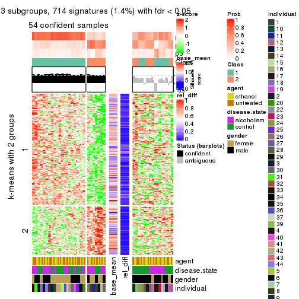</p>

</div>
<div id='tab-MAD-hclust-get-signatures-3'>
<pre><code class="r">get_signatures(res, k = 4)
</code></pre>

<p></p>

</div>
<div id='tab-MAD-hclust-get-signatures-4'>
<pre><code class="r">get_signatures(res, k = 5)
</code></pre>

<p></p>

</div>
<div id='tab-MAD-hclust-get-signatures-5'>
<pre><code class="r">get_signatures(res, k = 6)
</code></pre>

<p></p>

</div>
</div>


Signature heatmaps where rows are not scaled:


<script>
$( function() {
	$( '#tabs-MAD-hclust-get-signatures-no-scale' ).tabs();
} );
</script>
<div id='tabs-MAD-hclust-get-signatures-no-scale'>
<ul>
<li><a href='#tab-MAD-hclust-get-signatures-no-scale-1'>k = 2</a></li>
<li><a href='#tab-MAD-hclust-get-signatures-no-scale-2'>k = 3</a></li>
<li><a href='#tab-MAD-hclust-get-signatures-no-scale-3'>k = 4</a></li>
<li><a href='#tab-MAD-hclust-get-signatures-no-scale-4'>k = 5</a></li>
<li><a href='#tab-MAD-hclust-get-signatures-no-scale-5'>k = 6</a></li>
</ul>
<div id='tab-MAD-hclust-get-signatures-no-scale-1'>
<pre><code class="r">get_signatures(res, k = 2, scale_rows = FALSE)
</code></pre>

<p></p>

</div>
<div id='tab-MAD-hclust-get-signatures-no-scale-2'>
<pre><code class="r">get_signatures(res, k = 3, scale_rows = FALSE)
</code></pre>

<p></p>

</div>
<div id='tab-MAD-hclust-get-signatures-no-scale-3'>
<pre><code class="r">get_signatures(res, k = 4, scale_rows = FALSE)
</code></pre>

<p></p>

</div>
<div id='tab-MAD-hclust-get-signatures-no-scale-4'>
<pre><code class="r">get_signatures(res, k = 5, scale_rows = FALSE)
</code></pre>

<p></p>

</div>
<div id='tab-MAD-hclust-get-signatures-no-scale-5'>
<pre><code class="r">get_signatures(res, k = 6, scale_rows = FALSE)
</code></pre>

<p></p>

</div>
</div>


Compare the overlap of signatures from different k:

```r
compare_signatures(res)
```


`get_signature()` returns a data frame invisibly. TO get the list of signatures, the function
call should be assigned to a variable explicitly. In following code, if `plot` argument is set
to `FALSE`, no heatmap is plotted while only the differential analysis is performed.

```r
# code only for demonstration
tb = get_signature(res, k = ..., plot = FALSE)
```

An example of the output of `tb` is:

```
#>   which_row         fdr    mean_1    mean_2 scaled_mean_1 scaled_mean_2 km
#> 1        38 0.042760348  8.373488  9.131774    -0.5533452     0.5164555  1
#> 2        40 0.018707592  7.106213  8.469186    -0.6173731     0.5762149  1
#> 3        55 0.019134737 10.221463 11.207825    -0.6159697     0.5749050  1
#> 4        59 0.006059896  5.921854  7.869574    -0.6899429     0.6439467  1
#> 5        60 0.018055526  8.928898 10.211722    -0.6204761     0.5791110  1
#> 6        98 0.009384629 15.714769 14.887706     0.6635654    -0.6193277  2
...
```

The columns in `tb` are:

1. `which_row`: row indices corresponding to the input matrix.
2. `fdr`: FDR for the differential test. 
3. `mean_x`: The mean value in group x.
4. `scaled_mean_x`: The mean value in group x after rows are scaled.
5. `km`: Row groups if k-means clustering is applied to rows.


UMAP plot which shows how samples are separated.


<script>
$( function() {
	$( '#tabs-MAD-hclust-dimension-reduction' ).tabs();
} );
</script>
<div id='tabs-MAD-hclust-dimension-reduction'>
<ul>
<li><a href='#tab-MAD-hclust-dimension-reduction-1'>k = 2</a></li>
<li><a href='#tab-MAD-hclust-dimension-reduction-2'>k = 3</a></li>
<li><a href='#tab-MAD-hclust-dimension-reduction-3'>k = 4</a></li>
<li><a href='#tab-MAD-hclust-dimension-reduction-4'>k = 5</a></li>
<li><a href='#tab-MAD-hclust-dimension-reduction-5'>k = 6</a></li>
</ul>
<div id='tab-MAD-hclust-dimension-reduction-1'>
<pre><code class="r">dimension_reduction(res, k = 2, method = &quot;UMAP&quot;)
</code></pre>

<p></p>

</div>
<div id='tab-MAD-hclust-dimension-reduction-2'>
<pre><code class="r">dimension_reduction(res, k = 3, method = &quot;UMAP&quot;)
</code></pre>

<p></p>

</div>
<div id='tab-MAD-hclust-dimension-reduction-3'>
<pre><code class="r">dimension_reduction(res, k = 4, method = &quot;UMAP&quot;)
</code></pre>

<p></p>

</div>
<div id='tab-MAD-hclust-dimension-reduction-4'>
<pre><code class="r">dimension_reduction(res, k = 5, method = &quot;UMAP&quot;)
</code></pre>

<p></p>

</div>
<div id='tab-MAD-hclust-dimension-reduction-5'>
<pre><code class="r">dimension_reduction(res, k = 6, method = &quot;UMAP&quot;)
</code></pre>

<p></p>

</div>
</div>


Following heatmap shows how subgroups are split when increasing `k`:

```r
collect_classes(res)
```


Test correlation between subgroups and known annotations. If the known
annotation is numeric, one-way ANOVA test is applied, and if the known
annotation is discrete, chi-squared contingency table test is applied.

```r
test_to_known_factors(res)
```

```
#>             n agent(p) disease.state(p) gender(p) individual(p) k
#> MAD:hclust 50    1.000            1.000  1.000000      0.002131 2
#> MAD:hclust 54    1.000            0.282  1.000000      0.001521 3
#> MAD:hclust 34    0.598            0.103  0.056550      0.003749 4
#> MAD:hclust 10    1.000            0.259  0.628299      0.040428 5
#> MAD:hclust 20    0.896            0.122  0.000499      0.000176 6
```


If matrix rows can be associated to genes, consider to use `GO_Enrichment(res,
...)` to perform function enrichment for the signature genes.


 

---------------------------------------------------


### MAD:kmeans


The object with results only for a single top-value method and a single partition method 
can be extracted as:

```r
res = res_list["MAD", "kmeans"]
# you can also extract it by
# res = res_list["MAD:kmeans"]
```

A summary of `res` and all the functions that can be applied to it:

```r
res
```

```
#> A 'ConsensusPartition' object with k = 2, 3, 4, 5, 6.
#>   On a matrix with 51941 rows and 84 columns.
#>   Top rows (1000, 2000, 3000, 4000, 5000) are extracted by 'MAD' method.
#>   Subgroups are detected by 'kmeans' method.
#>   Performed in total 1250 partitions by row resampling.
#>   Best k for subgroups seems to be 2.
#> 
#> Following methods can be applied to this 'ConsensusPartition' object:
#>  [1] "cola_report"             "collect_classes"         "collect_plots"          
#>  [4] "collect_stats"           "colnames"                "compare_signatures"     
#>  [7] "consensus_heatmap"       "dimension_reduction"     "functional_enrichment"  
#> [10] "get_anno_col"            "get_anno"                "get_classes"            
#> [13] "get_consensus"           "get_matrix"              "get_membership"         
#> [16] "get_param"               "get_signatures"          "get_stats"              
#> [19] "is_best_k"               "is_stable_k"             "membership_heatmap"     
#> [22] "ncol"                    "nrow"                    "plot_ecdf"              
#> [25] "rownames"                "select_partition_number" "show"                   
#> [28] "suggest_best_k"          "test_to_known_factors"
```

`collect_plots()` function collects all the plots made from `res` for all `k` (number of partitions)
into one single page to provide an easy and fast comparison between different `k`.

```r
collect_plots(res)
```


The plots are:

- The first row: a plot of the ECDF (Empirical cumulative distribution
  function) curves of the consensus matrix for each `k` and the heatmap of
  predicted classes for each `k`.
- The second row: heatmaps of the consensus matrix for each `k`.
- The third row: heatmaps of the membership matrix for each `k`.
- The fouth row: heatmaps of the signatures for each `k`.

All the plots in panels can be made by individual functions and they are
plotted later in this section.

`select_partition_number()` produces several plots showing different
statistics for choosing "optimized" `k`. There are following statistics:

- ECDF curves of the consensus matrix for each `k`;
- 1-PAC. [The PAC
  score](https://en.wikipedia.org/wiki/Consensus_clustering#Over-interpretation_potential_of_consensus_clustering)
  measures the proportion of the ambiguous subgrouping.
- Mean silhouette score.
- Concordance. The mean probability of fiting the consensus class ids in all
  partitions.
- Area increased. Denote $A_k$ as the area under the ECDF curve for current
  `k`, the area increased is defined as $A_k - A_{k-1}$.
- Rand index. The percent of pairs of samples that are both in a same cluster
  or both are not in a same cluster in the partition of k and k-1.
- Jaccard index. The ratio of pairs of samples are both in a same cluster in
  the partition of k and k-1 and the pairs of samples are both in a same
  cluster in the partition k or k-1.

The detailed explanations of these statistics can be found in [the cola
vignette](http://bioconductor.org/packages/devel/bioc/vignettes/cola/inst/doc/cola.html#toc_13).

Generally speaking, lower PAC score, higher mean silhouette score or higher
concordance corresponds to better partition. Rand index and Jaccard index
measure how similar the current partition is compared to partition with `k-1`.
If they are too similar, we won't accept `k` is better than `k-1`.

```r
select_partition_number(res)
```


The numeric values for all these statistics can be obtained by `get_stats()`.

```r
get_stats(res)
```

```
#>   k 1-PAC mean_silhouette concordance area_increased  Rand Jaccard
#> 2 2 0.360           0.844       0.863         0.4797 0.523   0.523
#> 3 3 0.277           0.506       0.649         0.3182 0.937   0.880
#> 4 4 0.346           0.405       0.609         0.1388 0.743   0.476
#> 5 5 0.417           0.347       0.591         0.0759 0.818   0.432
#> 6 6 0.459           0.376       0.563         0.0447 0.841   0.414
```

`suggest_best_k()` suggests the best $k$ based on these statistics. The rules are as follows:

- All $k$ with Jaccard index larger than 0.95 are removed because the increase of
  the partition number does not provides enough extra information. If all $k$ are removed,
  the best $k$ is assigned by `NA`.
- For $k$ with 1-PAC larger than 0.9, the maximal $k$ is taken as the "best k". Other $k$ is called "optional k".
- If it does not fit the second rule. The $k$ with the highest vote of highest
  1-PAC, mean silhouette and concordance is taken as the "best k".

```r
suggest_best_k(res)
```

```
#> [1] 2
```


Following shows the table of the partitions (You need to click the **show/hide
code output** link to see it). The membership matrix (columns with name `p*`)
is inferred by
[`clue::cl_consensus()`](https://www.rdocumentation.org/link/cl_consensus?package=clue)
function with the `SE` method. Basically the value in the membership matrix
represents the probability to belong to a certain group. The finall class
label for an item is determined with the group with highest probability it
belongs to.

In `get_classes()` function, the entropy is calculated from the membership
matrix and the silhouette score is calculated from the consensus matrix.


<script>
$( function() {
	$( '#tabs-MAD-kmeans-get-classes' ).tabs();
} );
</script>
<div id='tabs-MAD-kmeans-get-classes'>
<ul>
<li><a href='#tab-MAD-kmeans-get-classes-1'>k = 2</a></li>
<li><a href='#tab-MAD-kmeans-get-classes-2'>k = 3</a></li>
<li><a href='#tab-MAD-kmeans-get-classes-3'>k = 4</a></li>
<li><a href='#tab-MAD-kmeans-get-classes-4'>k = 5</a></li>
<li><a href='#tab-MAD-kmeans-get-classes-5'>k = 6</a></li>
</ul>

<div id='tab-MAD-kmeans-get-classes-1'>
<p><a id='tab-MAD-kmeans-get-classes-1-a' style='color:#0366d6' href='#'>show/hide code output</a></p>
<pre><code class="r">cbind(get_classes(res, k = 2), get_membership(res, k = 2))
</code></pre>

<pre><code>#&gt;            class entropy silhouette    p1    p2
#&gt; GSM1269647     2  0.2778      0.871 0.048 0.952
#&gt; GSM1269655     1  0.4939      0.843 0.892 0.108
#&gt; GSM1269663     1  0.5629      0.818 0.868 0.132
#&gt; GSM1269671     2  0.2236      0.876 0.036 0.964
#&gt; GSM1269679     1  0.6531      0.859 0.832 0.168
#&gt; GSM1269693     1  0.2423      0.857 0.960 0.040
#&gt; GSM1269701     1  0.6531      0.859 0.832 0.168
#&gt; GSM1269709     1  0.7883      0.793 0.764 0.236
#&gt; GSM1269715     1  0.0000      0.874 1.000 0.000
#&gt; GSM1269717     1  0.0672      0.871 0.992 0.008
#&gt; GSM1269721     2  0.6801      0.831 0.180 0.820
#&gt; GSM1269723     1  0.6438      0.860 0.836 0.164
#&gt; GSM1269645     1  0.4161      0.880 0.916 0.084
#&gt; GSM1269653     2  0.4690      0.856 0.100 0.900
#&gt; GSM1269661     1  0.7056      0.853 0.808 0.192
#&gt; GSM1269669     1  0.6438      0.860 0.836 0.164
#&gt; GSM1269677     2  0.6801      0.827 0.180 0.820
#&gt; GSM1269685     1  0.3114      0.859 0.944 0.056
#&gt; GSM1269691     1  0.2423      0.863 0.960 0.040
#&gt; GSM1269699     2  0.2423      0.877 0.040 0.960
#&gt; GSM1269707     2  0.4562      0.877 0.096 0.904
#&gt; GSM1269651     2  0.6623      0.828 0.172 0.828
#&gt; GSM1269659     2  0.7883      0.794 0.236 0.764
#&gt; GSM1269667     1  0.6887      0.854 0.816 0.184
#&gt; GSM1269675     2  0.2423      0.875 0.040 0.960
#&gt; GSM1269683     1  0.1414      0.874 0.980 0.020
#&gt; GSM1269689     2  0.4562      0.858 0.096 0.904
#&gt; GSM1269697     2  0.4431      0.853 0.092 0.908
#&gt; GSM1269705     2  0.2423      0.877 0.040 0.960
#&gt; GSM1269713     2  0.6531      0.782 0.168 0.832
#&gt; GSM1269719     1  0.5842      0.817 0.860 0.140
#&gt; GSM1269725     2  0.6343      0.793 0.160 0.840
#&gt; GSM1269727     1  0.6438      0.862 0.836 0.164
#&gt; GSM1269649     1  0.7139      0.849 0.804 0.196
#&gt; GSM1269657     2  0.7056      0.822 0.192 0.808
#&gt; GSM1269665     1  0.2948      0.879 0.948 0.052
#&gt; GSM1269673     1  0.1633      0.873 0.976 0.024
#&gt; GSM1269681     2  0.5842      0.840 0.140 0.860
#&gt; GSM1269687     1  0.1633      0.876 0.976 0.024
#&gt; GSM1269695     1  0.6148      0.870 0.848 0.152
#&gt; GSM1269703     1  0.1184      0.878 0.984 0.016
#&gt; GSM1269711     1  0.7139      0.846 0.804 0.196
#&gt; GSM1269646     2  0.2948      0.871 0.052 0.948
#&gt; GSM1269654     1  0.4690      0.842 0.900 0.100
#&gt; GSM1269662     1  0.7883      0.660 0.764 0.236
#&gt; GSM1269670     2  0.2043      0.874 0.032 0.968
#&gt; GSM1269678     1  0.6343      0.861 0.840 0.160
#&gt; GSM1269692     1  0.2423      0.857 0.960 0.040
#&gt; GSM1269700     1  0.6623      0.859 0.828 0.172
#&gt; GSM1269708     1  0.6973      0.843 0.812 0.188
#&gt; GSM1269714     1  0.0376      0.876 0.996 0.004
#&gt; GSM1269716     1  0.0672      0.871 0.992 0.008
#&gt; GSM1269720     2  0.6887      0.828 0.184 0.816
#&gt; GSM1269722     1  0.6438      0.864 0.836 0.164
#&gt; GSM1269644     1  0.3274      0.860 0.940 0.060
#&gt; GSM1269652     2  0.5408      0.865 0.124 0.876
#&gt; GSM1269660     1  0.7139      0.850 0.804 0.196
#&gt; GSM1269668     1  0.6438      0.860 0.836 0.164
#&gt; GSM1269676     2  0.6623      0.828 0.172 0.828
#&gt; GSM1269684     1  0.1843      0.866 0.972 0.028
#&gt; GSM1269690     1  0.2423      0.863 0.960 0.040
#&gt; GSM1269698     2  0.2043      0.876 0.032 0.968
#&gt; GSM1269706     2  0.4562      0.877 0.096 0.904
#&gt; GSM1269650     2  0.6623      0.828 0.172 0.828
#&gt; GSM1269658     2  0.9608      0.571 0.384 0.616
#&gt; GSM1269666     1  0.6623      0.858 0.828 0.172
#&gt; GSM1269674     2  0.2236      0.876 0.036 0.964
#&gt; GSM1269682     1  0.2778      0.878 0.952 0.048
#&gt; GSM1269688     2  0.4562      0.858 0.096 0.904
#&gt; GSM1269696     2  0.4939      0.842 0.108 0.892
#&gt; GSM1269704     2  0.2236      0.877 0.036 0.964
#&gt; GSM1269712     1  0.7453      0.836 0.788 0.212
#&gt; GSM1269718     1  0.5629      0.823 0.868 0.132
#&gt; GSM1269724     1  0.9833      0.465 0.576 0.424
#&gt; GSM1269726     1  0.6438      0.865 0.836 0.164
#&gt; GSM1269648     1  0.7056      0.851 0.808 0.192
#&gt; GSM1269656     2  0.8081      0.792 0.248 0.752
#&gt; GSM1269664     1  0.3431      0.879 0.936 0.064
#&gt; GSM1269672     1  0.0938      0.875 0.988 0.012
#&gt; GSM1269680     2  0.6343      0.831 0.160 0.840
#&gt; GSM1269686     1  0.0672      0.875 0.992 0.008
#&gt; GSM1269694     1  0.6247      0.869 0.844 0.156
#&gt; GSM1269702     1  0.2603      0.869 0.956 0.044
#&gt; GSM1269710     1  0.6623      0.861 0.828 0.172
</code></pre>

<script>
$('#tab-MAD-kmeans-get-classes-1-a').parent().next().next().hide();
$('#tab-MAD-kmeans-get-classes-1-a').click(function(){
  $('#tab-MAD-kmeans-get-classes-1-a').parent().next().next().toggle();
  return(false);
});
</script>
</div>

<div id='tab-MAD-kmeans-get-classes-2'>
<p><a id='tab-MAD-kmeans-get-classes-2-a' style='color:#0366d6' href='#'>show/hide code output</a></p>
<pre><code class="r">cbind(get_classes(res, k = 3), get_membership(res, k = 3))
</code></pre>

<pre><code>#&gt;            class entropy silhouette    p1    p2    p3
#&gt; GSM1269647     2   0.605     0.5581 0.052 0.768 0.180
#&gt; GSM1269655     1   0.651     0.5736 0.688 0.028 0.284
#&gt; GSM1269663     3   0.762    -0.0911 0.368 0.052 0.580
#&gt; GSM1269671     2   0.287     0.5897 0.008 0.916 0.076
#&gt; GSM1269679     1   0.589     0.6204 0.796 0.104 0.100
#&gt; GSM1269693     1   0.553     0.5892 0.704 0.000 0.296
#&gt; GSM1269701     1   0.681     0.6018 0.740 0.104 0.156
#&gt; GSM1269709     1   0.949     0.4006 0.480 0.208 0.312
#&gt; GSM1269715     1   0.452     0.6457 0.816 0.004 0.180
#&gt; GSM1269717     1   0.458     0.6430 0.812 0.004 0.184
#&gt; GSM1269721     2   0.665     0.1222 0.012 0.592 0.396
#&gt; GSM1269723     1   0.741     0.5877 0.692 0.104 0.204
#&gt; GSM1269645     1   0.607     0.6575 0.728 0.024 0.248
#&gt; GSM1269653     2   0.673     0.5577 0.088 0.740 0.172
#&gt; GSM1269661     1   0.720     0.6524 0.704 0.092 0.204
#&gt; GSM1269669     1   0.459     0.6925 0.848 0.032 0.120
#&gt; GSM1269677     2   0.663     0.0115 0.008 0.548 0.444
#&gt; GSM1269685     1   0.650     0.5580 0.596 0.008 0.396
#&gt; GSM1269691     1   0.630     0.5443 0.608 0.004 0.388
#&gt; GSM1269699     2   0.245     0.5918 0.012 0.936 0.052
#&gt; GSM1269707     2   0.511     0.5428 0.036 0.820 0.144
#&gt; GSM1269651     2   0.714     0.1081 0.028 0.576 0.396
#&gt; GSM1269659     3   0.744     0.4057 0.044 0.368 0.588
#&gt; GSM1269667     1   0.579     0.6391 0.796 0.068 0.136
#&gt; GSM1269675     2   0.344     0.5954 0.016 0.896 0.088
#&gt; GSM1269683     1   0.280     0.6774 0.908 0.000 0.092
#&gt; GSM1269689     2   0.684     0.5281 0.076 0.724 0.200
#&gt; GSM1269697     2   0.683     0.5178 0.080 0.728 0.192
#&gt; GSM1269705     2   0.200     0.6073 0.012 0.952 0.036
#&gt; GSM1269713     2   0.939     0.2737 0.272 0.508 0.220
#&gt; GSM1269719     1   0.776     0.4463 0.488 0.048 0.464
#&gt; GSM1269725     2   0.919     0.2868 0.272 0.532 0.196
#&gt; GSM1269727     1   0.517     0.6743 0.828 0.056 0.116
#&gt; GSM1269649     1   0.930     0.4774 0.508 0.192 0.300
#&gt; GSM1269657     3   0.688     0.1922 0.016 0.428 0.556
#&gt; GSM1269665     1   0.502     0.6792 0.796 0.012 0.192
#&gt; GSM1269673     1   0.649     0.5939 0.628 0.012 0.360
#&gt; GSM1269681     2   0.659     0.2086 0.016 0.632 0.352
#&gt; GSM1269687     1   0.552     0.6806 0.728 0.004 0.268
#&gt; GSM1269695     1   0.874     0.5659 0.544 0.128 0.328
#&gt; GSM1269703     1   0.550     0.6607 0.708 0.000 0.292
#&gt; GSM1269711     1   0.919     0.5098 0.480 0.156 0.364
#&gt; GSM1269646     2   0.644     0.5415 0.064 0.748 0.188
#&gt; GSM1269654     1   0.618     0.5866 0.716 0.024 0.260
#&gt; GSM1269662     3   0.800     0.2202 0.304 0.088 0.608
#&gt; GSM1269670     2   0.294     0.5914 0.012 0.916 0.072
#&gt; GSM1269678     1   0.548     0.6494 0.816 0.076 0.108
#&gt; GSM1269692     1   0.586     0.5830 0.656 0.000 0.344
#&gt; GSM1269700     1   0.703     0.5938 0.724 0.104 0.172
#&gt; GSM1269708     1   0.911     0.4843 0.520 0.164 0.316
#&gt; GSM1269714     1   0.478     0.6438 0.796 0.004 0.200
#&gt; GSM1269716     1   0.458     0.6430 0.812 0.004 0.184
#&gt; GSM1269720     2   0.669     0.0737 0.012 0.580 0.408
#&gt; GSM1269722     1   0.670     0.6379 0.744 0.092 0.164
#&gt; GSM1269644     1   0.636     0.5773 0.592 0.004 0.404
#&gt; GSM1269652     2   0.687     0.4774 0.048 0.688 0.264
#&gt; GSM1269660     1   0.798     0.6185 0.632 0.104 0.264
#&gt; GSM1269668     1   0.429     0.6828 0.868 0.040 0.092
#&gt; GSM1269676     2   0.663     0.0115 0.008 0.548 0.444
#&gt; GSM1269684     1   0.550     0.6419 0.708 0.000 0.292
#&gt; GSM1269690     1   0.626     0.5484 0.616 0.004 0.380
#&gt; GSM1269698     2   0.245     0.5887 0.012 0.936 0.052
#&gt; GSM1269706     2   0.541     0.5330 0.040 0.804 0.156
#&gt; GSM1269650     2   0.713     0.1149 0.028 0.580 0.392
#&gt; GSM1269658     3   0.756     0.4549 0.056 0.336 0.608
#&gt; GSM1269666     1   0.538     0.6416 0.820 0.068 0.112
#&gt; GSM1269674     2   0.344     0.5950 0.016 0.896 0.088
#&gt; GSM1269682     1   0.268     0.6816 0.924 0.008 0.068
#&gt; GSM1269688     2   0.670     0.5351 0.076 0.736 0.188
#&gt; GSM1269696     2   0.744     0.4737 0.108 0.692 0.200
#&gt; GSM1269704     2   0.171     0.6060 0.008 0.960 0.032
#&gt; GSM1269712     1   0.815     0.5054 0.644 0.156 0.200
#&gt; GSM1269718     1   0.767     0.4388 0.484 0.044 0.472
#&gt; GSM1269724     1   0.950     0.0902 0.440 0.372 0.188
#&gt; GSM1269726     1   0.531     0.6672 0.820 0.056 0.124
#&gt; GSM1269648     1   0.934     0.5071 0.476 0.176 0.348
#&gt; GSM1269656     3   0.873     0.3790 0.112 0.388 0.500
#&gt; GSM1269664     1   0.506     0.6829 0.800 0.016 0.184
#&gt; GSM1269672     1   0.617     0.6337 0.680 0.012 0.308
#&gt; GSM1269680     2   0.645     0.1557 0.008 0.608 0.384
#&gt; GSM1269686     1   0.525     0.6658 0.736 0.000 0.264
#&gt; GSM1269694     1   0.868     0.5728 0.556 0.128 0.316
#&gt; GSM1269702     1   0.665     0.5820 0.592 0.012 0.396
#&gt; GSM1269710     1   0.789     0.6257 0.624 0.088 0.288
</code></pre>

<script>
$('#tab-MAD-kmeans-get-classes-2-a').parent().next().next().hide();
$('#tab-MAD-kmeans-get-classes-2-a').click(function(){
  $('#tab-MAD-kmeans-get-classes-2-a').parent().next().next().toggle();
  return(false);
});
</script>
</div>

<div id='tab-MAD-kmeans-get-classes-3'>
<p><a id='tab-MAD-kmeans-get-classes-3-a' style='color:#0366d6' href='#'>show/hide code output</a></p>
<pre><code class="r">cbind(get_classes(res, k = 4), get_membership(res, k = 4))
</code></pre>

<pre><code>#&gt;            class entropy silhouette    p1    p2    p3    p4
#&gt; GSM1269647     2   0.731    0.55016 0.020 0.548 0.324 0.108
#&gt; GSM1269655     3   0.810    0.10298 0.416 0.064 0.428 0.092
#&gt; GSM1269663     4   0.876   -0.01644 0.356 0.076 0.152 0.416
#&gt; GSM1269671     2   0.400    0.56843 0.012 0.852 0.072 0.064
#&gt; GSM1269679     3   0.510    0.53584 0.152 0.076 0.768 0.004
#&gt; GSM1269693     1   0.691    0.28272 0.576 0.000 0.272 0.152
#&gt; GSM1269701     3   0.521    0.49915 0.220 0.032 0.736 0.012
#&gt; GSM1269709     3   0.868    0.19161 0.332 0.140 0.448 0.080
#&gt; GSM1269715     1   0.643    0.23080 0.568 0.000 0.352 0.080
#&gt; GSM1269717     1   0.639    0.25924 0.588 0.000 0.328 0.084
#&gt; GSM1269721     4   0.706    0.44719 0.076 0.344 0.024 0.556
#&gt; GSM1269723     3   0.554    0.53596 0.160 0.052 0.756 0.032
#&gt; GSM1269645     1   0.720    0.37018 0.604 0.060 0.276 0.060
#&gt; GSM1269653     2   0.856    0.52088 0.052 0.472 0.272 0.204
#&gt; GSM1269661     3   0.751    0.16698 0.412 0.060 0.476 0.052
#&gt; GSM1269669     1   0.539    0.17707 0.564 0.004 0.424 0.008
#&gt; GSM1269677     4   0.516    0.61713 0.044 0.236 0.000 0.720
#&gt; GSM1269685     1   0.437    0.52528 0.820 0.008 0.048 0.124
#&gt; GSM1269691     1   0.443    0.52267 0.808 0.000 0.068 0.124
#&gt; GSM1269699     2   0.469    0.51064 0.004 0.784 0.044 0.168
#&gt; GSM1269707     2   0.806    0.42846 0.100 0.572 0.100 0.228
#&gt; GSM1269651     4   0.518    0.56064 0.008 0.304 0.012 0.676
#&gt; GSM1269659     4   0.511    0.60523 0.132 0.092 0.004 0.772
#&gt; GSM1269667     3   0.570    0.50404 0.204 0.052 0.724 0.020
#&gt; GSM1269675     2   0.490    0.56018 0.036 0.812 0.084 0.068
#&gt; GSM1269683     3   0.607   -0.02975 0.456 0.000 0.500 0.044
#&gt; GSM1269689     2   0.759    0.58009 0.056 0.600 0.232 0.112
#&gt; GSM1269697     2   0.704    0.53395 0.032 0.564 0.340 0.064
#&gt; GSM1269705     2   0.386    0.59978 0.012 0.860 0.064 0.064
#&gt; GSM1269713     3   0.674   -0.08406 0.032 0.332 0.588 0.048
#&gt; GSM1269719     1   0.792    0.37420 0.592 0.072 0.156 0.180
#&gt; GSM1269725     3   0.696   -0.00459 0.036 0.332 0.576 0.056
#&gt; GSM1269727     3   0.628    0.36623 0.308 0.020 0.628 0.044
#&gt; GSM1269649     1   0.767    0.02432 0.444 0.124 0.412 0.020
#&gt; GSM1269657     4   0.576    0.61534 0.128 0.160 0.000 0.712
#&gt; GSM1269665     1   0.599    0.43071 0.676 0.020 0.260 0.044
#&gt; GSM1269673     1   0.258    0.56097 0.912 0.000 0.052 0.036
#&gt; GSM1269681     4   0.509    0.53883 0.000 0.348 0.012 0.640
#&gt; GSM1269687     1   0.496    0.48695 0.732 0.008 0.240 0.020
#&gt; GSM1269695     1   0.657    0.45983 0.684 0.144 0.148 0.024
#&gt; GSM1269703     1   0.537    0.45650 0.704 0.008 0.256 0.032
#&gt; GSM1269711     1   0.756    0.14951 0.516 0.092 0.356 0.036
#&gt; GSM1269646     2   0.759    0.48750 0.032 0.508 0.360 0.100
#&gt; GSM1269654     3   0.782    0.10381 0.424 0.048 0.440 0.088
#&gt; GSM1269662     4   0.833    0.30763 0.288 0.104 0.092 0.516
#&gt; GSM1269670     2   0.380    0.56737 0.008 0.860 0.072 0.060
#&gt; GSM1269678     3   0.480    0.52727 0.204 0.032 0.760 0.004
#&gt; GSM1269692     1   0.639    0.40435 0.652 0.000 0.192 0.156
#&gt; GSM1269700     3   0.553    0.50870 0.212 0.040 0.728 0.020
#&gt; GSM1269708     3   0.847    0.13617 0.392 0.108 0.420 0.080
#&gt; GSM1269714     1   0.638    0.24721 0.580 0.000 0.340 0.080
#&gt; GSM1269716     1   0.638    0.23603 0.580 0.000 0.340 0.080
#&gt; GSM1269720     4   0.675    0.49827 0.076 0.316 0.016 0.592
#&gt; GSM1269722     3   0.629    0.50763 0.240 0.048 0.676 0.036
#&gt; GSM1269644     1   0.378    0.56140 0.860 0.008 0.052 0.080
#&gt; GSM1269652     2   0.964    0.34326 0.196 0.392 0.192 0.220
#&gt; GSM1269660     3   0.771    0.19404 0.380 0.060 0.492 0.068
#&gt; GSM1269668     3   0.542    0.18505 0.440 0.004 0.548 0.008
#&gt; GSM1269676     4   0.516    0.61713 0.044 0.236 0.000 0.720
#&gt; GSM1269684     1   0.343    0.55501 0.868 0.004 0.100 0.028
#&gt; GSM1269690     1   0.493    0.50617 0.776 0.000 0.092 0.132
#&gt; GSM1269698     2   0.487    0.51180 0.008 0.776 0.044 0.172
#&gt; GSM1269706     2   0.806    0.42846 0.100 0.572 0.100 0.228
#&gt; GSM1269650     4   0.520    0.56383 0.008 0.308 0.012 0.672
#&gt; GSM1269658     4   0.540    0.60304 0.144 0.092 0.008 0.756
#&gt; GSM1269666     3   0.487    0.53036 0.168 0.040 0.780 0.012
#&gt; GSM1269674     2   0.450    0.55996 0.020 0.828 0.088 0.064
#&gt; GSM1269682     3   0.647    0.09374 0.420 0.008 0.520 0.052
#&gt; GSM1269688     2   0.748    0.57982 0.052 0.612 0.220 0.116
#&gt; GSM1269696     2   0.716    0.45503 0.020 0.504 0.396 0.080
#&gt; GSM1269704     2   0.414    0.59010 0.008 0.840 0.060 0.092
#&gt; GSM1269712     3   0.520    0.51337 0.116 0.068 0.788 0.028
#&gt; GSM1269718     1   0.817    0.35026 0.564 0.072 0.180 0.184
#&gt; GSM1269724     3   0.697    0.07091 0.052 0.332 0.576 0.040
#&gt; GSM1269726     3   0.650    0.37628 0.308 0.020 0.616 0.056
#&gt; GSM1269648     1   0.703    0.36983 0.620 0.144 0.220 0.016
#&gt; GSM1269656     4   0.834    0.32283 0.388 0.184 0.032 0.396
#&gt; GSM1269664     1   0.624    0.28771 0.596 0.020 0.352 0.032
#&gt; GSM1269672     1   0.289    0.56434 0.896 0.000 0.068 0.036
#&gt; GSM1269680     4   0.504    0.54401 0.000 0.336 0.012 0.652
#&gt; GSM1269686     1   0.394    0.52131 0.800 0.000 0.188 0.012
#&gt; GSM1269694     1   0.657    0.46117 0.684 0.148 0.144 0.024
#&gt; GSM1269702     1   0.390    0.54936 0.856 0.012 0.048 0.084
#&gt; GSM1269710     1   0.662    0.39583 0.632 0.068 0.276 0.024
</code></pre>

<script>
$('#tab-MAD-kmeans-get-classes-3-a').parent().next().next().hide();
$('#tab-MAD-kmeans-get-classes-3-a').click(function(){
  $('#tab-MAD-kmeans-get-classes-3-a').parent().next().next().toggle();
  return(false);
});
</script>
</div>

<div id='tab-MAD-kmeans-get-classes-4'>
<p><a id='tab-MAD-kmeans-get-classes-4-a' style='color:#0366d6' href='#'>show/hide code output</a></p>
<pre><code class="r">cbind(get_classes(res, k = 5), get_membership(res, k = 5))
</code></pre>

<pre><code>#&gt;            class entropy silhouette    p1    p2    p3    p4    p5
#&gt; GSM1269647     3   0.627   0.122534 0.024 0.124 0.592 0.000 0.260
#&gt; GSM1269655     4   0.795   0.226439 0.132 0.104 0.308 0.444 0.012
#&gt; GSM1269663     2   0.867   0.219596 0.240 0.384 0.112 0.236 0.028
#&gt; GSM1269671     5   0.242   0.655811 0.044 0.024 0.020 0.000 0.912
#&gt; GSM1269679     3   0.609   0.351732 0.180 0.000 0.588 0.228 0.004
#&gt; GSM1269693     4   0.287   0.413214 0.064 0.036 0.008 0.888 0.004
#&gt; GSM1269701     3   0.693   0.253859 0.324 0.000 0.440 0.224 0.012
#&gt; GSM1269709     4   0.812   0.067987 0.156 0.036 0.372 0.380 0.056
#&gt; GSM1269715     4   0.207   0.430273 0.036 0.004 0.028 0.928 0.004
#&gt; GSM1269717     4   0.172   0.433622 0.028 0.004 0.020 0.944 0.004
#&gt; GSM1269721     2   0.756   0.353521 0.052 0.540 0.112 0.044 0.252
#&gt; GSM1269723     3   0.693   0.319258 0.284 0.000 0.484 0.212 0.020
#&gt; GSM1269645     1   0.532   0.438295 0.704 0.008 0.036 0.216 0.036
#&gt; GSM1269653     3   0.841  -0.169485 0.148 0.244 0.376 0.004 0.228
#&gt; GSM1269661     1   0.737   0.302836 0.488 0.016 0.284 0.184 0.028
#&gt; GSM1269669     1   0.566   0.363234 0.604 0.000 0.116 0.280 0.000
#&gt; GSM1269677     2   0.340   0.640373 0.012 0.856 0.012 0.020 0.100
#&gt; GSM1269685     4   0.565   0.000703 0.332 0.048 0.012 0.600 0.008
#&gt; GSM1269691     4   0.526   0.045445 0.324 0.056 0.004 0.616 0.000
#&gt; GSM1269699     5   0.546   0.634682 0.036 0.152 0.100 0.000 0.712
#&gt; GSM1269707     5   0.816   0.460839 0.080 0.248 0.160 0.036 0.476
#&gt; GSM1269651     2   0.479   0.597305 0.040 0.752 0.040 0.000 0.168
#&gt; GSM1269659     2   0.552   0.625384 0.064 0.744 0.044 0.120 0.028
#&gt; GSM1269667     3   0.738   0.142172 0.300 0.004 0.388 0.288 0.020
#&gt; GSM1269675     5   0.390   0.652630 0.084 0.044 0.040 0.000 0.832
#&gt; GSM1269683     4   0.593   0.222536 0.276 0.008 0.104 0.608 0.004
#&gt; GSM1269689     5   0.811   0.293382 0.164 0.084 0.344 0.016 0.392
#&gt; GSM1269697     3   0.611   0.068672 0.036 0.048 0.552 0.004 0.360
#&gt; GSM1269705     5   0.468   0.666094 0.012 0.072 0.164 0.000 0.752
#&gt; GSM1269713     3   0.559   0.445818 0.080 0.032 0.740 0.036 0.112
#&gt; GSM1269719     1   0.844   0.264665 0.436 0.176 0.176 0.196 0.016
#&gt; GSM1269725     3   0.437   0.466356 0.048 0.020 0.816 0.028 0.088
#&gt; GSM1269727     4   0.718   0.118638 0.332 0.000 0.224 0.420 0.024
#&gt; GSM1269649     1   0.646   0.432213 0.660 0.016 0.140 0.056 0.128
#&gt; GSM1269657     2   0.383   0.644635 0.032 0.848 0.012 0.064 0.044
#&gt; GSM1269665     1   0.581   0.431128 0.636 0.016 0.084 0.260 0.004
#&gt; GSM1269673     1   0.545   0.256309 0.508 0.036 0.012 0.444 0.000
#&gt; GSM1269681     2   0.446   0.580473 0.024 0.756 0.028 0.000 0.192
#&gt; GSM1269687     1   0.609   0.442779 0.588 0.012 0.088 0.304 0.008
#&gt; GSM1269695     1   0.581   0.486201 0.688 0.012 0.020 0.164 0.116
#&gt; GSM1269703     1   0.454   0.491152 0.744 0.016 0.036 0.204 0.000
#&gt; GSM1269711     1   0.752   0.332293 0.548 0.048 0.232 0.132 0.040
#&gt; GSM1269646     3   0.637   0.181973 0.048 0.092 0.596 0.000 0.264
#&gt; GSM1269654     4   0.790   0.256082 0.128 0.108 0.288 0.464 0.012
#&gt; GSM1269662     2   0.845   0.338286 0.256 0.448 0.108 0.148 0.040
#&gt; GSM1269670     5   0.243   0.656209 0.040 0.024 0.024 0.000 0.912
#&gt; GSM1269678     3   0.673   0.218824 0.224 0.004 0.492 0.276 0.004
#&gt; GSM1269692     4   0.380   0.348874 0.120 0.044 0.008 0.824 0.004
#&gt; GSM1269700     3   0.683   0.279145 0.324 0.000 0.460 0.204 0.012
#&gt; GSM1269708     4   0.798   0.151962 0.164 0.032 0.340 0.416 0.048
#&gt; GSM1269714     4   0.144   0.425945 0.032 0.000 0.012 0.952 0.004
#&gt; GSM1269716     4   0.190   0.432593 0.032 0.004 0.024 0.936 0.004
#&gt; GSM1269720     2   0.717   0.452663 0.048 0.592 0.092 0.048 0.220
#&gt; GSM1269722     4   0.702  -0.097502 0.180 0.004 0.400 0.400 0.016
#&gt; GSM1269644     1   0.636   0.268497 0.488 0.064 0.032 0.412 0.004
#&gt; GSM1269652     3   0.971  -0.181229 0.136 0.244 0.288 0.132 0.200
#&gt; GSM1269660     1   0.755   0.280240 0.484 0.028 0.284 0.176 0.028
#&gt; GSM1269668     1   0.657   0.169331 0.468 0.000 0.240 0.292 0.000
#&gt; GSM1269676     2   0.340   0.640373 0.012 0.856 0.012 0.020 0.100
#&gt; GSM1269684     4   0.498  -0.178209 0.412 0.008 0.012 0.564 0.004
#&gt; GSM1269690     4   0.513   0.080709 0.308 0.052 0.004 0.636 0.000
#&gt; GSM1269698     5   0.544   0.627324 0.016 0.160 0.128 0.000 0.696
#&gt; GSM1269706     5   0.816   0.461821 0.076 0.252 0.164 0.036 0.472
#&gt; GSM1269650     2   0.487   0.603032 0.044 0.752 0.032 0.004 0.168
#&gt; GSM1269658     2   0.569   0.624216 0.080 0.732 0.048 0.116 0.024
#&gt; GSM1269666     3   0.714   0.229514 0.208 0.008 0.464 0.304 0.016
#&gt; GSM1269674     5   0.382   0.656070 0.084 0.044 0.036 0.000 0.836
#&gt; GSM1269682     4   0.617   0.109603 0.348 0.004 0.112 0.532 0.004
#&gt; GSM1269688     5   0.810   0.311123 0.164 0.084 0.336 0.016 0.400
#&gt; GSM1269696     3   0.591   0.164061 0.040 0.032 0.564 0.004 0.360
#&gt; GSM1269704     5   0.480   0.660829 0.004 0.084 0.184 0.000 0.728
#&gt; GSM1269712     3   0.581   0.408616 0.104 0.012 0.668 0.204 0.012
#&gt; GSM1269718     1   0.832   0.283817 0.456 0.164 0.196 0.168 0.016
#&gt; GSM1269724     3   0.494   0.470179 0.076 0.016 0.780 0.036 0.092
#&gt; GSM1269726     4   0.717   0.101600 0.336 0.004 0.224 0.420 0.016
#&gt; GSM1269648     1   0.678   0.452050 0.644 0.020 0.104 0.140 0.092
#&gt; GSM1269656     2   0.809   0.238271 0.144 0.444 0.044 0.312 0.056
#&gt; GSM1269664     1   0.627   0.405720 0.616 0.012 0.172 0.192 0.008
#&gt; GSM1269672     1   0.505   0.244708 0.496 0.024 0.004 0.476 0.000
#&gt; GSM1269680     2   0.431   0.582612 0.016 0.760 0.028 0.000 0.196
#&gt; GSM1269686     1   0.566   0.346397 0.520 0.004 0.056 0.416 0.004
#&gt; GSM1269694     1   0.593   0.485842 0.680 0.012 0.024 0.168 0.116
#&gt; GSM1269702     1   0.576   0.252661 0.500 0.036 0.020 0.440 0.004
#&gt; GSM1269710     1   0.595   0.492848 0.696 0.020 0.100 0.152 0.032
</code></pre>

<script>
$('#tab-MAD-kmeans-get-classes-4-a').parent().next().next().hide();
$('#tab-MAD-kmeans-get-classes-4-a').click(function(){
  $('#tab-MAD-kmeans-get-classes-4-a').parent().next().next().toggle();
  return(false);
});
</script>
</div>

<div id='tab-MAD-kmeans-get-classes-5'>
<p><a id='tab-MAD-kmeans-get-classes-5-a' style='color:#0366d6' href='#'>show/hide code output</a></p>
<pre><code class="r">cbind(get_classes(res, k = 6), get_membership(res, k = 6))
</code></pre>

<pre><code>#&gt;            class entropy silhouette    p1    p2    p3    p4    p5    p6
#&gt; GSM1269647     5   0.532     0.3702 0.016 0.108 0.116 0.008 0.716 0.036
#&gt; GSM1269655     3   0.825     0.1810 0.152 0.008 0.444 0.140 0.160 0.096
#&gt; GSM1269663     6   0.897     0.1315 0.244 0.048 0.112 0.240 0.060 0.296
#&gt; GSM1269671     2   0.358     0.6526 0.032 0.848 0.004 0.028 0.060 0.028
#&gt; GSM1269679     3   0.477     0.4711 0.052 0.000 0.712 0.048 0.188 0.000
#&gt; GSM1269693     4   0.679     0.7185 0.172 0.008 0.232 0.528 0.012 0.048
#&gt; GSM1269701     3   0.452     0.5319 0.116 0.012 0.752 0.012 0.108 0.000
#&gt; GSM1269709     5   0.842     0.0616 0.236 0.024 0.248 0.156 0.316 0.020
#&gt; GSM1269715     4   0.584     0.8194 0.172 0.000 0.308 0.512 0.008 0.000
#&gt; GSM1269717     4   0.578     0.8248 0.180 0.000 0.304 0.512 0.004 0.000
#&gt; GSM1269721     6   0.753     0.3566 0.028 0.136 0.020 0.108 0.192 0.516
#&gt; GSM1269723     3   0.488     0.4948 0.076 0.020 0.736 0.028 0.140 0.000
#&gt; GSM1269645     1   0.662     0.3395 0.552 0.036 0.240 0.144 0.020 0.008
#&gt; GSM1269653     5   0.790     0.2937 0.080 0.084 0.124 0.076 0.544 0.092
#&gt; GSM1269661     3   0.718     0.1698 0.340 0.008 0.408 0.076 0.164 0.004
#&gt; GSM1269669     3   0.614     0.0400 0.396 0.008 0.468 0.092 0.036 0.000
#&gt; GSM1269677     6   0.348     0.5731 0.016 0.072 0.000 0.020 0.048 0.844
#&gt; GSM1269685     1   0.664     0.0361 0.472 0.004 0.080 0.368 0.052 0.024
#&gt; GSM1269691     1   0.676    -0.0205 0.456 0.008 0.088 0.376 0.020 0.052
#&gt; GSM1269699     2   0.710     0.5226 0.032 0.500 0.004 0.048 0.240 0.176
#&gt; GSM1269707     5   0.853    -0.2189 0.084 0.264 0.016 0.072 0.292 0.272
#&gt; GSM1269651     6   0.626     0.5036 0.012 0.144 0.008 0.124 0.080 0.632
#&gt; GSM1269659     6   0.560     0.5733 0.052 0.016 0.012 0.180 0.056 0.684
#&gt; GSM1269667     3   0.502     0.5376 0.116 0.008 0.716 0.020 0.136 0.004
#&gt; GSM1269675     2   0.392     0.6303 0.008 0.812 0.024 0.024 0.116 0.016
#&gt; GSM1269683     3   0.559     0.0971 0.264 0.004 0.560 0.172 0.000 0.000
#&gt; GSM1269689     5   0.804     0.0548 0.096 0.308 0.112 0.064 0.404 0.016
#&gt; GSM1269697     5   0.614     0.3277 0.016 0.212 0.108 0.024 0.620 0.020
#&gt; GSM1269705     2   0.609     0.5601 0.016 0.564 0.012 0.032 0.312 0.064
#&gt; GSM1269713     5   0.522     0.3177 0.024 0.024 0.352 0.012 0.584 0.004
#&gt; GSM1269719     1   0.831     0.2896 0.484 0.040 0.144 0.124 0.100 0.108
#&gt; GSM1269725     5   0.512     0.3014 0.020 0.020 0.332 0.012 0.608 0.008
#&gt; GSM1269727     3   0.547     0.4339 0.196 0.020 0.676 0.076 0.028 0.004
#&gt; GSM1269649     1   0.716     0.1885 0.496 0.072 0.252 0.024 0.152 0.004
#&gt; GSM1269657     6   0.447     0.5867 0.048 0.032 0.000 0.076 0.056 0.788
#&gt; GSM1269665     1   0.616     0.3634 0.580 0.000 0.228 0.148 0.020 0.024
#&gt; GSM1269673     1   0.517     0.4232 0.684 0.004 0.072 0.208 0.008 0.024
#&gt; GSM1269681     6   0.538     0.4798 0.004 0.184 0.004 0.084 0.044 0.680
#&gt; GSM1269687     1   0.514     0.4758 0.688 0.004 0.192 0.088 0.024 0.004
#&gt; GSM1269695     1   0.483     0.5033 0.756 0.120 0.056 0.020 0.044 0.004
#&gt; GSM1269703     1   0.564     0.4101 0.624 0.000 0.252 0.080 0.016 0.028
#&gt; GSM1269711     1   0.721     0.3159 0.548 0.036 0.164 0.076 0.164 0.012
#&gt; GSM1269646     5   0.557     0.3926 0.024 0.096 0.160 0.016 0.688 0.016
#&gt; GSM1269654     3   0.797     0.1939 0.144 0.008 0.488 0.132 0.132 0.096
#&gt; GSM1269662     6   0.868     0.3024 0.212 0.052 0.076 0.208 0.068 0.384
#&gt; GSM1269670     2   0.358     0.6526 0.032 0.848 0.004 0.028 0.060 0.028
#&gt; GSM1269678     3   0.521     0.5093 0.092 0.000 0.692 0.060 0.156 0.000
#&gt; GSM1269692     4   0.646     0.6215 0.220 0.004 0.168 0.556 0.008 0.044
#&gt; GSM1269700     3   0.474     0.5221 0.124 0.016 0.736 0.012 0.112 0.000
#&gt; GSM1269708     5   0.836     0.0317 0.248 0.020 0.236 0.176 0.304 0.016
#&gt; GSM1269714     4   0.599     0.7959 0.188 0.004 0.284 0.516 0.008 0.000
#&gt; GSM1269716     4   0.589     0.8207 0.180 0.000 0.308 0.504 0.008 0.000
#&gt; GSM1269720     6   0.702     0.4381 0.032 0.124 0.016 0.096 0.148 0.584
#&gt; GSM1269722     3   0.503     0.4626 0.048 0.024 0.756 0.092 0.068 0.012
#&gt; GSM1269644     1   0.605     0.4060 0.624 0.008 0.076 0.224 0.016 0.052
#&gt; GSM1269652     5   0.808     0.2479 0.192 0.056 0.024 0.136 0.472 0.120
#&gt; GSM1269660     3   0.750     0.2093 0.308 0.008 0.396 0.096 0.184 0.008
#&gt; GSM1269668     3   0.570     0.3239 0.272 0.008 0.596 0.100 0.024 0.000
#&gt; GSM1269676     6   0.348     0.5731 0.016 0.072 0.000 0.020 0.048 0.844
#&gt; GSM1269684     1   0.609     0.2703 0.560 0.000 0.132 0.272 0.020 0.016
#&gt; GSM1269690     1   0.690    -0.1041 0.432 0.008 0.104 0.384 0.020 0.052
#&gt; GSM1269698     2   0.704     0.5091 0.028 0.484 0.000 0.048 0.244 0.196
#&gt; GSM1269706     5   0.856    -0.2201 0.088 0.268 0.016 0.072 0.288 0.268
#&gt; GSM1269650     6   0.637     0.5013 0.012 0.140 0.012 0.124 0.084 0.628
#&gt; GSM1269658     6   0.588     0.5668 0.080 0.020 0.020 0.176 0.036 0.668
#&gt; GSM1269666     3   0.453     0.5197 0.052 0.004 0.756 0.036 0.148 0.004
#&gt; GSM1269674     2   0.405     0.6350 0.012 0.812 0.024 0.024 0.104 0.024
#&gt; GSM1269682     3   0.536     0.2751 0.232 0.004 0.616 0.144 0.004 0.000
#&gt; GSM1269688     5   0.822     0.0411 0.100 0.300 0.112 0.060 0.400 0.028
#&gt; GSM1269696     5   0.664     0.3193 0.016 0.228 0.140 0.032 0.564 0.020
#&gt; GSM1269704     2   0.608     0.5008 0.008 0.516 0.008 0.028 0.360 0.080
#&gt; GSM1269712     3   0.607     0.0576 0.056 0.008 0.480 0.060 0.396 0.000
#&gt; GSM1269718     1   0.813     0.2827 0.496 0.032 0.156 0.120 0.100 0.096
#&gt; GSM1269724     5   0.534     0.2835 0.028 0.036 0.332 0.008 0.592 0.004
#&gt; GSM1269726     3   0.583     0.3934 0.192 0.028 0.648 0.104 0.024 0.004
#&gt; GSM1269648     1   0.574     0.4486 0.676 0.072 0.056 0.036 0.160 0.000
#&gt; GSM1269656     6   0.778     0.1294 0.300 0.036 0.008 0.176 0.080 0.400
#&gt; GSM1269664     1   0.643     0.1739 0.512 0.000 0.332 0.076 0.060 0.020
#&gt; GSM1269672     1   0.571     0.3830 0.632 0.000 0.100 0.224 0.024 0.020
#&gt; GSM1269680     6   0.499     0.4928 0.004 0.180 0.000 0.076 0.036 0.704
#&gt; GSM1269686     1   0.553     0.4571 0.660 0.004 0.164 0.144 0.016 0.012
#&gt; GSM1269694     1   0.490     0.5052 0.752 0.116 0.064 0.020 0.044 0.004
#&gt; GSM1269702     1   0.528     0.4524 0.708 0.000 0.040 0.160 0.032 0.060
#&gt; GSM1269710     1   0.590     0.4541 0.684 0.052 0.140 0.028 0.080 0.016
</code></pre>

<script>
$('#tab-MAD-kmeans-get-classes-5-a').parent().next().next().hide();
$('#tab-MAD-kmeans-get-classes-5-a').click(function(){
  $('#tab-MAD-kmeans-get-classes-5-a').parent().next().next().toggle();
  return(false);
});
</script>
</div>
</div>

Heatmaps for the consensus matrix. It visualizes the probability of two
samples to be in a same group.


<script>
$( function() {
	$( '#tabs-MAD-kmeans-consensus-heatmap' ).tabs();
} );
</script>
<div id='tabs-MAD-kmeans-consensus-heatmap'>
<ul>
<li><a href='#tab-MAD-kmeans-consensus-heatmap-1'>k = 2</a></li>
<li><a href='#tab-MAD-kmeans-consensus-heatmap-2'>k = 3</a></li>
<li><a href='#tab-MAD-kmeans-consensus-heatmap-3'>k = 4</a></li>
<li><a href='#tab-MAD-kmeans-consensus-heatmap-4'>k = 5</a></li>
<li><a href='#tab-MAD-kmeans-consensus-heatmap-5'>k = 6</a></li>
</ul>
<div id='tab-MAD-kmeans-consensus-heatmap-1'>
<pre><code class="r">consensus_heatmap(res, k = 2)
</code></pre>

<p></p>

</div>
<div id='tab-MAD-kmeans-consensus-heatmap-2'>
<pre><code class="r">consensus_heatmap(res, k = 3)
</code></pre>

<p></p>

</div>
<div id='tab-MAD-kmeans-consensus-heatmap-3'>
<pre><code class="r">consensus_heatmap(res, k = 4)
</code></pre>

<p></p>

</div>
<div id='tab-MAD-kmeans-consensus-heatmap-4'>
<pre><code class="r">consensus_heatmap(res, k = 5)
</code></pre>

<p></p>

</div>
<div id='tab-MAD-kmeans-consensus-heatmap-5'>
<pre><code class="r">consensus_heatmap(res, k = 6)
</code></pre>

<p></p>

</div>
</div>

Heatmaps for the membership of samples in all partitions to see how consistent they are:


<script>
$( function() {
	$( '#tabs-MAD-kmeans-membership-heatmap' ).tabs();
} );
</script>
<div id='tabs-MAD-kmeans-membership-heatmap'>
<ul>
<li><a href='#tab-MAD-kmeans-membership-heatmap-1'>k = 2</a></li>
<li><a href='#tab-MAD-kmeans-membership-heatmap-2'>k = 3</a></li>
<li><a href='#tab-MAD-kmeans-membership-heatmap-3'>k = 4</a></li>
<li><a href='#tab-MAD-kmeans-membership-heatmap-4'>k = 5</a></li>
<li><a href='#tab-MAD-kmeans-membership-heatmap-5'>k = 6</a></li>
</ul>
<div id='tab-MAD-kmeans-membership-heatmap-1'>
<pre><code class="r">membership_heatmap(res, k = 2)
</code></pre>

<p></p>

</div>
<div id='tab-MAD-kmeans-membership-heatmap-2'>
<pre><code class="r">membership_heatmap(res, k = 3)
</code></pre>

<p></p>

</div>
<div id='tab-MAD-kmeans-membership-heatmap-3'>
<pre><code class="r">membership_heatmap(res, k = 4)
</code></pre>

<p></p>

</div>
<div id='tab-MAD-kmeans-membership-heatmap-4'>
<pre><code class="r">membership_heatmap(res, k = 5)
</code></pre>

<p></p>

</div>
<div id='tab-MAD-kmeans-membership-heatmap-5'>
<pre><code class="r">membership_heatmap(res, k = 6)
</code></pre>

<p>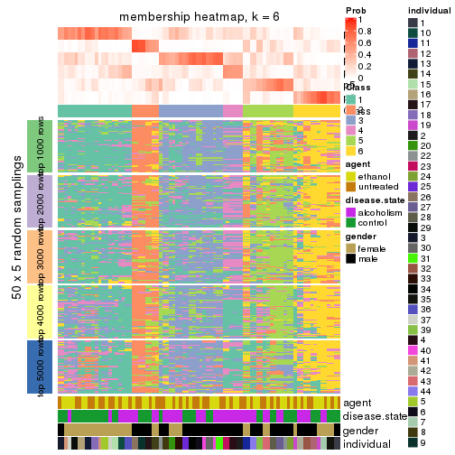</p>

</div>
</div>

As soon as we have had the classes for columns, we can look for signatures
which are significantly different between classes which can be candidate marks
for certain classes. Following are the heatmaps for signatures.


Signature heatmaps where rows are scaled:


<script>
$( function() {
	$( '#tabs-MAD-kmeans-get-signatures' ).tabs();
} );
</script>
<div id='tabs-MAD-kmeans-get-signatures'>
<ul>
<li><a href='#tab-MAD-kmeans-get-signatures-1'>k = 2</a></li>
<li><a href='#tab-MAD-kmeans-get-signatures-2'>k = 3</a></li>
<li><a href='#tab-MAD-kmeans-get-signatures-3'>k = 4</a></li>
<li><a href='#tab-MAD-kmeans-get-signatures-4'>k = 5</a></li>
<li><a href='#tab-MAD-kmeans-get-signatures-5'>k = 6</a></li>
</ul>
<div id='tab-MAD-kmeans-get-signatures-1'>
<pre><code class="r">get_signatures(res, k = 2)
</code></pre>

<p></p>

</div>
<div id='tab-MAD-kmeans-get-signatures-2'>
<pre><code class="r">get_signatures(res, k = 3)
</code></pre>

<p></p>

</div>
<div id='tab-MAD-kmeans-get-signatures-3'>
<pre><code class="r">get_signatures(res, k = 4)
</code></pre>

<p></p>

</div>
<div id='tab-MAD-kmeans-get-signatures-4'>
<pre><code class="r">get_signatures(res, k = 5)
</code></pre>

<p></p>

</div>
<div id='tab-MAD-kmeans-get-signatures-5'>
<pre><code class="r">get_signatures(res, k = 6)
</code></pre>

<p></p>

</div>
</div>


Signature heatmaps where rows are not scaled:


<script>
$( function() {
	$( '#tabs-MAD-kmeans-get-signatures-no-scale' ).tabs();
} );
</script>
<div id='tabs-MAD-kmeans-get-signatures-no-scale'>
<ul>
<li><a href='#tab-MAD-kmeans-get-signatures-no-scale-1'>k = 2</a></li>
<li><a href='#tab-MAD-kmeans-get-signatures-no-scale-2'>k = 3</a></li>
<li><a href='#tab-MAD-kmeans-get-signatures-no-scale-3'>k = 4</a></li>
<li><a href='#tab-MAD-kmeans-get-signatures-no-scale-4'>k = 5</a></li>
<li><a href='#tab-MAD-kmeans-get-signatures-no-scale-5'>k = 6</a></li>
</ul>
<div id='tab-MAD-kmeans-get-signatures-no-scale-1'>
<pre><code class="r">get_signatures(res, k = 2, scale_rows = FALSE)
</code></pre>

<p></p>

</div>
<div id='tab-MAD-kmeans-get-signatures-no-scale-2'>
<pre><code class="r">get_signatures(res, k = 3, scale_rows = FALSE)
</code></pre>

<p></p>

</div>
<div id='tab-MAD-kmeans-get-signatures-no-scale-3'>
<pre><code class="r">get_signatures(res, k = 4, scale_rows = FALSE)
</code></pre>

<p></p>

</div>
<div id='tab-MAD-kmeans-get-signatures-no-scale-4'>
<pre><code class="r">get_signatures(res, k = 5, scale_rows = FALSE)
</code></pre>

<p></p>

</div>
<div id='tab-MAD-kmeans-get-signatures-no-scale-5'>
<pre><code class="r">get_signatures(res, k = 6, scale_rows = FALSE)
</code></pre>

<p></p>

</div>
</div>


Compare the overlap of signatures from different k:

```r
compare_signatures(res)
```


`get_signature()` returns a data frame invisibly. TO get the list of signatures, the function
call should be assigned to a variable explicitly. In following code, if `plot` argument is set
to `FALSE`, no heatmap is plotted while only the differential analysis is performed.

```r
# code only for demonstration
tb = get_signature(res, k = ..., plot = FALSE)
```

An example of the output of `tb` is:

```
#>   which_row         fdr    mean_1    mean_2 scaled_mean_1 scaled_mean_2 km
#> 1        38 0.042760348  8.373488  9.131774    -0.5533452     0.5164555  1
#> 2        40 0.018707592  7.106213  8.469186    -0.6173731     0.5762149  1
#> 3        55 0.019134737 10.221463 11.207825    -0.6159697     0.5749050  1
#> 4        59 0.006059896  5.921854  7.869574    -0.6899429     0.6439467  1
#> 5        60 0.018055526  8.928898 10.211722    -0.6204761     0.5791110  1
#> 6        98 0.009384629 15.714769 14.887706     0.6635654    -0.6193277  2
...
```

The columns in `tb` are:

1. `which_row`: row indices corresponding to the input matrix.
2. `fdr`: FDR for the differential test. 
3. `mean_x`: The mean value in group x.
4. `scaled_mean_x`: The mean value in group x after rows are scaled.
5. `km`: Row groups if k-means clustering is applied to rows.


UMAP plot which shows how samples are separated.


<script>
$( function() {
	$( '#tabs-MAD-kmeans-dimension-reduction' ).tabs();
} );
</script>
<div id='tabs-MAD-kmeans-dimension-reduction'>
<ul>
<li><a href='#tab-MAD-kmeans-dimension-reduction-1'>k = 2</a></li>
<li><a href='#tab-MAD-kmeans-dimension-reduction-2'>k = 3</a></li>
<li><a href='#tab-MAD-kmeans-dimension-reduction-3'>k = 4</a></li>
<li><a href='#tab-MAD-kmeans-dimension-reduction-4'>k = 5</a></li>
<li><a href='#tab-MAD-kmeans-dimension-reduction-5'>k = 6</a></li>
</ul>
<div id='tab-MAD-kmeans-dimension-reduction-1'>
<pre><code class="r">dimension_reduction(res, k = 2, method = &quot;UMAP&quot;)
</code></pre>

<p></p>

</div>
<div id='tab-MAD-kmeans-dimension-reduction-2'>
<pre><code class="r">dimension_reduction(res, k = 3, method = &quot;UMAP&quot;)
</code></pre>

<p></p>

</div>
<div id='tab-MAD-kmeans-dimension-reduction-3'>
<pre><code class="r">dimension_reduction(res, k = 4, method = &quot;UMAP&quot;)
</code></pre>

<p></p>

</div>
<div id='tab-MAD-kmeans-dimension-reduction-4'>
<pre><code class="r">dimension_reduction(res, k = 5, method = &quot;UMAP&quot;)
</code></pre>

<p></p>

</div>
<div id='tab-MAD-kmeans-dimension-reduction-5'>
<pre><code class="r">dimension_reduction(res, k = 6, method = &quot;UMAP&quot;)
</code></pre>

<p></p>

</div>
</div>


Following heatmap shows how subgroups are split when increasing `k`:

```r
collect_classes(res)
```


Test correlation between subgroups and known annotations. If the known
annotation is numeric, one-way ANOVA test is applied, and if the known
annotation is discrete, chi-squared contingency table test is applied.

```r
test_to_known_factors(res)
```

```
#>             n agent(p) disease.state(p) gender(p) individual(p) k
#> MAD:kmeans 83    0.890            0.445  0.530170      2.02e-04 2
#> MAD:kmeans 60    0.770            1.000  0.249796      1.35e-03 3
#> MAD:kmeans 39    0.517            0.354  0.000129      2.76e-04 4
#> MAD:kmeans 17    1.000            0.492  0.433012      3.01e-02 5
#> MAD:kmeans 28    0.987            0.052  0.028217      1.31e-05 6
```


If matrix rows can be associated to genes, consider to use `GO_Enrichment(res,
...)` to perform function enrichment for the signature genes.


 

---------------------------------------------------


### MAD:skmeans


The object with results only for a single top-value method and a single partition method 
can be extracted as:

```r
res = res_list["MAD", "skmeans"]
# you can also extract it by
# res = res_list["MAD:skmeans"]
```

A summary of `res` and all the functions that can be applied to it:

```r
res
```

```
#> A 'ConsensusPartition' object with k = 2, 3, 4, 5, 6.
#>   On a matrix with 51941 rows and 84 columns.
#>   Top rows (1000, 2000, 3000, 4000, 5000) are extracted by 'MAD' method.
#>   Subgroups are detected by 'skmeans' method.
#>   Performed in total 1250 partitions by row resampling.
#>   Best k for subgroups seems to be 2.
#> 
#> Following methods can be applied to this 'ConsensusPartition' object:
#>  [1] "cola_report"             "collect_classes"         "collect_plots"          
#>  [4] "collect_stats"           "colnames"                "compare_signatures"     
#>  [7] "consensus_heatmap"       "dimension_reduction"     "functional_enrichment"  
#> [10] "get_anno_col"            "get_anno"                "get_classes"            
#> [13] "get_consensus"           "get_matrix"              "get_membership"         
#> [16] "get_param"               "get_signatures"          "get_stats"              
#> [19] "is_best_k"               "is_stable_k"             "membership_heatmap"     
#> [22] "ncol"                    "nrow"                    "plot_ecdf"              
#> [25] "rownames"                "select_partition_number" "show"                   
#> [28] "suggest_best_k"          "test_to_known_factors"
```

`collect_plots()` function collects all the plots made from `res` for all `k` (number of partitions)
into one single page to provide an easy and fast comparison between different `k`.

```r
collect_plots(res)
```


The plots are:

- The first row: a plot of the ECDF (Empirical cumulative distribution
  function) curves of the consensus matrix for each `k` and the heatmap of
  predicted classes for each `k`.
- The second row: heatmaps of the consensus matrix for each `k`.
- The third row: heatmaps of the membership matrix for each `k`.
- The fouth row: heatmaps of the signatures for each `k`.

All the plots in panels can be made by individual functions and they are
plotted later in this section.

`select_partition_number()` produces several plots showing different
statistics for choosing "optimized" `k`. There are following statistics:

- ECDF curves of the consensus matrix for each `k`;
- 1-PAC. [The PAC
  score](https://en.wikipedia.org/wiki/Consensus_clustering#Over-interpretation_potential_of_consensus_clustering)
  measures the proportion of the ambiguous subgrouping.
- Mean silhouette score.
- Concordance. The mean probability of fiting the consensus class ids in all
  partitions.
- Area increased. Denote $A_k$ as the area under the ECDF curve for current
  `k`, the area increased is defined as $A_k - A_{k-1}$.
- Rand index. The percent of pairs of samples that are both in a same cluster
  or both are not in a same cluster in the partition of k and k-1.
- Jaccard index. The ratio of pairs of samples are both in a same cluster in
  the partition of k and k-1 and the pairs of samples are both in a same
  cluster in the partition k or k-1.

The detailed explanations of these statistics can be found in [the cola
vignette](http://bioconductor.org/packages/devel/bioc/vignettes/cola/inst/doc/cola.html#toc_13).

Generally speaking, lower PAC score, higher mean silhouette score or higher
concordance corresponds to better partition. Rand index and Jaccard index
measure how similar the current partition is compared to partition with `k-1`.
If they are too similar, we won't accept `k` is better than `k-1`.

```r
select_partition_number(res)
```


The numeric values for all these statistics can be obtained by `get_stats()`.

```r
get_stats(res)
```

```
#>   k   1-PAC mean_silhouette concordance area_increased  Rand Jaccard
#> 2 2 0.00000          0.6370       0.713         0.5039 0.504   0.504
#> 3 3 0.00811          0.2219       0.515         0.3314 0.813   0.649
#> 4 4 0.04090          0.0857       0.376         0.1241 0.761   0.448
#> 5 5 0.11555          0.1228       0.369         0.0656 0.817   0.424
#> 6 6 0.22038          0.0950       0.322         0.0419 0.851   0.426
```

`suggest_best_k()` suggests the best $k$ based on these statistics. The rules are as follows:

- All $k$ with Jaccard index larger than 0.95 are removed because the increase of
  the partition number does not provides enough extra information. If all $k$ are removed,
  the best $k$ is assigned by `NA`.
- For $k$ with 1-PAC larger than 0.9, the maximal $k$ is taken as the "best k". Other $k$ is called "optional k".
- If it does not fit the second rule. The $k$ with the highest vote of highest
  1-PAC, mean silhouette and concordance is taken as the "best k".

```r
suggest_best_k(res)
```

```
#> [1] 2
```


Following shows the table of the partitions (You need to click the **show/hide
code output** link to see it). The membership matrix (columns with name `p*`)
is inferred by
[`clue::cl_consensus()`](https://www.rdocumentation.org/link/cl_consensus?package=clue)
function with the `SE` method. Basically the value in the membership matrix
represents the probability to belong to a certain group. The finall class
label for an item is determined with the group with highest probability it
belongs to.

In `get_classes()` function, the entropy is calculated from the membership
matrix and the silhouette score is calculated from the consensus matrix.


<script>
$( function() {
	$( '#tabs-MAD-skmeans-get-classes' ).tabs();
} );
</script>
<div id='tabs-MAD-skmeans-get-classes'>
<ul>
<li><a href='#tab-MAD-skmeans-get-classes-1'>k = 2</a></li>
<li><a href='#tab-MAD-skmeans-get-classes-2'>k = 3</a></li>
<li><a href='#tab-MAD-skmeans-get-classes-3'>k = 4</a></li>
<li><a href='#tab-MAD-skmeans-get-classes-4'>k = 5</a></li>
<li><a href='#tab-MAD-skmeans-get-classes-5'>k = 6</a></li>
</ul>

<div id='tab-MAD-skmeans-get-classes-1'>
<p><a id='tab-MAD-skmeans-get-classes-1-a' style='color:#0366d6' href='#'>show/hide code output</a></p>
<pre><code class="r">cbind(get_classes(res, k = 2), get_membership(res, k = 2))
</code></pre>

<pre><code>#&gt;            class entropy silhouette    p1    p2
#&gt; GSM1269647     2   0.760     0.7367 0.220 0.780
#&gt; GSM1269655     1   0.961     0.5539 0.616 0.384
#&gt; GSM1269663     2   0.994     0.2001 0.456 0.544
#&gt; GSM1269671     2   0.605     0.7441 0.148 0.852
#&gt; GSM1269679     1   0.866     0.6822 0.712 0.288
#&gt; GSM1269693     1   0.781     0.7015 0.768 0.232
#&gt; GSM1269701     1   0.827     0.7070 0.740 0.260
#&gt; GSM1269709     1   0.999     0.0176 0.520 0.480
#&gt; GSM1269715     1   0.574     0.7110 0.864 0.136
#&gt; GSM1269717     1   0.615     0.7164 0.848 0.152
#&gt; GSM1269721     2   0.680     0.7472 0.180 0.820
#&gt; GSM1269723     1   0.990     0.4320 0.560 0.440
#&gt; GSM1269645     1   0.855     0.7083 0.720 0.280
#&gt; GSM1269653     2   0.881     0.6787 0.300 0.700
#&gt; GSM1269661     1   0.966     0.5597 0.608 0.392
#&gt; GSM1269669     1   0.443     0.7031 0.908 0.092
#&gt; GSM1269677     2   0.680     0.7241 0.180 0.820
#&gt; GSM1269685     1   0.855     0.6826 0.720 0.280
#&gt; GSM1269691     1   0.839     0.6886 0.732 0.268
#&gt; GSM1269699     2   0.574     0.7435 0.136 0.864
#&gt; GSM1269707     2   0.730     0.7535 0.204 0.796
#&gt; GSM1269651     2   0.730     0.7395 0.204 0.796
#&gt; GSM1269659     2   0.917     0.6192 0.332 0.668
#&gt; GSM1269667     1   0.861     0.6862 0.716 0.284
#&gt; GSM1269675     2   0.753     0.7452 0.216 0.784
#&gt; GSM1269683     1   0.753     0.7277 0.784 0.216
#&gt; GSM1269689     2   0.814     0.7114 0.252 0.748
#&gt; GSM1269697     2   0.839     0.7026 0.268 0.732
#&gt; GSM1269705     2   0.745     0.7517 0.212 0.788
#&gt; GSM1269713     2   0.925     0.5391 0.340 0.660
#&gt; GSM1269719     1   0.995     0.2936 0.540 0.460
#&gt; GSM1269725     2   0.861     0.6825 0.284 0.716
#&gt; GSM1269727     1   0.827     0.7158 0.740 0.260
#&gt; GSM1269649     1   0.975     0.5487 0.592 0.408
#&gt; GSM1269657     2   0.808     0.7239 0.248 0.752
#&gt; GSM1269665     1   0.821     0.7200 0.744 0.256
#&gt; GSM1269673     1   0.760     0.7260 0.780 0.220
#&gt; GSM1269681     2   0.482     0.7442 0.104 0.896
#&gt; GSM1269687     1   0.821     0.7088 0.744 0.256
#&gt; GSM1269695     1   0.939     0.6397 0.644 0.356
#&gt; GSM1269703     1   0.866     0.7040 0.712 0.288
#&gt; GSM1269711     1   0.987     0.3785 0.568 0.432
#&gt; GSM1269646     2   0.775     0.7176 0.228 0.772
#&gt; GSM1269654     1   0.895     0.6737 0.688 0.312
#&gt; GSM1269662     2   0.992     0.2398 0.448 0.552
#&gt; GSM1269670     2   0.634     0.7412 0.160 0.840
#&gt; GSM1269678     1   0.795     0.7211 0.760 0.240
#&gt; GSM1269692     1   0.781     0.7116 0.768 0.232
#&gt; GSM1269700     1   0.855     0.6923 0.720 0.280
#&gt; GSM1269708     1   0.981     0.3826 0.580 0.420
#&gt; GSM1269714     1   0.552     0.7192 0.872 0.128
#&gt; GSM1269716     1   0.482     0.7115 0.896 0.104
#&gt; GSM1269720     2   0.730     0.7471 0.204 0.796
#&gt; GSM1269722     1   0.952     0.5304 0.628 0.372
#&gt; GSM1269644     1   0.943     0.6002 0.640 0.360
#&gt; GSM1269652     2   0.900     0.6686 0.316 0.684
#&gt; GSM1269660     1   0.997     0.3249 0.532 0.468
#&gt; GSM1269668     1   0.494     0.7018 0.892 0.108
#&gt; GSM1269676     2   0.653     0.7330 0.168 0.832
#&gt; GSM1269684     1   0.653     0.7243 0.832 0.168
#&gt; GSM1269690     1   0.767     0.7108 0.776 0.224
#&gt; GSM1269698     2   0.518     0.7470 0.116 0.884
#&gt; GSM1269706     2   0.861     0.6908 0.284 0.716
#&gt; GSM1269650     2   0.671     0.7461 0.176 0.824
#&gt; GSM1269658     2   0.881     0.6612 0.300 0.700
#&gt; GSM1269666     1   0.767     0.7199 0.776 0.224
#&gt; GSM1269674     2   0.839     0.7321 0.268 0.732
#&gt; GSM1269682     1   0.775     0.7261 0.772 0.228
#&gt; GSM1269688     2   0.808     0.7068 0.248 0.752
#&gt; GSM1269696     2   0.808     0.6902 0.248 0.752
#&gt; GSM1269704     2   0.634     0.7549 0.160 0.840
#&gt; GSM1269712     1   0.980     0.4498 0.584 0.416
#&gt; GSM1269718     2   0.990     0.1368 0.440 0.560
#&gt; GSM1269724     2   1.000     0.1744 0.496 0.504
#&gt; GSM1269726     1   0.821     0.7204 0.744 0.256
#&gt; GSM1269648     1   0.969     0.4987 0.604 0.396
#&gt; GSM1269656     2   0.909     0.6151 0.324 0.676
#&gt; GSM1269664     1   0.767     0.7238 0.776 0.224
#&gt; GSM1269672     1   0.760     0.7243 0.780 0.220
#&gt; GSM1269680     2   0.644     0.7441 0.164 0.836
#&gt; GSM1269686     1   0.563     0.7239 0.868 0.132
#&gt; GSM1269694     1   0.925     0.6472 0.660 0.340
#&gt; GSM1269702     1   0.952     0.5893 0.628 0.372
#&gt; GSM1269710     1   0.955     0.5326 0.624 0.376
</code></pre>

<script>
$('#tab-MAD-skmeans-get-classes-1-a').parent().next().next().hide();
$('#tab-MAD-skmeans-get-classes-1-a').click(function(){
  $('#tab-MAD-skmeans-get-classes-1-a').parent().next().next().toggle();
  return(false);
});
</script>
</div>

<div id='tab-MAD-skmeans-get-classes-2'>
<p><a id='tab-MAD-skmeans-get-classes-2-a' style='color:#0366d6' href='#'>show/hide code output</a></p>
<pre><code class="r">cbind(get_classes(res, k = 3), get_membership(res, k = 3))
</code></pre>

<pre><code>#&gt;            class entropy silhouette    p1    p2    p3
#&gt; GSM1269647     2   0.868    0.39585 0.120 0.540 0.340
#&gt; GSM1269655     1   0.996   -0.07851 0.368 0.292 0.340
#&gt; GSM1269663     2   0.997   -0.21895 0.340 0.364 0.296
#&gt; GSM1269671     2   0.706    0.52159 0.052 0.672 0.276
#&gt; GSM1269679     3   0.907   -0.04099 0.416 0.136 0.448
#&gt; GSM1269693     1   0.852    0.28345 0.608 0.164 0.228
#&gt; GSM1269701     3   0.896    0.04588 0.376 0.132 0.492
#&gt; GSM1269709     1   0.954   -0.03106 0.420 0.192 0.388
#&gt; GSM1269715     1   0.637    0.30774 0.756 0.068 0.176
#&gt; GSM1269717     1   0.626    0.30693 0.752 0.052 0.196
#&gt; GSM1269721     2   0.753    0.50213 0.084 0.664 0.252
#&gt; GSM1269723     3   0.951    0.14722 0.296 0.220 0.484
#&gt; GSM1269645     1   0.939    0.11105 0.504 0.212 0.284
#&gt; GSM1269653     2   0.894    0.35528 0.160 0.548 0.292
#&gt; GSM1269661     1   0.990   -0.13118 0.372 0.264 0.364
#&gt; GSM1269669     1   0.740    0.19559 0.612 0.048 0.340
#&gt; GSM1269677     2   0.594    0.52579 0.120 0.792 0.088
#&gt; GSM1269685     1   0.858    0.24438 0.596 0.152 0.252
#&gt; GSM1269691     1   0.905    0.23667 0.556 0.224 0.220
#&gt; GSM1269699     2   0.663    0.52866 0.056 0.724 0.220
#&gt; GSM1269707     2   0.819    0.46096 0.128 0.628 0.244
#&gt; GSM1269651     2   0.699    0.52215 0.108 0.728 0.164
#&gt; GSM1269659     2   0.889    0.34201 0.284 0.556 0.160
#&gt; GSM1269667     1   0.911    0.00955 0.448 0.140 0.412
#&gt; GSM1269675     2   0.889    0.39071 0.132 0.516 0.352
#&gt; GSM1269683     1   0.898    0.21337 0.524 0.148 0.328
#&gt; GSM1269689     2   0.867    0.31636 0.108 0.508 0.384
#&gt; GSM1269697     2   0.904    0.30954 0.140 0.488 0.372
#&gt; GSM1269705     2   0.795    0.48742 0.084 0.608 0.308
#&gt; GSM1269713     3   0.928    0.21296 0.180 0.320 0.500
#&gt; GSM1269719     2   0.997   -0.17690 0.300 0.360 0.340
#&gt; GSM1269725     3   0.876    0.03626 0.120 0.360 0.520
#&gt; GSM1269727     1   0.906    0.12960 0.480 0.140 0.380
#&gt; GSM1269649     3   0.958    0.14151 0.340 0.208 0.452
#&gt; GSM1269657     2   0.875    0.37664 0.224 0.588 0.188
#&gt; GSM1269665     1   0.928    0.15039 0.512 0.192 0.296
#&gt; GSM1269673     1   0.835    0.27209 0.604 0.124 0.272
#&gt; GSM1269681     2   0.524    0.54075 0.028 0.804 0.168
#&gt; GSM1269687     1   0.918    0.10276 0.472 0.152 0.376
#&gt; GSM1269695     1   0.983   -0.02169 0.400 0.248 0.352
#&gt; GSM1269703     1   0.961    0.10376 0.428 0.204 0.368
#&gt; GSM1269711     3   0.962    0.14358 0.324 0.220 0.456
#&gt; GSM1269646     2   0.885    0.30365 0.128 0.516 0.356
#&gt; GSM1269654     1   0.990   -0.01505 0.404 0.300 0.296
#&gt; GSM1269662     1   0.999   -0.03754 0.348 0.340 0.312
#&gt; GSM1269670     2   0.698    0.51074 0.064 0.700 0.236
#&gt; GSM1269678     1   0.888    0.09529 0.508 0.128 0.364
#&gt; GSM1269692     1   0.832    0.29034 0.628 0.212 0.160
#&gt; GSM1269700     3   0.891    0.11712 0.344 0.136 0.520
#&gt; GSM1269708     1   0.946   -0.00690 0.412 0.180 0.408
#&gt; GSM1269714     1   0.648    0.29391 0.728 0.048 0.224
#&gt; GSM1269716     1   0.626    0.29405 0.752 0.052 0.196
#&gt; GSM1269720     2   0.781    0.50813 0.144 0.672 0.184
#&gt; GSM1269722     1   0.944    0.05311 0.444 0.180 0.376
#&gt; GSM1269644     1   0.990    0.04859 0.376 0.264 0.360
#&gt; GSM1269652     2   0.975    0.15099 0.232 0.420 0.348
#&gt; GSM1269660     1   0.988   -0.12347 0.376 0.260 0.364
#&gt; GSM1269668     1   0.746    0.15944 0.584 0.044 0.372
#&gt; GSM1269676     2   0.685    0.52102 0.136 0.740 0.124
#&gt; GSM1269684     1   0.857    0.27105 0.592 0.144 0.264
#&gt; GSM1269690     1   0.857    0.26887 0.604 0.168 0.228
#&gt; GSM1269698     2   0.650    0.52731 0.056 0.736 0.208
#&gt; GSM1269706     2   0.948    0.32158 0.216 0.488 0.296
#&gt; GSM1269650     2   0.657    0.51704 0.088 0.752 0.160
#&gt; GSM1269658     2   0.900    0.34034 0.240 0.560 0.200
#&gt; GSM1269666     1   0.849    0.12301 0.548 0.104 0.348
#&gt; GSM1269674     2   0.824    0.46411 0.160 0.636 0.204
#&gt; GSM1269682     1   0.897    0.19941 0.528 0.148 0.324
#&gt; GSM1269688     2   0.871    0.33853 0.112 0.508 0.380
#&gt; GSM1269696     2   0.913    0.18257 0.144 0.460 0.396
#&gt; GSM1269704     2   0.745    0.48745 0.068 0.652 0.280
#&gt; GSM1269712     3   0.944    0.12517 0.324 0.196 0.480
#&gt; GSM1269718     3   0.985    0.05275 0.264 0.324 0.412
#&gt; GSM1269724     3   0.976    0.24759 0.268 0.288 0.444
#&gt; GSM1269726     1   0.885    0.16159 0.484 0.120 0.396
#&gt; GSM1269648     3   0.961    0.12417 0.332 0.216 0.452
#&gt; GSM1269656     2   0.969    0.13432 0.324 0.444 0.232
#&gt; GSM1269664     1   0.903    0.09246 0.476 0.136 0.388
#&gt; GSM1269672     1   0.814    0.27313 0.616 0.108 0.276
#&gt; GSM1269680     2   0.583    0.54381 0.076 0.796 0.128
#&gt; GSM1269686     1   0.857    0.22446 0.556 0.116 0.328
#&gt; GSM1269694     1   0.983    0.01131 0.408 0.252 0.340
#&gt; GSM1269702     1   0.974    0.09484 0.448 0.268 0.284
#&gt; GSM1269710     3   0.932    0.07986 0.368 0.168 0.464
</code></pre>

<script>
$('#tab-MAD-skmeans-get-classes-2-a').parent().next().next().hide();
$('#tab-MAD-skmeans-get-classes-2-a').click(function(){
  $('#tab-MAD-skmeans-get-classes-2-a').parent().next().next().toggle();
  return(false);
});
</script>
</div>

<div id='tab-MAD-skmeans-get-classes-3'>
<p><a id='tab-MAD-skmeans-get-classes-3-a' style='color:#0366d6' href='#'>show/hide code output</a></p>
<pre><code class="r">cbind(get_classes(res, k = 4), get_membership(res, k = 4))
</code></pre>

<pre><code>#&gt;            class entropy silhouette    p1    p2    p3    p4
#&gt; GSM1269647     3   0.892    0.13211 0.068 0.200 0.404 0.328
#&gt; GSM1269655     1   0.991   -0.02139 0.300 0.268 0.240 0.192
#&gt; GSM1269663     4   0.984   -0.05495 0.256 0.224 0.188 0.332
#&gt; GSM1269671     3   0.821   -0.02282 0.076 0.088 0.432 0.404
#&gt; GSM1269679     1   0.883    0.01555 0.392 0.364 0.176 0.068
#&gt; GSM1269693     1   0.761    0.18796 0.624 0.176 0.076 0.124
#&gt; GSM1269701     2   0.871    0.06905 0.284 0.468 0.176 0.072
#&gt; GSM1269709     1   0.997   -0.02501 0.276 0.228 0.268 0.228
#&gt; GSM1269715     1   0.639    0.20398 0.704 0.176 0.076 0.044
#&gt; GSM1269717     1   0.716    0.21566 0.668 0.144 0.100 0.088
#&gt; GSM1269721     4   0.844    0.19565 0.152 0.088 0.224 0.536
#&gt; GSM1269723     2   0.940    0.10953 0.244 0.384 0.264 0.108
#&gt; GSM1269645     2   0.922    0.12870 0.264 0.432 0.188 0.116
#&gt; GSM1269653     4   0.945   -0.10808 0.104 0.244 0.324 0.328
#&gt; GSM1269661     2   0.980    0.08608 0.280 0.332 0.204 0.184
#&gt; GSM1269669     1   0.786    0.06401 0.440 0.416 0.104 0.040
#&gt; GSM1269677     4   0.555    0.32094 0.068 0.052 0.104 0.776
#&gt; GSM1269685     1   0.917    0.17081 0.460 0.212 0.200 0.128
#&gt; GSM1269691     1   0.918    0.14207 0.468 0.172 0.156 0.204
#&gt; GSM1269699     4   0.733    0.03253 0.020 0.092 0.412 0.476
#&gt; GSM1269707     4   0.914    0.02620 0.132 0.140 0.300 0.428
#&gt; GSM1269651     4   0.730    0.26892 0.068 0.112 0.172 0.648
#&gt; GSM1269659     4   0.902    0.17248 0.224 0.100 0.212 0.464
#&gt; GSM1269667     2   0.867    0.07693 0.328 0.440 0.168 0.064
#&gt; GSM1269675     4   0.889   -0.03796 0.084 0.156 0.368 0.392
#&gt; GSM1269683     1   0.854    0.09846 0.484 0.304 0.084 0.128
#&gt; GSM1269689     3   0.936    0.13160 0.112 0.200 0.380 0.308
#&gt; GSM1269697     3   0.877    0.10596 0.100 0.136 0.472 0.292
#&gt; GSM1269705     3   0.868   -0.02130 0.072 0.144 0.392 0.392
#&gt; GSM1269713     3   0.943    0.12321 0.116 0.332 0.348 0.204
#&gt; GSM1269719     4   0.977   -0.11575 0.192 0.308 0.184 0.316
#&gt; GSM1269725     3   0.949    0.19764 0.132 0.272 0.388 0.208
#&gt; GSM1269727     2   0.848   -0.00112 0.388 0.416 0.132 0.064
#&gt; GSM1269649     2   0.898    0.15052 0.152 0.424 0.324 0.100
#&gt; GSM1269657     4   0.869    0.16478 0.128 0.112 0.260 0.500
#&gt; GSM1269665     1   0.965   -0.03101 0.340 0.300 0.216 0.144
#&gt; GSM1269673     1   0.916    0.08951 0.436 0.256 0.204 0.104
#&gt; GSM1269681     4   0.631    0.25008 0.024 0.064 0.240 0.672
#&gt; GSM1269687     2   0.957    0.00620 0.320 0.340 0.204 0.136
#&gt; GSM1269695     3   0.986   -0.12912 0.208 0.288 0.308 0.196
#&gt; GSM1269703     2   0.966    0.07271 0.256 0.376 0.192 0.176
#&gt; GSM1269711     3   0.955   -0.12503 0.224 0.304 0.348 0.124
#&gt; GSM1269646     3   0.887    0.17697 0.068 0.236 0.448 0.248
#&gt; GSM1269654     1   0.988    0.01268 0.308 0.256 0.180 0.256
#&gt; GSM1269662     4   0.989   -0.07446 0.236 0.236 0.204 0.324
#&gt; GSM1269670     3   0.747   -0.05008 0.024 0.096 0.464 0.416
#&gt; GSM1269678     1   0.897   -0.00837 0.376 0.364 0.184 0.076
#&gt; GSM1269692     1   0.821    0.18688 0.568 0.168 0.084 0.180
#&gt; GSM1269700     2   0.926    0.12947 0.260 0.404 0.240 0.096
#&gt; GSM1269708     1   0.952    0.07664 0.388 0.204 0.268 0.140
#&gt; GSM1269714     1   0.717    0.21660 0.648 0.196 0.096 0.060
#&gt; GSM1269716     1   0.656    0.20481 0.696 0.176 0.072 0.056
#&gt; GSM1269720     4   0.769    0.23877 0.088 0.116 0.176 0.620
#&gt; GSM1269722     1   0.949    0.00475 0.388 0.288 0.156 0.168
#&gt; GSM1269644     2   0.982    0.01932 0.260 0.328 0.172 0.240
#&gt; GSM1269652     3   0.941    0.07051 0.140 0.168 0.384 0.308
#&gt; GSM1269660     2   0.985    0.11253 0.208 0.332 0.256 0.204
#&gt; GSM1269668     1   0.802    0.06436 0.472 0.372 0.104 0.052
#&gt; GSM1269676     4   0.493    0.31146 0.064 0.032 0.096 0.808
#&gt; GSM1269684     1   0.909    0.12667 0.444 0.284 0.124 0.148
#&gt; GSM1269690     1   0.888    0.18065 0.508 0.168 0.144 0.180
#&gt; GSM1269698     4   0.677    0.11393 0.016 0.064 0.368 0.552
#&gt; GSM1269706     3   0.890   -0.01612 0.140 0.096 0.404 0.360
#&gt; GSM1269650     4   0.757    0.23933 0.056 0.128 0.204 0.612
#&gt; GSM1269658     4   0.807    0.25931 0.184 0.120 0.108 0.588
#&gt; GSM1269666     1   0.894   -0.00736 0.396 0.356 0.164 0.084
#&gt; GSM1269674     4   0.880    0.07220 0.108 0.144 0.260 0.488
#&gt; GSM1269682     1   0.836    0.03754 0.456 0.364 0.084 0.096
#&gt; GSM1269688     3   0.909    0.13153 0.072 0.236 0.388 0.304
#&gt; GSM1269696     3   0.904    0.17745 0.080 0.240 0.432 0.248
#&gt; GSM1269704     4   0.798    0.00631 0.052 0.096 0.420 0.432
#&gt; GSM1269712     2   0.967    0.07455 0.276 0.348 0.232 0.144
#&gt; GSM1269718     2   0.992    0.01818 0.196 0.300 0.244 0.260
#&gt; GSM1269724     3   0.960    0.02093 0.188 0.312 0.348 0.152
#&gt; GSM1269726     2   0.872    0.02793 0.376 0.384 0.184 0.056
#&gt; GSM1269648     3   0.938   -0.07862 0.172 0.344 0.356 0.128
#&gt; GSM1269656     4   0.892    0.11415 0.240 0.104 0.176 0.480
#&gt; GSM1269664     2   0.931    0.08731 0.240 0.440 0.156 0.164
#&gt; GSM1269672     1   0.890    0.09637 0.476 0.256 0.164 0.104
#&gt; GSM1269680     4   0.580    0.28274 0.032 0.080 0.140 0.748
#&gt; GSM1269686     1   0.899    0.04565 0.408 0.348 0.116 0.128
#&gt; GSM1269694     2   0.972    0.10918 0.240 0.316 0.300 0.144
#&gt; GSM1269702     1   0.996    0.01635 0.292 0.232 0.224 0.252
#&gt; GSM1269710     2   0.964    0.04931 0.292 0.324 0.256 0.128
</code></pre>

<script>
$('#tab-MAD-skmeans-get-classes-3-a').parent().next().next().hide();
$('#tab-MAD-skmeans-get-classes-3-a').click(function(){
  $('#tab-MAD-skmeans-get-classes-3-a').parent().next().next().toggle();
  return(false);
});
</script>
</div>

<div id='tab-MAD-skmeans-get-classes-4'>
<p><a id='tab-MAD-skmeans-get-classes-4-a' style='color:#0366d6' href='#'>show/hide code output</a></p>
<pre><code class="r">cbind(get_classes(res, k = 5), get_membership(res, k = 5))
</code></pre>

<pre><code>#&gt;            class entropy silhouette    p1    p2    p3    p4    p5
#&gt; GSM1269647     5   0.853    0.21626 0.124 0.276 0.140 0.036 0.424
#&gt; GSM1269655     4   0.987   -0.01611 0.152 0.176 0.204 0.276 0.192
#&gt; GSM1269663     2   0.978   -0.06125 0.200 0.284 0.144 0.228 0.144
#&gt; GSM1269671     5   0.768    0.26199 0.140 0.284 0.048 0.032 0.496
#&gt; GSM1269679     3   0.874    0.12065 0.092 0.056 0.388 0.300 0.164
#&gt; GSM1269693     4   0.811    0.21047 0.176 0.076 0.132 0.536 0.080
#&gt; GSM1269701     3   0.782    0.20243 0.132 0.036 0.556 0.128 0.148
#&gt; GSM1269709     4   0.953    0.00270 0.272 0.084 0.168 0.288 0.188
#&gt; GSM1269715     4   0.588    0.21666 0.088 0.024 0.152 0.704 0.032
#&gt; GSM1269717     4   0.596    0.23335 0.080 0.044 0.132 0.712 0.032
#&gt; GSM1269721     2   0.891    0.11040 0.148 0.452 0.096 0.124 0.180
#&gt; GSM1269723     3   0.920    0.16898 0.104 0.108 0.396 0.196 0.196
#&gt; GSM1269645     3   0.968    0.01747 0.248 0.128 0.280 0.220 0.124
#&gt; GSM1269653     5   0.960    0.16249 0.172 0.256 0.216 0.084 0.272
#&gt; GSM1269661     4   0.963   -0.05854 0.152 0.096 0.252 0.268 0.232
#&gt; GSM1269669     4   0.856    0.02093 0.212 0.032 0.284 0.384 0.088
#&gt; GSM1269677     2   0.607    0.35510 0.144 0.700 0.024 0.060 0.072
#&gt; GSM1269685     4   0.817    0.09803 0.380 0.072 0.080 0.396 0.072
#&gt; GSM1269691     4   0.862    0.11021 0.304 0.140 0.120 0.396 0.040
#&gt; GSM1269699     5   0.750    0.20147 0.112 0.348 0.040 0.032 0.468
#&gt; GSM1269707     2   0.854   -0.06737 0.160 0.400 0.060 0.068 0.312
#&gt; GSM1269651     2   0.742    0.24473 0.088 0.608 0.080 0.072 0.152
#&gt; GSM1269659     2   0.806    0.26598 0.196 0.504 0.052 0.192 0.056
#&gt; GSM1269667     3   0.877    0.17415 0.116 0.040 0.404 0.212 0.228
#&gt; GSM1269675     5   0.847    0.22605 0.184 0.260 0.080 0.044 0.432
#&gt; GSM1269683     4   0.921    0.03008 0.132 0.116 0.264 0.376 0.112
#&gt; GSM1269689     5   0.954    0.14861 0.180 0.232 0.180 0.088 0.320
#&gt; GSM1269697     5   0.910    0.17460 0.176 0.196 0.156 0.068 0.404
#&gt; GSM1269705     5   0.838    0.23027 0.092 0.300 0.096 0.068 0.444
#&gt; GSM1269713     3   0.900   -0.02128 0.168 0.124 0.356 0.056 0.296
#&gt; GSM1269719     1   0.983    0.08214 0.256 0.252 0.164 0.140 0.188
#&gt; GSM1269725     5   0.901    0.10787 0.096 0.160 0.304 0.080 0.360
#&gt; GSM1269727     3   0.913    0.08589 0.160 0.056 0.344 0.284 0.156
#&gt; GSM1269649     3   0.913   -0.03346 0.240 0.040 0.296 0.148 0.276
#&gt; GSM1269657     2   0.744    0.31925 0.212 0.576 0.040 0.080 0.092
#&gt; GSM1269665     4   0.956    0.00669 0.208 0.108 0.268 0.292 0.124
#&gt; GSM1269673     4   0.922    0.05281 0.292 0.120 0.148 0.348 0.092
#&gt; GSM1269681     2   0.610    0.20552 0.052 0.684 0.036 0.044 0.184
#&gt; GSM1269687     1   0.935    0.01013 0.308 0.096 0.300 0.184 0.112
#&gt; GSM1269695     1   0.961    0.15879 0.332 0.148 0.136 0.156 0.228
#&gt; GSM1269703     3   0.939    0.04255 0.240 0.144 0.328 0.212 0.076
#&gt; GSM1269711     1   0.941    0.07509 0.352 0.096 0.204 0.132 0.216
#&gt; GSM1269646     5   0.838    0.17400 0.088 0.252 0.268 0.016 0.376
#&gt; GSM1269654     4   0.955   -0.00627 0.124 0.196 0.264 0.304 0.112
#&gt; GSM1269662     2   0.965   -0.02312 0.220 0.316 0.200 0.144 0.120
#&gt; GSM1269670     5   0.773    0.23392 0.160 0.288 0.036 0.036 0.480
#&gt; GSM1269678     3   0.911    0.05578 0.156 0.068 0.368 0.272 0.136
#&gt; GSM1269692     4   0.810    0.19351 0.232 0.160 0.100 0.484 0.024
#&gt; GSM1269700     3   0.858    0.20457 0.124 0.068 0.480 0.132 0.196
#&gt; GSM1269708     4   0.899    0.05232 0.316 0.044 0.180 0.324 0.136
#&gt; GSM1269714     4   0.672    0.21279 0.120 0.044 0.120 0.660 0.056
#&gt; GSM1269716     4   0.584    0.23417 0.104 0.024 0.108 0.720 0.044
#&gt; GSM1269720     2   0.786    0.22029 0.148 0.560 0.064 0.076 0.152
#&gt; GSM1269722     3   0.955    0.07734 0.156 0.120 0.332 0.244 0.148
#&gt; GSM1269644     1   0.962    0.00702 0.288 0.212 0.148 0.252 0.100
#&gt; GSM1269652     1   0.958   -0.04297 0.304 0.236 0.104 0.136 0.220
#&gt; GSM1269660     3   0.986    0.05619 0.180 0.164 0.288 0.192 0.176
#&gt; GSM1269668     3   0.784   -0.00126 0.116 0.012 0.392 0.384 0.096
#&gt; GSM1269676     2   0.597    0.32360 0.128 0.708 0.020 0.056 0.088
#&gt; GSM1269684     4   0.910    0.05603 0.288 0.096 0.204 0.340 0.072
#&gt; GSM1269690     4   0.799    0.21451 0.264 0.100 0.072 0.504 0.060
#&gt; GSM1269698     5   0.699    0.11113 0.056 0.424 0.056 0.020 0.444
#&gt; GSM1269706     5   0.908    0.12086 0.240 0.244 0.052 0.120 0.344
#&gt; GSM1269650     2   0.712    0.26305 0.124 0.636 0.076 0.060 0.104
#&gt; GSM1269658     2   0.774    0.32289 0.184 0.568 0.088 0.100 0.060
#&gt; GSM1269666     3   0.871    0.10597 0.092 0.056 0.384 0.312 0.156
#&gt; GSM1269674     5   0.926    0.13759 0.112 0.292 0.128 0.120 0.348
#&gt; GSM1269682     4   0.887    0.04712 0.208 0.068 0.304 0.348 0.072
#&gt; GSM1269688     5   0.935    0.18056 0.172 0.212 0.172 0.080 0.364
#&gt; GSM1269696     5   0.894    0.13690 0.100 0.208 0.248 0.060 0.384
#&gt; GSM1269704     5   0.851    0.24390 0.128 0.280 0.116 0.044 0.432
#&gt; GSM1269712     3   0.932    0.12414 0.140 0.068 0.332 0.228 0.232
#&gt; GSM1269718     1   0.983    0.08832 0.264 0.232 0.200 0.132 0.172
#&gt; GSM1269724     3   0.887    0.16479 0.100 0.080 0.400 0.136 0.284
#&gt; GSM1269726     4   0.933   -0.00491 0.176 0.076 0.224 0.360 0.164
#&gt; GSM1269648     1   0.921    0.11143 0.384 0.080 0.132 0.188 0.216
#&gt; GSM1269656     2   0.902    0.11631 0.304 0.360 0.068 0.136 0.132
#&gt; GSM1269664     3   0.933    0.04343 0.204 0.080 0.356 0.220 0.140
#&gt; GSM1269672     4   0.866    0.13347 0.264 0.088 0.148 0.432 0.068
#&gt; GSM1269680     2   0.571    0.24807 0.108 0.708 0.024 0.016 0.144
#&gt; GSM1269686     4   0.912    0.02066 0.276 0.072 0.280 0.288 0.084
#&gt; GSM1269694     1   0.965    0.09075 0.292 0.104 0.152 0.220 0.232
#&gt; GSM1269702     1   0.940    0.11749 0.352 0.236 0.116 0.188 0.108
#&gt; GSM1269710     1   0.961    0.05650 0.316 0.100 0.224 0.184 0.176
</code></pre>

<script>
$('#tab-MAD-skmeans-get-classes-4-a').parent().next().next().hide();
$('#tab-MAD-skmeans-get-classes-4-a').click(function(){
  $('#tab-MAD-skmeans-get-classes-4-a').parent().next().next().toggle();
  return(false);
});
</script>
</div>

<div id='tab-MAD-skmeans-get-classes-5'>
<p><a id='tab-MAD-skmeans-get-classes-5-a' style='color:#0366d6' href='#'>show/hide code output</a></p>
<pre><code class="r">cbind(get_classes(res, k = 6), get_membership(res, k = 6))
</code></pre>

<pre><code>#&gt;            class entropy silhouette    p1    p2    p3    p4    p5    p6
#&gt; GSM1269647     2   0.842    0.14897 0.080 0.436 0.104 0.044 0.100 0.236
#&gt; GSM1269655     5   0.992   -0.02811 0.128 0.132 0.180 0.184 0.204 0.172
#&gt; GSM1269663     5   0.974    0.00915 0.160 0.096 0.124 0.184 0.260 0.176
#&gt; GSM1269671     2   0.794    0.22810 0.144 0.496 0.048 0.036 0.092 0.184
#&gt; GSM1269679     3   0.785    0.14265 0.072 0.100 0.512 0.188 0.100 0.028
#&gt; GSM1269693     4   0.776    0.17853 0.068 0.040 0.104 0.512 0.216 0.060
#&gt; GSM1269701     3   0.882    0.11999 0.216 0.104 0.396 0.144 0.088 0.052
#&gt; GSM1269709     3   0.963   -0.01118 0.148 0.100 0.252 0.240 0.160 0.100
#&gt; GSM1269715     4   0.603    0.23324 0.092 0.020 0.136 0.668 0.072 0.012
#&gt; GSM1269717     4   0.656    0.21243 0.068 0.020 0.108 0.644 0.112 0.048
#&gt; GSM1269721     6   0.924    0.00645 0.084 0.228 0.100 0.088 0.168 0.332
#&gt; GSM1269723     3   0.877    0.10418 0.216 0.088 0.380 0.192 0.076 0.048
#&gt; GSM1269645     1   0.953    0.05036 0.268 0.132 0.136 0.156 0.240 0.068
#&gt; GSM1269653     2   0.944    0.12827 0.172 0.272 0.148 0.048 0.136 0.224
#&gt; GSM1269661     3   0.979    0.04326 0.188 0.128 0.212 0.196 0.188 0.088
#&gt; GSM1269669     4   0.868    0.01410 0.244 0.048 0.236 0.288 0.168 0.016
#&gt; GSM1269677     6   0.516    0.29825 0.024 0.096 0.020 0.016 0.108 0.736
#&gt; GSM1269685     4   0.870   -0.00111 0.136 0.044 0.068 0.380 0.256 0.116
#&gt; GSM1269691     5   0.854    0.09402 0.076 0.056 0.088 0.228 0.428 0.124
#&gt; GSM1269699     2   0.774    0.16111 0.192 0.448 0.020 0.028 0.072 0.240
#&gt; GSM1269707     2   0.896    0.04693 0.088 0.316 0.108 0.056 0.128 0.304
#&gt; GSM1269651     6   0.787    0.19283 0.064 0.172 0.100 0.044 0.096 0.524
#&gt; GSM1269659     6   0.800    0.20231 0.036 0.076 0.060 0.120 0.236 0.472
#&gt; GSM1269667     3   0.891    0.11962 0.184 0.124 0.372 0.196 0.080 0.044
#&gt; GSM1269675     2   0.876    0.18952 0.160 0.420 0.088 0.048 0.124 0.160
#&gt; GSM1269683     4   0.900    0.07785 0.100 0.072 0.208 0.372 0.172 0.076
#&gt; GSM1269689     2   0.889    0.15198 0.260 0.368 0.092 0.064 0.096 0.120
#&gt; GSM1269697     2   0.926    0.15326 0.120 0.348 0.172 0.068 0.108 0.184
#&gt; GSM1269705     2   0.844    0.18221 0.116 0.464 0.068 0.060 0.112 0.180
#&gt; GSM1269713     2   0.893    0.02637 0.108 0.328 0.292 0.068 0.064 0.140
#&gt; GSM1269719     1   0.988   -0.00228 0.204 0.104 0.148 0.188 0.180 0.176
#&gt; GSM1269725     3   0.862   -0.01605 0.076 0.276 0.388 0.092 0.056 0.112
#&gt; GSM1269727     4   0.889    0.04315 0.220 0.080 0.212 0.316 0.152 0.020
#&gt; GSM1269649     1   0.914    0.04964 0.292 0.220 0.232 0.072 0.136 0.048
#&gt; GSM1269657     6   0.761    0.26475 0.092 0.084 0.052 0.080 0.124 0.568
#&gt; GSM1269665     1   0.941    0.03097 0.272 0.072 0.156 0.216 0.208 0.076
#&gt; GSM1269673     5   0.860    0.08155 0.252 0.036 0.092 0.184 0.372 0.064
#&gt; GSM1269681     6   0.664    0.15083 0.064 0.244 0.028 0.032 0.048 0.584
#&gt; GSM1269687     1   0.957    0.03997 0.248 0.096 0.228 0.172 0.180 0.076
#&gt; GSM1269695     1   0.819    0.13109 0.508 0.144 0.076 0.112 0.080 0.080
#&gt; GSM1269703     1   0.949    0.06264 0.288 0.072 0.180 0.152 0.208 0.100
#&gt; GSM1269711     1   0.912    0.07070 0.348 0.116 0.136 0.104 0.236 0.060
#&gt; GSM1269646     2   0.869    0.10697 0.112 0.412 0.220 0.052 0.076 0.128
#&gt; GSM1269654     6   0.970   -0.15155 0.084 0.108 0.216 0.200 0.172 0.220
#&gt; GSM1269662     6   0.951   -0.07345 0.160 0.092 0.132 0.096 0.240 0.280
#&gt; GSM1269670     2   0.742    0.24333 0.160 0.528 0.064 0.024 0.036 0.188
#&gt; GSM1269678     3   0.782    0.12087 0.060 0.076 0.496 0.236 0.092 0.040
#&gt; GSM1269692     4   0.781    0.10057 0.060 0.020 0.084 0.456 0.280 0.100
#&gt; GSM1269700     3   0.871    0.11513 0.180 0.112 0.416 0.160 0.092 0.040
#&gt; GSM1269708     4   0.940    0.05342 0.172 0.116 0.148 0.300 0.208 0.056
#&gt; GSM1269714     4   0.716    0.20386 0.064 0.048 0.128 0.592 0.132 0.036
#&gt; GSM1269716     4   0.581    0.23674 0.036 0.020 0.136 0.688 0.096 0.024
#&gt; GSM1269720     6   0.801    0.17889 0.064 0.160 0.052 0.056 0.172 0.496
#&gt; GSM1269722     3   0.941    0.07412 0.092 0.132 0.312 0.164 0.216 0.084
#&gt; GSM1269644     5   0.939    0.08400 0.156 0.084 0.108 0.140 0.340 0.172
#&gt; GSM1269652     6   0.973   -0.07510 0.172 0.216 0.124 0.104 0.132 0.252
#&gt; GSM1269660     3   0.976    0.04389 0.116 0.164 0.268 0.184 0.124 0.144
#&gt; GSM1269668     4   0.818    0.02482 0.168 0.056 0.304 0.360 0.104 0.008
#&gt; GSM1269676     6   0.536    0.30125 0.036 0.096 0.020 0.032 0.080 0.736
#&gt; GSM1269684     4   0.845    0.08070 0.160 0.044 0.108 0.396 0.252 0.040
#&gt; GSM1269690     4   0.791   -0.04868 0.100 0.020 0.024 0.396 0.304 0.156
#&gt; GSM1269698     6   0.791   -0.04927 0.064 0.328 0.064 0.032 0.096 0.416
#&gt; GSM1269706     2   0.892    0.10361 0.128 0.348 0.040 0.072 0.192 0.220
#&gt; GSM1269650     6   0.712    0.20906 0.076 0.152 0.032 0.024 0.140 0.576
#&gt; GSM1269658     6   0.771    0.19824 0.088 0.028 0.060 0.068 0.292 0.464
#&gt; GSM1269666     3   0.856    0.08584 0.084 0.132 0.392 0.272 0.064 0.056
#&gt; GSM1269674     2   0.886    0.16907 0.140 0.380 0.120 0.060 0.068 0.232
#&gt; GSM1269682     4   0.898    0.07901 0.128 0.064 0.228 0.356 0.164 0.060
#&gt; GSM1269688     2   0.881    0.11603 0.232 0.376 0.164 0.044 0.100 0.084
#&gt; GSM1269696     2   0.914    0.06218 0.092 0.328 0.248 0.068 0.096 0.168
#&gt; GSM1269704     2   0.801    0.09407 0.064 0.400 0.120 0.036 0.052 0.328
#&gt; GSM1269712     4   0.926   -0.08134 0.128 0.148 0.276 0.288 0.100 0.060
#&gt; GSM1269718     1   0.961    0.03568 0.248 0.108 0.204 0.072 0.176 0.192
#&gt; GSM1269724     3   0.861    0.13767 0.096 0.244 0.404 0.124 0.092 0.040
#&gt; GSM1269726     4   0.913    0.07666 0.192 0.088 0.160 0.336 0.180 0.044
#&gt; GSM1269648     1   0.877    0.12436 0.424 0.152 0.124 0.084 0.160 0.056
#&gt; GSM1269656     6   0.905    0.11427 0.128 0.148 0.060 0.108 0.168 0.388
#&gt; GSM1269664     3   0.925   -0.01691 0.136 0.084 0.320 0.168 0.228 0.064
#&gt; GSM1269672     5   0.847    0.02341 0.160 0.044 0.104 0.276 0.376 0.040
#&gt; GSM1269680     6   0.554    0.22656 0.052 0.196 0.012 0.016 0.044 0.680
#&gt; GSM1269686     4   0.908    0.01833 0.248 0.040 0.192 0.260 0.204 0.056
#&gt; GSM1269694     1   0.873    0.11110 0.440 0.164 0.072 0.128 0.084 0.112
#&gt; GSM1269702     5   0.934    0.03158 0.216 0.072 0.060 0.168 0.268 0.216
#&gt; GSM1269710     1   0.895    0.10837 0.400 0.084 0.156 0.108 0.180 0.072
</code></pre>

<script>
$('#tab-MAD-skmeans-get-classes-5-a').parent().next().next().hide();
$('#tab-MAD-skmeans-get-classes-5-a').click(function(){
  $('#tab-MAD-skmeans-get-classes-5-a').parent().next().next().toggle();
  return(false);
});
</script>
</div>
</div>

Heatmaps for the consensus matrix. It visualizes the probability of two
samples to be in a same group.


<script>
$( function() {
	$( '#tabs-MAD-skmeans-consensus-heatmap' ).tabs();
} );
</script>
<div id='tabs-MAD-skmeans-consensus-heatmap'>
<ul>
<li><a href='#tab-MAD-skmeans-consensus-heatmap-1'>k = 2</a></li>
<li><a href='#tab-MAD-skmeans-consensus-heatmap-2'>k = 3</a></li>
<li><a href='#tab-MAD-skmeans-consensus-heatmap-3'>k = 4</a></li>
<li><a href='#tab-MAD-skmeans-consensus-heatmap-4'>k = 5</a></li>
<li><a href='#tab-MAD-skmeans-consensus-heatmap-5'>k = 6</a></li>
</ul>
<div id='tab-MAD-skmeans-consensus-heatmap-1'>
<pre><code class="r">consensus_heatmap(res, k = 2)
</code></pre>

<p>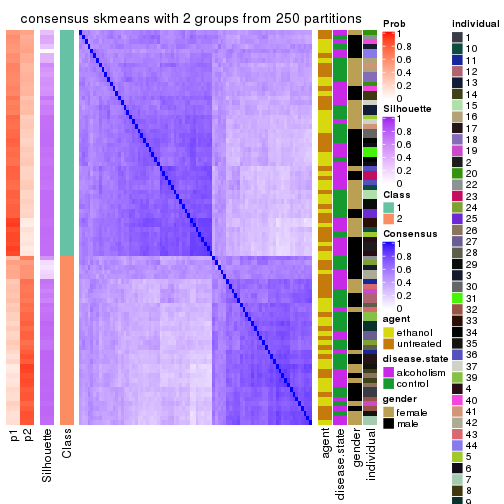</p>

</div>
<div id='tab-MAD-skmeans-consensus-heatmap-2'>
<pre><code class="r">consensus_heatmap(res, k = 3)
</code></pre>

<p></p>

</div>
<div id='tab-MAD-skmeans-consensus-heatmap-3'>
<pre><code class="r">consensus_heatmap(res, k = 4)
</code></pre>

<p></p>

</div>
<div id='tab-MAD-skmeans-consensus-heatmap-4'>
<pre><code class="r">consensus_heatmap(res, k = 5)
</code></pre>

<p></p>

</div>
<div id='tab-MAD-skmeans-consensus-heatmap-5'>
<pre><code class="r">consensus_heatmap(res, k = 6)
</code></pre>

<p></p>

</div>
</div>

Heatmaps for the membership of samples in all partitions to see how consistent they are:


<script>
$( function() {
	$( '#tabs-MAD-skmeans-membership-heatmap' ).tabs();
} );
</script>
<div id='tabs-MAD-skmeans-membership-heatmap'>
<ul>
<li><a href='#tab-MAD-skmeans-membership-heatmap-1'>k = 2</a></li>
<li><a href='#tab-MAD-skmeans-membership-heatmap-2'>k = 3</a></li>
<li><a href='#tab-MAD-skmeans-membership-heatmap-3'>k = 4</a></li>
<li><a href='#tab-MAD-skmeans-membership-heatmap-4'>k = 5</a></li>
<li><a href='#tab-MAD-skmeans-membership-heatmap-5'>k = 6</a></li>
</ul>
<div id='tab-MAD-skmeans-membership-heatmap-1'>
<pre><code class="r">membership_heatmap(res, k = 2)
</code></pre>

<p></p>

</div>
<div id='tab-MAD-skmeans-membership-heatmap-2'>
<pre><code class="r">membership_heatmap(res, k = 3)
</code></pre>

<p></p>

</div>
<div id='tab-MAD-skmeans-membership-heatmap-3'>
<pre><code class="r">membership_heatmap(res, k = 4)
</code></pre>

<p></p>

</div>
<div id='tab-MAD-skmeans-membership-heatmap-4'>
<pre><code class="r">membership_heatmap(res, k = 5)
</code></pre>

<p></p>

</div>
<div id='tab-MAD-skmeans-membership-heatmap-5'>
<pre><code class="r">membership_heatmap(res, k = 6)
</code></pre>

<p></p>

</div>
</div>

As soon as we have had the classes for columns, we can look for signatures
which are significantly different between classes which can be candidate marks
for certain classes. Following are the heatmaps for signatures.


Signature heatmaps where rows are scaled:


<script>
$( function() {
	$( '#tabs-MAD-skmeans-get-signatures' ).tabs();
} );
</script>
<div id='tabs-MAD-skmeans-get-signatures'>
<ul>
<li><a href='#tab-MAD-skmeans-get-signatures-1'>k = 2</a></li>
<li><a href='#tab-MAD-skmeans-get-signatures-2'>k = 3</a></li>
<li><a href='#tab-MAD-skmeans-get-signatures-3'>k = 4</a></li>
<li><a href='#tab-MAD-skmeans-get-signatures-4'>k = 5</a></li>
<li><a href='#tab-MAD-skmeans-get-signatures-5'>k = 6</a></li>
</ul>
<div id='tab-MAD-skmeans-get-signatures-1'>
<pre><code class="r">get_signatures(res, k = 2)
</code></pre>

<p></p>

</div>
<div id='tab-MAD-skmeans-get-signatures-2'>
<pre><code class="r">get_signatures(res, k = 3)
</code></pre>

<p></p>

</div>
<div id='tab-MAD-skmeans-get-signatures-3'>
<pre><code class="r">get_signatures(res, k = 4)
</code></pre>

<p></p>

</div>
<div id='tab-MAD-skmeans-get-signatures-4'>
<pre><code class="r">get_signatures(res, k = 5)
</code></pre>

<p></p>

</div>
<div id='tab-MAD-skmeans-get-signatures-5'>
<pre><code class="r">get_signatures(res, k = 6)
</code></pre>

<p></p>

</div>
</div>


Signature heatmaps where rows are not scaled:


<script>
$( function() {
	$( '#tabs-MAD-skmeans-get-signatures-no-scale' ).tabs();
} );
</script>
<div id='tabs-MAD-skmeans-get-signatures-no-scale'>
<ul>
<li><a href='#tab-MAD-skmeans-get-signatures-no-scale-1'>k = 2</a></li>
<li><a href='#tab-MAD-skmeans-get-signatures-no-scale-2'>k = 3</a></li>
<li><a href='#tab-MAD-skmeans-get-signatures-no-scale-3'>k = 4</a></li>
<li><a href='#tab-MAD-skmeans-get-signatures-no-scale-4'>k = 5</a></li>
<li><a href='#tab-MAD-skmeans-get-signatures-no-scale-5'>k = 6</a></li>
</ul>
<div id='tab-MAD-skmeans-get-signatures-no-scale-1'>
<pre><code class="r">get_signatures(res, k = 2, scale_rows = FALSE)
</code></pre>

<p></p>

</div>
<div id='tab-MAD-skmeans-get-signatures-no-scale-2'>
<pre><code class="r">get_signatures(res, k = 3, scale_rows = FALSE)
</code></pre>

<p></p>

</div>
<div id='tab-MAD-skmeans-get-signatures-no-scale-3'>
<pre><code class="r">get_signatures(res, k = 4, scale_rows = FALSE)
</code></pre>

<p></p>

</div>
<div id='tab-MAD-skmeans-get-signatures-no-scale-4'>
<pre><code class="r">get_signatures(res, k = 5, scale_rows = FALSE)
</code></pre>

<p></p>

</div>
<div id='tab-MAD-skmeans-get-signatures-no-scale-5'>
<pre><code class="r">get_signatures(res, k = 6, scale_rows = FALSE)
</code></pre>

<p></p>

</div>
</div>


Compare the overlap of signatures from different k:

```r
compare_signatures(res)
```


`get_signature()` returns a data frame invisibly. TO get the list of signatures, the function
call should be assigned to a variable explicitly. In following code, if `plot` argument is set
to `FALSE`, no heatmap is plotted while only the differential analysis is performed.

```r
# code only for demonstration
tb = get_signature(res, k = ..., plot = FALSE)
```

An example of the output of `tb` is:

```
#>   which_row         fdr    mean_1    mean_2 scaled_mean_1 scaled_mean_2 km
#> 1        38 0.042760348  8.373488  9.131774    -0.5533452     0.5164555  1
#> 2        40 0.018707592  7.106213  8.469186    -0.6173731     0.5762149  1
#> 3        55 0.019134737 10.221463 11.207825    -0.6159697     0.5749050  1
#> 4        59 0.006059896  5.921854  7.869574    -0.6899429     0.6439467  1
#> 5        60 0.018055526  8.928898 10.211722    -0.6204761     0.5791110  1
#> 6        98 0.009384629 15.714769 14.887706     0.6635654    -0.6193277  2
...
```

The columns in `tb` are:

1. `which_row`: row indices corresponding to the input matrix.
2. `fdr`: FDR for the differential test. 
3. `mean_x`: The mean value in group x.
4. `scaled_mean_x`: The mean value in group x after rows are scaled.
5. `km`: Row groups if k-means clustering is applied to rows.


UMAP plot which shows how samples are separated.


<script>
$( function() {
	$( '#tabs-MAD-skmeans-dimension-reduction' ).tabs();
} );
</script>
<div id='tabs-MAD-skmeans-dimension-reduction'>
<ul>
<li><a href='#tab-MAD-skmeans-dimension-reduction-1'>k = 2</a></li>
<li><a href='#tab-MAD-skmeans-dimension-reduction-2'>k = 3</a></li>
<li><a href='#tab-MAD-skmeans-dimension-reduction-3'>k = 4</a></li>
<li><a href='#tab-MAD-skmeans-dimension-reduction-4'>k = 5</a></li>
<li><a href='#tab-MAD-skmeans-dimension-reduction-5'>k = 6</a></li>
</ul>
<div id='tab-MAD-skmeans-dimension-reduction-1'>
<pre><code class="r">dimension_reduction(res, k = 2, method = &quot;UMAP&quot;)
</code></pre>

<p></p>

</div>
<div id='tab-MAD-skmeans-dimension-reduction-2'>
<pre><code class="r">dimension_reduction(res, k = 3, method = &quot;UMAP&quot;)
</code></pre>

<p></p>

</div>
<div id='tab-MAD-skmeans-dimension-reduction-3'>
<pre><code class="r">dimension_reduction(res, k = 4, method = &quot;UMAP&quot;)
</code></pre>

<p></p>

</div>
<div id='tab-MAD-skmeans-dimension-reduction-4'>
<pre><code class="r">dimension_reduction(res, k = 5, method = &quot;UMAP&quot;)
</code></pre>

<p></p>

</div>
<div id='tab-MAD-skmeans-dimension-reduction-5'>
<pre><code class="r">dimension_reduction(res, k = 6, method = &quot;UMAP&quot;)
</code></pre>

<p>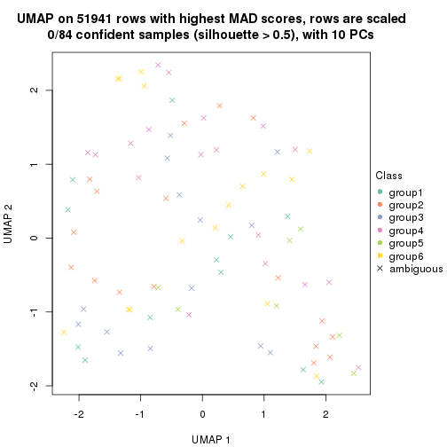</p>

</div>
</div>


Following heatmap shows how subgroups are split when increasing `k`:

```r
collect_classes(res)
```


Test correlation between subgroups and known annotations. If the known
annotation is numeric, one-way ANOVA test is applied, and if the known
annotation is discrete, chi-squared contingency table test is applied.

```r
test_to_known_factors(res)
```

```
#>              n agent(p) disease.state(p) gender(p) individual(p) k
#> MAD:skmeans 72    0.979            0.477     0.302      0.000714 2
#> MAD:skmeans 12       NA               NA        NA            NA 3
#> MAD:skmeans  0       NA               NA        NA            NA 4
#> MAD:skmeans  0       NA               NA        NA            NA 5
#> MAD:skmeans  0       NA               NA        NA            NA 6
```


If matrix rows can be associated to genes, consider to use `GO_Enrichment(res,
...)` to perform function enrichment for the signature genes.


 

---------------------------------------------------


### MAD:pam


The object with results only for a single top-value method and a single partition method 
can be extracted as:

```r
res = res_list["MAD", "pam"]
# you can also extract it by
# res = res_list["MAD:pam"]
```

A summary of `res` and all the functions that can be applied to it:

```r
res
```

```
#> A 'ConsensusPartition' object with k = 2, 3, 4, 5, 6.
#>   On a matrix with 51941 rows and 84 columns.
#>   Top rows (1000, 2000, 3000, 4000, 5000) are extracted by 'MAD' method.
#>   Subgroups are detected by 'pam' method.
#>   Performed in total 1250 partitions by row resampling.
#>   Best k for subgroups seems to be 2.
#> 
#> Following methods can be applied to this 'ConsensusPartition' object:
#>  [1] "cola_report"             "collect_classes"         "collect_plots"          
#>  [4] "collect_stats"           "colnames"                "compare_signatures"     
#>  [7] "consensus_heatmap"       "dimension_reduction"     "functional_enrichment"  
#> [10] "get_anno_col"            "get_anno"                "get_classes"            
#> [13] "get_consensus"           "get_matrix"              "get_membership"         
#> [16] "get_param"               "get_signatures"          "get_stats"              
#> [19] "is_best_k"               "is_stable_k"             "membership_heatmap"     
#> [22] "ncol"                    "nrow"                    "plot_ecdf"              
#> [25] "rownames"                "select_partition_number" "show"                   
#> [28] "suggest_best_k"          "test_to_known_factors"
```

`collect_plots()` function collects all the plots made from `res` for all `k` (number of partitions)
into one single page to provide an easy and fast comparison between different `k`.

```r
collect_plots(res)
```


The plots are:

- The first row: a plot of the ECDF (Empirical cumulative distribution
  function) curves of the consensus matrix for each `k` and the heatmap of
  predicted classes for each `k`.
- The second row: heatmaps of the consensus matrix for each `k`.
- The third row: heatmaps of the membership matrix for each `k`.
- The fouth row: heatmaps of the signatures for each `k`.

All the plots in panels can be made by individual functions and they are
plotted later in this section.

`select_partition_number()` produces several plots showing different
statistics for choosing "optimized" `k`. There are following statistics:

- ECDF curves of the consensus matrix for each `k`;
- 1-PAC. [The PAC
  score](https://en.wikipedia.org/wiki/Consensus_clustering#Over-interpretation_potential_of_consensus_clustering)
  measures the proportion of the ambiguous subgrouping.
- Mean silhouette score.
- Concordance. The mean probability of fiting the consensus class ids in all
  partitions.
- Area increased. Denote $A_k$ as the area under the ECDF curve for current
  `k`, the area increased is defined as $A_k - A_{k-1}$.
- Rand index. The percent of pairs of samples that are both in a same cluster
  or both are not in a same cluster in the partition of k and k-1.
- Jaccard index. The ratio of pairs of samples are both in a same cluster in
  the partition of k and k-1 and the pairs of samples are both in a same
  cluster in the partition k or k-1.

The detailed explanations of these statistics can be found in [the cola
vignette](http://bioconductor.org/packages/devel/bioc/vignettes/cola/inst/doc/cola.html#toc_13).

Generally speaking, lower PAC score, higher mean silhouette score or higher
concordance corresponds to better partition. Rand index and Jaccard index
measure how similar the current partition is compared to partition with `k-1`.
If they are too similar, we won't accept `k` is better than `k-1`.

```r
select_partition_number(res)
```


The numeric values for all these statistics can be obtained by `get_stats()`.

```r
get_stats(res)
```

```
#>   k  1-PAC mean_silhouette concordance area_increased  Rand Jaccard
#> 2 2 0.0136           0.399       0.700         0.4552 0.587   0.587
#> 3 3 0.0441           0.419       0.650         0.3633 0.672   0.491
#> 4 4 0.0970           0.320       0.579         0.1232 0.888   0.728
#> 5 5 0.1694           0.299       0.553         0.0655 0.947   0.847
#> 6 6 0.2486           0.304       0.541         0.0400 0.933   0.790
```

`suggest_best_k()` suggests the best $k$ based on these statistics. The rules are as follows:

- All $k$ with Jaccard index larger than 0.95 are removed because the increase of
  the partition number does not provides enough extra information. If all $k$ are removed,
  the best $k$ is assigned by `NA`.
- For $k$ with 1-PAC larger than 0.9, the maximal $k$ is taken as the "best k". Other $k$ is called "optional k".
- If it does not fit the second rule. The $k$ with the highest vote of highest
  1-PAC, mean silhouette and concordance is taken as the "best k".

```r
suggest_best_k(res)
```

```
#> [1] 2
```


Following shows the table of the partitions (You need to click the **show/hide
code output** link to see it). The membership matrix (columns with name `p*`)
is inferred by
[`clue::cl_consensus()`](https://www.rdocumentation.org/link/cl_consensus?package=clue)
function with the `SE` method. Basically the value in the membership matrix
represents the probability to belong to a certain group. The finall class
label for an item is determined with the group with highest probability it
belongs to.

In `get_classes()` function, the entropy is calculated from the membership
matrix and the silhouette score is calculated from the consensus matrix.


<script>
$( function() {
	$( '#tabs-MAD-pam-get-classes' ).tabs();
} );
</script>
<div id='tabs-MAD-pam-get-classes'>
<ul>
<li><a href='#tab-MAD-pam-get-classes-1'>k = 2</a></li>
<li><a href='#tab-MAD-pam-get-classes-2'>k = 3</a></li>
<li><a href='#tab-MAD-pam-get-classes-3'>k = 4</a></li>
<li><a href='#tab-MAD-pam-get-classes-4'>k = 5</a></li>
<li><a href='#tab-MAD-pam-get-classes-5'>k = 6</a></li>
</ul>

<div id='tab-MAD-pam-get-classes-1'>
<p><a id='tab-MAD-pam-get-classes-1-a' style='color:#0366d6' href='#'>show/hide code output</a></p>
<pre><code class="r">cbind(get_classes(res, k = 2), get_membership(res, k = 2))
</code></pre>

<pre><code>#&gt;            class entropy silhouette    p1    p2
#&gt; GSM1269647     1   0.781     0.5635 0.768 0.232
#&gt; GSM1269655     2   0.722     0.5438 0.200 0.800
#&gt; GSM1269663     2   0.992     0.3328 0.448 0.552
#&gt; GSM1269671     1   0.634     0.5955 0.840 0.160
#&gt; GSM1269679     1   1.000     0.0115 0.500 0.500
#&gt; GSM1269693     2   0.456     0.5300 0.096 0.904
#&gt; GSM1269701     2   1.000    -0.0337 0.488 0.512
#&gt; GSM1269709     1   0.552     0.6182 0.872 0.128
#&gt; GSM1269715     2   0.855     0.5274 0.280 0.720
#&gt; GSM1269717     2   0.991     0.2784 0.444 0.556
#&gt; GSM1269721     2   0.644     0.5641 0.164 0.836
#&gt; GSM1269723     2   0.999     0.0757 0.480 0.520
#&gt; GSM1269645     1   0.552     0.6224 0.872 0.128
#&gt; GSM1269653     1   1.000    -0.2645 0.504 0.496
#&gt; GSM1269661     1   1.000    -0.2671 0.512 0.488
#&gt; GSM1269669     2   0.917     0.4465 0.332 0.668
#&gt; GSM1269677     1   0.552     0.6149 0.872 0.128
#&gt; GSM1269685     1   0.706     0.5624 0.808 0.192
#&gt; GSM1269691     2   0.973     0.3984 0.404 0.596
#&gt; GSM1269699     1   0.653     0.5924 0.832 0.168
#&gt; GSM1269707     1   0.260     0.6196 0.956 0.044
#&gt; GSM1269651     2   0.913     0.4694 0.328 0.672
#&gt; GSM1269659     1   0.388     0.6220 0.924 0.076
#&gt; GSM1269667     1   0.939     0.3585 0.644 0.356
#&gt; GSM1269675     1   0.753     0.5749 0.784 0.216
#&gt; GSM1269683     2   0.913     0.5147 0.328 0.672
#&gt; GSM1269689     2   0.966     0.3049 0.392 0.608
#&gt; GSM1269697     2   1.000    -0.0176 0.496 0.504
#&gt; GSM1269705     1   1.000    -0.0924 0.512 0.488
#&gt; GSM1269713     1   1.000     0.0752 0.508 0.492
#&gt; GSM1269719     1   0.714     0.5932 0.804 0.196
#&gt; GSM1269725     1   0.917     0.4033 0.668 0.332
#&gt; GSM1269727     2   0.990     0.1448 0.440 0.560
#&gt; GSM1269649     1   0.943     0.2673 0.640 0.360
#&gt; GSM1269657     1   0.456     0.6218 0.904 0.096
#&gt; GSM1269665     1   0.788     0.4727 0.764 0.236
#&gt; GSM1269673     1   0.983     0.0295 0.576 0.424
#&gt; GSM1269681     1   0.866     0.5139 0.712 0.288
#&gt; GSM1269687     1   0.416     0.6209 0.916 0.084
#&gt; GSM1269695     1   0.242     0.6215 0.960 0.040
#&gt; GSM1269703     1   0.242     0.6149 0.960 0.040
#&gt; GSM1269711     1   0.988     0.0264 0.564 0.436
#&gt; GSM1269646     2   0.936     0.4743 0.352 0.648
#&gt; GSM1269654     1   0.995     0.0860 0.540 0.460
#&gt; GSM1269662     1   0.738     0.5195 0.792 0.208
#&gt; GSM1269670     1   0.605     0.6097 0.852 0.148
#&gt; GSM1269678     2   0.917     0.4638 0.332 0.668
#&gt; GSM1269692     1   0.909     0.4158 0.676 0.324
#&gt; GSM1269700     2   0.891     0.4386 0.308 0.692
#&gt; GSM1269708     1   0.745     0.5807 0.788 0.212
#&gt; GSM1269714     1   0.552     0.6153 0.872 0.128
#&gt; GSM1269716     2   0.855     0.5408 0.280 0.720
#&gt; GSM1269720     1   0.943     0.3271 0.640 0.360
#&gt; GSM1269722     2   0.625     0.5593 0.156 0.844
#&gt; GSM1269644     1   0.994    -0.2056 0.544 0.456
#&gt; GSM1269652     1   0.625     0.6167 0.844 0.156
#&gt; GSM1269660     1   0.781     0.5207 0.768 0.232
#&gt; GSM1269668     1   1.000    -0.1385 0.508 0.492
#&gt; GSM1269676     1   0.993    -0.0883 0.548 0.452
#&gt; GSM1269684     1   0.653     0.6020 0.832 0.168
#&gt; GSM1269690     2   0.997     0.2731 0.468 0.532
#&gt; GSM1269698     1   0.969     0.2227 0.604 0.396
#&gt; GSM1269706     1   0.714     0.4763 0.804 0.196
#&gt; GSM1269650     1   0.993     0.0605 0.548 0.452
#&gt; GSM1269658     1   0.900     0.4039 0.684 0.316
#&gt; GSM1269666     2   0.808     0.5447 0.248 0.752
#&gt; GSM1269674     2   0.978     0.4117 0.412 0.588
#&gt; GSM1269682     1   0.671     0.6141 0.824 0.176
#&gt; GSM1269688     1   0.921     0.4175 0.664 0.336
#&gt; GSM1269696     1   0.949     0.2501 0.632 0.368
#&gt; GSM1269704     1   0.738     0.5875 0.792 0.208
#&gt; GSM1269712     1   0.388     0.6183 0.924 0.076
#&gt; GSM1269718     1   0.999     0.0544 0.516 0.484
#&gt; GSM1269724     1   0.871     0.4797 0.708 0.292
#&gt; GSM1269726     2   0.775     0.5756 0.228 0.772
#&gt; GSM1269648     1   0.416     0.6231 0.916 0.084
#&gt; GSM1269656     1   0.388     0.6215 0.924 0.076
#&gt; GSM1269664     1   0.781     0.5725 0.768 0.232
#&gt; GSM1269672     1   0.973     0.0544 0.596 0.404
#&gt; GSM1269680     1   0.311     0.6165 0.944 0.056
#&gt; GSM1269686     1   0.311     0.6175 0.944 0.056
#&gt; GSM1269694     1   0.563     0.6114 0.868 0.132
#&gt; GSM1269702     1   0.141     0.6102 0.980 0.020
#&gt; GSM1269710     1   0.605     0.5810 0.852 0.148
</code></pre>

<script>
$('#tab-MAD-pam-get-classes-1-a').parent().next().next().hide();
$('#tab-MAD-pam-get-classes-1-a').click(function(){
  $('#tab-MAD-pam-get-classes-1-a').parent().next().next().toggle();
  return(false);
});
</script>
</div>

<div id='tab-MAD-pam-get-classes-2'>
<p><a id='tab-MAD-pam-get-classes-2-a' style='color:#0366d6' href='#'>show/hide code output</a></p>
<pre><code class="r">cbind(get_classes(res, k = 3), get_membership(res, k = 3))
</code></pre>

<pre><code>#&gt;            class entropy silhouette    p1    p2    p3
#&gt; GSM1269647     1   0.818     0.3703 0.592 0.096 0.312
#&gt; GSM1269655     2   0.708     0.4082 0.060 0.684 0.256
#&gt; GSM1269663     2   0.993    -0.0326 0.284 0.384 0.332
#&gt; GSM1269671     1   0.723     0.4425 0.640 0.048 0.312
#&gt; GSM1269679     3   0.970     0.2786 0.360 0.220 0.420
#&gt; GSM1269693     2   0.493     0.4525 0.024 0.820 0.156
#&gt; GSM1269701     3   0.981     0.3469 0.284 0.284 0.432
#&gt; GSM1269709     1   0.520     0.6424 0.820 0.044 0.136
#&gt; GSM1269715     2   0.808     0.4240 0.148 0.648 0.204
#&gt; GSM1269717     2   0.704     0.4703 0.252 0.688 0.060
#&gt; GSM1269721     2   0.628     0.4337 0.064 0.760 0.176
#&gt; GSM1269723     3   0.671     0.5195 0.176 0.084 0.740
#&gt; GSM1269645     1   0.621     0.6120 0.776 0.088 0.136
#&gt; GSM1269653     2   1.000     0.0385 0.328 0.344 0.328
#&gt; GSM1269661     3   0.894     0.3724 0.328 0.144 0.528
#&gt; GSM1269669     2   0.684     0.4489 0.076 0.724 0.200
#&gt; GSM1269677     1   0.454     0.6574 0.836 0.148 0.016
#&gt; GSM1269685     1   0.626     0.5863 0.724 0.244 0.032
#&gt; GSM1269691     2   0.571     0.5171 0.204 0.768 0.028
#&gt; GSM1269699     1   0.655     0.5940 0.756 0.096 0.148
#&gt; GSM1269707     1   0.321     0.6546 0.912 0.028 0.060
#&gt; GSM1269651     2   0.952    -0.0217 0.188 0.424 0.388
#&gt; GSM1269659     1   0.437     0.6581 0.868 0.056 0.076
#&gt; GSM1269667     3   0.857     0.1874 0.428 0.096 0.476
#&gt; GSM1269675     1   0.759     0.3734 0.640 0.072 0.288
#&gt; GSM1269683     2   0.931     0.0774 0.168 0.468 0.364
#&gt; GSM1269689     3   0.880     0.3751 0.276 0.156 0.568
#&gt; GSM1269697     3   0.928     0.3967 0.212 0.264 0.524
#&gt; GSM1269705     1   0.993    -0.1832 0.388 0.328 0.284
#&gt; GSM1269713     3   0.975     0.2280 0.364 0.228 0.408
#&gt; GSM1269719     1   0.715     0.5939 0.720 0.124 0.156
#&gt; GSM1269725     3   0.828     0.4042 0.344 0.092 0.564
#&gt; GSM1269727     3   0.670     0.4866 0.108 0.144 0.748
#&gt; GSM1269649     1   0.930     0.2170 0.500 0.316 0.184
#&gt; GSM1269657     1   0.377     0.6595 0.880 0.104 0.016
#&gt; GSM1269665     1   0.599     0.4390 0.688 0.304 0.008
#&gt; GSM1269673     2   0.721     0.4476 0.360 0.604 0.036
#&gt; GSM1269681     1   0.905     0.3072 0.556 0.216 0.228
#&gt; GSM1269687     1   0.560     0.6423 0.800 0.052 0.148
#&gt; GSM1269695     1   0.429     0.6525 0.864 0.032 0.104
#&gt; GSM1269703     1   0.178     0.6531 0.960 0.020 0.020
#&gt; GSM1269711     1   0.967     0.1213 0.456 0.304 0.240
#&gt; GSM1269646     3   0.823     0.4170 0.144 0.224 0.632
#&gt; GSM1269654     2   0.882     0.2566 0.336 0.532 0.132
#&gt; GSM1269662     1   0.729     0.0583 0.560 0.032 0.408
#&gt; GSM1269670     1   0.608     0.6321 0.784 0.128 0.088
#&gt; GSM1269678     3   0.799     0.3841 0.144 0.200 0.656
#&gt; GSM1269692     1   0.844     0.2711 0.568 0.324 0.108
#&gt; GSM1269700     3   0.485     0.4176 0.036 0.128 0.836
#&gt; GSM1269708     1   0.739     0.6028 0.704 0.156 0.140
#&gt; GSM1269714     1   0.676     0.6199 0.736 0.084 0.180
#&gt; GSM1269716     2   0.734     0.5111 0.152 0.708 0.140
#&gt; GSM1269720     3   0.887     0.4312 0.380 0.124 0.496
#&gt; GSM1269722     3   0.709     0.3652 0.056 0.268 0.676
#&gt; GSM1269644     2   0.743     0.4873 0.328 0.620 0.052
#&gt; GSM1269652     1   0.651     0.6336 0.760 0.104 0.136
#&gt; GSM1269660     1   0.714     0.0452 0.576 0.028 0.396
#&gt; GSM1269668     2   0.997     0.1641 0.328 0.368 0.304
#&gt; GSM1269676     2   0.623     0.4838 0.316 0.672 0.012
#&gt; GSM1269684     1   0.706     0.5424 0.708 0.080 0.212
#&gt; GSM1269690     2   0.541     0.5195 0.212 0.772 0.016
#&gt; GSM1269698     3   0.866     0.2886 0.408 0.104 0.488
#&gt; GSM1269706     1   0.662     0.3775 0.684 0.284 0.032
#&gt; GSM1269650     2   0.805     0.3367 0.356 0.568 0.076
#&gt; GSM1269658     1   0.902     0.1775 0.560 0.216 0.224
#&gt; GSM1269666     3   0.745     0.3801 0.080 0.252 0.668
#&gt; GSM1269674     2   0.942     0.2596 0.228 0.504 0.268
#&gt; GSM1269682     1   0.687     0.5874 0.736 0.104 0.160
#&gt; GSM1269688     1   0.879     0.4218 0.584 0.224 0.192
#&gt; GSM1269696     3   0.550     0.5299 0.248 0.008 0.744
#&gt; GSM1269704     1   0.691     0.5901 0.728 0.092 0.180
#&gt; GSM1269712     1   0.438     0.6604 0.868 0.060 0.072
#&gt; GSM1269718     3   0.989     0.3026 0.336 0.268 0.396
#&gt; GSM1269724     1   0.887     0.2075 0.496 0.124 0.380
#&gt; GSM1269726     2   0.852    -0.0842 0.092 0.464 0.444
#&gt; GSM1269648     1   0.573     0.6154 0.796 0.060 0.144
#&gt; GSM1269656     1   0.255     0.6584 0.936 0.040 0.024
#&gt; GSM1269664     1   0.787     0.5508 0.660 0.216 0.124
#&gt; GSM1269672     2   0.791     0.3411 0.404 0.536 0.060
#&gt; GSM1269680     1   0.243     0.6491 0.940 0.036 0.024
#&gt; GSM1269686     1   0.426     0.6480 0.868 0.036 0.096
#&gt; GSM1269694     1   0.621     0.6406 0.776 0.136 0.088
#&gt; GSM1269702     1   0.127     0.6446 0.972 0.024 0.004
#&gt; GSM1269710     1   0.617     0.6210 0.768 0.168 0.064
</code></pre>

<script>
$('#tab-MAD-pam-get-classes-2-a').parent().next().next().hide();
$('#tab-MAD-pam-get-classes-2-a').click(function(){
  $('#tab-MAD-pam-get-classes-2-a').parent().next().next().toggle();
  return(false);
});
</script>
</div>

<div id='tab-MAD-pam-get-classes-3'>
<p><a id='tab-MAD-pam-get-classes-3-a' style='color:#0366d6' href='#'>show/hide code output</a></p>
<pre><code class="r">cbind(get_classes(res, k = 4), get_membership(res, k = 4))
</code></pre>

<pre><code>#&gt;            class entropy silhouette    p1    p2    p3    p4
#&gt; GSM1269647     1   0.867     0.2331 0.488 0.076 0.260 0.176
#&gt; GSM1269655     2   0.780     0.1434 0.032 0.504 0.124 0.340
#&gt; GSM1269663     2   0.960    -0.0831 0.244 0.352 0.276 0.128
#&gt; GSM1269671     1   0.768     0.4560 0.592 0.048 0.220 0.140
#&gt; GSM1269679     1   0.969    -0.3317 0.304 0.132 0.280 0.284
#&gt; GSM1269693     2   0.463     0.4410 0.012 0.804 0.140 0.044
#&gt; GSM1269701     4   0.954     0.1292 0.228 0.124 0.288 0.360
#&gt; GSM1269709     1   0.589     0.5423 0.716 0.008 0.104 0.172
#&gt; GSM1269715     2   0.801     0.1662 0.132 0.468 0.036 0.364
#&gt; GSM1269717     2   0.755     0.3296 0.188 0.612 0.048 0.152
#&gt; GSM1269721     2   0.496     0.3976 0.032 0.796 0.132 0.040
#&gt; GSM1269723     3   0.548     0.4143 0.160 0.040 0.760 0.040
#&gt; GSM1269645     1   0.553     0.5187 0.724 0.032 0.024 0.220
#&gt; GSM1269653     4   0.998     0.1684 0.260 0.256 0.220 0.264
#&gt; GSM1269661     3   0.793     0.2997 0.324 0.120 0.512 0.044
#&gt; GSM1269669     2   0.725     0.2138 0.068 0.504 0.032 0.396
#&gt; GSM1269677     1   0.503     0.5796 0.784 0.152 0.036 0.028
#&gt; GSM1269685     1   0.643     0.5163 0.672 0.236 0.044 0.048
#&gt; GSM1269691     2   0.344     0.4875 0.152 0.840 0.004 0.004
#&gt; GSM1269699     1   0.736     0.4964 0.640 0.096 0.188 0.076
#&gt; GSM1269707     1   0.348     0.5919 0.884 0.032 0.052 0.032
#&gt; GSM1269651     4   0.937     0.1475 0.108 0.248 0.248 0.396
#&gt; GSM1269659     1   0.438     0.5933 0.840 0.072 0.056 0.032
#&gt; GSM1269667     1   0.846    -0.1325 0.400 0.024 0.300 0.276
#&gt; GSM1269675     1   0.754     0.3715 0.560 0.072 0.308 0.060
#&gt; GSM1269683     4   0.958     0.1384 0.116 0.276 0.284 0.324
#&gt; GSM1269689     4   0.890     0.1968 0.172 0.076 0.360 0.392
#&gt; GSM1269697     3   0.943     0.0265 0.144 0.204 0.420 0.232
#&gt; GSM1269705     3   0.982    -0.0629 0.292 0.256 0.292 0.160
#&gt; GSM1269713     4   0.927     0.2661 0.200 0.128 0.232 0.440
#&gt; GSM1269719     1   0.802     0.3400 0.548 0.080 0.096 0.276
#&gt; GSM1269725     3   0.858     0.2004 0.272 0.044 0.452 0.232
#&gt; GSM1269727     3   0.642     0.3555 0.072 0.060 0.712 0.156
#&gt; GSM1269649     1   0.961    -0.0678 0.388 0.236 0.160 0.216
#&gt; GSM1269657     1   0.414     0.5914 0.848 0.088 0.028 0.036
#&gt; GSM1269665     1   0.575     0.4332 0.652 0.308 0.024 0.016
#&gt; GSM1269673     2   0.658     0.3535 0.332 0.580 0.004 0.084
#&gt; GSM1269681     1   0.929    -0.0381 0.372 0.088 0.260 0.280
#&gt; GSM1269687     1   0.644     0.4168 0.620 0.012 0.068 0.300
#&gt; GSM1269695     1   0.547     0.5711 0.780 0.044 0.088 0.088
#&gt; GSM1269703     1   0.199     0.5853 0.944 0.024 0.020 0.012
#&gt; GSM1269711     1   0.924    -0.1768 0.364 0.208 0.092 0.336
#&gt; GSM1269646     3   0.840     0.3127 0.116 0.156 0.560 0.168
#&gt; GSM1269654     2   0.907    -0.0921 0.236 0.368 0.068 0.328
#&gt; GSM1269662     1   0.768     0.1416 0.504 0.068 0.368 0.060
#&gt; GSM1269670     1   0.645     0.5505 0.720 0.100 0.112 0.068
#&gt; GSM1269678     3   0.855     0.2305 0.120 0.108 0.516 0.256
#&gt; GSM1269692     1   0.723     0.2930 0.524 0.360 0.100 0.016
#&gt; GSM1269700     3   0.503     0.2418 0.012 0.008 0.700 0.280
#&gt; GSM1269708     1   0.670     0.5477 0.688 0.136 0.136 0.040
#&gt; GSM1269714     1   0.676     0.4593 0.632 0.020 0.092 0.256
#&gt; GSM1269716     2   0.618     0.4707 0.104 0.740 0.076 0.080
#&gt; GSM1269720     3   0.826     0.2634 0.344 0.100 0.480 0.076
#&gt; GSM1269722     3   0.572     0.3556 0.028 0.256 0.692 0.024
#&gt; GSM1269644     2   0.682     0.4080 0.284 0.620 0.044 0.052
#&gt; GSM1269652     1   0.628     0.5781 0.732 0.072 0.084 0.112
#&gt; GSM1269660     1   0.731     0.1499 0.528 0.020 0.352 0.100
#&gt; GSM1269668     4   0.911     0.1260 0.236 0.260 0.084 0.420
#&gt; GSM1269676     2   0.604     0.4346 0.220 0.700 0.052 0.028
#&gt; GSM1269684     1   0.625     0.4756 0.692 0.024 0.076 0.208
#&gt; GSM1269690     2   0.390     0.4793 0.132 0.832 0.000 0.036
#&gt; GSM1269698     3   0.853     0.1796 0.296 0.088 0.492 0.124
#&gt; GSM1269706     1   0.587     0.3542 0.656 0.296 0.016 0.032
#&gt; GSM1269650     2   0.902     0.1100 0.248 0.468 0.116 0.168
#&gt; GSM1269658     1   0.760     0.2295 0.528 0.228 0.236 0.008
#&gt; GSM1269666     3   0.805     0.2147 0.048 0.160 0.544 0.248
#&gt; GSM1269674     2   0.932     0.0993 0.168 0.440 0.236 0.156
#&gt; GSM1269682     1   0.717     0.4963 0.656 0.056 0.160 0.128
#&gt; GSM1269688     1   0.883     0.2417 0.480 0.220 0.216 0.084
#&gt; GSM1269696     3   0.599     0.3891 0.188 0.008 0.704 0.100
#&gt; GSM1269704     1   0.694     0.5241 0.668 0.072 0.188 0.072
#&gt; GSM1269712     1   0.445     0.5893 0.812 0.036 0.012 0.140
#&gt; GSM1269718     4   0.968     0.2133 0.180 0.180 0.280 0.360
#&gt; GSM1269724     4   0.651     0.3152 0.228 0.012 0.104 0.656
#&gt; GSM1269726     3   0.798     0.1966 0.072 0.376 0.476 0.076
#&gt; GSM1269648     1   0.565     0.5178 0.736 0.024 0.052 0.188
#&gt; GSM1269656     1   0.347     0.5922 0.884 0.048 0.044 0.024
#&gt; GSM1269664     1   0.828     0.3473 0.532 0.196 0.056 0.216
#&gt; GSM1269672     2   0.699     0.2520 0.348 0.524 0.000 0.128
#&gt; GSM1269680     1   0.356     0.5885 0.880 0.024 0.044 0.052
#&gt; GSM1269686     1   0.554     0.4581 0.696 0.008 0.040 0.256
#&gt; GSM1269694     1   0.643     0.5548 0.704 0.136 0.128 0.032
#&gt; GSM1269702     1   0.125     0.5787 0.968 0.016 0.004 0.012
#&gt; GSM1269710     1   0.557     0.5524 0.752 0.168 0.040 0.040
</code></pre>

<script>
$('#tab-MAD-pam-get-classes-3-a').parent().next().next().hide();
$('#tab-MAD-pam-get-classes-3-a').click(function(){
  $('#tab-MAD-pam-get-classes-3-a').parent().next().next().toggle();
  return(false);
});
</script>
</div>

<div id='tab-MAD-pam-get-classes-4'>
<p><a id='tab-MAD-pam-get-classes-4-a' style='color:#0366d6' href='#'>show/hide code output</a></p>
<pre><code class="r">cbind(get_classes(res, k = 5), get_membership(res, k = 5))
</code></pre>

<pre><code>#&gt;            class entropy silhouette    p1    p2    p3    p4    p5
#&gt; GSM1269647     1  0.8520    0.02295 0.396 0.104 0.208 0.024 0.268
#&gt; GSM1269655     2  0.7729    0.15048 0.016 0.400 0.096 0.396 0.092
#&gt; GSM1269663     4  0.8606   -0.03628 0.220 0.156 0.284 0.332 0.008
#&gt; GSM1269671     1  0.7531    0.41266 0.556 0.096 0.232 0.036 0.080
#&gt; GSM1269679     1  0.9258   -0.16912 0.276 0.272 0.268 0.124 0.060
#&gt; GSM1269693     4  0.4063    0.43589 0.016 0.040 0.120 0.816 0.008
#&gt; GSM1269701     2  0.8492   -0.03059 0.188 0.416 0.272 0.088 0.036
#&gt; GSM1269709     1  0.5995    0.52559 0.688 0.168 0.092 0.020 0.032
#&gt; GSM1269715     2  0.7181   -0.08421 0.116 0.416 0.044 0.416 0.008
#&gt; GSM1269717     4  0.7660    0.13834 0.164 0.200 0.044 0.544 0.048
#&gt; GSM1269721     4  0.5202    0.36065 0.024 0.020 0.116 0.756 0.084
#&gt; GSM1269723     3  0.4871    0.46914 0.108 0.040 0.784 0.048 0.020
#&gt; GSM1269645     1  0.5824    0.49222 0.668 0.236 0.024 0.044 0.028
#&gt; GSM1269653     5  0.9843    0.09238 0.192 0.240 0.132 0.180 0.256
#&gt; GSM1269661     3  0.7013    0.34684 0.304 0.036 0.532 0.112 0.016
#&gt; GSM1269669     4  0.6603    0.02845 0.052 0.440 0.028 0.456 0.024
#&gt; GSM1269677     1  0.5976    0.49280 0.684 0.016 0.024 0.132 0.144
#&gt; GSM1269685     1  0.5657    0.51388 0.672 0.052 0.032 0.236 0.008
#&gt; GSM1269691     4  0.2674    0.47513 0.140 0.000 0.004 0.856 0.000
#&gt; GSM1269699     1  0.6992    0.37956 0.576 0.008 0.128 0.060 0.228
#&gt; GSM1269707     1  0.3572    0.56783 0.860 0.016 0.028 0.024 0.072
#&gt; GSM1269651     2  0.8960    0.17107 0.056 0.412 0.196 0.192 0.144
#&gt; GSM1269659     1  0.5227    0.57018 0.772 0.044 0.056 0.088 0.040
#&gt; GSM1269667     1  0.8279   -0.05426 0.340 0.248 0.332 0.052 0.028
#&gt; GSM1269675     1  0.7284    0.34068 0.524 0.036 0.308 0.044 0.088
#&gt; GSM1269683     2  0.9163    0.19270 0.096 0.348 0.264 0.212 0.080
#&gt; GSM1269689     5  0.8567    0.22133 0.080 0.280 0.220 0.036 0.384
#&gt; GSM1269697     3  0.9681   -0.07303 0.100 0.208 0.296 0.188 0.208
#&gt; GSM1269705     5  0.8958    0.20400 0.180 0.064 0.188 0.144 0.424
#&gt; GSM1269713     5  0.8744    0.17115 0.088 0.304 0.096 0.108 0.404
#&gt; GSM1269719     1  0.7827    0.24673 0.492 0.296 0.092 0.080 0.040
#&gt; GSM1269725     3  0.8671    0.20441 0.196 0.156 0.420 0.028 0.200
#&gt; GSM1269727     3  0.4992    0.44768 0.052 0.136 0.764 0.036 0.012
#&gt; GSM1269649     1  0.9319    0.01697 0.356 0.176 0.156 0.236 0.076
#&gt; GSM1269657     1  0.4953    0.54729 0.780 0.024 0.036 0.052 0.108
#&gt; GSM1269665     1  0.4977    0.41664 0.656 0.032 0.012 0.300 0.000
#&gt; GSM1269673     4  0.5888    0.33057 0.308 0.088 0.004 0.592 0.008
#&gt; GSM1269681     5  0.8718    0.00820 0.216 0.236 0.112 0.036 0.400
#&gt; GSM1269687     1  0.6176    0.42836 0.604 0.296 0.056 0.024 0.020
#&gt; GSM1269695     1  0.5878    0.53353 0.728 0.072 0.104 0.040 0.056
#&gt; GSM1269703     1  0.1278    0.56497 0.960 0.004 0.016 0.020 0.000
#&gt; GSM1269711     1  0.9189   -0.08142 0.324 0.316 0.084 0.164 0.112
#&gt; GSM1269646     3  0.8050    0.29288 0.064 0.112 0.540 0.100 0.184
#&gt; GSM1269654     2  0.8832    0.16796 0.184 0.368 0.056 0.300 0.092
#&gt; GSM1269662     1  0.7323    0.07850 0.428 0.036 0.416 0.080 0.040
#&gt; GSM1269670     1  0.7072    0.48776 0.640 0.056 0.100 0.080 0.124
#&gt; GSM1269678     3  0.8215    0.27031 0.092 0.260 0.488 0.092 0.068
#&gt; GSM1269692     1  0.6527    0.28306 0.500 0.008 0.124 0.360 0.008
#&gt; GSM1269700     3  0.6410    0.20929 0.004 0.244 0.556 0.004 0.192
#&gt; GSM1269708     1  0.6666    0.52532 0.660 0.064 0.112 0.132 0.032
#&gt; GSM1269714     1  0.6762    0.44209 0.576 0.280 0.088 0.028 0.028
#&gt; GSM1269716     4  0.5220    0.45381 0.096 0.096 0.052 0.752 0.004
#&gt; GSM1269720     3  0.7535    0.30468 0.300 0.088 0.500 0.096 0.016
#&gt; GSM1269722     3  0.4860    0.43270 0.032 0.020 0.720 0.224 0.004
#&gt; GSM1269644     4  0.6225    0.40123 0.280 0.040 0.040 0.616 0.024
#&gt; GSM1269652     1  0.6100    0.56102 0.712 0.104 0.068 0.080 0.036
#&gt; GSM1269660     1  0.6519    0.08171 0.480 0.088 0.404 0.020 0.008
#&gt; GSM1269668     2  0.8318    0.09767 0.180 0.456 0.084 0.244 0.036
#&gt; GSM1269676     4  0.6522    0.38830 0.160 0.020 0.020 0.624 0.176
#&gt; GSM1269684     1  0.6005    0.46180 0.656 0.220 0.084 0.032 0.008
#&gt; GSM1269690     4  0.3346    0.46507 0.108 0.036 0.008 0.848 0.000
#&gt; GSM1269698     3  0.7921    0.05745 0.220 0.020 0.416 0.044 0.300
#&gt; GSM1269706     1  0.6171    0.32386 0.600 0.020 0.012 0.292 0.076
#&gt; GSM1269650     4  0.9026   -0.01097 0.192 0.184 0.048 0.392 0.184
#&gt; GSM1269658     1  0.6908    0.26737 0.528 0.012 0.244 0.204 0.012
#&gt; GSM1269666     3  0.7139    0.20155 0.016 0.264 0.544 0.136 0.040
#&gt; GSM1269674     4  0.9256    0.00538 0.116 0.080 0.192 0.340 0.272
#&gt; GSM1269682     1  0.6950    0.46760 0.620 0.112 0.184 0.048 0.036
#&gt; GSM1269688     5  0.8786    0.21633 0.320 0.032 0.144 0.160 0.344
#&gt; GSM1269696     3  0.5615    0.44254 0.152 0.080 0.716 0.008 0.044
#&gt; GSM1269704     1  0.6755    0.46153 0.624 0.036 0.124 0.028 0.188
#&gt; GSM1269712     1  0.4593    0.57169 0.800 0.108 0.028 0.032 0.032
#&gt; GSM1269718     2  0.9221    0.10269 0.148 0.352 0.280 0.140 0.080
#&gt; GSM1269724     2  0.5792    0.04737 0.140 0.716 0.068 0.016 0.060
#&gt; GSM1269726     3  0.7132    0.25467 0.068 0.060 0.488 0.364 0.020
#&gt; GSM1269648     1  0.5159    0.52034 0.736 0.180 0.036 0.032 0.016
#&gt; GSM1269656     1  0.3883    0.56244 0.832 0.008 0.020 0.036 0.104
#&gt; GSM1269664     1  0.8435    0.31208 0.484 0.188 0.096 0.176 0.056
#&gt; GSM1269672     4  0.6204    0.24425 0.336 0.136 0.000 0.524 0.004
#&gt; GSM1269680     1  0.3462    0.56135 0.836 0.028 0.004 0.004 0.128
#&gt; GSM1269686     1  0.5479    0.46702 0.676 0.244 0.052 0.012 0.016
#&gt; GSM1269694     1  0.6405    0.51842 0.672 0.024 0.140 0.112 0.052
#&gt; GSM1269702     1  0.0613    0.55837 0.984 0.000 0.004 0.008 0.004
#&gt; GSM1269710     1  0.5616    0.52968 0.712 0.052 0.024 0.180 0.032
</code></pre>

<script>
$('#tab-MAD-pam-get-classes-4-a').parent().next().next().hide();
$('#tab-MAD-pam-get-classes-4-a').click(function(){
  $('#tab-MAD-pam-get-classes-4-a').parent().next().next().toggle();
  return(false);
});
</script>
</div>

<div id='tab-MAD-pam-get-classes-5'>
<p><a id='tab-MAD-pam-get-classes-5-a' style='color:#0366d6' href='#'>show/hide code output</a></p>
<pre><code class="r">cbind(get_classes(res, k = 6), get_membership(res, k = 6))
</code></pre>

<pre><code>#&gt;            class entropy silhouette    p1    p2    p3    p4    p5    p6
#&gt; GSM1269647     1   0.846   -0.11305 0.344 0.112 0.172 0.016 0.064 0.292
#&gt; GSM1269655     2   0.683    0.29988 0.020 0.532 0.056 0.260 0.124 0.008
#&gt; GSM1269663     4   0.804   -0.06917 0.204 0.024 0.288 0.348 0.128 0.008
#&gt; GSM1269671     1   0.790    0.36218 0.492 0.072 0.204 0.020 0.120 0.092
#&gt; GSM1269679     5   0.859    0.11631 0.244 0.068 0.244 0.096 0.328 0.020
#&gt; GSM1269693     4   0.278    0.50598 0.020 0.004 0.112 0.860 0.004 0.000
#&gt; GSM1269701     5   0.826    0.12642 0.168 0.132 0.252 0.036 0.392 0.020
#&gt; GSM1269709     1   0.588    0.51342 0.672 0.016 0.092 0.040 0.160 0.020
#&gt; GSM1269715     5   0.605    0.24858 0.104 0.004 0.032 0.368 0.492 0.000
#&gt; GSM1269717     4   0.663    0.05394 0.140 0.316 0.028 0.492 0.020 0.004
#&gt; GSM1269721     4   0.559    0.38800 0.016 0.104 0.092 0.700 0.004 0.084
#&gt; GSM1269723     3   0.379    0.44245 0.072 0.028 0.836 0.016 0.036 0.012
#&gt; GSM1269645     1   0.546    0.45458 0.652 0.036 0.024 0.024 0.252 0.012
#&gt; GSM1269653     5   0.932   -0.00862 0.136 0.068 0.092 0.168 0.316 0.220
#&gt; GSM1269661     3   0.634    0.34417 0.300 0.008 0.532 0.116 0.040 0.004
#&gt; GSM1269669     5   0.511    0.16303 0.044 0.012 0.004 0.412 0.528 0.000
#&gt; GSM1269677     1   0.703    0.35904 0.548 0.228 0.012 0.096 0.028 0.088
#&gt; GSM1269685     1   0.539    0.51578 0.668 0.032 0.024 0.232 0.036 0.008
#&gt; GSM1269691     4   0.275    0.53319 0.096 0.028 0.004 0.868 0.004 0.000
#&gt; GSM1269699     1   0.703    0.34589 0.532 0.032 0.096 0.048 0.024 0.268
#&gt; GSM1269707     1   0.363    0.57820 0.848 0.020 0.024 0.028 0.016 0.064
#&gt; GSM1269651     2   0.795    0.29164 0.040 0.480 0.140 0.084 0.216 0.040
#&gt; GSM1269659     1   0.505    0.57627 0.752 0.028 0.044 0.120 0.036 0.020
#&gt; GSM1269667     1   0.780   -0.18250 0.304 0.068 0.304 0.020 0.292 0.012
#&gt; GSM1269675     1   0.737    0.29668 0.480 0.088 0.288 0.016 0.028 0.100
#&gt; GSM1269683     2   0.786    0.32909 0.068 0.484 0.200 0.140 0.096 0.012
#&gt; GSM1269689     6   0.786    0.25617 0.056 0.036 0.152 0.040 0.268 0.448
#&gt; GSM1269697     3   0.971   -0.12815 0.104 0.200 0.248 0.156 0.100 0.192
#&gt; GSM1269705     6   0.812    0.17266 0.160 0.084 0.120 0.116 0.028 0.492
#&gt; GSM1269713     6   0.847    0.24787 0.064 0.152 0.080 0.048 0.240 0.416
#&gt; GSM1269719     1   0.715    0.22465 0.476 0.316 0.080 0.024 0.092 0.012
#&gt; GSM1269725     3   0.866    0.22158 0.204 0.140 0.388 0.020 0.088 0.160
#&gt; GSM1269727     3   0.442    0.41862 0.036 0.056 0.792 0.024 0.088 0.004
#&gt; GSM1269649     1   0.921   -0.06960 0.308 0.072 0.172 0.228 0.164 0.056
#&gt; GSM1269657     1   0.526    0.53207 0.716 0.156 0.012 0.028 0.020 0.068
#&gt; GSM1269665     1   0.562    0.43177 0.628 0.080 0.028 0.248 0.016 0.000
#&gt; GSM1269673     4   0.603    0.34141 0.276 0.072 0.004 0.580 0.064 0.004
#&gt; GSM1269681     2   0.746    0.13191 0.140 0.492 0.080 0.016 0.028 0.244
#&gt; GSM1269687     1   0.633    0.41277 0.608 0.072 0.060 0.028 0.224 0.008
#&gt; GSM1269695     1   0.701    0.47644 0.612 0.096 0.124 0.032 0.084 0.052
#&gt; GSM1269703     1   0.178    0.56694 0.936 0.008 0.024 0.024 0.008 0.000
#&gt; GSM1269711     5   0.890    0.09076 0.292 0.056 0.068 0.172 0.316 0.096
#&gt; GSM1269646     3   0.847    0.19505 0.052 0.088 0.452 0.088 0.120 0.200
#&gt; GSM1269654     2   0.678    0.31901 0.168 0.544 0.016 0.208 0.060 0.004
#&gt; GSM1269662     3   0.758   -0.00711 0.368 0.048 0.408 0.100 0.040 0.036
#&gt; GSM1269670     1   0.717    0.44087 0.556 0.164 0.104 0.004 0.048 0.124
#&gt; GSM1269678     3   0.729    0.08686 0.084 0.020 0.400 0.084 0.392 0.020
#&gt; GSM1269692     1   0.661    0.27962 0.484 0.056 0.112 0.336 0.008 0.004
#&gt; GSM1269700     3   0.684    0.09742 0.008 0.044 0.516 0.012 0.216 0.204
#&gt; GSM1269708     1   0.638    0.52144 0.640 0.024 0.112 0.148 0.056 0.020
#&gt; GSM1269714     1   0.671    0.38758 0.548 0.028 0.092 0.048 0.272 0.012
#&gt; GSM1269716     4   0.441    0.50075 0.076 0.012 0.056 0.784 0.072 0.000
#&gt; GSM1269720     3   0.758    0.32673 0.252 0.068 0.508 0.080 0.056 0.036
#&gt; GSM1269722     3   0.422    0.40465 0.028 0.016 0.748 0.196 0.012 0.000
#&gt; GSM1269644     4   0.585    0.39921 0.252 0.040 0.044 0.620 0.044 0.000
#&gt; GSM1269652     1   0.565    0.56327 0.712 0.012 0.076 0.084 0.088 0.028
#&gt; GSM1269660     1   0.636    0.05696 0.468 0.008 0.388 0.036 0.092 0.008
#&gt; GSM1269668     5   0.598    0.37495 0.144 0.012 0.036 0.196 0.612 0.000
#&gt; GSM1269676     4   0.724    0.22878 0.096 0.212 0.008 0.532 0.036 0.116
#&gt; GSM1269684     1   0.532    0.41858 0.640 0.004 0.068 0.024 0.260 0.004
#&gt; GSM1269690     4   0.262    0.51970 0.080 0.000 0.016 0.880 0.024 0.000
#&gt; GSM1269698     3   0.829    0.07737 0.188 0.060 0.356 0.056 0.032 0.308
#&gt; GSM1269706     1   0.585    0.30575 0.576 0.012 0.008 0.312 0.028 0.064
#&gt; GSM1269650     2   0.814    0.21567 0.116 0.428 0.008 0.248 0.104 0.096
#&gt; GSM1269658     1   0.672    0.22935 0.508 0.044 0.240 0.196 0.008 0.004
#&gt; GSM1269666     3   0.629    0.09926 0.016 0.356 0.512 0.040 0.068 0.008
#&gt; GSM1269674     2   0.971    0.01518 0.080 0.240 0.140 0.212 0.180 0.148
#&gt; GSM1269682     1   0.648    0.38713 0.568 0.028 0.164 0.036 0.204 0.000
#&gt; GSM1269688     6   0.760    0.25960 0.276 0.016 0.084 0.160 0.020 0.444
#&gt; GSM1269696     3   0.499    0.42917 0.136 0.016 0.736 0.004 0.072 0.036
#&gt; GSM1269704     1   0.643    0.46415 0.604 0.056 0.084 0.016 0.020 0.220
#&gt; GSM1269712     1   0.420    0.55569 0.756 0.032 0.016 0.012 0.184 0.000
#&gt; GSM1269718     2   0.900    0.15482 0.128 0.328 0.260 0.068 0.164 0.052
#&gt; GSM1269724     5   0.756    0.16738 0.132 0.200 0.052 0.024 0.524 0.068
#&gt; GSM1269726     3   0.662    0.24875 0.048 0.060 0.504 0.344 0.036 0.008
#&gt; GSM1269648     1   0.497    0.50394 0.708 0.012 0.060 0.016 0.196 0.008
#&gt; GSM1269656     1   0.380    0.57568 0.832 0.032 0.012 0.044 0.008 0.072
#&gt; GSM1269664     1   0.810    0.22525 0.440 0.072 0.072 0.140 0.252 0.024
#&gt; GSM1269672     4   0.553    0.14968 0.316 0.000 0.000 0.528 0.156 0.000
#&gt; GSM1269680     1   0.416    0.57058 0.800 0.044 0.004 0.012 0.036 0.104
#&gt; GSM1269686     1   0.568    0.43612 0.652 0.048 0.044 0.016 0.228 0.012
#&gt; GSM1269694     1   0.705    0.47653 0.596 0.068 0.172 0.076 0.036 0.052
#&gt; GSM1269702     1   0.115    0.55844 0.960 0.004 0.000 0.020 0.016 0.000
#&gt; GSM1269710     1   0.527    0.52733 0.688 0.008 0.020 0.208 0.052 0.024
</code></pre>

<script>
$('#tab-MAD-pam-get-classes-5-a').parent().next().next().hide();
$('#tab-MAD-pam-get-classes-5-a').click(function(){
  $('#tab-MAD-pam-get-classes-5-a').parent().next().next().toggle();
  return(false);
});
</script>
</div>
</div>

Heatmaps for the consensus matrix. It visualizes the probability of two
samples to be in a same group.


<script>
$( function() {
	$( '#tabs-MAD-pam-consensus-heatmap' ).tabs();
} );
</script>
<div id='tabs-MAD-pam-consensus-heatmap'>
<ul>
<li><a href='#tab-MAD-pam-consensus-heatmap-1'>k = 2</a></li>
<li><a href='#tab-MAD-pam-consensus-heatmap-2'>k = 3</a></li>
<li><a href='#tab-MAD-pam-consensus-heatmap-3'>k = 4</a></li>
<li><a href='#tab-MAD-pam-consensus-heatmap-4'>k = 5</a></li>
<li><a href='#tab-MAD-pam-consensus-heatmap-5'>k = 6</a></li>
</ul>
<div id='tab-MAD-pam-consensus-heatmap-1'>
<pre><code class="r">consensus_heatmap(res, k = 2)
</code></pre>

<p></p>

</div>
<div id='tab-MAD-pam-consensus-heatmap-2'>
<pre><code class="r">consensus_heatmap(res, k = 3)
</code></pre>

<p></p>

</div>
<div id='tab-MAD-pam-consensus-heatmap-3'>
<pre><code class="r">consensus_heatmap(res, k = 4)
</code></pre>

<p></p>

</div>
<div id='tab-MAD-pam-consensus-heatmap-4'>
<pre><code class="r">consensus_heatmap(res, k = 5)
</code></pre>

<p></p>

</div>
<div id='tab-MAD-pam-consensus-heatmap-5'>
<pre><code class="r">consensus_heatmap(res, k = 6)
</code></pre>

<p></p>

</div>
</div>

Heatmaps for the membership of samples in all partitions to see how consistent they are:


<script>
$( function() {
	$( '#tabs-MAD-pam-membership-heatmap' ).tabs();
} );
</script>
<div id='tabs-MAD-pam-membership-heatmap'>
<ul>
<li><a href='#tab-MAD-pam-membership-heatmap-1'>k = 2</a></li>
<li><a href='#tab-MAD-pam-membership-heatmap-2'>k = 3</a></li>
<li><a href='#tab-MAD-pam-membership-heatmap-3'>k = 4</a></li>
<li><a href='#tab-MAD-pam-membership-heatmap-4'>k = 5</a></li>
<li><a href='#tab-MAD-pam-membership-heatmap-5'>k = 6</a></li>
</ul>
<div id='tab-MAD-pam-membership-heatmap-1'>
<pre><code class="r">membership_heatmap(res, k = 2)
</code></pre>

<p></p>

</div>
<div id='tab-MAD-pam-membership-heatmap-2'>
<pre><code class="r">membership_heatmap(res, k = 3)
</code></pre>

<p></p>

</div>
<div id='tab-MAD-pam-membership-heatmap-3'>
<pre><code class="r">membership_heatmap(res, k = 4)
</code></pre>

<p></p>

</div>
<div id='tab-MAD-pam-membership-heatmap-4'>
<pre><code class="r">membership_heatmap(res, k = 5)
</code></pre>

<p></p>

</div>
<div id='tab-MAD-pam-membership-heatmap-5'>
<pre><code class="r">membership_heatmap(res, k = 6)
</code></pre>

<p></p>

</div>
</div>

As soon as we have had the classes for columns, we can look for signatures
which are significantly different between classes which can be candidate marks
for certain classes. Following are the heatmaps for signatures.


Signature heatmaps where rows are scaled:


<script>
$( function() {
	$( '#tabs-MAD-pam-get-signatures' ).tabs();
} );
</script>
<div id='tabs-MAD-pam-get-signatures'>
<ul>
<li><a href='#tab-MAD-pam-get-signatures-1'>k = 2</a></li>
<li><a href='#tab-MAD-pam-get-signatures-2'>k = 3</a></li>
<li><a href='#tab-MAD-pam-get-signatures-3'>k = 4</a></li>
<li><a href='#tab-MAD-pam-get-signatures-4'>k = 5</a></li>
<li><a href='#tab-MAD-pam-get-signatures-5'>k = 6</a></li>
</ul>
<div id='tab-MAD-pam-get-signatures-1'>
<pre><code class="r">get_signatures(res, k = 2)
</code></pre>

<p></p>

</div>
<div id='tab-MAD-pam-get-signatures-2'>
<pre><code class="r">get_signatures(res, k = 3)
</code></pre>

<p></p>

</div>
<div id='tab-MAD-pam-get-signatures-3'>
<pre><code class="r">get_signatures(res, k = 4)
</code></pre>

<p></p>

</div>
<div id='tab-MAD-pam-get-signatures-4'>
<pre><code class="r">get_signatures(res, k = 5)
</code></pre>

<p></p>

</div>
<div id='tab-MAD-pam-get-signatures-5'>
<pre><code class="r">get_signatures(res, k = 6)
</code></pre>

<p></p>

</div>
</div>


Signature heatmaps where rows are not scaled:


<script>
$( function() {
	$( '#tabs-MAD-pam-get-signatures-no-scale' ).tabs();
} );
</script>
<div id='tabs-MAD-pam-get-signatures-no-scale'>
<ul>
<li><a href='#tab-MAD-pam-get-signatures-no-scale-1'>k = 2</a></li>
<li><a href='#tab-MAD-pam-get-signatures-no-scale-2'>k = 3</a></li>
<li><a href='#tab-MAD-pam-get-signatures-no-scale-3'>k = 4</a></li>
<li><a href='#tab-MAD-pam-get-signatures-no-scale-4'>k = 5</a></li>
<li><a href='#tab-MAD-pam-get-signatures-no-scale-5'>k = 6</a></li>
</ul>
<div id='tab-MAD-pam-get-signatures-no-scale-1'>
<pre><code class="r">get_signatures(res, k = 2, scale_rows = FALSE)
</code></pre>

<p></p>

</div>
<div id='tab-MAD-pam-get-signatures-no-scale-2'>
<pre><code class="r">get_signatures(res, k = 3, scale_rows = FALSE)
</code></pre>

<p></p>

</div>
<div id='tab-MAD-pam-get-signatures-no-scale-3'>
<pre><code class="r">get_signatures(res, k = 4, scale_rows = FALSE)
</code></pre>

<p></p>

</div>
<div id='tab-MAD-pam-get-signatures-no-scale-4'>
<pre><code class="r">get_signatures(res, k = 5, scale_rows = FALSE)
</code></pre>

<p></p>

</div>
<div id='tab-MAD-pam-get-signatures-no-scale-5'>
<pre><code class="r">get_signatures(res, k = 6, scale_rows = FALSE)
</code></pre>

<p></p>

</div>
</div>


Compare the overlap of signatures from different k:

```r
compare_signatures(res)
```


`get_signature()` returns a data frame invisibly. TO get the list of signatures, the function
call should be assigned to a variable explicitly. In following code, if `plot` argument is set
to `FALSE`, no heatmap is plotted while only the differential analysis is performed.

```r
# code only for demonstration
tb = get_signature(res, k = ..., plot = FALSE)
```

An example of the output of `tb` is:

```
#>   which_row         fdr    mean_1    mean_2 scaled_mean_1 scaled_mean_2 km
#> 1        38 0.042760348  8.373488  9.131774    -0.5533452     0.5164555  1
#> 2        40 0.018707592  7.106213  8.469186    -0.6173731     0.5762149  1
#> 3        55 0.019134737 10.221463 11.207825    -0.6159697     0.5749050  1
#> 4        59 0.006059896  5.921854  7.869574    -0.6899429     0.6439467  1
#> 5        60 0.018055526  8.928898 10.211722    -0.6204761     0.5791110  1
#> 6        98 0.009384629 15.714769 14.887706     0.6635654    -0.6193277  2
...
```

The columns in `tb` are:

1. `which_row`: row indices corresponding to the input matrix.
2. `fdr`: FDR for the differential test. 
3. `mean_x`: The mean value in group x.
4. `scaled_mean_x`: The mean value in group x after rows are scaled.
5. `km`: Row groups if k-means clustering is applied to rows.


UMAP plot which shows how samples are separated.


<script>
$( function() {
	$( '#tabs-MAD-pam-dimension-reduction' ).tabs();
} );
</script>
<div id='tabs-MAD-pam-dimension-reduction'>
<ul>
<li><a href='#tab-MAD-pam-dimension-reduction-1'>k = 2</a></li>
<li><a href='#tab-MAD-pam-dimension-reduction-2'>k = 3</a></li>
<li><a href='#tab-MAD-pam-dimension-reduction-3'>k = 4</a></li>
<li><a href='#tab-MAD-pam-dimension-reduction-4'>k = 5</a></li>
<li><a href='#tab-MAD-pam-dimension-reduction-5'>k = 6</a></li>
</ul>
<div id='tab-MAD-pam-dimension-reduction-1'>
<pre><code class="r">dimension_reduction(res, k = 2, method = &quot;UMAP&quot;)
</code></pre>

<p></p>

</div>
<div id='tab-MAD-pam-dimension-reduction-2'>
<pre><code class="r">dimension_reduction(res, k = 3, method = &quot;UMAP&quot;)
</code></pre>

<p></p>

</div>
<div id='tab-MAD-pam-dimension-reduction-3'>
<pre><code class="r">dimension_reduction(res, k = 4, method = &quot;UMAP&quot;)
</code></pre>

<p></p>

</div>
<div id='tab-MAD-pam-dimension-reduction-4'>
<pre><code class="r">dimension_reduction(res, k = 5, method = &quot;UMAP&quot;)
</code></pre>

<p></p>

</div>
<div id='tab-MAD-pam-dimension-reduction-5'>
<pre><code class="r">dimension_reduction(res, k = 6, method = &quot;UMAP&quot;)
</code></pre>

<p></p>

</div>
</div>


Following heatmap shows how subgroups are split when increasing `k`:

```r
collect_classes(res)
```

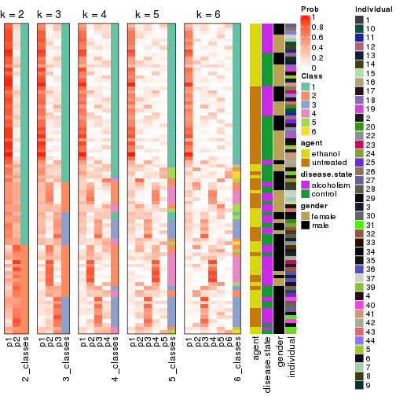


Test correlation between subgroups and known annotations. If the known
annotation is numeric, one-way ANOVA test is applied, and if the known
annotation is discrete, chi-squared contingency table test is applied.

```r
test_to_known_factors(res)
```

```
#>          n agent(p) disease.state(p) gender(p) individual(p) k
#> MAD:pam 43    0.937            0.407   0.00349        0.2506 2
#> MAD:pam 33    0.927            0.132   0.15509        0.0642 3
#> MAD:pam 20       NA               NA        NA            NA 4
#> MAD:pam 16       NA               NA        NA            NA 5
#> MAD:pam 18    1.000            0.089   0.84113        0.1575 6
```


If matrix rows can be associated to genes, consider to use `GO_Enrichment(res,
...)` to perform function enrichment for the signature genes.


 

---------------------------------------------------


### MAD:mclust


The object with results only for a single top-value method and a single partition method 
can be extracted as:

```r
res = res_list["MAD", "mclust"]
# you can also extract it by
# res = res_list["MAD:mclust"]
```

A summary of `res` and all the functions that can be applied to it:

```r
res
```

```
#> A 'ConsensusPartition' object with k = 2, 3, 4, 5, 6.
#>   On a matrix with 51941 rows and 84 columns.
#>   Top rows (1000, 2000, 3000, 4000, 5000) are extracted by 'MAD' method.
#>   Subgroups are detected by 'mclust' method.
#>   Performed in total 1250 partitions by row resampling.
#>   Best k for subgroups seems to be 3.
#> 
#> Following methods can be applied to this 'ConsensusPartition' object:
#>  [1] "cola_report"             "collect_classes"         "collect_plots"          
#>  [4] "collect_stats"           "colnames"                "compare_signatures"     
#>  [7] "consensus_heatmap"       "dimension_reduction"     "functional_enrichment"  
#> [10] "get_anno_col"            "get_anno"                "get_classes"            
#> [13] "get_consensus"           "get_matrix"              "get_membership"         
#> [16] "get_param"               "get_signatures"          "get_stats"              
#> [19] "is_best_k"               "is_stable_k"             "membership_heatmap"     
#> [22] "ncol"                    "nrow"                    "plot_ecdf"              
#> [25] "rownames"                "select_partition_number" "show"                   
#> [28] "suggest_best_k"          "test_to_known_factors"
```

`collect_plots()` function collects all the plots made from `res` for all `k` (number of partitions)
into one single page to provide an easy and fast comparison between different `k`.

```r
collect_plots(res)
```


The plots are:

- The first row: a plot of the ECDF (Empirical cumulative distribution
  function) curves of the consensus matrix for each `k` and the heatmap of
  predicted classes for each `k`.
- The second row: heatmaps of the consensus matrix for each `k`.
- The third row: heatmaps of the membership matrix for each `k`.
- The fouth row: heatmaps of the signatures for each `k`.

All the plots in panels can be made by individual functions and they are
plotted later in this section.

`select_partition_number()` produces several plots showing different
statistics for choosing "optimized" `k`. There are following statistics:

- ECDF curves of the consensus matrix for each `k`;
- 1-PAC. [The PAC
  score](https://en.wikipedia.org/wiki/Consensus_clustering#Over-interpretation_potential_of_consensus_clustering)
  measures the proportion of the ambiguous subgrouping.
- Mean silhouette score.
- Concordance. The mean probability of fiting the consensus class ids in all
  partitions.
- Area increased. Denote $A_k$ as the area under the ECDF curve for current
  `k`, the area increased is defined as $A_k - A_{k-1}$.
- Rand index. The percent of pairs of samples that are both in a same cluster
  or both are not in a same cluster in the partition of k and k-1.
- Jaccard index. The ratio of pairs of samples are both in a same cluster in
  the partition of k and k-1 and the pairs of samples are both in a same
  cluster in the partition k or k-1.

The detailed explanations of these statistics can be found in [the cola
vignette](http://bioconductor.org/packages/devel/bioc/vignettes/cola/inst/doc/cola.html#toc_13).

Generally speaking, lower PAC score, higher mean silhouette score or higher
concordance corresponds to better partition. Rand index and Jaccard index
measure how similar the current partition is compared to partition with `k-1`.
If they are too similar, we won't accept `k` is better than `k-1`.

```r
select_partition_number(res)
```


The numeric values for all these statistics can be obtained by `get_stats()`.

```r
get_stats(res)
```

```
#>   k  1-PAC mean_silhouette concordance area_increased  Rand Jaccard
#> 2 2 0.0889           0.118       0.745         0.3306 0.953   0.953
#> 3 3 0.0798           0.638       0.706         0.6185 0.517   0.499
#> 4 4 0.3093           0.521       0.647         0.2487 0.764   0.523
#> 5 5 0.4265           0.467       0.674         0.1177 0.917   0.720
#> 6 6 0.4972           0.463       0.642         0.0578 0.933   0.752
```

`suggest_best_k()` suggests the best $k$ based on these statistics. The rules are as follows:

- All $k$ with Jaccard index larger than 0.95 are removed because the increase of
  the partition number does not provides enough extra information. If all $k$ are removed,
  the best $k$ is assigned by `NA`.
- For $k$ with 1-PAC larger than 0.9, the maximal $k$ is taken as the "best k". Other $k$ is called "optional k".
- If it does not fit the second rule. The $k$ with the highest vote of highest
  1-PAC, mean silhouette and concordance is taken as the "best k".

```r
suggest_best_k(res)
```

```
#> [1] 3
```


Following shows the table of the partitions (You need to click the **show/hide
code output** link to see it). The membership matrix (columns with name `p*`)
is inferred by
[`clue::cl_consensus()`](https://www.rdocumentation.org/link/cl_consensus?package=clue)
function with the `SE` method. Basically the value in the membership matrix
represents the probability to belong to a certain group. The finall class
label for an item is determined with the group with highest probability it
belongs to.

In `get_classes()` function, the entropy is calculated from the membership
matrix and the silhouette score is calculated from the consensus matrix.


<script>
$( function() {
	$( '#tabs-MAD-mclust-get-classes' ).tabs();
} );
</script>
<div id='tabs-MAD-mclust-get-classes'>
<ul>
<li><a href='#tab-MAD-mclust-get-classes-1'>k = 2</a></li>
<li><a href='#tab-MAD-mclust-get-classes-2'>k = 3</a></li>
<li><a href='#tab-MAD-mclust-get-classes-3'>k = 4</a></li>
<li><a href='#tab-MAD-mclust-get-classes-4'>k = 5</a></li>
<li><a href='#tab-MAD-mclust-get-classes-5'>k = 6</a></li>
</ul>

<div id='tab-MAD-mclust-get-classes-1'>
<p><a id='tab-MAD-mclust-get-classes-1-a' style='color:#0366d6' href='#'>show/hide code output</a></p>
<pre><code class="r">cbind(get_classes(res, k = 2), get_membership(res, k = 2))
</code></pre>

<pre><code>#&gt;            class entropy silhouette    p1    p2
#&gt; GSM1269647     1   0.995    -0.8313 0.540 0.460
#&gt; GSM1269655     1   0.416     0.5317 0.916 0.084
#&gt; GSM1269663     1   0.242     0.5082 0.960 0.040
#&gt; GSM1269671     2   1.000     0.8369 0.496 0.504
#&gt; GSM1269679     1   0.871     0.3919 0.708 0.292
#&gt; GSM1269693     1   0.295     0.5047 0.948 0.052
#&gt; GSM1269701     1   0.814     0.4372 0.748 0.252
#&gt; GSM1269709     1   0.443     0.5060 0.908 0.092
#&gt; GSM1269715     1   0.141     0.5285 0.980 0.020
#&gt; GSM1269717     1   0.184     0.5307 0.972 0.028
#&gt; GSM1269721     1   0.936    -0.5565 0.648 0.352
#&gt; GSM1269723     1   0.876     0.3966 0.704 0.296
#&gt; GSM1269645     1   0.697     0.5148 0.812 0.188
#&gt; GSM1269653     1   0.985    -0.6246 0.572 0.428
#&gt; GSM1269661     1   0.827     0.4548 0.740 0.260
#&gt; GSM1269669     1   0.506     0.5289 0.888 0.112
#&gt; GSM1269677     1   0.995    -0.6462 0.540 0.460
#&gt; GSM1269685     1   0.529     0.4827 0.880 0.120
#&gt; GSM1269691     1   0.443     0.4995 0.908 0.092
#&gt; GSM1269699     2   1.000     0.8298 0.488 0.512
#&gt; GSM1269707     1   0.983    -0.6303 0.576 0.424
#&gt; GSM1269651     1   0.985    -0.6415 0.572 0.428
#&gt; GSM1269659     1   0.929    -0.5030 0.656 0.344
#&gt; GSM1269667     1   0.644     0.5008 0.836 0.164
#&gt; GSM1269675     1   0.988    -0.7634 0.564 0.436
#&gt; GSM1269683     1   0.494     0.5227 0.892 0.108
#&gt; GSM1269689     1   0.988    -0.7102 0.564 0.436
#&gt; GSM1269697     1   0.980    -0.6694 0.584 0.416
#&gt; GSM1269705     1   0.988    -0.7911 0.564 0.436
#&gt; GSM1269713     1   0.745     0.2450 0.788 0.212
#&gt; GSM1269719     1   0.278     0.5193 0.952 0.048
#&gt; GSM1269725     1   0.866    -0.1070 0.712 0.288
#&gt; GSM1269727     1   0.855     0.4147 0.720 0.280
#&gt; GSM1269649     1   0.714     0.4980 0.804 0.196
#&gt; GSM1269657     1   0.961    -0.5717 0.616 0.384
#&gt; GSM1269665     1   0.662     0.5084 0.828 0.172
#&gt; GSM1269673     1   0.430     0.5261 0.912 0.088
#&gt; GSM1269681     1   0.991    -0.6631 0.556 0.444
#&gt; GSM1269687     1   0.518     0.5314 0.884 0.116
#&gt; GSM1269695     1   0.469     0.5206 0.900 0.100
#&gt; GSM1269703     1   0.584     0.5273 0.860 0.140
#&gt; GSM1269711     1   0.644     0.4946 0.836 0.164
#&gt; GSM1269646     1   0.963    -0.6044 0.612 0.388
#&gt; GSM1269654     1   0.327     0.5335 0.940 0.060
#&gt; GSM1269662     1   0.358     0.4727 0.932 0.068
#&gt; GSM1269670     1   0.999    -0.8712 0.520 0.480
#&gt; GSM1269678     1   0.904     0.3909 0.680 0.320
#&gt; GSM1269692     1   0.260     0.5113 0.956 0.044
#&gt; GSM1269700     1   0.821     0.4321 0.744 0.256
#&gt; GSM1269708     1   0.373     0.5083 0.928 0.072
#&gt; GSM1269714     1   0.163     0.5299 0.976 0.024
#&gt; GSM1269716     1   0.184     0.5307 0.972 0.028
#&gt; GSM1269720     1   0.955    -0.6032 0.624 0.376
#&gt; GSM1269722     1   0.494     0.5274 0.892 0.108
#&gt; GSM1269644     1   0.416     0.5113 0.916 0.084
#&gt; GSM1269652     1   0.961    -0.4814 0.616 0.384
#&gt; GSM1269660     1   0.808     0.4654 0.752 0.248
#&gt; GSM1269668     1   0.494     0.5285 0.892 0.108
#&gt; GSM1269676     1   0.998    -0.6590 0.524 0.476
#&gt; GSM1269684     1   0.416     0.5227 0.916 0.084
#&gt; GSM1269690     1   0.494     0.4940 0.892 0.108
#&gt; GSM1269698     1   1.000    -0.8790 0.508 0.492
#&gt; GSM1269706     1   0.963    -0.5032 0.612 0.388
#&gt; GSM1269650     1   0.985    -0.6398 0.572 0.428
#&gt; GSM1269658     1   0.821    -0.1498 0.744 0.256
#&gt; GSM1269666     1   0.900     0.3759 0.684 0.316
#&gt; GSM1269674     1   0.966    -0.6499 0.608 0.392
#&gt; GSM1269682     1   0.563     0.5143 0.868 0.132
#&gt; GSM1269688     1   0.985    -0.7009 0.572 0.428
#&gt; GSM1269696     1   0.949    -0.5296 0.632 0.368
#&gt; GSM1269704     1   1.000    -0.8742 0.512 0.488
#&gt; GSM1269712     1   0.833     0.4173 0.736 0.264
#&gt; GSM1269718     1   0.260     0.5272 0.956 0.044
#&gt; GSM1269724     1   0.808     0.4379 0.752 0.248
#&gt; GSM1269726     1   0.821     0.4333 0.744 0.256
#&gt; GSM1269648     1   0.584     0.5084 0.860 0.140
#&gt; GSM1269656     1   0.866    -0.0861 0.712 0.288
#&gt; GSM1269664     1   0.689     0.5034 0.816 0.184
#&gt; GSM1269672     1   0.388     0.5284 0.924 0.076
#&gt; GSM1269680     1   0.997    -0.6559 0.532 0.468
#&gt; GSM1269686     1   0.443     0.5314 0.908 0.092
#&gt; GSM1269694     1   0.469     0.5213 0.900 0.100
#&gt; GSM1269702     1   0.469     0.4980 0.900 0.100
#&gt; GSM1269710     1   0.662     0.5024 0.828 0.172
</code></pre>

<script>
$('#tab-MAD-mclust-get-classes-1-a').parent().next().next().hide();
$('#tab-MAD-mclust-get-classes-1-a').click(function(){
  $('#tab-MAD-mclust-get-classes-1-a').parent().next().next().toggle();
  return(false);
});
</script>
</div>

<div id='tab-MAD-mclust-get-classes-2'>
<p><a id='tab-MAD-mclust-get-classes-2-a' style='color:#0366d6' href='#'>show/hide code output</a></p>
<pre><code class="r">cbind(get_classes(res, k = 3), get_membership(res, k = 3))
</code></pre>

<pre><code>#&gt;            class entropy silhouette    p1    p2    p3
#&gt; GSM1269647     3   0.429      0.701 0.092 0.040 0.868
#&gt; GSM1269655     1   0.559      0.737 0.812 0.096 0.092
#&gt; GSM1269663     1   0.532      0.705 0.824 0.072 0.104
#&gt; GSM1269671     3   0.471      0.687 0.092 0.056 0.852
#&gt; GSM1269679     1   0.801      0.654 0.640 0.244 0.116
#&gt; GSM1269693     1   0.516      0.700 0.832 0.096 0.072
#&gt; GSM1269701     1   0.810      0.655 0.640 0.228 0.132
#&gt; GSM1269709     1   0.644      0.665 0.720 0.040 0.240
#&gt; GSM1269715     1   0.463      0.705 0.856 0.088 0.056
#&gt; GSM1269717     1   0.477      0.700 0.848 0.100 0.052
#&gt; GSM1269721     1   0.971     -0.490 0.436 0.232 0.332
#&gt; GSM1269723     1   0.801      0.651 0.640 0.244 0.116
#&gt; GSM1269645     1   0.617      0.743 0.776 0.144 0.080
#&gt; GSM1269653     3   0.756      0.612 0.164 0.144 0.692
#&gt; GSM1269661     1   0.712      0.698 0.708 0.204 0.088
#&gt; GSM1269669     1   0.535      0.747 0.824 0.088 0.088
#&gt; GSM1269677     2   0.876      0.793 0.216 0.588 0.196
#&gt; GSM1269685     1   0.549      0.665 0.816 0.104 0.080
#&gt; GSM1269691     1   0.512      0.677 0.832 0.108 0.060
#&gt; GSM1269699     3   0.697      0.616 0.120 0.148 0.732
#&gt; GSM1269707     3   0.879      0.390 0.244 0.176 0.580
#&gt; GSM1269651     2   0.921      0.790 0.224 0.536 0.240
#&gt; GSM1269659     2   0.951      0.691 0.348 0.456 0.196
#&gt; GSM1269667     1   0.766      0.692 0.676 0.208 0.116
#&gt; GSM1269675     3   0.560      0.697 0.136 0.060 0.804
#&gt; GSM1269683     1   0.453      0.738 0.860 0.088 0.052
#&gt; GSM1269689     3   0.395      0.694 0.076 0.040 0.884
#&gt; GSM1269697     3   0.393      0.687 0.092 0.028 0.880
#&gt; GSM1269705     3   0.533      0.705 0.120 0.060 0.820
#&gt; GSM1269713     3   0.718      0.497 0.304 0.048 0.648
#&gt; GSM1269719     1   0.557      0.705 0.812 0.080 0.108
#&gt; GSM1269725     3   0.719      0.496 0.292 0.052 0.656
#&gt; GSM1269727     1   0.746      0.670 0.672 0.244 0.084
#&gt; GSM1269649     1   0.859      0.627 0.604 0.216 0.180
#&gt; GSM1269657     2   0.948      0.702 0.336 0.468 0.196
#&gt; GSM1269665     1   0.543      0.746 0.808 0.144 0.048
#&gt; GSM1269673     1   0.440      0.705 0.864 0.092 0.044
#&gt; GSM1269681     2   0.932      0.753 0.220 0.520 0.260
#&gt; GSM1269687     1   0.489      0.732 0.840 0.112 0.048
#&gt; GSM1269695     1   0.659      0.682 0.744 0.076 0.180
#&gt; GSM1269703     1   0.386      0.748 0.888 0.072 0.040
#&gt; GSM1269711     1   0.752      0.585 0.660 0.080 0.260
#&gt; GSM1269646     3   0.538      0.676 0.188 0.024 0.788
#&gt; GSM1269654     1   0.543      0.735 0.820 0.092 0.088
#&gt; GSM1269662     1   0.576      0.678 0.800 0.076 0.124
#&gt; GSM1269670     3   0.492      0.688 0.108 0.052 0.840
#&gt; GSM1269678     1   0.738      0.675 0.680 0.236 0.084
#&gt; GSM1269692     1   0.500      0.702 0.840 0.092 0.068
#&gt; GSM1269700     1   0.816      0.659 0.636 0.228 0.136
#&gt; GSM1269708     1   0.572      0.730 0.792 0.052 0.156
#&gt; GSM1269714     1   0.437      0.713 0.868 0.076 0.056
#&gt; GSM1269716     1   0.479      0.699 0.848 0.096 0.056
#&gt; GSM1269720     1   0.998     -0.696 0.364 0.328 0.308
#&gt; GSM1269722     1   0.631      0.733 0.772 0.128 0.100
#&gt; GSM1269644     1   0.447      0.716 0.864 0.060 0.076
#&gt; GSM1269652     3   0.891      0.336 0.280 0.164 0.556
#&gt; GSM1269660     1   0.651      0.716 0.748 0.180 0.072
#&gt; GSM1269668     1   0.534      0.741 0.824 0.092 0.084
#&gt; GSM1269676     2   0.876      0.793 0.216 0.588 0.196
#&gt; GSM1269684     1   0.469      0.686 0.852 0.096 0.052
#&gt; GSM1269690     1   0.519      0.673 0.828 0.112 0.060
#&gt; GSM1269698     3   0.720      0.603 0.124 0.160 0.716
#&gt; GSM1269706     3   0.921      0.264 0.296 0.184 0.520
#&gt; GSM1269650     2   0.917      0.785 0.216 0.540 0.244
#&gt; GSM1269658     2   0.938      0.644 0.380 0.448 0.172
#&gt; GSM1269666     1   0.808      0.639 0.628 0.260 0.112
#&gt; GSM1269674     3   0.795      0.204 0.388 0.064 0.548
#&gt; GSM1269682     1   0.474      0.741 0.848 0.104 0.048
#&gt; GSM1269688     3   0.498      0.698 0.136 0.036 0.828
#&gt; GSM1269696     3   0.537      0.703 0.140 0.048 0.812
#&gt; GSM1269704     3   0.401      0.708 0.096 0.028 0.876
#&gt; GSM1269712     1   0.814      0.659 0.624 0.260 0.116
#&gt; GSM1269718     1   0.523      0.725 0.828 0.068 0.104
#&gt; GSM1269724     1   0.904      0.508 0.544 0.176 0.280
#&gt; GSM1269726     1   0.732      0.687 0.696 0.208 0.096
#&gt; GSM1269648     1   0.730      0.650 0.688 0.084 0.228
#&gt; GSM1269656     1   0.811      0.293 0.648 0.160 0.192
#&gt; GSM1269664     1   0.471      0.749 0.844 0.120 0.036
#&gt; GSM1269672     1   0.453      0.703 0.860 0.088 0.052
#&gt; GSM1269680     2   0.912      0.798 0.224 0.548 0.228
#&gt; GSM1269686     1   0.389      0.714 0.884 0.084 0.032
#&gt; GSM1269694     1   0.625      0.715 0.772 0.084 0.144
#&gt; GSM1269702     1   0.482      0.688 0.848 0.088 0.064
#&gt; GSM1269710     1   0.655      0.705 0.756 0.096 0.148
</code></pre>

<script>
$('#tab-MAD-mclust-get-classes-2-a').parent().next().next().hide();
$('#tab-MAD-mclust-get-classes-2-a').click(function(){
  $('#tab-MAD-mclust-get-classes-2-a').parent().next().next().toggle();
  return(false);
});
</script>
</div>

<div id='tab-MAD-mclust-get-classes-3'>
<p><a id='tab-MAD-mclust-get-classes-3-a' style='color:#0366d6' href='#'>show/hide code output</a></p>
<pre><code class="r">cbind(get_classes(res, k = 4), get_membership(res, k = 4))
</code></pre>

<pre><code>#&gt;            class entropy silhouette    p1    p2    p3    p4
#&gt; GSM1269647     2   0.395     0.7180 0.012 0.832 0.140 0.016
#&gt; GSM1269655     3   0.556     0.6022 0.316 0.024 0.652 0.008
#&gt; GSM1269663     1   0.732    -0.1432 0.456 0.028 0.440 0.076
#&gt; GSM1269671     2   0.397     0.6839 0.016 0.856 0.072 0.056
#&gt; GSM1269679     3   0.499     0.6647 0.148 0.064 0.780 0.008
#&gt; GSM1269693     1   0.595     0.4928 0.724 0.024 0.176 0.076
#&gt; GSM1269701     3   0.482     0.6819 0.160 0.048 0.784 0.008
#&gt; GSM1269709     3   0.891     0.0399 0.312 0.288 0.352 0.048
#&gt; GSM1269715     1   0.525     0.5035 0.752 0.012 0.188 0.048
#&gt; GSM1269717     1   0.507     0.4999 0.764 0.016 0.184 0.036
#&gt; GSM1269721     4   0.896     0.4190 0.316 0.284 0.052 0.348
#&gt; GSM1269723     3   0.464     0.6833 0.164 0.044 0.788 0.004
#&gt; GSM1269645     3   0.703     0.4493 0.356 0.060 0.552 0.032
#&gt; GSM1269653     2   0.731     0.6473 0.116 0.648 0.168 0.068
#&gt; GSM1269661     3   0.506     0.6731 0.272 0.020 0.704 0.004
#&gt; GSM1269669     3   0.604     0.5098 0.416 0.036 0.544 0.004
#&gt; GSM1269677     4   0.329     0.7823 0.080 0.044 0.000 0.876
#&gt; GSM1269685     1   0.241     0.5568 0.928 0.016 0.036 0.020
#&gt; GSM1269691     1   0.211     0.5603 0.932 0.000 0.044 0.024
#&gt; GSM1269699     2   0.649     0.6316 0.052 0.712 0.116 0.120
#&gt; GSM1269707     2   0.848     0.5063 0.172 0.552 0.124 0.152
#&gt; GSM1269651     4   0.552     0.7784 0.068 0.108 0.048 0.776
#&gt; GSM1269659     4   0.615     0.7226 0.304 0.056 0.008 0.632
#&gt; GSM1269667     3   0.450     0.6926 0.192 0.032 0.776 0.000
#&gt; GSM1269675     2   0.400     0.6985 0.020 0.852 0.092 0.036
#&gt; GSM1269683     3   0.548     0.4592 0.412 0.004 0.572 0.012
#&gt; GSM1269689     2   0.342     0.7184 0.024 0.884 0.064 0.028
#&gt; GSM1269697     2   0.354     0.7140 0.004 0.832 0.160 0.004
#&gt; GSM1269705     2   0.471     0.7156 0.008 0.800 0.132 0.060
#&gt; GSM1269713     2   0.690     0.4623 0.132 0.588 0.276 0.004
#&gt; GSM1269719     3   0.740     0.3648 0.372 0.024 0.508 0.096
#&gt; GSM1269725     2   0.680     0.5411 0.076 0.600 0.304 0.020
#&gt; GSM1269727     3   0.454     0.6814 0.216 0.024 0.760 0.000
#&gt; GSM1269649     3   0.715     0.4039 0.292 0.148 0.556 0.004
#&gt; GSM1269657     4   0.639     0.7144 0.300 0.072 0.008 0.620
#&gt; GSM1269665     3   0.530     0.5380 0.408 0.000 0.580 0.012
#&gt; GSM1269673     1   0.361     0.5004 0.800 0.000 0.200 0.000
#&gt; GSM1269681     4   0.589     0.7506 0.068 0.136 0.048 0.748
#&gt; GSM1269687     1   0.531    -0.0539 0.596 0.008 0.392 0.004
#&gt; GSM1269695     1   0.870     0.1992 0.464 0.212 0.264 0.060
#&gt; GSM1269703     1   0.562    -0.1431 0.564 0.012 0.416 0.008
#&gt; GSM1269711     1   0.871     0.0830 0.396 0.364 0.184 0.056
#&gt; GSM1269646     2   0.512     0.6271 0.016 0.700 0.276 0.008
#&gt; GSM1269654     3   0.577     0.5258 0.356 0.016 0.612 0.016
#&gt; GSM1269662     3   0.822     0.1049 0.396 0.044 0.424 0.136
#&gt; GSM1269670     2   0.399     0.6833 0.012 0.852 0.080 0.056
#&gt; GSM1269678     3   0.519     0.6769 0.212 0.040 0.740 0.008
#&gt; GSM1269692     1   0.537     0.5067 0.756 0.012 0.164 0.068
#&gt; GSM1269700     3   0.477     0.6847 0.168 0.048 0.780 0.004
#&gt; GSM1269708     1   0.827     0.0383 0.456 0.148 0.352 0.044
#&gt; GSM1269714     1   0.496     0.4923 0.752 0.016 0.212 0.020
#&gt; GSM1269716     1   0.503     0.5018 0.768 0.016 0.180 0.036
#&gt; GSM1269720     4   0.779     0.6979 0.244 0.168 0.032 0.556
#&gt; GSM1269722     3   0.546     0.6550 0.276 0.036 0.684 0.004
#&gt; GSM1269644     1   0.512     0.4640 0.748 0.016 0.208 0.028
#&gt; GSM1269652     2   0.861     0.5239 0.200 0.532 0.152 0.116
#&gt; GSM1269660     3   0.480     0.6750 0.260 0.020 0.720 0.000
#&gt; GSM1269668     3   0.604     0.5272 0.412 0.036 0.548 0.004
#&gt; GSM1269676     4   0.329     0.7823 0.080 0.044 0.000 0.876
#&gt; GSM1269684     1   0.286     0.5600 0.888 0.008 0.100 0.004
#&gt; GSM1269690     1   0.189     0.5583 0.940 0.000 0.044 0.016
#&gt; GSM1269698     2   0.553     0.6521 0.032 0.760 0.056 0.152
#&gt; GSM1269706     2   0.870     0.4740 0.200 0.524 0.124 0.152
#&gt; GSM1269650     4   0.547     0.7761 0.068 0.104 0.048 0.780
#&gt; GSM1269658     4   0.600     0.7565 0.240 0.052 0.020 0.688
#&gt; GSM1269666     3   0.445     0.6774 0.156 0.048 0.796 0.000
#&gt; GSM1269674     2   0.759     0.4319 0.080 0.556 0.308 0.056
#&gt; GSM1269682     3   0.546     0.5555 0.368 0.004 0.612 0.016
#&gt; GSM1269688     2   0.439     0.7144 0.064 0.840 0.064 0.032
#&gt; GSM1269696     2   0.527     0.6811 0.028 0.740 0.212 0.020
#&gt; GSM1269704     2   0.354     0.7244 0.012 0.868 0.096 0.024
#&gt; GSM1269712     3   0.507     0.6674 0.168 0.056 0.768 0.008
#&gt; GSM1269718     3   0.679     0.4488 0.376 0.016 0.544 0.064
#&gt; GSM1269724     3   0.642     0.5530 0.140 0.168 0.680 0.012
#&gt; GSM1269726     3   0.448     0.6662 0.248 0.012 0.740 0.000
#&gt; GSM1269648     1   0.891     0.0521 0.400 0.256 0.288 0.056
#&gt; GSM1269656     1   0.628     0.1159 0.660 0.088 0.008 0.244
#&gt; GSM1269664     3   0.543     0.5724 0.392 0.004 0.592 0.012
#&gt; GSM1269672     1   0.354     0.5278 0.828 0.008 0.164 0.000
#&gt; GSM1269680     4   0.458     0.7831 0.068 0.076 0.028 0.828
#&gt; GSM1269686     1   0.437     0.3666 0.728 0.004 0.268 0.000
#&gt; GSM1269694     1   0.873     0.2021 0.448 0.220 0.276 0.056
#&gt; GSM1269702     1   0.357     0.5570 0.872 0.012 0.080 0.036
#&gt; GSM1269710     1   0.808    -0.1645 0.424 0.144 0.400 0.032
</code></pre>

<script>
$('#tab-MAD-mclust-get-classes-3-a').parent().next().next().hide();
$('#tab-MAD-mclust-get-classes-3-a').click(function(){
  $('#tab-MAD-mclust-get-classes-3-a').parent().next().next().toggle();
  return(false);
});
</script>
</div>

<div id='tab-MAD-mclust-get-classes-4'>
<p><a id='tab-MAD-mclust-get-classes-4-a' style='color:#0366d6' href='#'>show/hide code output</a></p>
<pre><code class="r">cbind(get_classes(res, k = 5), get_membership(res, k = 5))
</code></pre>

<pre><code>#&gt;            class entropy silhouette    p1    p2    p3    p4    p5
#&gt; GSM1269647     5  0.2968     0.6660 0.000 0.008 0.092 0.028 0.872
#&gt; GSM1269655     3  0.6049     0.5384 0.188 0.028 0.684 0.052 0.048
#&gt; GSM1269663     3  0.7479     0.1274 0.332 0.076 0.476 0.104 0.012
#&gt; GSM1269671     5  0.3319     0.6035 0.000 0.020 0.000 0.160 0.820
#&gt; GSM1269679     3  0.2922     0.6185 0.016 0.000 0.880 0.024 0.080
#&gt; GSM1269693     1  0.6407     0.4984 0.628 0.040 0.192 0.136 0.004
#&gt; GSM1269701     3  0.2910     0.6324 0.024 0.000 0.888 0.052 0.036
#&gt; GSM1269709     3  0.8299    -0.1479 0.172 0.000 0.368 0.280 0.180
#&gt; GSM1269715     1  0.5484     0.5152 0.684 0.008 0.192 0.112 0.004
#&gt; GSM1269717     1  0.5592     0.4993 0.676 0.008 0.184 0.128 0.004
#&gt; GSM1269721     2  0.7884     0.3883 0.256 0.452 0.008 0.076 0.208
#&gt; GSM1269723     3  0.2751     0.6363 0.020 0.004 0.900 0.032 0.044
#&gt; GSM1269645     3  0.6943     0.3835 0.308 0.004 0.500 0.164 0.024
#&gt; GSM1269653     5  0.6078     0.0416 0.024 0.016 0.036 0.392 0.532
#&gt; GSM1269661     3  0.3502     0.6198 0.144 0.004 0.828 0.012 0.012
#&gt; GSM1269669     3  0.5687     0.4783 0.280 0.000 0.632 0.060 0.028
#&gt; GSM1269677     2  0.0968     0.7728 0.012 0.972 0.000 0.004 0.012
#&gt; GSM1269685     1  0.3611     0.5334 0.848 0.036 0.036 0.080 0.000
#&gt; GSM1269691     1  0.3309     0.5581 0.868 0.032 0.052 0.048 0.000
#&gt; GSM1269699     5  0.5308     0.4177 0.004 0.072 0.004 0.256 0.664
#&gt; GSM1269707     4  0.7283     0.2061 0.064 0.100 0.008 0.448 0.380
#&gt; GSM1269651     2  0.4678     0.7529 0.004 0.768 0.016 0.144 0.068
#&gt; GSM1269659     2  0.4337     0.7254 0.172 0.776 0.004 0.032 0.016
#&gt; GSM1269667     3  0.1777     0.6382 0.012 0.004 0.944 0.020 0.020
#&gt; GSM1269675     5  0.4290     0.5981 0.008 0.008 0.036 0.168 0.780
#&gt; GSM1269683     3  0.5210     0.4138 0.292 0.004 0.648 0.052 0.004
#&gt; GSM1269689     5  0.4159     0.4857 0.004 0.004 0.016 0.232 0.744
#&gt; GSM1269697     5  0.2780     0.6606 0.004 0.004 0.112 0.008 0.872
#&gt; GSM1269705     5  0.3307     0.6663 0.004 0.036 0.072 0.020 0.868
#&gt; GSM1269713     5  0.5128     0.3987 0.032 0.000 0.312 0.016 0.640
#&gt; GSM1269719     3  0.7412     0.2924 0.256 0.120 0.528 0.088 0.008
#&gt; GSM1269725     5  0.4970     0.4728 0.016 0.008 0.292 0.016 0.668
#&gt; GSM1269727     3  0.1854     0.6356 0.020 0.000 0.936 0.036 0.008
#&gt; GSM1269649     3  0.6515     0.4291 0.228 0.000 0.608 0.092 0.072
#&gt; GSM1269657     2  0.4808     0.7161 0.164 0.760 0.012 0.044 0.020
#&gt; GSM1269665     3  0.5537     0.5195 0.248 0.004 0.656 0.084 0.008
#&gt; GSM1269673     1  0.4834     0.4758 0.692 0.004 0.252 0.052 0.000
#&gt; GSM1269681     2  0.5094     0.7266 0.004 0.740 0.016 0.124 0.116
#&gt; GSM1269687     1  0.5083    -0.0601 0.540 0.000 0.428 0.028 0.004
#&gt; GSM1269695     1  0.8119    -0.1970 0.340 0.004 0.244 0.328 0.084
#&gt; GSM1269703     3  0.5754     0.1712 0.460 0.000 0.472 0.056 0.012
#&gt; GSM1269711     4  0.8364     0.2078 0.292 0.000 0.208 0.340 0.160
#&gt; GSM1269646     5  0.3403     0.6340 0.000 0.008 0.160 0.012 0.820
#&gt; GSM1269654     3  0.6533     0.4649 0.228 0.036 0.632 0.064 0.040
#&gt; GSM1269662     3  0.8353    -0.0147 0.308 0.156 0.388 0.136 0.012
#&gt; GSM1269670     5  0.3566     0.6074 0.000 0.024 0.004 0.160 0.812
#&gt; GSM1269678     3  0.4447     0.6026 0.140 0.004 0.784 0.016 0.056
#&gt; GSM1269692     1  0.6344     0.5160 0.640 0.044 0.180 0.132 0.004
#&gt; GSM1269700     3  0.2578     0.6324 0.016 0.000 0.904 0.040 0.040
#&gt; GSM1269708     3  0.8215     0.0370 0.208 0.004 0.408 0.256 0.124
#&gt; GSM1269714     1  0.5487     0.4792 0.644 0.000 0.252 0.100 0.004
#&gt; GSM1269716     1  0.5550     0.5026 0.680 0.008 0.184 0.124 0.004
#&gt; GSM1269720     2  0.5967     0.6958 0.144 0.684 0.008 0.036 0.128
#&gt; GSM1269722     3  0.4163     0.6210 0.112 0.008 0.816 0.032 0.032
#&gt; GSM1269644     1  0.6213     0.4356 0.644 0.056 0.216 0.080 0.004
#&gt; GSM1269652     4  0.7434     0.3206 0.100 0.060 0.020 0.480 0.340
#&gt; GSM1269660     3  0.3682     0.6197 0.140 0.008 0.824 0.016 0.012
#&gt; GSM1269668     3  0.5667     0.4907 0.276 0.000 0.636 0.060 0.028
#&gt; GSM1269676     2  0.1200     0.7723 0.012 0.964 0.000 0.008 0.016
#&gt; GSM1269684     1  0.2908     0.5847 0.868 0.008 0.108 0.016 0.000
#&gt; GSM1269690     1  0.3229     0.5510 0.872 0.032 0.040 0.056 0.000
#&gt; GSM1269698     5  0.4493     0.5672 0.000 0.100 0.008 0.120 0.772
#&gt; GSM1269706     4  0.7621     0.3529 0.112 0.096 0.008 0.472 0.312
#&gt; GSM1269650     2  0.4493     0.7563 0.004 0.780 0.012 0.136 0.068
#&gt; GSM1269658     2  0.4341     0.7482 0.144 0.792 0.012 0.040 0.012
#&gt; GSM1269666     3  0.1682     0.6274 0.000 0.004 0.940 0.012 0.044
#&gt; GSM1269674     5  0.7535     0.3304 0.036 0.048 0.248 0.132 0.536
#&gt; GSM1269682     3  0.5234     0.5458 0.184 0.012 0.712 0.088 0.004
#&gt; GSM1269688     5  0.5143     0.3509 0.016 0.004 0.032 0.284 0.664
#&gt; GSM1269696     5  0.3620     0.6386 0.004 0.016 0.156 0.008 0.816
#&gt; GSM1269704     5  0.2555     0.6631 0.004 0.016 0.048 0.024 0.908
#&gt; GSM1269712     3  0.4195     0.6173 0.072 0.008 0.812 0.012 0.096
#&gt; GSM1269718     3  0.6743     0.4028 0.248 0.064 0.596 0.080 0.012
#&gt; GSM1269724     3  0.5309     0.4953 0.048 0.008 0.684 0.016 0.244
#&gt; GSM1269726     3  0.2976     0.6345 0.064 0.000 0.880 0.044 0.012
#&gt; GSM1269648     1  0.8287    -0.2520 0.296 0.000 0.292 0.292 0.120
#&gt; GSM1269656     1  0.7381     0.1374 0.484 0.324 0.028 0.136 0.028
#&gt; GSM1269664     3  0.5312     0.5364 0.256 0.004 0.668 0.064 0.008
#&gt; GSM1269672     1  0.4462     0.5125 0.740 0.000 0.196 0.064 0.000
#&gt; GSM1269680     2  0.3576     0.7686 0.000 0.840 0.012 0.100 0.048
#&gt; GSM1269686     1  0.4252     0.3854 0.700 0.000 0.280 0.020 0.000
#&gt; GSM1269694     4  0.7965    -0.0843 0.332 0.000 0.252 0.336 0.080
#&gt; GSM1269702     1  0.5780     0.4936 0.708 0.036 0.128 0.116 0.012
#&gt; GSM1269710     3  0.7703     0.1100 0.324 0.000 0.408 0.196 0.072
</code></pre>

<script>
$('#tab-MAD-mclust-get-classes-4-a').parent().next().next().hide();
$('#tab-MAD-mclust-get-classes-4-a').click(function(){
  $('#tab-MAD-mclust-get-classes-4-a').parent().next().next().toggle();
  return(false);
});
</script>
</div>

<div id='tab-MAD-mclust-get-classes-5'>
<p><a id='tab-MAD-mclust-get-classes-5-a' style='color:#0366d6' href='#'>show/hide code output</a></p>
<pre><code class="r">cbind(get_classes(res, k = 6), get_membership(res, k = 6))
</code></pre>

<pre><code>#&gt;            class entropy silhouette    p1    p2    p3    p4    p5    p6
#&gt; GSM1269647     2   0.280     0.7198 0.024 0.884 0.048 0.000 0.036 0.008
#&gt; GSM1269655     3   0.634     0.5621 0.040 0.032 0.632 0.144 0.140 0.012
#&gt; GSM1269663     3   0.803     0.2902 0.112 0.004 0.396 0.232 0.212 0.044
#&gt; GSM1269671     2   0.433     0.6791 0.072 0.772 0.000 0.000 0.108 0.048
#&gt; GSM1269679     3   0.317     0.5926 0.048 0.052 0.864 0.012 0.024 0.000
#&gt; GSM1269693     4   0.372     0.5158 0.012 0.000 0.076 0.828 0.056 0.028
#&gt; GSM1269701     3   0.279     0.5935 0.072 0.012 0.880 0.016 0.020 0.000
#&gt; GSM1269709     1   0.644     0.3427 0.524 0.088 0.320 0.048 0.012 0.008
#&gt; GSM1269715     4   0.183     0.5487 0.012 0.000 0.064 0.920 0.004 0.000
#&gt; GSM1269717     4   0.197     0.5357 0.004 0.000 0.056 0.916 0.024 0.000
#&gt; GSM1269721     6   0.828     0.1114 0.128 0.168 0.004 0.092 0.188 0.420
#&gt; GSM1269723     3   0.330     0.6149 0.052 0.024 0.864 0.032 0.024 0.004
#&gt; GSM1269645     3   0.689     0.3996 0.352 0.012 0.444 0.060 0.128 0.004
#&gt; GSM1269653     2   0.662     0.2362 0.292 0.428 0.020 0.000 0.252 0.008
#&gt; GSM1269661     3   0.486     0.6118 0.128 0.012 0.748 0.048 0.060 0.004
#&gt; GSM1269669     3   0.539     0.4479 0.256 0.004 0.636 0.076 0.024 0.004
#&gt; GSM1269677     6   0.362     0.5849 0.004 0.016 0.000 0.000 0.236 0.744
#&gt; GSM1269685     4   0.585     0.3876 0.352 0.000 0.012 0.536 0.068 0.032
#&gt; GSM1269691     4   0.542     0.4431 0.328 0.000 0.012 0.580 0.068 0.012
#&gt; GSM1269699     2   0.547     0.5338 0.068 0.596 0.000 0.000 0.296 0.040
#&gt; GSM1269707     1   0.728    -0.0408 0.352 0.276 0.000 0.008 0.296 0.068
#&gt; GSM1269651     6   0.369     0.5432 0.004 0.064 0.004 0.000 0.128 0.800
#&gt; GSM1269659     6   0.553     0.4780 0.032 0.012 0.004 0.048 0.292 0.612
#&gt; GSM1269667     3   0.157     0.6167 0.032 0.008 0.944 0.008 0.008 0.000
#&gt; GSM1269675     2   0.475     0.6822 0.100 0.760 0.028 0.000 0.080 0.032
#&gt; GSM1269683     3   0.576     0.4971 0.060 0.000 0.588 0.276 0.076 0.000
#&gt; GSM1269689     2   0.486     0.5605 0.248 0.672 0.016 0.000 0.060 0.004
#&gt; GSM1269697     2   0.270     0.7180 0.032 0.888 0.056 0.000 0.012 0.012
#&gt; GSM1269705     2   0.285     0.7219 0.004 0.880 0.036 0.000 0.036 0.044
#&gt; GSM1269713     2   0.527     0.4171 0.072 0.604 0.304 0.004 0.016 0.000
#&gt; GSM1269719     3   0.812     0.3753 0.092 0.004 0.440 0.164 0.196 0.104
#&gt; GSM1269725     2   0.506     0.5104 0.060 0.656 0.256 0.004 0.024 0.000
#&gt; GSM1269727     3   0.282     0.6190 0.064 0.004 0.876 0.044 0.012 0.000
#&gt; GSM1269649     3   0.504     0.3593 0.324 0.036 0.612 0.008 0.020 0.000
#&gt; GSM1269657     6   0.517     0.4908 0.032 0.012 0.000 0.032 0.296 0.628
#&gt; GSM1269665     3   0.674     0.5320 0.172 0.004 0.540 0.116 0.168 0.000
#&gt; GSM1269673     4   0.662     0.4140 0.320 0.000 0.156 0.468 0.052 0.004
#&gt; GSM1269681     6   0.406     0.5147 0.000 0.124 0.004 0.000 0.108 0.764
#&gt; GSM1269687     3   0.699     0.0598 0.296 0.000 0.372 0.280 0.048 0.004
#&gt; GSM1269695     1   0.488     0.3340 0.736 0.028 0.148 0.064 0.024 0.000
#&gt; GSM1269703     3   0.683     0.1683 0.296 0.000 0.372 0.288 0.044 0.000
#&gt; GSM1269711     1   0.485     0.4085 0.724 0.064 0.176 0.012 0.020 0.004
#&gt; GSM1269646     2   0.283     0.7048 0.004 0.868 0.092 0.000 0.024 0.012
#&gt; GSM1269654     3   0.671     0.5270 0.028 0.024 0.584 0.176 0.160 0.028
#&gt; GSM1269662     3   0.873     0.1571 0.124 0.004 0.312 0.224 0.216 0.120
#&gt; GSM1269670     2   0.401     0.6790 0.052 0.796 0.000 0.000 0.100 0.052
#&gt; GSM1269678     3   0.437     0.5750 0.156 0.024 0.764 0.036 0.020 0.000
#&gt; GSM1269692     4   0.348     0.5281 0.020 0.000 0.060 0.848 0.044 0.028
#&gt; GSM1269700     3   0.279     0.5956 0.060 0.016 0.884 0.016 0.024 0.000
#&gt; GSM1269708     1   0.654     0.2514 0.488 0.052 0.356 0.084 0.012 0.008
#&gt; GSM1269714     4   0.312     0.5451 0.032 0.000 0.136 0.828 0.000 0.004
#&gt; GSM1269716     4   0.156     0.5378 0.000 0.000 0.056 0.932 0.012 0.000
#&gt; GSM1269720     6   0.655     0.4596 0.056 0.092 0.000 0.048 0.220 0.584
#&gt; GSM1269722     3   0.436     0.6236 0.076 0.020 0.788 0.092 0.020 0.004
#&gt; GSM1269644     4   0.793     0.2119 0.328 0.000 0.164 0.328 0.148 0.032
#&gt; GSM1269652     1   0.734     0.1128 0.420 0.216 0.020 0.004 0.284 0.056
#&gt; GSM1269660     3   0.454     0.6080 0.132 0.008 0.764 0.032 0.060 0.004
#&gt; GSM1269668     3   0.555     0.4192 0.280 0.004 0.608 0.080 0.024 0.004
#&gt; GSM1269676     6   0.376     0.5820 0.008 0.016 0.000 0.000 0.240 0.736
#&gt; GSM1269684     4   0.564     0.5113 0.252 0.000 0.064 0.624 0.052 0.008
#&gt; GSM1269690     4   0.524     0.4639 0.284 0.000 0.008 0.624 0.068 0.016
#&gt; GSM1269698     2   0.449     0.6608 0.028 0.744 0.000 0.000 0.148 0.080
#&gt; GSM1269706     1   0.731     0.1044 0.392 0.200 0.004 0.004 0.312 0.088
#&gt; GSM1269650     6   0.349     0.5442 0.000 0.064 0.000 0.000 0.136 0.800
#&gt; GSM1269658     6   0.565     0.4789 0.016 0.012 0.020 0.052 0.292 0.608
#&gt; GSM1269666     3   0.180     0.6088 0.016 0.020 0.936 0.008 0.020 0.000
#&gt; GSM1269674     2   0.726     0.4734 0.052 0.560 0.180 0.016 0.108 0.084
#&gt; GSM1269682     3   0.634     0.5753 0.128 0.000 0.596 0.132 0.140 0.004
#&gt; GSM1269688     2   0.522     0.4568 0.312 0.600 0.012 0.000 0.072 0.004
#&gt; GSM1269696     2   0.333     0.6890 0.016 0.832 0.124 0.000 0.012 0.016
#&gt; GSM1269704     2   0.200     0.7211 0.004 0.924 0.028 0.000 0.032 0.012
#&gt; GSM1269712     3   0.516     0.6029 0.080 0.060 0.740 0.080 0.040 0.000
#&gt; GSM1269718     3   0.742     0.4696 0.100 0.004 0.516 0.152 0.184 0.044
#&gt; GSM1269724     3   0.529     0.4669 0.084 0.184 0.688 0.008 0.032 0.004
#&gt; GSM1269726     3   0.358     0.6302 0.080 0.000 0.816 0.092 0.012 0.000
#&gt; GSM1269648     1   0.478     0.4114 0.680 0.028 0.256 0.020 0.016 0.000
#&gt; GSM1269656     5   0.824     0.0000 0.272 0.012 0.024 0.132 0.280 0.280
#&gt; GSM1269664     3   0.626     0.5530 0.172 0.004 0.596 0.088 0.140 0.000
#&gt; GSM1269672     4   0.643     0.3781 0.388 0.000 0.128 0.436 0.044 0.004
#&gt; GSM1269680     6   0.194     0.5763 0.000 0.036 0.000 0.004 0.040 0.920
#&gt; GSM1269686     4   0.636     0.3948 0.268 0.000 0.208 0.496 0.024 0.004
#&gt; GSM1269694     1   0.520     0.3259 0.704 0.020 0.176 0.072 0.024 0.004
#&gt; GSM1269702     1   0.653    -0.3185 0.480 0.000 0.084 0.356 0.064 0.016
#&gt; GSM1269710     1   0.543     0.2590 0.580 0.020 0.336 0.048 0.016 0.000
</code></pre>

<script>
$('#tab-MAD-mclust-get-classes-5-a').parent().next().next().hide();
$('#tab-MAD-mclust-get-classes-5-a').click(function(){
  $('#tab-MAD-mclust-get-classes-5-a').parent().next().next().toggle();
  return(false);
});
</script>
</div>
</div>

Heatmaps for the consensus matrix. It visualizes the probability of two
samples to be in a same group.


<script>
$( function() {
	$( '#tabs-MAD-mclust-consensus-heatmap' ).tabs();
} );
</script>
<div id='tabs-MAD-mclust-consensus-heatmap'>
<ul>
<li><a href='#tab-MAD-mclust-consensus-heatmap-1'>k = 2</a></li>
<li><a href='#tab-MAD-mclust-consensus-heatmap-2'>k = 3</a></li>
<li><a href='#tab-MAD-mclust-consensus-heatmap-3'>k = 4</a></li>
<li><a href='#tab-MAD-mclust-consensus-heatmap-4'>k = 5</a></li>
<li><a href='#tab-MAD-mclust-consensus-heatmap-5'>k = 6</a></li>
</ul>
<div id='tab-MAD-mclust-consensus-heatmap-1'>
<pre><code class="r">consensus_heatmap(res, k = 2)
</code></pre>

<p></p>

</div>
<div id='tab-MAD-mclust-consensus-heatmap-2'>
<pre><code class="r">consensus_heatmap(res, k = 3)
</code></pre>

<p></p>

</div>
<div id='tab-MAD-mclust-consensus-heatmap-3'>
<pre><code class="r">consensus_heatmap(res, k = 4)
</code></pre>

<p></p>

</div>
<div id='tab-MAD-mclust-consensus-heatmap-4'>
<pre><code class="r">consensus_heatmap(res, k = 5)
</code></pre>

<p></p>

</div>
<div id='tab-MAD-mclust-consensus-heatmap-5'>
<pre><code class="r">consensus_heatmap(res, k = 6)
</code></pre>

<p></p>

</div>
</div>

Heatmaps for the membership of samples in all partitions to see how consistent they are:


<script>
$( function() {
	$( '#tabs-MAD-mclust-membership-heatmap' ).tabs();
} );
</script>
<div id='tabs-MAD-mclust-membership-heatmap'>
<ul>
<li><a href='#tab-MAD-mclust-membership-heatmap-1'>k = 2</a></li>
<li><a href='#tab-MAD-mclust-membership-heatmap-2'>k = 3</a></li>
<li><a href='#tab-MAD-mclust-membership-heatmap-3'>k = 4</a></li>
<li><a href='#tab-MAD-mclust-membership-heatmap-4'>k = 5</a></li>
<li><a href='#tab-MAD-mclust-membership-heatmap-5'>k = 6</a></li>
</ul>
<div id='tab-MAD-mclust-membership-heatmap-1'>
<pre><code class="r">membership_heatmap(res, k = 2)
</code></pre>

<p></p>

</div>
<div id='tab-MAD-mclust-membership-heatmap-2'>
<pre><code class="r">membership_heatmap(res, k = 3)
</code></pre>

<p>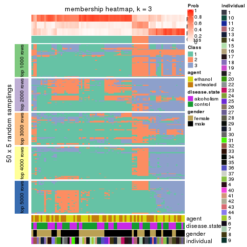</p>

</div>
<div id='tab-MAD-mclust-membership-heatmap-3'>
<pre><code class="r">membership_heatmap(res, k = 4)
</code></pre>

<p></p>

</div>
<div id='tab-MAD-mclust-membership-heatmap-4'>
<pre><code class="r">membership_heatmap(res, k = 5)
</code></pre>

<p></p>

</div>
<div id='tab-MAD-mclust-membership-heatmap-5'>
<pre><code class="r">membership_heatmap(res, k = 6)
</code></pre>

<p></p>

</div>
</div>

As soon as we have had the classes for columns, we can look for signatures
which are significantly different between classes which can be candidate marks
for certain classes. Following are the heatmaps for signatures.


Signature heatmaps where rows are scaled:


<script>
$( function() {
	$( '#tabs-MAD-mclust-get-signatures' ).tabs();
} );
</script>
<div id='tabs-MAD-mclust-get-signatures'>
<ul>
<li><a href='#tab-MAD-mclust-get-signatures-1'>k = 2</a></li>
<li><a href='#tab-MAD-mclust-get-signatures-2'>k = 3</a></li>
<li><a href='#tab-MAD-mclust-get-signatures-3'>k = 4</a></li>
<li><a href='#tab-MAD-mclust-get-signatures-4'>k = 5</a></li>
<li><a href='#tab-MAD-mclust-get-signatures-5'>k = 6</a></li>
</ul>
<div id='tab-MAD-mclust-get-signatures-1'>
<pre><code class="r">get_signatures(res, k = 2)
</code></pre>

<p></p>

</div>
<div id='tab-MAD-mclust-get-signatures-2'>
<pre><code class="r">get_signatures(res, k = 3)
</code></pre>

<p></p>

</div>
<div id='tab-MAD-mclust-get-signatures-3'>
<pre><code class="r">get_signatures(res, k = 4)
</code></pre>

<p></p>

</div>
<div id='tab-MAD-mclust-get-signatures-4'>
<pre><code class="r">get_signatures(res, k = 5)
</code></pre>

<p></p>

</div>
<div id='tab-MAD-mclust-get-signatures-5'>
<pre><code class="r">get_signatures(res, k = 6)
</code></pre>

<p></p>

</div>
</div>


Signature heatmaps where rows are not scaled:


<script>
$( function() {
	$( '#tabs-MAD-mclust-get-signatures-no-scale' ).tabs();
} );
</script>
<div id='tabs-MAD-mclust-get-signatures-no-scale'>
<ul>
<li><a href='#tab-MAD-mclust-get-signatures-no-scale-1'>k = 2</a></li>
<li><a href='#tab-MAD-mclust-get-signatures-no-scale-2'>k = 3</a></li>
<li><a href='#tab-MAD-mclust-get-signatures-no-scale-3'>k = 4</a></li>
<li><a href='#tab-MAD-mclust-get-signatures-no-scale-4'>k = 5</a></li>
<li><a href='#tab-MAD-mclust-get-signatures-no-scale-5'>k = 6</a></li>
</ul>
<div id='tab-MAD-mclust-get-signatures-no-scale-1'>
<pre><code class="r">get_signatures(res, k = 2, scale_rows = FALSE)
</code></pre>

<p></p>

</div>
<div id='tab-MAD-mclust-get-signatures-no-scale-2'>
<pre><code class="r">get_signatures(res, k = 3, scale_rows = FALSE)
</code></pre>

<p></p>

</div>
<div id='tab-MAD-mclust-get-signatures-no-scale-3'>
<pre><code class="r">get_signatures(res, k = 4, scale_rows = FALSE)
</code></pre>

<p></p>

</div>
<div id='tab-MAD-mclust-get-signatures-no-scale-4'>
<pre><code class="r">get_signatures(res, k = 5, scale_rows = FALSE)
</code></pre>

<p></p>

</div>
<div id='tab-MAD-mclust-get-signatures-no-scale-5'>
<pre><code class="r">get_signatures(res, k = 6, scale_rows = FALSE)
</code></pre>

<p></p>

</div>
</div>


Compare the overlap of signatures from different k:

```r
compare_signatures(res)
```


`get_signature()` returns a data frame invisibly. TO get the list of signatures, the function
call should be assigned to a variable explicitly. In following code, if `plot` argument is set
to `FALSE`, no heatmap is plotted while only the differential analysis is performed.

```r
# code only for demonstration
tb = get_signature(res, k = ..., plot = FALSE)
```

An example of the output of `tb` is:

```
#>   which_row         fdr    mean_1    mean_2 scaled_mean_1 scaled_mean_2 km
#> 1        38 0.042760348  8.373488  9.131774    -0.5533452     0.5164555  1
#> 2        40 0.018707592  7.106213  8.469186    -0.6173731     0.5762149  1
#> 3        55 0.019134737 10.221463 11.207825    -0.6159697     0.5749050  1
#> 4        59 0.006059896  5.921854  7.869574    -0.6899429     0.6439467  1
#> 5        60 0.018055526  8.928898 10.211722    -0.6204761     0.5791110  1
#> 6        98 0.009384629 15.714769 14.887706     0.6635654    -0.6193277  2
...
```

The columns in `tb` are:

1. `which_row`: row indices corresponding to the input matrix.
2. `fdr`: FDR for the differential test. 
3. `mean_x`: The mean value in group x.
4. `scaled_mean_x`: The mean value in group x after rows are scaled.
5. `km`: Row groups if k-means clustering is applied to rows.


UMAP plot which shows how samples are separated.


<script>
$( function() {
	$( '#tabs-MAD-mclust-dimension-reduction' ).tabs();
} );
</script>
<div id='tabs-MAD-mclust-dimension-reduction'>
<ul>
<li><a href='#tab-MAD-mclust-dimension-reduction-1'>k = 2</a></li>
<li><a href='#tab-MAD-mclust-dimension-reduction-2'>k = 3</a></li>
<li><a href='#tab-MAD-mclust-dimension-reduction-3'>k = 4</a></li>
<li><a href='#tab-MAD-mclust-dimension-reduction-4'>k = 5</a></li>
<li><a href='#tab-MAD-mclust-dimension-reduction-5'>k = 6</a></li>
</ul>
<div id='tab-MAD-mclust-dimension-reduction-1'>
<pre><code class="r">dimension_reduction(res, k = 2, method = &quot;UMAP&quot;)
</code></pre>

<p></p>

</div>
<div id='tab-MAD-mclust-dimension-reduction-2'>
<pre><code class="r">dimension_reduction(res, k = 3, method = &quot;UMAP&quot;)
</code></pre>

<p>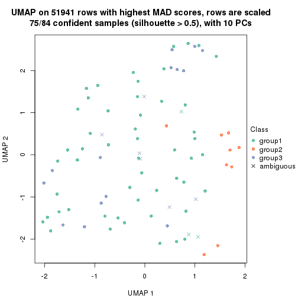</p>

</div>
<div id='tab-MAD-mclust-dimension-reduction-3'>
<pre><code class="r">dimension_reduction(res, k = 4, method = &quot;UMAP&quot;)
</code></pre>

<p></p>

</div>
<div id='tab-MAD-mclust-dimension-reduction-4'>
<pre><code class="r">dimension_reduction(res, k = 5, method = &quot;UMAP&quot;)
</code></pre>

<p></p>

</div>
<div id='tab-MAD-mclust-dimension-reduction-5'>
<pre><code class="r">dimension_reduction(res, k = 6, method = &quot;UMAP&quot;)
</code></pre>

<p>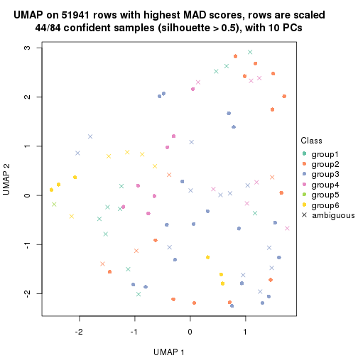</p>

</div>
</div>


Following heatmap shows how subgroups are split when increasing `k`:

```r
collect_classes(res)
```


Test correlation between subgroups and known annotations. If the known
annotation is numeric, one-way ANOVA test is applied, and if the known
annotation is discrete, chi-squared contingency table test is applied.

```r
test_to_known_factors(res)
```

```
#>             n agent(p) disease.state(p) gender(p) individual(p) k
#> MAD:mclust 35    0.492           0.5448    1.0000      2.82e-02 2
#> MAD:mclust 75    0.794           0.2152    0.1781      1.81e-06 3
#> MAD:mclust 58    0.731           0.3302    0.1060      9.75e-06 4
#> MAD:mclust 45    0.948           0.1123    0.0576      1.57e-04 5
#> MAD:mclust 44    0.787           0.0634    0.0821      2.09e-05 6
```


If matrix rows can be associated to genes, consider to use `GO_Enrichment(res,
...)` to perform function enrichment for the signature genes.


 

---------------------------------------------------


### MAD:NMF


The object with results only for a single top-value method and a single partition method 
can be extracted as:

```r
res = res_list["MAD", "NMF"]
# you can also extract it by
# res = res_list["MAD:NMF"]
```

A summary of `res` and all the functions that can be applied to it:

```r
res
```

```
#> A 'ConsensusPartition' object with k = 2, 3, 4, 5, 6.
#>   On a matrix with 51941 rows and 84 columns.
#>   Top rows (1000, 2000, 3000, 4000, 5000) are extracted by 'MAD' method.
#>   Subgroups are detected by 'NMF' method.
#>   Performed in total 1250 partitions by row resampling.
#>   Best k for subgroups seems to be 2.
#> 
#> Following methods can be applied to this 'ConsensusPartition' object:
#>  [1] "cola_report"             "collect_classes"         "collect_plots"          
#>  [4] "collect_stats"           "colnames"                "compare_signatures"     
#>  [7] "consensus_heatmap"       "dimension_reduction"     "functional_enrichment"  
#> [10] "get_anno_col"            "get_anno"                "get_classes"            
#> [13] "get_consensus"           "get_matrix"              "get_membership"         
#> [16] "get_param"               "get_signatures"          "get_stats"              
#> [19] "is_best_k"               "is_stable_k"             "membership_heatmap"     
#> [22] "ncol"                    "nrow"                    "plot_ecdf"              
#> [25] "rownames"                "select_partition_number" "show"                   
#> [28] "suggest_best_k"          "test_to_known_factors"
```

`collect_plots()` function collects all the plots made from `res` for all `k` (number of partitions)
into one single page to provide an easy and fast comparison between different `k`.

```r
collect_plots(res)
```


The plots are:

- The first row: a plot of the ECDF (Empirical cumulative distribution
  function) curves of the consensus matrix for each `k` and the heatmap of
  predicted classes for each `k`.
- The second row: heatmaps of the consensus matrix for each `k`.
- The third row: heatmaps of the membership matrix for each `k`.
- The fouth row: heatmaps of the signatures for each `k`.

All the plots in panels can be made by individual functions and they are
plotted later in this section.

`select_partition_number()` produces several plots showing different
statistics for choosing "optimized" `k`. There are following statistics:

- ECDF curves of the consensus matrix for each `k`;
- 1-PAC. [The PAC
  score](https://en.wikipedia.org/wiki/Consensus_clustering#Over-interpretation_potential_of_consensus_clustering)
  measures the proportion of the ambiguous subgrouping.
- Mean silhouette score.
- Concordance. The mean probability of fiting the consensus class ids in all
  partitions.
- Area increased. Denote $A_k$ as the area under the ECDF curve for current
  `k`, the area increased is defined as $A_k - A_{k-1}$.
- Rand index. The percent of pairs of samples that are both in a same cluster
  or both are not in a same cluster in the partition of k and k-1.
- Jaccard index. The ratio of pairs of samples are both in a same cluster in
  the partition of k and k-1 and the pairs of samples are both in a same
  cluster in the partition k or k-1.

The detailed explanations of these statistics can be found in [the cola
vignette](http://bioconductor.org/packages/devel/bioc/vignettes/cola/inst/doc/cola.html#toc_13).

Generally speaking, lower PAC score, higher mean silhouette score or higher
concordance corresponds to better partition. Rand index and Jaccard index
measure how similar the current partition is compared to partition with `k-1`.
If they are too similar, we won't accept `k` is better than `k-1`.

```r
select_partition_number(res)
```


The numeric values for all these statistics can be obtained by `get_stats()`.

```r
get_stats(res)
```

```
#>   k 1-PAC mean_silhouette concordance area_increased  Rand Jaccard
#> 2 2 0.204           0.667       0.815         0.4922 0.494   0.494
#> 3 3 0.236           0.477       0.719         0.3333 0.690   0.455
#> 4 4 0.299           0.345       0.609         0.1318 0.790   0.470
#> 5 5 0.351           0.260       0.512         0.0713 0.844   0.489
#> 6 6 0.420           0.237       0.482         0.0453 0.871   0.497
```

`suggest_best_k()` suggests the best $k$ based on these statistics. The rules are as follows:

- All $k$ with Jaccard index larger than 0.95 are removed because the increase of
  the partition number does not provides enough extra information. If all $k$ are removed,
  the best $k$ is assigned by `NA`.
- For $k$ with 1-PAC larger than 0.9, the maximal $k$ is taken as the "best k". Other $k$ is called "optional k".
- If it does not fit the second rule. The $k$ with the highest vote of highest
  1-PAC, mean silhouette and concordance is taken as the "best k".

```r
suggest_best_k(res)
```

```
#> [1] 2
```


Following shows the table of the partitions (You need to click the **show/hide
code output** link to see it). The membership matrix (columns with name `p*`)
is inferred by
[`clue::cl_consensus()`](https://www.rdocumentation.org/link/cl_consensus?package=clue)
function with the `SE` method. Basically the value in the membership matrix
represents the probability to belong to a certain group. The finall class
label for an item is determined with the group with highest probability it
belongs to.

In `get_classes()` function, the entropy is calculated from the membership
matrix and the silhouette score is calculated from the consensus matrix.


<script>
$( function() {
	$( '#tabs-MAD-NMF-get-classes' ).tabs();
} );
</script>
<div id='tabs-MAD-NMF-get-classes'>
<ul>
<li><a href='#tab-MAD-NMF-get-classes-1'>k = 2</a></li>
<li><a href='#tab-MAD-NMF-get-classes-2'>k = 3</a></li>
<li><a href='#tab-MAD-NMF-get-classes-3'>k = 4</a></li>
<li><a href='#tab-MAD-NMF-get-classes-4'>k = 5</a></li>
<li><a href='#tab-MAD-NMF-get-classes-5'>k = 6</a></li>
</ul>

<div id='tab-MAD-NMF-get-classes-1'>
<p><a id='tab-MAD-NMF-get-classes-1-a' style='color:#0366d6' href='#'>show/hide code output</a></p>
<pre><code class="r">cbind(get_classes(res, k = 2), get_membership(res, k = 2))
</code></pre>

<pre><code>#&gt;            class entropy silhouette    p1    p2
#&gt; GSM1269647     2  0.7299      0.728 0.204 0.796
#&gt; GSM1269655     1  0.8909      0.600 0.692 0.308
#&gt; GSM1269663     2  1.0000     -0.104 0.496 0.504
#&gt; GSM1269671     2  0.3431      0.784 0.064 0.936
#&gt; GSM1269679     1  0.3114      0.780 0.944 0.056
#&gt; GSM1269693     1  0.8443      0.627 0.728 0.272
#&gt; GSM1269701     1  0.3114      0.778 0.944 0.056
#&gt; GSM1269709     2  0.9795      0.325 0.416 0.584
#&gt; GSM1269715     1  0.3274      0.771 0.940 0.060
#&gt; GSM1269717     1  0.3114      0.775 0.944 0.056
#&gt; GSM1269721     2  0.2948      0.774 0.052 0.948
#&gt; GSM1269723     1  0.6438      0.734 0.836 0.164
#&gt; GSM1269645     1  0.9044      0.575 0.680 0.320
#&gt; GSM1269653     2  0.7299      0.735 0.204 0.796
#&gt; GSM1269661     1  0.9552      0.366 0.624 0.376
#&gt; GSM1269669     1  0.0672      0.781 0.992 0.008
#&gt; GSM1269677     2  0.2423      0.774 0.040 0.960
#&gt; GSM1269685     1  0.9635      0.452 0.612 0.388
#&gt; GSM1269691     2  0.9552      0.298 0.376 0.624
#&gt; GSM1269699     2  0.3733      0.783 0.072 0.928
#&gt; GSM1269707     2  0.2423      0.786 0.040 0.960
#&gt; GSM1269651     2  0.2603      0.785 0.044 0.956
#&gt; GSM1269659     2  0.3584      0.765 0.068 0.932
#&gt; GSM1269667     1  0.3879      0.775 0.924 0.076
#&gt; GSM1269675     2  0.6801      0.747 0.180 0.820
#&gt; GSM1269683     1  0.3274      0.783 0.940 0.060
#&gt; GSM1269689     2  0.7674      0.713 0.224 0.776
#&gt; GSM1269697     2  0.8081      0.700 0.248 0.752
#&gt; GSM1269705     2  0.6343      0.757 0.160 0.840
#&gt; GSM1269713     2  0.8813      0.619 0.300 0.700
#&gt; GSM1269719     2  0.8608      0.537 0.284 0.716
#&gt; GSM1269725     2  0.9087      0.576 0.324 0.676
#&gt; GSM1269727     1  0.2236      0.781 0.964 0.036
#&gt; GSM1269649     1  0.9522      0.397 0.628 0.372
#&gt; GSM1269657     2  0.3274      0.767 0.060 0.940
#&gt; GSM1269665     1  0.3879      0.789 0.924 0.076
#&gt; GSM1269673     1  0.6247      0.758 0.844 0.156
#&gt; GSM1269681     2  0.2236      0.783 0.036 0.964
#&gt; GSM1269687     1  0.9358      0.501 0.648 0.352
#&gt; GSM1269695     2  0.9661      0.393 0.392 0.608
#&gt; GSM1269703     1  0.8327      0.662 0.736 0.264
#&gt; GSM1269711     1  0.9286      0.474 0.656 0.344
#&gt; GSM1269646     2  0.7815      0.704 0.232 0.768
#&gt; GSM1269654     1  0.9286      0.565 0.656 0.344
#&gt; GSM1269662     2  0.8081      0.662 0.248 0.752
#&gt; GSM1269670     2  0.5842      0.766 0.140 0.860
#&gt; GSM1269678     1  0.1843      0.781 0.972 0.028
#&gt; GSM1269692     1  0.8443      0.622 0.728 0.272
#&gt; GSM1269700     1  0.4022      0.776 0.920 0.080
#&gt; GSM1269708     1  0.8608      0.610 0.716 0.284
#&gt; GSM1269714     1  0.2778      0.775 0.952 0.048
#&gt; GSM1269716     1  0.2778      0.775 0.952 0.048
#&gt; GSM1269720     2  0.2948      0.773 0.052 0.948
#&gt; GSM1269722     1  0.6247      0.751 0.844 0.156
#&gt; GSM1269644     2  0.6712      0.688 0.176 0.824
#&gt; GSM1269652     2  0.3431      0.782 0.064 0.936
#&gt; GSM1269660     1  0.9427      0.452 0.640 0.360
#&gt; GSM1269668     1  0.1633      0.781 0.976 0.024
#&gt; GSM1269676     2  0.2423      0.773 0.040 0.960
#&gt; GSM1269684     1  0.7815      0.673 0.768 0.232
#&gt; GSM1269690     1  0.9580      0.474 0.620 0.380
#&gt; GSM1269698     2  0.3584      0.782 0.068 0.932
#&gt; GSM1269706     2  0.1633      0.782 0.024 0.976
#&gt; GSM1269650     2  0.1843      0.783 0.028 0.972
#&gt; GSM1269658     2  0.3274      0.768 0.060 0.940
#&gt; GSM1269666     1  0.2043      0.780 0.968 0.032
#&gt; GSM1269674     2  0.5178      0.775 0.116 0.884
#&gt; GSM1269682     1  0.2603      0.787 0.956 0.044
#&gt; GSM1269688     2  0.8207      0.688 0.256 0.744
#&gt; GSM1269696     2  0.8909      0.608 0.308 0.692
#&gt; GSM1269704     2  0.5519      0.772 0.128 0.872
#&gt; GSM1269712     1  0.5059      0.771 0.888 0.112
#&gt; GSM1269718     2  0.9580      0.322 0.380 0.620
#&gt; GSM1269724     1  0.6048      0.743 0.852 0.148
#&gt; GSM1269726     1  0.2603      0.786 0.956 0.044
#&gt; GSM1269648     1  0.9970      0.105 0.532 0.468
#&gt; GSM1269656     2  0.3584      0.768 0.068 0.932
#&gt; GSM1269664     1  0.3431      0.788 0.936 0.064
#&gt; GSM1269672     1  0.6148      0.752 0.848 0.152
#&gt; GSM1269680     2  0.0938      0.781 0.012 0.988
#&gt; GSM1269686     1  0.3114      0.774 0.944 0.056
#&gt; GSM1269694     2  0.9393      0.448 0.356 0.644
#&gt; GSM1269702     2  0.7528      0.656 0.216 0.784
#&gt; GSM1269710     1  0.9460      0.411 0.636 0.364
</code></pre>

<script>
$('#tab-MAD-NMF-get-classes-1-a').parent().next().next().hide();
$('#tab-MAD-NMF-get-classes-1-a').click(function(){
  $('#tab-MAD-NMF-get-classes-1-a').parent().next().next().toggle();
  return(false);
});
</script>
</div>

<div id='tab-MAD-NMF-get-classes-2'>
<p><a id='tab-MAD-NMF-get-classes-2-a' style='color:#0366d6' href='#'>show/hide code output</a></p>
<pre><code class="r">cbind(get_classes(res, k = 3), get_membership(res, k = 3))
</code></pre>

<pre><code>#&gt;            class entropy silhouette    p1    p2    p3
#&gt; GSM1269647     1   0.188     0.6754 0.952 0.044 0.004
#&gt; GSM1269655     1   0.983     0.0132 0.408 0.252 0.340
#&gt; GSM1269663     2   0.944     0.1148 0.180 0.444 0.376
#&gt; GSM1269671     1   0.384     0.6421 0.872 0.116 0.012
#&gt; GSM1269679     3   0.652     0.1695 0.488 0.004 0.508
#&gt; GSM1269693     3   0.608     0.2966 0.000 0.388 0.612
#&gt; GSM1269701     3   0.652     0.1002 0.492 0.004 0.504
#&gt; GSM1269709     1   0.865     0.4438 0.600 0.192 0.208
#&gt; GSM1269715     3   0.141     0.6548 0.000 0.036 0.964
#&gt; GSM1269717     3   0.175     0.6541 0.000 0.048 0.952
#&gt; GSM1269721     2   0.640     0.4795 0.372 0.620 0.008
#&gt; GSM1269723     1   0.641     0.4696 0.700 0.028 0.272
#&gt; GSM1269645     3   0.878     0.1708 0.416 0.112 0.472
#&gt; GSM1269653     1   0.670     0.4715 0.692 0.268 0.040
#&gt; GSM1269661     1   0.806     0.0570 0.532 0.068 0.400
#&gt; GSM1269669     3   0.249     0.6592 0.060 0.008 0.932
#&gt; GSM1269677     2   0.216     0.6914 0.064 0.936 0.000
#&gt; GSM1269685     2   0.709     0.4622 0.056 0.676 0.268
#&gt; GSM1269691     2   0.540     0.6301 0.060 0.816 0.124
#&gt; GSM1269699     1   0.450     0.5780 0.804 0.196 0.000
#&gt; GSM1269707     2   0.724     0.2762 0.432 0.540 0.028
#&gt; GSM1269651     2   0.674     0.2854 0.428 0.560 0.012
#&gt; GSM1269659     2   0.294     0.6925 0.072 0.916 0.012
#&gt; GSM1269667     3   0.652     0.1658 0.484 0.004 0.512
#&gt; GSM1269675     1   0.296     0.6701 0.912 0.080 0.008
#&gt; GSM1269683     3   0.315     0.6625 0.048 0.036 0.916
#&gt; GSM1269689     1   0.257     0.6735 0.936 0.032 0.032
#&gt; GSM1269697     1   0.333     0.6686 0.904 0.076 0.020
#&gt; GSM1269705     1   0.362     0.6521 0.884 0.104 0.012
#&gt; GSM1269713     1   0.158     0.6805 0.964 0.008 0.028
#&gt; GSM1269719     2   0.919     0.3926 0.256 0.536 0.208
#&gt; GSM1269725     1   0.212     0.6772 0.948 0.012 0.040
#&gt; GSM1269727     3   0.619     0.4382 0.364 0.004 0.632
#&gt; GSM1269649     1   0.583     0.5795 0.784 0.052 0.164
#&gt; GSM1269657     2   0.153     0.6898 0.032 0.964 0.004
#&gt; GSM1269665     3   0.618     0.6339 0.156 0.072 0.772
#&gt; GSM1269673     3   0.626     0.5539 0.052 0.196 0.752
#&gt; GSM1269681     1   0.621     0.0922 0.572 0.428 0.000
#&gt; GSM1269687     3   0.909     0.4220 0.176 0.288 0.536
#&gt; GSM1269695     1   0.962     0.2229 0.472 0.252 0.276
#&gt; GSM1269703     3   0.685     0.5796 0.064 0.224 0.712
#&gt; GSM1269711     1   0.834     0.3559 0.592 0.112 0.296
#&gt; GSM1269646     1   0.203     0.6787 0.952 0.032 0.016
#&gt; GSM1269654     3   0.968     0.1584 0.220 0.352 0.428
#&gt; GSM1269662     2   0.771     0.5624 0.196 0.676 0.128
#&gt; GSM1269670     1   0.287     0.6701 0.916 0.076 0.008
#&gt; GSM1269678     3   0.423     0.6351 0.160 0.004 0.836
#&gt; GSM1269692     3   0.648     0.1419 0.004 0.452 0.544
#&gt; GSM1269700     1   0.608     0.3306 0.652 0.004 0.344
#&gt; GSM1269708     3   0.919     0.2435 0.348 0.160 0.492
#&gt; GSM1269714     3   0.212     0.6578 0.012 0.040 0.948
#&gt; GSM1269716     3   0.176     0.6561 0.004 0.040 0.956
#&gt; GSM1269720     2   0.575     0.5579 0.296 0.700 0.004
#&gt; GSM1269722     3   0.738     0.3079 0.404 0.036 0.560
#&gt; GSM1269644     2   0.425     0.6743 0.048 0.872 0.080
#&gt; GSM1269652     2   0.754     0.4590 0.332 0.612 0.056
#&gt; GSM1269660     1   0.861     0.2893 0.568 0.128 0.304
#&gt; GSM1269668     3   0.338     0.6538 0.100 0.008 0.892
#&gt; GSM1269676     2   0.186     0.6911 0.052 0.948 0.000
#&gt; GSM1269684     3   0.623     0.4324 0.012 0.316 0.672
#&gt; GSM1269690     2   0.569     0.5780 0.036 0.780 0.184
#&gt; GSM1269698     1   0.502     0.5165 0.760 0.240 0.000
#&gt; GSM1269706     2   0.716     0.4552 0.332 0.628 0.040
#&gt; GSM1269650     2   0.658     0.3219 0.420 0.572 0.008
#&gt; GSM1269658     2   0.303     0.6846 0.076 0.912 0.012
#&gt; GSM1269666     3   0.599     0.5284 0.304 0.008 0.688
#&gt; GSM1269674     1   0.507     0.5916 0.792 0.196 0.012
#&gt; GSM1269682     3   0.353     0.6581 0.068 0.032 0.900
#&gt; GSM1269688     1   0.379     0.6601 0.892 0.060 0.048
#&gt; GSM1269696     1   0.277     0.6773 0.928 0.048 0.024
#&gt; GSM1269704     1   0.280     0.6573 0.908 0.092 0.000
#&gt; GSM1269712     3   0.808     0.3098 0.408 0.068 0.524
#&gt; GSM1269718     1   0.898     0.1330 0.496 0.368 0.136
#&gt; GSM1269724     1   0.590     0.4273 0.700 0.008 0.292
#&gt; GSM1269726     3   0.599     0.5221 0.304 0.008 0.688
#&gt; GSM1269648     1   0.958     0.2673 0.480 0.252 0.268
#&gt; GSM1269656     2   0.375     0.6777 0.096 0.884 0.020
#&gt; GSM1269664     3   0.706     0.5865 0.236 0.068 0.696
#&gt; GSM1269672     3   0.782     0.3886 0.080 0.300 0.620
#&gt; GSM1269680     2   0.565     0.5333 0.312 0.688 0.000
#&gt; GSM1269686     3   0.393     0.6500 0.028 0.092 0.880
#&gt; GSM1269694     1   0.978     0.1023 0.420 0.336 0.244
#&gt; GSM1269702     2   0.595     0.6408 0.116 0.792 0.092
#&gt; GSM1269710     1   0.936     0.2016 0.484 0.184 0.332
</code></pre>

<script>
$('#tab-MAD-NMF-get-classes-2-a').parent().next().next().hide();
$('#tab-MAD-NMF-get-classes-2-a').click(function(){
  $('#tab-MAD-NMF-get-classes-2-a').parent().next().next().toggle();
  return(false);
});
</script>
</div>

<div id='tab-MAD-NMF-get-classes-3'>
<p><a id='tab-MAD-NMF-get-classes-3-a' style='color:#0366d6' href='#'>show/hide code output</a></p>
<pre><code class="r">cbind(get_classes(res, k = 4), get_membership(res, k = 4))
</code></pre>

<pre><code>#&gt;            class entropy silhouette    p1    p2    p3    p4
#&gt; GSM1269647     2   0.381     0.5397 0.156 0.824 0.000 0.020
#&gt; GSM1269655     2   0.846     0.2374 0.048 0.488 0.216 0.248
#&gt; GSM1269663     4   0.844     0.3186 0.084 0.148 0.240 0.528
#&gt; GSM1269671     2   0.576     0.4136 0.304 0.644 0.000 0.052
#&gt; GSM1269679     2   0.645     0.2604 0.076 0.544 0.380 0.000
#&gt; GSM1269693     3   0.623     0.0934 0.036 0.008 0.492 0.464
#&gt; GSM1269701     2   0.728     0.3161 0.168 0.508 0.324 0.000
#&gt; GSM1269709     1   0.916     0.0181 0.380 0.356 0.128 0.136
#&gt; GSM1269715     3   0.240     0.6081 0.048 0.000 0.920 0.032
#&gt; GSM1269717     3   0.232     0.6148 0.036 0.004 0.928 0.032
#&gt; GSM1269721     4   0.785     0.2512 0.248 0.240 0.012 0.500
#&gt; GSM1269723     2   0.712     0.5113 0.100 0.648 0.200 0.052
#&gt; GSM1269645     1   0.942    -0.1255 0.340 0.276 0.288 0.096
#&gt; GSM1269653     1   0.683     0.3255 0.552 0.344 0.004 0.100
#&gt; GSM1269661     2   0.894     0.0720 0.236 0.416 0.284 0.064
#&gt; GSM1269669     3   0.460     0.5900 0.132 0.072 0.796 0.000
#&gt; GSM1269677     4   0.334     0.5147 0.128 0.016 0.000 0.856
#&gt; GSM1269685     1   0.750    -0.0911 0.444 0.004 0.156 0.396
#&gt; GSM1269691     4   0.666     0.1386 0.420 0.008 0.064 0.508
#&gt; GSM1269699     1   0.592     0.1242 0.556 0.404 0.000 0.040
#&gt; GSM1269707     1   0.669     0.4631 0.620 0.180 0.000 0.200
#&gt; GSM1269651     4   0.679     0.3914 0.096 0.312 0.008 0.584
#&gt; GSM1269659     4   0.395     0.5067 0.144 0.004 0.024 0.828
#&gt; GSM1269667     2   0.638     0.0377 0.064 0.500 0.436 0.000
#&gt; GSM1269675     2   0.544     0.3590 0.396 0.588 0.004 0.012
#&gt; GSM1269683     3   0.401     0.6236 0.020 0.060 0.856 0.064
#&gt; GSM1269689     2   0.543     0.3872 0.336 0.640 0.004 0.020
#&gt; GSM1269697     2   0.477     0.5395 0.148 0.788 0.004 0.060
#&gt; GSM1269705     2   0.562     0.5131 0.176 0.728 0.004 0.092
#&gt; GSM1269713     2   0.423     0.5552 0.140 0.820 0.032 0.008
#&gt; GSM1269719     4   0.842     0.4187 0.116 0.232 0.112 0.540
#&gt; GSM1269725     2   0.451     0.5571 0.100 0.828 0.036 0.036
#&gt; GSM1269727     3   0.682     0.1937 0.060 0.376 0.544 0.020
#&gt; GSM1269649     2   0.601     0.2951 0.400 0.560 0.036 0.004
#&gt; GSM1269657     4   0.404     0.4899 0.168 0.008 0.012 0.812
#&gt; GSM1269665     3   0.815     0.5134 0.148 0.176 0.580 0.096
#&gt; GSM1269673     3   0.695     0.1197 0.416 0.004 0.484 0.096
#&gt; GSM1269681     4   0.683     0.1942 0.100 0.424 0.000 0.476
#&gt; GSM1269687     1   0.849    -0.1068 0.428 0.076 0.380 0.116
#&gt; GSM1269695     1   0.560     0.4791 0.756 0.144 0.076 0.024
#&gt; GSM1269703     3   0.736     0.4728 0.228 0.056 0.620 0.096
#&gt; GSM1269711     1   0.588     0.3873 0.672 0.248 0.080 0.000
#&gt; GSM1269646     2   0.249     0.5654 0.048 0.920 0.004 0.028
#&gt; GSM1269654     4   0.881    -0.0187 0.040 0.296 0.320 0.344
#&gt; GSM1269662     4   0.725     0.4922 0.116 0.128 0.092 0.664
#&gt; GSM1269670     2   0.468     0.5017 0.232 0.744 0.000 0.024
#&gt; GSM1269678     3   0.571     0.4961 0.064 0.236 0.696 0.004
#&gt; GSM1269692     3   0.677     0.0634 0.080 0.004 0.472 0.444
#&gt; GSM1269700     2   0.629     0.4625 0.092 0.648 0.256 0.004
#&gt; GSM1269708     1   0.982     0.1067 0.316 0.272 0.244 0.168
#&gt; GSM1269714     3   0.357     0.6076 0.080 0.012 0.872 0.036
#&gt; GSM1269716     3   0.203     0.6144 0.028 0.000 0.936 0.036
#&gt; GSM1269720     4   0.632     0.4490 0.168 0.172 0.000 0.660
#&gt; GSM1269722     3   0.768     0.0367 0.072 0.412 0.464 0.052
#&gt; GSM1269644     4   0.669     0.3609 0.320 0.020 0.064 0.596
#&gt; GSM1269652     1   0.609     0.4139 0.688 0.092 0.008 0.212
#&gt; GSM1269660     2   0.895     0.1591 0.188 0.472 0.240 0.100
#&gt; GSM1269668     3   0.517     0.5567 0.168 0.080 0.752 0.000
#&gt; GSM1269676     4   0.395     0.4905 0.172 0.012 0.004 0.812
#&gt; GSM1269684     3   0.719     0.2845 0.292 0.000 0.536 0.172
#&gt; GSM1269690     4   0.728     0.2012 0.348 0.004 0.140 0.508
#&gt; GSM1269698     2   0.681     0.0313 0.404 0.496 0.000 0.100
#&gt; GSM1269706     1   0.641     0.4256 0.656 0.124 0.004 0.216
#&gt; GSM1269650     4   0.681     0.3719 0.104 0.324 0.004 0.568
#&gt; GSM1269658     4   0.308     0.5396 0.064 0.012 0.028 0.896
#&gt; GSM1269666     3   0.576     0.1647 0.012 0.424 0.552 0.012
#&gt; GSM1269674     2   0.704     0.4212 0.196 0.624 0.016 0.164
#&gt; GSM1269682     3   0.478     0.6180 0.040 0.076 0.820 0.064
#&gt; GSM1269688     2   0.613     0.2115 0.420 0.540 0.012 0.028
#&gt; GSM1269696     2   0.377     0.5644 0.080 0.864 0.016 0.040
#&gt; GSM1269704     2   0.433     0.5251 0.176 0.792 0.000 0.032
#&gt; GSM1269712     2   0.766    -0.0888 0.044 0.444 0.432 0.080
#&gt; GSM1269718     2   0.908    -0.0835 0.144 0.392 0.112 0.352
#&gt; GSM1269724     2   0.602     0.5094 0.092 0.696 0.204 0.008
#&gt; GSM1269726     3   0.688     0.3510 0.080 0.308 0.592 0.020
#&gt; GSM1269648     1   0.605     0.4937 0.720 0.160 0.100 0.020
#&gt; GSM1269656     4   0.589     0.2545 0.392 0.012 0.020 0.576
#&gt; GSM1269664     3   0.858     0.4473 0.160 0.228 0.520 0.092
#&gt; GSM1269672     1   0.699     0.2765 0.588 0.016 0.296 0.100
#&gt; GSM1269680     4   0.632     0.4870 0.168 0.172 0.000 0.660
#&gt; GSM1269686     3   0.474     0.5017 0.240 0.008 0.740 0.012
#&gt; GSM1269694     1   0.672     0.4612 0.688 0.148 0.120 0.044
#&gt; GSM1269702     1   0.570     0.1252 0.608 0.000 0.036 0.356
#&gt; GSM1269710     1   0.695     0.4251 0.644 0.196 0.136 0.024
</code></pre>

<script>
$('#tab-MAD-NMF-get-classes-3-a').parent().next().next().hide();
$('#tab-MAD-NMF-get-classes-3-a').click(function(){
  $('#tab-MAD-NMF-get-classes-3-a').parent().next().next().toggle();
  return(false);
});
</script>
</div>

<div id='tab-MAD-NMF-get-classes-4'>
<p><a id='tab-MAD-NMF-get-classes-4-a' style='color:#0366d6' href='#'>show/hide code output</a></p>
<pre><code class="r">cbind(get_classes(res, k = 5), get_membership(res, k = 5))
</code></pre>

<pre><code>#&gt;            class entropy silhouette    p1    p2    p3    p4    p5
#&gt; GSM1269647     3   0.448     0.4551 0.124 0.084 0.780 0.004 0.008
#&gt; GSM1269655     3   0.865     0.0153 0.064 0.344 0.352 0.176 0.064
#&gt; GSM1269663     2   0.747     0.4436 0.076 0.600 0.056 0.144 0.124
#&gt; GSM1269671     1   0.674    -0.0808 0.492 0.144 0.340 0.000 0.024
#&gt; GSM1269679     3   0.564     0.3660 0.048 0.012 0.624 0.304 0.012
#&gt; GSM1269693     4   0.720     0.0364 0.012 0.308 0.008 0.432 0.240
#&gt; GSM1269701     3   0.699     0.3279 0.188 0.024 0.508 0.276 0.004
#&gt; GSM1269709     3   0.855     0.1896 0.156 0.048 0.432 0.096 0.268
#&gt; GSM1269715     4   0.295     0.5588 0.004 0.020 0.008 0.876 0.092
#&gt; GSM1269717     4   0.317     0.5542 0.000 0.020 0.012 0.856 0.112
#&gt; GSM1269721     3   0.814    -0.1458 0.056 0.308 0.352 0.016 0.268
#&gt; GSM1269723     3   0.730     0.4492 0.112 0.112 0.576 0.188 0.012
#&gt; GSM1269645     1   0.825     0.0630 0.436 0.284 0.084 0.168 0.028
#&gt; GSM1269653     1   0.735     0.2777 0.424 0.024 0.296 0.004 0.252
#&gt; GSM1269661     1   0.915     0.0460 0.324 0.160 0.268 0.204 0.044
#&gt; GSM1269669     4   0.670     0.4665 0.208 0.024 0.100 0.624 0.044
#&gt; GSM1269677     5   0.490     0.0989 0.012 0.396 0.012 0.000 0.580
#&gt; GSM1269685     5   0.545     0.4136 0.136 0.020 0.012 0.108 0.724
#&gt; GSM1269691     5   0.553     0.4765 0.144 0.076 0.000 0.064 0.716
#&gt; GSM1269699     1   0.630     0.2749 0.556 0.016 0.304 0.000 0.124
#&gt; GSM1269707     1   0.700     0.1860 0.436 0.020 0.196 0.000 0.348
#&gt; GSM1269651     2   0.387     0.5352 0.012 0.824 0.088 0.000 0.076
#&gt; GSM1269659     5   0.488     0.0416 0.008 0.412 0.008 0.004 0.568
#&gt; GSM1269667     3   0.803     0.1263 0.176 0.100 0.380 0.340 0.004
#&gt; GSM1269675     1   0.663    -0.0975 0.476 0.120 0.384 0.008 0.012
#&gt; GSM1269683     4   0.456     0.5543 0.048 0.096 0.048 0.800 0.008
#&gt; GSM1269689     3   0.679     0.2620 0.304 0.056 0.556 0.012 0.072
#&gt; GSM1269697     3   0.588     0.4586 0.124 0.096 0.712 0.016 0.052
#&gt; GSM1269705     3   0.621     0.3694 0.204 0.168 0.612 0.004 0.012
#&gt; GSM1269713     3   0.551     0.4580 0.160 0.068 0.724 0.032 0.016
#&gt; GSM1269719     2   0.720     0.4950 0.096 0.636 0.088 0.080 0.100
#&gt; GSM1269725     3   0.298     0.4880 0.012 0.072 0.884 0.024 0.008
#&gt; GSM1269727     4   0.829     0.0255 0.168 0.140 0.276 0.408 0.008
#&gt; GSM1269649     1   0.594     0.1436 0.612 0.052 0.296 0.036 0.004
#&gt; GSM1269657     5   0.462     0.2354 0.020 0.324 0.004 0.000 0.652
#&gt; GSM1269665     4   0.836     0.3477 0.232 0.204 0.080 0.448 0.036
#&gt; GSM1269673     5   0.829    -0.0463 0.264 0.056 0.024 0.320 0.336
#&gt; GSM1269681     2   0.612     0.4064 0.072 0.636 0.232 0.000 0.060
#&gt; GSM1269687     1   0.856    -0.0493 0.392 0.088 0.044 0.312 0.164
#&gt; GSM1269695     1   0.473     0.3770 0.776 0.016 0.036 0.028 0.144
#&gt; GSM1269703     4   0.821     0.2666 0.328 0.132 0.032 0.420 0.088
#&gt; GSM1269711     1   0.769     0.2569 0.472 0.012 0.296 0.068 0.152
#&gt; GSM1269646     3   0.544     0.4554 0.116 0.156 0.704 0.024 0.000
#&gt; GSM1269654     2   0.839     0.1236 0.012 0.376 0.204 0.296 0.112
#&gt; GSM1269662     2   0.692     0.4549 0.092 0.636 0.044 0.060 0.168
#&gt; GSM1269670     1   0.627    -0.1534 0.468 0.152 0.380 0.000 0.000
#&gt; GSM1269678     4   0.653     0.2815 0.092 0.012 0.312 0.560 0.024
#&gt; GSM1269692     4   0.702     0.0385 0.012 0.264 0.000 0.424 0.300
#&gt; GSM1269700     3   0.698     0.4132 0.124 0.084 0.568 0.224 0.000
#&gt; GSM1269708     3   0.911     0.1137 0.128 0.068 0.332 0.156 0.316
#&gt; GSM1269714     4   0.482     0.5442 0.020 0.032 0.036 0.776 0.136
#&gt; GSM1269716     4   0.340     0.5578 0.004 0.020 0.024 0.856 0.096
#&gt; GSM1269720     2   0.699     0.1494 0.024 0.404 0.172 0.000 0.400
#&gt; GSM1269722     3   0.815     0.1526 0.040 0.120 0.436 0.324 0.080
#&gt; GSM1269644     2   0.797    -0.1135 0.240 0.364 0.008 0.060 0.328
#&gt; GSM1269652     5   0.728    -0.1493 0.364 0.016 0.196 0.012 0.412
#&gt; GSM1269660     1   0.915    -0.0174 0.308 0.244 0.252 0.156 0.040
#&gt; GSM1269668     4   0.604     0.4815 0.172 0.008 0.152 0.652 0.016
#&gt; GSM1269676     5   0.499     0.2305 0.028 0.320 0.012 0.000 0.640
#&gt; GSM1269684     4   0.758     0.1637 0.196 0.052 0.004 0.436 0.312
#&gt; GSM1269690     5   0.566     0.4462 0.096 0.072 0.000 0.120 0.712
#&gt; GSM1269698     3   0.754    -0.0264 0.344 0.124 0.436 0.000 0.096
#&gt; GSM1269706     1   0.711     0.1406 0.412 0.028 0.184 0.000 0.376
#&gt; GSM1269650     2   0.449     0.5376 0.032 0.792 0.088 0.000 0.088
#&gt; GSM1269658     2   0.475     0.1190 0.008 0.564 0.000 0.008 0.420
#&gt; GSM1269666     4   0.642     0.0925 0.040 0.064 0.368 0.524 0.004
#&gt; GSM1269674     3   0.761     0.1500 0.304 0.320 0.344 0.020 0.012
#&gt; GSM1269682     4   0.514     0.5387 0.056 0.132 0.056 0.752 0.004
#&gt; GSM1269688     3   0.711     0.2100 0.280 0.044 0.536 0.012 0.128
#&gt; GSM1269696     3   0.634     0.3945 0.224 0.168 0.592 0.012 0.004
#&gt; GSM1269704     3   0.538     0.4048 0.180 0.080 0.708 0.000 0.032
#&gt; GSM1269712     3   0.769     0.0954 0.044 0.104 0.452 0.356 0.044
#&gt; GSM1269718     2   0.830     0.3142 0.172 0.500 0.184 0.088 0.056
#&gt; GSM1269724     3   0.543     0.4690 0.056 0.060 0.740 0.132 0.012
#&gt; GSM1269726     4   0.760     0.3587 0.108 0.120 0.200 0.552 0.020
#&gt; GSM1269648     1   0.668     0.3154 0.592 0.008 0.120 0.040 0.240
#&gt; GSM1269656     5   0.584     0.4375 0.192 0.136 0.012 0.004 0.656
#&gt; GSM1269664     4   0.911     0.2659 0.232 0.188 0.168 0.364 0.048
#&gt; GSM1269672     1   0.717    -0.0215 0.424 0.012 0.008 0.216 0.340
#&gt; GSM1269680     2   0.691     0.4200 0.104 0.580 0.100 0.000 0.216
#&gt; GSM1269686     4   0.680     0.3815 0.236 0.024 0.024 0.588 0.128
#&gt; GSM1269694     1   0.610     0.3679 0.700 0.052 0.048 0.048 0.152
#&gt; GSM1269702     5   0.574     0.1925 0.380 0.020 0.012 0.028 0.560
#&gt; GSM1269710     1   0.588     0.3925 0.700 0.008 0.076 0.064 0.152
</code></pre>

<script>
$('#tab-MAD-NMF-get-classes-4-a').parent().next().next().hide();
$('#tab-MAD-NMF-get-classes-4-a').click(function(){
  $('#tab-MAD-NMF-get-classes-4-a').parent().next().next().toggle();
  return(false);
});
</script>
</div>

<div id='tab-MAD-NMF-get-classes-5'>
<p><a id='tab-MAD-NMF-get-classes-5-a' style='color:#0366d6' href='#'>show/hide code output</a></p>
<pre><code class="r">cbind(get_classes(res, k = 6), get_membership(res, k = 6))
</code></pre>

<pre><code>#&gt;            class entropy silhouette    p1    p2    p3    p4    p5    p6
#&gt; GSM1269647     3   0.553     0.3548 0.016 0.172 0.652 0.004 0.148 0.008
#&gt; GSM1269655     2   0.765     0.1968 0.048 0.492 0.252 0.112 0.028 0.068
#&gt; GSM1269663     6   0.895    -0.0682 0.076 0.284 0.032 0.140 0.176 0.292
#&gt; GSM1269671     5   0.700     0.4639 0.144 0.168 0.180 0.000 0.504 0.004
#&gt; GSM1269679     3   0.651     0.3362 0.036 0.076 0.584 0.224 0.080 0.000
#&gt; GSM1269693     4   0.746     0.0386 0.040 0.120 0.012 0.416 0.060 0.352
#&gt; GSM1269701     3   0.773     0.2553 0.096 0.056 0.452 0.216 0.180 0.000
#&gt; GSM1269709     3   0.830     0.2595 0.152 0.068 0.480 0.048 0.112 0.140
#&gt; GSM1269715     4   0.401     0.4853 0.056 0.016 0.020 0.828 0.044 0.036
#&gt; GSM1269717     4   0.348     0.4876 0.040 0.036 0.028 0.856 0.004 0.036
#&gt; GSM1269721     6   0.858     0.0320 0.056 0.156 0.292 0.016 0.164 0.316
#&gt; GSM1269723     3   0.764     0.2715 0.016 0.168 0.484 0.124 0.188 0.020
#&gt; GSM1269645     5   0.839     0.0757 0.256 0.200 0.016 0.184 0.320 0.024
#&gt; GSM1269653     3   0.795    -0.0883 0.344 0.044 0.348 0.004 0.136 0.124
#&gt; GSM1269661     2   0.876     0.0535 0.232 0.320 0.128 0.176 0.140 0.004
#&gt; GSM1269669     4   0.693     0.2718 0.284 0.048 0.064 0.512 0.092 0.000
#&gt; GSM1269677     6   0.238     0.4399 0.020 0.080 0.004 0.000 0.004 0.892
#&gt; GSM1269685     6   0.742     0.1116 0.360 0.008 0.056 0.088 0.068 0.420
#&gt; GSM1269691     6   0.599     0.2881 0.324 0.008 0.004 0.084 0.032 0.548
#&gt; GSM1269699     1   0.750     0.0322 0.348 0.068 0.232 0.000 0.328 0.024
#&gt; GSM1269707     1   0.799     0.2597 0.416 0.048 0.228 0.008 0.208 0.092
#&gt; GSM1269651     2   0.572     0.2982 0.000 0.572 0.036 0.000 0.096 0.296
#&gt; GSM1269659     6   0.470     0.4338 0.028 0.100 0.008 0.012 0.088 0.764
#&gt; GSM1269667     4   0.825     0.0774 0.048 0.172 0.196 0.344 0.240 0.000
#&gt; GSM1269675     5   0.658     0.4087 0.120 0.088 0.192 0.000 0.580 0.020
#&gt; GSM1269683     4   0.573     0.4570 0.060 0.124 0.032 0.704 0.064 0.016
#&gt; GSM1269689     3   0.637     0.1812 0.136 0.048 0.540 0.000 0.268 0.008
#&gt; GSM1269697     3   0.643     0.3237 0.044 0.140 0.620 0.004 0.148 0.044
#&gt; GSM1269705     3   0.775     0.0727 0.076 0.244 0.388 0.004 0.256 0.032
#&gt; GSM1269713     3   0.548     0.3550 0.036 0.080 0.688 0.020 0.172 0.004
#&gt; GSM1269719     2   0.826     0.3458 0.120 0.472 0.060 0.068 0.076 0.204
#&gt; GSM1269725     3   0.450     0.4198 0.024 0.132 0.776 0.016 0.036 0.016
#&gt; GSM1269727     4   0.860     0.1228 0.044 0.140 0.216 0.340 0.236 0.024
#&gt; GSM1269649     5   0.729     0.3621 0.236 0.076 0.204 0.016 0.464 0.004
#&gt; GSM1269657     6   0.321     0.4634 0.080 0.048 0.008 0.000 0.012 0.852
#&gt; GSM1269665     4   0.769     0.0620 0.188 0.336 0.020 0.376 0.056 0.024
#&gt; GSM1269673     1   0.644     0.2890 0.612 0.064 0.020 0.216 0.028 0.060
#&gt; GSM1269681     2   0.624     0.3895 0.020 0.608 0.100 0.000 0.068 0.204
#&gt; GSM1269687     1   0.745     0.2576 0.548 0.116 0.040 0.188 0.068 0.040
#&gt; GSM1269695     1   0.501     0.3002 0.676 0.012 0.016 0.028 0.252 0.016
#&gt; GSM1269703     1   0.846    -0.1157 0.340 0.108 0.036 0.336 0.120 0.060
#&gt; GSM1269711     1   0.708     0.0625 0.440 0.016 0.316 0.028 0.184 0.016
#&gt; GSM1269646     3   0.646     0.2623 0.016 0.244 0.524 0.004 0.196 0.016
#&gt; GSM1269654     2   0.851     0.1506 0.024 0.364 0.164 0.260 0.048 0.140
#&gt; GSM1269662     6   0.872    -0.0390 0.068 0.260 0.040 0.076 0.236 0.320
#&gt; GSM1269670     5   0.687     0.4519 0.112 0.228 0.168 0.000 0.492 0.000
#&gt; GSM1269678     4   0.675     0.2261 0.056 0.064 0.320 0.504 0.056 0.000
#&gt; GSM1269692     4   0.729    -0.0588 0.064 0.092 0.000 0.400 0.064 0.380
#&gt; GSM1269700     3   0.764     0.2850 0.056 0.104 0.496 0.176 0.164 0.004
#&gt; GSM1269708     3   0.918     0.1687 0.168 0.056 0.344 0.104 0.120 0.208
#&gt; GSM1269714     4   0.623     0.4430 0.092 0.036 0.048 0.684 0.064 0.076
#&gt; GSM1269716     4   0.387     0.4868 0.036 0.024 0.036 0.836 0.012 0.056
#&gt; GSM1269720     6   0.727     0.2736 0.028 0.116 0.152 0.008 0.160 0.536
#&gt; GSM1269722     3   0.856     0.0600 0.032 0.144 0.344 0.296 0.136 0.048
#&gt; GSM1269644     6   0.844     0.0893 0.288 0.208 0.016 0.092 0.064 0.332
#&gt; GSM1269652     1   0.746     0.2189 0.424 0.012 0.284 0.004 0.108 0.168
#&gt; GSM1269660     2   0.890     0.1164 0.144 0.384 0.140 0.152 0.152 0.028
#&gt; GSM1269668     4   0.600     0.3917 0.204 0.024 0.120 0.620 0.032 0.000
#&gt; GSM1269676     6   0.339     0.4564 0.068 0.064 0.012 0.000 0.012 0.844
#&gt; GSM1269684     1   0.723     0.0192 0.396 0.052 0.008 0.376 0.024 0.144
#&gt; GSM1269690     6   0.658     0.3130 0.260 0.020 0.004 0.140 0.036 0.540
#&gt; GSM1269698     3   0.818     0.0149 0.232 0.192 0.320 0.000 0.224 0.032
#&gt; GSM1269706     1   0.809     0.2443 0.388 0.032 0.248 0.008 0.176 0.148
#&gt; GSM1269650     2   0.618     0.3374 0.012 0.556 0.052 0.000 0.088 0.292
#&gt; GSM1269658     6   0.536     0.3384 0.028 0.188 0.004 0.028 0.060 0.692
#&gt; GSM1269666     4   0.749     0.1488 0.016 0.168 0.276 0.432 0.104 0.004
#&gt; GSM1269674     5   0.724     0.3776 0.040 0.236 0.156 0.016 0.512 0.040
#&gt; GSM1269682     4   0.612     0.4391 0.052 0.128 0.048 0.672 0.088 0.012
#&gt; GSM1269688     3   0.688     0.1908 0.176 0.032 0.496 0.008 0.268 0.020
#&gt; GSM1269696     3   0.671     0.1513 0.052 0.264 0.480 0.000 0.200 0.004
#&gt; GSM1269704     3   0.621     0.2602 0.036 0.104 0.576 0.004 0.264 0.016
#&gt; GSM1269712     3   0.803     0.1587 0.024 0.188 0.428 0.244 0.068 0.048
#&gt; GSM1269718     2   0.910     0.1400 0.140 0.364 0.112 0.052 0.200 0.132
#&gt; GSM1269724     3   0.660     0.3701 0.040 0.184 0.604 0.084 0.084 0.004
#&gt; GSM1269726     4   0.828     0.2461 0.040 0.108 0.176 0.440 0.196 0.040
#&gt; GSM1269648     1   0.530     0.3963 0.732 0.012 0.076 0.024 0.112 0.044
#&gt; GSM1269656     6   0.548     0.3255 0.296 0.028 0.028 0.004 0.028 0.616
#&gt; GSM1269664     4   0.829     0.1048 0.228 0.284 0.064 0.340 0.068 0.016
#&gt; GSM1269672     1   0.554     0.4071 0.668 0.008 0.004 0.192 0.044 0.084
#&gt; GSM1269680     2   0.681     0.1326 0.084 0.444 0.044 0.000 0.048 0.380
#&gt; GSM1269686     4   0.650     0.0971 0.408 0.032 0.040 0.460 0.044 0.016
#&gt; GSM1269694     1   0.618     0.1695 0.552 0.040 0.012 0.052 0.324 0.020
#&gt; GSM1269702     1   0.566     0.0928 0.572 0.024 0.012 0.016 0.036 0.340
#&gt; GSM1269710     1   0.580     0.3607 0.696 0.028 0.060 0.040 0.144 0.032
</code></pre>

<script>
$('#tab-MAD-NMF-get-classes-5-a').parent().next().next().hide();
$('#tab-MAD-NMF-get-classes-5-a').click(function(){
  $('#tab-MAD-NMF-get-classes-5-a').parent().next().next().toggle();
  return(false);
});
</script>
</div>
</div>

Heatmaps for the consensus matrix. It visualizes the probability of two
samples to be in a same group.


<script>
$( function() {
	$( '#tabs-MAD-NMF-consensus-heatmap' ).tabs();
} );
</script>
<div id='tabs-MAD-NMF-consensus-heatmap'>
<ul>
<li><a href='#tab-MAD-NMF-consensus-heatmap-1'>k = 2</a></li>
<li><a href='#tab-MAD-NMF-consensus-heatmap-2'>k = 3</a></li>
<li><a href='#tab-MAD-NMF-consensus-heatmap-3'>k = 4</a></li>
<li><a href='#tab-MAD-NMF-consensus-heatmap-4'>k = 5</a></li>
<li><a href='#tab-MAD-NMF-consensus-heatmap-5'>k = 6</a></li>
</ul>
<div id='tab-MAD-NMF-consensus-heatmap-1'>
<pre><code class="r">consensus_heatmap(res, k = 2)
</code></pre>

<p></p>

</div>
<div id='tab-MAD-NMF-consensus-heatmap-2'>
<pre><code class="r">consensus_heatmap(res, k = 3)
</code></pre>

<p></p>

</div>
<div id='tab-MAD-NMF-consensus-heatmap-3'>
<pre><code class="r">consensus_heatmap(res, k = 4)
</code></pre>

<p></p>

</div>
<div id='tab-MAD-NMF-consensus-heatmap-4'>
<pre><code class="r">consensus_heatmap(res, k = 5)
</code></pre>

<p></p>

</div>
<div id='tab-MAD-NMF-consensus-heatmap-5'>
<pre><code class="r">consensus_heatmap(res, k = 6)
</code></pre>

<p></p>

</div>
</div>

Heatmaps for the membership of samples in all partitions to see how consistent they are:


<script>
$( function() {
	$( '#tabs-MAD-NMF-membership-heatmap' ).tabs();
} );
</script>
<div id='tabs-MAD-NMF-membership-heatmap'>
<ul>
<li><a href='#tab-MAD-NMF-membership-heatmap-1'>k = 2</a></li>
<li><a href='#tab-MAD-NMF-membership-heatmap-2'>k = 3</a></li>
<li><a href='#tab-MAD-NMF-membership-heatmap-3'>k = 4</a></li>
<li><a href='#tab-MAD-NMF-membership-heatmap-4'>k = 5</a></li>
<li><a href='#tab-MAD-NMF-membership-heatmap-5'>k = 6</a></li>
</ul>
<div id='tab-MAD-NMF-membership-heatmap-1'>
<pre><code class="r">membership_heatmap(res, k = 2)
</code></pre>

<p></p>

</div>
<div id='tab-MAD-NMF-membership-heatmap-2'>
<pre><code class="r">membership_heatmap(res, k = 3)
</code></pre>

<p></p>

</div>
<div id='tab-MAD-NMF-membership-heatmap-3'>
<pre><code class="r">membership_heatmap(res, k = 4)
</code></pre>

<p></p>

</div>
<div id='tab-MAD-NMF-membership-heatmap-4'>
<pre><code class="r">membership_heatmap(res, k = 5)
</code></pre>

<p></p>

</div>
<div id='tab-MAD-NMF-membership-heatmap-5'>
<pre><code class="r">membership_heatmap(res, k = 6)
</code></pre>

<p></p>

</div>
</div>

As soon as we have had the classes for columns, we can look for signatures
which are significantly different between classes which can be candidate marks
for certain classes. Following are the heatmaps for signatures.


Signature heatmaps where rows are scaled:


<script>
$( function() {
	$( '#tabs-MAD-NMF-get-signatures' ).tabs();
} );
</script>
<div id='tabs-MAD-NMF-get-signatures'>
<ul>
<li><a href='#tab-MAD-NMF-get-signatures-1'>k = 2</a></li>
<li><a href='#tab-MAD-NMF-get-signatures-2'>k = 3</a></li>
<li><a href='#tab-MAD-NMF-get-signatures-3'>k = 4</a></li>
<li><a href='#tab-MAD-NMF-get-signatures-4'>k = 5</a></li>
<li><a href='#tab-MAD-NMF-get-signatures-5'>k = 6</a></li>
</ul>
<div id='tab-MAD-NMF-get-signatures-1'>
<pre><code class="r">get_signatures(res, k = 2)
</code></pre>

<p></p>

</div>
<div id='tab-MAD-NMF-get-signatures-2'>
<pre><code class="r">get_signatures(res, k = 3)
</code></pre>

<p></p>

</div>
<div id='tab-MAD-NMF-get-signatures-3'>
<pre><code class="r">get_signatures(res, k = 4)
</code></pre>

<p>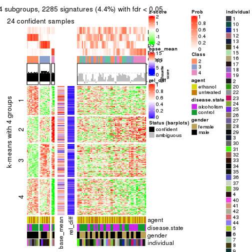</p>

</div>
<div id='tab-MAD-NMF-get-signatures-4'>
<pre><code class="r">get_signatures(res, k = 5)
</code></pre>

<p></p>

</div>
<div id='tab-MAD-NMF-get-signatures-5'>
<pre><code class="r">get_signatures(res, k = 6)
</code></pre>

<p></p>

</div>
</div>


Signature heatmaps where rows are not scaled:


<script>
$( function() {
	$( '#tabs-MAD-NMF-get-signatures-no-scale' ).tabs();
} );
</script>
<div id='tabs-MAD-NMF-get-signatures-no-scale'>
<ul>
<li><a href='#tab-MAD-NMF-get-signatures-no-scale-1'>k = 2</a></li>
<li><a href='#tab-MAD-NMF-get-signatures-no-scale-2'>k = 3</a></li>
<li><a href='#tab-MAD-NMF-get-signatures-no-scale-3'>k = 4</a></li>
<li><a href='#tab-MAD-NMF-get-signatures-no-scale-4'>k = 5</a></li>
<li><a href='#tab-MAD-NMF-get-signatures-no-scale-5'>k = 6</a></li>
</ul>
<div id='tab-MAD-NMF-get-signatures-no-scale-1'>
<pre><code class="r">get_signatures(res, k = 2, scale_rows = FALSE)
</code></pre>

<p></p>

</div>
<div id='tab-MAD-NMF-get-signatures-no-scale-2'>
<pre><code class="r">get_signatures(res, k = 3, scale_rows = FALSE)
</code></pre>

<p></p>

</div>
<div id='tab-MAD-NMF-get-signatures-no-scale-3'>
<pre><code class="r">get_signatures(res, k = 4, scale_rows = FALSE)
</code></pre>

<p></p>

</div>
<div id='tab-MAD-NMF-get-signatures-no-scale-4'>
<pre><code class="r">get_signatures(res, k = 5, scale_rows = FALSE)
</code></pre>

<p>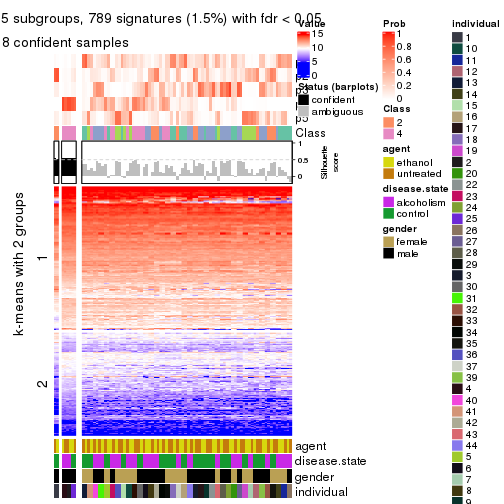</p>

</div>
<div id='tab-MAD-NMF-get-signatures-no-scale-5'>
<pre><code class="r">get_signatures(res, k = 6, scale_rows = FALSE)
</code></pre>

<p></p>

</div>
</div>


Compare the overlap of signatures from different k:

```r
compare_signatures(res)
```


`get_signature()` returns a data frame invisibly. TO get the list of signatures, the function
call should be assigned to a variable explicitly. In following code, if `plot` argument is set
to `FALSE`, no heatmap is plotted while only the differential analysis is performed.

```r
# code only for demonstration
tb = get_signature(res, k = ..., plot = FALSE)
```

An example of the output of `tb` is:

```
#>   which_row         fdr    mean_1    mean_2 scaled_mean_1 scaled_mean_2 km
#> 1        38 0.042760348  8.373488  9.131774    -0.5533452     0.5164555  1
#> 2        40 0.018707592  7.106213  8.469186    -0.6173731     0.5762149  1
#> 3        55 0.019134737 10.221463 11.207825    -0.6159697     0.5749050  1
#> 4        59 0.006059896  5.921854  7.869574    -0.6899429     0.6439467  1
#> 5        60 0.018055526  8.928898 10.211722    -0.6204761     0.5791110  1
#> 6        98 0.009384629 15.714769 14.887706     0.6635654    -0.6193277  2
...
```

The columns in `tb` are:

1. `which_row`: row indices corresponding to the input matrix.
2. `fdr`: FDR for the differential test. 
3. `mean_x`: The mean value in group x.
4. `scaled_mean_x`: The mean value in group x after rows are scaled.
5. `km`: Row groups if k-means clustering is applied to rows.


UMAP plot which shows how samples are separated.


<script>
$( function() {
	$( '#tabs-MAD-NMF-dimension-reduction' ).tabs();
} );
</script>
<div id='tabs-MAD-NMF-dimension-reduction'>
<ul>
<li><a href='#tab-MAD-NMF-dimension-reduction-1'>k = 2</a></li>
<li><a href='#tab-MAD-NMF-dimension-reduction-2'>k = 3</a></li>
<li><a href='#tab-MAD-NMF-dimension-reduction-3'>k = 4</a></li>
<li><a href='#tab-MAD-NMF-dimension-reduction-4'>k = 5</a></li>
<li><a href='#tab-MAD-NMF-dimension-reduction-5'>k = 6</a></li>
</ul>
<div id='tab-MAD-NMF-dimension-reduction-1'>
<pre><code class="r">dimension_reduction(res, k = 2, method = &quot;UMAP&quot;)
</code></pre>

<p></p>

</div>
<div id='tab-MAD-NMF-dimension-reduction-2'>
<pre><code class="r">dimension_reduction(res, k = 3, method = &quot;UMAP&quot;)
</code></pre>

<p>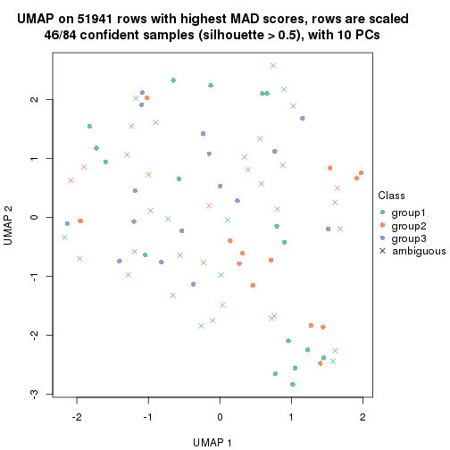</p>

</div>
<div id='tab-MAD-NMF-dimension-reduction-3'>
<pre><code class="r">dimension_reduction(res, k = 4, method = &quot;UMAP&quot;)
</code></pre>

<p></p>

</div>
<div id='tab-MAD-NMF-dimension-reduction-4'>
<pre><code class="r">dimension_reduction(res, k = 5, method = &quot;UMAP&quot;)
</code></pre>

<p></p>

</div>
<div id='tab-MAD-NMF-dimension-reduction-5'>
<pre><code class="r">dimension_reduction(res, k = 6, method = &quot;UMAP&quot;)
</code></pre>

<p></p>

</div>
</div>


Following heatmap shows how subgroups are split when increasing `k`:

```r
collect_classes(res)
```


Test correlation between subgroups and known annotations. If the known
annotation is numeric, one-way ANOVA test is applied, and if the known
annotation is discrete, chi-squared contingency table test is applied.

```r
test_to_known_factors(res)
```

```
#>          n agent(p) disease.state(p) gender(p) individual(p) k
#> MAD:NMF 70    0.995            0.473     0.748       0.00453 2
#> MAD:NMF 46    0.305            0.597     0.017       0.00344 3
#> MAD:NMF 24    0.878            0.498     0.067       0.01072 4
#> MAD:NMF  8    1.000            0.414        NA       0.04601 5
#> MAD:NMF  0       NA               NA        NA            NA 6
```


If matrix rows can be associated to genes, consider to use `GO_Enrichment(res,
...)` to perform function enrichment for the signature genes.


 

---------------------------------------------------


### ATC:hclust


The object with results only for a single top-value method and a single partition method 
can be extracted as:

```r
res = res_list["ATC", "hclust"]
# you can also extract it by
# res = res_list["ATC:hclust"]
```

A summary of `res` and all the functions that can be applied to it:

```r
res
```

```
#> A 'ConsensusPartition' object with k = 2, 3, 4, 5, 6.
#>   On a matrix with 51941 rows and 84 columns.
#>   Top rows (1000, 2000, 3000, 4000, 5000) are extracted by 'ATC' method.
#>   Subgroups are detected by 'hclust' method.
#>   Performed in total 1250 partitions by row resampling.
#>   Best k for subgroups seems to be 4.
#> 
#> Following methods can be applied to this 'ConsensusPartition' object:
#>  [1] "cola_report"             "collect_classes"         "collect_plots"          
#>  [4] "collect_stats"           "colnames"                "compare_signatures"     
#>  [7] "consensus_heatmap"       "dimension_reduction"     "functional_enrichment"  
#> [10] "get_anno_col"            "get_anno"                "get_classes"            
#> [13] "get_consensus"           "get_matrix"              "get_membership"         
#> [16] "get_param"               "get_signatures"          "get_stats"              
#> [19] "is_best_k"               "is_stable_k"             "membership_heatmap"     
#> [22] "ncol"                    "nrow"                    "plot_ecdf"              
#> [25] "rownames"                "select_partition_number" "show"                   
#> [28] "suggest_best_k"          "test_to_known_factors"
```

`collect_plots()` function collects all the plots made from `res` for all `k` (number of partitions)
into one single page to provide an easy and fast comparison between different `k`.

```r
collect_plots(res)
```


The plots are:

- The first row: a plot of the ECDF (Empirical cumulative distribution
  function) curves of the consensus matrix for each `k` and the heatmap of
  predicted classes for each `k`.
- The second row: heatmaps of the consensus matrix for each `k`.
- The third row: heatmaps of the membership matrix for each `k`.
- The fouth row: heatmaps of the signatures for each `k`.

All the plots in panels can be made by individual functions and they are
plotted later in this section.

`select_partition_number()` produces several plots showing different
statistics for choosing "optimized" `k`. There are following statistics:

- ECDF curves of the consensus matrix for each `k`;
- 1-PAC. [The PAC
  score](https://en.wikipedia.org/wiki/Consensus_clustering#Over-interpretation_potential_of_consensus_clustering)
  measures the proportion of the ambiguous subgrouping.
- Mean silhouette score.
- Concordance. The mean probability of fiting the consensus class ids in all
  partitions.
- Area increased. Denote $A_k$ as the area under the ECDF curve for current
  `k`, the area increased is defined as $A_k - A_{k-1}$.
- Rand index. The percent of pairs of samples that are both in a same cluster
  or both are not in a same cluster in the partition of k and k-1.
- Jaccard index. The ratio of pairs of samples are both in a same cluster in
  the partition of k and k-1 and the pairs of samples are both in a same
  cluster in the partition k or k-1.

The detailed explanations of these statistics can be found in [the cola
vignette](http://bioconductor.org/packages/devel/bioc/vignettes/cola/inst/doc/cola.html#toc_13).

Generally speaking, lower PAC score, higher mean silhouette score or higher
concordance corresponds to better partition. Rand index and Jaccard index
measure how similar the current partition is compared to partition with `k-1`.
If they are too similar, we won't accept `k` is better than `k-1`.

```r
select_partition_number(res)
```


The numeric values for all these statistics can be obtained by `get_stats()`.

```r
get_stats(res)
```

```
#>   k 1-PAC mean_silhouette concordance area_increased  Rand Jaccard
#> 2 2 0.282           0.770       0.827         0.4015 0.633   0.633
#> 3 3 0.366           0.577       0.748         0.5379 0.682   0.514
#> 4 4 0.486           0.595       0.756         0.1687 0.881   0.681
#> 5 5 0.549           0.512       0.658         0.0630 0.954   0.839
#> 6 6 0.592           0.466       0.615         0.0397 0.962   0.853
```

`suggest_best_k()` suggests the best $k$ based on these statistics. The rules are as follows:

- All $k$ with Jaccard index larger than 0.95 are removed because the increase of
  the partition number does not provides enough extra information. If all $k$ are removed,
  the best $k$ is assigned by `NA`.
- For $k$ with 1-PAC larger than 0.9, the maximal $k$ is taken as the "best k". Other $k$ is called "optional k".
- If it does not fit the second rule. The $k$ with the highest vote of highest
  1-PAC, mean silhouette and concordance is taken as the "best k".

```r
suggest_best_k(res)
```

```
#> [1] 4
```


Following shows the table of the partitions (You need to click the **show/hide
code output** link to see it). The membership matrix (columns with name `p*`)
is inferred by
[`clue::cl_consensus()`](https://www.rdocumentation.org/link/cl_consensus?package=clue)
function with the `SE` method. Basically the value in the membership matrix
represents the probability to belong to a certain group. The finall class
label for an item is determined with the group with highest probability it
belongs to.

In `get_classes()` function, the entropy is calculated from the membership
matrix and the silhouette score is calculated from the consensus matrix.


<script>
$( function() {
	$( '#tabs-ATC-hclust-get-classes' ).tabs();
} );
</script>
<div id='tabs-ATC-hclust-get-classes'>
<ul>
<li><a href='#tab-ATC-hclust-get-classes-1'>k = 2</a></li>
<li><a href='#tab-ATC-hclust-get-classes-2'>k = 3</a></li>
<li><a href='#tab-ATC-hclust-get-classes-3'>k = 4</a></li>
<li><a href='#tab-ATC-hclust-get-classes-4'>k = 5</a></li>
<li><a href='#tab-ATC-hclust-get-classes-5'>k = 6</a></li>
</ul>

<div id='tab-ATC-hclust-get-classes-1'>
<p><a id='tab-ATC-hclust-get-classes-1-a' style='color:#0366d6' href='#'>show/hide code output</a></p>
<pre><code class="r">cbind(get_classes(res, k = 2), get_membership(res, k = 2))
</code></pre>

<pre><code>#&gt;            class entropy silhouette    p1    p2
#&gt; GSM1269647     2  0.0376    0.87436 0.004 0.996
#&gt; GSM1269655     1  0.4022    0.82978 0.920 0.080
#&gt; GSM1269663     1  0.9909    0.41239 0.556 0.444
#&gt; GSM1269671     2  0.8443    0.51011 0.272 0.728
#&gt; GSM1269679     1  0.8909    0.71193 0.692 0.308
#&gt; GSM1269693     1  0.6343    0.84392 0.840 0.160
#&gt; GSM1269701     1  0.5408    0.85015 0.876 0.124
#&gt; GSM1269709     1  0.0376    0.83562 0.996 0.004
#&gt; GSM1269715     1  0.5519    0.84764 0.872 0.128
#&gt; GSM1269717     1  0.7139    0.83524 0.804 0.196
#&gt; GSM1269721     1  0.6048    0.84064 0.852 0.148
#&gt; GSM1269723     1  0.6148    0.84672 0.848 0.152
#&gt; GSM1269645     2  0.0376    0.87436 0.004 0.996
#&gt; GSM1269653     1  0.6438    0.84452 0.836 0.164
#&gt; GSM1269661     2  0.0376    0.87436 0.004 0.996
#&gt; GSM1269669     1  0.6712    0.83359 0.824 0.176
#&gt; GSM1269677     1  0.9970    0.09111 0.532 0.468
#&gt; GSM1269685     1  0.0376    0.83562 0.996 0.004
#&gt; GSM1269691     1  0.0376    0.83562 0.996 0.004
#&gt; GSM1269699     1  0.0376    0.83800 0.996 0.004
#&gt; GSM1269707     1  0.5519    0.84764 0.872 0.128
#&gt; GSM1269651     2  0.0938    0.87231 0.012 0.988
#&gt; GSM1269659     1  0.6048    0.84064 0.852 0.148
#&gt; GSM1269667     2  0.3733    0.84566 0.072 0.928
#&gt; GSM1269675     1  0.8207    0.78239 0.744 0.256
#&gt; GSM1269683     1  0.8955    0.70756 0.688 0.312
#&gt; GSM1269689     1  0.5408    0.84478 0.876 0.124
#&gt; GSM1269697     1  0.5842    0.80062 0.860 0.140
#&gt; GSM1269705     1  0.0376    0.83800 0.996 0.004
#&gt; GSM1269713     1  0.8443    0.76307 0.728 0.272
#&gt; GSM1269719     1  0.9129    0.50371 0.672 0.328
#&gt; GSM1269725     1  0.6048    0.79407 0.852 0.148
#&gt; GSM1269727     1  0.5946    0.84441 0.856 0.144
#&gt; GSM1269649     2  0.3733    0.84566 0.072 0.928
#&gt; GSM1269657     1  0.1414    0.83570 0.980 0.020
#&gt; GSM1269665     2  0.0376    0.87436 0.004 0.996
#&gt; GSM1269673     1  0.6712    0.83359 0.824 0.176
#&gt; GSM1269681     2  0.9996    0.04871 0.488 0.512
#&gt; GSM1269687     1  0.2236    0.83928 0.964 0.036
#&gt; GSM1269695     1  0.0672    0.83890 0.992 0.008
#&gt; GSM1269703     1  0.5946    0.84933 0.856 0.144
#&gt; GSM1269711     1  0.7883    0.79964 0.764 0.236
#&gt; GSM1269646     2  0.0376    0.87436 0.004 0.996
#&gt; GSM1269654     1  0.4022    0.82978 0.920 0.080
#&gt; GSM1269662     2  0.0376    0.87436 0.004 0.996
#&gt; GSM1269670     2  0.0376    0.87436 0.004 0.996
#&gt; GSM1269678     1  0.8909    0.71193 0.692 0.308
#&gt; GSM1269692     1  0.6343    0.84392 0.840 0.160
#&gt; GSM1269700     1  0.5408    0.85015 0.876 0.124
#&gt; GSM1269708     1  0.0376    0.83562 0.996 0.004
#&gt; GSM1269714     1  0.5294    0.85145 0.880 0.120
#&gt; GSM1269716     1  0.7139    0.83524 0.804 0.196
#&gt; GSM1269720     1  0.6048    0.84064 0.852 0.148
#&gt; GSM1269722     1  0.7453    0.81231 0.788 0.212
#&gt; GSM1269644     2  0.0938    0.87231 0.012 0.988
#&gt; GSM1269652     1  0.0376    0.83562 0.996 0.004
#&gt; GSM1269660     2  0.0376    0.87436 0.004 0.996
#&gt; GSM1269668     1  0.4815    0.85553 0.896 0.104
#&gt; GSM1269676     1  0.9970    0.09111 0.532 0.468
#&gt; GSM1269684     1  0.4022    0.83092 0.920 0.080
#&gt; GSM1269690     1  0.0376    0.83562 0.996 0.004
#&gt; GSM1269698     1  0.0376    0.83800 0.996 0.004
#&gt; GSM1269706     1  0.5519    0.84764 0.872 0.128
#&gt; GSM1269650     2  0.0938    0.87231 0.012 0.988
#&gt; GSM1269658     1  0.6247    0.83970 0.844 0.156
#&gt; GSM1269666     2  0.3733    0.84566 0.072 0.928
#&gt; GSM1269674     1  0.8207    0.78239 0.744 0.256
#&gt; GSM1269682     1  0.8955    0.70756 0.688 0.312
#&gt; GSM1269688     1  0.5408    0.84478 0.876 0.124
#&gt; GSM1269696     1  0.5842    0.80062 0.860 0.140
#&gt; GSM1269704     1  0.0376    0.83800 0.996 0.004
#&gt; GSM1269712     2  0.9850   -0.00524 0.428 0.572
#&gt; GSM1269718     1  0.9129    0.50371 0.672 0.328
#&gt; GSM1269724     1  0.6048    0.79407 0.852 0.148
#&gt; GSM1269726     1  0.5946    0.84441 0.856 0.144
#&gt; GSM1269648     2  0.3733    0.84566 0.072 0.928
#&gt; GSM1269656     1  0.1414    0.83570 0.980 0.020
#&gt; GSM1269664     2  0.0376    0.87436 0.004 0.996
#&gt; GSM1269672     1  0.4815    0.85553 0.896 0.104
#&gt; GSM1269680     2  0.9998    0.03126 0.492 0.508
#&gt; GSM1269686     1  0.2236    0.83928 0.964 0.036
#&gt; GSM1269694     1  0.0672    0.83890 0.992 0.008
#&gt; GSM1269702     1  0.0000    0.83705 1.000 0.000
#&gt; GSM1269710     1  0.7883    0.79964 0.764 0.236
</code></pre>

<script>
$('#tab-ATC-hclust-get-classes-1-a').parent().next().next().hide();
$('#tab-ATC-hclust-get-classes-1-a').click(function(){
  $('#tab-ATC-hclust-get-classes-1-a').parent().next().next().toggle();
  return(false);
});
</script>
</div>

<div id='tab-ATC-hclust-get-classes-2'>
<p><a id='tab-ATC-hclust-get-classes-2-a' style='color:#0366d6' href='#'>show/hide code output</a></p>
<pre><code class="r">cbind(get_classes(res, k = 3), get_membership(res, k = 3))
</code></pre>

<pre><code>#&gt;            class entropy silhouette    p1    p2    p3
#&gt; GSM1269647     2  0.0000      0.920 0.000 1.000 0.000
#&gt; GSM1269655     1  0.3755      0.659 0.872 0.008 0.120
#&gt; GSM1269663     3  0.8734      0.507 0.168 0.248 0.584
#&gt; GSM1269671     2  0.8028      0.452 0.176 0.656 0.168
#&gt; GSM1269679     3  0.8892      0.357 0.436 0.120 0.444
#&gt; GSM1269693     3  0.4291      0.680 0.180 0.000 0.820
#&gt; GSM1269701     1  0.6505     -0.123 0.528 0.004 0.468
#&gt; GSM1269709     1  0.4974      0.643 0.764 0.000 0.236
#&gt; GSM1269715     3  0.3619      0.700 0.136 0.000 0.864
#&gt; GSM1269717     1  0.6308     -0.238 0.508 0.000 0.492
#&gt; GSM1269721     3  0.1860      0.675 0.052 0.000 0.948
#&gt; GSM1269723     3  0.6099      0.607 0.228 0.032 0.740
#&gt; GSM1269645     2  0.0000      0.920 0.000 1.000 0.000
#&gt; GSM1269653     3  0.6633      0.389 0.444 0.008 0.548
#&gt; GSM1269661     2  0.0000      0.920 0.000 1.000 0.000
#&gt; GSM1269669     1  0.7481      0.336 0.596 0.048 0.356
#&gt; GSM1269677     1  0.8089      0.321 0.600 0.308 0.092
#&gt; GSM1269685     1  0.4974      0.643 0.764 0.000 0.236
#&gt; GSM1269691     1  0.4974      0.643 0.764 0.000 0.236
#&gt; GSM1269699     1  0.3816      0.668 0.852 0.000 0.148
#&gt; GSM1269707     3  0.3619      0.700 0.136 0.000 0.864
#&gt; GSM1269651     2  0.0424      0.919 0.008 0.992 0.000
#&gt; GSM1269659     3  0.2711      0.667 0.088 0.000 0.912
#&gt; GSM1269667     2  0.2261      0.885 0.068 0.932 0.000
#&gt; GSM1269675     3  0.7112      0.637 0.260 0.060 0.680
#&gt; GSM1269683     3  0.8884      0.384 0.420 0.120 0.460
#&gt; GSM1269689     3  0.2796      0.680 0.092 0.000 0.908
#&gt; GSM1269697     1  0.3587      0.600 0.892 0.020 0.088
#&gt; GSM1269705     1  0.3816      0.668 0.852 0.000 0.148
#&gt; GSM1269713     1  0.8304     -0.174 0.504 0.080 0.416
#&gt; GSM1269719     1  0.6746      0.445 0.732 0.192 0.076
#&gt; GSM1269725     1  0.3415      0.596 0.900 0.020 0.080
#&gt; GSM1269727     3  0.3532      0.698 0.108 0.008 0.884
#&gt; GSM1269649     2  0.2261      0.885 0.068 0.932 0.000
#&gt; GSM1269657     1  0.4605      0.658 0.796 0.000 0.204
#&gt; GSM1269665     2  0.0000      0.920 0.000 1.000 0.000
#&gt; GSM1269673     1  0.7481      0.336 0.596 0.048 0.356
#&gt; GSM1269681     1  0.8314      0.235 0.556 0.352 0.092
#&gt; GSM1269687     1  0.4861      0.656 0.800 0.008 0.192
#&gt; GSM1269695     1  0.3941      0.659 0.844 0.000 0.156
#&gt; GSM1269703     3  0.6460      0.356 0.440 0.004 0.556
#&gt; GSM1269711     3  0.6546      0.673 0.240 0.044 0.716
#&gt; GSM1269646     2  0.0000      0.920 0.000 1.000 0.000
#&gt; GSM1269654     1  0.3755      0.659 0.872 0.008 0.120
#&gt; GSM1269662     2  0.0000      0.920 0.000 1.000 0.000
#&gt; GSM1269670     2  0.0237      0.919 0.004 0.996 0.000
#&gt; GSM1269678     3  0.8892      0.357 0.436 0.120 0.444
#&gt; GSM1269692     3  0.4291      0.680 0.180 0.000 0.820
#&gt; GSM1269700     1  0.6505     -0.123 0.528 0.004 0.468
#&gt; GSM1269708     1  0.4974      0.643 0.764 0.000 0.236
#&gt; GSM1269714     3  0.6267      0.220 0.452 0.000 0.548
#&gt; GSM1269716     1  0.6308     -0.238 0.508 0.000 0.492
#&gt; GSM1269720     3  0.1860      0.675 0.052 0.000 0.948
#&gt; GSM1269722     3  0.8131      0.304 0.376 0.076 0.548
#&gt; GSM1269644     2  0.0424      0.919 0.008 0.992 0.000
#&gt; GSM1269652     1  0.4974      0.643 0.764 0.000 0.236
#&gt; GSM1269660     2  0.0000      0.920 0.000 1.000 0.000
#&gt; GSM1269668     1  0.6527      0.503 0.660 0.020 0.320
#&gt; GSM1269676     1  0.8089      0.321 0.600 0.308 0.092
#&gt; GSM1269684     1  0.5450      0.610 0.760 0.012 0.228
#&gt; GSM1269690     1  0.4974      0.643 0.764 0.000 0.236
#&gt; GSM1269698     1  0.3816      0.668 0.852 0.000 0.148
#&gt; GSM1269706     3  0.3619      0.700 0.136 0.000 0.864
#&gt; GSM1269650     2  0.0424      0.919 0.008 0.992 0.000
#&gt; GSM1269658     3  0.2866      0.687 0.076 0.008 0.916
#&gt; GSM1269666     2  0.2261      0.885 0.068 0.932 0.000
#&gt; GSM1269674     3  0.7112      0.637 0.260 0.060 0.680
#&gt; GSM1269682     3  0.8884      0.384 0.420 0.120 0.460
#&gt; GSM1269688     3  0.4555      0.640 0.200 0.000 0.800
#&gt; GSM1269696     1  0.3587      0.600 0.892 0.020 0.088
#&gt; GSM1269704     1  0.3816      0.668 0.852 0.000 0.148
#&gt; GSM1269712     2  0.9666     -0.129 0.316 0.452 0.232
#&gt; GSM1269718     1  0.6746      0.445 0.732 0.192 0.076
#&gt; GSM1269724     1  0.3415      0.596 0.900 0.020 0.080
#&gt; GSM1269726     3  0.3532      0.698 0.108 0.008 0.884
#&gt; GSM1269648     2  0.2261      0.885 0.068 0.932 0.000
#&gt; GSM1269656     1  0.4605      0.658 0.796 0.000 0.204
#&gt; GSM1269664     2  0.0000      0.920 0.000 1.000 0.000
#&gt; GSM1269672     1  0.6527      0.503 0.660 0.020 0.320
#&gt; GSM1269680     1  0.8297      0.246 0.560 0.348 0.092
#&gt; GSM1269686     1  0.4861      0.656 0.800 0.008 0.192
#&gt; GSM1269694     1  0.3941      0.659 0.844 0.000 0.156
#&gt; GSM1269702     1  0.4555      0.657 0.800 0.000 0.200
#&gt; GSM1269710     3  0.6546      0.673 0.240 0.044 0.716
</code></pre>

<script>
$('#tab-ATC-hclust-get-classes-2-a').parent().next().next().hide();
$('#tab-ATC-hclust-get-classes-2-a').click(function(){
  $('#tab-ATC-hclust-get-classes-2-a').parent().next().next().toggle();
  return(false);
});
</script>
</div>

<div id='tab-ATC-hclust-get-classes-3'>
<p><a id='tab-ATC-hclust-get-classes-3-a' style='color:#0366d6' href='#'>show/hide code output</a></p>
<pre><code class="r">cbind(get_classes(res, k = 4), get_membership(res, k = 4))
</code></pre>

<pre><code>#&gt;            class entropy silhouette    p1    p2    p3    p4
#&gt; GSM1269647     2  0.1389     0.8810 0.000 0.952 0.000 0.048
#&gt; GSM1269655     1  0.5108     0.5689 0.672 0.000 0.020 0.308
#&gt; GSM1269663     3  0.7480     0.4767 0.028 0.192 0.596 0.184
#&gt; GSM1269671     2  0.6751     0.2467 0.004 0.624 0.152 0.220
#&gt; GSM1269679     3  0.7819     0.3165 0.048 0.088 0.452 0.412
#&gt; GSM1269693     3  0.5836     0.6417 0.112 0.000 0.700 0.188
#&gt; GSM1269701     1  0.7823    -0.0129 0.376 0.000 0.368 0.256
#&gt; GSM1269709     1  0.0000     0.7108 1.000 0.000 0.000 0.000
#&gt; GSM1269715     3  0.2644     0.6841 0.032 0.000 0.908 0.060
#&gt; GSM1269717     3  0.6826     0.3193 0.100 0.000 0.484 0.416
#&gt; GSM1269721     3  0.3081     0.6575 0.048 0.000 0.888 0.064
#&gt; GSM1269723     3  0.3925     0.6255 0.000 0.016 0.808 0.176
#&gt; GSM1269645     2  0.0000     0.8850 0.000 1.000 0.000 0.000
#&gt; GSM1269653     3  0.7272     0.4514 0.156 0.004 0.536 0.304
#&gt; GSM1269661     2  0.0000     0.8850 0.000 1.000 0.000 0.000
#&gt; GSM1269669     1  0.8447     0.1907 0.460 0.036 0.264 0.240
#&gt; GSM1269677     4  0.4719     0.6281 0.008 0.224 0.016 0.752
#&gt; GSM1269685     1  0.0000     0.7108 1.000 0.000 0.000 0.000
#&gt; GSM1269691     1  0.0000     0.7108 1.000 0.000 0.000 0.000
#&gt; GSM1269699     1  0.3681     0.7038 0.816 0.000 0.008 0.176
#&gt; GSM1269707     3  0.2644     0.6841 0.032 0.000 0.908 0.060
#&gt; GSM1269651     2  0.1557     0.8800 0.000 0.944 0.000 0.056
#&gt; GSM1269659     3  0.4389     0.6339 0.116 0.000 0.812 0.072
#&gt; GSM1269667     2  0.2704     0.8533 0.000 0.876 0.000 0.124
#&gt; GSM1269675     3  0.6138     0.6089 0.032 0.040 0.676 0.252
#&gt; GSM1269683     3  0.7179     0.3642 0.016 0.088 0.492 0.404
#&gt; GSM1269689     3  0.0707     0.6554 0.000 0.000 0.980 0.020
#&gt; GSM1269697     4  0.3958     0.6077 0.112 0.000 0.052 0.836
#&gt; GSM1269705     1  0.3681     0.7038 0.816 0.000 0.008 0.176
#&gt; GSM1269713     4  0.6796    -0.2859 0.012 0.064 0.448 0.476
#&gt; GSM1269719     4  0.7229     0.4274 0.276 0.120 0.020 0.584
#&gt; GSM1269725     4  0.3840     0.6141 0.104 0.000 0.052 0.844
#&gt; GSM1269727     3  0.1489     0.6748 0.000 0.004 0.952 0.044
#&gt; GSM1269649     2  0.2704     0.8533 0.000 0.876 0.000 0.124
#&gt; GSM1269657     1  0.2011     0.7171 0.920 0.000 0.000 0.080
#&gt; GSM1269665     2  0.0000     0.8850 0.000 1.000 0.000 0.000
#&gt; GSM1269673     1  0.8447     0.1907 0.460 0.036 0.264 0.240
#&gt; GSM1269681     4  0.5065     0.5696 0.008 0.268 0.016 0.708
#&gt; GSM1269687     1  0.5417     0.6421 0.704 0.000 0.056 0.240
#&gt; GSM1269695     1  0.4900     0.6513 0.732 0.000 0.032 0.236
#&gt; GSM1269703     3  0.7269     0.4233 0.180 0.000 0.524 0.296
#&gt; GSM1269711     3  0.4894     0.6471 0.008 0.024 0.748 0.220
#&gt; GSM1269646     2  0.0592     0.8853 0.000 0.984 0.000 0.016
#&gt; GSM1269654     1  0.5108     0.5689 0.672 0.000 0.020 0.308
#&gt; GSM1269662     2  0.0000     0.8850 0.000 1.000 0.000 0.000
#&gt; GSM1269670     2  0.0817     0.8763 0.000 0.976 0.000 0.024
#&gt; GSM1269678     3  0.7819     0.3165 0.048 0.088 0.452 0.412
#&gt; GSM1269692     3  0.5836     0.6417 0.112 0.000 0.700 0.188
#&gt; GSM1269700     1  0.7823    -0.0129 0.376 0.000 0.368 0.256
#&gt; GSM1269708     1  0.0000     0.7108 1.000 0.000 0.000 0.000
#&gt; GSM1269714     3  0.6968     0.2572 0.392 0.000 0.492 0.116
#&gt; GSM1269716     3  0.6826     0.3193 0.100 0.000 0.484 0.416
#&gt; GSM1269720     3  0.3081     0.6575 0.048 0.000 0.888 0.064
#&gt; GSM1269722     3  0.6308     0.3860 0.004 0.060 0.580 0.356
#&gt; GSM1269644     2  0.1716     0.8769 0.000 0.936 0.000 0.064
#&gt; GSM1269652     1  0.0188     0.7122 0.996 0.000 0.000 0.004
#&gt; GSM1269660     2  0.0000     0.8850 0.000 1.000 0.000 0.000
#&gt; GSM1269668     1  0.6717     0.5294 0.652 0.012 0.164 0.172
#&gt; GSM1269676     4  0.4719     0.6281 0.008 0.224 0.016 0.752
#&gt; GSM1269684     1  0.6773     0.4468 0.588 0.000 0.136 0.276
#&gt; GSM1269690     1  0.0000     0.7108 1.000 0.000 0.000 0.000
#&gt; GSM1269698     1  0.3681     0.7038 0.816 0.000 0.008 0.176
#&gt; GSM1269706     3  0.2644     0.6841 0.032 0.000 0.908 0.060
#&gt; GSM1269650     2  0.1557     0.8800 0.000 0.944 0.000 0.056
#&gt; GSM1269658     3  0.4017     0.6669 0.044 0.000 0.828 0.128
#&gt; GSM1269666     2  0.2760     0.8524 0.000 0.872 0.000 0.128
#&gt; GSM1269674     3  0.6138     0.6089 0.032 0.040 0.676 0.252
#&gt; GSM1269682     3  0.7179     0.3642 0.016 0.088 0.492 0.404
#&gt; GSM1269688     3  0.4035     0.6147 0.176 0.000 0.804 0.020
#&gt; GSM1269696     4  0.3958     0.6077 0.112 0.000 0.052 0.836
#&gt; GSM1269704     1  0.3681     0.7038 0.816 0.000 0.008 0.176
#&gt; GSM1269712     2  0.7773    -0.1807 0.000 0.432 0.284 0.284
#&gt; GSM1269718     4  0.7229     0.4274 0.276 0.120 0.020 0.584
#&gt; GSM1269724     4  0.3840     0.6141 0.104 0.000 0.052 0.844
#&gt; GSM1269726     3  0.1489     0.6748 0.000 0.004 0.952 0.044
#&gt; GSM1269648     2  0.2760     0.8524 0.000 0.872 0.000 0.128
#&gt; GSM1269656     1  0.2011     0.7171 0.920 0.000 0.000 0.080
#&gt; GSM1269664     2  0.0000     0.8850 0.000 1.000 0.000 0.000
#&gt; GSM1269672     1  0.6717     0.5294 0.652 0.012 0.164 0.172
#&gt; GSM1269680     4  0.5037     0.5770 0.008 0.264 0.016 0.712
#&gt; GSM1269686     1  0.5417     0.6421 0.704 0.000 0.056 0.240
#&gt; GSM1269694     1  0.4900     0.6513 0.732 0.000 0.032 0.236
#&gt; GSM1269702     1  0.1557     0.7183 0.944 0.000 0.000 0.056
#&gt; GSM1269710     3  0.4894     0.6471 0.008 0.024 0.748 0.220
</code></pre>

<script>
$('#tab-ATC-hclust-get-classes-3-a').parent().next().next().hide();
$('#tab-ATC-hclust-get-classes-3-a').click(function(){
  $('#tab-ATC-hclust-get-classes-3-a').parent().next().next().toggle();
  return(false);
});
</script>
</div>

<div id='tab-ATC-hclust-get-classes-4'>
<p><a id='tab-ATC-hclust-get-classes-4-a' style='color:#0366d6' href='#'>show/hide code output</a></p>
<pre><code class="r">cbind(get_classes(res, k = 5), get_membership(res, k = 5))
</code></pre>

<pre><code>#&gt;            class entropy silhouette    p1    p2    p3    p4    p5
#&gt; GSM1269647     2  0.1568     0.8554 0.000 0.944 0.020 0.000 0.036
#&gt; GSM1269655     1  0.5273     0.5512 0.636 0.000 0.304 0.012 0.048
#&gt; GSM1269663     4  0.7978     0.2513 0.024 0.152 0.116 0.516 0.192
#&gt; GSM1269671     2  0.6860     0.3403 0.000 0.600 0.148 0.156 0.096
#&gt; GSM1269679     4  0.7670     0.3792 0.032 0.020 0.300 0.444 0.204
#&gt; GSM1269693     4  0.6333     0.3172 0.072 0.000 0.156 0.648 0.124
#&gt; GSM1269701     3  0.8202    -0.0546 0.312 0.000 0.328 0.248 0.112
#&gt; GSM1269709     1  0.0771     0.7058 0.976 0.000 0.000 0.004 0.020
#&gt; GSM1269715     4  0.1806     0.4049 0.016 0.000 0.028 0.940 0.016
#&gt; GSM1269717     4  0.7041     0.3065 0.088 0.000 0.344 0.488 0.080
#&gt; GSM1269721     4  0.3543     0.2699 0.024 0.000 0.012 0.828 0.136
#&gt; GSM1269723     4  0.3966     0.4204 0.000 0.012 0.132 0.808 0.048
#&gt; GSM1269645     2  0.1270     0.8534 0.000 0.948 0.000 0.000 0.052
#&gt; GSM1269653     4  0.7430     0.2501 0.080 0.000 0.340 0.448 0.132
#&gt; GSM1269661     2  0.1270     0.8534 0.000 0.948 0.000 0.000 0.052
#&gt; GSM1269669     1  0.7948     0.1405 0.444 0.012 0.228 0.248 0.068
#&gt; GSM1269677     3  0.6583     0.4522 0.004 0.124 0.532 0.020 0.320
#&gt; GSM1269685     1  0.0865     0.7046 0.972 0.000 0.000 0.004 0.024
#&gt; GSM1269691     1  0.0771     0.7058 0.976 0.000 0.000 0.004 0.020
#&gt; GSM1269699     1  0.3741     0.6711 0.732 0.000 0.264 0.000 0.004
#&gt; GSM1269707     4  0.1806     0.4049 0.016 0.000 0.028 0.940 0.016
#&gt; GSM1269651     2  0.1818     0.8541 0.000 0.932 0.024 0.000 0.044
#&gt; GSM1269659     4  0.5143     0.0860 0.084 0.000 0.008 0.696 0.212
#&gt; GSM1269667     2  0.3105     0.8329 0.000 0.864 0.088 0.004 0.044
#&gt; GSM1269675     4  0.6619     0.4308 0.024 0.008 0.156 0.588 0.224
#&gt; GSM1269683     4  0.7162     0.4234 0.012 0.020 0.268 0.500 0.200
#&gt; GSM1269689     5  0.4192     0.6591 0.000 0.000 0.000 0.404 0.596
#&gt; GSM1269697     3  0.1885     0.4851 0.020 0.000 0.932 0.044 0.004
#&gt; GSM1269705     1  0.3741     0.6711 0.732 0.000 0.264 0.000 0.004
#&gt; GSM1269713     4  0.6752     0.2863 0.008 0.020 0.408 0.452 0.112
#&gt; GSM1269719     3  0.7927     0.3551 0.256 0.036 0.416 0.024 0.268
#&gt; GSM1269725     3  0.2100     0.4926 0.016 0.000 0.924 0.048 0.012
#&gt; GSM1269727     4  0.2522     0.3701 0.000 0.000 0.012 0.880 0.108
#&gt; GSM1269649     2  0.3105     0.8329 0.000 0.864 0.088 0.004 0.044
#&gt; GSM1269657     1  0.2270     0.7131 0.908 0.000 0.072 0.004 0.016
#&gt; GSM1269665     2  0.1270     0.8534 0.000 0.948 0.000 0.000 0.052
#&gt; GSM1269673     1  0.7948     0.1405 0.444 0.012 0.228 0.248 0.068
#&gt; GSM1269681     3  0.6810     0.4376 0.004 0.168 0.504 0.016 0.308
#&gt; GSM1269687     1  0.5447     0.6258 0.664 0.000 0.256 0.048 0.032
#&gt; GSM1269695     1  0.4491     0.5981 0.648 0.000 0.336 0.012 0.004
#&gt; GSM1269703     4  0.7608     0.2191 0.104 0.000 0.344 0.428 0.124
#&gt; GSM1269711     4  0.5116     0.4505 0.000 0.000 0.120 0.692 0.188
#&gt; GSM1269646     2  0.0693     0.8592 0.000 0.980 0.012 0.000 0.008
#&gt; GSM1269654     1  0.5273     0.5512 0.636 0.000 0.304 0.012 0.048
#&gt; GSM1269662     2  0.1270     0.8534 0.000 0.948 0.000 0.000 0.052
#&gt; GSM1269670     2  0.1710     0.8504 0.000 0.940 0.016 0.004 0.040
#&gt; GSM1269678     4  0.7670     0.3792 0.032 0.020 0.300 0.444 0.204
#&gt; GSM1269692     4  0.6333     0.3172 0.072 0.000 0.156 0.648 0.124
#&gt; GSM1269700     3  0.8202    -0.0546 0.312 0.000 0.328 0.248 0.112
#&gt; GSM1269708     1  0.0771     0.7058 0.976 0.000 0.000 0.004 0.020
#&gt; GSM1269714     4  0.6206     0.1033 0.392 0.000 0.084 0.504 0.020
#&gt; GSM1269716     4  0.7041     0.3065 0.088 0.000 0.344 0.488 0.080
#&gt; GSM1269720     4  0.3543     0.2699 0.024 0.000 0.012 0.828 0.136
#&gt; GSM1269722     4  0.6280     0.3573 0.000 0.020 0.288 0.572 0.120
#&gt; GSM1269644     2  0.1981     0.8514 0.000 0.924 0.028 0.000 0.048
#&gt; GSM1269652     1  0.0486     0.7109 0.988 0.000 0.004 0.004 0.004
#&gt; GSM1269660     2  0.1270     0.8534 0.000 0.948 0.000 0.000 0.052
#&gt; GSM1269668     1  0.6408     0.4905 0.632 0.008 0.172 0.156 0.032
#&gt; GSM1269676     3  0.6583     0.4522 0.004 0.124 0.532 0.020 0.320
#&gt; GSM1269684     1  0.7147     0.3868 0.564 0.000 0.188 0.148 0.100
#&gt; GSM1269690     1  0.0771     0.7058 0.976 0.000 0.000 0.004 0.020
#&gt; GSM1269698     1  0.3741     0.6711 0.732 0.000 0.264 0.000 0.004
#&gt; GSM1269706     4  0.1806     0.4049 0.016 0.000 0.028 0.940 0.016
#&gt; GSM1269650     2  0.1818     0.8541 0.000 0.932 0.024 0.000 0.044
#&gt; GSM1269658     4  0.4688     0.2569 0.024 0.000 0.024 0.720 0.232
#&gt; GSM1269666     2  0.3178     0.8318 0.000 0.860 0.088 0.004 0.048
#&gt; GSM1269674     4  0.6619     0.4308 0.024 0.008 0.156 0.588 0.224
#&gt; GSM1269682     4  0.7162     0.4234 0.012 0.020 0.268 0.500 0.200
#&gt; GSM1269688     5  0.5770     0.6934 0.140 0.000 0.000 0.256 0.604
#&gt; GSM1269696     3  0.1885     0.4851 0.020 0.000 0.932 0.044 0.004
#&gt; GSM1269704     1  0.3741     0.6711 0.732 0.000 0.264 0.000 0.004
#&gt; GSM1269712     2  0.8241    -0.1857 0.000 0.360 0.232 0.280 0.128
#&gt; GSM1269718     3  0.7927     0.3551 0.256 0.036 0.416 0.024 0.268
#&gt; GSM1269724     3  0.2100     0.4926 0.016 0.000 0.924 0.048 0.012
#&gt; GSM1269726     4  0.2522     0.3701 0.000 0.000 0.012 0.880 0.108
#&gt; GSM1269648     2  0.3178     0.8318 0.000 0.860 0.088 0.004 0.048
#&gt; GSM1269656     1  0.2270     0.7131 0.908 0.000 0.072 0.004 0.016
#&gt; GSM1269664     2  0.1270     0.8534 0.000 0.948 0.000 0.000 0.052
#&gt; GSM1269672     1  0.6440     0.4898 0.628 0.008 0.176 0.156 0.032
#&gt; GSM1269680     3  0.6782     0.4399 0.004 0.164 0.508 0.016 0.308
#&gt; GSM1269686     1  0.5447     0.6258 0.664 0.000 0.256 0.048 0.032
#&gt; GSM1269694     1  0.4491     0.5981 0.648 0.000 0.336 0.012 0.004
#&gt; GSM1269702     1  0.2352     0.7155 0.896 0.000 0.092 0.004 0.008
#&gt; GSM1269710     4  0.5116     0.4505 0.000 0.000 0.120 0.692 0.188
</code></pre>

<script>
$('#tab-ATC-hclust-get-classes-4-a').parent().next().next().hide();
$('#tab-ATC-hclust-get-classes-4-a').click(function(){
  $('#tab-ATC-hclust-get-classes-4-a').parent().next().next().toggle();
  return(false);
});
</script>
</div>

<div id='tab-ATC-hclust-get-classes-5'>
<p><a id='tab-ATC-hclust-get-classes-5-a' style='color:#0366d6' href='#'>show/hide code output</a></p>
<pre><code class="r">cbind(get_classes(res, k = 6), get_membership(res, k = 6))
</code></pre>

<pre><code>#&gt;            class entropy silhouette    p1    p2    p3    p4    p5    p6
#&gt; GSM1269647     2  0.2937     0.7877 0.000 0.848 0.000 0.000 0.056 0.096
#&gt; GSM1269655     1  0.5573     0.4961 0.536 0.000 0.288 0.000 0.000 0.176
#&gt; GSM1269663     4  0.7823     0.2669 0.004 0.068 0.108 0.464 0.128 0.228
#&gt; GSM1269671     2  0.5781     0.3415 0.000 0.588 0.028 0.148 0.000 0.236
#&gt; GSM1269679     6  0.6547    -0.1508 0.024 0.008 0.140 0.408 0.008 0.412
#&gt; GSM1269693     4  0.6159     0.3209 0.060 0.000 0.352 0.496 0.000 0.092
#&gt; GSM1269701     3  0.7072     0.2824 0.268 0.000 0.424 0.216 0.092 0.000
#&gt; GSM1269709     1  0.0000     0.6492 1.000 0.000 0.000 0.000 0.000 0.000
#&gt; GSM1269715     4  0.1917     0.5238 0.016 0.000 0.036 0.928 0.016 0.004
#&gt; GSM1269717     4  0.6769     0.1875 0.068 0.000 0.220 0.472 0.000 0.240
#&gt; GSM1269721     4  0.5230     0.3341 0.024 0.000 0.192 0.692 0.028 0.064
#&gt; GSM1269723     4  0.4539     0.4748 0.000 0.008 0.048 0.768 0.076 0.100
#&gt; GSM1269645     2  0.1950     0.7736 0.000 0.912 0.064 0.000 0.024 0.000
#&gt; GSM1269653     4  0.6929    -0.0897 0.044 0.000 0.384 0.428 0.092 0.052
#&gt; GSM1269661     2  0.1890     0.7748 0.000 0.916 0.060 0.000 0.024 0.000
#&gt; GSM1269669     1  0.7538     0.0466 0.420 0.008 0.196 0.192 0.000 0.184
#&gt; GSM1269677     6  0.1152     0.5480 0.000 0.044 0.000 0.004 0.000 0.952
#&gt; GSM1269685     1  0.0146     0.6479 0.996 0.000 0.000 0.000 0.004 0.000
#&gt; GSM1269691     1  0.0000     0.6492 1.000 0.000 0.000 0.000 0.000 0.000
#&gt; GSM1269699     1  0.3659     0.5849 0.636 0.000 0.364 0.000 0.000 0.000
#&gt; GSM1269707     4  0.1917     0.5238 0.016 0.000 0.036 0.928 0.016 0.004
#&gt; GSM1269651     2  0.3211     0.7836 0.000 0.824 0.000 0.000 0.056 0.120
#&gt; GSM1269659     4  0.7280     0.1801 0.084 0.000 0.220 0.520 0.108 0.068
#&gt; GSM1269667     2  0.4279     0.7660 0.000 0.756 0.024 0.000 0.064 0.156
#&gt; GSM1269675     4  0.6617     0.3321 0.004 0.004 0.128 0.528 0.072 0.264
#&gt; GSM1269683     4  0.6002     0.1050 0.004 0.008 0.108 0.472 0.012 0.396
#&gt; GSM1269689     5  0.1663     0.7704 0.000 0.000 0.000 0.088 0.912 0.000
#&gt; GSM1269697     3  0.4184     0.5007 0.000 0.000 0.576 0.016 0.000 0.408
#&gt; GSM1269705     1  0.3659     0.5849 0.636 0.000 0.364 0.000 0.000 0.000
#&gt; GSM1269713     4  0.6164     0.1393 0.000 0.008 0.204 0.468 0.004 0.316
#&gt; GSM1269719     6  0.5147     0.3089 0.176 0.000 0.180 0.004 0.000 0.640
#&gt; GSM1269725     3  0.4294     0.4810 0.000 0.000 0.552 0.020 0.000 0.428
#&gt; GSM1269727     4  0.2653     0.4914 0.000 0.000 0.012 0.844 0.144 0.000
#&gt; GSM1269649     2  0.4223     0.7655 0.000 0.760 0.024 0.000 0.060 0.156
#&gt; GSM1269657     1  0.2706     0.6590 0.860 0.000 0.104 0.000 0.000 0.036
#&gt; GSM1269665     2  0.1950     0.7736 0.000 0.912 0.064 0.000 0.024 0.000
#&gt; GSM1269673     1  0.7538     0.0466 0.420 0.008 0.196 0.192 0.000 0.184
#&gt; GSM1269681     6  0.1610     0.5356 0.000 0.084 0.000 0.000 0.000 0.916
#&gt; GSM1269687     1  0.5370     0.5484 0.564 0.000 0.324 0.008 0.000 0.104
#&gt; GSM1269695     1  0.3833     0.4790 0.556 0.000 0.444 0.000 0.000 0.000
#&gt; GSM1269703     3  0.6827     0.0350 0.068 0.000 0.412 0.404 0.092 0.024
#&gt; GSM1269711     4  0.4925     0.4447 0.004 0.000 0.024 0.692 0.072 0.208
#&gt; GSM1269646     2  0.1655     0.7920 0.000 0.932 0.008 0.000 0.008 0.052
#&gt; GSM1269654     1  0.5573     0.4961 0.536 0.000 0.288 0.000 0.000 0.176
#&gt; GSM1269662     2  0.1950     0.7736 0.000 0.912 0.064 0.000 0.024 0.000
#&gt; GSM1269670     2  0.1636     0.7781 0.000 0.936 0.024 0.004 0.000 0.036
#&gt; GSM1269678     6  0.6547    -0.1508 0.024 0.008 0.140 0.408 0.008 0.412
#&gt; GSM1269692     4  0.6159     0.3209 0.060 0.000 0.352 0.496 0.000 0.092
#&gt; GSM1269700     3  0.7072     0.2824 0.268 0.000 0.424 0.216 0.092 0.000
#&gt; GSM1269708     1  0.0000     0.6492 1.000 0.000 0.000 0.000 0.000 0.000
#&gt; GSM1269714     4  0.6299     0.1210 0.364 0.000 0.112 0.480 0.012 0.032
#&gt; GSM1269716     4  0.6769     0.1875 0.068 0.000 0.220 0.472 0.000 0.240
#&gt; GSM1269720     4  0.5230     0.3341 0.024 0.000 0.192 0.692 0.028 0.064
#&gt; GSM1269722     4  0.6084     0.2618 0.000 0.008 0.124 0.568 0.036 0.264
#&gt; GSM1269644     2  0.3295     0.7806 0.000 0.816 0.000 0.000 0.056 0.128
#&gt; GSM1269652     1  0.0547     0.6530 0.980 0.000 0.020 0.000 0.000 0.000
#&gt; GSM1269660     2  0.1890     0.7748 0.000 0.916 0.060 0.000 0.024 0.000
#&gt; GSM1269668     1  0.6164     0.3667 0.600 0.008 0.208 0.116 0.000 0.068
#&gt; GSM1269676     6  0.1152     0.5480 0.000 0.044 0.000 0.004 0.000 0.952
#&gt; GSM1269684     1  0.7183     0.3693 0.484 0.000 0.180 0.112 0.012 0.212
#&gt; GSM1269690     1  0.0000     0.6492 1.000 0.000 0.000 0.000 0.000 0.000
#&gt; GSM1269698     1  0.3659     0.5849 0.636 0.000 0.364 0.000 0.000 0.000
#&gt; GSM1269706     4  0.1917     0.5238 0.016 0.000 0.036 0.928 0.016 0.004
#&gt; GSM1269650     2  0.3211     0.7836 0.000 0.824 0.000 0.000 0.056 0.120
#&gt; GSM1269658     4  0.6805     0.2906 0.024 0.000 0.224 0.540 0.068 0.144
#&gt; GSM1269666     2  0.4122     0.7628 0.000 0.764 0.020 0.000 0.056 0.160
#&gt; GSM1269674     4  0.6617     0.3321 0.004 0.004 0.128 0.528 0.072 0.264
#&gt; GSM1269682     4  0.6002     0.1050 0.004 0.008 0.108 0.472 0.012 0.396
#&gt; GSM1269688     5  0.2859     0.7647 0.156 0.000 0.000 0.016 0.828 0.000
#&gt; GSM1269696     3  0.4184     0.5007 0.000 0.000 0.576 0.016 0.000 0.408
#&gt; GSM1269704     1  0.3659     0.5849 0.636 0.000 0.364 0.000 0.000 0.000
#&gt; GSM1269712     2  0.7353    -0.2604 0.000 0.356 0.092 0.292 0.004 0.256
#&gt; GSM1269718     6  0.5147     0.3089 0.176 0.000 0.180 0.004 0.000 0.640
#&gt; GSM1269724     3  0.4294     0.4810 0.000 0.000 0.552 0.020 0.000 0.428
#&gt; GSM1269726     4  0.2653     0.4914 0.000 0.000 0.012 0.844 0.144 0.000
#&gt; GSM1269648     2  0.4122     0.7628 0.000 0.764 0.020 0.000 0.056 0.160
#&gt; GSM1269656     1  0.2706     0.6590 0.860 0.000 0.104 0.000 0.000 0.036
#&gt; GSM1269664     2  0.1950     0.7736 0.000 0.912 0.064 0.000 0.024 0.000
#&gt; GSM1269672     1  0.6187     0.3656 0.596 0.008 0.212 0.116 0.000 0.068
#&gt; GSM1269680     6  0.1556     0.5366 0.000 0.080 0.000 0.000 0.000 0.920
#&gt; GSM1269686     1  0.5370     0.5484 0.564 0.000 0.324 0.008 0.000 0.104
#&gt; GSM1269694     1  0.3833     0.4790 0.556 0.000 0.444 0.000 0.000 0.000
#&gt; GSM1269702     1  0.2697     0.6546 0.812 0.000 0.188 0.000 0.000 0.000
#&gt; GSM1269710     4  0.4925     0.4447 0.004 0.000 0.024 0.692 0.072 0.208
</code></pre>

<script>
$('#tab-ATC-hclust-get-classes-5-a').parent().next().next().hide();
$('#tab-ATC-hclust-get-classes-5-a').click(function(){
  $('#tab-ATC-hclust-get-classes-5-a').parent().next().next().toggle();
  return(false);
});
</script>
</div>
</div>

Heatmaps for the consensus matrix. It visualizes the probability of two
samples to be in a same group.


<script>
$( function() {
	$( '#tabs-ATC-hclust-consensus-heatmap' ).tabs();
} );
</script>
<div id='tabs-ATC-hclust-consensus-heatmap'>
<ul>
<li><a href='#tab-ATC-hclust-consensus-heatmap-1'>k = 2</a></li>
<li><a href='#tab-ATC-hclust-consensus-heatmap-2'>k = 3</a></li>
<li><a href='#tab-ATC-hclust-consensus-heatmap-3'>k = 4</a></li>
<li><a href='#tab-ATC-hclust-consensus-heatmap-4'>k = 5</a></li>
<li><a href='#tab-ATC-hclust-consensus-heatmap-5'>k = 6</a></li>
</ul>
<div id='tab-ATC-hclust-consensus-heatmap-1'>
<pre><code class="r">consensus_heatmap(res, k = 2)
</code></pre>

<p></p>

</div>
<div id='tab-ATC-hclust-consensus-heatmap-2'>
<pre><code class="r">consensus_heatmap(res, k = 3)
</code></pre>

<p></p>

</div>
<div id='tab-ATC-hclust-consensus-heatmap-3'>
<pre><code class="r">consensus_heatmap(res, k = 4)
</code></pre>

<p></p>

</div>
<div id='tab-ATC-hclust-consensus-heatmap-4'>
<pre><code class="r">consensus_heatmap(res, k = 5)
</code></pre>

<p></p>

</div>
<div id='tab-ATC-hclust-consensus-heatmap-5'>
<pre><code class="r">consensus_heatmap(res, k = 6)
</code></pre>

<p></p>

</div>
</div>

Heatmaps for the membership of samples in all partitions to see how consistent they are:


<script>
$( function() {
	$( '#tabs-ATC-hclust-membership-heatmap' ).tabs();
} );
</script>
<div id='tabs-ATC-hclust-membership-heatmap'>
<ul>
<li><a href='#tab-ATC-hclust-membership-heatmap-1'>k = 2</a></li>
<li><a href='#tab-ATC-hclust-membership-heatmap-2'>k = 3</a></li>
<li><a href='#tab-ATC-hclust-membership-heatmap-3'>k = 4</a></li>
<li><a href='#tab-ATC-hclust-membership-heatmap-4'>k = 5</a></li>
<li><a href='#tab-ATC-hclust-membership-heatmap-5'>k = 6</a></li>
</ul>
<div id='tab-ATC-hclust-membership-heatmap-1'>
<pre><code class="r">membership_heatmap(res, k = 2)
</code></pre>

<p></p>

</div>
<div id='tab-ATC-hclust-membership-heatmap-2'>
<pre><code class="r">membership_heatmap(res, k = 3)
</code></pre>

<p></p>

</div>
<div id='tab-ATC-hclust-membership-heatmap-3'>
<pre><code class="r">membership_heatmap(res, k = 4)
</code></pre>

<p></p>

</div>
<div id='tab-ATC-hclust-membership-heatmap-4'>
<pre><code class="r">membership_heatmap(res, k = 5)
</code></pre>

<p></p>

</div>
<div id='tab-ATC-hclust-membership-heatmap-5'>
<pre><code class="r">membership_heatmap(res, k = 6)
</code></pre>

<p></p>

</div>
</div>

As soon as we have had the classes for columns, we can look for signatures
which are significantly different between classes which can be candidate marks
for certain classes. Following are the heatmaps for signatures.


Signature heatmaps where rows are scaled:


<script>
$( function() {
	$( '#tabs-ATC-hclust-get-signatures' ).tabs();
} );
</script>
<div id='tabs-ATC-hclust-get-signatures'>
<ul>
<li><a href='#tab-ATC-hclust-get-signatures-1'>k = 2</a></li>
<li><a href='#tab-ATC-hclust-get-signatures-2'>k = 3</a></li>
<li><a href='#tab-ATC-hclust-get-signatures-3'>k = 4</a></li>
<li><a href='#tab-ATC-hclust-get-signatures-4'>k = 5</a></li>
<li><a href='#tab-ATC-hclust-get-signatures-5'>k = 6</a></li>
</ul>
<div id='tab-ATC-hclust-get-signatures-1'>
<pre><code class="r">get_signatures(res, k = 2)
</code></pre>

<p></p>

</div>
<div id='tab-ATC-hclust-get-signatures-2'>
<pre><code class="r">get_signatures(res, k = 3)
</code></pre>

<p></p>

</div>
<div id='tab-ATC-hclust-get-signatures-3'>
<pre><code class="r">get_signatures(res, k = 4)
</code></pre>

<p></p>

</div>
<div id='tab-ATC-hclust-get-signatures-4'>
<pre><code class="r">get_signatures(res, k = 5)
</code></pre>

<p>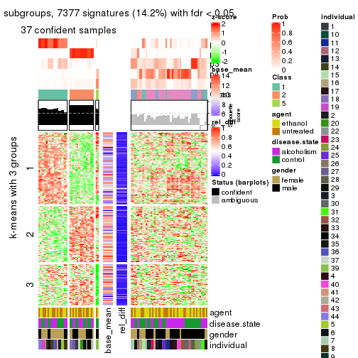</p>

</div>
<div id='tab-ATC-hclust-get-signatures-5'>
<pre><code class="r">get_signatures(res, k = 6)
</code></pre>

<p></p>

</div>
</div>


Signature heatmaps where rows are not scaled:


<script>
$( function() {
	$( '#tabs-ATC-hclust-get-signatures-no-scale' ).tabs();
} );
</script>
<div id='tabs-ATC-hclust-get-signatures-no-scale'>
<ul>
<li><a href='#tab-ATC-hclust-get-signatures-no-scale-1'>k = 2</a></li>
<li><a href='#tab-ATC-hclust-get-signatures-no-scale-2'>k = 3</a></li>
<li><a href='#tab-ATC-hclust-get-signatures-no-scale-3'>k = 4</a></li>
<li><a href='#tab-ATC-hclust-get-signatures-no-scale-4'>k = 5</a></li>
<li><a href='#tab-ATC-hclust-get-signatures-no-scale-5'>k = 6</a></li>
</ul>
<div id='tab-ATC-hclust-get-signatures-no-scale-1'>
<pre><code class="r">get_signatures(res, k = 2, scale_rows = FALSE)
</code></pre>

<p></p>

</div>
<div id='tab-ATC-hclust-get-signatures-no-scale-2'>
<pre><code class="r">get_signatures(res, k = 3, scale_rows = FALSE)
</code></pre>

<p></p>

</div>
<div id='tab-ATC-hclust-get-signatures-no-scale-3'>
<pre><code class="r">get_signatures(res, k = 4, scale_rows = FALSE)
</code></pre>

<p></p>

</div>
<div id='tab-ATC-hclust-get-signatures-no-scale-4'>
<pre><code class="r">get_signatures(res, k = 5, scale_rows = FALSE)
</code></pre>

<p></p>

</div>
<div id='tab-ATC-hclust-get-signatures-no-scale-5'>
<pre><code class="r">get_signatures(res, k = 6, scale_rows = FALSE)
</code></pre>

<p></p>

</div>
</div>


Compare the overlap of signatures from different k:

```r
compare_signatures(res)
```


`get_signature()` returns a data frame invisibly. TO get the list of signatures, the function
call should be assigned to a variable explicitly. In following code, if `plot` argument is set
to `FALSE`, no heatmap is plotted while only the differential analysis is performed.

```r
# code only for demonstration
tb = get_signature(res, k = ..., plot = FALSE)
```

An example of the output of `tb` is:

```
#>   which_row         fdr    mean_1    mean_2 scaled_mean_1 scaled_mean_2 km
#> 1        38 0.042760348  8.373488  9.131774    -0.5533452     0.5164555  1
#> 2        40 0.018707592  7.106213  8.469186    -0.6173731     0.5762149  1
#> 3        55 0.019134737 10.221463 11.207825    -0.6159697     0.5749050  1
#> 4        59 0.006059896  5.921854  7.869574    -0.6899429     0.6439467  1
#> 5        60 0.018055526  8.928898 10.211722    -0.6204761     0.5791110  1
#> 6        98 0.009384629 15.714769 14.887706     0.6635654    -0.6193277  2
...
```

The columns in `tb` are:

1. `which_row`: row indices corresponding to the input matrix.
2. `fdr`: FDR for the differential test. 
3. `mean_x`: The mean value in group x.
4. `scaled_mean_x`: The mean value in group x after rows are scaled.
5. `km`: Row groups if k-means clustering is applied to rows.


UMAP plot which shows how samples are separated.


<script>
$( function() {
	$( '#tabs-ATC-hclust-dimension-reduction' ).tabs();
} );
</script>
<div id='tabs-ATC-hclust-dimension-reduction'>
<ul>
<li><a href='#tab-ATC-hclust-dimension-reduction-1'>k = 2</a></li>
<li><a href='#tab-ATC-hclust-dimension-reduction-2'>k = 3</a></li>
<li><a href='#tab-ATC-hclust-dimension-reduction-3'>k = 4</a></li>
<li><a href='#tab-ATC-hclust-dimension-reduction-4'>k = 5</a></li>
<li><a href='#tab-ATC-hclust-dimension-reduction-5'>k = 6</a></li>
</ul>
<div id='tab-ATC-hclust-dimension-reduction-1'>
<pre><code class="r">dimension_reduction(res, k = 2, method = &quot;UMAP&quot;)
</code></pre>

<p></p>

</div>
<div id='tab-ATC-hclust-dimension-reduction-2'>
<pre><code class="r">dimension_reduction(res, k = 3, method = &quot;UMAP&quot;)
</code></pre>

<p></p>

</div>
<div id='tab-ATC-hclust-dimension-reduction-3'>
<pre><code class="r">dimension_reduction(res, k = 4, method = &quot;UMAP&quot;)
</code></pre>

<p></p>

</div>
<div id='tab-ATC-hclust-dimension-reduction-4'>
<pre><code class="r">dimension_reduction(res, k = 5, method = &quot;UMAP&quot;)
</code></pre>

<p></p>

</div>
<div id='tab-ATC-hclust-dimension-reduction-5'>
<pre><code class="r">dimension_reduction(res, k = 6, method = &quot;UMAP&quot;)
</code></pre>

<p></p>

</div>
</div>


Following heatmap shows how subgroups are split when increasing `k`:

```r
collect_classes(res)
```

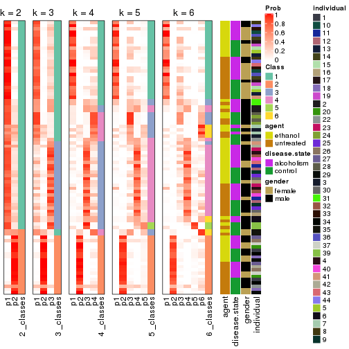


Test correlation between subgroups and known annotations. If the known
annotation is numeric, one-way ANOVA test is applied, and if the known
annotation is discrete, chi-squared contingency table test is applied.

```r
test_to_known_factors(res)
```

```
#>             n agent(p) disease.state(p) gender(p) individual(p) k
#> ATC:hclust 78    1.000            1.000    0.7695      2.08e-04 2
#> ATC:hclust 61    0.550            0.971    0.0248      7.88e-05 3
#> ATC:hclust 63    0.859            0.597    0.0244      9.49e-07 4
#> ATC:hclust 37    0.971            0.363    0.1370      8.59e-04 5
#> ATC:hclust 42    0.990            0.216    0.0633      1.56e-07 6
```


If matrix rows can be associated to genes, consider to use `GO_Enrichment(res,
...)` to perform function enrichment for the signature genes.


 

---------------------------------------------------


### ATC:kmeans*


The object with results only for a single top-value method and a single partition method 
can be extracted as:

```r
res = res_list["ATC", "kmeans"]
# you can also extract it by
# res = res_list["ATC:kmeans"]
```

A summary of `res` and all the functions that can be applied to it:

```r
res
```

```
#> A 'ConsensusPartition' object with k = 2, 3, 4, 5, 6.
#>   On a matrix with 51941 rows and 84 columns.
#>   Top rows (1000, 2000, 3000, 4000, 5000) are extracted by 'ATC' method.
#>   Subgroups are detected by 'kmeans' method.
#>   Performed in total 1250 partitions by row resampling.
#>   Best k for subgroups seems to be 2.
#> 
#> Following methods can be applied to this 'ConsensusPartition' object:
#>  [1] "cola_report"             "collect_classes"         "collect_plots"          
#>  [4] "collect_stats"           "colnames"                "compare_signatures"     
#>  [7] "consensus_heatmap"       "dimension_reduction"     "functional_enrichment"  
#> [10] "get_anno_col"            "get_anno"                "get_classes"            
#> [13] "get_consensus"           "get_matrix"              "get_membership"         
#> [16] "get_param"               "get_signatures"          "get_stats"              
#> [19] "is_best_k"               "is_stable_k"             "membership_heatmap"     
#> [22] "ncol"                    "nrow"                    "plot_ecdf"              
#> [25] "rownames"                "select_partition_number" "show"                   
#> [28] "suggest_best_k"          "test_to_known_factors"
```

`collect_plots()` function collects all the plots made from `res` for all `k` (number of partitions)
into one single page to provide an easy and fast comparison between different `k`.

```r
collect_plots(res)
```


The plots are:

- The first row: a plot of the ECDF (Empirical cumulative distribution
  function) curves of the consensus matrix for each `k` and the heatmap of
  predicted classes for each `k`.
- The second row: heatmaps of the consensus matrix for each `k`.
- The third row: heatmaps of the membership matrix for each `k`.
- The fouth row: heatmaps of the signatures for each `k`.

All the plots in panels can be made by individual functions and they are
plotted later in this section.

`select_partition_number()` produces several plots showing different
statistics for choosing "optimized" `k`. There are following statistics:

- ECDF curves of the consensus matrix for each `k`;
- 1-PAC. [The PAC
  score](https://en.wikipedia.org/wiki/Consensus_clustering#Over-interpretation_potential_of_consensus_clustering)
  measures the proportion of the ambiguous subgrouping.
- Mean silhouette score.
- Concordance. The mean probability of fiting the consensus class ids in all
  partitions.
- Area increased. Denote $A_k$ as the area under the ECDF curve for current
  `k`, the area increased is defined as $A_k - A_{k-1}$.
- Rand index. The percent of pairs of samples that are both in a same cluster
  or both are not in a same cluster in the partition of k and k-1.
- Jaccard index. The ratio of pairs of samples are both in a same cluster in
  the partition of k and k-1 and the pairs of samples are both in a same
  cluster in the partition k or k-1.

The detailed explanations of these statistics can be found in [the cola
vignette](http://bioconductor.org/packages/devel/bioc/vignettes/cola/inst/doc/cola.html#toc_13).

Generally speaking, lower PAC score, higher mean silhouette score or higher
concordance corresponds to better partition. Rand index and Jaccard index
measure how similar the current partition is compared to partition with `k-1`.
If they are too similar, we won't accept `k` is better than `k-1`.

```r
select_partition_number(res)
```


The numeric values for all these statistics can be obtained by `get_stats()`.

```r
get_stats(res)
```

```
#>   k 1-PAC mean_silhouette concordance area_increased  Rand Jaccard
#> 2 2 0.901           0.911       0.960         0.4615 0.535   0.535
#> 3 3 0.789           0.800       0.917         0.4295 0.715   0.504
#> 4 4 0.656           0.729       0.840         0.1326 0.863   0.620
#> 5 5 0.622           0.563       0.717         0.0637 0.918   0.698
#> 6 6 0.651           0.470       0.665         0.0410 0.961   0.823
```

`suggest_best_k()` suggests the best $k$ based on these statistics. The rules are as follows:

- All $k$ with Jaccard index larger than 0.95 are removed because the increase of
  the partition number does not provides enough extra information. If all $k$ are removed,
  the best $k$ is assigned by `NA`.
- For $k$ with 1-PAC larger than 0.9, the maximal $k$ is taken as the "best k". Other $k$ is called "optional k".
- If it does not fit the second rule. The $k$ with the highest vote of highest
  1-PAC, mean silhouette and concordance is taken as the "best k".

```r
suggest_best_k(res)
```

```
#> [1] 2
```


Following shows the table of the partitions (You need to click the **show/hide
code output** link to see it). The membership matrix (columns with name `p*`)
is inferred by
[`clue::cl_consensus()`](https://www.rdocumentation.org/link/cl_consensus?package=clue)
function with the `SE` method. Basically the value in the membership matrix
represents the probability to belong to a certain group. The finall class
label for an item is determined with the group with highest probability it
belongs to.

In `get_classes()` function, the entropy is calculated from the membership
matrix and the silhouette score is calculated from the consensus matrix.


<script>
$( function() {
	$( '#tabs-ATC-kmeans-get-classes' ).tabs();
} );
</script>
<div id='tabs-ATC-kmeans-get-classes'>
<ul>
<li><a href='#tab-ATC-kmeans-get-classes-1'>k = 2</a></li>
<li><a href='#tab-ATC-kmeans-get-classes-2'>k = 3</a></li>
<li><a href='#tab-ATC-kmeans-get-classes-3'>k = 4</a></li>
<li><a href='#tab-ATC-kmeans-get-classes-4'>k = 5</a></li>
<li><a href='#tab-ATC-kmeans-get-classes-5'>k = 6</a></li>
</ul>

<div id='tab-ATC-kmeans-get-classes-1'>
<p><a id='tab-ATC-kmeans-get-classes-1-a' style='color:#0366d6' href='#'>show/hide code output</a></p>
<pre><code class="r">cbind(get_classes(res, k = 2), get_membership(res, k = 2))
</code></pre>

<pre><code>#&gt;            class entropy silhouette    p1    p2
#&gt; GSM1269647     2  0.0000      0.945 0.000 1.000
#&gt; GSM1269655     1  0.0672      0.964 0.992 0.008
#&gt; GSM1269663     2  0.0672      0.940 0.008 0.992
#&gt; GSM1269671     2  0.0000      0.945 0.000 1.000
#&gt; GSM1269679     1  0.2778      0.941 0.952 0.048
#&gt; GSM1269693     1  0.2423      0.947 0.960 0.040
#&gt; GSM1269701     1  0.0000      0.962 1.000 0.000
#&gt; GSM1269709     1  0.0000      0.962 1.000 0.000
#&gt; GSM1269715     1  0.2423      0.947 0.960 0.040
#&gt; GSM1269717     1  0.3114      0.940 0.944 0.056
#&gt; GSM1269721     1  0.2423      0.947 0.960 0.040
#&gt; GSM1269723     2  0.0672      0.940 0.008 0.992
#&gt; GSM1269645     2  0.0672      0.940 0.008 0.992
#&gt; GSM1269653     1  0.0000      0.962 1.000 0.000
#&gt; GSM1269661     2  0.0000      0.945 0.000 1.000
#&gt; GSM1269669     1  0.0376      0.962 0.996 0.004
#&gt; GSM1269677     2  0.0000      0.945 0.000 1.000
#&gt; GSM1269685     1  0.0000      0.962 1.000 0.000
#&gt; GSM1269691     1  0.0000      0.962 1.000 0.000
#&gt; GSM1269699     1  0.0672      0.964 0.992 0.008
#&gt; GSM1269707     1  0.0000      0.962 1.000 0.000
#&gt; GSM1269651     2  0.0000      0.945 0.000 1.000
#&gt; GSM1269659     1  0.2423      0.947 0.960 0.040
#&gt; GSM1269667     2  0.0000      0.945 0.000 1.000
#&gt; GSM1269675     1  0.2423      0.947 0.960 0.040
#&gt; GSM1269683     1  0.9954      0.123 0.540 0.460
#&gt; GSM1269689     1  0.2423      0.947 0.960 0.040
#&gt; GSM1269697     1  0.0672      0.964 0.992 0.008
#&gt; GSM1269705     1  0.0672      0.964 0.992 0.008
#&gt; GSM1269713     1  0.0376      0.962 0.996 0.004
#&gt; GSM1269719     2  0.7453      0.726 0.212 0.788
#&gt; GSM1269725     1  0.0672      0.964 0.992 0.008
#&gt; GSM1269727     1  0.2948      0.937 0.948 0.052
#&gt; GSM1269649     2  0.0000      0.945 0.000 1.000
#&gt; GSM1269657     1  0.0672      0.964 0.992 0.008
#&gt; GSM1269665     2  0.0000      0.945 0.000 1.000
#&gt; GSM1269673     1  0.2423      0.947 0.960 0.040
#&gt; GSM1269681     2  0.0000      0.945 0.000 1.000
#&gt; GSM1269687     1  0.0938      0.963 0.988 0.012
#&gt; GSM1269695     1  0.0000      0.962 1.000 0.000
#&gt; GSM1269703     1  0.2423      0.947 0.960 0.040
#&gt; GSM1269711     1  0.2423      0.947 0.960 0.040
#&gt; GSM1269646     2  0.0000      0.945 0.000 1.000
#&gt; GSM1269654     1  0.0672      0.964 0.992 0.008
#&gt; GSM1269662     2  0.0000      0.945 0.000 1.000
#&gt; GSM1269670     2  0.0000      0.945 0.000 1.000
#&gt; GSM1269678     1  0.0672      0.964 0.992 0.008
#&gt; GSM1269692     1  0.0672      0.964 0.992 0.008
#&gt; GSM1269700     1  0.0000      0.962 1.000 0.000
#&gt; GSM1269708     1  0.0672      0.964 0.992 0.008
#&gt; GSM1269714     1  0.0000      0.962 1.000 0.000
#&gt; GSM1269716     1  0.0672      0.964 0.992 0.008
#&gt; GSM1269720     1  0.8327      0.646 0.736 0.264
#&gt; GSM1269722     1  0.5294      0.873 0.880 0.120
#&gt; GSM1269644     2  0.0000      0.945 0.000 1.000
#&gt; GSM1269652     1  0.0672      0.964 0.992 0.008
#&gt; GSM1269660     2  0.0000      0.945 0.000 1.000
#&gt; GSM1269668     1  0.0672      0.964 0.992 0.008
#&gt; GSM1269676     2  0.9933      0.168 0.452 0.548
#&gt; GSM1269684     1  0.0000      0.962 1.000 0.000
#&gt; GSM1269690     1  0.0672      0.964 0.992 0.008
#&gt; GSM1269698     1  0.0672      0.964 0.992 0.008
#&gt; GSM1269706     1  0.0000      0.962 1.000 0.000
#&gt; GSM1269650     2  0.0000      0.945 0.000 1.000
#&gt; GSM1269658     1  0.8555      0.615 0.720 0.280
#&gt; GSM1269666     2  0.0000      0.945 0.000 1.000
#&gt; GSM1269674     1  0.2423      0.947 0.960 0.040
#&gt; GSM1269682     2  0.0000      0.945 0.000 1.000
#&gt; GSM1269688     1  0.0000      0.962 1.000 0.000
#&gt; GSM1269696     1  0.0672      0.964 0.992 0.008
#&gt; GSM1269704     1  0.0672      0.964 0.992 0.008
#&gt; GSM1269712     2  0.0000      0.945 0.000 1.000
#&gt; GSM1269718     2  0.7453      0.726 0.212 0.788
#&gt; GSM1269724     2  0.9833      0.315 0.424 0.576
#&gt; GSM1269726     2  0.4161      0.884 0.084 0.916
#&gt; GSM1269648     2  0.0000      0.945 0.000 1.000
#&gt; GSM1269656     1  0.0672      0.964 0.992 0.008
#&gt; GSM1269664     2  0.0000      0.945 0.000 1.000
#&gt; GSM1269672     1  0.0672      0.964 0.992 0.008
#&gt; GSM1269680     2  0.0000      0.945 0.000 1.000
#&gt; GSM1269686     1  0.0672      0.964 0.992 0.008
#&gt; GSM1269694     1  0.0672      0.964 0.992 0.008
#&gt; GSM1269702     1  0.0672      0.964 0.992 0.008
#&gt; GSM1269710     2  0.5059      0.857 0.112 0.888
</code></pre>

<script>
$('#tab-ATC-kmeans-get-classes-1-a').parent().next().next().hide();
$('#tab-ATC-kmeans-get-classes-1-a').click(function(){
  $('#tab-ATC-kmeans-get-classes-1-a').parent().next().next().toggle();
  return(false);
});
</script>
</div>

<div id='tab-ATC-kmeans-get-classes-2'>
<p><a id='tab-ATC-kmeans-get-classes-2-a' style='color:#0366d6' href='#'>show/hide code output</a></p>
<pre><code class="r">cbind(get_classes(res, k = 3), get_membership(res, k = 3))
</code></pre>

<pre><code>#&gt;            class entropy silhouette    p1    p2    p3
#&gt; GSM1269647     2  0.0592     0.8820 0.000 0.988 0.012
#&gt; GSM1269655     1  0.0237     0.9111 0.996 0.000 0.004
#&gt; GSM1269663     2  0.0237     0.8814 0.000 0.996 0.004
#&gt; GSM1269671     2  0.6225     0.2859 0.000 0.568 0.432
#&gt; GSM1269679     3  0.0829     0.9246 0.012 0.004 0.984
#&gt; GSM1269693     3  0.0592     0.9242 0.012 0.000 0.988
#&gt; GSM1269701     1  0.3619     0.8091 0.864 0.000 0.136
#&gt; GSM1269709     1  0.0000     0.9121 1.000 0.000 0.000
#&gt; GSM1269715     3  0.0592     0.9242 0.012 0.000 0.988
#&gt; GSM1269717     3  0.0592     0.9242 0.012 0.000 0.988
#&gt; GSM1269721     3  0.0592     0.9242 0.012 0.000 0.988
#&gt; GSM1269723     3  0.0424     0.9186 0.000 0.008 0.992
#&gt; GSM1269645     2  0.0237     0.8820 0.000 0.996 0.004
#&gt; GSM1269653     3  0.0747     0.9235 0.016 0.000 0.984
#&gt; GSM1269661     2  0.0424     0.8818 0.000 0.992 0.008
#&gt; GSM1269669     3  0.4931     0.7058 0.212 0.004 0.784
#&gt; GSM1269677     2  0.6309     0.0929 0.000 0.504 0.496
#&gt; GSM1269685     1  0.0000     0.9121 1.000 0.000 0.000
#&gt; GSM1269691     1  0.0000     0.9121 1.000 0.000 0.000
#&gt; GSM1269699     1  0.0000     0.9121 1.000 0.000 0.000
#&gt; GSM1269707     3  0.0592     0.9242 0.012 0.000 0.988
#&gt; GSM1269651     2  0.0237     0.8814 0.000 0.996 0.004
#&gt; GSM1269659     3  0.1163     0.9149 0.028 0.000 0.972
#&gt; GSM1269667     2  0.0424     0.8818 0.000 0.992 0.008
#&gt; GSM1269675     3  0.0829     0.9246 0.012 0.004 0.984
#&gt; GSM1269683     3  0.0424     0.9185 0.000 0.008 0.992
#&gt; GSM1269689     3  0.0829     0.9246 0.012 0.004 0.984
#&gt; GSM1269697     1  0.0424     0.9086 0.992 0.000 0.008
#&gt; GSM1269705     1  0.0000     0.9121 1.000 0.000 0.000
#&gt; GSM1269713     3  0.0829     0.9246 0.012 0.004 0.984
#&gt; GSM1269719     2  0.8382     0.1700 0.084 0.492 0.424
#&gt; GSM1269725     1  0.1163     0.8990 0.972 0.000 0.028
#&gt; GSM1269727     3  0.0661     0.9233 0.008 0.004 0.988
#&gt; GSM1269649     2  0.0592     0.8820 0.000 0.988 0.012
#&gt; GSM1269657     1  0.0237     0.9111 0.996 0.000 0.004
#&gt; GSM1269665     2  0.0237     0.8820 0.000 0.996 0.004
#&gt; GSM1269673     3  0.3030     0.8551 0.092 0.004 0.904
#&gt; GSM1269681     2  0.0000     0.8817 0.000 1.000 0.000
#&gt; GSM1269687     1  0.6505     0.1544 0.528 0.004 0.468
#&gt; GSM1269695     1  0.0000     0.9121 1.000 0.000 0.000
#&gt; GSM1269703     3  0.0829     0.9246 0.012 0.004 0.984
#&gt; GSM1269711     3  0.0829     0.9246 0.012 0.004 0.984
#&gt; GSM1269646     2  0.0424     0.8818 0.000 0.992 0.008
#&gt; GSM1269654     1  0.0237     0.9111 0.996 0.000 0.004
#&gt; GSM1269662     2  0.0237     0.8820 0.000 0.996 0.004
#&gt; GSM1269670     2  0.0424     0.8818 0.000 0.992 0.008
#&gt; GSM1269678     1  0.4842     0.6903 0.776 0.000 0.224
#&gt; GSM1269692     1  0.1163     0.8993 0.972 0.000 0.028
#&gt; GSM1269700     1  0.4702     0.7349 0.788 0.000 0.212
#&gt; GSM1269708     1  0.0000     0.9121 1.000 0.000 0.000
#&gt; GSM1269714     1  0.1163     0.8993 0.972 0.000 0.028
#&gt; GSM1269716     1  0.6140     0.3349 0.596 0.000 0.404
#&gt; GSM1269720     3  0.0475     0.9219 0.004 0.004 0.992
#&gt; GSM1269722     3  0.0237     0.9220 0.004 0.000 0.996
#&gt; GSM1269644     2  0.0237     0.8814 0.000 0.996 0.004
#&gt; GSM1269652     1  0.0000     0.9121 1.000 0.000 0.000
#&gt; GSM1269660     2  0.0424     0.8818 0.000 0.992 0.008
#&gt; GSM1269668     1  0.0000     0.9121 1.000 0.000 0.000
#&gt; GSM1269676     3  0.9773     0.0439 0.240 0.340 0.420
#&gt; GSM1269684     1  0.5733     0.5208 0.676 0.000 0.324
#&gt; GSM1269690     1  0.0000     0.9121 1.000 0.000 0.000
#&gt; GSM1269698     1  0.0000     0.9121 1.000 0.000 0.000
#&gt; GSM1269706     3  0.2066     0.8889 0.060 0.000 0.940
#&gt; GSM1269650     2  0.0237     0.8814 0.000 0.996 0.004
#&gt; GSM1269658     3  0.0848     0.9174 0.008 0.008 0.984
#&gt; GSM1269666     2  0.0424     0.8816 0.000 0.992 0.008
#&gt; GSM1269674     3  0.4733     0.7326 0.196 0.004 0.800
#&gt; GSM1269682     3  0.6305    -0.1006 0.000 0.484 0.516
#&gt; GSM1269688     1  0.3482     0.8150 0.872 0.000 0.128
#&gt; GSM1269696     1  0.2796     0.8527 0.908 0.000 0.092
#&gt; GSM1269704     1  0.0000     0.9121 1.000 0.000 0.000
#&gt; GSM1269712     2  0.6291     0.1851 0.000 0.532 0.468
#&gt; GSM1269718     2  0.8701     0.1941 0.108 0.492 0.400
#&gt; GSM1269724     1  0.8097     0.2610 0.540 0.072 0.388
#&gt; GSM1269726     3  0.0424     0.9186 0.000 0.008 0.992
#&gt; GSM1269648     2  0.0424     0.8816 0.000 0.992 0.008
#&gt; GSM1269656     1  0.0237     0.9111 0.996 0.000 0.004
#&gt; GSM1269664     2  0.0237     0.8820 0.000 0.996 0.004
#&gt; GSM1269672     1  0.0000     0.9121 1.000 0.000 0.000
#&gt; GSM1269680     2  0.0424     0.8792 0.000 0.992 0.008
#&gt; GSM1269686     1  0.0000     0.9121 1.000 0.000 0.000
#&gt; GSM1269694     1  0.0000     0.9121 1.000 0.000 0.000
#&gt; GSM1269702     1  0.0000     0.9121 1.000 0.000 0.000
#&gt; GSM1269710     3  0.0424     0.9186 0.000 0.008 0.992
</code></pre>

<script>
$('#tab-ATC-kmeans-get-classes-2-a').parent().next().next().hide();
$('#tab-ATC-kmeans-get-classes-2-a').click(function(){
  $('#tab-ATC-kmeans-get-classes-2-a').parent().next().next().toggle();
  return(false);
});
</script>
</div>

<div id='tab-ATC-kmeans-get-classes-3'>
<p><a id='tab-ATC-kmeans-get-classes-3-a' style='color:#0366d6' href='#'>show/hide code output</a></p>
<pre><code class="r">cbind(get_classes(res, k = 4), get_membership(res, k = 4))
</code></pre>

<pre><code>#&gt;            class entropy silhouette    p1    p2    p3    p4
#&gt; GSM1269647     2  0.1716    0.96192 0.000 0.936 0.000 0.064
#&gt; GSM1269655     1  0.3311    0.76904 0.828 0.000 0.000 0.172
#&gt; GSM1269663     2  0.1792    0.96007 0.000 0.932 0.000 0.068
#&gt; GSM1269671     4  0.7034    0.51108 0.000 0.220 0.204 0.576
#&gt; GSM1269679     3  0.4222    0.58742 0.000 0.000 0.728 0.272
#&gt; GSM1269693     3  0.2589    0.74551 0.000 0.000 0.884 0.116
#&gt; GSM1269701     1  0.5174    0.69656 0.756 0.000 0.152 0.092
#&gt; GSM1269709     1  0.1743    0.84095 0.940 0.000 0.004 0.056
#&gt; GSM1269715     3  0.2011    0.75763 0.000 0.000 0.920 0.080
#&gt; GSM1269717     4  0.4134    0.55562 0.000 0.000 0.260 0.740
#&gt; GSM1269721     3  0.2647    0.74451 0.000 0.000 0.880 0.120
#&gt; GSM1269723     3  0.2408    0.72945 0.000 0.000 0.896 0.104
#&gt; GSM1269645     2  0.0188    0.96338 0.000 0.996 0.000 0.004
#&gt; GSM1269653     3  0.3486    0.68964 0.000 0.000 0.812 0.188
#&gt; GSM1269661     2  0.0469    0.96292 0.000 0.988 0.000 0.012
#&gt; GSM1269669     3  0.6317    0.50836 0.116 0.000 0.644 0.240
#&gt; GSM1269677     4  0.4352    0.66481 0.000 0.080 0.104 0.816
#&gt; GSM1269685     1  0.1118    0.84962 0.964 0.000 0.000 0.036
#&gt; GSM1269691     1  0.1022    0.84939 0.968 0.000 0.000 0.032
#&gt; GSM1269699     1  0.0921    0.85158 0.972 0.000 0.000 0.028
#&gt; GSM1269707     3  0.2081    0.75762 0.000 0.000 0.916 0.084
#&gt; GSM1269651     2  0.1637    0.96054 0.000 0.940 0.000 0.060
#&gt; GSM1269659     3  0.2868    0.73876 0.000 0.000 0.864 0.136
#&gt; GSM1269667     2  0.1716    0.96120 0.000 0.936 0.000 0.064
#&gt; GSM1269675     3  0.1022    0.76416 0.000 0.000 0.968 0.032
#&gt; GSM1269683     3  0.0336    0.76671 0.000 0.000 0.992 0.008
#&gt; GSM1269689     3  0.1022    0.76352 0.000 0.000 0.968 0.032
#&gt; GSM1269697     1  0.2530    0.81658 0.896 0.000 0.004 0.100
#&gt; GSM1269705     1  0.0921    0.85158 0.972 0.000 0.000 0.028
#&gt; GSM1269713     3  0.4994   -0.08395 0.000 0.000 0.520 0.480
#&gt; GSM1269719     4  0.5689    0.70519 0.040 0.108 0.088 0.764
#&gt; GSM1269725     4  0.5496    0.54281 0.312 0.000 0.036 0.652
#&gt; GSM1269727     3  0.0188    0.76625 0.000 0.000 0.996 0.004
#&gt; GSM1269649     2  0.1792    0.96044 0.000 0.932 0.000 0.068
#&gt; GSM1269657     1  0.4040    0.70987 0.752 0.000 0.000 0.248
#&gt; GSM1269665     2  0.0336    0.96278 0.000 0.992 0.000 0.008
#&gt; GSM1269673     3  0.6179    0.51695 0.076 0.004 0.644 0.276
#&gt; GSM1269681     2  0.1637    0.93022 0.000 0.940 0.000 0.060
#&gt; GSM1269687     4  0.5672    0.61399 0.100 0.000 0.188 0.712
#&gt; GSM1269695     1  0.1557    0.84522 0.944 0.000 0.000 0.056
#&gt; GSM1269703     3  0.3356    0.68514 0.000 0.000 0.824 0.176
#&gt; GSM1269711     3  0.1557    0.76009 0.000 0.000 0.944 0.056
#&gt; GSM1269646     2  0.0469    0.96292 0.000 0.988 0.000 0.012
#&gt; GSM1269654     1  0.4877    0.35183 0.592 0.000 0.000 0.408
#&gt; GSM1269662     2  0.0336    0.96278 0.000 0.992 0.000 0.008
#&gt; GSM1269670     2  0.0469    0.96292 0.000 0.988 0.000 0.012
#&gt; GSM1269678     4  0.5219    0.64492 0.244 0.000 0.044 0.712
#&gt; GSM1269692     1  0.4382    0.66225 0.704 0.000 0.000 0.296
#&gt; GSM1269700     1  0.6469    0.53089 0.644 0.000 0.192 0.164
#&gt; GSM1269708     1  0.0817    0.85262 0.976 0.000 0.000 0.024
#&gt; GSM1269714     1  0.4250    0.68356 0.724 0.000 0.000 0.276
#&gt; GSM1269716     4  0.4322    0.67258 0.152 0.000 0.044 0.804
#&gt; GSM1269720     3  0.2647    0.74303 0.000 0.000 0.880 0.120
#&gt; GSM1269722     4  0.4843    0.38672 0.000 0.000 0.396 0.604
#&gt; GSM1269644     2  0.1940    0.95745 0.000 0.924 0.000 0.076
#&gt; GSM1269652     1  0.0817    0.85262 0.976 0.000 0.000 0.024
#&gt; GSM1269660     2  0.0469    0.96292 0.000 0.988 0.000 0.012
#&gt; GSM1269668     1  0.1118    0.85034 0.964 0.000 0.000 0.036
#&gt; GSM1269676     4  0.4319    0.68189 0.096 0.020 0.048 0.836
#&gt; GSM1269684     1  0.6867    0.32870 0.508 0.000 0.108 0.384
#&gt; GSM1269690     1  0.0469    0.85370 0.988 0.000 0.000 0.012
#&gt; GSM1269698     1  0.1389    0.85060 0.952 0.000 0.000 0.048
#&gt; GSM1269706     4  0.5853    0.00372 0.032 0.000 0.460 0.508
#&gt; GSM1269650     2  0.1637    0.96054 0.000 0.940 0.000 0.060
#&gt; GSM1269658     3  0.3831    0.67763 0.000 0.004 0.792 0.204
#&gt; GSM1269666     2  0.1940    0.95910 0.000 0.924 0.000 0.076
#&gt; GSM1269674     3  0.6759    0.36016 0.108 0.000 0.548 0.344
#&gt; GSM1269682     4  0.6198    0.62942 0.000 0.116 0.224 0.660
#&gt; GSM1269688     1  0.4415    0.73211 0.804 0.000 0.140 0.056
#&gt; GSM1269696     4  0.5557    0.55372 0.308 0.000 0.040 0.652
#&gt; GSM1269704     1  0.1389    0.85060 0.952 0.000 0.000 0.048
#&gt; GSM1269712     4  0.6586    0.61925 0.000 0.216 0.156 0.628
#&gt; GSM1269718     4  0.5795    0.70668 0.052 0.112 0.076 0.760
#&gt; GSM1269724     4  0.5644    0.69160 0.144 0.012 0.100 0.744
#&gt; GSM1269726     3  0.2216    0.73509 0.000 0.000 0.908 0.092
#&gt; GSM1269648     2  0.1940    0.95910 0.000 0.924 0.000 0.076
#&gt; GSM1269656     1  0.3356    0.76609 0.824 0.000 0.000 0.176
#&gt; GSM1269664     2  0.0336    0.96278 0.000 0.992 0.000 0.008
#&gt; GSM1269672     1  0.1637    0.84654 0.940 0.000 0.000 0.060
#&gt; GSM1269680     4  0.4914    0.47674 0.012 0.312 0.000 0.676
#&gt; GSM1269686     1  0.1716    0.84046 0.936 0.000 0.000 0.064
#&gt; GSM1269694     1  0.0921    0.85158 0.972 0.000 0.000 0.028
#&gt; GSM1269702     1  0.0707    0.85283 0.980 0.000 0.000 0.020
#&gt; GSM1269710     3  0.4994   -0.02826 0.000 0.000 0.520 0.480
</code></pre>

<script>
$('#tab-ATC-kmeans-get-classes-3-a').parent().next().next().hide();
$('#tab-ATC-kmeans-get-classes-3-a').click(function(){
  $('#tab-ATC-kmeans-get-classes-3-a').parent().next().next().toggle();
  return(false);
});
</script>
</div>

<div id='tab-ATC-kmeans-get-classes-4'>
<p><a id='tab-ATC-kmeans-get-classes-4-a' style='color:#0366d6' href='#'>show/hide code output</a></p>
<pre><code class="r">cbind(get_classes(res, k = 5), get_membership(res, k = 5))
</code></pre>

<pre><code>#&gt;            class entropy silhouette    p1    p2    p3    p4    p5
#&gt; GSM1269647     2  0.3724     0.8648 0.204 0.776 0.020 0.000 0.000
#&gt; GSM1269655     5  0.4797     0.5662 0.044 0.000 0.296 0.000 0.660
#&gt; GSM1269663     2  0.4180     0.8521 0.220 0.744 0.036 0.000 0.000
#&gt; GSM1269671     3  0.7144     0.2714 0.300 0.132 0.504 0.064 0.000
#&gt; GSM1269679     1  0.6483     0.0945 0.452 0.000 0.192 0.356 0.000
#&gt; GSM1269693     4  0.1893     0.6530 0.024 0.000 0.048 0.928 0.000
#&gt; GSM1269701     1  0.5427    -0.1798 0.480 0.000 0.020 0.024 0.476
#&gt; GSM1269709     5  0.2719     0.6683 0.144 0.000 0.000 0.004 0.852
#&gt; GSM1269715     4  0.0963     0.6746 0.036 0.000 0.000 0.964 0.000
#&gt; GSM1269717     3  0.4498     0.4590 0.032 0.000 0.688 0.280 0.000
#&gt; GSM1269721     4  0.1981     0.6519 0.028 0.000 0.048 0.924 0.000
#&gt; GSM1269723     4  0.5352     0.5334 0.160 0.004 0.152 0.684 0.000
#&gt; GSM1269645     2  0.0324     0.8728 0.004 0.992 0.004 0.000 0.000
#&gt; GSM1269653     4  0.5723     0.2753 0.392 0.000 0.088 0.520 0.000
#&gt; GSM1269661     2  0.0566     0.8724 0.004 0.984 0.012 0.000 0.000
#&gt; GSM1269669     1  0.7747     0.4782 0.476 0.000 0.172 0.236 0.116
#&gt; GSM1269677     3  0.4406     0.4535 0.060 0.024 0.788 0.128 0.000
#&gt; GSM1269685     5  0.2352     0.7041 0.092 0.000 0.008 0.004 0.896
#&gt; GSM1269691     5  0.2011     0.7096 0.088 0.000 0.000 0.004 0.908
#&gt; GSM1269699     5  0.3236     0.6958 0.152 0.000 0.020 0.000 0.828
#&gt; GSM1269707     4  0.1661     0.6717 0.036 0.000 0.024 0.940 0.000
#&gt; GSM1269651     2  0.4203     0.8545 0.188 0.760 0.052 0.000 0.000
#&gt; GSM1269659     4  0.3254     0.6181 0.060 0.000 0.052 0.868 0.020
#&gt; GSM1269667     2  0.3456     0.8691 0.184 0.800 0.016 0.000 0.000
#&gt; GSM1269675     4  0.4787     0.4465 0.324 0.000 0.036 0.640 0.000
#&gt; GSM1269683     4  0.3106     0.6508 0.140 0.000 0.020 0.840 0.000
#&gt; GSM1269689     4  0.3861     0.5552 0.264 0.000 0.008 0.728 0.000
#&gt; GSM1269697     5  0.5421     0.4893 0.276 0.000 0.096 0.000 0.628
#&gt; GSM1269705     5  0.3278     0.6950 0.156 0.000 0.020 0.000 0.824
#&gt; GSM1269713     3  0.6685     0.1229 0.236 0.000 0.388 0.376 0.000
#&gt; GSM1269719     3  0.2966     0.4994 0.056 0.032 0.888 0.004 0.020
#&gt; GSM1269725     3  0.6389     0.3285 0.284 0.000 0.528 0.004 0.184
#&gt; GSM1269727     4  0.2864     0.6532 0.136 0.000 0.012 0.852 0.000
#&gt; GSM1269649     2  0.3929     0.8611 0.208 0.764 0.028 0.000 0.000
#&gt; GSM1269657     5  0.5669     0.4859 0.040 0.000 0.312 0.036 0.612
#&gt; GSM1269665     2  0.0324     0.8728 0.004 0.992 0.004 0.000 0.000
#&gt; GSM1269673     1  0.7534     0.4528 0.488 0.000 0.180 0.248 0.084
#&gt; GSM1269681     2  0.3182     0.7803 0.032 0.844 0.124 0.000 0.000
#&gt; GSM1269687     1  0.6207     0.2115 0.480 0.000 0.424 0.028 0.068
#&gt; GSM1269695     5  0.3724     0.6763 0.204 0.000 0.020 0.000 0.776
#&gt; GSM1269703     4  0.5976     0.2574 0.376 0.000 0.116 0.508 0.000
#&gt; GSM1269711     4  0.4585     0.4332 0.352 0.000 0.020 0.628 0.000
#&gt; GSM1269646     2  0.0693     0.8746 0.012 0.980 0.008 0.000 0.000
#&gt; GSM1269654     5  0.5350     0.2792 0.052 0.000 0.460 0.000 0.488
#&gt; GSM1269662     2  0.0324     0.8728 0.004 0.992 0.004 0.000 0.000
#&gt; GSM1269670     2  0.0865     0.8674 0.004 0.972 0.024 0.000 0.000
#&gt; GSM1269678     3  0.5309     0.3671 0.160 0.000 0.676 0.000 0.164
#&gt; GSM1269692     5  0.7047     0.3647 0.048 0.000 0.308 0.144 0.500
#&gt; GSM1269700     1  0.6232     0.3106 0.596 0.000 0.092 0.036 0.276
#&gt; GSM1269708     5  0.0579     0.7351 0.008 0.000 0.008 0.000 0.984
#&gt; GSM1269714     5  0.6510     0.4185 0.032 0.000 0.288 0.120 0.560
#&gt; GSM1269716     3  0.4806     0.4630 0.044 0.000 0.772 0.076 0.108
#&gt; GSM1269720     4  0.1915     0.6590 0.032 0.000 0.040 0.928 0.000
#&gt; GSM1269722     3  0.6436     0.3067 0.164 0.004 0.488 0.344 0.000
#&gt; GSM1269644     2  0.4762     0.8318 0.236 0.700 0.064 0.000 0.000
#&gt; GSM1269652     5  0.0579     0.7351 0.008 0.000 0.008 0.000 0.984
#&gt; GSM1269660     2  0.0566     0.8724 0.004 0.984 0.012 0.000 0.000
#&gt; GSM1269668     5  0.2824     0.7003 0.116 0.000 0.020 0.000 0.864
#&gt; GSM1269676     3  0.4815     0.4360 0.068 0.012 0.780 0.112 0.028
#&gt; GSM1269684     3  0.8133    -0.0738 0.136 0.000 0.372 0.176 0.316
#&gt; GSM1269690     5  0.0703     0.7333 0.024 0.000 0.000 0.000 0.976
#&gt; GSM1269698     5  0.3615     0.6946 0.156 0.000 0.036 0.000 0.808
#&gt; GSM1269706     4  0.5415     0.2268 0.028 0.000 0.340 0.604 0.028
#&gt; GSM1269650     2  0.4203     0.8545 0.188 0.760 0.052 0.000 0.000
#&gt; GSM1269658     4  0.4946     0.3874 0.056 0.004 0.260 0.680 0.000
#&gt; GSM1269666     2  0.4424     0.8479 0.224 0.728 0.048 0.000 0.000
#&gt; GSM1269674     1  0.7789     0.4430 0.432 0.000 0.296 0.176 0.096
#&gt; GSM1269682     3  0.6027     0.4354 0.116 0.032 0.644 0.208 0.000
#&gt; GSM1269688     5  0.4404     0.4188 0.264 0.000 0.000 0.032 0.704
#&gt; GSM1269696     3  0.6554     0.3345 0.296 0.004 0.528 0.008 0.164
#&gt; GSM1269704     5  0.3536     0.6961 0.156 0.000 0.032 0.000 0.812
#&gt; GSM1269712     3  0.7667     0.4009 0.164 0.192 0.504 0.140 0.000
#&gt; GSM1269718     3  0.2675     0.5044 0.040 0.032 0.904 0.004 0.020
#&gt; GSM1269724     3  0.6206     0.4475 0.240 0.008 0.632 0.036 0.084
#&gt; GSM1269726     4  0.4961     0.5714 0.140 0.004 0.132 0.724 0.000
#&gt; GSM1269648     2  0.4666     0.8383 0.240 0.704 0.056 0.000 0.000
#&gt; GSM1269656     5  0.4219     0.5853 0.024 0.000 0.260 0.000 0.716
#&gt; GSM1269664     2  0.0324     0.8728 0.004 0.992 0.004 0.000 0.000
#&gt; GSM1269672     5  0.3239     0.6947 0.068 0.000 0.080 0.000 0.852
#&gt; GSM1269680     3  0.5434     0.3487 0.156 0.152 0.684 0.000 0.008
#&gt; GSM1269686     5  0.2645     0.7262 0.044 0.000 0.068 0.000 0.888
#&gt; GSM1269694     5  0.3061     0.7028 0.136 0.000 0.020 0.000 0.844
#&gt; GSM1269702     5  0.1082     0.7369 0.028 0.000 0.008 0.000 0.964
#&gt; GSM1269710     3  0.6890     0.1022 0.264 0.004 0.380 0.352 0.000
</code></pre>

<script>
$('#tab-ATC-kmeans-get-classes-4-a').parent().next().next().hide();
$('#tab-ATC-kmeans-get-classes-4-a').click(function(){
  $('#tab-ATC-kmeans-get-classes-4-a').parent().next().next().toggle();
  return(false);
});
</script>
</div>

<div id='tab-ATC-kmeans-get-classes-5'>
<p><a id='tab-ATC-kmeans-get-classes-5-a' style='color:#0366d6' href='#'>show/hide code output</a></p>
<pre><code class="r">cbind(get_classes(res, k = 6), get_membership(res, k = 6))
</code></pre>

<pre><code>#&gt;            class entropy silhouette    p1    p2    p3    p4    p5    p6
#&gt; GSM1269647     2  0.4386     0.7702 0.000 0.652 0.000 0.000 0.048 0.300
#&gt; GSM1269655     1  0.6662     0.2718 0.468 0.000 0.144 0.000 0.076 0.312
#&gt; GSM1269663     2  0.4939     0.7602 0.000 0.612 0.000 0.000 0.096 0.292
#&gt; GSM1269671     3  0.5832     0.2250 0.000 0.052 0.504 0.024 0.396 0.024
#&gt; GSM1269679     5  0.4505     0.5496 0.000 0.000 0.120 0.136 0.732 0.012
#&gt; GSM1269693     4  0.1693     0.6307 0.000 0.000 0.004 0.932 0.020 0.044
#&gt; GSM1269701     5  0.6483     0.0849 0.352 0.000 0.088 0.012 0.484 0.064
#&gt; GSM1269709     1  0.4346     0.5702 0.740 0.000 0.008 0.020 0.196 0.036
#&gt; GSM1269715     4  0.2249     0.6279 0.000 0.000 0.032 0.900 0.064 0.004
#&gt; GSM1269717     3  0.6244     0.1995 0.000 0.000 0.576 0.176 0.072 0.176
#&gt; GSM1269721     4  0.1713     0.6262 0.000 0.000 0.000 0.928 0.028 0.044
#&gt; GSM1269723     4  0.5939     0.1728 0.000 0.000 0.404 0.444 0.136 0.016
#&gt; GSM1269645     2  0.0717     0.7769 0.000 0.976 0.000 0.000 0.008 0.016
#&gt; GSM1269653     5  0.5867     0.4163 0.000 0.000 0.168 0.272 0.544 0.016
#&gt; GSM1269661     2  0.0146     0.7798 0.000 0.996 0.000 0.000 0.004 0.000
#&gt; GSM1269669     5  0.2941     0.5890 0.024 0.000 0.012 0.092 0.864 0.008
#&gt; GSM1269677     6  0.6722     0.4784 0.000 0.008 0.360 0.084 0.100 0.448
#&gt; GSM1269685     1  0.3618     0.6355 0.820 0.000 0.004 0.024 0.112 0.040
#&gt; GSM1269691     1  0.2290     0.6544 0.892 0.000 0.004 0.000 0.084 0.020
#&gt; GSM1269699     1  0.3895     0.6437 0.804 0.000 0.096 0.000 0.040 0.060
#&gt; GSM1269707     4  0.2344     0.6270 0.000 0.000 0.028 0.896 0.068 0.008
#&gt; GSM1269651     2  0.3756     0.7481 0.000 0.600 0.000 0.000 0.000 0.400
#&gt; GSM1269659     4  0.2993     0.5950 0.008 0.000 0.012 0.868 0.048 0.064
#&gt; GSM1269667     2  0.4145     0.7805 0.000 0.700 0.000 0.000 0.048 0.252
#&gt; GSM1269675     5  0.4497     0.3226 0.000 0.000 0.020 0.368 0.600 0.012
#&gt; GSM1269683     4  0.4998     0.4645 0.000 0.000 0.112 0.676 0.196 0.016
#&gt; GSM1269689     4  0.5174    -0.0475 0.000 0.000 0.052 0.512 0.420 0.016
#&gt; GSM1269697     1  0.6278     0.4189 0.536 0.000 0.284 0.000 0.084 0.096
#&gt; GSM1269705     1  0.4180     0.6423 0.784 0.000 0.096 0.000 0.044 0.076
#&gt; GSM1269713     3  0.5577     0.3129 0.000 0.000 0.604 0.212 0.168 0.016
#&gt; GSM1269719     3  0.5500    -0.1556 0.008 0.008 0.580 0.000 0.100 0.304
#&gt; GSM1269725     3  0.5691     0.3310 0.120 0.000 0.664 0.004 0.084 0.128
#&gt; GSM1269727     4  0.4681     0.4948 0.000 0.000 0.104 0.708 0.176 0.012
#&gt; GSM1269649     2  0.4498     0.7687 0.000 0.644 0.000 0.000 0.056 0.300
#&gt; GSM1269657     1  0.7151     0.2127 0.480 0.000 0.096 0.032 0.104 0.288
#&gt; GSM1269665     2  0.0717     0.7769 0.000 0.976 0.000 0.000 0.008 0.016
#&gt; GSM1269673     5  0.3157     0.5862 0.016 0.000 0.020 0.080 0.860 0.024
#&gt; GSM1269681     2  0.5403     0.4146 0.000 0.648 0.132 0.004 0.020 0.196
#&gt; GSM1269687     5  0.4289     0.4402 0.016 0.000 0.156 0.012 0.764 0.052
#&gt; GSM1269695     1  0.4529     0.6369 0.760 0.000 0.096 0.000 0.080 0.064
#&gt; GSM1269703     5  0.6432     0.2882 0.000 0.000 0.260 0.268 0.448 0.024
#&gt; GSM1269711     5  0.4699     0.3288 0.000 0.000 0.036 0.376 0.580 0.008
#&gt; GSM1269646     2  0.0363     0.7807 0.000 0.988 0.000 0.000 0.000 0.012
#&gt; GSM1269654     1  0.7105    -0.0187 0.364 0.000 0.204 0.000 0.088 0.344
#&gt; GSM1269662     2  0.0717     0.7769 0.000 0.976 0.000 0.000 0.008 0.016
#&gt; GSM1269670     2  0.1285     0.7458 0.000 0.944 0.052 0.000 0.000 0.004
#&gt; GSM1269678     3  0.7056    -0.0461 0.096 0.000 0.392 0.000 0.336 0.176
#&gt; GSM1269692     1  0.8234    -0.1923 0.328 0.000 0.100 0.180 0.084 0.308
#&gt; GSM1269700     5  0.6550     0.3591 0.176 0.000 0.188 0.012 0.560 0.064
#&gt; GSM1269708     1  0.2291     0.6624 0.904 0.000 0.012 0.000 0.040 0.044
#&gt; GSM1269714     1  0.8019     0.1038 0.424 0.000 0.096 0.140 0.100 0.240
#&gt; GSM1269716     3  0.7040    -0.2704 0.072 0.000 0.484 0.076 0.056 0.312
#&gt; GSM1269720     4  0.1863     0.6356 0.000 0.000 0.036 0.920 0.000 0.044
#&gt; GSM1269722     3  0.4275     0.4287 0.000 0.000 0.728 0.192 0.076 0.004
#&gt; GSM1269644     2  0.4970     0.7424 0.000 0.580 0.000 0.000 0.084 0.336
#&gt; GSM1269652     1  0.2122     0.6625 0.912 0.000 0.008 0.000 0.040 0.040
#&gt; GSM1269660     2  0.0000     0.7790 0.000 1.000 0.000 0.000 0.000 0.000
#&gt; GSM1269668     1  0.4374     0.5773 0.680 0.000 0.008 0.000 0.272 0.040
#&gt; GSM1269676     6  0.6929     0.5534 0.020 0.004 0.332 0.076 0.096 0.472
#&gt; GSM1269684     6  0.8624     0.2642 0.196 0.000 0.104 0.144 0.268 0.288
#&gt; GSM1269690     1  0.1390     0.6645 0.948 0.000 0.004 0.000 0.032 0.016
#&gt; GSM1269698     1  0.4335     0.6384 0.768 0.000 0.108 0.000 0.036 0.088
#&gt; GSM1269706     4  0.6582     0.1679 0.016 0.000 0.172 0.560 0.060 0.192
#&gt; GSM1269650     2  0.3756     0.7481 0.000 0.600 0.000 0.000 0.000 0.400
#&gt; GSM1269658     4  0.4860     0.4443 0.000 0.000 0.040 0.720 0.100 0.140
#&gt; GSM1269666     2  0.4828     0.7518 0.000 0.604 0.000 0.000 0.076 0.320
#&gt; GSM1269674     5  0.3963     0.5094 0.012 0.000 0.056 0.052 0.816 0.064
#&gt; GSM1269682     3  0.6226     0.3385 0.000 0.020 0.624 0.072 0.152 0.132
#&gt; GSM1269688     1  0.5357     0.2724 0.572 0.000 0.012 0.028 0.352 0.036
#&gt; GSM1269696     3  0.5644     0.3316 0.124 0.000 0.668 0.004 0.080 0.124
#&gt; GSM1269704     1  0.4286     0.6393 0.772 0.000 0.108 0.000 0.036 0.084
#&gt; GSM1269712     3  0.5031     0.4320 0.000 0.120 0.732 0.068 0.068 0.012
#&gt; GSM1269718     3  0.5419    -0.1458 0.008 0.008 0.588 0.000 0.092 0.304
#&gt; GSM1269724     3  0.3552     0.4072 0.040 0.000 0.840 0.008 0.060 0.052
#&gt; GSM1269726     4  0.5875     0.2475 0.000 0.000 0.380 0.480 0.120 0.020
#&gt; GSM1269648     2  0.5147     0.7280 0.000 0.568 0.000 0.000 0.104 0.328
#&gt; GSM1269656     1  0.6166     0.3294 0.552 0.000 0.092 0.000 0.080 0.276
#&gt; GSM1269664     2  0.0622     0.7779 0.000 0.980 0.000 0.000 0.008 0.012
#&gt; GSM1269672     1  0.5088     0.5726 0.676 0.000 0.028 0.000 0.200 0.096
#&gt; GSM1269680     6  0.6081     0.4752 0.008 0.052 0.280 0.000 0.092 0.568
#&gt; GSM1269686     1  0.5137     0.6085 0.708 0.000 0.080 0.000 0.092 0.120
#&gt; GSM1269694     1  0.3720     0.6468 0.816 0.000 0.092 0.000 0.036 0.056
#&gt; GSM1269702     1  0.0436     0.6703 0.988 0.000 0.004 0.000 0.004 0.004
#&gt; GSM1269710     3  0.5679     0.2546 0.000 0.000 0.568 0.208 0.216 0.008
</code></pre>

<script>
$('#tab-ATC-kmeans-get-classes-5-a').parent().next().next().hide();
$('#tab-ATC-kmeans-get-classes-5-a').click(function(){
  $('#tab-ATC-kmeans-get-classes-5-a').parent().next().next().toggle();
  return(false);
});
</script>
</div>
</div>

Heatmaps for the consensus matrix. It visualizes the probability of two
samples to be in a same group.


<script>
$( function() {
	$( '#tabs-ATC-kmeans-consensus-heatmap' ).tabs();
} );
</script>
<div id='tabs-ATC-kmeans-consensus-heatmap'>
<ul>
<li><a href='#tab-ATC-kmeans-consensus-heatmap-1'>k = 2</a></li>
<li><a href='#tab-ATC-kmeans-consensus-heatmap-2'>k = 3</a></li>
<li><a href='#tab-ATC-kmeans-consensus-heatmap-3'>k = 4</a></li>
<li><a href='#tab-ATC-kmeans-consensus-heatmap-4'>k = 5</a></li>
<li><a href='#tab-ATC-kmeans-consensus-heatmap-5'>k = 6</a></li>
</ul>
<div id='tab-ATC-kmeans-consensus-heatmap-1'>
<pre><code class="r">consensus_heatmap(res, k = 2)
</code></pre>

<p></p>

</div>
<div id='tab-ATC-kmeans-consensus-heatmap-2'>
<pre><code class="r">consensus_heatmap(res, k = 3)
</code></pre>

<p></p>

</div>
<div id='tab-ATC-kmeans-consensus-heatmap-3'>
<pre><code class="r">consensus_heatmap(res, k = 4)
</code></pre>

<p></p>

</div>
<div id='tab-ATC-kmeans-consensus-heatmap-4'>
<pre><code class="r">consensus_heatmap(res, k = 5)
</code></pre>

<p></p>

</div>
<div id='tab-ATC-kmeans-consensus-heatmap-5'>
<pre><code class="r">consensus_heatmap(res, k = 6)
</code></pre>

<p></p>

</div>
</div>

Heatmaps for the membership of samples in all partitions to see how consistent they are:


<script>
$( function() {
	$( '#tabs-ATC-kmeans-membership-heatmap' ).tabs();
} );
</script>
<div id='tabs-ATC-kmeans-membership-heatmap'>
<ul>
<li><a href='#tab-ATC-kmeans-membership-heatmap-1'>k = 2</a></li>
<li><a href='#tab-ATC-kmeans-membership-heatmap-2'>k = 3</a></li>
<li><a href='#tab-ATC-kmeans-membership-heatmap-3'>k = 4</a></li>
<li><a href='#tab-ATC-kmeans-membership-heatmap-4'>k = 5</a></li>
<li><a href='#tab-ATC-kmeans-membership-heatmap-5'>k = 6</a></li>
</ul>
<div id='tab-ATC-kmeans-membership-heatmap-1'>
<pre><code class="r">membership_heatmap(res, k = 2)
</code></pre>

<p></p>

</div>
<div id='tab-ATC-kmeans-membership-heatmap-2'>
<pre><code class="r">membership_heatmap(res, k = 3)
</code></pre>

<p></p>

</div>
<div id='tab-ATC-kmeans-membership-heatmap-3'>
<pre><code class="r">membership_heatmap(res, k = 4)
</code></pre>

<p>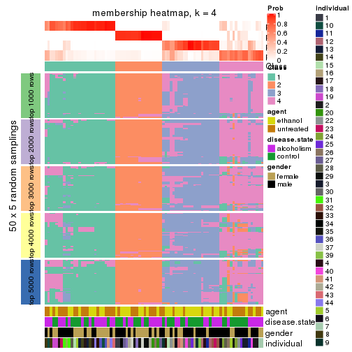</p>

</div>
<div id='tab-ATC-kmeans-membership-heatmap-4'>
<pre><code class="r">membership_heatmap(res, k = 5)
</code></pre>

<p></p>

</div>
<div id='tab-ATC-kmeans-membership-heatmap-5'>
<pre><code class="r">membership_heatmap(res, k = 6)
</code></pre>

<p></p>

</div>
</div>

As soon as we have had the classes for columns, we can look for signatures
which are significantly different between classes which can be candidate marks
for certain classes. Following are the heatmaps for signatures.


Signature heatmaps where rows are scaled:


<script>
$( function() {
	$( '#tabs-ATC-kmeans-get-signatures' ).tabs();
} );
</script>
<div id='tabs-ATC-kmeans-get-signatures'>
<ul>
<li><a href='#tab-ATC-kmeans-get-signatures-1'>k = 2</a></li>
<li><a href='#tab-ATC-kmeans-get-signatures-2'>k = 3</a></li>
<li><a href='#tab-ATC-kmeans-get-signatures-3'>k = 4</a></li>
<li><a href='#tab-ATC-kmeans-get-signatures-4'>k = 5</a></li>
<li><a href='#tab-ATC-kmeans-get-signatures-5'>k = 6</a></li>
</ul>
<div id='tab-ATC-kmeans-get-signatures-1'>
<pre><code class="r">get_signatures(res, k = 2)
</code></pre>

<p></p>

</div>
<div id='tab-ATC-kmeans-get-signatures-2'>
<pre><code class="r">get_signatures(res, k = 3)
</code></pre>

<p></p>

</div>
<div id='tab-ATC-kmeans-get-signatures-3'>
<pre><code class="r">get_signatures(res, k = 4)
</code></pre>

<p></p>

</div>
<div id='tab-ATC-kmeans-get-signatures-4'>
<pre><code class="r">get_signatures(res, k = 5)
</code></pre>

<p></p>

</div>
<div id='tab-ATC-kmeans-get-signatures-5'>
<pre><code class="r">get_signatures(res, k = 6)
</code></pre>

<p></p>

</div>
</div>


Signature heatmaps where rows are not scaled:


<script>
$( function() {
	$( '#tabs-ATC-kmeans-get-signatures-no-scale' ).tabs();
} );
</script>
<div id='tabs-ATC-kmeans-get-signatures-no-scale'>
<ul>
<li><a href='#tab-ATC-kmeans-get-signatures-no-scale-1'>k = 2</a></li>
<li><a href='#tab-ATC-kmeans-get-signatures-no-scale-2'>k = 3</a></li>
<li><a href='#tab-ATC-kmeans-get-signatures-no-scale-3'>k = 4</a></li>
<li><a href='#tab-ATC-kmeans-get-signatures-no-scale-4'>k = 5</a></li>
<li><a href='#tab-ATC-kmeans-get-signatures-no-scale-5'>k = 6</a></li>
</ul>
<div id='tab-ATC-kmeans-get-signatures-no-scale-1'>
<pre><code class="r">get_signatures(res, k = 2, scale_rows = FALSE)
</code></pre>

<p></p>

</div>
<div id='tab-ATC-kmeans-get-signatures-no-scale-2'>
<pre><code class="r">get_signatures(res, k = 3, scale_rows = FALSE)
</code></pre>

<p></p>

</div>
<div id='tab-ATC-kmeans-get-signatures-no-scale-3'>
<pre><code class="r">get_signatures(res, k = 4, scale_rows = FALSE)
</code></pre>

<p></p>

</div>
<div id='tab-ATC-kmeans-get-signatures-no-scale-4'>
<pre><code class="r">get_signatures(res, k = 5, scale_rows = FALSE)
</code></pre>

<p></p>

</div>
<div id='tab-ATC-kmeans-get-signatures-no-scale-5'>
<pre><code class="r">get_signatures(res, k = 6, scale_rows = FALSE)
</code></pre>

<p></p>

</div>
</div>


Compare the overlap of signatures from different k:

```r
compare_signatures(res)
```


`get_signature()` returns a data frame invisibly. TO get the list of signatures, the function
call should be assigned to a variable explicitly. In following code, if `plot` argument is set
to `FALSE`, no heatmap is plotted while only the differential analysis is performed.

```r
# code only for demonstration
tb = get_signature(res, k = ..., plot = FALSE)
```

An example of the output of `tb` is:

```
#>   which_row         fdr    mean_1    mean_2 scaled_mean_1 scaled_mean_2 km
#> 1        38 0.042760348  8.373488  9.131774    -0.5533452     0.5164555  1
#> 2        40 0.018707592  7.106213  8.469186    -0.6173731     0.5762149  1
#> 3        55 0.019134737 10.221463 11.207825    -0.6159697     0.5749050  1
#> 4        59 0.006059896  5.921854  7.869574    -0.6899429     0.6439467  1
#> 5        60 0.018055526  8.928898 10.211722    -0.6204761     0.5791110  1
#> 6        98 0.009384629 15.714769 14.887706     0.6635654    -0.6193277  2
...
```

The columns in `tb` are:

1. `which_row`: row indices corresponding to the input matrix.
2. `fdr`: FDR for the differential test. 
3. `mean_x`: The mean value in group x.
4. `scaled_mean_x`: The mean value in group x after rows are scaled.
5. `km`: Row groups if k-means clustering is applied to rows.


UMAP plot which shows how samples are separated.


<script>
$( function() {
	$( '#tabs-ATC-kmeans-dimension-reduction' ).tabs();
} );
</script>
<div id='tabs-ATC-kmeans-dimension-reduction'>
<ul>
<li><a href='#tab-ATC-kmeans-dimension-reduction-1'>k = 2</a></li>
<li><a href='#tab-ATC-kmeans-dimension-reduction-2'>k = 3</a></li>
<li><a href='#tab-ATC-kmeans-dimension-reduction-3'>k = 4</a></li>
<li><a href='#tab-ATC-kmeans-dimension-reduction-4'>k = 5</a></li>
<li><a href='#tab-ATC-kmeans-dimension-reduction-5'>k = 6</a></li>
</ul>
<div id='tab-ATC-kmeans-dimension-reduction-1'>
<pre><code class="r">dimension_reduction(res, k = 2, method = &quot;UMAP&quot;)
</code></pre>

<p></p>

</div>
<div id='tab-ATC-kmeans-dimension-reduction-2'>
<pre><code class="r">dimension_reduction(res, k = 3, method = &quot;UMAP&quot;)
</code></pre>

<p></p>

</div>
<div id='tab-ATC-kmeans-dimension-reduction-3'>
<pre><code class="r">dimension_reduction(res, k = 4, method = &quot;UMAP&quot;)
</code></pre>

<p></p>

</div>
<div id='tab-ATC-kmeans-dimension-reduction-4'>
<pre><code class="r">dimension_reduction(res, k = 5, method = &quot;UMAP&quot;)
</code></pre>

<p>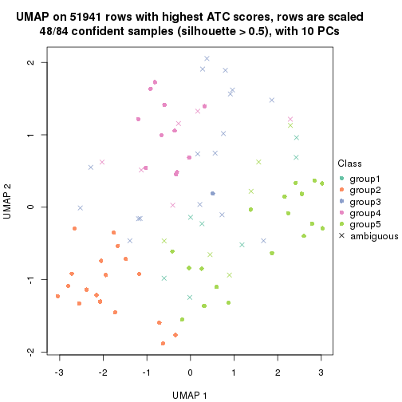</p>

</div>
<div id='tab-ATC-kmeans-dimension-reduction-5'>
<pre><code class="r">dimension_reduction(res, k = 6, method = &quot;UMAP&quot;)
</code></pre>

<p></p>

</div>
</div>


Following heatmap shows how subgroups are split when increasing `k`:

```r
collect_classes(res)
```


Test correlation between subgroups and known annotations. If the known
annotation is numeric, one-way ANOVA test is applied, and if the known
annotation is discrete, chi-squared contingency table test is applied.

```r
test_to_known_factors(res)
```

```
#>             n agent(p) disease.state(p) gender(p) individual(p) k
#> ATC:kmeans 81   0.7532            0.434   1.00000      0.001896 2
#> ATC:kmeans 74   0.0305            0.751   0.29281      0.000445 3
#> ATC:kmeans 76   0.0206            0.874   0.12393      0.000555 4
#> ATC:kmeans 48   0.0991            0.745   0.00789      0.001111 5
#> ATC:kmeans 44   0.2206            0.626   0.11514      0.000573 6
```


If matrix rows can be associated to genes, consider to use `GO_Enrichment(res,
...)` to perform function enrichment for the signature genes.


 

---------------------------------------------------


### ATC:skmeans**


The object with results only for a single top-value method and a single partition method 
can be extracted as:

```r
res = res_list["ATC", "skmeans"]
# you can also extract it by
# res = res_list["ATC:skmeans"]
```

A summary of `res` and all the functions that can be applied to it:

```r
res
```

```
#> A 'ConsensusPartition' object with k = 2, 3, 4, 5, 6.
#>   On a matrix with 51941 rows and 84 columns.
#>   Top rows (1000, 2000, 3000, 4000, 5000) are extracted by 'ATC' method.
#>   Subgroups are detected by 'skmeans' method.
#>   Performed in total 1250 partitions by row resampling.
#>   Best k for subgroups seems to be 3.
#> 
#> Following methods can be applied to this 'ConsensusPartition' object:
#>  [1] "cola_report"             "collect_classes"         "collect_plots"          
#>  [4] "collect_stats"           "colnames"                "compare_signatures"     
#>  [7] "consensus_heatmap"       "dimension_reduction"     "functional_enrichment"  
#> [10] "get_anno_col"            "get_anno"                "get_classes"            
#> [13] "get_consensus"           "get_matrix"              "get_membership"         
#> [16] "get_param"               "get_signatures"          "get_stats"              
#> [19] "is_best_k"               "is_stable_k"             "membership_heatmap"     
#> [22] "ncol"                    "nrow"                    "plot_ecdf"              
#> [25] "rownames"                "select_partition_number" "show"                   
#> [28] "suggest_best_k"          "test_to_known_factors"
```

`collect_plots()` function collects all the plots made from `res` for all `k` (number of partitions)
into one single page to provide an easy and fast comparison between different `k`.

```r
collect_plots(res)
```


The plots are:

- The first row: a plot of the ECDF (Empirical cumulative distribution
  function) curves of the consensus matrix for each `k` and the heatmap of
  predicted classes for each `k`.
- The second row: heatmaps of the consensus matrix for each `k`.
- The third row: heatmaps of the membership matrix for each `k`.
- The fouth row: heatmaps of the signatures for each `k`.

All the plots in panels can be made by individual functions and they are
plotted later in this section.

`select_partition_number()` produces several plots showing different
statistics for choosing "optimized" `k`. There are following statistics:

- ECDF curves of the consensus matrix for each `k`;
- 1-PAC. [The PAC
  score](https://en.wikipedia.org/wiki/Consensus_clustering#Over-interpretation_potential_of_consensus_clustering)
  measures the proportion of the ambiguous subgrouping.
- Mean silhouette score.
- Concordance. The mean probability of fiting the consensus class ids in all
  partitions.
- Area increased. Denote $A_k$ as the area under the ECDF curve for current
  `k`, the area increased is defined as $A_k - A_{k-1}$.
- Rand index. The percent of pairs of samples that are both in a same cluster
  or both are not in a same cluster in the partition of k and k-1.
- Jaccard index. The ratio of pairs of samples are both in a same cluster in
  the partition of k and k-1 and the pairs of samples are both in a same
  cluster in the partition k or k-1.

The detailed explanations of these statistics can be found in [the cola
vignette](http://bioconductor.org/packages/devel/bioc/vignettes/cola/inst/doc/cola.html#toc_13).

Generally speaking, lower PAC score, higher mean silhouette score or higher
concordance corresponds to better partition. Rand index and Jaccard index
measure how similar the current partition is compared to partition with `k-1`.
If they are too similar, we won't accept `k` is better than `k-1`.

```r
select_partition_number(res)
```


The numeric values for all these statistics can be obtained by `get_stats()`.

```r
get_stats(res)
```

```
#>   k 1-PAC mean_silhouette concordance area_increased  Rand Jaccard
#> 2 2 1.000           0.984       0.994         0.5028 0.499   0.499
#> 3 3 1.000           0.983       0.993         0.3234 0.752   0.542
#> 4 4 0.712           0.630       0.813         0.1128 0.922   0.781
#> 5 5 0.716           0.662       0.816         0.0641 0.867   0.589
#> 6 6 0.734           0.587       0.753         0.0410 0.949   0.777
```

`suggest_best_k()` suggests the best $k$ based on these statistics. The rules are as follows:

- All $k$ with Jaccard index larger than 0.95 are removed because the increase of
  the partition number does not provides enough extra information. If all $k$ are removed,
  the best $k$ is assigned by `NA`.
- For $k$ with 1-PAC larger than 0.9, the maximal $k$ is taken as the "best k". Other $k$ is called "optional k".
- If it does not fit the second rule. The $k$ with the highest vote of highest
  1-PAC, mean silhouette and concordance is taken as the "best k".

```r
suggest_best_k(res)
```

```
#> [1] 3
#> attr(,"optional")
#> [1] 2
```

There is also optional best $k$ = 2 that is worth to check.

Following shows the table of the partitions (You need to click the **show/hide
code output** link to see it). The membership matrix (columns with name `p*`)
is inferred by
[`clue::cl_consensus()`](https://www.rdocumentation.org/link/cl_consensus?package=clue)
function with the `SE` method. Basically the value in the membership matrix
represents the probability to belong to a certain group. The finall class
label for an item is determined with the group with highest probability it
belongs to.

In `get_classes()` function, the entropy is calculated from the membership
matrix and the silhouette score is calculated from the consensus matrix.


<script>
$( function() {
	$( '#tabs-ATC-skmeans-get-classes' ).tabs();
} );
</script>
<div id='tabs-ATC-skmeans-get-classes'>
<ul>
<li><a href='#tab-ATC-skmeans-get-classes-1'>k = 2</a></li>
<li><a href='#tab-ATC-skmeans-get-classes-2'>k = 3</a></li>
<li><a href='#tab-ATC-skmeans-get-classes-3'>k = 4</a></li>
<li><a href='#tab-ATC-skmeans-get-classes-4'>k = 5</a></li>
<li><a href='#tab-ATC-skmeans-get-classes-5'>k = 6</a></li>
</ul>

<div id='tab-ATC-skmeans-get-classes-1'>
<p><a id='tab-ATC-skmeans-get-classes-1-a' style='color:#0366d6' href='#'>show/hide code output</a></p>
<pre><code class="r">cbind(get_classes(res, k = 2), get_membership(res, k = 2))
</code></pre>

<pre><code>#&gt;            class entropy silhouette    p1    p2
#&gt; GSM1269647     2  0.0000      1.000 0.000 1.000
#&gt; GSM1269655     1  0.0000      0.990 1.000 0.000
#&gt; GSM1269663     2  0.0000      1.000 0.000 1.000
#&gt; GSM1269671     2  0.0000      1.000 0.000 1.000
#&gt; GSM1269679     2  0.0000      1.000 0.000 1.000
#&gt; GSM1269693     1  0.0000      0.990 1.000 0.000
#&gt; GSM1269701     1  0.0000      0.990 1.000 0.000
#&gt; GSM1269709     1  0.0000      0.990 1.000 0.000
#&gt; GSM1269715     1  0.0000      0.990 1.000 0.000
#&gt; GSM1269717     2  0.0000      1.000 0.000 1.000
#&gt; GSM1269721     1  0.0000      0.990 1.000 0.000
#&gt; GSM1269723     2  0.0000      1.000 0.000 1.000
#&gt; GSM1269645     2  0.0000      1.000 0.000 1.000
#&gt; GSM1269653     1  0.0000      0.990 1.000 0.000
#&gt; GSM1269661     2  0.0000      1.000 0.000 1.000
#&gt; GSM1269669     1  0.0000      0.990 1.000 0.000
#&gt; GSM1269677     2  0.0000      1.000 0.000 1.000
#&gt; GSM1269685     1  0.0000      0.990 1.000 0.000
#&gt; GSM1269691     1  0.0000      0.990 1.000 0.000
#&gt; GSM1269699     1  0.0000      0.990 1.000 0.000
#&gt; GSM1269707     1  0.0000      0.990 1.000 0.000
#&gt; GSM1269651     2  0.0000      1.000 0.000 1.000
#&gt; GSM1269659     1  0.0000      0.990 1.000 0.000
#&gt; GSM1269667     2  0.0000      1.000 0.000 1.000
#&gt; GSM1269675     2  0.0672      0.992 0.008 0.992
#&gt; GSM1269683     2  0.0000      1.000 0.000 1.000
#&gt; GSM1269689     1  0.0000      0.990 1.000 0.000
#&gt; GSM1269697     1  0.0000      0.990 1.000 0.000
#&gt; GSM1269705     1  0.0000      0.990 1.000 0.000
#&gt; GSM1269713     1  0.0000      0.990 1.000 0.000
#&gt; GSM1269719     2  0.0000      1.000 0.000 1.000
#&gt; GSM1269725     1  0.0000      0.990 1.000 0.000
#&gt; GSM1269727     2  0.0000      1.000 0.000 1.000
#&gt; GSM1269649     2  0.0000      1.000 0.000 1.000
#&gt; GSM1269657     1  0.0000      0.990 1.000 0.000
#&gt; GSM1269665     2  0.0000      1.000 0.000 1.000
#&gt; GSM1269673     1  0.9963      0.134 0.536 0.464
#&gt; GSM1269681     2  0.0000      1.000 0.000 1.000
#&gt; GSM1269687     1  0.0000      0.990 1.000 0.000
#&gt; GSM1269695     1  0.0000      0.990 1.000 0.000
#&gt; GSM1269703     1  0.0000      0.990 1.000 0.000
#&gt; GSM1269711     1  0.0000      0.990 1.000 0.000
#&gt; GSM1269646     2  0.0000      1.000 0.000 1.000
#&gt; GSM1269654     1  0.0000      0.990 1.000 0.000
#&gt; GSM1269662     2  0.0000      1.000 0.000 1.000
#&gt; GSM1269670     2  0.0000      1.000 0.000 1.000
#&gt; GSM1269678     1  0.0000      0.990 1.000 0.000
#&gt; GSM1269692     1  0.0000      0.990 1.000 0.000
#&gt; GSM1269700     1  0.0000      0.990 1.000 0.000
#&gt; GSM1269708     1  0.0000      0.990 1.000 0.000
#&gt; GSM1269714     1  0.0000      0.990 1.000 0.000
#&gt; GSM1269716     1  0.0000      0.990 1.000 0.000
#&gt; GSM1269720     2  0.0000      1.000 0.000 1.000
#&gt; GSM1269722     2  0.0000      1.000 0.000 1.000
#&gt; GSM1269644     2  0.0000      1.000 0.000 1.000
#&gt; GSM1269652     1  0.0000      0.990 1.000 0.000
#&gt; GSM1269660     2  0.0000      1.000 0.000 1.000
#&gt; GSM1269668     1  0.0000      0.990 1.000 0.000
#&gt; GSM1269676     2  0.0000      1.000 0.000 1.000
#&gt; GSM1269684     1  0.0000      0.990 1.000 0.000
#&gt; GSM1269690     1  0.0000      0.990 1.000 0.000
#&gt; GSM1269698     1  0.0000      0.990 1.000 0.000
#&gt; GSM1269706     1  0.0000      0.990 1.000 0.000
#&gt; GSM1269650     2  0.0000      1.000 0.000 1.000
#&gt; GSM1269658     2  0.0000      1.000 0.000 1.000
#&gt; GSM1269666     2  0.0000      1.000 0.000 1.000
#&gt; GSM1269674     1  0.0376      0.986 0.996 0.004
#&gt; GSM1269682     2  0.0000      1.000 0.000 1.000
#&gt; GSM1269688     1  0.0000      0.990 1.000 0.000
#&gt; GSM1269696     1  0.0000      0.990 1.000 0.000
#&gt; GSM1269704     1  0.0000      0.990 1.000 0.000
#&gt; GSM1269712     2  0.0000      1.000 0.000 1.000
#&gt; GSM1269718     2  0.0000      1.000 0.000 1.000
#&gt; GSM1269724     2  0.0000      1.000 0.000 1.000
#&gt; GSM1269726     2  0.0000      1.000 0.000 1.000
#&gt; GSM1269648     2  0.0000      1.000 0.000 1.000
#&gt; GSM1269656     1  0.0000      0.990 1.000 0.000
#&gt; GSM1269664     2  0.0000      1.000 0.000 1.000
#&gt; GSM1269672     1  0.0000      0.990 1.000 0.000
#&gt; GSM1269680     2  0.0000      1.000 0.000 1.000
#&gt; GSM1269686     1  0.0000      0.990 1.000 0.000
#&gt; GSM1269694     1  0.0000      0.990 1.000 0.000
#&gt; GSM1269702     1  0.0000      0.990 1.000 0.000
#&gt; GSM1269710     2  0.0000      1.000 0.000 1.000
</code></pre>

<script>
$('#tab-ATC-skmeans-get-classes-1-a').parent().next().next().hide();
$('#tab-ATC-skmeans-get-classes-1-a').click(function(){
  $('#tab-ATC-skmeans-get-classes-1-a').parent().next().next().toggle();
  return(false);
});
</script>
</div>

<div id='tab-ATC-skmeans-get-classes-2'>
<p><a id='tab-ATC-skmeans-get-classes-2-a' style='color:#0366d6' href='#'>show/hide code output</a></p>
<pre><code class="r">cbind(get_classes(res, k = 3), get_membership(res, k = 3))
</code></pre>

<pre><code>#&gt;            class entropy silhouette    p1    p2    p3
#&gt; GSM1269647     2  0.0000      0.984 0.000 1.000 0.000
#&gt; GSM1269655     1  0.0000      0.996 1.000 0.000 0.000
#&gt; GSM1269663     2  0.0000      0.984 0.000 1.000 0.000
#&gt; GSM1269671     2  0.0000      0.984 0.000 1.000 0.000
#&gt; GSM1269679     3  0.0000      1.000 0.000 0.000 1.000
#&gt; GSM1269693     3  0.0000      1.000 0.000 0.000 1.000
#&gt; GSM1269701     1  0.0000      0.996 1.000 0.000 0.000
#&gt; GSM1269709     1  0.0000      0.996 1.000 0.000 0.000
#&gt; GSM1269715     3  0.0000      1.000 0.000 0.000 1.000
#&gt; GSM1269717     3  0.0000      1.000 0.000 0.000 1.000
#&gt; GSM1269721     3  0.0000      1.000 0.000 0.000 1.000
#&gt; GSM1269723     3  0.0000      1.000 0.000 0.000 1.000
#&gt; GSM1269645     2  0.0000      0.984 0.000 1.000 0.000
#&gt; GSM1269653     3  0.0000      1.000 0.000 0.000 1.000
#&gt; GSM1269661     2  0.0000      0.984 0.000 1.000 0.000
#&gt; GSM1269669     1  0.2537      0.915 0.920 0.000 0.080
#&gt; GSM1269677     2  0.0000      0.984 0.000 1.000 0.000
#&gt; GSM1269685     1  0.0000      0.996 1.000 0.000 0.000
#&gt; GSM1269691     1  0.0000      0.996 1.000 0.000 0.000
#&gt; GSM1269699     1  0.0000      0.996 1.000 0.000 0.000
#&gt; GSM1269707     3  0.0000      1.000 0.000 0.000 1.000
#&gt; GSM1269651     2  0.0000      0.984 0.000 1.000 0.000
#&gt; GSM1269659     3  0.0000      1.000 0.000 0.000 1.000
#&gt; GSM1269667     2  0.0000      0.984 0.000 1.000 0.000
#&gt; GSM1269675     3  0.0000      1.000 0.000 0.000 1.000
#&gt; GSM1269683     3  0.0000      1.000 0.000 0.000 1.000
#&gt; GSM1269689     3  0.0000      1.000 0.000 0.000 1.000
#&gt; GSM1269697     1  0.0000      0.996 1.000 0.000 0.000
#&gt; GSM1269705     1  0.0000      0.996 1.000 0.000 0.000
#&gt; GSM1269713     3  0.0000      1.000 0.000 0.000 1.000
#&gt; GSM1269719     2  0.0000      0.984 0.000 1.000 0.000
#&gt; GSM1269725     1  0.0000      0.996 1.000 0.000 0.000
#&gt; GSM1269727     3  0.0000      1.000 0.000 0.000 1.000
#&gt; GSM1269649     2  0.0000      0.984 0.000 1.000 0.000
#&gt; GSM1269657     1  0.0000      0.996 1.000 0.000 0.000
#&gt; GSM1269665     2  0.0000      0.984 0.000 1.000 0.000
#&gt; GSM1269673     2  0.7890      0.244 0.060 0.544 0.396
#&gt; GSM1269681     2  0.0000      0.984 0.000 1.000 0.000
#&gt; GSM1269687     1  0.0000      0.996 1.000 0.000 0.000
#&gt; GSM1269695     1  0.0000      0.996 1.000 0.000 0.000
#&gt; GSM1269703     3  0.0000      1.000 0.000 0.000 1.000
#&gt; GSM1269711     3  0.0000      1.000 0.000 0.000 1.000
#&gt; GSM1269646     2  0.0000      0.984 0.000 1.000 0.000
#&gt; GSM1269654     1  0.0000      0.996 1.000 0.000 0.000
#&gt; GSM1269662     2  0.0000      0.984 0.000 1.000 0.000
#&gt; GSM1269670     2  0.0000      0.984 0.000 1.000 0.000
#&gt; GSM1269678     1  0.0000      0.996 1.000 0.000 0.000
#&gt; GSM1269692     1  0.0000      0.996 1.000 0.000 0.000
#&gt; GSM1269700     1  0.0000      0.996 1.000 0.000 0.000
#&gt; GSM1269708     1  0.0000      0.996 1.000 0.000 0.000
#&gt; GSM1269714     1  0.0000      0.996 1.000 0.000 0.000
#&gt; GSM1269716     1  0.0000      0.996 1.000 0.000 0.000
#&gt; GSM1269720     3  0.0000      1.000 0.000 0.000 1.000
#&gt; GSM1269722     3  0.0000      1.000 0.000 0.000 1.000
#&gt; GSM1269644     2  0.0000      0.984 0.000 1.000 0.000
#&gt; GSM1269652     1  0.0000      0.996 1.000 0.000 0.000
#&gt; GSM1269660     2  0.0000      0.984 0.000 1.000 0.000
#&gt; GSM1269668     1  0.0000      0.996 1.000 0.000 0.000
#&gt; GSM1269676     2  0.0000      0.984 0.000 1.000 0.000
#&gt; GSM1269684     1  0.0000      0.996 1.000 0.000 0.000
#&gt; GSM1269690     1  0.0000      0.996 1.000 0.000 0.000
#&gt; GSM1269698     1  0.0000      0.996 1.000 0.000 0.000
#&gt; GSM1269706     3  0.0237      0.996 0.004 0.000 0.996
#&gt; GSM1269650     2  0.0000      0.984 0.000 1.000 0.000
#&gt; GSM1269658     3  0.0000      1.000 0.000 0.000 1.000
#&gt; GSM1269666     2  0.0000      0.984 0.000 1.000 0.000
#&gt; GSM1269674     1  0.1753      0.950 0.952 0.000 0.048
#&gt; GSM1269682     2  0.0000      0.984 0.000 1.000 0.000
#&gt; GSM1269688     1  0.0000      0.996 1.000 0.000 0.000
#&gt; GSM1269696     1  0.0000      0.996 1.000 0.000 0.000
#&gt; GSM1269704     1  0.0000      0.996 1.000 0.000 0.000
#&gt; GSM1269712     2  0.0000      0.984 0.000 1.000 0.000
#&gt; GSM1269718     2  0.0000      0.984 0.000 1.000 0.000
#&gt; GSM1269724     2  0.0000      0.984 0.000 1.000 0.000
#&gt; GSM1269726     3  0.0000      1.000 0.000 0.000 1.000
#&gt; GSM1269648     2  0.0000      0.984 0.000 1.000 0.000
#&gt; GSM1269656     1  0.0000      0.996 1.000 0.000 0.000
#&gt; GSM1269664     2  0.0000      0.984 0.000 1.000 0.000
#&gt; GSM1269672     1  0.0000      0.996 1.000 0.000 0.000
#&gt; GSM1269680     2  0.0000      0.984 0.000 1.000 0.000
#&gt; GSM1269686     1  0.0000      0.996 1.000 0.000 0.000
#&gt; GSM1269694     1  0.0000      0.996 1.000 0.000 0.000
#&gt; GSM1269702     1  0.0000      0.996 1.000 0.000 0.000
#&gt; GSM1269710     3  0.0000      1.000 0.000 0.000 1.000
</code></pre>

<script>
$('#tab-ATC-skmeans-get-classes-2-a').parent().next().next().hide();
$('#tab-ATC-skmeans-get-classes-2-a').click(function(){
  $('#tab-ATC-skmeans-get-classes-2-a').parent().next().next().toggle();
  return(false);
});
</script>
</div>

<div id='tab-ATC-skmeans-get-classes-3'>
<p><a id='tab-ATC-skmeans-get-classes-3-a' style='color:#0366d6' href='#'>show/hide code output</a></p>
<pre><code class="r">cbind(get_classes(res, k = 4), get_membership(res, k = 4))
</code></pre>

<pre><code>#&gt;            class entropy silhouette    p1    p2    p3    p4
#&gt; GSM1269647     2  0.0000    0.90355 0.000 1.000 0.000 0.000
#&gt; GSM1269655     1  0.3400    0.72658 0.820 0.000 0.000 0.180
#&gt; GSM1269663     2  0.0336    0.89795 0.000 0.992 0.000 0.008
#&gt; GSM1269671     2  0.0188    0.90071 0.000 0.996 0.004 0.000
#&gt; GSM1269679     3  0.4050    0.49236 0.000 0.024 0.808 0.168
#&gt; GSM1269693     3  0.4193    0.48216 0.000 0.000 0.732 0.268
#&gt; GSM1269701     1  0.6273    0.56632 0.644 0.000 0.248 0.108
#&gt; GSM1269709     1  0.2816    0.78865 0.900 0.000 0.036 0.064
#&gt; GSM1269715     3  0.3975    0.50671 0.000 0.000 0.760 0.240
#&gt; GSM1269717     4  0.4304    0.43043 0.000 0.000 0.284 0.716
#&gt; GSM1269721     3  0.4164    0.48650 0.000 0.000 0.736 0.264
#&gt; GSM1269723     3  0.3024    0.57157 0.000 0.000 0.852 0.148
#&gt; GSM1269645     2  0.0000    0.90355 0.000 1.000 0.000 0.000
#&gt; GSM1269653     3  0.1488    0.58721 0.012 0.000 0.956 0.032
#&gt; GSM1269661     2  0.0000    0.90355 0.000 1.000 0.000 0.000
#&gt; GSM1269669     3  0.7469   -0.07659 0.392 0.000 0.432 0.176
#&gt; GSM1269677     2  0.4454    0.51835 0.000 0.692 0.000 0.308
#&gt; GSM1269685     1  0.2921    0.78325 0.860 0.000 0.000 0.140
#&gt; GSM1269691     1  0.1557    0.80362 0.944 0.000 0.000 0.056
#&gt; GSM1269699     1  0.0592    0.81414 0.984 0.000 0.000 0.016
#&gt; GSM1269707     3  0.3975    0.50671 0.000 0.000 0.760 0.240
#&gt; GSM1269651     2  0.0000    0.90355 0.000 1.000 0.000 0.000
#&gt; GSM1269659     3  0.4746    0.35261 0.000 0.000 0.632 0.368
#&gt; GSM1269667     2  0.0000    0.90355 0.000 1.000 0.000 0.000
#&gt; GSM1269675     3  0.2868    0.53746 0.000 0.000 0.864 0.136
#&gt; GSM1269683     3  0.2530    0.58898 0.000 0.000 0.888 0.112
#&gt; GSM1269689     3  0.1022    0.58911 0.000 0.000 0.968 0.032
#&gt; GSM1269697     1  0.1677    0.80767 0.948 0.000 0.012 0.040
#&gt; GSM1269705     1  0.0592    0.81414 0.984 0.000 0.000 0.016
#&gt; GSM1269713     3  0.4972   -0.08587 0.000 0.000 0.544 0.456
#&gt; GSM1269719     2  0.4713    0.48878 0.000 0.640 0.000 0.360
#&gt; GSM1269725     1  0.5300    0.25707 0.580 0.000 0.012 0.408
#&gt; GSM1269727     3  0.2408    0.58982 0.000 0.000 0.896 0.104
#&gt; GSM1269649     2  0.0000    0.90355 0.000 1.000 0.000 0.000
#&gt; GSM1269657     1  0.3569    0.71685 0.804 0.000 0.000 0.196
#&gt; GSM1269665     2  0.0000    0.90355 0.000 1.000 0.000 0.000
#&gt; GSM1269673     3  0.9173    0.09172 0.112 0.284 0.428 0.176
#&gt; GSM1269681     2  0.0000    0.90355 0.000 1.000 0.000 0.000
#&gt; GSM1269687     1  0.6903    0.51563 0.592 0.000 0.224 0.184
#&gt; GSM1269695     1  0.1792    0.80376 0.932 0.000 0.000 0.068
#&gt; GSM1269703     3  0.0921    0.59075 0.000 0.000 0.972 0.028
#&gt; GSM1269711     3  0.1389    0.58342 0.000 0.000 0.952 0.048
#&gt; GSM1269646     2  0.0000    0.90355 0.000 1.000 0.000 0.000
#&gt; GSM1269654     1  0.3649    0.71023 0.796 0.000 0.000 0.204
#&gt; GSM1269662     2  0.0000    0.90355 0.000 1.000 0.000 0.000
#&gt; GSM1269670     2  0.0000    0.90355 0.000 1.000 0.000 0.000
#&gt; GSM1269678     1  0.2760    0.77445 0.872 0.000 0.000 0.128
#&gt; GSM1269692     1  0.4564    0.56372 0.672 0.000 0.000 0.328
#&gt; GSM1269700     1  0.6346    0.56345 0.640 0.000 0.244 0.116
#&gt; GSM1269708     1  0.0469    0.81403 0.988 0.000 0.000 0.012
#&gt; GSM1269714     1  0.4585    0.55786 0.668 0.000 0.000 0.332
#&gt; GSM1269716     4  0.3975    0.40137 0.240 0.000 0.000 0.760
#&gt; GSM1269720     3  0.4193    0.48326 0.000 0.000 0.732 0.268
#&gt; GSM1269722     4  0.4830    0.25464 0.000 0.000 0.392 0.608
#&gt; GSM1269644     2  0.0000    0.90355 0.000 1.000 0.000 0.000
#&gt; GSM1269652     1  0.0469    0.81403 0.988 0.000 0.000 0.012
#&gt; GSM1269660     2  0.0000    0.90355 0.000 1.000 0.000 0.000
#&gt; GSM1269668     1  0.2704    0.77756 0.876 0.000 0.000 0.124
#&gt; GSM1269676     4  0.5524    0.33229 0.048 0.276 0.000 0.676
#&gt; GSM1269684     1  0.5147    0.44559 0.536 0.000 0.004 0.460
#&gt; GSM1269690     1  0.0188    0.81457 0.996 0.000 0.000 0.004
#&gt; GSM1269698     1  0.0817    0.81287 0.976 0.000 0.000 0.024
#&gt; GSM1269706     4  0.6052    0.16451 0.048 0.000 0.396 0.556
#&gt; GSM1269650     2  0.0000    0.90355 0.000 1.000 0.000 0.000
#&gt; GSM1269658     3  0.4972    0.21268 0.000 0.000 0.544 0.456
#&gt; GSM1269666     2  0.0000    0.90355 0.000 1.000 0.000 0.000
#&gt; GSM1269674     3  0.7862   -0.03960 0.332 0.000 0.388 0.280
#&gt; GSM1269682     2  0.0336    0.89754 0.000 0.992 0.000 0.008
#&gt; GSM1269688     1  0.5995    0.58895 0.672 0.000 0.232 0.096
#&gt; GSM1269696     1  0.5183    0.26220 0.584 0.000 0.008 0.408
#&gt; GSM1269704     1  0.0817    0.81287 0.976 0.000 0.000 0.024
#&gt; GSM1269712     2  0.4790    0.43327 0.000 0.620 0.000 0.380
#&gt; GSM1269718     2  0.4941    0.33830 0.000 0.564 0.000 0.436
#&gt; GSM1269724     2  0.7476   -0.00149 0.152 0.432 0.004 0.412
#&gt; GSM1269726     3  0.3172    0.56146 0.000 0.000 0.840 0.160
#&gt; GSM1269648     2  0.0000    0.90355 0.000 1.000 0.000 0.000
#&gt; GSM1269656     1  0.3444    0.72564 0.816 0.000 0.000 0.184
#&gt; GSM1269664     2  0.0000    0.90355 0.000 1.000 0.000 0.000
#&gt; GSM1269672     1  0.1118    0.81299 0.964 0.000 0.000 0.036
#&gt; GSM1269680     2  0.2647    0.80125 0.000 0.880 0.000 0.120
#&gt; GSM1269686     1  0.0469    0.81396 0.988 0.000 0.000 0.012
#&gt; GSM1269694     1  0.0592    0.81414 0.984 0.000 0.000 0.016
#&gt; GSM1269702     1  0.0336    0.81402 0.992 0.000 0.000 0.008
#&gt; GSM1269710     3  0.4331    0.38088 0.000 0.000 0.712 0.288
</code></pre>

<script>
$('#tab-ATC-skmeans-get-classes-3-a').parent().next().next().hide();
$('#tab-ATC-skmeans-get-classes-3-a').click(function(){
  $('#tab-ATC-skmeans-get-classes-3-a').parent().next().next().toggle();
  return(false);
});
</script>
</div>

<div id='tab-ATC-skmeans-get-classes-4'>
<p><a id='tab-ATC-skmeans-get-classes-4-a' style='color:#0366d6' href='#'>show/hide code output</a></p>
<pre><code class="r">cbind(get_classes(res, k = 5), get_membership(res, k = 5))
</code></pre>

<pre><code>#&gt;            class entropy silhouette    p1    p2    p3    p4    p5
#&gt; GSM1269647     2  0.0290      0.921 0.008 0.992 0.000 0.000 0.000
#&gt; GSM1269655     5  0.3037      0.786 0.032 0.000 0.100 0.004 0.864
#&gt; GSM1269663     2  0.0609      0.917 0.020 0.980 0.000 0.000 0.000
#&gt; GSM1269671     2  0.1364      0.898 0.012 0.952 0.036 0.000 0.000
#&gt; GSM1269679     1  0.2967      0.603 0.868 0.016 0.012 0.104 0.000
#&gt; GSM1269693     4  0.0880      0.744 0.032 0.000 0.000 0.968 0.000
#&gt; GSM1269701     1  0.5052      0.433 0.612 0.000 0.048 0.000 0.340
#&gt; GSM1269709     5  0.3074      0.676 0.196 0.000 0.000 0.000 0.804
#&gt; GSM1269715     4  0.1701      0.744 0.048 0.000 0.016 0.936 0.000
#&gt; GSM1269717     4  0.4584      0.299 0.028 0.000 0.312 0.660 0.000
#&gt; GSM1269721     4  0.0880      0.744 0.032 0.000 0.000 0.968 0.000
#&gt; GSM1269723     4  0.5210      0.518 0.084 0.000 0.264 0.652 0.000
#&gt; GSM1269645     2  0.0000      0.922 0.000 1.000 0.000 0.000 0.000
#&gt; GSM1269653     1  0.6117      0.249 0.516 0.000 0.064 0.392 0.028
#&gt; GSM1269661     2  0.0000      0.922 0.000 1.000 0.000 0.000 0.000
#&gt; GSM1269669     1  0.2482      0.643 0.892 0.000 0.000 0.024 0.084
#&gt; GSM1269677     2  0.7174      0.175 0.040 0.492 0.208 0.260 0.000
#&gt; GSM1269685     5  0.2142      0.805 0.028 0.000 0.048 0.004 0.920
#&gt; GSM1269691     5  0.0963      0.812 0.036 0.000 0.000 0.000 0.964
#&gt; GSM1269699     5  0.2520      0.802 0.048 0.000 0.056 0.000 0.896
#&gt; GSM1269707     4  0.1408      0.746 0.044 0.000 0.008 0.948 0.000
#&gt; GSM1269651     2  0.0000      0.922 0.000 1.000 0.000 0.000 0.000
#&gt; GSM1269659     4  0.2592      0.702 0.052 0.000 0.056 0.892 0.000
#&gt; GSM1269667     2  0.0510      0.919 0.016 0.984 0.000 0.000 0.000
#&gt; GSM1269675     1  0.3957      0.480 0.712 0.000 0.008 0.280 0.000
#&gt; GSM1269683     4  0.4159      0.630 0.156 0.000 0.068 0.776 0.000
#&gt; GSM1269689     1  0.4736      0.287 0.576 0.000 0.020 0.404 0.000
#&gt; GSM1269697     5  0.4780      0.565 0.048 0.000 0.280 0.000 0.672
#&gt; GSM1269705     5  0.2520      0.802 0.048 0.000 0.056 0.000 0.896
#&gt; GSM1269713     3  0.4681      0.407 0.052 0.000 0.696 0.252 0.000
#&gt; GSM1269719     2  0.5040      0.106 0.024 0.516 0.456 0.004 0.000
#&gt; GSM1269725     3  0.4210      0.517 0.036 0.000 0.740 0.000 0.224
#&gt; GSM1269727     4  0.4676      0.553 0.208 0.000 0.072 0.720 0.000
#&gt; GSM1269649     2  0.0510      0.919 0.016 0.984 0.000 0.000 0.000
#&gt; GSM1269657     5  0.3870      0.758 0.032 0.000 0.088 0.048 0.832
#&gt; GSM1269665     2  0.0000      0.922 0.000 1.000 0.000 0.000 0.000
#&gt; GSM1269673     1  0.3151      0.620 0.876 0.056 0.000 0.032 0.036
#&gt; GSM1269681     2  0.1444      0.890 0.012 0.948 0.040 0.000 0.000
#&gt; GSM1269687     1  0.2612      0.613 0.868 0.000 0.008 0.000 0.124
#&gt; GSM1269695     5  0.2790      0.796 0.068 0.000 0.052 0.000 0.880
#&gt; GSM1269703     4  0.6454      0.147 0.340 0.000 0.168 0.488 0.004
#&gt; GSM1269711     1  0.4686      0.329 0.596 0.000 0.020 0.384 0.000
#&gt; GSM1269646     2  0.0000      0.922 0.000 1.000 0.000 0.000 0.000
#&gt; GSM1269654     5  0.3895      0.754 0.032 0.000 0.164 0.008 0.796
#&gt; GSM1269662     2  0.0000      0.922 0.000 1.000 0.000 0.000 0.000
#&gt; GSM1269670     2  0.0404      0.918 0.000 0.988 0.012 0.000 0.000
#&gt; GSM1269678     5  0.5680      0.509 0.228 0.000 0.148 0.000 0.624
#&gt; GSM1269692     5  0.6288      0.483 0.032 0.000 0.100 0.284 0.584
#&gt; GSM1269700     1  0.5644      0.436 0.584 0.000 0.100 0.000 0.316
#&gt; GSM1269708     5  0.0162      0.817 0.004 0.000 0.000 0.000 0.996
#&gt; GSM1269714     5  0.5952      0.532 0.036 0.000 0.076 0.260 0.628
#&gt; GSM1269716     3  0.6100      0.357 0.032 0.000 0.612 0.264 0.092
#&gt; GSM1269720     4  0.0324      0.741 0.004 0.000 0.004 0.992 0.000
#&gt; GSM1269722     3  0.4167      0.440 0.024 0.000 0.724 0.252 0.000
#&gt; GSM1269644     2  0.0404      0.920 0.012 0.988 0.000 0.000 0.000
#&gt; GSM1269652     5  0.0162      0.817 0.004 0.000 0.000 0.000 0.996
#&gt; GSM1269660     2  0.0000      0.922 0.000 1.000 0.000 0.000 0.000
#&gt; GSM1269668     5  0.3424      0.654 0.240 0.000 0.000 0.000 0.760
#&gt; GSM1269676     3  0.8192      0.257 0.048 0.140 0.460 0.284 0.068
#&gt; GSM1269684     5  0.7487      0.402 0.156 0.000 0.100 0.236 0.508
#&gt; GSM1269690     5  0.0290      0.817 0.008 0.000 0.000 0.000 0.992
#&gt; GSM1269698     5  0.2291      0.804 0.036 0.000 0.056 0.000 0.908
#&gt; GSM1269706     4  0.3544      0.672 0.048 0.000 0.048 0.856 0.048
#&gt; GSM1269650     2  0.0000      0.922 0.000 1.000 0.000 0.000 0.000
#&gt; GSM1269658     4  0.4072      0.607 0.108 0.000 0.100 0.792 0.000
#&gt; GSM1269666     2  0.0404      0.920 0.012 0.988 0.000 0.000 0.000
#&gt; GSM1269674     1  0.3410      0.622 0.840 0.000 0.000 0.068 0.092
#&gt; GSM1269682     2  0.3449      0.790 0.004 0.844 0.088 0.064 0.000
#&gt; GSM1269688     1  0.4415      0.306 0.552 0.000 0.000 0.004 0.444
#&gt; GSM1269696     3  0.3847      0.554 0.036 0.000 0.784 0.000 0.180
#&gt; GSM1269704     5  0.2291      0.804 0.036 0.000 0.056 0.000 0.908
#&gt; GSM1269712     3  0.4297      0.548 0.008 0.200 0.756 0.036 0.000
#&gt; GSM1269718     3  0.4637      0.442 0.028 0.292 0.676 0.004 0.000
#&gt; GSM1269724     3  0.2878      0.599 0.012 0.024 0.880 0.000 0.084
#&gt; GSM1269726     4  0.5181      0.514 0.080 0.000 0.268 0.652 0.000
#&gt; GSM1269648     2  0.0609      0.917 0.020 0.980 0.000 0.000 0.000
#&gt; GSM1269656     5  0.2871      0.784 0.032 0.000 0.088 0.004 0.876
#&gt; GSM1269664     2  0.0000      0.922 0.000 1.000 0.000 0.000 0.000
#&gt; GSM1269672     5  0.2377      0.754 0.128 0.000 0.000 0.000 0.872
#&gt; GSM1269680     2  0.4149      0.700 0.040 0.768 0.188 0.004 0.000
#&gt; GSM1269686     5  0.0898      0.818 0.020 0.000 0.008 0.000 0.972
#&gt; GSM1269694     5  0.2450      0.804 0.048 0.000 0.052 0.000 0.900
#&gt; GSM1269702     5  0.0451      0.818 0.004 0.000 0.008 0.000 0.988
#&gt; GSM1269710     3  0.6082      0.134 0.108 0.008 0.540 0.344 0.000
</code></pre>

<script>
$('#tab-ATC-skmeans-get-classes-4-a').parent().next().next().hide();
$('#tab-ATC-skmeans-get-classes-4-a').click(function(){
  $('#tab-ATC-skmeans-get-classes-4-a').parent().next().next().toggle();
  return(false);
});
</script>
</div>

<div id='tab-ATC-skmeans-get-classes-5'>
<p><a id='tab-ATC-skmeans-get-classes-5-a' style='color:#0366d6' href='#'>show/hide code output</a></p>
<pre><code class="r">cbind(get_classes(res, k = 6), get_membership(res, k = 6))
</code></pre>

<pre><code>#&gt;            class entropy silhouette    p1    p2    p3    p4    p5    p6
#&gt; GSM1269647     2  0.0914     0.9226 0.000 0.968 0.000 0.016 0.016 0.000
#&gt; GSM1269655     1  0.3907     0.6589 0.764 0.000 0.000 0.084 0.000 0.152
#&gt; GSM1269663     2  0.1464     0.9161 0.000 0.944 0.000 0.016 0.036 0.004
#&gt; GSM1269671     2  0.2240     0.8910 0.000 0.916 0.024 0.012 0.020 0.028
#&gt; GSM1269679     5  0.1728     0.6261 0.000 0.004 0.064 0.008 0.924 0.000
#&gt; GSM1269693     4  0.4041     0.8051 0.000 0.000 0.408 0.584 0.004 0.004
#&gt; GSM1269701     5  0.6306     0.4289 0.280 0.000 0.004 0.116 0.540 0.060
#&gt; GSM1269709     1  0.3673     0.6239 0.764 0.000 0.000 0.024 0.204 0.008
#&gt; GSM1269715     3  0.4177    -0.6958 0.000 0.000 0.520 0.468 0.012 0.000
#&gt; GSM1269717     3  0.5526    -0.0568 0.000 0.000 0.524 0.324 0.000 0.152
#&gt; GSM1269721     4  0.3923     0.8023 0.000 0.000 0.416 0.580 0.004 0.000
#&gt; GSM1269723     3  0.1148     0.4379 0.000 0.016 0.960 0.000 0.020 0.004
#&gt; GSM1269645     2  0.0508     0.9252 0.000 0.984 0.004 0.000 0.000 0.012
#&gt; GSM1269653     5  0.6947     0.2740 0.016 0.000 0.304 0.220 0.424 0.036
#&gt; GSM1269661     2  0.0260     0.9259 0.000 0.992 0.000 0.000 0.000 0.008
#&gt; GSM1269669     5  0.0767     0.6419 0.012 0.000 0.004 0.008 0.976 0.000
#&gt; GSM1269677     6  0.5543     0.4568 0.000 0.156 0.020 0.208 0.000 0.616
#&gt; GSM1269685     1  0.1713     0.7535 0.928 0.000 0.000 0.028 0.044 0.000
#&gt; GSM1269691     1  0.1726     0.7565 0.932 0.000 0.000 0.012 0.044 0.012
#&gt; GSM1269699     1  0.3125     0.7314 0.852 0.000 0.000 0.076 0.016 0.056
#&gt; GSM1269707     4  0.4179     0.7294 0.000 0.000 0.472 0.516 0.012 0.000
#&gt; GSM1269651     2  0.1390     0.9162 0.000 0.948 0.000 0.016 0.004 0.032
#&gt; GSM1269659     4  0.4241     0.7777 0.004 0.000 0.332 0.644 0.016 0.004
#&gt; GSM1269667     2  0.1003     0.9219 0.000 0.964 0.000 0.016 0.020 0.000
#&gt; GSM1269675     5  0.4387     0.5487 0.000 0.000 0.128 0.152 0.720 0.000
#&gt; GSM1269683     3  0.3829     0.0611 0.000 0.000 0.760 0.180 0.060 0.000
#&gt; GSM1269689     5  0.5682     0.3381 0.000 0.000 0.316 0.180 0.504 0.000
#&gt; GSM1269697     1  0.6321     0.3844 0.548 0.000 0.020 0.236 0.020 0.176
#&gt; GSM1269705     1  0.3211     0.7304 0.848 0.000 0.000 0.076 0.020 0.056
#&gt; GSM1269713     3  0.5167     0.3665 0.000 0.000 0.636 0.196 0.004 0.164
#&gt; GSM1269719     6  0.2963     0.5132 0.000 0.152 0.016 0.000 0.004 0.828
#&gt; GSM1269725     6  0.7506     0.2328 0.176 0.000 0.168 0.260 0.004 0.392
#&gt; GSM1269727     3  0.4039     0.0880 0.000 0.000 0.752 0.156 0.092 0.000
#&gt; GSM1269649     2  0.1088     0.9209 0.000 0.960 0.000 0.016 0.024 0.000
#&gt; GSM1269657     1  0.4322     0.6452 0.736 0.000 0.000 0.152 0.004 0.108
#&gt; GSM1269665     2  0.0508     0.9252 0.000 0.984 0.004 0.000 0.000 0.012
#&gt; GSM1269673     5  0.0912     0.6394 0.008 0.004 0.004 0.012 0.972 0.000
#&gt; GSM1269681     2  0.3690     0.5453 0.000 0.684 0.008 0.000 0.000 0.308
#&gt; GSM1269687     5  0.1708     0.6276 0.040 0.000 0.000 0.004 0.932 0.024
#&gt; GSM1269695     1  0.3628     0.7244 0.824 0.000 0.000 0.084 0.040 0.052
#&gt; GSM1269703     3  0.6517     0.2625 0.008 0.000 0.556 0.160 0.208 0.068
#&gt; GSM1269711     5  0.5529     0.4058 0.000 0.000 0.276 0.176 0.548 0.000
#&gt; GSM1269646     2  0.0260     0.9259 0.000 0.992 0.000 0.000 0.000 0.008
#&gt; GSM1269654     1  0.4831     0.5147 0.636 0.000 0.000 0.096 0.000 0.268
#&gt; GSM1269662     2  0.0508     0.9252 0.000 0.984 0.004 0.000 0.000 0.012
#&gt; GSM1269670     2  0.0820     0.9193 0.000 0.972 0.012 0.000 0.000 0.016
#&gt; GSM1269678     1  0.6020     0.4397 0.588 0.000 0.016 0.036 0.260 0.100
#&gt; GSM1269692     1  0.5451     0.2509 0.448 0.000 0.000 0.432 0.000 0.120
#&gt; GSM1269700     5  0.6931     0.4062 0.260 0.000 0.008 0.168 0.484 0.080
#&gt; GSM1269708     1  0.0862     0.7602 0.972 0.000 0.000 0.004 0.016 0.008
#&gt; GSM1269714     1  0.4680     0.4234 0.564 0.000 0.000 0.396 0.008 0.032
#&gt; GSM1269716     6  0.5947     0.3162 0.072 0.000 0.052 0.420 0.000 0.456
#&gt; GSM1269720     4  0.3868     0.7268 0.000 0.000 0.492 0.508 0.000 0.000
#&gt; GSM1269722     3  0.4825     0.3901 0.000 0.000 0.668 0.180 0.000 0.152
#&gt; GSM1269644     2  0.1458     0.9202 0.000 0.948 0.000 0.016 0.016 0.020
#&gt; GSM1269652     1  0.0748     0.7595 0.976 0.000 0.000 0.004 0.016 0.004
#&gt; GSM1269660     2  0.0405     0.9249 0.000 0.988 0.004 0.000 0.000 0.008
#&gt; GSM1269668     1  0.3309     0.5900 0.720 0.000 0.000 0.000 0.280 0.000
#&gt; GSM1269676     6  0.3869     0.4655 0.016 0.004 0.008 0.236 0.000 0.736
#&gt; GSM1269684     1  0.7050     0.1507 0.384 0.000 0.000 0.356 0.112 0.148
#&gt; GSM1269690     1  0.0603     0.7595 0.980 0.000 0.000 0.004 0.016 0.000
#&gt; GSM1269698     1  0.2817     0.7383 0.868 0.000 0.000 0.072 0.008 0.052
#&gt; GSM1269706     4  0.5315     0.6929 0.044 0.000 0.324 0.588 0.000 0.044
#&gt; GSM1269650     2  0.1536     0.9117 0.000 0.940 0.000 0.016 0.004 0.040
#&gt; GSM1269658     4  0.5920     0.5883 0.000 0.000 0.220 0.604 0.068 0.108
#&gt; GSM1269666     2  0.1173     0.9218 0.000 0.960 0.000 0.016 0.016 0.008
#&gt; GSM1269674     5  0.1995     0.6261 0.036 0.000 0.000 0.052 0.912 0.000
#&gt; GSM1269682     2  0.5786     0.2219 0.000 0.524 0.272 0.000 0.004 0.200
#&gt; GSM1269688     5  0.5457     0.2643 0.408 0.000 0.008 0.072 0.504 0.008
#&gt; GSM1269696     6  0.7131     0.2478 0.100 0.000 0.192 0.256 0.004 0.448
#&gt; GSM1269704     1  0.2817     0.7383 0.868 0.000 0.000 0.072 0.008 0.052
#&gt; GSM1269712     3  0.6605     0.1589 0.000 0.088 0.528 0.176 0.000 0.208
#&gt; GSM1269718     6  0.1984     0.5194 0.000 0.056 0.032 0.000 0.000 0.912
#&gt; GSM1269724     6  0.6372     0.1808 0.016 0.000 0.280 0.236 0.004 0.464
#&gt; GSM1269726     3  0.0508     0.4311 0.000 0.000 0.984 0.000 0.012 0.004
#&gt; GSM1269648     2  0.1346     0.9200 0.000 0.952 0.000 0.016 0.024 0.008
#&gt; GSM1269656     1  0.3751     0.6802 0.792 0.000 0.000 0.096 0.004 0.108
#&gt; GSM1269664     2  0.0508     0.9252 0.000 0.984 0.004 0.000 0.000 0.012
#&gt; GSM1269672     1  0.2595     0.6936 0.836 0.000 0.000 0.000 0.160 0.004
#&gt; GSM1269680     6  0.4928     0.4409 0.000 0.260 0.000 0.096 0.004 0.640
#&gt; GSM1269686     1  0.0665     0.7625 0.980 0.000 0.000 0.008 0.004 0.008
#&gt; GSM1269694     1  0.2971     0.7350 0.860 0.000 0.000 0.076 0.012 0.052
#&gt; GSM1269702     1  0.0291     0.7620 0.992 0.000 0.000 0.000 0.004 0.004
#&gt; GSM1269710     3  0.4637     0.4896 0.000 0.024 0.752 0.136 0.016 0.072
</code></pre>

<script>
$('#tab-ATC-skmeans-get-classes-5-a').parent().next().next().hide();
$('#tab-ATC-skmeans-get-classes-5-a').click(function(){
  $('#tab-ATC-skmeans-get-classes-5-a').parent().next().next().toggle();
  return(false);
});
</script>
</div>
</div>

Heatmaps for the consensus matrix. It visualizes the probability of two
samples to be in a same group.


<script>
$( function() {
	$( '#tabs-ATC-skmeans-consensus-heatmap' ).tabs();
} );
</script>
<div id='tabs-ATC-skmeans-consensus-heatmap'>
<ul>
<li><a href='#tab-ATC-skmeans-consensus-heatmap-1'>k = 2</a></li>
<li><a href='#tab-ATC-skmeans-consensus-heatmap-2'>k = 3</a></li>
<li><a href='#tab-ATC-skmeans-consensus-heatmap-3'>k = 4</a></li>
<li><a href='#tab-ATC-skmeans-consensus-heatmap-4'>k = 5</a></li>
<li><a href='#tab-ATC-skmeans-consensus-heatmap-5'>k = 6</a></li>
</ul>
<div id='tab-ATC-skmeans-consensus-heatmap-1'>
<pre><code class="r">consensus_heatmap(res, k = 2)
</code></pre>

<p></p>

</div>
<div id='tab-ATC-skmeans-consensus-heatmap-2'>
<pre><code class="r">consensus_heatmap(res, k = 3)
</code></pre>

<p>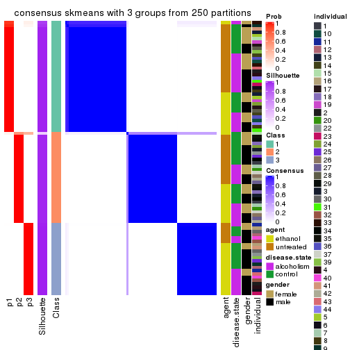</p>

</div>
<div id='tab-ATC-skmeans-consensus-heatmap-3'>
<pre><code class="r">consensus_heatmap(res, k = 4)
</code></pre>

<p></p>

</div>
<div id='tab-ATC-skmeans-consensus-heatmap-4'>
<pre><code class="r">consensus_heatmap(res, k = 5)
</code></pre>

<p></p>

</div>
<div id='tab-ATC-skmeans-consensus-heatmap-5'>
<pre><code class="r">consensus_heatmap(res, k = 6)
</code></pre>

<p></p>

</div>
</div>

Heatmaps for the membership of samples in all partitions to see how consistent they are:


<script>
$( function() {
	$( '#tabs-ATC-skmeans-membership-heatmap' ).tabs();
} );
</script>
<div id='tabs-ATC-skmeans-membership-heatmap'>
<ul>
<li><a href='#tab-ATC-skmeans-membership-heatmap-1'>k = 2</a></li>
<li><a href='#tab-ATC-skmeans-membership-heatmap-2'>k = 3</a></li>
<li><a href='#tab-ATC-skmeans-membership-heatmap-3'>k = 4</a></li>
<li><a href='#tab-ATC-skmeans-membership-heatmap-4'>k = 5</a></li>
<li><a href='#tab-ATC-skmeans-membership-heatmap-5'>k = 6</a></li>
</ul>
<div id='tab-ATC-skmeans-membership-heatmap-1'>
<pre><code class="r">membership_heatmap(res, k = 2)
</code></pre>

<p></p>

</div>
<div id='tab-ATC-skmeans-membership-heatmap-2'>
<pre><code class="r">membership_heatmap(res, k = 3)
</code></pre>

<p></p>

</div>
<div id='tab-ATC-skmeans-membership-heatmap-3'>
<pre><code class="r">membership_heatmap(res, k = 4)
</code></pre>

<p></p>

</div>
<div id='tab-ATC-skmeans-membership-heatmap-4'>
<pre><code class="r">membership_heatmap(res, k = 5)
</code></pre>

<p></p>

</div>
<div id='tab-ATC-skmeans-membership-heatmap-5'>
<pre><code class="r">membership_heatmap(res, k = 6)
</code></pre>

<p>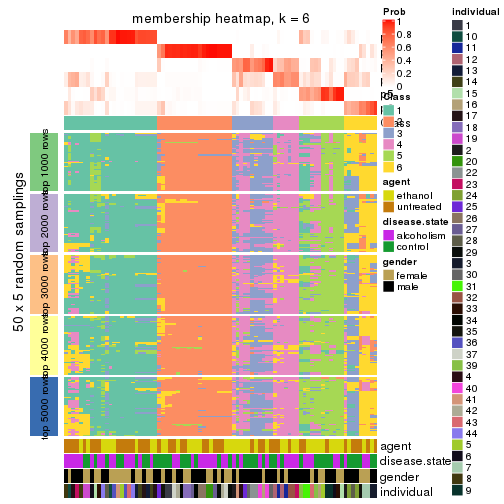</p>

</div>
</div>

As soon as we have had the classes for columns, we can look for signatures
which are significantly different between classes which can be candidate marks
for certain classes. Following are the heatmaps for signatures.


Signature heatmaps where rows are scaled:


<script>
$( function() {
	$( '#tabs-ATC-skmeans-get-signatures' ).tabs();
} );
</script>
<div id='tabs-ATC-skmeans-get-signatures'>
<ul>
<li><a href='#tab-ATC-skmeans-get-signatures-1'>k = 2</a></li>
<li><a href='#tab-ATC-skmeans-get-signatures-2'>k = 3</a></li>
<li><a href='#tab-ATC-skmeans-get-signatures-3'>k = 4</a></li>
<li><a href='#tab-ATC-skmeans-get-signatures-4'>k = 5</a></li>
<li><a href='#tab-ATC-skmeans-get-signatures-5'>k = 6</a></li>
</ul>
<div id='tab-ATC-skmeans-get-signatures-1'>
<pre><code class="r">get_signatures(res, k = 2)
</code></pre>

<p></p>

</div>
<div id='tab-ATC-skmeans-get-signatures-2'>
<pre><code class="r">get_signatures(res, k = 3)
</code></pre>

<p></p>

</div>
<div id='tab-ATC-skmeans-get-signatures-3'>
<pre><code class="r">get_signatures(res, k = 4)
</code></pre>

<p></p>

</div>
<div id='tab-ATC-skmeans-get-signatures-4'>
<pre><code class="r">get_signatures(res, k = 5)
</code></pre>

<p></p>

</div>
<div id='tab-ATC-skmeans-get-signatures-5'>
<pre><code class="r">get_signatures(res, k = 6)
</code></pre>

<p></p>

</div>
</div>


Signature heatmaps where rows are not scaled:


<script>
$( function() {
	$( '#tabs-ATC-skmeans-get-signatures-no-scale' ).tabs();
} );
</script>
<div id='tabs-ATC-skmeans-get-signatures-no-scale'>
<ul>
<li><a href='#tab-ATC-skmeans-get-signatures-no-scale-1'>k = 2</a></li>
<li><a href='#tab-ATC-skmeans-get-signatures-no-scale-2'>k = 3</a></li>
<li><a href='#tab-ATC-skmeans-get-signatures-no-scale-3'>k = 4</a></li>
<li><a href='#tab-ATC-skmeans-get-signatures-no-scale-4'>k = 5</a></li>
<li><a href='#tab-ATC-skmeans-get-signatures-no-scale-5'>k = 6</a></li>
</ul>
<div id='tab-ATC-skmeans-get-signatures-no-scale-1'>
<pre><code class="r">get_signatures(res, k = 2, scale_rows = FALSE)
</code></pre>

<p></p>

</div>
<div id='tab-ATC-skmeans-get-signatures-no-scale-2'>
<pre><code class="r">get_signatures(res, k = 3, scale_rows = FALSE)
</code></pre>

<p></p>

</div>
<div id='tab-ATC-skmeans-get-signatures-no-scale-3'>
<pre><code class="r">get_signatures(res, k = 4, scale_rows = FALSE)
</code></pre>

<p></p>

</div>
<div id='tab-ATC-skmeans-get-signatures-no-scale-4'>
<pre><code class="r">get_signatures(res, k = 5, scale_rows = FALSE)
</code></pre>

<p></p>

</div>
<div id='tab-ATC-skmeans-get-signatures-no-scale-5'>
<pre><code class="r">get_signatures(res, k = 6, scale_rows = FALSE)
</code></pre>

<p></p>

</div>
</div>


Compare the overlap of signatures from different k:

```r
compare_signatures(res)
```


`get_signature()` returns a data frame invisibly. TO get the list of signatures, the function
call should be assigned to a variable explicitly. In following code, if `plot` argument is set
to `FALSE`, no heatmap is plotted while only the differential analysis is performed.

```r
# code only for demonstration
tb = get_signature(res, k = ..., plot = FALSE)
```

An example of the output of `tb` is:

```
#>   which_row         fdr    mean_1    mean_2 scaled_mean_1 scaled_mean_2 km
#> 1        38 0.042760348  8.373488  9.131774    -0.5533452     0.5164555  1
#> 2        40 0.018707592  7.106213  8.469186    -0.6173731     0.5762149  1
#> 3        55 0.019134737 10.221463 11.207825    -0.6159697     0.5749050  1
#> 4        59 0.006059896  5.921854  7.869574    -0.6899429     0.6439467  1
#> 5        60 0.018055526  8.928898 10.211722    -0.6204761     0.5791110  1
#> 6        98 0.009384629 15.714769 14.887706     0.6635654    -0.6193277  2
...
```

The columns in `tb` are:

1. `which_row`: row indices corresponding to the input matrix.
2. `fdr`: FDR for the differential test. 
3. `mean_x`: The mean value in group x.
4. `scaled_mean_x`: The mean value in group x after rows are scaled.
5. `km`: Row groups if k-means clustering is applied to rows.


UMAP plot which shows how samples are separated.


<script>
$( function() {
	$( '#tabs-ATC-skmeans-dimension-reduction' ).tabs();
} );
</script>
<div id='tabs-ATC-skmeans-dimension-reduction'>
<ul>
<li><a href='#tab-ATC-skmeans-dimension-reduction-1'>k = 2</a></li>
<li><a href='#tab-ATC-skmeans-dimension-reduction-2'>k = 3</a></li>
<li><a href='#tab-ATC-skmeans-dimension-reduction-3'>k = 4</a></li>
<li><a href='#tab-ATC-skmeans-dimension-reduction-4'>k = 5</a></li>
<li><a href='#tab-ATC-skmeans-dimension-reduction-5'>k = 6</a></li>
</ul>
<div id='tab-ATC-skmeans-dimension-reduction-1'>
<pre><code class="r">dimension_reduction(res, k = 2, method = &quot;UMAP&quot;)
</code></pre>

<p></p>

</div>
<div id='tab-ATC-skmeans-dimension-reduction-2'>
<pre><code class="r">dimension_reduction(res, k = 3, method = &quot;UMAP&quot;)
</code></pre>

<p></p>

</div>
<div id='tab-ATC-skmeans-dimension-reduction-3'>
<pre><code class="r">dimension_reduction(res, k = 4, method = &quot;UMAP&quot;)
</code></pre>

<p></p>

</div>
<div id='tab-ATC-skmeans-dimension-reduction-4'>
<pre><code class="r">dimension_reduction(res, k = 5, method = &quot;UMAP&quot;)
</code></pre>

<p></p>

</div>
<div id='tab-ATC-skmeans-dimension-reduction-5'>
<pre><code class="r">dimension_reduction(res, k = 6, method = &quot;UMAP&quot;)
</code></pre>

<p></p>

</div>
</div>


Following heatmap shows how subgroups are split when increasing `k`:

```r
collect_classes(res)
```


Test correlation between subgroups and known annotations. If the known
annotation is numeric, one-way ANOVA test is applied, and if the known
annotation is discrete, chi-squared contingency table test is applied.

```r
test_to_known_factors(res)
```

```
#>              n agent(p) disease.state(p) gender(p) individual(p) k
#> ATC:skmeans 83   0.9049            0.446    0.2601      6.52e-03 2
#> ATC:skmeans 83   0.0342            0.673    0.2329      4.28e-04 3
#> ATC:skmeans 61   0.0141            0.503    0.6235      7.01e-03 4
#> ATC:skmeans 65   0.2622            0.292    0.0399      1.09e-04 5
#> ATC:skmeans 54   0.4639            0.388    0.1665      2.92e-06 6
```


If matrix rows can be associated to genes, consider to use `GO_Enrichment(res,
...)` to perform function enrichment for the signature genes.


 

---------------------------------------------------


### ATC:pam


The object with results only for a single top-value method and a single partition method 
can be extracted as:

```r
res = res_list["ATC", "pam"]
# you can also extract it by
# res = res_list["ATC:pam"]
```

A summary of `res` and all the functions that can be applied to it:

```r
res
```

```
#> A 'ConsensusPartition' object with k = 2, 3, 4, 5, 6.
#>   On a matrix with 51941 rows and 84 columns.
#>   Top rows (1000, 2000, 3000, 4000, 5000) are extracted by 'ATC' method.
#>   Subgroups are detected by 'pam' method.
#>   Performed in total 1250 partitions by row resampling.
#>   Best k for subgroups seems to be 3.
#> 
#> Following methods can be applied to this 'ConsensusPartition' object:
#>  [1] "cola_report"             "collect_classes"         "collect_plots"          
#>  [4] "collect_stats"           "colnames"                "compare_signatures"     
#>  [7] "consensus_heatmap"       "dimension_reduction"     "functional_enrichment"  
#> [10] "get_anno_col"            "get_anno"                "get_classes"            
#> [13] "get_consensus"           "get_matrix"              "get_membership"         
#> [16] "get_param"               "get_signatures"          "get_stats"              
#> [19] "is_best_k"               "is_stable_k"             "membership_heatmap"     
#> [22] "ncol"                    "nrow"                    "plot_ecdf"              
#> [25] "rownames"                "select_partition_number" "show"                   
#> [28] "suggest_best_k"          "test_to_known_factors"
```

`collect_plots()` function collects all the plots made from `res` for all `k` (number of partitions)
into one single page to provide an easy and fast comparison between different `k`.

```r
collect_plots(res)
```

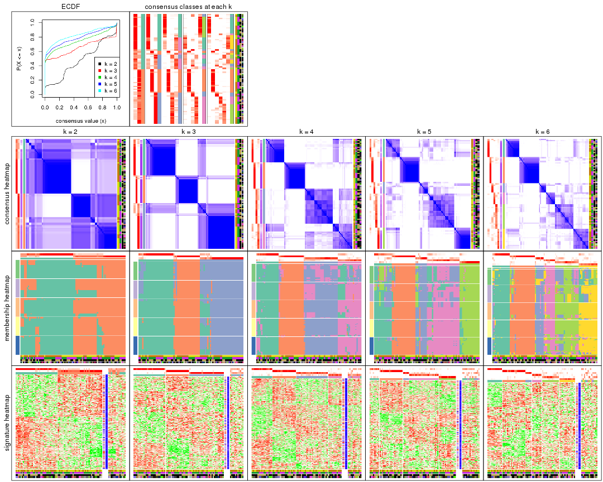

The plots are:

- The first row: a plot of the ECDF (Empirical cumulative distribution
  function) curves of the consensus matrix for each `k` and the heatmap of
  predicted classes for each `k`.
- The second row: heatmaps of the consensus matrix for each `k`.
- The third row: heatmaps of the membership matrix for each `k`.
- The fouth row: heatmaps of the signatures for each `k`.

All the plots in panels can be made by individual functions and they are
plotted later in this section.

`select_partition_number()` produces several plots showing different
statistics for choosing "optimized" `k`. There are following statistics:

- ECDF curves of the consensus matrix for each `k`;
- 1-PAC. [The PAC
  score](https://en.wikipedia.org/wiki/Consensus_clustering#Over-interpretation_potential_of_consensus_clustering)
  measures the proportion of the ambiguous subgrouping.
- Mean silhouette score.
- Concordance. The mean probability of fiting the consensus class ids in all
  partitions.
- Area increased. Denote $A_k$ as the area under the ECDF curve for current
  `k`, the area increased is defined as $A_k - A_{k-1}$.
- Rand index. The percent of pairs of samples that are both in a same cluster
  or both are not in a same cluster in the partition of k and k-1.
- Jaccard index. The ratio of pairs of samples are both in a same cluster in
  the partition of k and k-1 and the pairs of samples are both in a same
  cluster in the partition k or k-1.

The detailed explanations of these statistics can be found in [the cola
vignette](http://bioconductor.org/packages/devel/bioc/vignettes/cola/inst/doc/cola.html#toc_13).

Generally speaking, lower PAC score, higher mean silhouette score or higher
concordance corresponds to better partition. Rand index and Jaccard index
measure how similar the current partition is compared to partition with `k-1`.
If they are too similar, we won't accept `k` is better than `k-1`.

```r
select_partition_number(res)
```


The numeric values for all these statistics can be obtained by `get_stats()`.

```r
get_stats(res)
```

```
#>   k 1-PAC mean_silhouette concordance area_increased  Rand Jaccard
#> 2 2 0.362           0.684       0.859         0.4775 0.494   0.494
#> 3 3 0.780           0.800       0.921         0.3696 0.663   0.424
#> 4 4 0.686           0.729       0.850         0.1462 0.853   0.599
#> 5 5 0.723           0.674       0.816         0.0581 0.921   0.707
#> 6 6 0.754           0.693       0.812         0.0466 0.921   0.663
```

`suggest_best_k()` suggests the best $k$ based on these statistics. The rules are as follows:

- All $k$ with Jaccard index larger than 0.95 are removed because the increase of
  the partition number does not provides enough extra information. If all $k$ are removed,
  the best $k$ is assigned by `NA`.
- For $k$ with 1-PAC larger than 0.9, the maximal $k$ is taken as the "best k". Other $k$ is called "optional k".
- If it does not fit the second rule. The $k$ with the highest vote of highest
  1-PAC, mean silhouette and concordance is taken as the "best k".

```r
suggest_best_k(res)
```

```
#> [1] 3
```


Following shows the table of the partitions (You need to click the **show/hide
code output** link to see it). The membership matrix (columns with name `p*`)
is inferred by
[`clue::cl_consensus()`](https://www.rdocumentation.org/link/cl_consensus?package=clue)
function with the `SE` method. Basically the value in the membership matrix
represents the probability to belong to a certain group. The finall class
label for an item is determined with the group with highest probability it
belongs to.

In `get_classes()` function, the entropy is calculated from the membership
matrix and the silhouette score is calculated from the consensus matrix.


<script>
$( function() {
	$( '#tabs-ATC-pam-get-classes' ).tabs();
} );
</script>
<div id='tabs-ATC-pam-get-classes'>
<ul>
<li><a href='#tab-ATC-pam-get-classes-1'>k = 2</a></li>
<li><a href='#tab-ATC-pam-get-classes-2'>k = 3</a></li>
<li><a href='#tab-ATC-pam-get-classes-3'>k = 4</a></li>
<li><a href='#tab-ATC-pam-get-classes-4'>k = 5</a></li>
<li><a href='#tab-ATC-pam-get-classes-5'>k = 6</a></li>
</ul>

<div id='tab-ATC-pam-get-classes-1'>
<p><a id='tab-ATC-pam-get-classes-1-a' style='color:#0366d6' href='#'>show/hide code output</a></p>
<pre><code class="r">cbind(get_classes(res, k = 2), get_membership(res, k = 2))
</code></pre>

<pre><code>#&gt;            class entropy silhouette    p1    p2
#&gt; GSM1269647     2  0.8555    0.46063 0.280 0.720
#&gt; GSM1269655     1  0.0000    0.84164 1.000 0.000
#&gt; GSM1269663     2  0.0000    0.77281 0.000 1.000
#&gt; GSM1269671     2  0.0000    0.77281 0.000 1.000
#&gt; GSM1269679     2  0.7674    0.73346 0.224 0.776
#&gt; GSM1269693     2  0.8267    0.71529 0.260 0.740
#&gt; GSM1269701     1  0.8443    0.47433 0.728 0.272
#&gt; GSM1269709     1  0.0000    0.84164 1.000 0.000
#&gt; GSM1269715     2  0.8267    0.71529 0.260 0.740
#&gt; GSM1269717     2  0.8267    0.71529 0.260 0.740
#&gt; GSM1269721     2  0.8267    0.71529 0.260 0.740
#&gt; GSM1269723     2  0.0000    0.77281 0.000 1.000
#&gt; GSM1269645     2  0.0000    0.77281 0.000 1.000
#&gt; GSM1269653     2  0.9944    0.35534 0.456 0.544
#&gt; GSM1269661     2  0.0000    0.77281 0.000 1.000
#&gt; GSM1269669     1  0.9954   -0.05782 0.540 0.460
#&gt; GSM1269677     2  0.8016    0.72454 0.244 0.756
#&gt; GSM1269685     1  0.0000    0.84164 1.000 0.000
#&gt; GSM1269691     1  0.0000    0.84164 1.000 0.000
#&gt; GSM1269699     1  0.0000    0.84164 1.000 0.000
#&gt; GSM1269707     2  0.9954    0.34545 0.460 0.540
#&gt; GSM1269651     2  0.0000    0.77281 0.000 1.000
#&gt; GSM1269659     2  0.8713    0.67678 0.292 0.708
#&gt; GSM1269667     2  0.3274    0.74210 0.060 0.940
#&gt; GSM1269675     2  0.8267    0.71529 0.260 0.740
#&gt; GSM1269683     2  0.6973    0.74560 0.188 0.812
#&gt; GSM1269689     2  0.8267    0.71529 0.260 0.740
#&gt; GSM1269697     1  0.0000    0.84164 1.000 0.000
#&gt; GSM1269705     1  0.0000    0.84164 1.000 0.000
#&gt; GSM1269713     2  0.8267    0.71529 0.260 0.740
#&gt; GSM1269719     2  0.8499    0.63817 0.276 0.724
#&gt; GSM1269725     1  0.0000    0.84164 1.000 0.000
#&gt; GSM1269727     2  0.8267    0.71529 0.260 0.740
#&gt; GSM1269649     2  0.0000    0.77281 0.000 1.000
#&gt; GSM1269657     1  0.0376    0.84001 0.996 0.004
#&gt; GSM1269665     2  0.0000    0.77281 0.000 1.000
#&gt; GSM1269673     1  0.9909    0.00728 0.556 0.444
#&gt; GSM1269681     2  0.0000    0.77281 0.000 1.000
#&gt; GSM1269687     1  0.5946    0.73112 0.856 0.144
#&gt; GSM1269695     1  0.0000    0.84164 1.000 0.000
#&gt; GSM1269703     2  0.8555    0.69655 0.280 0.720
#&gt; GSM1269711     2  0.8499    0.70010 0.276 0.724
#&gt; GSM1269646     2  0.8555    0.46063 0.280 0.720
#&gt; GSM1269654     1  0.0376    0.83987 0.996 0.004
#&gt; GSM1269662     2  0.0000    0.77281 0.000 1.000
#&gt; GSM1269670     2  0.0000    0.77281 0.000 1.000
#&gt; GSM1269678     1  0.7528    0.64728 0.784 0.216
#&gt; GSM1269692     1  0.1414    0.83148 0.980 0.020
#&gt; GSM1269700     1  0.5629    0.71597 0.868 0.132
#&gt; GSM1269708     1  0.0000    0.84164 1.000 0.000
#&gt; GSM1269714     1  0.1184    0.83328 0.984 0.016
#&gt; GSM1269716     1  0.5737    0.74224 0.864 0.136
#&gt; GSM1269720     2  0.8267    0.71529 0.260 0.740
#&gt; GSM1269722     2  0.8267    0.71529 0.260 0.740
#&gt; GSM1269644     2  0.9686    0.17069 0.396 0.604
#&gt; GSM1269652     1  0.0000    0.84164 1.000 0.000
#&gt; GSM1269660     2  0.0000    0.77281 0.000 1.000
#&gt; GSM1269668     1  0.0000    0.84164 1.000 0.000
#&gt; GSM1269676     1  0.8081    0.59628 0.752 0.248
#&gt; GSM1269684     1  0.9881    0.09671 0.564 0.436
#&gt; GSM1269690     1  0.0000    0.84164 1.000 0.000
#&gt; GSM1269698     1  0.0000    0.84164 1.000 0.000
#&gt; GSM1269706     1  0.8763    0.43182 0.704 0.296
#&gt; GSM1269650     2  0.8909    0.40416 0.308 0.692
#&gt; GSM1269658     2  0.8267    0.71529 0.260 0.740
#&gt; GSM1269666     1  0.9983    0.21796 0.524 0.476
#&gt; GSM1269674     1  0.9954   -0.04507 0.540 0.460
#&gt; GSM1269682     2  0.0000    0.77281 0.000 1.000
#&gt; GSM1269688     1  0.0000    0.84164 1.000 0.000
#&gt; GSM1269696     1  0.0000    0.84164 1.000 0.000
#&gt; GSM1269704     1  0.0000    0.84164 1.000 0.000
#&gt; GSM1269712     2  0.0000    0.77281 0.000 1.000
#&gt; GSM1269718     1  0.7528    0.64728 0.784 0.216
#&gt; GSM1269724     1  0.7674    0.63967 0.776 0.224
#&gt; GSM1269726     2  0.0376    0.77298 0.004 0.996
#&gt; GSM1269648     1  0.9963    0.24197 0.536 0.464
#&gt; GSM1269656     1  0.0000    0.84164 1.000 0.000
#&gt; GSM1269664     2  0.0000    0.77281 0.000 1.000
#&gt; GSM1269672     1  0.0000    0.84164 1.000 0.000
#&gt; GSM1269680     1  0.7528    0.64728 0.784 0.216
#&gt; GSM1269686     1  0.0000    0.84164 1.000 0.000
#&gt; GSM1269694     1  0.0000    0.84164 1.000 0.000
#&gt; GSM1269702     1  0.0000    0.84164 1.000 0.000
#&gt; GSM1269710     2  0.2778    0.77129 0.048 0.952
</code></pre>

<script>
$('#tab-ATC-pam-get-classes-1-a').parent().next().next().hide();
$('#tab-ATC-pam-get-classes-1-a').click(function(){
  $('#tab-ATC-pam-get-classes-1-a').parent().next().next().toggle();
  return(false);
});
</script>
</div>

<div id='tab-ATC-pam-get-classes-2'>
<p><a id='tab-ATC-pam-get-classes-2-a' style='color:#0366d6' href='#'>show/hide code output</a></p>
<pre><code class="r">cbind(get_classes(res, k = 3), get_membership(res, k = 3))
</code></pre>

<pre><code>#&gt;            class entropy silhouette    p1    p2    p3
#&gt; GSM1269647     2  0.0000     0.9404 0.000 1.000 0.000
#&gt; GSM1269655     1  0.0000     0.9307 1.000 0.000 0.000
#&gt; GSM1269663     2  0.0000     0.9404 0.000 1.000 0.000
#&gt; GSM1269671     2  0.4555     0.7039 0.000 0.800 0.200
#&gt; GSM1269679     3  0.0000     0.8699 0.000 0.000 1.000
#&gt; GSM1269693     3  0.0000     0.8699 0.000 0.000 1.000
#&gt; GSM1269701     1  0.0424     0.9246 0.992 0.000 0.008
#&gt; GSM1269709     1  0.0000     0.9307 1.000 0.000 0.000
#&gt; GSM1269715     3  0.0000     0.8699 0.000 0.000 1.000
#&gt; GSM1269717     3  0.0000     0.8699 0.000 0.000 1.000
#&gt; GSM1269721     3  0.0000     0.8699 0.000 0.000 1.000
#&gt; GSM1269723     3  0.0000     0.8699 0.000 0.000 1.000
#&gt; GSM1269645     2  0.0000     0.9404 0.000 1.000 0.000
#&gt; GSM1269653     3  0.0000     0.8699 0.000 0.000 1.000
#&gt; GSM1269661     2  0.0000     0.9404 0.000 1.000 0.000
#&gt; GSM1269669     3  0.0237     0.8671 0.004 0.000 0.996
#&gt; GSM1269677     3  0.0000     0.8699 0.000 0.000 1.000
#&gt; GSM1269685     1  0.0000     0.9307 1.000 0.000 0.000
#&gt; GSM1269691     1  0.0000     0.9307 1.000 0.000 0.000
#&gt; GSM1269699     1  0.0000     0.9307 1.000 0.000 0.000
#&gt; GSM1269707     3  0.0000     0.8699 0.000 0.000 1.000
#&gt; GSM1269651     2  0.0000     0.9404 0.000 1.000 0.000
#&gt; GSM1269659     3  0.0000     0.8699 0.000 0.000 1.000
#&gt; GSM1269667     2  0.0000     0.9404 0.000 1.000 0.000
#&gt; GSM1269675     3  0.0000     0.8699 0.000 0.000 1.000
#&gt; GSM1269683     3  0.0000     0.8699 0.000 0.000 1.000
#&gt; GSM1269689     3  0.0000     0.8699 0.000 0.000 1.000
#&gt; GSM1269697     1  0.0000     0.9307 1.000 0.000 0.000
#&gt; GSM1269705     1  0.0000     0.9307 1.000 0.000 0.000
#&gt; GSM1269713     3  0.0000     0.8699 0.000 0.000 1.000
#&gt; GSM1269719     2  0.6062     0.3266 0.000 0.616 0.384
#&gt; GSM1269725     1  0.2356     0.8669 0.928 0.000 0.072
#&gt; GSM1269727     3  0.0000     0.8699 0.000 0.000 1.000
#&gt; GSM1269649     2  0.0000     0.9404 0.000 1.000 0.000
#&gt; GSM1269657     1  0.5968     0.3628 0.636 0.000 0.364
#&gt; GSM1269665     2  0.0000     0.9404 0.000 1.000 0.000
#&gt; GSM1269673     3  0.4473     0.6839 0.008 0.164 0.828
#&gt; GSM1269681     2  0.0000     0.9404 0.000 1.000 0.000
#&gt; GSM1269687     3  0.6280     0.1998 0.460 0.000 0.540
#&gt; GSM1269695     1  0.0000     0.9307 1.000 0.000 0.000
#&gt; GSM1269703     3  0.0000     0.8699 0.000 0.000 1.000
#&gt; GSM1269711     3  0.0000     0.8699 0.000 0.000 1.000
#&gt; GSM1269646     2  0.0000     0.9404 0.000 1.000 0.000
#&gt; GSM1269654     1  0.5529     0.5200 0.704 0.000 0.296
#&gt; GSM1269662     2  0.0000     0.9404 0.000 1.000 0.000
#&gt; GSM1269670     2  0.0000     0.9404 0.000 1.000 0.000
#&gt; GSM1269678     3  0.6168     0.3348 0.412 0.000 0.588
#&gt; GSM1269692     1  0.4796     0.6692 0.780 0.000 0.220
#&gt; GSM1269700     1  0.0000     0.9307 1.000 0.000 0.000
#&gt; GSM1269708     1  0.0000     0.9307 1.000 0.000 0.000
#&gt; GSM1269714     3  0.6280     0.2049 0.460 0.000 0.540
#&gt; GSM1269716     3  0.6244     0.2589 0.440 0.000 0.560
#&gt; GSM1269720     3  0.0000     0.8699 0.000 0.000 1.000
#&gt; GSM1269722     3  0.0000     0.8699 0.000 0.000 1.000
#&gt; GSM1269644     2  0.0000     0.9404 0.000 1.000 0.000
#&gt; GSM1269652     1  0.0000     0.9307 1.000 0.000 0.000
#&gt; GSM1269660     2  0.0000     0.9404 0.000 1.000 0.000
#&gt; GSM1269668     1  0.0000     0.9307 1.000 0.000 0.000
#&gt; GSM1269676     3  0.5216     0.6096 0.260 0.000 0.740
#&gt; GSM1269684     3  0.6168     0.3460 0.412 0.000 0.588
#&gt; GSM1269690     1  0.0000     0.9307 1.000 0.000 0.000
#&gt; GSM1269698     1  0.0000     0.9307 1.000 0.000 0.000
#&gt; GSM1269706     3  0.6192     0.3125 0.420 0.000 0.580
#&gt; GSM1269650     2  0.0000     0.9404 0.000 1.000 0.000
#&gt; GSM1269658     3  0.0000     0.8699 0.000 0.000 1.000
#&gt; GSM1269666     2  0.0000     0.9404 0.000 1.000 0.000
#&gt; GSM1269674     3  0.0000     0.8699 0.000 0.000 1.000
#&gt; GSM1269682     3  0.0000     0.8699 0.000 0.000 1.000
#&gt; GSM1269688     1  0.0000     0.9307 1.000 0.000 0.000
#&gt; GSM1269696     1  0.2959     0.8378 0.900 0.000 0.100
#&gt; GSM1269704     1  0.0000     0.9307 1.000 0.000 0.000
#&gt; GSM1269712     3  0.5098     0.5978 0.000 0.248 0.752
#&gt; GSM1269718     3  0.9959     0.0654 0.340 0.292 0.368
#&gt; GSM1269724     1  0.9490     0.0399 0.444 0.188 0.368
#&gt; GSM1269726     3  0.0000     0.8699 0.000 0.000 1.000
#&gt; GSM1269648     2  0.0000     0.9404 0.000 1.000 0.000
#&gt; GSM1269656     1  0.0747     0.9190 0.984 0.000 0.016
#&gt; GSM1269664     2  0.0000     0.9404 0.000 1.000 0.000
#&gt; GSM1269672     1  0.0000     0.9307 1.000 0.000 0.000
#&gt; GSM1269680     2  0.9574     0.1496 0.312 0.468 0.220
#&gt; GSM1269686     1  0.0000     0.9307 1.000 0.000 0.000
#&gt; GSM1269694     1  0.0000     0.9307 1.000 0.000 0.000
#&gt; GSM1269702     1  0.0000     0.9307 1.000 0.000 0.000
#&gt; GSM1269710     3  0.0000     0.8699 0.000 0.000 1.000
</code></pre>

<script>
$('#tab-ATC-pam-get-classes-2-a').parent().next().next().hide();
$('#tab-ATC-pam-get-classes-2-a').click(function(){
  $('#tab-ATC-pam-get-classes-2-a').parent().next().next().toggle();
  return(false);
});
</script>
</div>

<div id='tab-ATC-pam-get-classes-3'>
<p><a id='tab-ATC-pam-get-classes-3-a' style='color:#0366d6' href='#'>show/hide code output</a></p>
<pre><code class="r">cbind(get_classes(res, k = 4), get_membership(res, k = 4))
</code></pre>

<pre><code>#&gt;            class entropy silhouette    p1    p2    p3    p4
#&gt; GSM1269647     2  0.0000      0.950 0.000 1.000 0.000 0.000
#&gt; GSM1269655     1  0.5000     -0.180 0.504 0.000 0.000 0.496
#&gt; GSM1269663     2  0.0000      0.950 0.000 1.000 0.000 0.000
#&gt; GSM1269671     2  0.4590      0.760 0.000 0.792 0.060 0.148
#&gt; GSM1269679     3  0.3486      0.782 0.000 0.000 0.812 0.188
#&gt; GSM1269693     3  0.0707      0.802 0.000 0.000 0.980 0.020
#&gt; GSM1269701     1  0.0000      0.880 1.000 0.000 0.000 0.000
#&gt; GSM1269709     1  0.2101      0.826 0.928 0.000 0.060 0.012
#&gt; GSM1269715     3  0.4134      0.664 0.000 0.000 0.740 0.260
#&gt; GSM1269717     3  0.4661      0.659 0.000 0.000 0.652 0.348
#&gt; GSM1269721     3  0.0707      0.800 0.000 0.000 0.980 0.020
#&gt; GSM1269723     3  0.2469      0.813 0.000 0.000 0.892 0.108
#&gt; GSM1269645     2  0.0000      0.950 0.000 1.000 0.000 0.000
#&gt; GSM1269653     3  0.4164      0.660 0.000 0.000 0.736 0.264
#&gt; GSM1269661     2  0.0000      0.950 0.000 1.000 0.000 0.000
#&gt; GSM1269669     3  0.4163      0.766 0.020 0.000 0.792 0.188
#&gt; GSM1269677     3  0.4624      0.668 0.000 0.000 0.660 0.340
#&gt; GSM1269685     1  0.3400      0.693 0.820 0.000 0.000 0.180
#&gt; GSM1269691     1  0.0000      0.880 1.000 0.000 0.000 0.000
#&gt; GSM1269699     1  0.0000      0.880 1.000 0.000 0.000 0.000
#&gt; GSM1269707     3  0.4193      0.658 0.000 0.000 0.732 0.268
#&gt; GSM1269651     2  0.0000      0.950 0.000 1.000 0.000 0.000
#&gt; GSM1269659     3  0.2647      0.764 0.000 0.000 0.880 0.120
#&gt; GSM1269667     2  0.0000      0.950 0.000 1.000 0.000 0.000
#&gt; GSM1269675     3  0.2345      0.768 0.000 0.000 0.900 0.100
#&gt; GSM1269683     3  0.2281      0.813 0.000 0.000 0.904 0.096
#&gt; GSM1269689     3  0.0188      0.800 0.000 0.000 0.996 0.004
#&gt; GSM1269697     1  0.0000      0.880 1.000 0.000 0.000 0.000
#&gt; GSM1269705     1  0.0000      0.880 1.000 0.000 0.000 0.000
#&gt; GSM1269713     3  0.4522      0.661 0.000 0.000 0.680 0.320
#&gt; GSM1269719     2  0.6919      0.230 0.000 0.528 0.120 0.352
#&gt; GSM1269725     1  0.2699      0.810 0.904 0.000 0.028 0.068
#&gt; GSM1269727     3  0.0000      0.802 0.000 0.000 1.000 0.000
#&gt; GSM1269649     2  0.0000      0.950 0.000 1.000 0.000 0.000
#&gt; GSM1269657     4  0.1452      0.681 0.036 0.000 0.008 0.956
#&gt; GSM1269665     2  0.0000      0.950 0.000 1.000 0.000 0.000
#&gt; GSM1269673     3  0.4267      0.762 0.024 0.000 0.788 0.188
#&gt; GSM1269681     2  0.0921      0.930 0.000 0.972 0.000 0.028
#&gt; GSM1269687     4  0.4776      0.490 0.060 0.000 0.164 0.776
#&gt; GSM1269695     1  0.0000      0.880 1.000 0.000 0.000 0.000
#&gt; GSM1269703     3  0.4642      0.739 0.020 0.000 0.740 0.240
#&gt; GSM1269711     3  0.2469      0.761 0.000 0.000 0.892 0.108
#&gt; GSM1269646     2  0.0000      0.950 0.000 1.000 0.000 0.000
#&gt; GSM1269654     4  0.4215      0.688 0.104 0.000 0.072 0.824
#&gt; GSM1269662     2  0.0000      0.950 0.000 1.000 0.000 0.000
#&gt; GSM1269670     2  0.0000      0.950 0.000 1.000 0.000 0.000
#&gt; GSM1269678     4  0.2271      0.651 0.008 0.000 0.076 0.916
#&gt; GSM1269692     4  0.4776      0.567 0.272 0.000 0.016 0.712
#&gt; GSM1269700     1  0.0188      0.878 0.996 0.000 0.000 0.004
#&gt; GSM1269708     4  0.4977      0.207 0.460 0.000 0.000 0.540
#&gt; GSM1269714     4  0.3681      0.664 0.008 0.000 0.176 0.816
#&gt; GSM1269716     4  0.2760      0.662 0.000 0.000 0.128 0.872
#&gt; GSM1269720     3  0.1716      0.812 0.000 0.000 0.936 0.064
#&gt; GSM1269722     3  0.4661      0.659 0.000 0.000 0.652 0.348
#&gt; GSM1269644     2  0.2281      0.886 0.000 0.904 0.000 0.096
#&gt; GSM1269652     4  0.4981      0.203 0.464 0.000 0.000 0.536
#&gt; GSM1269660     2  0.0000      0.950 0.000 1.000 0.000 0.000
#&gt; GSM1269668     4  0.4955      0.376 0.344 0.000 0.008 0.648
#&gt; GSM1269676     4  0.4222      0.365 0.000 0.000 0.272 0.728
#&gt; GSM1269684     4  0.3833      0.694 0.072 0.000 0.080 0.848
#&gt; GSM1269690     1  0.1940      0.827 0.924 0.000 0.000 0.076
#&gt; GSM1269698     1  0.3400      0.685 0.820 0.000 0.000 0.180
#&gt; GSM1269706     4  0.5339      0.561 0.040 0.000 0.272 0.688
#&gt; GSM1269650     2  0.0000      0.950 0.000 1.000 0.000 0.000
#&gt; GSM1269658     3  0.3024      0.806 0.000 0.000 0.852 0.148
#&gt; GSM1269666     2  0.0000      0.950 0.000 1.000 0.000 0.000
#&gt; GSM1269674     3  0.3726      0.772 0.000 0.000 0.788 0.212
#&gt; GSM1269682     3  0.2469      0.813 0.000 0.000 0.892 0.108
#&gt; GSM1269688     1  0.5168      0.525 0.712 0.000 0.040 0.248
#&gt; GSM1269696     1  0.3090      0.776 0.888 0.000 0.056 0.056
#&gt; GSM1269704     1  0.0000      0.880 1.000 0.000 0.000 0.000
#&gt; GSM1269712     3  0.7740      0.313 0.000 0.236 0.416 0.348
#&gt; GSM1269718     4  0.2408      0.655 0.000 0.000 0.104 0.896
#&gt; GSM1269724     4  0.6598      0.583 0.124 0.064 0.104 0.708
#&gt; GSM1269726     3  0.2469      0.813 0.000 0.000 0.892 0.108
#&gt; GSM1269648     2  0.2345      0.877 0.000 0.900 0.000 0.100
#&gt; GSM1269656     4  0.4898      0.314 0.416 0.000 0.000 0.584
#&gt; GSM1269664     2  0.0000      0.950 0.000 1.000 0.000 0.000
#&gt; GSM1269672     4  0.4837      0.372 0.348 0.000 0.004 0.648
#&gt; GSM1269680     4  0.4507      0.631 0.000 0.168 0.044 0.788
#&gt; GSM1269686     4  0.4967      0.234 0.452 0.000 0.000 0.548
#&gt; GSM1269694     1  0.0000      0.880 1.000 0.000 0.000 0.000
#&gt; GSM1269702     1  0.0336      0.877 0.992 0.000 0.000 0.008
#&gt; GSM1269710     3  0.2408      0.813 0.000 0.000 0.896 0.104
</code></pre>

<script>
$('#tab-ATC-pam-get-classes-3-a').parent().next().next().hide();
$('#tab-ATC-pam-get-classes-3-a').click(function(){
  $('#tab-ATC-pam-get-classes-3-a').parent().next().next().toggle();
  return(false);
});
</script>
</div>

<div id='tab-ATC-pam-get-classes-4'>
<p><a id='tab-ATC-pam-get-classes-4-a' style='color:#0366d6' href='#'>show/hide code output</a></p>
<pre><code class="r">cbind(get_classes(res, k = 5), get_membership(res, k = 5))
</code></pre>

<pre><code>#&gt;            class entropy silhouette    p1    p2    p3    p4    p5
#&gt; GSM1269647     2  0.0000   0.945810 0.000 1.000 0.000 0.000 0.000
#&gt; GSM1269655     5  0.4350   0.098499 0.408 0.000 0.004 0.000 0.588
#&gt; GSM1269663     2  0.0000   0.945810 0.000 1.000 0.000 0.000 0.000
#&gt; GSM1269671     2  0.4688   0.709395 0.128 0.764 0.092 0.016 0.000
#&gt; GSM1269679     4  0.4421   0.714974 0.184 0.000 0.068 0.748 0.000
#&gt; GSM1269693     4  0.0404   0.731880 0.000 0.000 0.012 0.988 0.000
#&gt; GSM1269701     5  0.0000   0.880386 0.000 0.000 0.000 0.000 1.000
#&gt; GSM1269709     5  0.2520   0.800485 0.048 0.000 0.000 0.056 0.896
#&gt; GSM1269715     4  0.3710   0.666833 0.048 0.000 0.144 0.808 0.000
#&gt; GSM1269717     4  0.4171   0.601984 0.000 0.000 0.396 0.604 0.000
#&gt; GSM1269721     4  0.1121   0.715842 0.044 0.000 0.000 0.956 0.000
#&gt; GSM1269723     4  0.3534   0.699073 0.000 0.000 0.256 0.744 0.000
#&gt; GSM1269645     2  0.0000   0.945810 0.000 1.000 0.000 0.000 0.000
#&gt; GSM1269653     4  0.4404   0.667565 0.088 0.000 0.152 0.760 0.000
#&gt; GSM1269661     2  0.0000   0.945810 0.000 1.000 0.000 0.000 0.000
#&gt; GSM1269669     4  0.4256   0.561583 0.436 0.000 0.000 0.564 0.000
#&gt; GSM1269677     4  0.4182   0.598627 0.000 0.000 0.400 0.600 0.000
#&gt; GSM1269685     5  0.4297  -0.091347 0.472 0.000 0.000 0.000 0.528
#&gt; GSM1269691     5  0.0000   0.880386 0.000 0.000 0.000 0.000 1.000
#&gt; GSM1269699     5  0.0000   0.880386 0.000 0.000 0.000 0.000 1.000
#&gt; GSM1269707     4  0.3953   0.659687 0.060 0.000 0.148 0.792 0.000
#&gt; GSM1269651     2  0.0000   0.945810 0.000 1.000 0.000 0.000 0.000
#&gt; GSM1269659     4  0.1410   0.715156 0.060 0.000 0.000 0.940 0.000
#&gt; GSM1269667     2  0.0000   0.945810 0.000 1.000 0.000 0.000 0.000
#&gt; GSM1269675     4  0.3143   0.711222 0.204 0.000 0.000 0.796 0.000
#&gt; GSM1269683     4  0.4180   0.710743 0.036 0.000 0.220 0.744 0.000
#&gt; GSM1269689     4  0.1341   0.730422 0.056 0.000 0.000 0.944 0.000
#&gt; GSM1269697     5  0.0162   0.878308 0.004 0.000 0.000 0.000 0.996
#&gt; GSM1269705     5  0.0000   0.880386 0.000 0.000 0.000 0.000 1.000
#&gt; GSM1269713     3  0.3003   0.560729 0.044 0.000 0.864 0.092 0.000
#&gt; GSM1269719     3  0.4448  -0.031532 0.000 0.480 0.516 0.004 0.000
#&gt; GSM1269725     3  0.5249   0.000675 0.024 0.000 0.508 0.012 0.456
#&gt; GSM1269727     4  0.0290   0.731295 0.000 0.000 0.008 0.992 0.000
#&gt; GSM1269649     2  0.0000   0.945810 0.000 1.000 0.000 0.000 0.000
#&gt; GSM1269657     1  0.1830   0.588400 0.932 0.000 0.052 0.004 0.012
#&gt; GSM1269665     2  0.0000   0.945810 0.000 1.000 0.000 0.000 0.000
#&gt; GSM1269673     4  0.4273   0.548660 0.448 0.000 0.000 0.552 0.000
#&gt; GSM1269681     2  0.0404   0.937371 0.000 0.988 0.012 0.000 0.000
#&gt; GSM1269687     4  0.7835   0.429466 0.280 0.000 0.240 0.404 0.076
#&gt; GSM1269695     5  0.0000   0.880386 0.000 0.000 0.000 0.000 1.000
#&gt; GSM1269703     4  0.3895   0.668501 0.000 0.000 0.320 0.680 0.000
#&gt; GSM1269711     4  0.2358   0.728517 0.104 0.000 0.008 0.888 0.000
#&gt; GSM1269646     2  0.0000   0.945810 0.000 1.000 0.000 0.000 0.000
#&gt; GSM1269654     1  0.5635   0.480967 0.496 0.000 0.428 0.000 0.076
#&gt; GSM1269662     2  0.0000   0.945810 0.000 1.000 0.000 0.000 0.000
#&gt; GSM1269670     2  0.0880   0.921500 0.000 0.968 0.032 0.000 0.000
#&gt; GSM1269678     3  0.4201   0.275800 0.408 0.000 0.592 0.000 0.000
#&gt; GSM1269692     1  0.6191   0.581501 0.552 0.000 0.244 0.000 0.204
#&gt; GSM1269700     5  0.0162   0.877850 0.004 0.000 0.000 0.000 0.996
#&gt; GSM1269708     1  0.4227   0.292670 0.580 0.000 0.000 0.000 0.420
#&gt; GSM1269714     1  0.5752   0.483060 0.620 0.000 0.172 0.208 0.000
#&gt; GSM1269716     1  0.4830   0.392502 0.492 0.000 0.488 0.020 0.000
#&gt; GSM1269720     4  0.1965   0.741345 0.000 0.000 0.096 0.904 0.000
#&gt; GSM1269722     3  0.0579   0.630945 0.008 0.000 0.984 0.008 0.000
#&gt; GSM1269644     2  0.3210   0.743312 0.212 0.788 0.000 0.000 0.000
#&gt; GSM1269652     1  0.3586   0.575625 0.736 0.000 0.000 0.000 0.264
#&gt; GSM1269660     2  0.0000   0.945810 0.000 1.000 0.000 0.000 0.000
#&gt; GSM1269668     1  0.1478   0.590556 0.936 0.000 0.000 0.000 0.064
#&gt; GSM1269676     1  0.4307   0.392772 0.504 0.000 0.496 0.000 0.000
#&gt; GSM1269684     1  0.6857   0.477239 0.524 0.000 0.316 0.096 0.064
#&gt; GSM1269690     5  0.2561   0.733386 0.144 0.000 0.000 0.000 0.856
#&gt; GSM1269698     5  0.0000   0.880386 0.000 0.000 0.000 0.000 1.000
#&gt; GSM1269706     4  0.7643   0.110040 0.272 0.000 0.176 0.464 0.088
#&gt; GSM1269650     2  0.1043   0.915847 0.000 0.960 0.040 0.000 0.000
#&gt; GSM1269658     4  0.4164   0.729572 0.096 0.000 0.120 0.784 0.000
#&gt; GSM1269666     2  0.0000   0.945810 0.000 1.000 0.000 0.000 0.000
#&gt; GSM1269674     4  0.4278   0.544905 0.452 0.000 0.000 0.548 0.000
#&gt; GSM1269682     4  0.3689   0.699798 0.004 0.000 0.256 0.740 0.000
#&gt; GSM1269688     5  0.4002   0.686501 0.084 0.000 0.000 0.120 0.796
#&gt; GSM1269696     3  0.3949   0.354146 0.000 0.000 0.668 0.000 0.332
#&gt; GSM1269704     5  0.0000   0.880386 0.000 0.000 0.000 0.000 1.000
#&gt; GSM1269712     3  0.0000   0.634294 0.000 0.000 1.000 0.000 0.000
#&gt; GSM1269718     3  0.0000   0.634294 0.000 0.000 1.000 0.000 0.000
#&gt; GSM1269724     3  0.0000   0.634294 0.000 0.000 1.000 0.000 0.000
#&gt; GSM1269726     4  0.3730   0.679979 0.000 0.000 0.288 0.712 0.000
#&gt; GSM1269648     2  0.4088   0.528143 0.368 0.632 0.000 0.000 0.000
#&gt; GSM1269656     1  0.3480   0.592635 0.752 0.000 0.000 0.000 0.248
#&gt; GSM1269664     2  0.0000   0.945810 0.000 1.000 0.000 0.000 0.000
#&gt; GSM1269672     1  0.1851   0.602096 0.912 0.000 0.000 0.000 0.088
#&gt; GSM1269680     1  0.5137   0.525091 0.676 0.096 0.228 0.000 0.000
#&gt; GSM1269686     1  0.3534   0.588625 0.744 0.000 0.000 0.000 0.256
#&gt; GSM1269694     5  0.0000   0.880386 0.000 0.000 0.000 0.000 1.000
#&gt; GSM1269702     5  0.1043   0.850472 0.040 0.000 0.000 0.000 0.960
#&gt; GSM1269710     4  0.4455   0.693398 0.036 0.000 0.260 0.704 0.000
</code></pre>

<script>
$('#tab-ATC-pam-get-classes-4-a').parent().next().next().hide();
$('#tab-ATC-pam-get-classes-4-a').click(function(){
  $('#tab-ATC-pam-get-classes-4-a').parent().next().next().toggle();
  return(false);
});
</script>
</div>

<div id='tab-ATC-pam-get-classes-5'>
<p><a id='tab-ATC-pam-get-classes-5-a' style='color:#0366d6' href='#'>show/hide code output</a></p>
<pre><code class="r">cbind(get_classes(res, k = 6), get_membership(res, k = 6))
</code></pre>

<pre><code>#&gt;            class entropy silhouette    p1    p2    p3    p4    p5    p6
#&gt; GSM1269647     2  0.0000     0.9146 0.000 1.000 0.000 0.000 0.000 0.000
#&gt; GSM1269655     6  0.4184     0.3472 0.484 0.000 0.012 0.000 0.000 0.504
#&gt; GSM1269663     2  0.0363     0.9088 0.000 0.988 0.000 0.000 0.012 0.000
#&gt; GSM1269671     2  0.4593     0.6168 0.000 0.680 0.048 0.000 0.256 0.016
#&gt; GSM1269679     5  0.1232     0.6356 0.000 0.000 0.016 0.004 0.956 0.024
#&gt; GSM1269693     5  0.3857     0.4261 0.000 0.000 0.000 0.468 0.532 0.000
#&gt; GSM1269701     1  0.0000     0.8967 1.000 0.000 0.000 0.000 0.000 0.000
#&gt; GSM1269709     1  0.5915     0.3085 0.556 0.000 0.000 0.292 0.040 0.112
#&gt; GSM1269715     4  0.1053     0.7860 0.000 0.000 0.012 0.964 0.020 0.004
#&gt; GSM1269717     5  0.5616     0.6141 0.000 0.000 0.188 0.196 0.600 0.016
#&gt; GSM1269721     4  0.0790     0.7817 0.000 0.000 0.000 0.968 0.032 0.000
#&gt; GSM1269723     5  0.4109     0.5124 0.000 0.000 0.412 0.012 0.576 0.000
#&gt; GSM1269645     2  0.0000     0.9146 0.000 1.000 0.000 0.000 0.000 0.000
#&gt; GSM1269653     4  0.3376     0.6938 0.000 0.000 0.016 0.764 0.220 0.000
#&gt; GSM1269661     2  0.0000     0.9146 0.000 1.000 0.000 0.000 0.000 0.000
#&gt; GSM1269669     5  0.2520     0.5519 0.000 0.000 0.000 0.004 0.844 0.152
#&gt; GSM1269677     5  0.7158     0.5129 0.000 0.180 0.148 0.092 0.536 0.044
#&gt; GSM1269685     6  0.3899     0.4523 0.404 0.000 0.000 0.004 0.000 0.592
#&gt; GSM1269691     1  0.0632     0.8873 0.976 0.000 0.000 0.000 0.000 0.024
#&gt; GSM1269699     1  0.0000     0.8967 1.000 0.000 0.000 0.000 0.000 0.000
#&gt; GSM1269707     4  0.1141     0.7862 0.000 0.000 0.000 0.948 0.052 0.000
#&gt; GSM1269651     2  0.0000     0.9146 0.000 1.000 0.000 0.000 0.000 0.000
#&gt; GSM1269659     4  0.0790     0.7817 0.000 0.000 0.000 0.968 0.032 0.000
#&gt; GSM1269667     2  0.0000     0.9146 0.000 1.000 0.000 0.000 0.000 0.000
#&gt; GSM1269675     5  0.0405     0.6369 0.000 0.000 0.000 0.004 0.988 0.008
#&gt; GSM1269683     5  0.3388     0.6456 0.000 0.000 0.172 0.036 0.792 0.000
#&gt; GSM1269689     5  0.3409     0.4867 0.000 0.000 0.000 0.300 0.700 0.000
#&gt; GSM1269697     1  0.0790     0.8785 0.968 0.000 0.000 0.000 0.000 0.032
#&gt; GSM1269705     1  0.0000     0.8967 1.000 0.000 0.000 0.000 0.000 0.000
#&gt; GSM1269713     3  0.3515     0.4319 0.000 0.000 0.676 0.324 0.000 0.000
#&gt; GSM1269719     2  0.6053     0.3320 0.000 0.552 0.280 0.000 0.120 0.048
#&gt; GSM1269725     1  0.5662     0.0491 0.440 0.000 0.424 0.004 0.000 0.132
#&gt; GSM1269727     5  0.4467     0.5373 0.000 0.000 0.048 0.320 0.632 0.000
#&gt; GSM1269649     2  0.0146     0.9130 0.000 0.996 0.000 0.000 0.004 0.000
#&gt; GSM1269657     6  0.1845     0.7061 0.008 0.000 0.000 0.004 0.072 0.916
#&gt; GSM1269665     2  0.0000     0.9146 0.000 1.000 0.000 0.000 0.000 0.000
#&gt; GSM1269673     5  0.2738     0.5426 0.000 0.000 0.000 0.004 0.820 0.176
#&gt; GSM1269681     2  0.0622     0.9047 0.000 0.980 0.000 0.012 0.008 0.000
#&gt; GSM1269687     5  0.5062     0.4374 0.076 0.000 0.128 0.004 0.720 0.072
#&gt; GSM1269695     1  0.0000     0.8967 1.000 0.000 0.000 0.000 0.000 0.000
#&gt; GSM1269703     5  0.5571     0.6343 0.076 0.000 0.128 0.132 0.664 0.000
#&gt; GSM1269711     4  0.3619     0.6128 0.000 0.000 0.004 0.680 0.316 0.000
#&gt; GSM1269646     2  0.0000     0.9146 0.000 1.000 0.000 0.000 0.000 0.000
#&gt; GSM1269654     6  0.5053     0.6905 0.136 0.000 0.184 0.012 0.000 0.668
#&gt; GSM1269662     2  0.0000     0.9146 0.000 1.000 0.000 0.000 0.000 0.000
#&gt; GSM1269670     2  0.3221     0.6105 0.000 0.736 0.264 0.000 0.000 0.000
#&gt; GSM1269678     3  0.6085     0.1864 0.000 0.000 0.412 0.004 0.360 0.224
#&gt; GSM1269692     6  0.5425     0.6378 0.272 0.000 0.016 0.112 0.000 0.600
#&gt; GSM1269700     1  0.0725     0.8852 0.976 0.000 0.000 0.000 0.012 0.012
#&gt; GSM1269708     6  0.3290     0.7003 0.208 0.000 0.000 0.016 0.000 0.776
#&gt; GSM1269714     4  0.4147     0.2913 0.000 0.000 0.012 0.552 0.000 0.436
#&gt; GSM1269716     6  0.4079     0.5739 0.000 0.000 0.288 0.032 0.000 0.680
#&gt; GSM1269720     5  0.5087     0.5573 0.000 0.000 0.092 0.348 0.560 0.000
#&gt; GSM1269722     3  0.0622     0.7751 0.000 0.000 0.980 0.012 0.008 0.000
#&gt; GSM1269644     2  0.3186     0.7933 0.000 0.836 0.000 0.004 0.100 0.060
#&gt; GSM1269652     6  0.1701     0.7390 0.072 0.000 0.000 0.008 0.000 0.920
#&gt; GSM1269660     2  0.0000     0.9146 0.000 1.000 0.000 0.000 0.000 0.000
#&gt; GSM1269668     6  0.2913     0.6613 0.004 0.000 0.000 0.004 0.180 0.812
#&gt; GSM1269676     6  0.4436     0.5750 0.000 0.000 0.272 0.044 0.008 0.676
#&gt; GSM1269684     6  0.5617     0.7123 0.104 0.000 0.052 0.044 0.100 0.700
#&gt; GSM1269690     1  0.1814     0.8131 0.900 0.000 0.000 0.000 0.000 0.100
#&gt; GSM1269698     1  0.0260     0.8935 0.992 0.000 0.000 0.000 0.000 0.008
#&gt; GSM1269706     4  0.2789     0.7582 0.020 0.000 0.016 0.872 0.004 0.088
#&gt; GSM1269650     2  0.0146     0.9129 0.000 0.996 0.000 0.004 0.000 0.000
#&gt; GSM1269658     5  0.5209     0.6226 0.000 0.000 0.048 0.172 0.684 0.096
#&gt; GSM1269666     2  0.0000     0.9146 0.000 1.000 0.000 0.000 0.000 0.000
#&gt; GSM1269674     5  0.2697     0.5401 0.000 0.000 0.000 0.000 0.812 0.188
#&gt; GSM1269682     5  0.4161     0.5416 0.000 0.000 0.376 0.012 0.608 0.004
#&gt; GSM1269688     4  0.5316     0.6118 0.172 0.000 0.000 0.672 0.044 0.112
#&gt; GSM1269696     3  0.2258     0.7576 0.060 0.000 0.896 0.000 0.000 0.044
#&gt; GSM1269704     1  0.0000     0.8967 1.000 0.000 0.000 0.000 0.000 0.000
#&gt; GSM1269712     3  0.0000     0.7814 0.000 0.000 1.000 0.000 0.000 0.000
#&gt; GSM1269718     3  0.1075     0.7868 0.000 0.000 0.952 0.000 0.000 0.048
#&gt; GSM1269724     3  0.1007     0.7865 0.000 0.000 0.956 0.000 0.000 0.044
#&gt; GSM1269726     5  0.4157     0.4647 0.000 0.000 0.444 0.012 0.544 0.000
#&gt; GSM1269648     2  0.4765     0.6088 0.000 0.676 0.000 0.000 0.152 0.172
#&gt; GSM1269656     6  0.1387     0.7396 0.068 0.000 0.000 0.000 0.000 0.932
#&gt; GSM1269664     2  0.0000     0.9146 0.000 1.000 0.000 0.000 0.000 0.000
#&gt; GSM1269672     6  0.2805     0.6750 0.012 0.000 0.000 0.000 0.160 0.828
#&gt; GSM1269680     6  0.4610     0.6246 0.000 0.056 0.200 0.012 0.012 0.720
#&gt; GSM1269686     6  0.2631     0.7400 0.180 0.000 0.000 0.000 0.000 0.820
#&gt; GSM1269694     1  0.0000     0.8967 1.000 0.000 0.000 0.000 0.000 0.000
#&gt; GSM1269702     1  0.1075     0.8718 0.952 0.000 0.000 0.000 0.000 0.048
#&gt; GSM1269710     5  0.4010     0.4986 0.000 0.000 0.408 0.008 0.584 0.000
</code></pre>

<script>
$('#tab-ATC-pam-get-classes-5-a').parent().next().next().hide();
$('#tab-ATC-pam-get-classes-5-a').click(function(){
  $('#tab-ATC-pam-get-classes-5-a').parent().next().next().toggle();
  return(false);
});
</script>
</div>
</div>

Heatmaps for the consensus matrix. It visualizes the probability of two
samples to be in a same group.


<script>
$( function() {
	$( '#tabs-ATC-pam-consensus-heatmap' ).tabs();
} );
</script>
<div id='tabs-ATC-pam-consensus-heatmap'>
<ul>
<li><a href='#tab-ATC-pam-consensus-heatmap-1'>k = 2</a></li>
<li><a href='#tab-ATC-pam-consensus-heatmap-2'>k = 3</a></li>
<li><a href='#tab-ATC-pam-consensus-heatmap-3'>k = 4</a></li>
<li><a href='#tab-ATC-pam-consensus-heatmap-4'>k = 5</a></li>
<li><a href='#tab-ATC-pam-consensus-heatmap-5'>k = 6</a></li>
</ul>
<div id='tab-ATC-pam-consensus-heatmap-1'>
<pre><code class="r">consensus_heatmap(res, k = 2)
</code></pre>

<p></p>

</div>
<div id='tab-ATC-pam-consensus-heatmap-2'>
<pre><code class="r">consensus_heatmap(res, k = 3)
</code></pre>

<p></p>

</div>
<div id='tab-ATC-pam-consensus-heatmap-3'>
<pre><code class="r">consensus_heatmap(res, k = 4)
</code></pre>

<p></p>

</div>
<div id='tab-ATC-pam-consensus-heatmap-4'>
<pre><code class="r">consensus_heatmap(res, k = 5)
</code></pre>

<p></p>

</div>
<div id='tab-ATC-pam-consensus-heatmap-5'>
<pre><code class="r">consensus_heatmap(res, k = 6)
</code></pre>

<p></p>

</div>
</div>

Heatmaps for the membership of samples in all partitions to see how consistent they are:


<script>
$( function() {
	$( '#tabs-ATC-pam-membership-heatmap' ).tabs();
} );
</script>
<div id='tabs-ATC-pam-membership-heatmap'>
<ul>
<li><a href='#tab-ATC-pam-membership-heatmap-1'>k = 2</a></li>
<li><a href='#tab-ATC-pam-membership-heatmap-2'>k = 3</a></li>
<li><a href='#tab-ATC-pam-membership-heatmap-3'>k = 4</a></li>
<li><a href='#tab-ATC-pam-membership-heatmap-4'>k = 5</a></li>
<li><a href='#tab-ATC-pam-membership-heatmap-5'>k = 6</a></li>
</ul>
<div id='tab-ATC-pam-membership-heatmap-1'>
<pre><code class="r">membership_heatmap(res, k = 2)
</code></pre>

<p></p>

</div>
<div id='tab-ATC-pam-membership-heatmap-2'>
<pre><code class="r">membership_heatmap(res, k = 3)
</code></pre>

<p></p>

</div>
<div id='tab-ATC-pam-membership-heatmap-3'>
<pre><code class="r">membership_heatmap(res, k = 4)
</code></pre>

<p></p>

</div>
<div id='tab-ATC-pam-membership-heatmap-4'>
<pre><code class="r">membership_heatmap(res, k = 5)
</code></pre>

<p></p>

</div>
<div id='tab-ATC-pam-membership-heatmap-5'>
<pre><code class="r">membership_heatmap(res, k = 6)
</code></pre>

<p></p>

</div>
</div>

As soon as we have had the classes for columns, we can look for signatures
which are significantly different between classes which can be candidate marks
for certain classes. Following are the heatmaps for signatures.


Signature heatmaps where rows are scaled:


<script>
$( function() {
	$( '#tabs-ATC-pam-get-signatures' ).tabs();
} );
</script>
<div id='tabs-ATC-pam-get-signatures'>
<ul>
<li><a href='#tab-ATC-pam-get-signatures-1'>k = 2</a></li>
<li><a href='#tab-ATC-pam-get-signatures-2'>k = 3</a></li>
<li><a href='#tab-ATC-pam-get-signatures-3'>k = 4</a></li>
<li><a href='#tab-ATC-pam-get-signatures-4'>k = 5</a></li>
<li><a href='#tab-ATC-pam-get-signatures-5'>k = 6</a></li>
</ul>
<div id='tab-ATC-pam-get-signatures-1'>
<pre><code class="r">get_signatures(res, k = 2)
</code></pre>

<p></p>

</div>
<div id='tab-ATC-pam-get-signatures-2'>
<pre><code class="r">get_signatures(res, k = 3)
</code></pre>

<p></p>

</div>
<div id='tab-ATC-pam-get-signatures-3'>
<pre><code class="r">get_signatures(res, k = 4)
</code></pre>

<p></p>

</div>
<div id='tab-ATC-pam-get-signatures-4'>
<pre><code class="r">get_signatures(res, k = 5)
</code></pre>

<p></p>

</div>
<div id='tab-ATC-pam-get-signatures-5'>
<pre><code class="r">get_signatures(res, k = 6)
</code></pre>

<p></p>

</div>
</div>


Signature heatmaps where rows are not scaled:


<script>
$( function() {
	$( '#tabs-ATC-pam-get-signatures-no-scale' ).tabs();
} );
</script>
<div id='tabs-ATC-pam-get-signatures-no-scale'>
<ul>
<li><a href='#tab-ATC-pam-get-signatures-no-scale-1'>k = 2</a></li>
<li><a href='#tab-ATC-pam-get-signatures-no-scale-2'>k = 3</a></li>
<li><a href='#tab-ATC-pam-get-signatures-no-scale-3'>k = 4</a></li>
<li><a href='#tab-ATC-pam-get-signatures-no-scale-4'>k = 5</a></li>
<li><a href='#tab-ATC-pam-get-signatures-no-scale-5'>k = 6</a></li>
</ul>
<div id='tab-ATC-pam-get-signatures-no-scale-1'>
<pre><code class="r">get_signatures(res, k = 2, scale_rows = FALSE)
</code></pre>

<p></p>

</div>
<div id='tab-ATC-pam-get-signatures-no-scale-2'>
<pre><code class="r">get_signatures(res, k = 3, scale_rows = FALSE)
</code></pre>

<p></p>

</div>
<div id='tab-ATC-pam-get-signatures-no-scale-3'>
<pre><code class="r">get_signatures(res, k = 4, scale_rows = FALSE)
</code></pre>

<p>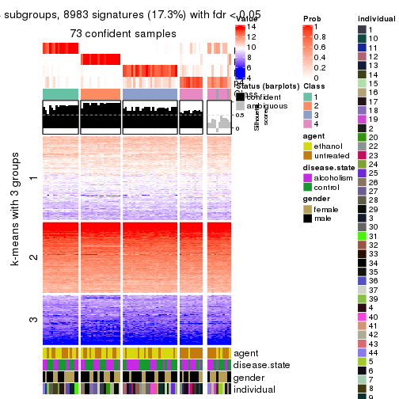</p>

</div>
<div id='tab-ATC-pam-get-signatures-no-scale-4'>
<pre><code class="r">get_signatures(res, k = 5, scale_rows = FALSE)
</code></pre>

<p></p>

</div>
<div id='tab-ATC-pam-get-signatures-no-scale-5'>
<pre><code class="r">get_signatures(res, k = 6, scale_rows = FALSE)
</code></pre>

<p></p>

</div>
</div>


Compare the overlap of signatures from different k:

```r
compare_signatures(res)
```


`get_signature()` returns a data frame invisibly. TO get the list of signatures, the function
call should be assigned to a variable explicitly. In following code, if `plot` argument is set
to `FALSE`, no heatmap is plotted while only the differential analysis is performed.

```r
# code only for demonstration
tb = get_signature(res, k = ..., plot = FALSE)
```

An example of the output of `tb` is:

```
#>   which_row         fdr    mean_1    mean_2 scaled_mean_1 scaled_mean_2 km
#> 1        38 0.042760348  8.373488  9.131774    -0.5533452     0.5164555  1
#> 2        40 0.018707592  7.106213  8.469186    -0.6173731     0.5762149  1
#> 3        55 0.019134737 10.221463 11.207825    -0.6159697     0.5749050  1
#> 4        59 0.006059896  5.921854  7.869574    -0.6899429     0.6439467  1
#> 5        60 0.018055526  8.928898 10.211722    -0.6204761     0.5791110  1
#> 6        98 0.009384629 15.714769 14.887706     0.6635654    -0.6193277  2
...
```

The columns in `tb` are:

1. `which_row`: row indices corresponding to the input matrix.
2. `fdr`: FDR for the differential test. 
3. `mean_x`: The mean value in group x.
4. `scaled_mean_x`: The mean value in group x after rows are scaled.
5. `km`: Row groups if k-means clustering is applied to rows.


UMAP plot which shows how samples are separated.


<script>
$( function() {
	$( '#tabs-ATC-pam-dimension-reduction' ).tabs();
} );
</script>
<div id='tabs-ATC-pam-dimension-reduction'>
<ul>
<li><a href='#tab-ATC-pam-dimension-reduction-1'>k = 2</a></li>
<li><a href='#tab-ATC-pam-dimension-reduction-2'>k = 3</a></li>
<li><a href='#tab-ATC-pam-dimension-reduction-3'>k = 4</a></li>
<li><a href='#tab-ATC-pam-dimension-reduction-4'>k = 5</a></li>
<li><a href='#tab-ATC-pam-dimension-reduction-5'>k = 6</a></li>
</ul>
<div id='tab-ATC-pam-dimension-reduction-1'>
<pre><code class="r">dimension_reduction(res, k = 2, method = &quot;UMAP&quot;)
</code></pre>

<p></p>

</div>
<div id='tab-ATC-pam-dimension-reduction-2'>
<pre><code class="r">dimension_reduction(res, k = 3, method = &quot;UMAP&quot;)
</code></pre>

<p></p>

</div>
<div id='tab-ATC-pam-dimension-reduction-3'>
<pre><code class="r">dimension_reduction(res, k = 4, method = &quot;UMAP&quot;)
</code></pre>

<p></p>

</div>
<div id='tab-ATC-pam-dimension-reduction-4'>
<pre><code class="r">dimension_reduction(res, k = 5, method = &quot;UMAP&quot;)
</code></pre>

<p></p>

</div>
<div id='tab-ATC-pam-dimension-reduction-5'>
<pre><code class="r">dimension_reduction(res, k = 6, method = &quot;UMAP&quot;)
</code></pre>

<p></p>

</div>
</div>


Following heatmap shows how subgroups are split when increasing `k`:

```r
collect_classes(res)
```


Test correlation between subgroups and known annotations. If the known
annotation is numeric, one-way ANOVA test is applied, and if the known
annotation is discrete, chi-squared contingency table test is applied.

```r
test_to_known_factors(res)
```

```
#>          n agent(p) disease.state(p) gender(p) individual(p) k
#> ATC:pam 70  0.00418            0.821    0.1569      7.98e-02 2
#> ATC:pam 73  0.09593            0.845    0.3656      3.67e-04 3
#> ATC:pam 73  0.00526            0.784    0.6219      1.29e-03 4
#> ATC:pam 70  0.01617            0.732    0.0219      5.23e-05 5
#> ATC:pam 71  0.00221            0.651    0.0882      2.48e-04 6
```


If matrix rows can be associated to genes, consider to use `GO_Enrichment(res,
...)` to perform function enrichment for the signature genes.


 

---------------------------------------------------


### ATC:mclust*


The object with results only for a single top-value method and a single partition method 
can be extracted as:

```r
res = res_list["ATC", "mclust"]
# you can also extract it by
# res = res_list["ATC:mclust"]
```

A summary of `res` and all the functions that can be applied to it:

```r
res
```

```
#> A 'ConsensusPartition' object with k = 2, 3, 4, 5, 6.
#>   On a matrix with 51941 rows and 84 columns.
#>   Top rows (1000, 2000, 3000, 4000, 5000) are extracted by 'ATC' method.
#>   Subgroups are detected by 'mclust' method.
#>   Performed in total 1250 partitions by row resampling.
#>   Best k for subgroups seems to be 2.
#> 
#> Following methods can be applied to this 'ConsensusPartition' object:
#>  [1] "cola_report"             "collect_classes"         "collect_plots"          
#>  [4] "collect_stats"           "colnames"                "compare_signatures"     
#>  [7] "consensus_heatmap"       "dimension_reduction"     "functional_enrichment"  
#> [10] "get_anno_col"            "get_anno"                "get_classes"            
#> [13] "get_consensus"           "get_matrix"              "get_membership"         
#> [16] "get_param"               "get_signatures"          "get_stats"              
#> [19] "is_best_k"               "is_stable_k"             "membership_heatmap"     
#> [22] "ncol"                    "nrow"                    "plot_ecdf"              
#> [25] "rownames"                "select_partition_number" "show"                   
#> [28] "suggest_best_k"          "test_to_known_factors"
```

`collect_plots()` function collects all the plots made from `res` for all `k` (number of partitions)
into one single page to provide an easy and fast comparison between different `k`.

```r
collect_plots(res)
```


The plots are:

- The first row: a plot of the ECDF (Empirical cumulative distribution
  function) curves of the consensus matrix for each `k` and the heatmap of
  predicted classes for each `k`.
- The second row: heatmaps of the consensus matrix for each `k`.
- The third row: heatmaps of the membership matrix for each `k`.
- The fouth row: heatmaps of the signatures for each `k`.

All the plots in panels can be made by individual functions and they are
plotted later in this section.

`select_partition_number()` produces several plots showing different
statistics for choosing "optimized" `k`. There are following statistics:

- ECDF curves of the consensus matrix for each `k`;
- 1-PAC. [The PAC
  score](https://en.wikipedia.org/wiki/Consensus_clustering#Over-interpretation_potential_of_consensus_clustering)
  measures the proportion of the ambiguous subgrouping.
- Mean silhouette score.
- Concordance. The mean probability of fiting the consensus class ids in all
  partitions.
- Area increased. Denote $A_k$ as the area under the ECDF curve for current
  `k`, the area increased is defined as $A_k - A_{k-1}$.
- Rand index. The percent of pairs of samples that are both in a same cluster
  or both are not in a same cluster in the partition of k and k-1.
- Jaccard index. The ratio of pairs of samples are both in a same cluster in
  the partition of k and k-1 and the pairs of samples are both in a same
  cluster in the partition k or k-1.

The detailed explanations of these statistics can be found in [the cola
vignette](http://bioconductor.org/packages/devel/bioc/vignettes/cola/inst/doc/cola.html#toc_13).

Generally speaking, lower PAC score, higher mean silhouette score or higher
concordance corresponds to better partition. Rand index and Jaccard index
measure how similar the current partition is compared to partition with `k-1`.
If they are too similar, we won't accept `k` is better than `k-1`.

```r
select_partition_number(res)
```


The numeric values for all these statistics can be obtained by `get_stats()`.

```r
get_stats(res)
```

```
#>   k 1-PAC mean_silhouette concordance area_increased  Rand Jaccard
#> 2 2 0.925           0.942       0.974         0.3522 0.646   0.646
#> 3 3 0.520           0.771       0.854         0.7843 0.652   0.483
#> 4 4 0.575           0.565       0.779         0.1171 0.849   0.611
#> 5 5 0.630           0.432       0.722         0.0754 0.915   0.725
#> 6 6 0.674           0.568       0.760         0.0396 0.870   0.576
```

`suggest_best_k()` suggests the best $k$ based on these statistics. The rules are as follows:

- All $k$ with Jaccard index larger than 0.95 are removed because the increase of
  the partition number does not provides enough extra information. If all $k$ are removed,
  the best $k$ is assigned by `NA`.
- For $k$ with 1-PAC larger than 0.9, the maximal $k$ is taken as the "best k". Other $k$ is called "optional k".
- If it does not fit the second rule. The $k$ with the highest vote of highest
  1-PAC, mean silhouette and concordance is taken as the "best k".

```r
suggest_best_k(res)
```

```
#> [1] 2
```


Following shows the table of the partitions (You need to click the **show/hide
code output** link to see it). The membership matrix (columns with name `p*`)
is inferred by
[`clue::cl_consensus()`](https://www.rdocumentation.org/link/cl_consensus?package=clue)
function with the `SE` method. Basically the value in the membership matrix
represents the probability to belong to a certain group. The finall class
label for an item is determined with the group with highest probability it
belongs to.

In `get_classes()` function, the entropy is calculated from the membership
matrix and the silhouette score is calculated from the consensus matrix.


<script>
$( function() {
	$( '#tabs-ATC-mclust-get-classes' ).tabs();
} );
</script>
<div id='tabs-ATC-mclust-get-classes'>
<ul>
<li><a href='#tab-ATC-mclust-get-classes-1'>k = 2</a></li>
<li><a href='#tab-ATC-mclust-get-classes-2'>k = 3</a></li>
<li><a href='#tab-ATC-mclust-get-classes-3'>k = 4</a></li>
<li><a href='#tab-ATC-mclust-get-classes-4'>k = 5</a></li>
<li><a href='#tab-ATC-mclust-get-classes-5'>k = 6</a></li>
</ul>

<div id='tab-ATC-mclust-get-classes-1'>
<p><a id='tab-ATC-mclust-get-classes-1-a' style='color:#0366d6' href='#'>show/hide code output</a></p>
<pre><code class="r">cbind(get_classes(res, k = 2), get_membership(res, k = 2))
</code></pre>

<pre><code>#&gt;            class entropy silhouette    p1    p2
#&gt; GSM1269647     2  0.0376    0.93795 0.004 0.996
#&gt; GSM1269655     1  0.0000    0.98281 1.000 0.000
#&gt; GSM1269663     2  0.4939    0.88554 0.108 0.892
#&gt; GSM1269671     1  0.0000    0.98281 1.000 0.000
#&gt; GSM1269679     1  0.0000    0.98281 1.000 0.000
#&gt; GSM1269693     1  0.0376    0.98058 0.996 0.004
#&gt; GSM1269701     1  0.0000    0.98281 1.000 0.000
#&gt; GSM1269709     1  0.0000    0.98281 1.000 0.000
#&gt; GSM1269715     1  0.0376    0.98058 0.996 0.004
#&gt; GSM1269717     1  0.0000    0.98281 1.000 0.000
#&gt; GSM1269721     1  0.0376    0.98058 0.996 0.004
#&gt; GSM1269723     1  0.7453    0.71333 0.788 0.212
#&gt; GSM1269645     2  0.0000    0.93517 0.000 1.000
#&gt; GSM1269653     1  0.0000    0.98281 1.000 0.000
#&gt; GSM1269661     2  0.0376    0.93795 0.004 0.996
#&gt; GSM1269669     1  0.0000    0.98281 1.000 0.000
#&gt; GSM1269677     1  0.6973    0.74868 0.812 0.188
#&gt; GSM1269685     1  0.0000    0.98281 1.000 0.000
#&gt; GSM1269691     1  0.0000    0.98281 1.000 0.000
#&gt; GSM1269699     1  0.0000    0.98281 1.000 0.000
#&gt; GSM1269707     1  0.0376    0.98058 0.996 0.004
#&gt; GSM1269651     2  0.0376    0.93795 0.004 0.996
#&gt; GSM1269659     1  0.0376    0.98058 0.996 0.004
#&gt; GSM1269667     2  0.0376    0.93795 0.004 0.996
#&gt; GSM1269675     1  0.0376    0.98058 0.996 0.004
#&gt; GSM1269683     1  0.0376    0.98058 0.996 0.004
#&gt; GSM1269689     1  0.0376    0.98058 0.996 0.004
#&gt; GSM1269697     1  0.0000    0.98281 1.000 0.000
#&gt; GSM1269705     1  0.0000    0.98281 1.000 0.000
#&gt; GSM1269713     1  0.0000    0.98281 1.000 0.000
#&gt; GSM1269719     1  0.0000    0.98281 1.000 0.000
#&gt; GSM1269725     1  0.0000    0.98281 1.000 0.000
#&gt; GSM1269727     1  0.0376    0.98058 0.996 0.004
#&gt; GSM1269649     2  0.0376    0.93795 0.004 0.996
#&gt; GSM1269657     1  0.0000    0.98281 1.000 0.000
#&gt; GSM1269665     2  0.0376    0.93795 0.004 0.996
#&gt; GSM1269673     1  0.0000    0.98281 1.000 0.000
#&gt; GSM1269681     2  0.4562    0.89231 0.096 0.904
#&gt; GSM1269687     1  0.0000    0.98281 1.000 0.000
#&gt; GSM1269695     1  0.0000    0.98281 1.000 0.000
#&gt; GSM1269703     1  0.0000    0.98281 1.000 0.000
#&gt; GSM1269711     1  0.0376    0.98058 0.996 0.004
#&gt; GSM1269646     2  0.0376    0.93795 0.004 0.996
#&gt; GSM1269654     1  0.0000    0.98281 1.000 0.000
#&gt; GSM1269662     2  0.0376    0.93795 0.004 0.996
#&gt; GSM1269670     2  0.4815    0.88596 0.104 0.896
#&gt; GSM1269678     1  0.0000    0.98281 1.000 0.000
#&gt; GSM1269692     1  0.0000    0.98281 1.000 0.000
#&gt; GSM1269700     1  0.0000    0.98281 1.000 0.000
#&gt; GSM1269708     1  0.0000    0.98281 1.000 0.000
#&gt; GSM1269714     1  0.0000    0.98281 1.000 0.000
#&gt; GSM1269716     1  0.0000    0.98281 1.000 0.000
#&gt; GSM1269720     1  0.0376    0.98058 0.996 0.004
#&gt; GSM1269722     1  0.0000    0.98281 1.000 0.000
#&gt; GSM1269644     2  0.4939    0.88554 0.108 0.892
#&gt; GSM1269652     1  0.0000    0.98281 1.000 0.000
#&gt; GSM1269660     2  0.0376    0.93795 0.004 0.996
#&gt; GSM1269668     1  0.0000    0.98281 1.000 0.000
#&gt; GSM1269676     1  0.0000    0.98281 1.000 0.000
#&gt; GSM1269684     1  0.0000    0.98281 1.000 0.000
#&gt; GSM1269690     1  0.0000    0.98281 1.000 0.000
#&gt; GSM1269698     1  0.0000    0.98281 1.000 0.000
#&gt; GSM1269706     1  0.0000    0.98281 1.000 0.000
#&gt; GSM1269650     2  0.0376    0.93795 0.004 0.996
#&gt; GSM1269658     1  0.0376    0.98058 0.996 0.004
#&gt; GSM1269666     2  0.4431    0.89697 0.092 0.908
#&gt; GSM1269674     1  0.0000    0.98281 1.000 0.000
#&gt; GSM1269682     1  0.4161    0.89294 0.916 0.084
#&gt; GSM1269688     1  0.0376    0.98058 0.996 0.004
#&gt; GSM1269696     1  0.0000    0.98281 1.000 0.000
#&gt; GSM1269704     1  0.0000    0.98281 1.000 0.000
#&gt; GSM1269712     2  0.9732    0.35968 0.404 0.596
#&gt; GSM1269718     1  0.0000    0.98281 1.000 0.000
#&gt; GSM1269724     1  0.0000    0.98281 1.000 0.000
#&gt; GSM1269726     1  0.0376    0.98058 0.996 0.004
#&gt; GSM1269648     1  0.9983   -0.00881 0.524 0.476
#&gt; GSM1269656     1  0.0000    0.98281 1.000 0.000
#&gt; GSM1269664     2  0.0376    0.93795 0.004 0.996
#&gt; GSM1269672     1  0.0000    0.98281 1.000 0.000
#&gt; GSM1269680     2  0.6887    0.80639 0.184 0.816
#&gt; GSM1269686     1  0.0000    0.98281 1.000 0.000
#&gt; GSM1269694     1  0.0000    0.98281 1.000 0.000
#&gt; GSM1269702     1  0.0000    0.98281 1.000 0.000
#&gt; GSM1269710     1  0.0000    0.98281 1.000 0.000
</code></pre>

<script>
$('#tab-ATC-mclust-get-classes-1-a').parent().next().next().hide();
$('#tab-ATC-mclust-get-classes-1-a').click(function(){
  $('#tab-ATC-mclust-get-classes-1-a').parent().next().next().toggle();
  return(false);
});
</script>
</div>

<div id='tab-ATC-mclust-get-classes-2'>
<p><a id='tab-ATC-mclust-get-classes-2-a' style='color:#0366d6' href='#'>show/hide code output</a></p>
<pre><code class="r">cbind(get_classes(res, k = 3), get_membership(res, k = 3))
</code></pre>

<pre><code>#&gt;            class entropy silhouette    p1    p2    p3
#&gt; GSM1269647     2  0.0000     0.8837 0.000 1.000 0.000
#&gt; GSM1269655     1  0.0000     0.8790 1.000 0.000 0.000
#&gt; GSM1269663     2  0.0000     0.8837 0.000 1.000 0.000
#&gt; GSM1269671     2  0.8386     0.4582 0.112 0.584 0.304
#&gt; GSM1269679     3  0.3340     0.7885 0.120 0.000 0.880
#&gt; GSM1269693     3  0.3482     0.8109 0.128 0.000 0.872
#&gt; GSM1269701     1  0.3192     0.7758 0.888 0.000 0.112
#&gt; GSM1269709     1  0.3192     0.7758 0.888 0.000 0.112
#&gt; GSM1269715     3  0.3482     0.8109 0.128 0.000 0.872
#&gt; GSM1269717     3  0.5859     0.6960 0.344 0.000 0.656
#&gt; GSM1269721     3  0.3482     0.8109 0.128 0.000 0.872
#&gt; GSM1269723     3  0.3192     0.7913 0.112 0.000 0.888
#&gt; GSM1269645     2  0.0000     0.8837 0.000 1.000 0.000
#&gt; GSM1269653     1  0.6180    -0.0638 0.584 0.000 0.416
#&gt; GSM1269661     2  0.0000     0.8837 0.000 1.000 0.000
#&gt; GSM1269669     1  0.5859     0.5139 0.656 0.000 0.344
#&gt; GSM1269677     2  0.7909     0.5599 0.112 0.648 0.240
#&gt; GSM1269685     1  0.3192     0.7758 0.888 0.000 0.112
#&gt; GSM1269691     1  0.0000     0.8790 1.000 0.000 0.000
#&gt; GSM1269699     1  0.0000     0.8790 1.000 0.000 0.000
#&gt; GSM1269707     3  0.3482     0.8109 0.128 0.000 0.872
#&gt; GSM1269651     2  0.0000     0.8837 0.000 1.000 0.000
#&gt; GSM1269659     3  0.3752     0.8003 0.144 0.000 0.856
#&gt; GSM1269667     2  0.0000     0.8837 0.000 1.000 0.000
#&gt; GSM1269675     3  0.3192     0.7913 0.112 0.000 0.888
#&gt; GSM1269683     3  0.3192     0.7913 0.112 0.000 0.888
#&gt; GSM1269689     3  0.3482     0.8109 0.128 0.000 0.872
#&gt; GSM1269697     1  0.0000     0.8790 1.000 0.000 0.000
#&gt; GSM1269705     1  0.0000     0.8790 1.000 0.000 0.000
#&gt; GSM1269713     3  0.6299     0.4248 0.476 0.000 0.524
#&gt; GSM1269719     1  0.9496     0.2350 0.492 0.276 0.232
#&gt; GSM1269725     1  0.0237     0.8776 0.996 0.000 0.004
#&gt; GSM1269727     3  0.3482     0.8109 0.128 0.000 0.872
#&gt; GSM1269649     2  0.0000     0.8837 0.000 1.000 0.000
#&gt; GSM1269657     1  0.0747     0.8726 0.984 0.000 0.016
#&gt; GSM1269665     2  0.0000     0.8837 0.000 1.000 0.000
#&gt; GSM1269673     3  0.6260     0.1908 0.448 0.000 0.552
#&gt; GSM1269681     2  0.2959     0.8359 0.000 0.900 0.100
#&gt; GSM1269687     1  0.4654     0.7353 0.792 0.000 0.208
#&gt; GSM1269695     1  0.0000     0.8790 1.000 0.000 0.000
#&gt; GSM1269703     3  0.6192     0.5668 0.420 0.000 0.580
#&gt; GSM1269711     3  0.5016     0.8006 0.240 0.000 0.760
#&gt; GSM1269646     2  0.0000     0.8837 0.000 1.000 0.000
#&gt; GSM1269654     1  0.0237     0.8777 0.996 0.000 0.004
#&gt; GSM1269662     2  0.0000     0.8837 0.000 1.000 0.000
#&gt; GSM1269670     2  0.2959     0.8359 0.000 0.900 0.100
#&gt; GSM1269678     1  0.4555     0.7432 0.800 0.000 0.200
#&gt; GSM1269692     1  0.0000     0.8790 1.000 0.000 0.000
#&gt; GSM1269700     1  0.2448     0.8322 0.924 0.000 0.076
#&gt; GSM1269708     1  0.0000     0.8790 1.000 0.000 0.000
#&gt; GSM1269714     1  0.0000     0.8790 1.000 0.000 0.000
#&gt; GSM1269716     1  0.2066     0.8449 0.940 0.000 0.060
#&gt; GSM1269720     3  0.3686     0.8191 0.140 0.000 0.860
#&gt; GSM1269722     3  0.5621     0.7474 0.308 0.000 0.692
#&gt; GSM1269644     2  0.0000     0.8837 0.000 1.000 0.000
#&gt; GSM1269652     1  0.0000     0.8790 1.000 0.000 0.000
#&gt; GSM1269660     2  0.0000     0.8837 0.000 1.000 0.000
#&gt; GSM1269668     1  0.3482     0.7850 0.872 0.000 0.128
#&gt; GSM1269676     1  0.5012     0.7326 0.788 0.008 0.204
#&gt; GSM1269684     1  0.4178     0.7651 0.828 0.000 0.172
#&gt; GSM1269690     1  0.0000     0.8790 1.000 0.000 0.000
#&gt; GSM1269698     1  0.0000     0.8790 1.000 0.000 0.000
#&gt; GSM1269706     1  0.3482     0.7879 0.872 0.000 0.128
#&gt; GSM1269650     2  0.0000     0.8837 0.000 1.000 0.000
#&gt; GSM1269658     3  0.3192     0.7913 0.112 0.000 0.888
#&gt; GSM1269666     2  0.0000     0.8837 0.000 1.000 0.000
#&gt; GSM1269674     1  0.5678     0.5745 0.684 0.000 0.316
#&gt; GSM1269682     2  0.8496     0.4185 0.112 0.564 0.324
#&gt; GSM1269688     1  0.3192     0.7758 0.888 0.000 0.112
#&gt; GSM1269696     1  0.2448     0.8322 0.924 0.000 0.076
#&gt; GSM1269704     1  0.0000     0.8790 1.000 0.000 0.000
#&gt; GSM1269712     2  0.8047     0.5378 0.112 0.632 0.256
#&gt; GSM1269718     2  0.9627     0.1473 0.364 0.428 0.208
#&gt; GSM1269724     1  0.2537     0.8286 0.920 0.000 0.080
#&gt; GSM1269726     3  0.4887     0.8051 0.228 0.000 0.772
#&gt; GSM1269648     2  0.1860     0.8440 0.052 0.948 0.000
#&gt; GSM1269656     1  0.0000     0.8790 1.000 0.000 0.000
#&gt; GSM1269664     2  0.0000     0.8837 0.000 1.000 0.000
#&gt; GSM1269672     1  0.3482     0.7850 0.872 0.000 0.128
#&gt; GSM1269680     2  0.2959     0.8359 0.000 0.900 0.100
#&gt; GSM1269686     1  0.0000     0.8790 1.000 0.000 0.000
#&gt; GSM1269694     1  0.0000     0.8790 1.000 0.000 0.000
#&gt; GSM1269702     1  0.0000     0.8790 1.000 0.000 0.000
#&gt; GSM1269710     3  0.3192     0.7913 0.112 0.000 0.888
</code></pre>

<script>
$('#tab-ATC-mclust-get-classes-2-a').parent().next().next().hide();
$('#tab-ATC-mclust-get-classes-2-a').click(function(){
  $('#tab-ATC-mclust-get-classes-2-a').parent().next().next().toggle();
  return(false);
});
</script>
</div>

<div id='tab-ATC-mclust-get-classes-3'>
<p><a id='tab-ATC-mclust-get-classes-3-a' style='color:#0366d6' href='#'>show/hide code output</a></p>
<pre><code class="r">cbind(get_classes(res, k = 4), get_membership(res, k = 4))
</code></pre>

<pre><code>#&gt;            class entropy silhouette    p1    p2    p3    p4
#&gt; GSM1269647     2  0.0336   0.880135 0.000 0.992 0.000 0.008
#&gt; GSM1269655     1  0.0707   0.820685 0.980 0.000 0.020 0.000
#&gt; GSM1269663     2  0.1716   0.838146 0.000 0.936 0.064 0.000
#&gt; GSM1269671     3  0.4535   0.296384 0.000 0.292 0.704 0.004
#&gt; GSM1269679     3  0.3764   0.166248 0.000 0.000 0.784 0.216
#&gt; GSM1269693     4  0.3311   0.717784 0.000 0.000 0.172 0.828
#&gt; GSM1269701     1  0.6931   0.448868 0.588 0.000 0.184 0.228
#&gt; GSM1269709     1  0.5464   0.614781 0.708 0.000 0.064 0.228
#&gt; GSM1269715     4  0.4477   0.752229 0.000 0.000 0.312 0.688
#&gt; GSM1269717     3  0.6917   0.039623 0.288 0.000 0.568 0.144
#&gt; GSM1269721     4  0.1557   0.651172 0.000 0.000 0.056 0.944
#&gt; GSM1269723     3  0.4222   0.048186 0.000 0.000 0.728 0.272
#&gt; GSM1269645     2  0.0000   0.880583 0.000 1.000 0.000 0.000
#&gt; GSM1269653     3  0.7282   0.032577 0.416 0.000 0.436 0.148
#&gt; GSM1269661     2  0.0336   0.880135 0.000 0.992 0.000 0.008
#&gt; GSM1269669     3  0.5610   0.364829 0.176 0.000 0.720 0.104
#&gt; GSM1269677     3  0.4855  -0.107753 0.000 0.400 0.600 0.000
#&gt; GSM1269685     1  0.5394   0.615761 0.712 0.000 0.060 0.228
#&gt; GSM1269691     1  0.1118   0.821024 0.964 0.000 0.036 0.000
#&gt; GSM1269699     1  0.0000   0.817646 1.000 0.000 0.000 0.000
#&gt; GSM1269707     4  0.4477   0.752229 0.000 0.000 0.312 0.688
#&gt; GSM1269651     2  0.0336   0.879248 0.000 0.992 0.008 0.000
#&gt; GSM1269659     4  0.1557   0.651172 0.000 0.000 0.056 0.944
#&gt; GSM1269667     2  0.0336   0.880135 0.000 0.992 0.000 0.008
#&gt; GSM1269675     3  0.4406  -0.000840 0.000 0.000 0.700 0.300
#&gt; GSM1269683     3  0.4406  -0.000840 0.000 0.000 0.700 0.300
#&gt; GSM1269689     4  0.4477   0.752229 0.000 0.000 0.312 0.688
#&gt; GSM1269697     1  0.2589   0.792068 0.884 0.000 0.116 0.000
#&gt; GSM1269705     1  0.0336   0.817726 0.992 0.000 0.008 0.000
#&gt; GSM1269713     3  0.7448   0.023352 0.400 0.000 0.428 0.172
#&gt; GSM1269719     3  0.6975   0.386150 0.200 0.216 0.584 0.000
#&gt; GSM1269725     1  0.3649   0.709453 0.796 0.000 0.204 0.000
#&gt; GSM1269727     4  0.4477   0.752229 0.000 0.000 0.312 0.688
#&gt; GSM1269649     2  0.0336   0.880135 0.000 0.992 0.000 0.008
#&gt; GSM1269657     1  0.3569   0.695287 0.804 0.000 0.196 0.000
#&gt; GSM1269665     2  0.0000   0.880583 0.000 1.000 0.000 0.000
#&gt; GSM1269673     3  0.5314   0.325009 0.108 0.000 0.748 0.144
#&gt; GSM1269681     2  0.3219   0.758163 0.000 0.836 0.164 0.000
#&gt; GSM1269687     3  0.4888   0.127503 0.412 0.000 0.588 0.000
#&gt; GSM1269695     1  0.1716   0.815128 0.936 0.000 0.064 0.000
#&gt; GSM1269703     3  0.7825  -0.178400 0.284 0.000 0.412 0.304
#&gt; GSM1269711     4  0.7648   0.360271 0.208 0.000 0.392 0.400
#&gt; GSM1269646     2  0.0000   0.880583 0.000 1.000 0.000 0.000
#&gt; GSM1269654     1  0.1716   0.816187 0.936 0.000 0.064 0.000
#&gt; GSM1269662     2  0.0000   0.880583 0.000 1.000 0.000 0.000
#&gt; GSM1269670     2  0.3498   0.761272 0.000 0.832 0.160 0.008
#&gt; GSM1269678     3  0.4955   0.055621 0.444 0.000 0.556 0.000
#&gt; GSM1269692     1  0.1637   0.816606 0.940 0.000 0.060 0.000
#&gt; GSM1269700     1  0.3569   0.714610 0.804 0.000 0.196 0.000
#&gt; GSM1269708     1  0.0000   0.817646 1.000 0.000 0.000 0.000
#&gt; GSM1269714     1  0.1637   0.816606 0.940 0.000 0.060 0.000
#&gt; GSM1269716     1  0.2149   0.809915 0.912 0.000 0.088 0.000
#&gt; GSM1269720     4  0.4908   0.557092 0.016 0.000 0.292 0.692
#&gt; GSM1269722     3  0.7617  -0.017806 0.372 0.000 0.424 0.204
#&gt; GSM1269644     2  0.3266   0.784609 0.000 0.832 0.168 0.000
#&gt; GSM1269652     1  0.0188   0.816996 0.996 0.000 0.004 0.000
#&gt; GSM1269660     2  0.0000   0.880583 0.000 1.000 0.000 0.000
#&gt; GSM1269668     1  0.4843   0.165953 0.604 0.000 0.396 0.000
#&gt; GSM1269676     3  0.5400   0.199838 0.372 0.020 0.608 0.000
#&gt; GSM1269684     1  0.4967   0.123632 0.548 0.000 0.452 0.000
#&gt; GSM1269690     1  0.0188   0.816996 0.996 0.000 0.004 0.000
#&gt; GSM1269698     1  0.0000   0.817646 1.000 0.000 0.000 0.000
#&gt; GSM1269706     1  0.2412   0.806863 0.908 0.000 0.084 0.008
#&gt; GSM1269650     2  0.0817   0.873711 0.000 0.976 0.024 0.000
#&gt; GSM1269658     3  0.4996   0.000766 0.000 0.000 0.516 0.484
#&gt; GSM1269666     2  0.0469   0.877752 0.000 0.988 0.012 0.000
#&gt; GSM1269674     3  0.5576   0.067363 0.444 0.000 0.536 0.020
#&gt; GSM1269682     2  0.5296   0.148635 0.000 0.500 0.492 0.008
#&gt; GSM1269688     1  0.6124   0.532164 0.640 0.000 0.084 0.276
#&gt; GSM1269696     1  0.3726   0.698511 0.788 0.000 0.212 0.000
#&gt; GSM1269704     1  0.0000   0.817646 1.000 0.000 0.000 0.000
#&gt; GSM1269712     2  0.5161   0.203873 0.000 0.520 0.476 0.004
#&gt; GSM1269718     3  0.6411   0.235991 0.092 0.308 0.600 0.000
#&gt; GSM1269724     1  0.3801   0.689882 0.780 0.000 0.220 0.000
#&gt; GSM1269726     4  0.7251   0.452931 0.144 0.000 0.416 0.440
#&gt; GSM1269648     2  0.3754   0.764324 0.064 0.852 0.084 0.000
#&gt; GSM1269656     1  0.1637   0.817928 0.940 0.000 0.060 0.000
#&gt; GSM1269664     2  0.0000   0.880583 0.000 1.000 0.000 0.000
#&gt; GSM1269672     1  0.4843   0.167792 0.604 0.000 0.396 0.000
#&gt; GSM1269680     2  0.4697   0.594575 0.000 0.644 0.356 0.000
#&gt; GSM1269686     1  0.0188   0.817945 0.996 0.000 0.004 0.000
#&gt; GSM1269694     1  0.0000   0.817646 1.000 0.000 0.000 0.000
#&gt; GSM1269702     1  0.0188   0.816996 0.996 0.000 0.004 0.000
#&gt; GSM1269710     3  0.3074   0.201932 0.000 0.000 0.848 0.152
</code></pre>

<script>
$('#tab-ATC-mclust-get-classes-3-a').parent().next().next().hide();
$('#tab-ATC-mclust-get-classes-3-a').click(function(){
  $('#tab-ATC-mclust-get-classes-3-a').parent().next().next().toggle();
  return(false);
});
</script>
</div>

<div id='tab-ATC-mclust-get-classes-4'>
<p><a id='tab-ATC-mclust-get-classes-4-a' style='color:#0366d6' href='#'>show/hide code output</a></p>
<pre><code class="r">cbind(get_classes(res, k = 5), get_membership(res, k = 5))
</code></pre>

<pre><code>#&gt;            class entropy silhouette    p1    p2    p3    p4    p5
#&gt; GSM1269647     2  0.0290     0.7907 0.000 0.992 0.008 0.000 0.000
#&gt; GSM1269655     5  0.0290     0.8120 0.000 0.000 0.008 0.000 0.992
#&gt; GSM1269663     2  0.1908     0.7610 0.000 0.908 0.092 0.000 0.000
#&gt; GSM1269671     1  0.5335     0.0502 0.548 0.032 0.012 0.408 0.000
#&gt; GSM1269679     1  0.4192     0.1506 0.596 0.000 0.000 0.404 0.000
#&gt; GSM1269693     4  0.6473    -0.0573 0.188 0.000 0.364 0.448 0.000
#&gt; GSM1269701     1  0.6866     0.1342 0.380 0.000 0.252 0.004 0.364
#&gt; GSM1269709     5  0.3452     0.6147 0.000 0.000 0.244 0.000 0.756
#&gt; GSM1269715     1  0.6682     0.2365 0.396 0.000 0.368 0.236 0.000
#&gt; GSM1269717     1  0.1915     0.3703 0.928 0.000 0.000 0.040 0.032
#&gt; GSM1269721     4  0.5221     0.0918 0.048 0.000 0.400 0.552 0.000
#&gt; GSM1269723     1  0.3814     0.2853 0.720 0.000 0.004 0.276 0.000
#&gt; GSM1269645     2  0.0162     0.7910 0.000 0.996 0.004 0.000 0.000
#&gt; GSM1269653     1  0.4182     0.2986 0.600 0.000 0.000 0.000 0.400
#&gt; GSM1269661     2  0.0000     0.7911 0.000 1.000 0.000 0.000 0.000
#&gt; GSM1269669     1  0.4902     0.1136 0.564 0.000 0.000 0.408 0.028
#&gt; GSM1269677     4  0.6726    -0.6518 0.004 0.208 0.388 0.400 0.000
#&gt; GSM1269685     5  0.3452     0.6115 0.000 0.000 0.244 0.000 0.756
#&gt; GSM1269691     5  0.0510     0.8115 0.000 0.000 0.016 0.000 0.984
#&gt; GSM1269699     5  0.0794     0.8110 0.000 0.000 0.028 0.000 0.972
#&gt; GSM1269707     1  0.6682     0.2365 0.396 0.000 0.368 0.236 0.000
#&gt; GSM1269651     2  0.2605     0.7310 0.000 0.852 0.148 0.000 0.000
#&gt; GSM1269659     4  0.5229     0.0928 0.048 0.000 0.404 0.548 0.000
#&gt; GSM1269667     2  0.0162     0.7910 0.000 0.996 0.004 0.000 0.000
#&gt; GSM1269675     4  0.4211    -0.1448 0.360 0.000 0.004 0.636 0.000
#&gt; GSM1269683     4  0.4341    -0.1733 0.404 0.000 0.004 0.592 0.000
#&gt; GSM1269689     1  0.6680     0.2362 0.400 0.000 0.364 0.236 0.000
#&gt; GSM1269697     5  0.5806     0.4952 0.212 0.000 0.144 0.008 0.636
#&gt; GSM1269705     5  0.0794     0.8110 0.000 0.000 0.028 0.000 0.972
#&gt; GSM1269713     1  0.5043     0.3173 0.600 0.000 0.044 0.000 0.356
#&gt; GSM1269719     4  0.9016    -0.5477 0.268 0.144 0.156 0.376 0.056
#&gt; GSM1269725     5  0.6029     0.4498 0.236 0.000 0.152 0.008 0.604
#&gt; GSM1269727     1  0.6680     0.2362 0.400 0.000 0.364 0.236 0.000
#&gt; GSM1269649     2  0.0290     0.7907 0.000 0.992 0.008 0.000 0.000
#&gt; GSM1269657     5  0.3052     0.7366 0.036 0.000 0.016 0.072 0.876
#&gt; GSM1269665     2  0.0162     0.7910 0.000 0.996 0.004 0.000 0.000
#&gt; GSM1269673     1  0.5175     0.0824 0.548 0.000 0.000 0.408 0.044
#&gt; GSM1269681     2  0.3010     0.6324 0.004 0.824 0.000 0.172 0.000
#&gt; GSM1269687     4  0.7452    -0.1592 0.240 0.000 0.040 0.412 0.308
#&gt; GSM1269695     5  0.0510     0.8125 0.000 0.000 0.016 0.000 0.984
#&gt; GSM1269703     1  0.3109     0.3734 0.800 0.000 0.000 0.000 0.200
#&gt; GSM1269711     1  0.3565     0.3488 0.816 0.000 0.000 0.144 0.040
#&gt; GSM1269646     2  0.0000     0.7911 0.000 1.000 0.000 0.000 0.000
#&gt; GSM1269654     5  0.0798     0.8094 0.000 0.000 0.016 0.008 0.976
#&gt; GSM1269662     2  0.0162     0.7910 0.000 0.996 0.004 0.000 0.000
#&gt; GSM1269670     2  0.3010     0.6324 0.004 0.824 0.000 0.172 0.000
#&gt; GSM1269678     4  0.7478    -0.1626 0.264 0.000 0.036 0.380 0.320
#&gt; GSM1269692     5  0.0510     0.8109 0.000 0.000 0.016 0.000 0.984
#&gt; GSM1269700     5  0.5468     0.3674 0.332 0.000 0.060 0.008 0.600
#&gt; GSM1269708     5  0.0290     0.8132 0.000 0.000 0.008 0.000 0.992
#&gt; GSM1269714     5  0.0510     0.8109 0.000 0.000 0.016 0.000 0.984
#&gt; GSM1269716     5  0.2054     0.7857 0.052 0.000 0.028 0.000 0.920
#&gt; GSM1269720     4  0.5257    -0.0863 0.452 0.000 0.020 0.512 0.016
#&gt; GSM1269722     1  0.5394     0.3300 0.604 0.000 0.064 0.004 0.328
#&gt; GSM1269644     2  0.4161     0.4612 0.000 0.608 0.392 0.000 0.000
#&gt; GSM1269652     5  0.0000     0.8131 0.000 0.000 0.000 0.000 1.000
#&gt; GSM1269660     2  0.0162     0.7910 0.000 0.996 0.004 0.000 0.000
#&gt; GSM1269668     5  0.4649     0.1662 0.000 0.000 0.016 0.404 0.580
#&gt; GSM1269676     3  0.7735     0.5316 0.072 0.008 0.404 0.368 0.148
#&gt; GSM1269684     5  0.5144     0.1615 0.020 0.000 0.016 0.384 0.580
#&gt; GSM1269690     5  0.0290     0.8120 0.000 0.000 0.008 0.000 0.992
#&gt; GSM1269698     5  0.0880     0.8102 0.000 0.000 0.032 0.000 0.968
#&gt; GSM1269706     5  0.1725     0.7943 0.044 0.000 0.020 0.000 0.936
#&gt; GSM1269650     2  0.4088     0.4960 0.000 0.632 0.368 0.000 0.000
#&gt; GSM1269658     4  0.1768    -0.1450 0.004 0.000 0.072 0.924 0.000
#&gt; GSM1269666     2  0.2471     0.7382 0.000 0.864 0.136 0.000 0.000
#&gt; GSM1269674     4  0.7013    -0.1577 0.244 0.000 0.012 0.412 0.332
#&gt; GSM1269682     2  0.6333    -0.2432 0.124 0.468 0.008 0.400 0.000
#&gt; GSM1269688     5  0.5080     0.4010 0.048 0.000 0.348 0.000 0.604
#&gt; GSM1269696     5  0.6352     0.3941 0.268 0.000 0.172 0.008 0.552
#&gt; GSM1269704     5  0.0794     0.8114 0.000 0.000 0.028 0.000 0.972
#&gt; GSM1269712     2  0.6385    -0.0427 0.252 0.516 0.000 0.232 0.000
#&gt; GSM1269718     3  0.8382     0.5465 0.180 0.152 0.340 0.324 0.004
#&gt; GSM1269724     5  0.6534     0.3744 0.276 0.004 0.172 0.008 0.540
#&gt; GSM1269726     1  0.4712     0.2904 0.716 0.000 0.028 0.236 0.020
#&gt; GSM1269648     2  0.6732     0.4204 0.108 0.624 0.164 0.004 0.100
#&gt; GSM1269656     5  0.0566     0.8111 0.000 0.000 0.012 0.004 0.984
#&gt; GSM1269664     2  0.0162     0.7910 0.000 0.996 0.004 0.000 0.000
#&gt; GSM1269672     5  0.4789     0.1627 0.004 0.000 0.016 0.400 0.580
#&gt; GSM1269680     2  0.6550     0.0498 0.004 0.436 0.388 0.172 0.000
#&gt; GSM1269686     5  0.0510     0.8129 0.000 0.000 0.016 0.000 0.984
#&gt; GSM1269694     5  0.0290     0.8132 0.000 0.000 0.008 0.000 0.992
#&gt; GSM1269702     5  0.0162     0.8134 0.000 0.000 0.004 0.000 0.996
#&gt; GSM1269710     1  0.2424     0.3365 0.868 0.000 0.000 0.132 0.000
</code></pre>

<script>
$('#tab-ATC-mclust-get-classes-4-a').parent().next().next().hide();
$('#tab-ATC-mclust-get-classes-4-a').click(function(){
  $('#tab-ATC-mclust-get-classes-4-a').parent().next().next().toggle();
  return(false);
});
</script>
</div>

<div id='tab-ATC-mclust-get-classes-5'>
<p><a id='tab-ATC-mclust-get-classes-5-a' style='color:#0366d6' href='#'>show/hide code output</a></p>
<pre><code class="r">cbind(get_classes(res, k = 6), get_membership(res, k = 6))
</code></pre>

<pre><code>#&gt;            class entropy silhouette    p1    p2    p3    p4    p5    p6
#&gt; GSM1269647     2  0.3986     0.7079 0.000 0.532 0.000 0.000 0.004 0.464
#&gt; GSM1269655     1  0.0000     0.8379 1.000 0.000 0.000 0.000 0.000 0.000
#&gt; GSM1269663     6  0.3314    -0.0598 0.000 0.256 0.004 0.000 0.000 0.740
#&gt; GSM1269671     3  0.5372     0.5294 0.000 0.388 0.520 0.012 0.080 0.000
#&gt; GSM1269679     3  0.5823     0.5478 0.000 0.336 0.540 0.068 0.056 0.000
#&gt; GSM1269693     3  0.3810    -0.6062 0.000 0.000 0.572 0.428 0.000 0.000
#&gt; GSM1269701     3  0.4977     0.2685 0.372 0.000 0.552 0.000 0.076 0.000
#&gt; GSM1269709     1  0.3428     0.6806 0.796 0.004 0.176 0.016 0.008 0.000
#&gt; GSM1269715     3  0.1078     0.4017 0.000 0.016 0.964 0.012 0.008 0.000
#&gt; GSM1269717     3  0.6917     0.5728 0.068 0.136 0.584 0.128 0.084 0.000
#&gt; GSM1269721     4  0.3899     0.6649 0.000 0.000 0.404 0.592 0.004 0.000
#&gt; GSM1269723     3  0.5688     0.5355 0.000 0.224 0.608 0.136 0.032 0.000
#&gt; GSM1269645     2  0.4724     0.7624 0.000 0.588 0.000 0.028 0.016 0.368
#&gt; GSM1269653     3  0.4815     0.3963 0.384 0.000 0.556 0.000 0.060 0.000
#&gt; GSM1269661     2  0.4159     0.7644 0.000 0.588 0.000 0.016 0.000 0.396
#&gt; GSM1269669     3  0.6459     0.5306 0.000 0.192 0.532 0.212 0.064 0.000
#&gt; GSM1269677     6  0.4397     0.4674 0.000 0.376 0.000 0.024 0.004 0.596
#&gt; GSM1269685     1  0.3428     0.6806 0.796 0.004 0.176 0.016 0.008 0.000
#&gt; GSM1269691     1  0.1476     0.8157 0.948 0.004 0.028 0.012 0.008 0.000
#&gt; GSM1269699     1  0.0146     0.8380 0.996 0.000 0.000 0.000 0.004 0.000
#&gt; GSM1269707     3  0.0767     0.4186 0.004 0.000 0.976 0.012 0.008 0.000
#&gt; GSM1269651     6  0.0865     0.4847 0.000 0.036 0.000 0.000 0.000 0.964
#&gt; GSM1269659     4  0.3774     0.6664 0.000 0.000 0.408 0.592 0.000 0.000
#&gt; GSM1269667     2  0.3944     0.7451 0.000 0.568 0.000 0.000 0.004 0.428
#&gt; GSM1269675     3  0.5327     0.5201 0.000 0.164 0.588 0.248 0.000 0.000
#&gt; GSM1269683     3  0.5306     0.5563 0.000 0.268 0.596 0.132 0.004 0.000
#&gt; GSM1269689     3  0.0820     0.4010 0.000 0.016 0.972 0.012 0.000 0.000
#&gt; GSM1269697     5  0.3198     0.7431 0.260 0.000 0.000 0.000 0.740 0.000
#&gt; GSM1269705     1  0.0291     0.8374 0.992 0.004 0.000 0.000 0.004 0.000
#&gt; GSM1269713     3  0.5524     0.4281 0.204 0.000 0.560 0.000 0.236 0.000
#&gt; GSM1269719     6  0.6669     0.4001 0.024 0.360 0.028 0.036 0.060 0.492
#&gt; GSM1269725     5  0.3163     0.7650 0.232 0.000 0.004 0.000 0.764 0.000
#&gt; GSM1269727     3  0.0820     0.4010 0.000 0.016 0.972 0.012 0.000 0.000
#&gt; GSM1269649     2  0.3971     0.7274 0.000 0.548 0.000 0.000 0.004 0.448
#&gt; GSM1269657     1  0.1780     0.8028 0.924 0.048 0.000 0.028 0.000 0.000
#&gt; GSM1269665     2  0.4724     0.7624 0.000 0.588 0.000 0.028 0.016 0.368
#&gt; GSM1269673     3  0.6543     0.5309 0.004 0.192 0.532 0.212 0.060 0.000
#&gt; GSM1269681     2  0.3240     0.5651 0.000 0.752 0.000 0.000 0.004 0.244
#&gt; GSM1269687     3  0.6278     0.5161 0.044 0.384 0.480 0.020 0.072 0.000
#&gt; GSM1269695     1  0.0000     0.8379 1.000 0.000 0.000 0.000 0.000 0.000
#&gt; GSM1269703     3  0.5452     0.5382 0.160 0.008 0.684 0.076 0.072 0.000
#&gt; GSM1269711     3  0.4542     0.5198 0.088 0.000 0.748 0.128 0.036 0.000
#&gt; GSM1269646     2  0.4228     0.7656 0.000 0.588 0.000 0.020 0.000 0.392
#&gt; GSM1269654     1  0.1141     0.8150 0.948 0.052 0.000 0.000 0.000 0.000
#&gt; GSM1269662     2  0.4724     0.7624 0.000 0.588 0.000 0.028 0.016 0.368
#&gt; GSM1269670     2  0.3217     0.5824 0.000 0.768 0.000 0.000 0.008 0.224
#&gt; GSM1269678     1  0.6471     0.2303 0.480 0.364 0.028 0.036 0.092 0.000
#&gt; GSM1269692     1  0.0146     0.8377 0.996 0.000 0.000 0.004 0.000 0.000
#&gt; GSM1269700     3  0.5856     0.1751 0.404 0.000 0.404 0.000 0.192 0.000
#&gt; GSM1269708     1  0.0260     0.8362 0.992 0.000 0.000 0.000 0.008 0.000
#&gt; GSM1269714     1  0.0146     0.8377 0.996 0.000 0.000 0.004 0.000 0.000
#&gt; GSM1269716     1  0.3156     0.6556 0.800 0.000 0.020 0.000 0.180 0.000
#&gt; GSM1269720     4  0.5998     0.4406 0.032 0.060 0.332 0.548 0.028 0.000
#&gt; GSM1269722     3  0.5605     0.4397 0.180 0.000 0.560 0.004 0.256 0.000
#&gt; GSM1269644     6  0.0000     0.5158 0.000 0.000 0.000 0.000 0.000 1.000
#&gt; GSM1269652     1  0.0146     0.8380 0.996 0.000 0.000 0.000 0.004 0.000
#&gt; GSM1269660     2  0.4228     0.7656 0.000 0.588 0.000 0.020 0.000 0.392
#&gt; GSM1269668     1  0.5303     0.4504 0.600 0.204 0.000 0.196 0.000 0.000
#&gt; GSM1269676     6  0.5069     0.4581 0.000 0.360 0.016 0.036 0.008 0.580
#&gt; GSM1269684     1  0.5350     0.4450 0.592 0.196 0.000 0.212 0.000 0.000
#&gt; GSM1269690     1  0.0000     0.8379 1.000 0.000 0.000 0.000 0.000 0.000
#&gt; GSM1269698     1  0.2320     0.7314 0.864 0.004 0.000 0.000 0.132 0.000
#&gt; GSM1269706     1  0.2629     0.7441 0.872 0.000 0.068 0.000 0.060 0.000
#&gt; GSM1269650     6  0.0000     0.5158 0.000 0.000 0.000 0.000 0.000 1.000
#&gt; GSM1269658     4  0.2703     0.3874 0.000 0.172 0.004 0.824 0.000 0.000
#&gt; GSM1269666     6  0.2772     0.2149 0.000 0.180 0.000 0.000 0.004 0.816
#&gt; GSM1269674     3  0.8087     0.4107 0.148 0.192 0.396 0.212 0.052 0.000
#&gt; GSM1269682     2  0.5052    -0.3424 0.000 0.628 0.304 0.012 0.036 0.020
#&gt; GSM1269688     1  0.4529     0.3577 0.576 0.004 0.396 0.016 0.008 0.000
#&gt; GSM1269696     5  0.1219     0.7520 0.048 0.000 0.004 0.000 0.948 0.000
#&gt; GSM1269704     1  0.0291     0.8374 0.992 0.004 0.000 0.000 0.004 0.000
#&gt; GSM1269712     2  0.3704     0.1677 0.000 0.820 0.080 0.044 0.056 0.000
#&gt; GSM1269718     6  0.6498     0.4236 0.024 0.344 0.032 0.040 0.040 0.520
#&gt; GSM1269724     5  0.1152     0.7470 0.044 0.000 0.004 0.000 0.952 0.000
#&gt; GSM1269726     3  0.4714     0.4975 0.032 0.060 0.764 0.108 0.036 0.000
#&gt; GSM1269648     6  0.3354     0.3945 0.008 0.016 0.000 0.000 0.184 0.792
#&gt; GSM1269656     1  0.0146     0.8378 0.996 0.004 0.000 0.000 0.000 0.000
#&gt; GSM1269664     2  0.4228     0.7656 0.000 0.588 0.000 0.020 0.000 0.392
#&gt; GSM1269672     1  0.4432     0.4313 0.600 0.364 0.000 0.036 0.000 0.000
#&gt; GSM1269680     6  0.2946     0.5424 0.000 0.184 0.000 0.004 0.004 0.808
#&gt; GSM1269686     1  0.0146     0.8380 0.996 0.000 0.000 0.000 0.004 0.000
#&gt; GSM1269694     1  0.0146     0.8380 0.996 0.000 0.000 0.000 0.004 0.000
#&gt; GSM1269702     1  0.0291     0.8374 0.992 0.004 0.000 0.000 0.004 0.000
#&gt; GSM1269710     3  0.6052     0.5577 0.000 0.268 0.568 0.084 0.080 0.000
</code></pre>

<script>
$('#tab-ATC-mclust-get-classes-5-a').parent().next().next().hide();
$('#tab-ATC-mclust-get-classes-5-a').click(function(){
  $('#tab-ATC-mclust-get-classes-5-a').parent().next().next().toggle();
  return(false);
});
</script>
</div>
</div>

Heatmaps for the consensus matrix. It visualizes the probability of two
samples to be in a same group.


<script>
$( function() {
	$( '#tabs-ATC-mclust-consensus-heatmap' ).tabs();
} );
</script>
<div id='tabs-ATC-mclust-consensus-heatmap'>
<ul>
<li><a href='#tab-ATC-mclust-consensus-heatmap-1'>k = 2</a></li>
<li><a href='#tab-ATC-mclust-consensus-heatmap-2'>k = 3</a></li>
<li><a href='#tab-ATC-mclust-consensus-heatmap-3'>k = 4</a></li>
<li><a href='#tab-ATC-mclust-consensus-heatmap-4'>k = 5</a></li>
<li><a href='#tab-ATC-mclust-consensus-heatmap-5'>k = 6</a></li>
</ul>
<div id='tab-ATC-mclust-consensus-heatmap-1'>
<pre><code class="r">consensus_heatmap(res, k = 2)
</code></pre>

<p></p>

</div>
<div id='tab-ATC-mclust-consensus-heatmap-2'>
<pre><code class="r">consensus_heatmap(res, k = 3)
</code></pre>

<p></p>

</div>
<div id='tab-ATC-mclust-consensus-heatmap-3'>
<pre><code class="r">consensus_heatmap(res, k = 4)
</code></pre>

<p></p>

</div>
<div id='tab-ATC-mclust-consensus-heatmap-4'>
<pre><code class="r">consensus_heatmap(res, k = 5)
</code></pre>

<p></p>

</div>
<div id='tab-ATC-mclust-consensus-heatmap-5'>
<pre><code class="r">consensus_heatmap(res, k = 6)
</code></pre>

<p></p>

</div>
</div>

Heatmaps for the membership of samples in all partitions to see how consistent they are:


<script>
$( function() {
	$( '#tabs-ATC-mclust-membership-heatmap' ).tabs();
} );
</script>
<div id='tabs-ATC-mclust-membership-heatmap'>
<ul>
<li><a href='#tab-ATC-mclust-membership-heatmap-1'>k = 2</a></li>
<li><a href='#tab-ATC-mclust-membership-heatmap-2'>k = 3</a></li>
<li><a href='#tab-ATC-mclust-membership-heatmap-3'>k = 4</a></li>
<li><a href='#tab-ATC-mclust-membership-heatmap-4'>k = 5</a></li>
<li><a href='#tab-ATC-mclust-membership-heatmap-5'>k = 6</a></li>
</ul>
<div id='tab-ATC-mclust-membership-heatmap-1'>
<pre><code class="r">membership_heatmap(res, k = 2)
</code></pre>

<p></p>

</div>
<div id='tab-ATC-mclust-membership-heatmap-2'>
<pre><code class="r">membership_heatmap(res, k = 3)
</code></pre>

<p></p>

</div>
<div id='tab-ATC-mclust-membership-heatmap-3'>
<pre><code class="r">membership_heatmap(res, k = 4)
</code></pre>

<p></p>

</div>
<div id='tab-ATC-mclust-membership-heatmap-4'>
<pre><code class="r">membership_heatmap(res, k = 5)
</code></pre>

<p>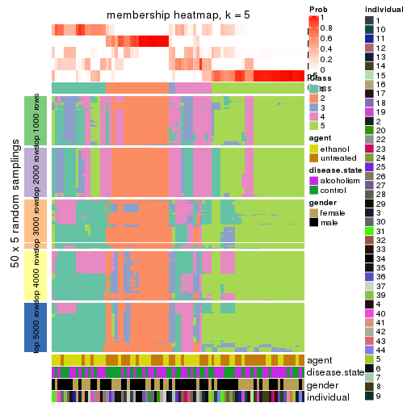</p>

</div>
<div id='tab-ATC-mclust-membership-heatmap-5'>
<pre><code class="r">membership_heatmap(res, k = 6)
</code></pre>

<p></p>

</div>
</div>

As soon as we have had the classes for columns, we can look for signatures
which are significantly different between classes which can be candidate marks
for certain classes. Following are the heatmaps for signatures.


Signature heatmaps where rows are scaled:


<script>
$( function() {
	$( '#tabs-ATC-mclust-get-signatures' ).tabs();
} );
</script>
<div id='tabs-ATC-mclust-get-signatures'>
<ul>
<li><a href='#tab-ATC-mclust-get-signatures-1'>k = 2</a></li>
<li><a href='#tab-ATC-mclust-get-signatures-2'>k = 3</a></li>
<li><a href='#tab-ATC-mclust-get-signatures-3'>k = 4</a></li>
<li><a href='#tab-ATC-mclust-get-signatures-4'>k = 5</a></li>
<li><a href='#tab-ATC-mclust-get-signatures-5'>k = 6</a></li>
</ul>
<div id='tab-ATC-mclust-get-signatures-1'>
<pre><code class="r">get_signatures(res, k = 2)
</code></pre>

<p></p>

</div>
<div id='tab-ATC-mclust-get-signatures-2'>
<pre><code class="r">get_signatures(res, k = 3)
</code></pre>

<p></p>

</div>
<div id='tab-ATC-mclust-get-signatures-3'>
<pre><code class="r">get_signatures(res, k = 4)
</code></pre>

<p></p>

</div>
<div id='tab-ATC-mclust-get-signatures-4'>
<pre><code class="r">get_signatures(res, k = 5)
</code></pre>

<p></p>

</div>
<div id='tab-ATC-mclust-get-signatures-5'>
<pre><code class="r">get_signatures(res, k = 6)
</code></pre>

<p></p>

</div>
</div>


Signature heatmaps where rows are not scaled:


<script>
$( function() {
	$( '#tabs-ATC-mclust-get-signatures-no-scale' ).tabs();
} );
</script>
<div id='tabs-ATC-mclust-get-signatures-no-scale'>
<ul>
<li><a href='#tab-ATC-mclust-get-signatures-no-scale-1'>k = 2</a></li>
<li><a href='#tab-ATC-mclust-get-signatures-no-scale-2'>k = 3</a></li>
<li><a href='#tab-ATC-mclust-get-signatures-no-scale-3'>k = 4</a></li>
<li><a href='#tab-ATC-mclust-get-signatures-no-scale-4'>k = 5</a></li>
<li><a href='#tab-ATC-mclust-get-signatures-no-scale-5'>k = 6</a></li>
</ul>
<div id='tab-ATC-mclust-get-signatures-no-scale-1'>
<pre><code class="r">get_signatures(res, k = 2, scale_rows = FALSE)
</code></pre>

<p></p>

</div>
<div id='tab-ATC-mclust-get-signatures-no-scale-2'>
<pre><code class="r">get_signatures(res, k = 3, scale_rows = FALSE)
</code></pre>

<p>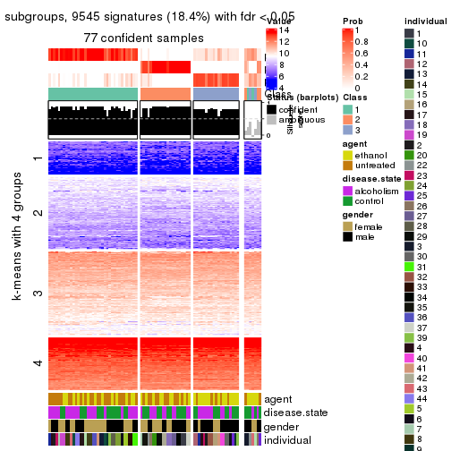</p>

</div>
<div id='tab-ATC-mclust-get-signatures-no-scale-3'>
<pre><code class="r">get_signatures(res, k = 4, scale_rows = FALSE)
</code></pre>

<p></p>

</div>
<div id='tab-ATC-mclust-get-signatures-no-scale-4'>
<pre><code class="r">get_signatures(res, k = 5, scale_rows = FALSE)
</code></pre>

<p></p>

</div>
<div id='tab-ATC-mclust-get-signatures-no-scale-5'>
<pre><code class="r">get_signatures(res, k = 6, scale_rows = FALSE)
</code></pre>

<p></p>

</div>
</div>


Compare the overlap of signatures from different k:

```r
compare_signatures(res)
```


`get_signature()` returns a data frame invisibly. TO get the list of signatures, the function
call should be assigned to a variable explicitly. In following code, if `plot` argument is set
to `FALSE`, no heatmap is plotted while only the differential analysis is performed.

```r
# code only for demonstration
tb = get_signature(res, k = ..., plot = FALSE)
```

An example of the output of `tb` is:

```
#>   which_row         fdr    mean_1    mean_2 scaled_mean_1 scaled_mean_2 km
#> 1        38 0.042760348  8.373488  9.131774    -0.5533452     0.5164555  1
#> 2        40 0.018707592  7.106213  8.469186    -0.6173731     0.5762149  1
#> 3        55 0.019134737 10.221463 11.207825    -0.6159697     0.5749050  1
#> 4        59 0.006059896  5.921854  7.869574    -0.6899429     0.6439467  1
#> 5        60 0.018055526  8.928898 10.211722    -0.6204761     0.5791110  1
#> 6        98 0.009384629 15.714769 14.887706     0.6635654    -0.6193277  2
...
```

The columns in `tb` are:

1. `which_row`: row indices corresponding to the input matrix.
2. `fdr`: FDR for the differential test. 
3. `mean_x`: The mean value in group x.
4. `scaled_mean_x`: The mean value in group x after rows are scaled.
5. `km`: Row groups if k-means clustering is applied to rows.


UMAP plot which shows how samples are separated.


<script>
$( function() {
	$( '#tabs-ATC-mclust-dimension-reduction' ).tabs();
} );
</script>
<div id='tabs-ATC-mclust-dimension-reduction'>
<ul>
<li><a href='#tab-ATC-mclust-dimension-reduction-1'>k = 2</a></li>
<li><a href='#tab-ATC-mclust-dimension-reduction-2'>k = 3</a></li>
<li><a href='#tab-ATC-mclust-dimension-reduction-3'>k = 4</a></li>
<li><a href='#tab-ATC-mclust-dimension-reduction-4'>k = 5</a></li>
<li><a href='#tab-ATC-mclust-dimension-reduction-5'>k = 6</a></li>
</ul>
<div id='tab-ATC-mclust-dimension-reduction-1'>
<pre><code class="r">dimension_reduction(res, k = 2, method = &quot;UMAP&quot;)
</code></pre>

<p></p>

</div>
<div id='tab-ATC-mclust-dimension-reduction-2'>
<pre><code class="r">dimension_reduction(res, k = 3, method = &quot;UMAP&quot;)
</code></pre>

<p></p>

</div>
<div id='tab-ATC-mclust-dimension-reduction-3'>
<pre><code class="r">dimension_reduction(res, k = 4, method = &quot;UMAP&quot;)
</code></pre>

<p></p>

</div>
<div id='tab-ATC-mclust-dimension-reduction-4'>
<pre><code class="r">dimension_reduction(res, k = 5, method = &quot;UMAP&quot;)
</code></pre>

<p></p>

</div>
<div id='tab-ATC-mclust-dimension-reduction-5'>
<pre><code class="r">dimension_reduction(res, k = 6, method = &quot;UMAP&quot;)
</code></pre>

<p></p>

</div>
</div>


Following heatmap shows how subgroups are split when increasing `k`:

```r
collect_classes(res)
```


Test correlation between subgroups and known annotations. If the known
annotation is numeric, one-way ANOVA test is applied, and if the known
annotation is discrete, chi-squared contingency table test is applied.

```r
test_to_known_factors(res)
```

```
#>             n agent(p) disease.state(p) gender(p) individual(p) k
#> ATC:mclust 82   1.0000            1.000     0.659      0.000327 2
#> ATC:mclust 77   0.0238            0.719     0.065      0.000703 3
#> ATC:mclust 55   0.0352            0.766     0.145      0.007509 4
#> ATC:mclust 39   0.1608            0.794     0.753      0.011297 5
#> ATC:mclust 55   0.0105            0.250     0.194      0.001276 6
```


If matrix rows can be associated to genes, consider to use `GO_Enrichment(res,
...)` to perform function enrichment for the signature genes.


 

---------------------------------------------------


### ATC:NMF**


The object with results only for a single top-value method and a single partition method 
can be extracted as:

```r
res = res_list["ATC", "NMF"]
# you can also extract it by
# res = res_list["ATC:NMF"]
```

A summary of `res` and all the functions that can be applied to it:

```r
res
```

```
#> A 'ConsensusPartition' object with k = 2, 3, 4, 5, 6.
#>   On a matrix with 51941 rows and 84 columns.
#>   Top rows (1000, 2000, 3000, 4000, 5000) are extracted by 'ATC' method.
#>   Subgroups are detected by 'NMF' method.
#>   Performed in total 1250 partitions by row resampling.
#>   Best k for subgroups seems to be 2.
#> 
#> Following methods can be applied to this 'ConsensusPartition' object:
#>  [1] "cola_report"             "collect_classes"         "collect_plots"          
#>  [4] "collect_stats"           "colnames"                "compare_signatures"     
#>  [7] "consensus_heatmap"       "dimension_reduction"     "functional_enrichment"  
#> [10] "get_anno_col"            "get_anno"                "get_classes"            
#> [13] "get_consensus"           "get_matrix"              "get_membership"         
#> [16] "get_param"               "get_signatures"          "get_stats"              
#> [19] "is_best_k"               "is_stable_k"             "membership_heatmap"     
#> [22] "ncol"                    "nrow"                    "plot_ecdf"              
#> [25] "rownames"                "select_partition_number" "show"                   
#> [28] "suggest_best_k"          "test_to_known_factors"
```

`collect_plots()` function collects all the plots made from `res` for all `k` (number of partitions)
into one single page to provide an easy and fast comparison between different `k`.

```r
collect_plots(res)
```


The plots are:

- The first row: a plot of the ECDF (Empirical cumulative distribution
  function) curves of the consensus matrix for each `k` and the heatmap of
  predicted classes for each `k`.
- The second row: heatmaps of the consensus matrix for each `k`.
- The third row: heatmaps of the membership matrix for each `k`.
- The fouth row: heatmaps of the signatures for each `k`.

All the plots in panels can be made by individual functions and they are
plotted later in this section.

`select_partition_number()` produces several plots showing different
statistics for choosing "optimized" `k`. There are following statistics:

- ECDF curves of the consensus matrix for each `k`;
- 1-PAC. [The PAC
  score](https://en.wikipedia.org/wiki/Consensus_clustering#Over-interpretation_potential_of_consensus_clustering)
  measures the proportion of the ambiguous subgrouping.
- Mean silhouette score.
- Concordance. The mean probability of fiting the consensus class ids in all
  partitions.
- Area increased. Denote $A_k$ as the area under the ECDF curve for current
  `k`, the area increased is defined as $A_k - A_{k-1}$.
- Rand index. The percent of pairs of samples that are both in a same cluster
  or both are not in a same cluster in the partition of k and k-1.
- Jaccard index. The ratio of pairs of samples are both in a same cluster in
  the partition of k and k-1 and the pairs of samples are both in a same
  cluster in the partition k or k-1.

The detailed explanations of these statistics can be found in [the cola
vignette](http://bioconductor.org/packages/devel/bioc/vignettes/cola/inst/doc/cola.html#toc_13).

Generally speaking, lower PAC score, higher mean silhouette score or higher
concordance corresponds to better partition. Rand index and Jaccard index
measure how similar the current partition is compared to partition with `k-1`.
If they are too similar, we won't accept `k` is better than `k-1`.

```r
select_partition_number(res)
```


The numeric values for all these statistics can be obtained by `get_stats()`.

```r
get_stats(res)
```

```
#>   k 1-PAC mean_silhouette concordance area_increased  Rand Jaccard
#> 2 2 0.950           0.937       0.974         0.4792 0.523   0.523
#> 3 3 0.667           0.749       0.891         0.3920 0.677   0.451
#> 4 4 0.449           0.482       0.719         0.1214 0.764   0.419
#> 5 5 0.502           0.410       0.662         0.0660 0.838   0.462
#> 6 6 0.542           0.362       0.623         0.0416 0.826   0.368
```

`suggest_best_k()` suggests the best $k$ based on these statistics. The rules are as follows:

- All $k$ with Jaccard index larger than 0.95 are removed because the increase of
  the partition number does not provides enough extra information. If all $k$ are removed,
  the best $k$ is assigned by `NA`.
- For $k$ with 1-PAC larger than 0.9, the maximal $k$ is taken as the "best k". Other $k$ is called "optional k".
- If it does not fit the second rule. The $k$ with the highest vote of highest
  1-PAC, mean silhouette and concordance is taken as the "best k".

```r
suggest_best_k(res)
```

```
#> [1] 2
```


Following shows the table of the partitions (You need to click the **show/hide
code output** link to see it). The membership matrix (columns with name `p*`)
is inferred by
[`clue::cl_consensus()`](https://www.rdocumentation.org/link/cl_consensus?package=clue)
function with the `SE` method. Basically the value in the membership matrix
represents the probability to belong to a certain group. The finall class
label for an item is determined with the group with highest probability it
belongs to.

In `get_classes()` function, the entropy is calculated from the membership
matrix and the silhouette score is calculated from the consensus matrix.


<script>
$( function() {
	$( '#tabs-ATC-NMF-get-classes' ).tabs();
} );
</script>
<div id='tabs-ATC-NMF-get-classes'>
<ul>
<li><a href='#tab-ATC-NMF-get-classes-1'>k = 2</a></li>
<li><a href='#tab-ATC-NMF-get-classes-2'>k = 3</a></li>
<li><a href='#tab-ATC-NMF-get-classes-3'>k = 4</a></li>
<li><a href='#tab-ATC-NMF-get-classes-4'>k = 5</a></li>
<li><a href='#tab-ATC-NMF-get-classes-5'>k = 6</a></li>
</ul>

<div id='tab-ATC-NMF-get-classes-1'>
<p><a id='tab-ATC-NMF-get-classes-1-a' style='color:#0366d6' href='#'>show/hide code output</a></p>
<pre><code class="r">cbind(get_classes(res, k = 2), get_membership(res, k = 2))
</code></pre>

<pre><code>#&gt;            class entropy silhouette    p1    p2
#&gt; GSM1269647     2  0.0000      0.974 0.000 1.000
#&gt; GSM1269655     1  0.0000      0.971 1.000 0.000
#&gt; GSM1269663     2  0.0000      0.974 0.000 1.000
#&gt; GSM1269671     2  0.0000      0.974 0.000 1.000
#&gt; GSM1269679     1  0.7745      0.708 0.772 0.228
#&gt; GSM1269693     1  0.0000      0.971 1.000 0.000
#&gt; GSM1269701     1  0.0000      0.971 1.000 0.000
#&gt; GSM1269709     1  0.0000      0.971 1.000 0.000
#&gt; GSM1269715     1  0.0000      0.971 1.000 0.000
#&gt; GSM1269717     1  0.5629      0.841 0.868 0.132
#&gt; GSM1269721     1  0.0000      0.971 1.000 0.000
#&gt; GSM1269723     2  0.0000      0.974 0.000 1.000
#&gt; GSM1269645     2  0.0000      0.974 0.000 1.000
#&gt; GSM1269653     1  0.0000      0.971 1.000 0.000
#&gt; GSM1269661     2  0.0000      0.974 0.000 1.000
#&gt; GSM1269669     1  0.0000      0.971 1.000 0.000
#&gt; GSM1269677     2  0.0000      0.974 0.000 1.000
#&gt; GSM1269685     1  0.0000      0.971 1.000 0.000
#&gt; GSM1269691     1  0.0000      0.971 1.000 0.000
#&gt; GSM1269699     1  0.0000      0.971 1.000 0.000
#&gt; GSM1269707     1  0.0000      0.971 1.000 0.000
#&gt; GSM1269651     2  0.0000      0.974 0.000 1.000
#&gt; GSM1269659     1  0.0000      0.971 1.000 0.000
#&gt; GSM1269667     2  0.0000      0.974 0.000 1.000
#&gt; GSM1269675     1  0.2603      0.934 0.956 0.044
#&gt; GSM1269683     2  0.3114      0.928 0.056 0.944
#&gt; GSM1269689     1  0.0000      0.971 1.000 0.000
#&gt; GSM1269697     1  0.0000      0.971 1.000 0.000
#&gt; GSM1269705     1  0.0000      0.971 1.000 0.000
#&gt; GSM1269713     1  0.0000      0.971 1.000 0.000
#&gt; GSM1269719     2  0.2236      0.946 0.036 0.964
#&gt; GSM1269725     1  0.0000      0.971 1.000 0.000
#&gt; GSM1269727     1  0.6438      0.801 0.836 0.164
#&gt; GSM1269649     2  0.0000      0.974 0.000 1.000
#&gt; GSM1269657     1  0.0000      0.971 1.000 0.000
#&gt; GSM1269665     2  0.0000      0.974 0.000 1.000
#&gt; GSM1269673     1  0.2423      0.938 0.960 0.040
#&gt; GSM1269681     2  0.0000      0.974 0.000 1.000
#&gt; GSM1269687     1  0.0376      0.968 0.996 0.004
#&gt; GSM1269695     1  0.0000      0.971 1.000 0.000
#&gt; GSM1269703     1  0.0000      0.971 1.000 0.000
#&gt; GSM1269711     1  0.0000      0.971 1.000 0.000
#&gt; GSM1269646     2  0.0000      0.974 0.000 1.000
#&gt; GSM1269654     1  0.0000      0.971 1.000 0.000
#&gt; GSM1269662     2  0.0000      0.974 0.000 1.000
#&gt; GSM1269670     2  0.0000      0.974 0.000 1.000
#&gt; GSM1269678     1  0.0000      0.971 1.000 0.000
#&gt; GSM1269692     1  0.0000      0.971 1.000 0.000
#&gt; GSM1269700     1  0.0000      0.971 1.000 0.000
#&gt; GSM1269708     1  0.0000      0.971 1.000 0.000
#&gt; GSM1269714     1  0.0000      0.971 1.000 0.000
#&gt; GSM1269716     1  0.0000      0.971 1.000 0.000
#&gt; GSM1269720     2  0.9881      0.196 0.436 0.564
#&gt; GSM1269722     1  0.9775      0.310 0.588 0.412
#&gt; GSM1269644     2  0.0000      0.974 0.000 1.000
#&gt; GSM1269652     1  0.0000      0.971 1.000 0.000
#&gt; GSM1269660     2  0.0000      0.974 0.000 1.000
#&gt; GSM1269668     1  0.0000      0.971 1.000 0.000
#&gt; GSM1269676     2  0.5946      0.825 0.144 0.856
#&gt; GSM1269684     1  0.0000      0.971 1.000 0.000
#&gt; GSM1269690     1  0.0000      0.971 1.000 0.000
#&gt; GSM1269698     1  0.0000      0.971 1.000 0.000
#&gt; GSM1269706     1  0.0000      0.971 1.000 0.000
#&gt; GSM1269650     2  0.0000      0.974 0.000 1.000
#&gt; GSM1269658     1  0.9580      0.398 0.620 0.380
#&gt; GSM1269666     2  0.0000      0.974 0.000 1.000
#&gt; GSM1269674     1  0.0000      0.971 1.000 0.000
#&gt; GSM1269682     2  0.0000      0.974 0.000 1.000
#&gt; GSM1269688     1  0.0000      0.971 1.000 0.000
#&gt; GSM1269696     1  0.0938      0.962 0.988 0.012
#&gt; GSM1269704     1  0.0000      0.971 1.000 0.000
#&gt; GSM1269712     2  0.0000      0.974 0.000 1.000
#&gt; GSM1269718     2  0.1184      0.962 0.016 0.984
#&gt; GSM1269724     2  0.4161      0.899 0.084 0.916
#&gt; GSM1269726     2  0.0000      0.974 0.000 1.000
#&gt; GSM1269648     2  0.0000      0.974 0.000 1.000
#&gt; GSM1269656     1  0.0000      0.971 1.000 0.000
#&gt; GSM1269664     2  0.0000      0.974 0.000 1.000
#&gt; GSM1269672     1  0.0000      0.971 1.000 0.000
#&gt; GSM1269680     2  0.0000      0.974 0.000 1.000
#&gt; GSM1269686     1  0.0000      0.971 1.000 0.000
#&gt; GSM1269694     1  0.0000      0.971 1.000 0.000
#&gt; GSM1269702     1  0.0000      0.971 1.000 0.000
#&gt; GSM1269710     2  0.0000      0.974 0.000 1.000
</code></pre>

<script>
$('#tab-ATC-NMF-get-classes-1-a').parent().next().next().hide();
$('#tab-ATC-NMF-get-classes-1-a').click(function(){
  $('#tab-ATC-NMF-get-classes-1-a').parent().next().next().toggle();
  return(false);
});
</script>
</div>

<div id='tab-ATC-NMF-get-classes-2'>
<p><a id='tab-ATC-NMF-get-classes-2-a' style='color:#0366d6' href='#'>show/hide code output</a></p>
<pre><code class="r">cbind(get_classes(res, k = 3), get_membership(res, k = 3))
</code></pre>

<pre><code>#&gt;            class entropy silhouette    p1    p2    p3
#&gt; GSM1269647     2  0.3038     0.8362 0.104 0.896 0.000
#&gt; GSM1269655     1  0.1753     0.8101 0.952 0.000 0.048
#&gt; GSM1269663     2  0.0424     0.9195 0.000 0.992 0.008
#&gt; GSM1269671     2  0.0237     0.9196 0.004 0.996 0.000
#&gt; GSM1269679     3  0.1411     0.8723 0.000 0.036 0.964
#&gt; GSM1269693     3  0.0424     0.8884 0.008 0.000 0.992
#&gt; GSM1269701     3  0.1529     0.8745 0.040 0.000 0.960
#&gt; GSM1269709     3  0.1529     0.8744 0.040 0.000 0.960
#&gt; GSM1269715     3  0.0237     0.8852 0.000 0.004 0.996
#&gt; GSM1269717     3  0.1170     0.8854 0.008 0.016 0.976
#&gt; GSM1269721     3  0.0000     0.8867 0.000 0.000 1.000
#&gt; GSM1269723     2  0.4750     0.7159 0.000 0.784 0.216
#&gt; GSM1269645     2  0.0424     0.9195 0.000 0.992 0.008
#&gt; GSM1269653     3  0.0424     0.8884 0.008 0.000 0.992
#&gt; GSM1269661     2  0.0237     0.9196 0.004 0.996 0.000
#&gt; GSM1269669     3  0.5363     0.6078 0.276 0.000 0.724
#&gt; GSM1269677     2  0.0424     0.9195 0.000 0.992 0.008
#&gt; GSM1269685     3  0.3816     0.7857 0.148 0.000 0.852
#&gt; GSM1269691     1  0.6168     0.2791 0.588 0.000 0.412
#&gt; GSM1269699     1  0.1860     0.8072 0.948 0.000 0.052
#&gt; GSM1269707     3  0.0424     0.8884 0.008 0.000 0.992
#&gt; GSM1269651     2  0.0424     0.9186 0.008 0.992 0.000
#&gt; GSM1269659     3  0.0424     0.8884 0.008 0.000 0.992
#&gt; GSM1269667     2  0.0747     0.9150 0.016 0.984 0.000
#&gt; GSM1269675     3  0.0424     0.8843 0.000 0.008 0.992
#&gt; GSM1269683     3  0.4702     0.6784 0.000 0.212 0.788
#&gt; GSM1269689     3  0.0000     0.8867 0.000 0.000 1.000
#&gt; GSM1269697     1  0.1289     0.8177 0.968 0.000 0.032
#&gt; GSM1269705     1  0.0237     0.8248 0.996 0.000 0.004
#&gt; GSM1269713     3  0.0424     0.8884 0.008 0.000 0.992
#&gt; GSM1269719     2  0.6260     0.1217 0.448 0.552 0.000
#&gt; GSM1269725     1  0.4887     0.6411 0.772 0.000 0.228
#&gt; GSM1269727     3  0.1163     0.8750 0.000 0.028 0.972
#&gt; GSM1269649     2  0.0747     0.9150 0.016 0.984 0.000
#&gt; GSM1269657     1  0.6126     0.3142 0.600 0.000 0.400
#&gt; GSM1269665     2  0.0424     0.9195 0.000 0.992 0.008
#&gt; GSM1269673     1  0.6617     0.2146 0.556 0.008 0.436
#&gt; GSM1269681     2  0.0424     0.9195 0.000 0.992 0.008
#&gt; GSM1269687     1  0.0237     0.8248 0.996 0.000 0.004
#&gt; GSM1269695     1  0.6309    -0.0205 0.500 0.000 0.500
#&gt; GSM1269703     3  0.0424     0.8884 0.008 0.000 0.992
#&gt; GSM1269711     3  0.0424     0.8884 0.008 0.000 0.992
#&gt; GSM1269646     2  0.0747     0.9144 0.016 0.984 0.000
#&gt; GSM1269654     1  0.0237     0.8248 0.996 0.000 0.004
#&gt; GSM1269662     2  0.0424     0.9195 0.000 0.992 0.008
#&gt; GSM1269670     2  0.0237     0.9196 0.004 0.996 0.000
#&gt; GSM1269678     1  0.0237     0.8229 0.996 0.004 0.000
#&gt; GSM1269692     3  0.6045     0.3795 0.380 0.000 0.620
#&gt; GSM1269700     3  0.5363     0.6102 0.276 0.000 0.724
#&gt; GSM1269708     1  0.6062     0.3596 0.616 0.000 0.384
#&gt; GSM1269714     3  0.3551     0.8015 0.132 0.000 0.868
#&gt; GSM1269716     3  0.6008     0.4058 0.372 0.000 0.628
#&gt; GSM1269720     3  0.2878     0.8226 0.000 0.096 0.904
#&gt; GSM1269722     3  0.5327     0.5845 0.000 0.272 0.728
#&gt; GSM1269644     1  0.6204     0.2231 0.576 0.424 0.000
#&gt; GSM1269652     1  0.0424     0.8242 0.992 0.000 0.008
#&gt; GSM1269660     2  0.0237     0.9196 0.004 0.996 0.000
#&gt; GSM1269668     1  0.0237     0.8248 0.996 0.000 0.004
#&gt; GSM1269676     1  0.3619     0.7406 0.864 0.136 0.000
#&gt; GSM1269684     3  0.5363     0.6138 0.276 0.000 0.724
#&gt; GSM1269690     1  0.0747     0.8221 0.984 0.000 0.016
#&gt; GSM1269698     1  0.0237     0.8248 0.996 0.000 0.004
#&gt; GSM1269706     3  0.0424     0.8884 0.008 0.000 0.992
#&gt; GSM1269650     2  0.2959     0.8405 0.100 0.900 0.000
#&gt; GSM1269658     3  0.0747     0.8812 0.000 0.016 0.984
#&gt; GSM1269666     1  0.5363     0.5548 0.724 0.276 0.000
#&gt; GSM1269674     1  0.6307     0.0280 0.512 0.000 0.488
#&gt; GSM1269682     2  0.0592     0.9178 0.000 0.988 0.012
#&gt; GSM1269688     3  0.0592     0.8872 0.012 0.000 0.988
#&gt; GSM1269696     1  0.1950     0.8141 0.952 0.008 0.040
#&gt; GSM1269704     1  0.0237     0.8229 0.996 0.004 0.000
#&gt; GSM1269712     2  0.0424     0.9193 0.000 0.992 0.008
#&gt; GSM1269718     1  0.5810     0.4701 0.664 0.336 0.000
#&gt; GSM1269724     1  0.6341     0.5031 0.672 0.312 0.016
#&gt; GSM1269726     2  0.6192     0.2957 0.000 0.580 0.420
#&gt; GSM1269648     1  0.3192     0.7565 0.888 0.112 0.000
#&gt; GSM1269656     1  0.0237     0.8248 0.996 0.000 0.004
#&gt; GSM1269664     2  0.0237     0.9196 0.004 0.996 0.000
#&gt; GSM1269672     1  0.0424     0.8214 0.992 0.008 0.000
#&gt; GSM1269680     1  0.2796     0.7723 0.908 0.092 0.000
#&gt; GSM1269686     1  0.0237     0.8248 0.996 0.000 0.004
#&gt; GSM1269694     1  0.1411     0.8157 0.964 0.000 0.036
#&gt; GSM1269702     1  0.0237     0.8248 0.996 0.000 0.004
#&gt; GSM1269710     2  0.4178     0.7746 0.000 0.828 0.172
</code></pre>

<script>
$('#tab-ATC-NMF-get-classes-2-a').parent().next().next().hide();
$('#tab-ATC-NMF-get-classes-2-a').click(function(){
  $('#tab-ATC-NMF-get-classes-2-a').parent().next().next().toggle();
  return(false);
});
</script>
</div>

<div id='tab-ATC-NMF-get-classes-3'>
<p><a id='tab-ATC-NMF-get-classes-3-a' style='color:#0366d6' href='#'>show/hide code output</a></p>
<pre><code class="r">cbind(get_classes(res, k = 4), get_membership(res, k = 4))
</code></pre>

<pre><code>#&gt;            class entropy silhouette    p1    p2    p3    p4
#&gt; GSM1269647     2  0.3378    0.75596 0.060 0.884 0.012 0.044
#&gt; GSM1269655     1  0.5168   -0.01957 0.500 0.000 0.004 0.496
#&gt; GSM1269663     2  0.6295    0.61317 0.000 0.616 0.296 0.088
#&gt; GSM1269671     2  0.4185    0.74454 0.044 0.852 0.060 0.044
#&gt; GSM1269679     3  0.6623    0.58096 0.264 0.048 0.644 0.044
#&gt; GSM1269693     3  0.6065    0.68183 0.176 0.000 0.684 0.140
#&gt; GSM1269701     1  0.5530    0.07774 0.632 0.000 0.336 0.032
#&gt; GSM1269709     1  0.5768   -0.27454 0.516 0.000 0.456 0.028
#&gt; GSM1269715     3  0.4720    0.67270 0.264 0.000 0.720 0.016
#&gt; GSM1269717     3  0.7675    0.51989 0.344 0.072 0.524 0.060
#&gt; GSM1269721     3  0.4300    0.70927 0.088 0.000 0.820 0.092
#&gt; GSM1269723     3  0.4410    0.56209 0.012 0.144 0.812 0.032
#&gt; GSM1269645     2  0.4509    0.66636 0.000 0.708 0.288 0.004
#&gt; GSM1269653     1  0.5407   -0.33882 0.504 0.000 0.484 0.012
#&gt; GSM1269661     2  0.1411    0.77986 0.000 0.960 0.020 0.020
#&gt; GSM1269669     4  0.7822    0.00489 0.364 0.000 0.256 0.380
#&gt; GSM1269677     2  0.7431    0.44493 0.004 0.532 0.268 0.196
#&gt; GSM1269685     4  0.5184    0.49231 0.056 0.000 0.212 0.732
#&gt; GSM1269691     4  0.5478    0.45175 0.248 0.000 0.056 0.696
#&gt; GSM1269699     1  0.1302    0.56596 0.956 0.000 0.000 0.044
#&gt; GSM1269707     3  0.4983    0.66774 0.272 0.000 0.704 0.024
#&gt; GSM1269651     2  0.4758    0.73459 0.000 0.780 0.156 0.064
#&gt; GSM1269659     3  0.4595    0.64600 0.040 0.000 0.776 0.184
#&gt; GSM1269667     2  0.3255    0.76364 0.048 0.892 0.016 0.044
#&gt; GSM1269675     3  0.1182    0.69795 0.016 0.000 0.968 0.016
#&gt; GSM1269683     3  0.2124    0.66146 0.000 0.068 0.924 0.008
#&gt; GSM1269689     3  0.4647    0.65387 0.288 0.000 0.704 0.008
#&gt; GSM1269697     1  0.2644    0.57170 0.916 0.044 0.032 0.008
#&gt; GSM1269705     1  0.5137    0.39509 0.716 0.040 0.000 0.244
#&gt; GSM1269713     1  0.5358    0.37234 0.736 0.020 0.212 0.032
#&gt; GSM1269719     2  0.5619    0.51952 0.268 0.676 0.000 0.056
#&gt; GSM1269725     1  0.4456    0.53805 0.804 0.148 0.044 0.004
#&gt; GSM1269727     3  0.1940    0.71326 0.076 0.000 0.924 0.000
#&gt; GSM1269649     2  0.5085    0.75435 0.036 0.796 0.116 0.052
#&gt; GSM1269657     4  0.3616    0.55303 0.036 0.000 0.112 0.852
#&gt; GSM1269665     2  0.2773    0.76741 0.000 0.880 0.116 0.004
#&gt; GSM1269673     4  0.6505    0.28884 0.064 0.008 0.356 0.572
#&gt; GSM1269681     2  0.3581    0.75939 0.000 0.852 0.116 0.032
#&gt; GSM1269687     1  0.6586    0.02459 0.500 0.080 0.000 0.420
#&gt; GSM1269695     1  0.3009    0.55126 0.892 0.000 0.056 0.052
#&gt; GSM1269703     1  0.4682    0.41361 0.764 0.008 0.208 0.020
#&gt; GSM1269711     3  0.4993    0.66710 0.244 0.008 0.728 0.020
#&gt; GSM1269646     2  0.1624    0.77261 0.028 0.952 0.000 0.020
#&gt; GSM1269654     4  0.5987    0.03812 0.440 0.040 0.000 0.520
#&gt; GSM1269662     2  0.4262    0.70393 0.000 0.756 0.236 0.008
#&gt; GSM1269670     2  0.2368    0.77197 0.032 0.928 0.008 0.032
#&gt; GSM1269678     1  0.6240    0.39393 0.664 0.200 0.000 0.136
#&gt; GSM1269692     4  0.7081    0.19825 0.352 0.000 0.136 0.512
#&gt; GSM1269700     1  0.3198    0.54793 0.884 0.004 0.080 0.032
#&gt; GSM1269708     1  0.2413    0.56053 0.916 0.000 0.020 0.064
#&gt; GSM1269714     3  0.7488    0.29461 0.180 0.000 0.436 0.384
#&gt; GSM1269716     1  0.5961    0.29578 0.656 0.008 0.052 0.284
#&gt; GSM1269720     3  0.3529    0.65499 0.012 0.068 0.876 0.044
#&gt; GSM1269722     1  0.7189    0.26403 0.604 0.136 0.240 0.020
#&gt; GSM1269644     4  0.5649    0.41107 0.044 0.280 0.004 0.672
#&gt; GSM1269652     4  0.4730    0.29473 0.364 0.000 0.000 0.636
#&gt; GSM1269660     2  0.0376    0.77782 0.000 0.992 0.004 0.004
#&gt; GSM1269668     4  0.4741    0.36791 0.328 0.004 0.000 0.668
#&gt; GSM1269676     4  0.7538    0.23800 0.112 0.352 0.024 0.512
#&gt; GSM1269684     4  0.4524    0.50027 0.028 0.000 0.204 0.768
#&gt; GSM1269690     4  0.2973    0.52780 0.144 0.000 0.000 0.856
#&gt; GSM1269698     1  0.3320    0.55034 0.876 0.068 0.000 0.056
#&gt; GSM1269706     3  0.6773    0.63124 0.284 0.000 0.584 0.132
#&gt; GSM1269650     2  0.3113    0.74279 0.004 0.876 0.012 0.108
#&gt; GSM1269658     3  0.5827    0.40341 0.000 0.052 0.632 0.316
#&gt; GSM1269666     2  0.5006    0.65654 0.104 0.772 0.000 0.124
#&gt; GSM1269674     4  0.4542    0.49454 0.020 0.004 0.208 0.768
#&gt; GSM1269682     2  0.4238    0.73711 0.000 0.796 0.176 0.028
#&gt; GSM1269688     3  0.5731    0.43538 0.428 0.000 0.544 0.028
#&gt; GSM1269696     1  0.4579    0.41818 0.720 0.272 0.004 0.004
#&gt; GSM1269704     1  0.5966    0.32363 0.648 0.072 0.000 0.280
#&gt; GSM1269712     2  0.5199    0.67501 0.152 0.776 0.044 0.028
#&gt; GSM1269718     2  0.6340    0.17439 0.408 0.528 0.000 0.064
#&gt; GSM1269724     1  0.5460    0.38605 0.660 0.312 0.016 0.012
#&gt; GSM1269726     3  0.5125    0.66952 0.108 0.076 0.792 0.024
#&gt; GSM1269648     4  0.7158    0.25747 0.148 0.340 0.000 0.512
#&gt; GSM1269656     4  0.2281    0.54162 0.096 0.000 0.000 0.904
#&gt; GSM1269664     2  0.1284    0.77449 0.000 0.964 0.012 0.024
#&gt; GSM1269672     4  0.5277    0.38675 0.304 0.028 0.000 0.668
#&gt; GSM1269680     4  0.6558   -0.02946 0.076 0.452 0.000 0.472
#&gt; GSM1269686     1  0.5668    0.31743 0.652 0.048 0.000 0.300
#&gt; GSM1269694     1  0.3494    0.50336 0.824 0.000 0.004 0.172
#&gt; GSM1269702     1  0.4994    0.00984 0.520 0.000 0.000 0.480
#&gt; GSM1269710     2  0.7699    0.40418 0.144 0.568 0.252 0.036
</code></pre>

<script>
$('#tab-ATC-NMF-get-classes-3-a').parent().next().next().hide();
$('#tab-ATC-NMF-get-classes-3-a').click(function(){
  $('#tab-ATC-NMF-get-classes-3-a').parent().next().next().toggle();
  return(false);
});
</script>
</div>

<div id='tab-ATC-NMF-get-classes-4'>
<p><a id='tab-ATC-NMF-get-classes-4-a' style='color:#0366d6' href='#'>show/hide code output</a></p>
<pre><code class="r">cbind(get_classes(res, k = 5), get_membership(res, k = 5))
</code></pre>

<pre><code>#&gt;            class entropy silhouette    p1    p2    p3    p4    p5
#&gt; GSM1269647     2  0.4904     0.3778 0.368 0.604 0.008 0.020 0.000
#&gt; GSM1269655     5  0.4567     0.3213 0.012 0.000 0.356 0.004 0.628
#&gt; GSM1269663     2  0.6975     0.2838 0.256 0.440 0.000 0.292 0.012
#&gt; GSM1269671     1  0.6843    -0.0138 0.464 0.392 0.080 0.064 0.000
#&gt; GSM1269679     1  0.5755     0.1491 0.588 0.032 0.044 0.336 0.000
#&gt; GSM1269693     4  0.4673     0.4764 0.004 0.000 0.052 0.716 0.228
#&gt; GSM1269701     1  0.6595     0.2032 0.500 0.000 0.304 0.188 0.008
#&gt; GSM1269709     4  0.7029     0.0662 0.348 0.000 0.284 0.360 0.008
#&gt; GSM1269715     4  0.4449     0.5728 0.004 0.000 0.288 0.688 0.020
#&gt; GSM1269717     3  0.7593    -0.0325 0.004 0.052 0.424 0.328 0.192
#&gt; GSM1269721     4  0.4149     0.5272 0.004 0.000 0.040 0.768 0.188
#&gt; GSM1269723     4  0.4664     0.5598 0.100 0.064 0.052 0.784 0.000
#&gt; GSM1269645     2  0.6162     0.4190 0.160 0.532 0.000 0.308 0.000
#&gt; GSM1269653     3  0.5812    -0.3211 0.092 0.000 0.476 0.432 0.000
#&gt; GSM1269661     2  0.3355     0.6507 0.132 0.832 0.000 0.036 0.000
#&gt; GSM1269669     1  0.2734     0.5214 0.888 0.000 0.028 0.076 0.008
#&gt; GSM1269677     5  0.6626     0.3048 0.004 0.276 0.000 0.232 0.488
#&gt; GSM1269685     5  0.5305     0.5266 0.160 0.000 0.016 0.116 0.708
#&gt; GSM1269691     1  0.5804     0.0186 0.476 0.000 0.060 0.012 0.452
#&gt; GSM1269699     3  0.4296     0.5425 0.204 0.000 0.756 0.016 0.024
#&gt; GSM1269707     4  0.4842     0.5722 0.004 0.000 0.264 0.684 0.048
#&gt; GSM1269651     2  0.5516     0.6229 0.048 0.712 0.000 0.088 0.152
#&gt; GSM1269659     4  0.4491     0.2463 0.004 0.000 0.008 0.624 0.364
#&gt; GSM1269667     1  0.5628    -0.0840 0.508 0.424 0.004 0.064 0.000
#&gt; GSM1269675     4  0.3706     0.4719 0.236 0.004 0.000 0.756 0.004
#&gt; GSM1269683     4  0.1913     0.5992 0.024 0.020 0.000 0.936 0.020
#&gt; GSM1269689     4  0.5692     0.5426 0.168 0.000 0.204 0.628 0.000
#&gt; GSM1269697     3  0.3730     0.5583 0.168 0.028 0.800 0.000 0.004
#&gt; GSM1269705     1  0.5293    -0.1544 0.492 0.000 0.460 0.000 0.048
#&gt; GSM1269713     3  0.3463     0.4752 0.008 0.016 0.820 0.156 0.000
#&gt; GSM1269719     2  0.4885     0.3011 0.000 0.668 0.276 0.000 0.056
#&gt; GSM1269725     3  0.2664     0.6082 0.020 0.092 0.884 0.004 0.000
#&gt; GSM1269727     4  0.2766     0.5931 0.084 0.008 0.024 0.884 0.000
#&gt; GSM1269649     1  0.5637     0.1877 0.604 0.284 0.000 0.112 0.000
#&gt; GSM1269657     5  0.2758     0.6201 0.024 0.000 0.012 0.076 0.888
#&gt; GSM1269665     2  0.4269     0.6401 0.108 0.776 0.000 0.116 0.000
#&gt; GSM1269673     1  0.2935     0.4930 0.860 0.004 0.000 0.120 0.016
#&gt; GSM1269681     2  0.2820     0.6791 0.004 0.884 0.000 0.056 0.056
#&gt; GSM1269687     1  0.3963     0.4590 0.800 0.004 0.152 0.004 0.040
#&gt; GSM1269695     3  0.5522     0.3810 0.312 0.000 0.620 0.028 0.040
#&gt; GSM1269703     3  0.4453     0.4003 0.060 0.004 0.752 0.184 0.000
#&gt; GSM1269711     4  0.5360     0.2785 0.384 0.000 0.060 0.556 0.000
#&gt; GSM1269646     2  0.1179     0.6856 0.016 0.964 0.016 0.000 0.004
#&gt; GSM1269654     5  0.5476     0.3608 0.004 0.048 0.316 0.012 0.620
#&gt; GSM1269662     2  0.4832     0.6087 0.064 0.720 0.000 0.208 0.008
#&gt; GSM1269670     2  0.1386     0.6821 0.016 0.952 0.032 0.000 0.000
#&gt; GSM1269678     3  0.6371     0.5261 0.120 0.212 0.620 0.000 0.048
#&gt; GSM1269692     5  0.4393     0.5614 0.004 0.000 0.052 0.192 0.752
#&gt; GSM1269700     3  0.4810     0.3827 0.296 0.004 0.668 0.028 0.004
#&gt; GSM1269708     3  0.2529     0.6005 0.036 0.000 0.908 0.024 0.032
#&gt; GSM1269714     5  0.5124     0.4018 0.004 0.000 0.048 0.320 0.628
#&gt; GSM1269716     3  0.6928     0.2988 0.004 0.076 0.584 0.116 0.220
#&gt; GSM1269720     4  0.3742     0.5162 0.004 0.020 0.000 0.788 0.188
#&gt; GSM1269722     3  0.4862     0.5564 0.004 0.180 0.740 0.064 0.012
#&gt; GSM1269644     5  0.6059     0.2287 0.184 0.244 0.000 0.000 0.572
#&gt; GSM1269652     5  0.6407     0.2273 0.244 0.000 0.244 0.000 0.512
#&gt; GSM1269660     2  0.0451     0.6880 0.000 0.988 0.008 0.000 0.004
#&gt; GSM1269668     1  0.4490     0.4385 0.724 0.000 0.052 0.000 0.224
#&gt; GSM1269676     5  0.4595     0.5871 0.004 0.084 0.020 0.108 0.784
#&gt; GSM1269684     5  0.3006     0.5916 0.004 0.000 0.004 0.156 0.836
#&gt; GSM1269690     5  0.3731     0.5192 0.160 0.000 0.040 0.000 0.800
#&gt; GSM1269698     3  0.2777     0.6169 0.036 0.028 0.896 0.000 0.040
#&gt; GSM1269706     4  0.6568     0.3125 0.004 0.000 0.276 0.500 0.220
#&gt; GSM1269650     2  0.3132     0.6340 0.000 0.820 0.000 0.008 0.172
#&gt; GSM1269658     5  0.4759     0.4032 0.004 0.024 0.000 0.336 0.636
#&gt; GSM1269666     2  0.6229     0.1548 0.380 0.512 0.020 0.000 0.088
#&gt; GSM1269674     5  0.4690     0.5247 0.140 0.004 0.000 0.108 0.748
#&gt; GSM1269682     2  0.5251     0.5499 0.004 0.692 0.004 0.208 0.092
#&gt; GSM1269688     4  0.6902     0.2049 0.280 0.000 0.324 0.392 0.004
#&gt; GSM1269696     3  0.3992     0.5449 0.004 0.280 0.712 0.000 0.004
#&gt; GSM1269704     3  0.6313     0.4583 0.240 0.032 0.604 0.000 0.124
#&gt; GSM1269712     2  0.4552     0.1969 0.004 0.632 0.352 0.000 0.012
#&gt; GSM1269718     3  0.5350     0.2233 0.000 0.460 0.488 0.000 0.052
#&gt; GSM1269724     3  0.4504     0.3322 0.000 0.428 0.564 0.000 0.008
#&gt; GSM1269726     4  0.4930     0.6131 0.020 0.068 0.160 0.748 0.004
#&gt; GSM1269648     1  0.5592     0.4549 0.664 0.140 0.008 0.000 0.188
#&gt; GSM1269656     5  0.1281     0.6010 0.032 0.000 0.012 0.000 0.956
#&gt; GSM1269664     2  0.0613     0.6893 0.004 0.984 0.004 0.000 0.008
#&gt; GSM1269672     1  0.5030     0.2817 0.604 0.000 0.044 0.000 0.352
#&gt; GSM1269680     5  0.4299     0.3973 0.004 0.316 0.008 0.000 0.672
#&gt; GSM1269686     3  0.5742     0.5131 0.168 0.016 0.664 0.000 0.152
#&gt; GSM1269694     3  0.4928     0.5587 0.132 0.000 0.740 0.012 0.116
#&gt; GSM1269702     5  0.6587    -0.0931 0.208 0.000 0.388 0.000 0.404
#&gt; GSM1269710     4  0.8154     0.1283 0.128 0.304 0.196 0.372 0.000
</code></pre>

<script>
$('#tab-ATC-NMF-get-classes-4-a').parent().next().next().hide();
$('#tab-ATC-NMF-get-classes-4-a').click(function(){
  $('#tab-ATC-NMF-get-classes-4-a').parent().next().next().toggle();
  return(false);
});
</script>
</div>

<div id='tab-ATC-NMF-get-classes-5'>
<p><a id='tab-ATC-NMF-get-classes-5-a' style='color:#0366d6' href='#'>show/hide code output</a></p>
<pre><code class="r">cbind(get_classes(res, k = 6), get_membership(res, k = 6))
</code></pre>

<pre><code>#&gt;            class entropy silhouette    p1    p2    p3    p4    p5    p6
#&gt; GSM1269647     2  0.5507     0.3404 0.220 0.632 0.016 0.000 0.124 0.008
#&gt; GSM1269655     6  0.5966     0.3057 0.048 0.004 0.312 0.040 0.024 0.572
#&gt; GSM1269663     5  0.5931     0.2241 0.012 0.336 0.004 0.008 0.528 0.112
#&gt; GSM1269671     2  0.6830    -0.0625 0.076 0.468 0.108 0.016 0.332 0.000
#&gt; GSM1269679     5  0.7066     0.2116 0.164 0.064 0.100 0.108 0.564 0.000
#&gt; GSM1269693     6  0.5542     0.0304 0.000 0.000 0.028 0.448 0.064 0.460
#&gt; GSM1269701     3  0.7059     0.2824 0.080 0.000 0.484 0.144 0.272 0.020
#&gt; GSM1269709     4  0.6766     0.2641 0.344 0.000 0.132 0.456 0.052 0.016
#&gt; GSM1269715     4  0.1700     0.5924 0.000 0.000 0.012 0.936 0.024 0.028
#&gt; GSM1269717     4  0.6260     0.4752 0.016 0.056 0.072 0.672 0.080 0.104
#&gt; GSM1269721     4  0.4836     0.4380 0.000 0.000 0.020 0.688 0.080 0.212
#&gt; GSM1269723     4  0.5553     0.4327 0.004 0.092 0.012 0.632 0.244 0.016
#&gt; GSM1269645     5  0.5535     0.0404 0.000 0.436 0.000 0.012 0.460 0.092
#&gt; GSM1269653     4  0.4085     0.5582 0.004 0.000 0.192 0.748 0.052 0.004
#&gt; GSM1269661     2  0.3983     0.4009 0.000 0.776 0.044 0.000 0.156 0.024
#&gt; GSM1269669     1  0.6064     0.0385 0.424 0.000 0.124 0.028 0.424 0.000
#&gt; GSM1269677     6  0.4808     0.4488 0.000 0.176 0.008 0.048 0.044 0.724
#&gt; GSM1269685     6  0.6173     0.3122 0.368 0.000 0.024 0.080 0.028 0.500
#&gt; GSM1269691     3  0.7518    -0.0797 0.300 0.000 0.308 0.016 0.076 0.300
#&gt; GSM1269699     3  0.2508     0.6493 0.024 0.000 0.904 0.024 0.024 0.024
#&gt; GSM1269707     4  0.1785     0.5845 0.000 0.000 0.008 0.928 0.016 0.048
#&gt; GSM1269651     2  0.5905     0.3650 0.028 0.612 0.016 0.004 0.096 0.244
#&gt; GSM1269659     6  0.5222     0.1222 0.008 0.000 0.012 0.424 0.044 0.512
#&gt; GSM1269667     2  0.6459    -0.0761 0.072 0.468 0.112 0.000 0.348 0.000
#&gt; GSM1269675     5  0.6249     0.1563 0.004 0.008 0.092 0.224 0.596 0.076
#&gt; GSM1269683     4  0.5799     0.1960 0.000 0.016 0.000 0.460 0.408 0.116
#&gt; GSM1269689     4  0.6096     0.3123 0.008 0.000 0.176 0.500 0.308 0.008
#&gt; GSM1269697     3  0.2862     0.6373 0.020 0.012 0.880 0.060 0.028 0.000
#&gt; GSM1269705     3  0.3400     0.6170 0.108 0.008 0.836 0.004 0.036 0.008
#&gt; GSM1269713     4  0.4839     0.5357 0.008 0.012 0.196 0.708 0.072 0.004
#&gt; GSM1269719     3  0.6149     0.3814 0.000 0.228 0.544 0.004 0.024 0.200
#&gt; GSM1269725     3  0.7367     0.3518 0.068 0.108 0.532 0.208 0.076 0.008
#&gt; GSM1269727     4  0.4821     0.4614 0.004 0.000 0.020 0.644 0.296 0.036
#&gt; GSM1269649     5  0.6656     0.1212 0.256 0.332 0.016 0.004 0.388 0.004
#&gt; GSM1269657     6  0.6001     0.4557 0.236 0.000 0.004 0.208 0.012 0.540
#&gt; GSM1269665     2  0.4906     0.2523 0.000 0.648 0.004 0.004 0.264 0.080
#&gt; GSM1269673     1  0.5925     0.1136 0.492 0.016 0.056 0.016 0.408 0.012
#&gt; GSM1269681     2  0.4492     0.4148 0.000 0.700 0.000 0.004 0.080 0.216
#&gt; GSM1269687     3  0.6316     0.1531 0.256 0.008 0.468 0.000 0.260 0.008
#&gt; GSM1269695     3  0.4484     0.6166 0.016 0.000 0.780 0.052 0.064 0.088
#&gt; GSM1269703     3  0.4097     0.6212 0.000 0.012 0.800 0.068 0.092 0.028
#&gt; GSM1269711     4  0.6424     0.2975 0.060 0.004 0.096 0.500 0.336 0.004
#&gt; GSM1269646     2  0.3111     0.4962 0.060 0.868 0.012 0.004 0.044 0.012
#&gt; GSM1269654     6  0.6632     0.2559 0.036 0.028 0.324 0.044 0.040 0.528
#&gt; GSM1269662     2  0.5050     0.2388 0.000 0.628 0.000 0.004 0.260 0.108
#&gt; GSM1269670     2  0.2770     0.5022 0.024 0.888 0.036 0.004 0.044 0.004
#&gt; GSM1269678     1  0.8522     0.1377 0.360 0.264 0.164 0.084 0.116 0.012
#&gt; GSM1269692     6  0.3725     0.5661 0.008 0.000 0.140 0.060 0.000 0.792
#&gt; GSM1269700     3  0.3742     0.6110 0.008 0.000 0.796 0.076 0.120 0.000
#&gt; GSM1269708     4  0.7198     0.1449 0.352 0.008 0.088 0.444 0.072 0.036
#&gt; GSM1269714     4  0.5298     0.4303 0.068 0.000 0.016 0.688 0.040 0.188
#&gt; GSM1269716     4  0.8514     0.1950 0.040 0.068 0.236 0.416 0.128 0.112
#&gt; GSM1269720     4  0.4871     0.4457 0.000 0.008 0.000 0.676 0.112 0.204
#&gt; GSM1269722     4  0.6818     0.3874 0.024 0.096 0.208 0.564 0.104 0.004
#&gt; GSM1269644     1  0.5881     0.3469 0.616 0.148 0.012 0.000 0.028 0.196
#&gt; GSM1269652     1  0.3637     0.4738 0.816 0.000 0.020 0.020 0.016 0.128
#&gt; GSM1269660     2  0.0837     0.5048 0.000 0.972 0.004 0.000 0.020 0.004
#&gt; GSM1269668     1  0.2224     0.5423 0.904 0.000 0.020 0.000 0.012 0.064
#&gt; GSM1269676     6  0.3999     0.5562 0.016 0.076 0.040 0.028 0.016 0.824
#&gt; GSM1269684     6  0.3466     0.5642 0.100 0.000 0.020 0.044 0.004 0.832
#&gt; GSM1269690     6  0.5619     0.3925 0.248 0.000 0.188 0.000 0.004 0.560
#&gt; GSM1269698     3  0.3787     0.6244 0.020 0.016 0.836 0.040 0.016 0.072
#&gt; GSM1269706     4  0.4365     0.5358 0.012 0.000 0.044 0.784 0.064 0.096
#&gt; GSM1269650     2  0.5279     0.4107 0.028 0.660 0.016 0.004 0.044 0.248
#&gt; GSM1269658     6  0.3892     0.5317 0.000 0.012 0.000 0.120 0.080 0.788
#&gt; GSM1269666     2  0.5936     0.0519 0.420 0.460 0.088 0.000 0.024 0.008
#&gt; GSM1269674     6  0.7074     0.3942 0.176 0.000 0.056 0.064 0.160 0.544
#&gt; GSM1269682     2  0.5753     0.3313 0.000 0.640 0.000 0.108 0.080 0.172
#&gt; GSM1269688     4  0.7153     0.3694 0.144 0.000 0.216 0.500 0.124 0.016
#&gt; GSM1269696     3  0.4799     0.5782 0.012 0.120 0.764 0.044 0.036 0.024
#&gt; GSM1269704     3  0.3952     0.5994 0.092 0.016 0.808 0.008 0.004 0.072
#&gt; GSM1269712     2  0.6545     0.3461 0.036 0.624 0.144 0.076 0.112 0.008
#&gt; GSM1269718     3  0.7031     0.0887 0.000 0.372 0.412 0.020 0.072 0.124
#&gt; GSM1269724     2  0.7957    -0.1098 0.052 0.368 0.356 0.096 0.112 0.016
#&gt; GSM1269726     4  0.3092     0.5939 0.000 0.036 0.024 0.868 0.060 0.012
#&gt; GSM1269648     1  0.3721     0.4938 0.816 0.116 0.020 0.000 0.036 0.012
#&gt; GSM1269656     6  0.5918     0.2483 0.416 0.000 0.016 0.064 0.028 0.476
#&gt; GSM1269664     2  0.2182     0.4982 0.000 0.900 0.000 0.004 0.020 0.076
#&gt; GSM1269672     1  0.2903     0.5415 0.864 0.004 0.052 0.000 0.004 0.076
#&gt; GSM1269680     6  0.5925     0.3378 0.084 0.244 0.012 0.000 0.052 0.608
#&gt; GSM1269686     1  0.7316     0.2059 0.492 0.020 0.292 0.064 0.092 0.040
#&gt; GSM1269694     3  0.3358     0.6244 0.016 0.000 0.832 0.024 0.008 0.120
#&gt; GSM1269702     3  0.5246     0.4255 0.164 0.000 0.604 0.000 0.000 0.232
#&gt; GSM1269710     4  0.6957     0.2792 0.036 0.268 0.040 0.508 0.144 0.004
</code></pre>

<script>
$('#tab-ATC-NMF-get-classes-5-a').parent().next().next().hide();
$('#tab-ATC-NMF-get-classes-5-a').click(function(){
  $('#tab-ATC-NMF-get-classes-5-a').parent().next().next().toggle();
  return(false);
});
</script>
</div>
</div>

Heatmaps for the consensus matrix. It visualizes the probability of two
samples to be in a same group.


<script>
$( function() {
	$( '#tabs-ATC-NMF-consensus-heatmap' ).tabs();
} );
</script>
<div id='tabs-ATC-NMF-consensus-heatmap'>
<ul>
<li><a href='#tab-ATC-NMF-consensus-heatmap-1'>k = 2</a></li>
<li><a href='#tab-ATC-NMF-consensus-heatmap-2'>k = 3</a></li>
<li><a href='#tab-ATC-NMF-consensus-heatmap-3'>k = 4</a></li>
<li><a href='#tab-ATC-NMF-consensus-heatmap-4'>k = 5</a></li>
<li><a href='#tab-ATC-NMF-consensus-heatmap-5'>k = 6</a></li>
</ul>
<div id='tab-ATC-NMF-consensus-heatmap-1'>
<pre><code class="r">consensus_heatmap(res, k = 2)
</code></pre>

<p></p>

</div>
<div id='tab-ATC-NMF-consensus-heatmap-2'>
<pre><code class="r">consensus_heatmap(res, k = 3)
</code></pre>

<p></p>

</div>
<div id='tab-ATC-NMF-consensus-heatmap-3'>
<pre><code class="r">consensus_heatmap(res, k = 4)
</code></pre>

<p>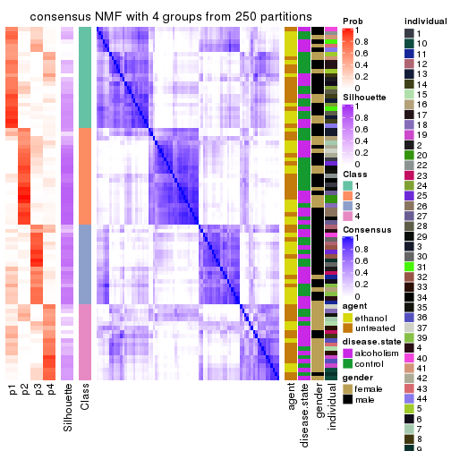</p>

</div>
<div id='tab-ATC-NMF-consensus-heatmap-4'>
<pre><code class="r">consensus_heatmap(res, k = 5)
</code></pre>

<p></p>

</div>
<div id='tab-ATC-NMF-consensus-heatmap-5'>
<pre><code class="r">consensus_heatmap(res, k = 6)
</code></pre>

<p></p>

</div>
</div>

Heatmaps for the membership of samples in all partitions to see how consistent they are:


<script>
$( function() {
	$( '#tabs-ATC-NMF-membership-heatmap' ).tabs();
} );
</script>
<div id='tabs-ATC-NMF-membership-heatmap'>
<ul>
<li><a href='#tab-ATC-NMF-membership-heatmap-1'>k = 2</a></li>
<li><a href='#tab-ATC-NMF-membership-heatmap-2'>k = 3</a></li>
<li><a href='#tab-ATC-NMF-membership-heatmap-3'>k = 4</a></li>
<li><a href='#tab-ATC-NMF-membership-heatmap-4'>k = 5</a></li>
<li><a href='#tab-ATC-NMF-membership-heatmap-5'>k = 6</a></li>
</ul>
<div id='tab-ATC-NMF-membership-heatmap-1'>
<pre><code class="r">membership_heatmap(res, k = 2)
</code></pre>

<p></p>

</div>
<div id='tab-ATC-NMF-membership-heatmap-2'>
<pre><code class="r">membership_heatmap(res, k = 3)
</code></pre>

<p></p>

</div>
<div id='tab-ATC-NMF-membership-heatmap-3'>
<pre><code class="r">membership_heatmap(res, k = 4)
</code></pre>

<p></p>

</div>
<div id='tab-ATC-NMF-membership-heatmap-4'>
<pre><code class="r">membership_heatmap(res, k = 5)
</code></pre>

<p></p>

</div>
<div id='tab-ATC-NMF-membership-heatmap-5'>
<pre><code class="r">membership_heatmap(res, k = 6)
</code></pre>

<p></p>

</div>
</div>

As soon as we have had the classes for columns, we can look for signatures
which are significantly different between classes which can be candidate marks
for certain classes. Following are the heatmaps for signatures.


Signature heatmaps where rows are scaled:


<script>
$( function() {
	$( '#tabs-ATC-NMF-get-signatures' ).tabs();
} );
</script>
<div id='tabs-ATC-NMF-get-signatures'>
<ul>
<li><a href='#tab-ATC-NMF-get-signatures-1'>k = 2</a></li>
<li><a href='#tab-ATC-NMF-get-signatures-2'>k = 3</a></li>
<li><a href='#tab-ATC-NMF-get-signatures-3'>k = 4</a></li>
<li><a href='#tab-ATC-NMF-get-signatures-4'>k = 5</a></li>
<li><a href='#tab-ATC-NMF-get-signatures-5'>k = 6</a></li>
</ul>
<div id='tab-ATC-NMF-get-signatures-1'>
<pre><code class="r">get_signatures(res, k = 2)
</code></pre>

<p></p>

</div>
<div id='tab-ATC-NMF-get-signatures-2'>
<pre><code class="r">get_signatures(res, k = 3)
</code></pre>

<p></p>

</div>
<div id='tab-ATC-NMF-get-signatures-3'>
<pre><code class="r">get_signatures(res, k = 4)
</code></pre>

<p></p>

</div>
<div id='tab-ATC-NMF-get-signatures-4'>
<pre><code class="r">get_signatures(res, k = 5)
</code></pre>

<p></p>

</div>
<div id='tab-ATC-NMF-get-signatures-5'>
<pre><code class="r">get_signatures(res, k = 6)
</code></pre>

<p></p>

</div>
</div>


Signature heatmaps where rows are not scaled:


<script>
$( function() {
	$( '#tabs-ATC-NMF-get-signatures-no-scale' ).tabs();
} );
</script>
<div id='tabs-ATC-NMF-get-signatures-no-scale'>
<ul>
<li><a href='#tab-ATC-NMF-get-signatures-no-scale-1'>k = 2</a></li>
<li><a href='#tab-ATC-NMF-get-signatures-no-scale-2'>k = 3</a></li>
<li><a href='#tab-ATC-NMF-get-signatures-no-scale-3'>k = 4</a></li>
<li><a href='#tab-ATC-NMF-get-signatures-no-scale-4'>k = 5</a></li>
<li><a href='#tab-ATC-NMF-get-signatures-no-scale-5'>k = 6</a></li>
</ul>
<div id='tab-ATC-NMF-get-signatures-no-scale-1'>
<pre><code class="r">get_signatures(res, k = 2, scale_rows = FALSE)
</code></pre>

<p></p>

</div>
<div id='tab-ATC-NMF-get-signatures-no-scale-2'>
<pre><code class="r">get_signatures(res, k = 3, scale_rows = FALSE)
</code></pre>

<p></p>

</div>
<div id='tab-ATC-NMF-get-signatures-no-scale-3'>
<pre><code class="r">get_signatures(res, k = 4, scale_rows = FALSE)
</code></pre>

<p></p>

</div>
<div id='tab-ATC-NMF-get-signatures-no-scale-4'>
<pre><code class="r">get_signatures(res, k = 5, scale_rows = FALSE)
</code></pre>

<p></p>

</div>
<div id='tab-ATC-NMF-get-signatures-no-scale-5'>
<pre><code class="r">get_signatures(res, k = 6, scale_rows = FALSE)
</code></pre>

<p></p>

</div>
</div>


Compare the overlap of signatures from different k:

```r
compare_signatures(res)
```


`get_signature()` returns a data frame invisibly. TO get the list of signatures, the function
call should be assigned to a variable explicitly. In following code, if `plot` argument is set
to `FALSE`, no heatmap is plotted while only the differential analysis is performed.

```r
# code only for demonstration
tb = get_signature(res, k = ..., plot = FALSE)
```

An example of the output of `tb` is:

```
#>   which_row         fdr    mean_1    mean_2 scaled_mean_1 scaled_mean_2 km
#> 1        38 0.042760348  8.373488  9.131774    -0.5533452     0.5164555  1
#> 2        40 0.018707592  7.106213  8.469186    -0.6173731     0.5762149  1
#> 3        55 0.019134737 10.221463 11.207825    -0.6159697     0.5749050  1
#> 4        59 0.006059896  5.921854  7.869574    -0.6899429     0.6439467  1
#> 5        60 0.018055526  8.928898 10.211722    -0.6204761     0.5791110  1
#> 6        98 0.009384629 15.714769 14.887706     0.6635654    -0.6193277  2
...
```

The columns in `tb` are:

1. `which_row`: row indices corresponding to the input matrix.
2. `fdr`: FDR for the differential test. 
3. `mean_x`: The mean value in group x.
4. `scaled_mean_x`: The mean value in group x after rows are scaled.
5. `km`: Row groups if k-means clustering is applied to rows.


UMAP plot which shows how samples are separated.


<script>
$( function() {
	$( '#tabs-ATC-NMF-dimension-reduction' ).tabs();
} );
</script>
<div id='tabs-ATC-NMF-dimension-reduction'>
<ul>
<li><a href='#tab-ATC-NMF-dimension-reduction-1'>k = 2</a></li>
<li><a href='#tab-ATC-NMF-dimension-reduction-2'>k = 3</a></li>
<li><a href='#tab-ATC-NMF-dimension-reduction-3'>k = 4</a></li>
<li><a href='#tab-ATC-NMF-dimension-reduction-4'>k = 5</a></li>
<li><a href='#tab-ATC-NMF-dimension-reduction-5'>k = 6</a></li>
</ul>
<div id='tab-ATC-NMF-dimension-reduction-1'>
<pre><code class="r">dimension_reduction(res, k = 2, method = &quot;UMAP&quot;)
</code></pre>

<p></p>

</div>
<div id='tab-ATC-NMF-dimension-reduction-2'>
<pre><code class="r">dimension_reduction(res, k = 3, method = &quot;UMAP&quot;)
</code></pre>

<p></p>

</div>
<div id='tab-ATC-NMF-dimension-reduction-3'>
<pre><code class="r">dimension_reduction(res, k = 4, method = &quot;UMAP&quot;)
</code></pre>

<p></p>

</div>
<div id='tab-ATC-NMF-dimension-reduction-4'>
<pre><code class="r">dimension_reduction(res, k = 5, method = &quot;UMAP&quot;)
</code></pre>

<p></p>

</div>
<div id='tab-ATC-NMF-dimension-reduction-5'>
<pre><code class="r">dimension_reduction(res, k = 6, method = &quot;UMAP&quot;)
</code></pre>

<p></p>

</div>
</div>


Following heatmap shows how subgroups are split when increasing `k`:

```r
collect_classes(res)
```


Test correlation between subgroups and known annotations. If the known
annotation is numeric, one-way ANOVA test is applied, and if the known
annotation is discrete, chi-squared contingency table test is applied.

```r
test_to_known_factors(res)
```

```
#>          n agent(p) disease.state(p) gender(p) individual(p) k
#> ATC:NMF 81  0.47143            0.408    0.8983       0.00173 2
#> ATC:NMF 72  0.00438            0.191    0.1182       0.02146 3
#> ATC:NMF 48  0.13220            0.930    0.0218       0.00340 4
#> ATC:NMF 39  0.10398            0.830    0.0769       0.00648 5
#> ATC:NMF 24  0.10551            0.274    0.7640       0.03094 6
```


If matrix rows can be associated to genes, consider to use `GO_Enrichment(res,
...)` to perform function enrichment for the signature genes.


 

## Session info


```r
sessionInfo()
```

```
#> R version 3.6.0 (2019-04-26)
#> Platform: x86_64-pc-linux-gnu (64-bit)
#> Running under: CentOS Linux 7 (Core)
#> 
#> Matrix products: default
#> BLAS:   /usr/lib64/libblas.so.3.4.2
#> LAPACK: /usr/lib64/liblapack.so.3.4.2
#> 
#> locale:
#>  [1] LC_CTYPE=en_GB.UTF-8       LC_NUMERIC=C               LC_TIME=en_GB.UTF-8       
#>  [4] LC_COLLATE=en_GB.UTF-8     LC_MONETARY=en_GB.UTF-8    LC_MESSAGES=en_GB.UTF-8   
#>  [7] LC_PAPER=en_GB.UTF-8       LC_NAME=C                  LC_ADDRESS=C              
#> [10] LC_TELEPHONE=C             LC_MEASUREMENT=en_GB.UTF-8 LC_IDENTIFICATION=C       
#> 
#> attached base packages:
#> [1] grid      parallel  stats     graphics  grDevices utils     datasets  methods   base     
#> 
#> other attached packages:
#>  [1] genefilter_1.66.0     ComplexHeatmap_2.1.1  markdown_1.1          knitr_1.26           
#>  [5] preprocessCore_1.46.0 cola_1.3.2            GEOquery_2.52.0       Biobase_2.44.0       
#>  [9] BiocGenerics_0.30.0   GetoptLong_0.1.7     
#> 
#> loaded via a namespace (and not attached):
#>  [1] bitops_1.0-6         matrixStats_0.55.0   bit64_0.9-7          doParallel_1.0.15   
#>  [5] RColorBrewer_1.1-2   httr_1.4.1           tools_3.6.0          backports_1.1.5     
#>  [9] R6_2.4.1             DBI_1.0.0            lazyeval_0.2.2       colorspace_1.4-1    
#> [13] withr_2.1.2          tidyselect_0.2.5     gridExtra_2.3        bit_1.1-14          
#> [17] compiler_3.6.0       xml2_1.2.2           microbenchmark_1.4-7 pkgmaker_0.28       
#> [21] slam_0.1-46          scales_1.1.0         readr_1.3.1          NMF_0.23.6          
#> [25] stringr_1.4.0        digest_0.6.23        pkgconfig_2.0.3      bibtex_0.4.2        
#> [29] highr_0.8            limma_3.40.6         rlang_0.4.2          GlobalOptions_0.1.1 
#> [33] RSQLite_2.1.2        impute_1.58.0        shape_1.4.4          mclust_5.4.5        
#> [37] dendextend_1.12.0    dplyr_0.8.3          RCurl_1.95-4.12      magrittr_1.5        
#> [41] Matrix_1.2-17        Rcpp_1.0.3           munsell_0.5.0        S4Vectors_0.22.1    
#> [45] viridis_0.5.1        lifecycle_0.1.0      stringi_1.4.3        plyr_1.8.4          
#> [49] blob_1.2.0           crayon_1.3.4         lattice_0.20-38      splines_3.6.0       
#> [53] annotate_1.62.0      circlize_0.4.9       hms_0.5.2            zeallot_0.1.0       
#> [57] pillar_1.4.2         rjson_0.2.20         rngtools_1.4         reshape2_1.4.3      
#> [61] codetools_0.2-16     stats4_3.6.0         XML_3.98-1.20        glue_1.3.1          
#> [65] evaluate_0.14        png_0.1-7            vctrs_0.2.0          foreach_1.4.7       
#> [69] polyclip_1.10-0      gtable_0.3.0         purrr_0.3.3          tidyr_1.0.0         
#> [73] clue_0.3-57          assertthat_0.2.1     ggplot2_3.2.1        xfun_0.11           
#> [77] gridBase_0.4-7       eulerr_6.0.0         xtable_1.8-4         skmeans_0.2-11      
#> [81] survival_2.44-1.1    viridisLite_0.3.0    tibble_2.1.3         iterators_1.0.12    
#> [85] AnnotationDbi_1.46.1 registry_0.5-1       memoise_1.1.0        IRanges_2.18.3      
#> [89] cluster_2.1.0        brew_1.0-6
```


